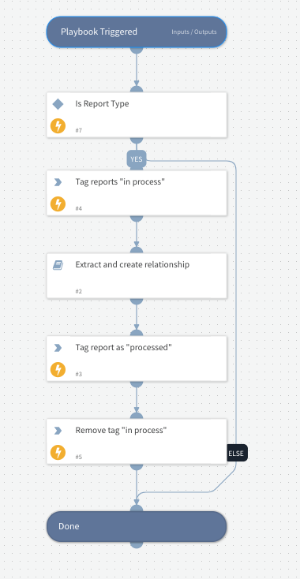

The RSS Feed integration provides information for the *RSS Create Indicators From Report* playbook.

The playbook:
1. Extracts indicators from Threat intel reports.
2. Creates relationships between the extracted indicators and the report.
3. Runs enrich indicators command on the extracted indicators. 

Cortex XSOAR recommends that you configure a job to execute this playbook. 

1. Configure a job that will run the *RSS Create Indicators From Report* playbook. 
      1. Select the *Triggered by delta in feed* option.
      2. Select the feed on which to run the job.
   

2. Configure input to the *RSS Create Indicators From Report* playbook:
   
    - From the context data input: Tag name - the indicator will be tagged with this value when the playbook finishes processing and all the indicators are extracted and relationships created.
   
    - From the indicators: Create a query to include only new report indicators that were not processed yet. Recommended query: "type:Report -tags:{Tag name configured from the context data input} -tags:in_process". 
   The playbook tags all indicators with the "in_process" tag when it starts running, and removes the tag when the playbook ends.
   If you want the playbook to run on a specific instance (a specific feed), add the following filter to the query: *sourceInstances:"{the selected instance}"*.

Note that if you selected the *Triggered by delta in feed* option when configuring the Job, the “Run only on new and modified indicators” playbook option is automatically selected.

## Dependencies
This playbook uses the following sub-playbooks, integrations, and scripts.

### Sub-playbooks
* Extract and create relationship

### Integrations
This playbook does not use any integrations.

### Scripts
This playbook does not use any scripts.

### Commands
* appendIndicatorField
* removeIndicatorField

## Playbook Inputs
---

| **Name** | **Description** | **Default Value** | **Required** |
| --- | --- | --- | --- |
| Indicator Query | Filter all Report indicators which haven't been processed. Make sure to add "-tags:in_process " to the query to filter out the reports that are in process and "-tags:\{tag_name_given_as_input\}" to filter out all processed reports. Example: type:Report -tags:processed -tags:in_process  | type:Report -tags:in_process -tags:processed | Optional |
| tag | The tag that will be added to each processed report. |  | Optional |

## Playbook Outputs
---
There are no outputs for this playbook.

## Playbook Image
---

## Known Limitations
Due to XSIAM not supporting the `!=` operator , it is advised to configure the indicator query in the XSIAM Indicators page. Save the created query. (Save icon found on the right side of the query).
Finally, when configuring the playbook inputs, go to the "From indicators" tab, and pick the saved query.
