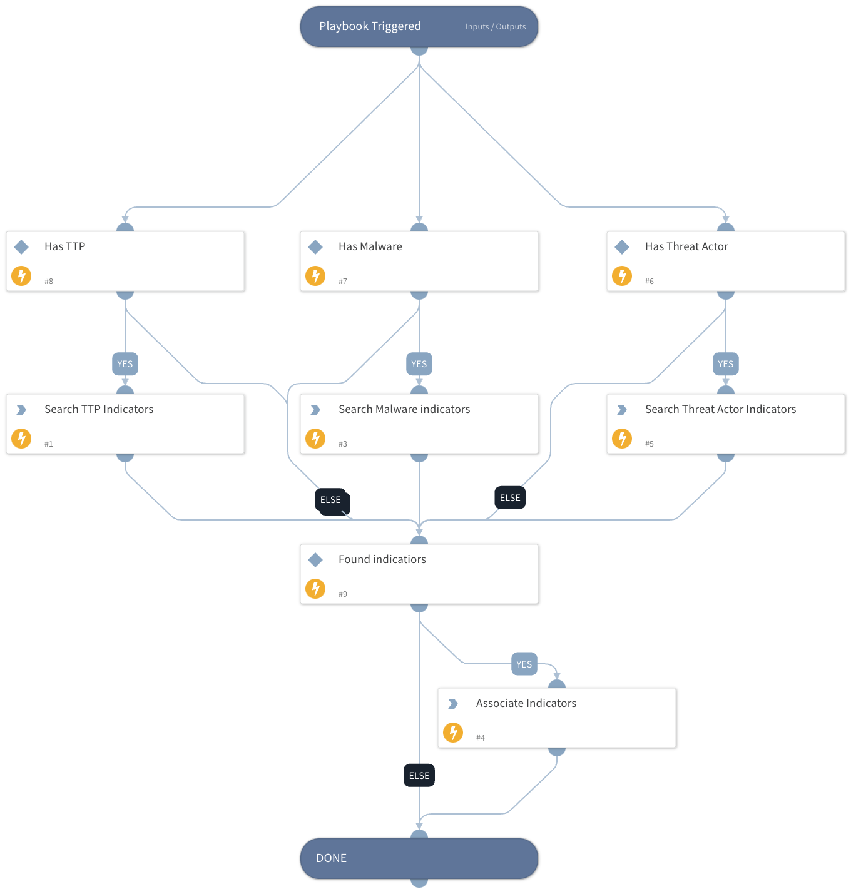

Links threat indicators to the report incident

## Dependencies

This playbook uses the following sub-playbooks, integrations, and scripts.

### Sub-playbooks

This playbook does not use any sub-playbooks.

### Integrations

This playbook does not use any integrations.

### Scripts

* SearchIndicator

### Commands

* associateIndicatorsToIncident

## Playbook Inputs

The playbook takes as input an incident created by the FeedlyArticle integration.

## Playbook Outputs

The playbook links the threat indicators to the incident.

## Playbook Image

