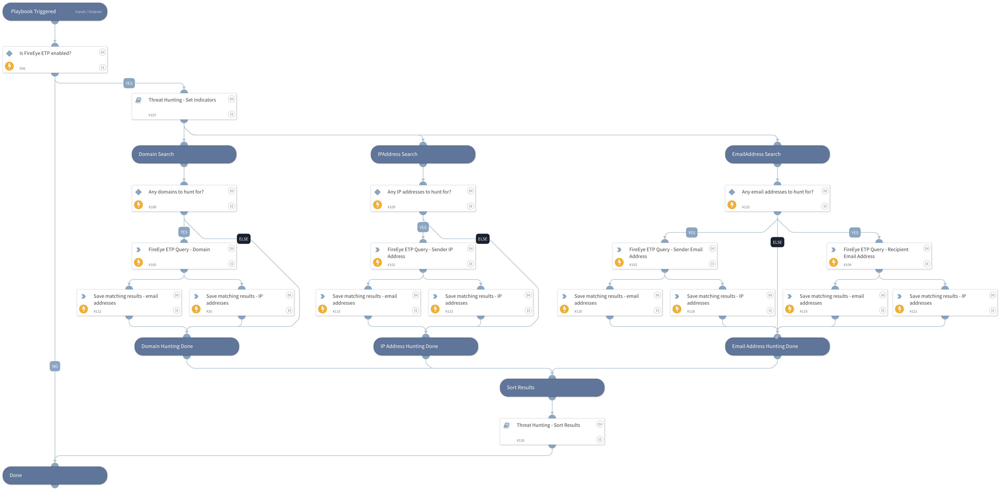

This playbook queries FireEye Email Threat Prevention (ETP) for indicators such as domains, IP addresses, sender and recipient email addresses.

This playbook outputs a list of detected users, IP addresses associated with the indicators, as well as the results of the FireEye Email Threat Prevention (ETP) query. 

## Dependencies
This playbook uses the following sub-playbooks, integrations, and scripts.

### Sub-playbooks
* Threat Hunting - Sort Results
* Threat Hunting - Set Indicators

### Integrations
* FireEye ETP

### Scripts
* SetAndHandleEmpty
* IsIntegrationAvailable

### Commands
* fireeye-etp-search-messages

## Playbook Inputs
---

| **Name** | **Description** | **Default Value** | **Required** |
| --- | --- | --- | --- |
| IPAddress | A single or multiple IP addresses to search for \(maximum of 10 entries\). Used for both source and destination IP addresses.  Separate multiple search values by commas only \(without spaces or any special characters\). |  | Optional |
| Domain | Single or multiple domains to search for \(maximum of 10 entries\).  Separate multiple search values by commas only \(without spaces or any special characters\). |  | Optional |
| EmailAddress | A single or multiple email addresses to search for \(maximum of 10 entries\). Used for both recipient and sender email addresses.  Separate multiple search values by commas only \(without spaces or any special characters\). |  | Optional |
| from_email_not_in | List of 'From' email-addresses not to be included, max limit of entries is 10. |  | Optional |
| recipients_not_in | list of 'To'/'Cc' email-addresses not to be included, max limit of entries is 10.  |  | Optional |
| has_attachments | Boolean value filter to indicate if the message has attachments. Values can be only 'true' or 'false'. |  | Optional |
| max_message_size | The default value is 20kb and maximum value is 100kb.  |  | Optional |
| from_accepted_date_time |  The time stamp of the email-accepted date to specify the beginning of the date range to search, e.g. 2017-10- 24T10:48:51.000Z . Specify 'to_accepted_date_time'  as well to set the complete date range for the search. |  | Required |
| to_accepted_date_time |  The time stamp of the email-accepted date to specify the end of the date range to search, e.g. 2017-10- 24T10:48:51.000Z . Specify 'from_accepted_date_time'  as well to set the complete date range for the search. |  | Required |
| last_modified_date_time | Date corresponding to last modified date, along with one of the following operators: "&amp;gt;", "&amp;lt;", "&amp;gt;=", "&amp;lt;=".  E.g. use value "&amp;lt;2017-10-24T18:00:00.000Z" to search for messages that were last modified after the specified time stamp.  |  | Optional |
| EmailStatus | List of email status values in FireEye EPT  Possible values are:  "accepted", "deleted", "delivered", "delivered \(retroactive\)", "dropped", "dropped oob", "dropped \(oob retroactive\)", "permanent failure", "processing", "quarantined", "rejected", "temporary failure". |  | Optional |
| EmailStatus_not_in | List of email status values in FireEye EPT to exclude from query.   Possible values are:  "accepted", "deleted", "delivered", "delivered \(retroactive\)", "dropped", "dropped oob", "dropped \(oob retroactive\)", "permanent failure", "processing", "quarantined", "rejected", "temporary failure". |  | Optional |
| rejection_reason |  list of ETP rejection reason codes. Possible values are:  "ETP102", "ETP103", "ETP104", "ETP200", "ETP201", "ETP203", "ETP204", "ETP205", "ETP300", "ETP301", "ETP302", "ETP401", "ETP402", "ETP403", "ETP404", "ETP405". |  | Optional |
| InternalRange | A list of internal IP ranges to check IP addresses against. The list should be provided in CIDR notation, separated by commas. An example of a list of ranges would be: "172.16.0.0/12,10.0.0.0/8,192.168.0.0/16" \(without quotes\). If a list is not provided, will use default list provided in the IsIPInRanges script \(the known IPv4 private address ranges\). |  | Optional |
| InternalDomainName | The organizations internal domain name. This is provided for the script IsInternalHostName that checks if the detected host names are internal or external if the hosts contain the internal domains suffix. For example demisto.com. If there is more than one domain, use the \| character to separate values such as \(demisto.com\|test.com\) |  | Optional |
| InternalHostRegex | This is provided for the script IsInternalHostName that checks if the detected host names are internal or external. If the hosts match the organization's naming convention. For example the host testpc1 will have the following regex \\w\{6\}\\d\{1\} |  | Optional |

## Playbook Outputs
---

| **Path** | **Description** | **Type** |
| --- | --- | --- |
| FireEyeETP.Message | Details of detected messages retrieved from FireEyeETP. | string |
| FireEyeETP.Message.verdicts | Verdicts \(pass/fail\) for FireEyeETP detected messages. | string |
| HuntingResults.DetectedExternalEmails | External email addresses retrieved from threat hunting queries. | string |
| HuntingResults.DetectedInternalEmails | Internal email addresses retrieved from threat hunting queries. | string |
| HuntingResults.DetectedEmails | A list of all email addresses retrieved from threat hunting queries. Playbook output is generated only when the internal domain name is not specified in the playbook input. | string |
| HuntingResults.DetectedExternalIPs | External IP addresses retrieved from threat hunting queries. | string |
| HuntingResults.DetectedInternalIPs | Internal IP addresses retrieved from threat hunting queries. | string |

## Playbook Image
---
