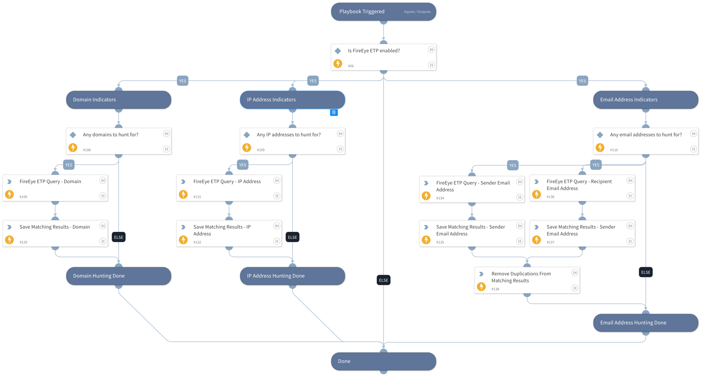

This playbook queries Trellix Email Security - Cloud for indicators such as domains, IP addresses, sender and recipient email addresses.
Separate searches are conducted for each type of indicator in the playbook.

Note that multiple search values should be separated by commas only (without spaces or any special characters).

## Dependencies
This playbook uses the following sub-playbooks, integrations, and scripts.

### Sub-playbooks
This playbook does not use any sub-playbooks.

### Integrations
* Trellix Email Security - Cloud

### Scripts
* SetAndHandleEmpty
* IsIntegrationAvailable

### Commands
* fireeye-etp-search-messages

## Playbook Inputs
---

| **Name** | **Description** | **Default Value** | **Required** |
| --- | --- | --- | --- |
| IPAddress | A single or multiple IP address to search for within Trellix Email Security - Cloud logs. Used for both source and destination IP addresses.  Separate multiple search values by commas only \(without spaces or any special characters\). |  | Optional |
| Domain | Single or multiple domains to search for within Trellix Email Security - Cloud logs. By default, the 'contains' clause is used.  Separate multiple search values by commas only \(without spaces or any special characters\). |  | Optional |
| EmailAddress | A single or multiple email addresses to search for within Trellix Email Security - Cloud logs. Used for both recipient and sender email addresses.  Separate multiple search values by commas only \(without spaces or any special characters\). |  | Optional |
| from_email_not_in | List of sender email addresses to be excluded. The max limit of entries is 10.  Separate multiple search values by commas only \(without spaces or any special characters\). |  | Optional |
| recipients_not_in | List of recipient email addresses to be excluded \(including "cc"\). The max limit of entries is 10.  Separate multiple search values by commas only \(without spaces or any special characters\). |  | Optional |
| has_attachments | Boolean value filter to indicate if the message has attachments. Values can be only 'true' or 'false'. |  | Optional |
| max_message_size | Select the message size \(in KB\) based on which you wish to retrieve messages from the Trellix Email Security - Cloud server.  The default value is 20 and the maximum value is 100. |  | Optional |
| from_accepted_date_time | The start date and time from which you would like to retrieve messages from the Trellix Email Security - Cloud server, e.g. 2017-10-24T10:48:51.000Z.  For a complete date range, specify 'to_accepted_date_time' as well. |  | Required |
| to_accepted_date_time | The end date and time specify the period of time in which messages should be retrieved from the Trellix Email Security - Cloud server, e.g. 2017-10-24T10:48:51.000Z.  For a complete date range, specify 'from_accepted_date_time' as well. |  | Required |
| last_modified_date_time | The last date and time messages were modified in order to retrieve them from the Trellix Email Security - Cloud server.   Dates and times should be accompanied by one of the following operators: "&amp;gt;", "&amp;lt;", "&amp;gt;=", "&amp;lt;=".  E.g. use value "&amp;lt;2017-10-24T18:00:00.000Z" to search for messages that were last modified after the specified time stamp. |  | Optional |
| status | Filter messages to be retrieved from the Trellix Email Security - Cloud server based on their email message status.  Possible values are: "accepted", "deleted", "delivered", "delivered \(retroactive\)", "dropped", "dropped oob", "dropped \(oob retroactive\)", "permanent failure", "processing", "quarantined", "rejected", "temporary failure".  Separate multiple search values by commas only \(without spaces or any special characters\). |  | Optional |
| status_not_in | Exclude messages from being retrieved from the Trellix Email Security - Cloud server based on the email message status.  Possible values are: "accepted", "deleted", "delivered", "delivered \(retroactive\)", "dropped", "dropped oob", "dropped \(oob retroactive\)", "permanent failure", "processing", "quarantined", "rejected", "temporary failure".  Separate multiple search values by commas only \(without spaces or any special characters\). |  | Optional |
| rejection_reason | Filter messages that should be retrieved from the Trellix Email Security - Cloud server based on the email rejection reason.  Possible values are:  "ETP102", "ETP103", "ETP104", "ETP200", "ETP201", "ETP203", "ETP204", "ETP205", "ETP300", "ETP301", "ETP302", "ETP401", "ETP402", "ETP403", "ETP404", "ETP405".  Separate multiple search values by commas only \(without spaces or any special characters\). |  | Optional |
| subject | Filter messages that should be retrieved from the Trellix Email Security - Cloud  server based on the email subject \(string\).  The max limit of entries is 10.  Separate multiple search values by commas only \(without spaces or any special characters\). |  | Optional |

## Playbook Outputs
---

| **Path** | **Description** | **Type** |
| --- | --- | --- |
| FireEyeETP.HuntingResults | Email message objects and fields that were retrieved from Trellix Email Security - Cloud. | string |
| FireEyeETP.HuntingResults.acceptedDateTime | Message accepted date. | string |
| FireEyeETP.HuntingResults.lastModifiedDateTime | Message last modified date. | string |
| FireEyeETP.HuntingResults.countryCode | Sender country code. | string |
| FireEyeETP.HuntingResults.domain | Domain. | string |
| FireEyeETP.HuntingResults.recipientHeader | List of message recipients header \(includes the display name of the user\). | string |
| FireEyeETP.HuntingResults.recipients | List of message recipients. | string |
| FireEyeETP.HuntingResults.senderHeader | Message sender header \(includes the display name of the user\). | string |
| FireEyeETP.HuntingResults.sender | Message sender address. | string |
| FireEyeETP.HuntingResults.senderSMTP | Message sender SMTP. | string |
| FireEyeETP.HuntingResults.senderIP | Message sender IP. | string |
| FireEyeETP.HuntingResults.status | Message status. | string |
| FireEyeETP.HuntingResults.subject | Message subject | string |
| FireEyeETP.HuntingResults.id | Message ID. | string |

## Playbook Image
---
