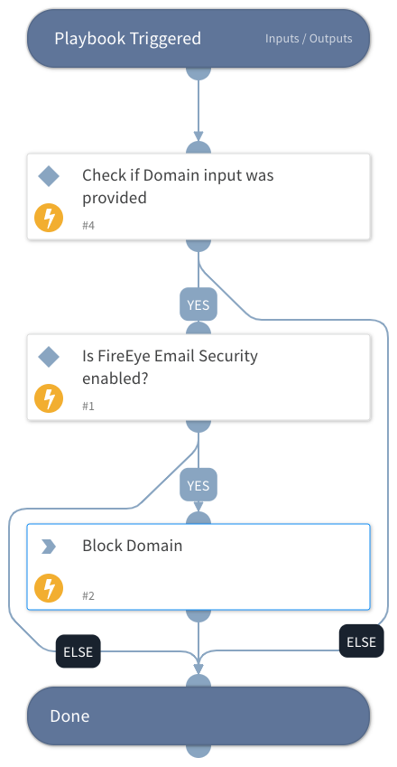

This playbook blocks domains using FireEye Email Security.
The playbook checks whether the FireEye Email Security integration is enabled, whether the Domain input has been provided and if so, blocks the domain.

## Dependencies
This playbook uses the following sub-playbooks, integrations, and scripts.

### Sub-playbooks
This playbook does not use any sub-playbooks.

### Integrations
* FireEyeEX

### Scripts
This playbook does not use any scripts.

### Commands
* fireeye-ex-create-blockedlist

## Playbook Inputs
---

| **Name** | **Description** | **Default Value** | **Required** |
| --- | --- | --- | --- |
| Domain | The Domain to block. |  | Optional |

## Playbook Outputs
---
There are no outputs for this playbook.

## Playbook Image
---
