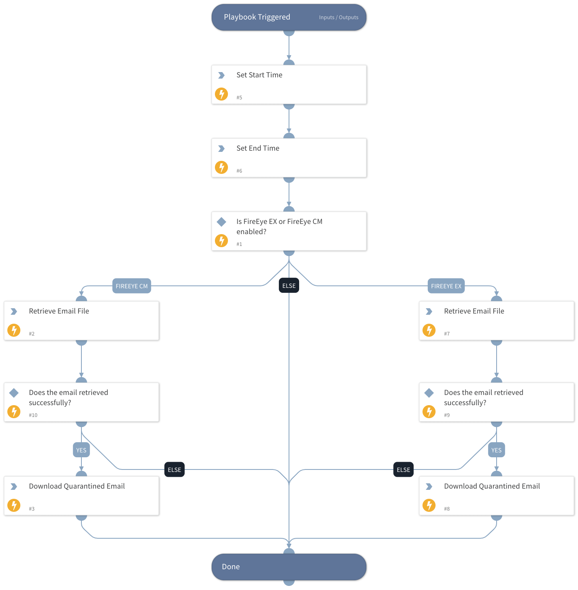

Retrieve a specified eml/msg file directly from FireEye Email Security or Central Management.

## Dependencies
This playbook uses the following sub-playbooks, integrations, and scripts.

### Sub-playbooks
This playbook does not use any sub-playbooks.

### Integrations
* FireEyeEX

### Scripts
* Set

### Commands
* fireeye-cm-get-quarantined-emails
* fireeye-ex-download-quarantined-emails
* fireeye-cm-download-quarantined-emails
* fireeye-ex-get-quarantined-emails

## Playbook Inputs
---

| **Name** | **Description** | **Default Value** | **Required** |
| --- | --- | --- | --- |
| MessageID | The email UUID provided by FireEye. |  | Optional |
| EmailTimestamp | The Timestamp of the email received.  |  | Optional |

## Playbook Outputs
---

| **Path** | **Description** | **Type** |
| --- | --- | --- |
| File | The MSG/EML File | unknown |
| FireEyeCM.QuarantinedEmail | The Queue Email | unknown |
| FireEyeEX.QuarantinedEmail | The Queue Email | unknown |

## Playbook Image
---
