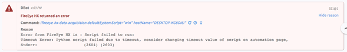

FireEye Endpoint Security is an integrated solution that detects what others miss and protects endpoint against known and unknown threats. The HX Demisto integration provides access to information about endpoints, acquisitions, alerts, indicators, and containment. Customers can extract critical data and effectively operate security operations automated playbook.

## Configure FireEye HX in Cortex


| **Parameter** | **Required** |
| --- | --- |
| Server URL (e.g. https://192.168.0.1:3000) | True |
| Credentials | True |
| Password | True |
| Version | True |
| Trust any certificate (not secure) | False |
| Use system proxy settings | False |
| Fetch incidents | False |
| Incident type | False |
| Fetch limit | False |
| Incidents Fetch Interval | False |

## Commands
You can execute these commands from the CLI, as part of an automation, or in a playbook.
After you successfully execute a command, a DBot message appears in the War Room with the command details.
### fireeye-hx-host-containment
***
Apply containment for a specific host, so that it no longer has access to other systems.


#### Base Command

`fireeye-hx-host-containment`
#### Input

| **Argument Name** | **Description** | **Required** |
| --- | --- | --- |
| hostName | The host name to be contained. If the hostName is not specified, the agentId must be specified. | Optional | 
| agentId | The agent id running on the host to be contained. If the agentId is not specified, the hostName must be specified. | Optional | 


#### Context Output

| **Path** | **Type** | **Description** |
| --- | --- | --- |
| FireEyeHX.Hosts._id | Unknown | FireEye HX Agent ID. | 
| FireEyeHX.Hosts.agent_version | Unknown | The agent version. | 
| FireEyeHX.Hosts.excluded_from_containment | Unknown | Determines whether the host is excluded from containment. | 
| FireEyeHX.Hosts.containment_missing_software | Unknown | Boolean value to indicate for containment missing software. | 
| FireEyeHX.Hosts.containment_queued | Unknown | Determines whether the host is queued for containment. | 
| FireEyeHX.Hosts.containment_state | Unknown | The containment state of the host. Possible values normal, contain, contain_fail, containing, contained, uncontain, uncontaining, wtfc, wtfu. | 
| FireEyeHX.Hosts.stats.alerting_conditions | Unknown | The number of conditions that have alerted for the host. | 
| FireEyeHX.Hosts.stats.alerts | Unknown | Total number of alerts, including exploit-detection alerts. | 
| FireEyeHX.Hosts.stats.exploit_blocks | Unknown | The number of blocked exploits on the host. | 
| FireEyeHX.Hosts.stats.malware_alerts | Unknown | The number of malware alerts associated with the host. | 
| FireEyeHX.Hosts.hostname | Unknown | The host name. | 
| FireEyeHX.Hosts.domain | Unknown | Domain name. | 
| FireEyeHX.Hosts.timezone | Unknown | Host time zone. | 
| FireEyeHX.Hosts.primary_ip_address | Unknown | The host IP address. | 
| FireEyeHX.Hosts.last_poll_timestamp | Unknown | The timestamp of the last system poll preformed on the host. | 
| FireEyeHX.Hosts.initial_agent_checkin | Unknown | Timestamp of the initial agent check-in. | 
| FireEyeHX.Hosts.last_alert_timestamp | Unknown | The time stamp of the last alert for the host. | 
| FireEyeHX.Hosts.last_exploit_block_timestamp | Unknown | Time when the last exploit was blocked on the host. The value is null if no exploits have been blocked. | 
| FireEyeHX.Hosts.os.product_name | Unknown | Specific operating system | 
| FireEyeHX.Hosts.os.bitness | Unknown | OS Bitness. | 
| FireEyeHX.Hosts.os.platform | Unknown | Family of operating systems. Valid values are win, osx, and linux. | 
| FireEyeHX.Hosts.primary_mac | Unknown | The host MAC address. | 


#### Command Example
``` !fireeye-hx-host-containment agentId=”uGvn34ZkM3bfSf1nOT” ```
```!fireeye-hx-host-containment hostname=“DESKTOP-HK8OI62”```

#### Context Example
```json
 {  
   "FireEyeHX":{  
      "Hosts":{  
         "last_alert":{  
            "url":"/hx/api/v3/alerts/5",
            "_id":5
         },
         "domain":"DEMISTO",
         "last_exploit_block_timestamp":null,
         "containment_state":"contain",
         "timezone":"Eastern Daylight Time",
         "gmt_offset_seconds":-14400,
         "initial_agent_checkin":"2018-03-26T14:21:31.273Z",
         "stats":{  
            "alerting_conditions":1,
            "exploit_alerts":0,
            "acqs":11,
            "malware_false_positive_alerts":0,
            "alerts":1,
            "exploit_blocks":0,
            "malware_cleaned_count":0,
            "malware_alerts":0,
            "malware_quarantined_count":0
         },
         "primary_mac":"XX-XX-XX-XX-XX-XX",
         "hostname":"DESKTOP-XXX",
         "primary_ip_address":"^^^XX.XX.XX.XX^^^",
         "last_audit_timestamp":"2018-05-03T13:59:23.000Z",
         "last_alert_timestamp":"2018-04-16T08:59:51.693+00:00",
         "containment_queued":false,
         "sysinfo":{  
            "url":"/hx/api/v3/hosts/uGvnGVpZkDSFySf2ZOiT/sysinfo"
         },
         "last_exploit_block":null,
         "reported_clone":false,
         "url":"/hx/api/v3/hosts/uGvnGVpZkeySf2ZOiT",
         "excluded_from_containment":false,
         "last_poll_timestamp":"2018-05-03T14:01:22.000Z",
         "last_poll_ip":"^^^XX.XX.XX.XX^^^",
         "containment_missing_software":false,
         "_id":" uGvnGVpZkDSFySf2ZOiT ",
         "os":{  
            "kernel_version":null,
            "platform":"win",
            "patch_level":null,
            "bitness":"64-bit",
            "product_name":"Windows 10 Enterprise Evaluation"
         },
         "agent_version":"26.21.10"
      }
   }
}
```


### fireeye-hx-cancel-containment
***
Release a specific host from containment.


#### Base Command

`fireeye-hx-cancel-containment`
#### Input

| **Argument Name** | **Description** | **Required** |
| --- | --- | --- |
| hostName | The host name to be contained. If the hostName is not specified, the agentId must be specified. | Optional | 
| agentId | The agent id running on the host to be contained. If the agentId is not specified, the hostName must be specified. | Optional | 


#### Context Output

| **Path** | **Type** | **Description** |
| --- | --- | --- |
| FireEyeHX.Hosts._id | Unknown | FireEye HX Agent ID. | 
| FireEyeHX.Hosts.agent_version | Unknown | The agent version. | 
| FireEyeHX.Hosts.excluded_from_containment | Unknown | Determines whether the host is excluded from containment. | 
| FireEyeHX.Hosts.containment_missing_software | Unknown | Boolean value to indicate for containment missing software. | 
| FireEyeHX.Hosts.containment_queued | Unknown | Determines whether the host is queued for containment. | 
| FireEyeHX.Hosts.containment_state | Unknown | The containment state of the host. Possible values normal, contain, contain_fail, containing, contained, uncontain, uncontaining, wtfc, wtfu. | 
| FireEyeHX.Hosts.stats.alerting_conditions | Unknown | The number of conditions that have alerted for the host. | 
| FireEyeHX.Hosts.stats.alerts | Unknown | Total number of alerts, including exploit-detection alerts. | 
| FireEyeHX.Hosts.stats.exploit_blocks | Unknown | The number of blocked exploits on the host. | 
| FireEyeHX.Hosts.stats.malware_alerts | Unknown | The number of malware alerts associated with the host. | 
| FireEyeHX.Hosts.hostname | Unknown | The host name. | 
| FireEyeHX.Hosts.domain | Unknown | Domain name. | 
| FireEyeHX.Hosts.timezone | Unknown | Host time zone. | 
| FireEyeHX.Hosts.primary_ip_address | Unknown | The host IP address. | 
| FireEyeHX.Hosts.last_poll_timestamp | Unknown | The timestamp of the last system poll preformed on the host. | 
| FireEyeHX.Hosts.initial_agent_checkin | Unknown | Timestamp of the initial agent check-in. | 
| FireEyeHX.Hosts.last_alert_timestamp | Unknown | The time stamp of the last alert for the host. | 
| FireEyeHX.Hosts.last_exploit_block_timestamp | Unknown | Time when the last exploit was blocked on the host. The value is null if no exploits have been blocked. | 
| FireEyeHX.Hosts.os.product_name | Unknown | Specific operating system | 
| FireEyeHX.Hosts.os.bitness | Unknown | OS Bitness. | 
| FireEyeHX.Hosts.os.platform | Unknown | Family of operating systems. Valid values are win, osx, and linux. | 
| FireEyeHX.Hosts.primary_mac | Unknown | The host MAC address. | 


#### Command Examples
```!fireeye-hx-cancel-containment hostname=“DESKTOP-HK8OI62”```
```!fireeye-hx-cancel-containment agentId=”uGvn34ZkM3bfSf1nOT”```

#### Context Example
```json
{
    "FireEyeHX": {
        "Hosts": {
            "last_alert": {
                "url": "/hx/api/v3/alerts/5", 
                "_id": 5
            }, 
            "domain": "DEMISTO", 
            "last_exploit_block_timestamp": null, 
            "containment_state": "normal", 
            "timezone": "Eastern Daylight Time", 
            "gmt_offset_seconds": -14400, 
            "initial_agent_checkin": "2018-03-26T14:21:31.273Z", 
            "stats": {
                "alerting_conditions": 1, 
                "exploit_alerts": 0, 
                "acqs": 11, 
                "malware_false_positive_alerts": 0, 
                "alerts": 1, 
                "exploit_blocks": 0, 
                "malware_cleaned_count": 0, 
                "malware_alerts": 0, 
                "malware_quarantined_count": 0
            }, 
            "primary_mac": "XX-XX-XX-XX-XX-XX", 
            "hostname": "DESKTOP-XXX", 
            "primary_ip_address": "^^^XX.XX.XX.XX^^^", 
            "last_audit_timestamp": "2018-05-03T13:59:23.000Z", 
            "last_alert_timestamp": "2018-04-16T08:59:51.693+00:00", 
            "containment_queued": false, 
            "sysinfo": {
                "url": "/hx/api/v3/hosts/uGvnGVpZkDSFySf2ZOiT/sysinfo"
            }, 
            "last_exploit_block": null, 
            "reported_clone": false, 
            "url": "/hx/api/v3/hosts/uGvnGVpZkeySf2ZOiT", 
            "excluded_from_containment": false, 
            "last_poll_timestamp": "2018-05-03T14:01:22.000Z", 
            "last_poll_ip": "^^^XX.XX.XX.XX^^^", 
            "containment_missing_software": false, 
            "_id": " uGvnGVpZkDSFySf2ZOiT ", 
            "os": {
                "kernel_version": null, 
                "platform": "win", 
                "patch_level": null, 
                "bitness": "64-bit", 
                "product_name": "Windows 10 Enterprise Evaluation"
            }, 
            "agent_version": "26.21.10"
        }
    }
 }
```


### fireeye-hx-get-alerts
***
Get a list of alerts, use the different arguments to filter the results returned.


#### Base Command

`fireeye-hx-get-alerts`
#### Input

| **Argument Name** | **Description** | **Required** |
| --- | --- | --- |
| hasShareMode | Identifies which alerts result from indicators with the specified share mode. Possible values are: any, restricted, unrestricted. | Optional | 
| resolution | Sorts the results by the specified field. Possible values are: active_threat, alert, block, partial_block. | Optional | 
| agentId | Filter by the agent ID. | Optional | 
| conditionId | Filter by condition ID. | Optional | 
| eventAt | Filter event occurred time. ISO-8601 timestamp.. | Optional | 
| alertId | Filter by alert ID. | Optional | 
| matchedAt | Filter by match detection time. ISO-8601 timestamp. | Optional | 
| minId | Filter that returns only records with an AlertId field value great than the minId value. | Optional | 
| reportedAt | Filter by reported time. ISO-8601 timestamp. | Optional | 
| IOCsource | Source of alert- indicator of compromise. Possible values are: yes. | Optional | 
| EXDsource | Source of alert - exploit detection. Possible values are: yes. | Optional | 
| MALsource | Source of alert - malware alert. Possible values are: yes. | Optional | 
| limit | Limit the results returned. | Optional | 
| sort | Sorts the results by the specified field in ascending order. Possible values are: agentId, conditionId, eventAt, alertId, matchedAt, id, reportedAt. | Optional | 
| sortOrder | The sort order for the results. Possible values are: ascending, descending. | Optional | 


#### Context Output

| **Path** | **Type** | **Description** |
| --- | --- | --- |
| FireEyeHX.Alerts._id | Unknown | FireEye alert ID. | 
| FireEyeHX.Alerts.agent._id | Unknown | FireEye agent ID. | 
| FireEyeHX.Alerts.agent.containment_state | Unknown | Host containment state. | 
| FireEyeHX.Alerts.condition._id | Unknown | The condition unique ID. | 
| FireEyeHX.Alerts.event_at | Unknown | Time when the event occoured. | 
| FireEyeHX.Alerts.matched_at | Unknown | Time when the event was matched. | 
| FireEyeHX.Alerts.reported_at | Unknown | Time when the event was reported. | 
| FireEyeHX.Alerts.source | Unknown | Source of alert. | 
| FireEyeHX.Alerts.matched_source_alerts._id | Unknown | Source alert ID. | 
| FireEyeHX.Alerts.matched_source_alerts.appliance_id | Unknown | Appliance ID | 
| FireEyeHX.Alerts.matched_source_alerts.meta | Unknown | Source alert meta. | 
| FireEyeHX.Alerts.matched_source_alerts.indicator_id | Unknown | Indicator ID. | 
| FireEyeHX.Alerts.resolution | Unknown | Alert resulotion. | 
| FireEyeHX.Alerts.event_type | Unknown | Event type. | 


#### Command Example
```!fireeye-hx-get-alerts limit="10" sort="id" sortOrder="descending" ```

#### Context Example
```json
{
    "FireEyeHX": {
        "Alerts": {
            "_id": 5,
            "agent": {
                "_id": "uGvnGVp…4bKeySf2ZOiT",
                "containment_state": "normal",
                "url": "/hx/api/v3/hosts/ uGvnGVp…4bKeySf2ZOiT "
            },
            "condition": {
                "_id": "CSaoSZFw…JNPW0mw==",
                "url": "/hx/api/v3/conditions/ CSaoSZFw…JNPW0mw =="
            },
            "event_at": "2018-04-16T08:59:02.061Z",
            "event_id": 7885715,
            "event_type": "fileWriteEvent",
            "event_values": {
                "fileWriteEvent/closed": 1,
                "fileWriteEvent/dataAtLowestOffset": "dGVzdGVzdA==",
                "fileWriteEvent/devicePath": "\\Device\\HarddiskVolume2",
                "fileWriteEvent/drive": "C",
                "fileWriteEvent/fileExtension": "txt",
                "fileWriteEvent/fileName": "testest - Copy.txt",
                "fileWriteEvent/filePath": "Users\\demistodev\\Documents",
                "fileWriteEvent/fullPath": "C:\\Users\\User\\Documents\\testest - Copy.txt",
                "fileWriteEvent/lowestFileOffsetSeen": 0,
                "fileWriteEvent/md5": " c3add7b947…817c79f7b7bd ",
                "fileWriteEvent/numBytesSeenWritten": 7,
                "fileWriteEvent/pid": 3308,
                "fileWriteEvent/process": "explorer.exe",
                "fileWriteEvent/processPath": "C:\\Windows",
                "fileWriteEvent/size": 7,
                "fileWriteEvent/textAtLowestOffset": "testest",
                "fileWriteEvent/timestamp": "2018-04-16T08:59:02.061Z",
                "fileWriteEvent/username": "DEMISTO\\User",
                "fileWriteEvent/writes": 1
            },
            "is_false_positive": null,
            "matched_at": "2018-04-16T08:59:10.000Z",
            "matched_source_alerts": [],
            "reported_at": "2018-04-16T08:59:51.693Z",
            "resolution": "ALERT",
            "source": "IOC",
            "url": "/hx/api/v3/alerts/5"
        }
    },
    "File": [
        {
            "Extension": "txt",
            "MD5": "c3add7b947…817c79f7b7bd",
            "Name": "testest - Copy.txt",
            "Path": "C:\\Users\\User\\Documents\\testest - Copy.txt"
        }
    ],
    "IP": [],	
    "RrgistryKey": []
}

```


### fireeye-hx-suppress-alert
***
Suppress alert by ID


#### Base Command

`fireeye-hx-suppress-alert`
#### Input

| **Argument Name** | **Description** | **Required** |
| --- | --- | --- |
| alertId | The alert id. The alert id is listed in the output of 'get-alerts' command. | Optional | 


#### Context Output

There is no context output for this command.

#### Command Example
``` !fireeye-hx-suppress-alert alertId=2 ```


### fireeye-hx-get-indicators
***
Get a list of indicators


#### Base Command

`fireeye-hx-get-indicators`
#### Input

| **Argument Name** | **Description** | **Required** |
| --- | --- | --- |
| category | The indicator category. | Optional | 
| searchTerm | The searchTerm can be any name, category, signature, source, or condition value. | Optional | 
| shareMode | Determines who can see the indicator. You must belong to the correct authorization group . Possible values are: any, restricted, unrestricted, visible. | Optional | 
| sort | Sorts the results by the specified field in ascending  order. Possible values are: category, activeSince, createdBy, alerted. | Optional | 
| createdBy | Person who created the indicator. | Optional | 
| alerted | Whether the indicator resulted in alerts. Possible values are: yes, no. | Optional | 
| limit | Limit the number of results. | Optional | 


#### Context Output

| **Path** | **Type** | **Description** |
| --- | --- | --- |
| FireEyeHX.Indicators._id | Unknown | FireEye unique indicator ID. | 
| FireEyeHX.Indicators.name | Unknown | The indicator name as displayed in the UI. | 
| FireEyeHX.Indicators.description | Unknown | Indicator description. | 
| FireEyeHX.Indicators.category.name | Unknown | Catagory name. | 
| FireEyeHX.Indicators.created_by | Unknown | The "Created By" field as displayed in UI | 
| FireEyeHX.Indicators.active_since | Unknown | Date indicator became active. | 
| FireEyeHX.Indicators.stats.source_alerts | Unknown | Total number of source alerts associated with this indicator. | 
| FireEyeHX.Indicators.stats.alerted_agents | Unknown | Total number of agents with HX alerts associated with this indicator. | 
| FireEyeHX.Indicators.platforms | Unknown | List of families of operating systems. | 
| FireEyeHX.Indicators.uri_name | String | URI formatted name of the indicator. | 
| FireEyeHX.Indicators.category.uri_name | String | URI name of the category. | 


#### Command Example
```!fireeye-hx-get-indicators limit=2```

#### Context Example
```json
{
    "FireEyeHX": {
        "Indicators": [
            {
                "_id": "34757fe7-bdd7-4c85-b0e1-9adfb5e48300",
                "_revision": "20211017115618818832920449",
                "active_since": "2021-10-17T11:56:18.818Z",
                "category": {
                    "_id": 2,
                    "name": "Custom",
                    "share_mode": "unrestricted",
                    "uri_name": "Custom",
                    "url": "/hx/api/v3/indicator_categories/custom"
                },
                "create_actor": {
                    "_id": 1001,
                    "username": "api-admin"
                },
                "create_text": null,
                "created_by": "api-admin",
                "description": null,
                "display_name": null,
                "meta": null,
                "name": "34757fe7-bdd7-4c85-b0e1-9adfb5e48300",
                "platforms": [
                    "win",
                    "osx",
                    "linux"
                ],
                "signature": null,
                "stats": {
                    "active_conditions": 0,
                    "alerted_agents": 0,
                    "source_alerts": 0
                },
                "update_actor": {
                    "_id": 1001,
                    "username": "api-admin"
                },
                "uri_name": "34757fe7-bdd7-4c85-b0e1-9adfb5e48300",
                "url": "/hx/api/v3/indicators/custom/34757fe7_bdd7_4c85_b0e1_9adfb5e48300"
            },
            {
                "_id": "c6286e1b-10bd-4046-8aff-0dbcc5b1e974",
                "_revision": "20201214155227728995101265",
                "active_since": "2021-09-28T14:44:04.245Z",
                "category": {
                    "_id": 7,
                    "name": "Mandiant Unrestricted Intel",
                    "share_mode": "unrestricted",
                    "uri_name": "mandiant_unrestricted",
                    "url": "/hx/api/v3/indicator_categories/mandiant_unrestricted"
                },
                "create_actor": {
                    "_id": 3,
                    "username": "mandiant"
                },
                "create_text": "General_Windows_unrestricted_2021.09.270849",
                "created_by": "General_Windows_unrestricted_2021.09.270849",
                "description": "This IOC alerts on suspicious filewrites by the legitimate solarwinds process solarwinds.businesslayerhost.exe. solarwinds.businesslayerhost.exe is part of the the Network Performance Monitor (NPM) module of Solarwinds; responsible for detecting and diagnosing network performance issues. This may be an evidence of SUNBURST which is a backdoor that has the ability to spawn and kill processes, write and delete files, set and create registry keys, gather system information, and disable a set of forensic analysis tools and services.This is associated with MITRE ATT&CK (r) Tactic(s): Initial Access and Technique(s): T1195.002.",
                "display_name": "SUNBURST SUSPICIOUS FILEWRITES (METHODOLOGY)",
                "meta": null,
                "name": "SUNBURST SUSPICIOUS FILEWRITES (METHODOLOGY)",
                "platforms": [
                    "win",
                    "osx",
                    "linux"
                ],
                "signature": null,
                "stats": {
                    "active_conditions": 6,
                    "alerted_agents": 0,
                    "source_alerts": 0
                },
                "update_actor": {
                    "_id": 3,
                    "username": "mandiant"
                },
                "uri_name": "c6286e1b-10bd-4046-8aff-0dbcc5b1e974",
                "url": "/hx/api/v3/indicators/mandiant_unrestricted/c6286e1b_10bd_4046_8aff_0dbcc5b1e974"
            }
        ]
    }
}
```

#### Human Readable Output

>### FireEye HX Get Indicator- None
>|OS|Name|Created By|Active Since|Category|Signature|Active Condition|Hosts With Alerts|Source Alerts|
>|---|---|---|---|---|---|---|---|---|
>| win, osx, linux | 34757fe7-bdd7-4c85-b0e1-9adfb5e48300 | api-admin | 2021-10-17T11:56:18.818Z | Custom |  | 0 | 0 | 0 |
>| win, osx, linux | SUNBURST SUSPICIOUS FILEWRITES (METHODOLOGY) | General_Windows_unrestricted_2021.09.270849 | 2021-09-28T14:44:04.245Z | Mandiant Unrestricted Intel |  | 6 | 0 | 0 |


### fireeye-hx-get-indicator
***
Get a specific indicator details


#### Base Command

`fireeye-hx-get-indicator`
#### Input

| **Argument Name** | **Description** | **Required** |
| --- | --- | --- |
| category | Indicator category. Please use the `uri_category` value. | Required | 
| name | Indicator name. Please use the `uri_name` value. | Required | 


#### Context Output

| **Path** | **Type** | **Description** |
| --- | --- | --- |
| FireEyeHX.Indicators._id | Unknown | FireEye unique indicator ID. | 
| FireEyeHX.Indicators.name | Unknown | The indicator name as displayed in the UI. | 
| FireEyeHX.Indicators.description | Unknown | Indicator description. | 
| FireEyeHX.Indicators.category.name | Unknown | Catagory name. | 
| FireEyeHX.Indicators.created_by | Unknown | The "Created By" field as displayed in UI | 
| FireEyeHX.Indicators.active_since | Unknown | Date indicator became active. | 
| FireEyeHX.Indicators.stats.source_alerts | Unknown | Total number of source alerts associated with this indicator. | 
| FireEyeHX.Indicators.stats.alerted_agents | Unknown | Total number of agents with HX alerts associated with this indicator. | 
| FireEyeHX.Indicators.platforms | Unknown | List of families of operating systems. | 
| FireEyeHX.Conditions._id | Unknown | FireEye unique condition ID. | 
| FireEyeHX.Conditions.event_type | Unknown | Event type. | 
| FireEyeHX.Conditions.enabled | Unknown | Indicates whether the condition is enabled. | 


#### Command Example
```!fireeye-hx-get-indicator category=Custom name="5def0b16-87bc-42a2-877a-bca45ebcbc9a"```

#### Context Example
```json
{
    "FireEyeHX": {
        "Conditions": [
            {
                "_id": "YhXur1M8FNRDi8GAr9CMbQ==",
                "enabled": true,
                "event_type": "dnsLookupEvent",
                "is_private": false,
                "tests": [
                    {
                        "operator": "equal",
                        "token": "dnsLookupEvent/hostname",
                        "type": "text",
                        "value": "example.lol"
                    }
                ],
                "url": "/hx/api/v3/conditions/YhXur1M8FNRDi8GAr9CMbQ",
                "uuid": "6215eeaf-533c-44d4-838b-c180afd08c6d"
            },
            {
                "_id": "gB7gGHN9RmLNdf8mwuvQ8Q==",
                "enabled": true,
                "event_type": "dnsLookupEvent",
                "is_private": false,
                "tests": [
                    {
                        "operator": "equal",
                        "token": "dnsLookupEvent/hostname",
                        "type": "text",
                        "value": "example.abc"
                    }
                ],
                "url": "/hx/api/v3/conditions/gB7gGHN9RmLNdf8mwuvQ8Q",
                "uuid": "801ee018-737d-4662-8d75-ff26c2ebd0f1"
            }
        ],
        "Indicators": {
            "_id": "5def0b16-87bc-42a2-877a-bca45ebcbc9a",
            "_revision": "20210920184007966360614215",
            "active_since": "2021-09-20T18:40:07.966Z",
            "category": {
                "_id": 2,
                "name": "Custom",
                "share_mode": "unrestricted",
                "uri_name": "Custom",
                "url": "/hx/api/v3/indicator_categories/custom"
            },
            "create_actor": {
                "_id": 1001,
                "username": "api-admin"
            },
            "create_text": null,
            "created_by": "api-admin",
            "description": null,
            "display_name": null,
            "meta": null,
            "name": "5def0b16-87bc-42a2-877a-bca45ebcbc9a",
            "platforms": [
                "win",
                "osx",
                "linux"
            ],
            "signature": null,
            "stats": {
                "active_conditions": 2,
                "alerted_agents": 0,
                "source_alerts": 0
            },
            "update_actor": {
                "_id": 1001,
                "username": "api-admin"
            },
            "uri_name": "5def0b16-87bc-42a2-877a-bca45ebcbc9a",
            "url": "/hx/api/v3/indicators/custom/5def0b16_87bc_42a2_877a_bca45ebcbc9a"
        }
    }
}
```

#### Human Readable Output

>### Indicator "5def0b16-87bc-42a2-877a-bca45ebcbc9a" Alerts on
>|Event Type|Operator|Value|
>|---|---|---|
>| dnsLookupEvent | equal | example.lol |
>| dnsLookupEvent | equal | example.abc |


### fireeye-hx-get-host-information
***
Get information on a host associated with an agent.


#### Base Command

`fireeye-hx-get-host-information`
#### Input

| **Argument Name** | **Description** | **Required** |
| --- | --- | --- |
| agentId | The agent ID. If the agent ID is not specified, the host Name must be specified. | Optional | 
| hostName | The host name. If the host name is not specified, the agent ID must be specified. | Optional | 


#### Context Output

| **Path** | **Type** | **Description** |
| --- | --- | --- |
| FireEyeHX.Hosts._id | Unknown | FireEye HX Agent ID. | 
| FireEyeHX.Hosts.agent_version | Unknown | The agent version. | 
| FireEyeHX.Hosts.excluded_from_containment | Unknown | Determines whether the host is excluded from containment. | 
| FireEyeHX.Hosts.containment_missing_software | Unknown | Boolean value to indicate for containment missing software. | 
| FireEyeHX.Hosts.containment_queued | Unknown | Determines whether the host is queued for containment. | 
| FireEyeHX.Hosts.containment_state | Unknown | The containment state of the host. Possible values normal, contain, contain_fail, containing, contained, uncontain, uncontaining, wtfc, wtfu. | 
| FireEyeHX.Hosts.stats.alerting_conditions | Unknown | The number of conditions that have alerted for the host. | 
| FireEyeHX.Hosts.stats.alerts | Unknown | Total number of alerts, including exploit-detection alerts. | 
| FireEyeHX.Hosts.stats.exploit_blocks | Unknown | The number of blocked exploits on the host. | 
| FireEyeHX.Hosts.stats.malware_alerts | Unknown | The number of malware alerts associated with the host. | 
| FireEyeHX.Hosts.hostname | Unknown | The host name. | 
| FireEyeHX.Hosts.domain | Unknown | Domain name. | 
| FireEyeHX.Hosts.timezone | Unknown | Host time zone. | 
| FireEyeHX.Hosts.primary_ip_address | Unknown | The host IP address. | 
| FireEyeHX.Hosts.last_poll_timestamp | Unknown | The timestamp of the last system poll preformed on the host. | 
| FireEyeHX.Hosts.initial_agent_checkin | Unknown | Timestamp of the initial agent check-in. | 
| FireEyeHX.Hosts.last_alert_timestamp | Unknown | The time stamp of the last alert for the host. | 
| FireEyeHX.Hosts.last_exploit_block_timestamp | Unknown | Time when the last exploit was blocked on the host. The value is null if no exploits have been blocked. | 
| FireEyeHX.Hosts.os.product_name | Unknown | Specific operating system | 
| FireEyeHX.Hosts.os.bitness | Unknown | OS Bitness. | 
| FireEyeHX.Hosts.os.platform | Unknown | Family of operating systems. Valid values are win, osx, and linux. | 
| FireEyeHX.Hosts.primary_mac | Unknown | The host MAC address. | 


#### Command Example
```!fireeye-hx-get-host-information hostName=”DESKTOP-XXX”```

#### Context Output
```json
{
    "FireEyeHX": {
        "Hosts": {
            "last_alert": {
                "url": "/hx/api/v3/alerts/5", 
                "_id": 5
            }, 
            "domain": "DEMISTO", 
            "last_exploit_block_timestamp": null, 
            "containment_state": "normal", 
            "timezone": "Eastern Daylight Time", 
            "gmt_offset_seconds": -14400, 
            "initial_agent_checkin": "2018-03-26T14:21:31.273Z", 
            "stats": {
                "alerting_conditions": 1, 
                "exploit_alerts": 0, 
                "acqs": 11, 
                "malware_false_positive_alerts": 0, 
                "alerts": 1, 
                "exploit_blocks": 0, 
                "malware_cleaned_count": 0, 
                "malware_alerts": 0, 
                "malware_quarantined_count": 0
            }, 
            "primary_mac": "XX-XX-XX-XX-XX-XX", 
            "hostname": "DESKTOP-XXX", 
            "primary_ip_address": "^^^XX.XX.XX.XX^^^", 
            "last_audit_timestamp": "2018-05-03T13:59:23.000Z", 
            "last_alert_timestamp": "2018-04-16T08:59:51.693+00:00", 
            "containment_queued": false, 
            "sysinfo": {
                "url": "/hx/api/v3/hosts/uGvnGVpZkDSFySf2ZOiT/sysinfo"
            }, 
            "last_exploit_block": null, 
            "reported_clone": false, 
            "url": "/hx/api/v3/hosts/uGvnGVpZkeySf2ZOiT", 
            "excluded_from_containment": false, 
            "last_poll_timestamp": "2018-05-03T14:01:22.000Z", 
            "last_poll_ip": "^^^XX.XX.XX.XX^^^", 
            "containment_missing_software": false, 
            "_id": " uGvnGVpZkDSFySf2ZOiT ", 
            "os": {
                "kernel_version": null, 
                "platform": "win", 
                "patch_level": null, 
                "bitness": "64-bit", 
                "product_name": "Windows 10 Enterprise Evaluation"
            }, 
            "agent_version": "26.21.10"
        }
    },
    "Endpoint": {
        "MACAddress": "XX-XX-XX-XX-XX-XX", 
        "Domain": "DEMISTO", 
        "IPAddress": "^^^XX.XX.XX.XX^^^", 
        "Hostname": "DESKTOP-XXX", 
        "OSVersion": "Windows 10 Enterprise Evaluation", 
        "OS": "win", 
        "ID": " uGvnGVpZkDSFySf2ZOiT "
    }, 
}

```


### fireeye-hx-get-alert
***
Get details of a specific alert


#### Base Command

`fireeye-hx-get-alert`
#### Input

| **Argument Name** | **Description** | **Required** |
| --- | --- | --- |
| alertId | The alert ID. | Required | 


#### Context Output

| **Path** | **Type** | **Description** |
| --- | --- | --- |
| FireEyeHX.Alerts._id | Unknown | FireEye alert ID. | 
| FireEyeHX.Alerts.agent._id | Unknown | FireEye agent ID. | 
| FireEyeHX.Alerts.agent.containment_state | Unknown | Host containment state. | 
| FireEyeHX.Alerts.condition._id | Unknown | The condition unique ID. | 
| FireEyeHX.Alerts.event_at | Unknown | Time when the event occoured. | 
| FireEyeHX.Alerts.matched_at | Unknown | Time when the event was matched. | 
| FireEyeHX.Alerts.reported_at | Unknown | Time when the event was reported. | 
| FireEyeHX.Alerts.source | Unknown | Source of alert. | 
| FireEyeHX.Alerts.matched_source_alerts._id | Unknown | Source alert ID. | 
| FireEyeHX.Alerts.matched_source_alerts.appliance_id | Unknown | Appliance ID | 
| FireEyeHX.Alerts.matched_source_alerts.meta | Unknown | Source alert meta. | 
| FireEyeHX.Alerts.matched_source_alerts.indicator_id | Unknown | Indicator ID. | 
| FireEyeHX.Alerts.resolution | Unknown | Alert resulotion. | 
| FireEyeHX.Alerts.event_type | Unknown | Event type. | 


### fireeye-hx-file-acquisition
***
Aquire a specific file as a password protected zip file. The password for unlocking the zip file is 'unzip-me'.


#### Base Command

`fireeye-hx-file-acquisition`
#### Input

| **Argument Name** | **Description** | **Required** |
| --- | --- | --- |
| fileName | The file name. | Required | 
| filePath | The file path. | Required | 
| acquireUsing | Whether to aqcuire the file using the API or RAW. By default, raw file will be acquired. Use API option when file is encrypted. Possible values are: API, RAW. | Optional | 
| agentId | The agent ID associated with the host that holds the file. If the hostName is not specified, the agentId must be specified. | Optional | 
| hostName | The host that holds the file. If the agentId is not specified, hostName must be specified. | Optional | 


#### Context Output

| **Path** | **Type** | **Description** |
| --- | --- | --- |
| FireEyeHX.Acquisitions.Files._id | Unknown | The acquisition unique ID. | 
| FireEyeHX.Acquisitions.Files.state | Unknown | The acquisition state. | 
| FireEyeHX.Acquisitions.Files.md5 | Unknown | File md5. | 
| FireEyeHX.Acquisitions.Files.req_filename | Unknown | The file name. | 
| FireEyeHX.Acquisitions.Files.req_path | Unknown | The file path. | 
| FireEyeHX.Acquisitions.Files.host._id | Unknown | FireEye HX agent ID. | 


#### Command Example
```!fireeye-hx-file-acquisition fileName="test.txt"filePath="C:\\Users\\user\\Documents" hostName="DESKTOP-DES01"```

#### Context Output
```json
"FireEyeHX": {
        "Acquisitions": {
            "Files": {
                "_id": 13,
                "_revision": "206073441021688",
                "alert": null,
                "comment": null,
                "condition": null,
                "error_message": "The acquisition completed with issues.",
                "external_id": null,
                "finish_time": "2018-04-26T07:34:14.100Z",
                "host": {
                    "_id": "uGvnGVpZkKeySf2ZT",
                    "url": "/hx/api/v3/hosts/ uGvnGVpZkKeySf2ZT "
                },
                "indicator": null,
                "md5": "ee26908bf9…64b37da4754a",
                "req_filename": "ex.txt",
                "req_path": "C:\\Users\\user\\Documents",
                "req_use_api": null,
                "request_actor": {
                    "_id": 1001,
                    "username": "api"
                },
                "request_time": "2018-04-26T07:33:03.000Z",
                "state": "COMPLETE",
                "url": "/hx/api/v3/acqs/files/13",
                "zip_passphrase": "unzip-me"
            }
        }
    }
```


### fireeye-hx-delete-file-acquisition
***
Delete the file acquisition, by ID.


#### Base Command

`fireeye-hx-delete-file-acquisition`
#### Input

| **Argument Name** | **Description** | **Required** |
| --- | --- | --- |
| acquisitionId | The acquisition ID. | Required | 


#### Context Output

There is no context output for this command.

#### Command Example
```!fireeye-hx-delete-file-acquisition acquisitionId=10```


### fireeye-hx-data-acquisition
***
Start a data acquisition process to gather artifacts from the system disk and memory. The data is fetched as mans file.


#### Base Command

`fireeye-hx-data-acquisition`
#### Input

| **Argument Name** | **Description** | **Required** |
| --- | --- | --- |
| script | Acquisition script in JSON format. | Optional | 
| scriptName | The script name. If the Acquisition script is specified, the script name must be specified as well. | Optional | 
| defaultSystemScript | Use default script. Select the host system. Possible values are: osx, win, linux. | Optional | 
| agentId | The agent ID. If the host name is not specified, the agent ID must be specified. | Optional | 
| hostName | The host name. If the agent ID is not specified, the host name must be specified. | Optional | 


#### Context Output

| **Path** | **Type** | **Description** |
| --- | --- | --- |
| FireEyeHX.Acquisitions.Data._id | Unknown | The acquisition unique ID. | 
| FireEyeHX.Acquisitions.Data.state | Unknown | The acquisition state. | 
| FireEyeHX.Acquisitions.Data.md5 | Unknown | File md5. | 
| FireEyeHX.Acquisitions.Data.finish_time | Unknown | Time when the acquisition was finished. | 
| FireEyeHX.Acquisitions.Data.host._id | unknown | Agent ID | 


#### Command Example
```! fireeye-hx-data-acquisition hostName="DESKTOP-DES01" defaultSystemScript=win```

#### Contex Example
```json
{
    "FireEyeHX": {
        "Acquisitions": {
            "Data": {
                "comment": null, 
                "zip_passphrase": null, 
                "request_actor": {
                    "username": "api", 
                    "_id": 1001
                }, 
                "name": "test", 
                "script": {
                    "download": "/hx/api/v3/scripts/131ab1da5086fe09f5a210437de366007867fa26.json", 
                    "url": "/hx/api/v3/scripts/^^^131ab1da5086fe09f5a210437de366007867fa26^^^", 
                    "_id": "^^^131ab1da5086fe09f5a210437de366007867fa26^^^"
                }, 
                "finish_time": "2018-05-15T11:58:18.541Z", 
                "_revision": "20180515115818542250101787", 
                "error_message": "The triage completed with issues.", 
                "state": "COMPLETE", 
                "request_time": "2018-05-15T11:57:22.000Z", 
                "url": "/hx/api/v3/acqs/live/28", 
                "host": {
                    "url": "/hx/api/v3/hosts/uGvnGVpZkM4bKeySf2ZOiT", 
                    "_id": "uGvnGVpZkXXXX2ZOiT"
                }, 
                "download": "/hx/api/v3/acqs/live/28.mans", 
                "_id": 28, 
                "external_id": null, 
                "md5": null
            }
        }
    }, 
    "File": {
        "Info": "mans", 
        "SHA1": "^^^4374d09a27ef85XXXXX66785c040d7febff7d8^^^", 
        "Name": "agent_uGvnGVpZkMXXXX2ZOiT_data.mans", 
        "Extension": "mans", 
        "Size": 5154, 
        "EntryID": "383@1", 
        "SSDeep": "96:JraN9hyFIVls4Dst99i462teLuf0XXXXyU2y46Gd/pV:xapyFIVibPi462teLuf0TXdLNJLU23dt", 
        "SHA256": "7944d5e86ce2bXXXXe154d4c2923ddf47016a07b84b460f08b0f2f", 
        "Type": "Zip archive data, at least v2.0 to extract\n", 
        "MD5": "^^^c24a2c4aeXXXXf89e1e012dae^^^"
    }
}
```


### fireeye-hx-delete-data-acquisition
***
Delete data acquisition.


#### Base Command

`fireeye-hx-delete-data-acquisition`
#### Input

| **Argument Name** | **Description** | **Required** |
| --- | --- | --- |
| acquisitionId | The acquisition ID. | Required | 


#### Context Output

There is no context output for this command.

#### Command Example
```!fireeye-hx-delete-data-acquisition acquisitionId=10```


### fireeye-hx-search
***
Search endpoints to check all hosts or a subset of hosts for a specific file or indicator.


#### Base Command

`fireeye-hx-search`
#### Input

| **Argument Name** | **Description** | **Required** |
| --- | --- | --- |
| agentsIds | IDs of agents to be searched. | Optional | 
| hostsNames | Names of hosts to be searched. | Optional | 
| hostSet | Id of host set to be searched. | Optional | 
| limit | Limit results count (once limit is reached, the search is stopped). | Optional | 
| exhaustive | Should search be exhaustive or quick. Possible values are: yes, no. Default is True. | Optional | 
| ipAddress | A valid IPv4 address to search for. | Optional | 
| ipAddressOperator | Which operator to apply to the given IP address. Possible values are: equals, not equals. | Optional | 
| fileMD5Hash | A 32-character MD5 hash value to search for. | Optional | 
| fileMD5HashOperator | Which operator to apply to the given MD5 hash. Possible values are: equals, not equals. | Optional | 
| fileFullPath | Full path of file to search. | Optional | 
| fileFullPathOperator | Which operator to apply to the given file path. Possible values are: equals, not equals, contains, not contains. | Optional | 
| dnsHostname | DNS value to search for. | Optional | 
| dnsHostnameOperator | Which operator to apply to the given DNS. Possible values are: equals, not equals, contains, not contains. | Optional | 
| stopSearch | Method in which search should be stopped after finding &lt;limit&gt; number of results. Possible values are: stopAndDelete, stop. | Optional | 


#### Context Output

| **Path** | **Type** | **Description** |
| --- | --- | --- |
| FireEyeHX.Search.Results.Timestamp - Modified | string | Time when the entry was last modified | 
| FireEyeHX.Search.Results.File Text Written | string | The file text content | 
| FireEyeHX.Search.Results.File Name | string | Name of the file | 
| FireEyeHX.Search.Results.File Full Path | string | The full path of the file | 
| FireEyeHX.Search.Results.File Bytes Written | string | Number of bytes written to the file | 
| FireEyeHX.Search.Results.Size in bytes | string | Size of the file in bytes | 
| FireEyeHX.Search.Results.Browser Version | string | Version of the browser | 
| FireEyeHX.Search.Results.Browser Name | string | Name of the browser | 
| FireEyeHX.Search.Results.Cookie Name | string | Name of the cookie | 
| FireEyeHX.Search.Results.DNS Hostname | string | Name of the DNS host | 
| FireEyeHX.Search.Results.URL | string | The event URL | 
| FireEyeHX.Search.Results.Username | string | The event username | 
| FireEyeHX.Search.Results.File MD5 Hash | string | MD5 hash of the file | 
| FireEyeHX.Search.HostID | string | ID of the host | 
| FireEyeHX.Search.HostName | string | Name of host | 
| FireEyeHX.Search.HostUrl | string | Inner FireEye host url | 
| FireEyeHX.Search.SearchID | string | ID of performed search | 
| FireEyeHX.Search.Results.Timestamp - Accessed | string | Last accessed time | 
| FireEyeHX.Search.Results.Port | number | Port | 
| FireEyeHX.Search.Results.Process ID | string | ID of the process | 
| FireEyeHX.Search.Results.Local IP Address | string | Local IP Address | 
| FireEyeHX.Search.Results.Local IP Address | string | Local IP Address | 
| FireEyeHX.Search.Results.Local Port | number | Local Port | 
| FireEyeHX.Search.Results.Username | string | Username | 
| FireEyeHX.Search.Results.Remote Port | number | Remote Port | 
| FireEyeHX.Search.Results.IP Address | string | IP Address | 
| FireEyeHX.Search.Results.Process Name | string | Process Name | 
| FireEyeHX.Search.Results.Timestamp - Event | string | Timestamp - Event | 
| FireEyeHX.Search.Results.type | string | The type of the event | 
| FireEyeHX.Search.Results.id | string | ID of the result | 


### fireeye-hx-get-host-set-information
***
Get a list of all host sets known to your HX Series appliance


#### Base Command

`fireeye-hx-get-host-set-information`
#### Input

| **Argument Name** | **Description** | **Required** |
| --- | --- | --- |
| hostSetID | ID of a specific host set to get. | Optional | 
| offset | Specifies which record to start with in the response. The offset value must be an unsigned 32-bit integer. The default is 0. | Optional | 
| limit | Specifies how many records are returned. The limit value must be an unsigned 32-bit integer. The default is 50. | Optional | 
| search | Searches the names of all host sets connected to the specified HX appliance. | Optional | 
| sort | Sorts the results by the specified field in ascending or descending order. The default is sorting by name in ascending order. Sortable fields are _id (host set ID) and name (host set name). | Optional | 
| name | Specifies the name of host set to look for. | Optional | 
| type | Specifies the type of host sets to search for. | Optional | 


#### Context Output

| **Path** | **Type** | **Description** |
| --- | --- | --- |
| FireEyeHX.HostSets._id | number | host set id | 
| FireEyeHX.HostSets._revision | string | Revision number | 
| FireEyeHX.HostSets.name | string | Host set name | 
| FireEyeHX.HostSets.type | string | Host set type \(static/dynamic/hidden\) | 
| FireEyeHX.HostSets.url | string | Host set FireEye url | 


#### Command Example
```!fireeye-hx-get-host-set-information```

#### Context Example
```json
{
    "FireEyeHX": {
        "HostSets": {
            "_id": 1001,
            "_revision": "20210308150955358783164361",
            "name": "Demisto",
            "type": "venn",
            "url": "/hx/api/v3/host_sets/1001"
        }
    }
}
```

#### Human Readable Output

>### FireEye HX Get Host Sets Information
>|Name|ID|Type|
>|---|---|---|
>| Demisto | 1001 | venn |


### fireeye-hx-create-indicator
***
Create new indicator


#### Base Command

`fireeye-hx-create-indicator`
#### Input

| **Argument Name** | **Description** | **Required** |
| --- | --- | --- |
| category | The indicator category. | Required | 


#### Context Output

| **Path** | **Type** | **Description** |
| --- | --- | --- |
| FireEyeHX.Indicators.active_since | date | Date indicator became active. | 
| FireEyeHX.Indicators.meta | string | Meta data for new indicator | 
| FireEyeHX.Indicators.display_name | string | The indicator display name | 
| FireEyeHX.Indicators.name | string | The indicator name as displayed in the UI. | 
| FireEyeHX.Indicators.created_by | string | The "Created By" field as displayed in UI | 
| FireEyeHX.Indicators.url | string | The data URL | 
| FireEyeHX.Indicators.create_text | Unknown | The indicator create text | 
| FireEyeHX.Indicators.platforms | string | List of families of operating systems. | 
| FireEyeHX.Indicators.create_actor._id | number | The ID of the actor | 
| FireEyeHX.Indicators.create_actor.username | string | Actor user name | 
| FireEyeHX.Indicators.signature | string | Signature of indicator  | 
| FireEyeHX.Indicators._revision | string | Indicator revision | 
| FireEyeHX.Indicators._id | string | FireEye unique indicator ID. | 
| FireEyeHX.Indicator.description | string | Indicator description | 
| FireEyeHX.Indicators.category._id | number | Category ID | 
| FireEyeHX.Indicators.category.name | string | Category name | 
| FireEyeHX.Indicators.category.share_mode | string | Category share mode | 
| FireEyeHX.Indicators.category.uri_name | string | Category uri name | 
| FireEyeHX.Indicators.category.url | string | Category URL | 
| FireEyeHX.Indicators.uri_name | string | The indicator uri name | 
| FireEyeHX.Indicators.stats.active_conditions | number | Indicator active conditions | 
| FireEyeHX.Indicators.stats.alerted_agents | number | Total number of agents with HX alerts associated with this indicator. | 
| FireEyeHX.Indicators.stats.source_alerts | number | Total number of source alerts associated with this indicator. | 
| FireEyeHX.Indicators.update_actor._id | number | Update actor ID | 
| FireEyeHX.Indicators.update_actor.username | string | Update actor name | 


### fireeye-hx-append-conditions
***
Add conditions to an indicator. Conditions can be MD5, hash values, domain names and IP addresses.


#### Base Command

`fireeye-hx-append-conditions`
#### Input

| **Argument Name** | **Description** | **Required** |
| --- | --- | --- |
| category | The indicator category. Please use the `uri_category` value. | Required | 
| name | The name of the indicator. Please use the `uri_name` value. | Required | 
| condition | A list of conditions to add. The list can include a list of IPv4 addresses, MD5 files, and domain names. For example: example.netexample.orgexample.lol. | Required | 


#### Context Output

There is no context output for this command.


### fireeye-hx-get-all-hosts-information
***
Get information on all hosts


#### Base Command

`fireeye-hx-get-all-hosts-information`
#### Input

| **Argument Name** | **Description** | **Required** |
| --- | --- | --- |


#### Context Output

| **Path** | **Type** | **Description** |
| --- | --- | --- |
| FireEyeHX.Hosts._id | Unknown | FireEye HX Agent ID. | 
| FireEyeHX.Hosts.agent_version | Unknown | The agent version. | 
| FireEyeHX.Hosts.excluded_from_containment | Unknown | Determines whether the host is excluded from containment. | 
| FireEyeHX.Hosts.containment_missing_software | Unknown | Boolean value to indicate for containment missing software. | 
| FireEyeHX.Hosts.containment_queued | Unknown | Determines whether the host is queued for containment. | 
| FireEyeHX.Hosts.containment_state | Unknown | The containment state of the host. Possible values normal, contain, contain_fail, containing, contained, uncontain, uncontaining, wtfc, wtfu. | 
| FireEyeHX.Hosts.stats.alerting_conditions | Unknown | The number of conditions that have alerted for the host. | 
| FireEyeHX.Hosts.stats.alerts | Unknown | Total number of alerts, including exploit-detection alerts. | 
| FireEyeHX.Hosts.stats.exploit_blocks | Unknown | The number of blocked exploits on the host. | 
| FireEyeHX.Hosts.stats.malware_alerts | Unknown | The number of malware alerts associated with the host. | 
| FireEyeHX.Hosts.hostname | Unknown | The host name. | 
| FireEyeHX.Hosts.domain | Unknown | Domain name. | 
| FireEyeHX.Hosts.timezone | Unknown | Host time zone. | 
| FireEyeHX.Hosts.primary_ip_address | Unknown | The host IP address. | 
| FireEyeHX.Hosts.last_poll_timestamp | Unknown | The timestamp of the last system poll preformed on the host. | 
| FireEyeHX.Hosts.initial_agent_checkin | Unknown | Timestamp of the initial agent check-in. | 
| FireEyeHX.Hosts.last_alert_timestamp | Unknown | The time stamp of the last alert for the host. | 
| FireEyeHX.Hosts.last_exploit_block_timestamp | Unknown | Time when the last exploit was blocked on the host. The value is null if no exploits have been blocked. | 
| FireEyeHX.Hosts.os.product_name | Unknown | Specific operating system | 
| FireEyeHX.Hosts.os.bitness | Unknown | OS Bitness. | 
| FireEyeHX.Hosts.os.platform | Unknown | Family of operating systems. Valid values are win, osx, and linux. | 
| FireEyeHX.Hosts.primary_mac | Unknown | The host MAC address. | 


#### Command Example
```!fireeye-hx-get-all-hosts-information```

#### Context Example
```json
{
    "Endpoint": [
        {
            "Domain": "WORKGROUP",
            "Hostname": "WIN10X64",
            "ID": "Hqb2ns3oui1fpzg0BxI1Ch",
            "IPAddress": "1.1.1.1",
            "MACAddress": "00-50-56-89-1c-5b",
            "OS": "win",
            "OSVersion": "Windows 10 Pro"
        },
        {
            "Domain": "localdomain",
            "Hostname": "localhost",
            "ID": "GfLI00Q4zpidezw9I11rV6",
            "IPAddress": "1.1.1.1",
            "MACAddress": "00-50-56-89-e7-22",
            "OS": "linux",
            "OSVersion": "CentOS Linux 7 (Core)"
        }
    ],
    "FireEyeHX": {
        "Hosts": {
            "Agent ID": "GfLI00Q4zpidezw9I11rV6",
            "Agent Version": "31.28.17",
            "Containment State": "normal",
            "Domain": "localdomain",
            "Host IP": "1.1.1.1",
            "Host Name": "localhost",
            "Last Alert": null,
            "Last Poll": "2021-10-18T14:02:32.000Z",
            "OS": "linux"
        }
    }
}
```

#### Human Readable Output

>### FireEye HX Get Hosts Information
>|Host Name|Host IP|Agent ID|Agent Version|OS|Last Poll|Containment State|Domain|Last Alert|
>|---|---|---|---|---|---|---|---|---|
>| WIN10X64 | 1.1.1.1 | Hqb2ns3oui1fpzg0BxI1Ch | 31.28.17 | win | 2021-10-18T13:59:44.000Z | normal | WORKGROUP | _id: 2<br/>url: /hx/api/v3/alerts/2 |
>| localhost | 1.1.1.1 | GfLI00Q4zpidezw9I11rV6 | 31.28.17 | linux | 2021-10-18T14:02:32.000Z | normal | localdomain |  |


### fireeye-hx-initiate-data-acquisition
***
Initiate a data acquisition process to gather artifacts from the system disk and memory


#### Base Command

`fireeye-hx-initiate-data-acquisition`
#### Input

| **Argument Name** | **Description** | **Required** |
| --- | --- | --- |
| script | Acquisition script in JSON format. | Optional | 
| scriptName | The script name. If the Acquisition script is specified, the script name must be specified as well. | Optional | 
| defaultSystemScript | Use default script. Select the host system. Possible values are: osx, win, linux. | Optional | 
| agentId | The agent ID. If the host name is not specified, the agent ID must be specified. | Optional | 
| hostName | The host name. If the agent ID is not specified, the host name must be specified. | Optional | 


#### Context Output

| **Path** | **Type** | **Description** |
| --- | --- | --- |
| FireEyeHX.Acquisitions.Data._id | unknown | The acquisition unique ID. | 
| FireEyeHX.Acquisitions.Data.state | unknown | The acquisition state | 
| FireEyeHX.Acquisitions.Data.md5 | unknown | File md5 | 
| FireEyeHX.Acquisitions.Data.host._id | unknown | Agent ID | 
| FireEyeHX.Acquisitions.Data.host.hostname | unknown | Hostname | 
| FireEyeHX.Acquisitions.Data.instance | unknown | FIreEye HX instance | 
| FireEyeHX.Acquisitions.Data.finish_time | unknown | Time when the acquisition finished | 


#### Command Example
``` ```

#### Human Readable Output


### fireeye-hx-get-data-acquisition
***
Gather artifacts from the system disk and memory for the given acquisition id. The data is fetched as mans file


#### Base Command

`fireeye-hx-get-data-acquisition`
#### Input

| **Argument Name** | **Description** | **Required** |
| --- | --- | --- |
| acquisitionId | The acquisition unique ID. | Required | 


#### Context Output

| **Path** | **Type** | **Description** |
| --- | --- | --- |
| FireEyeHX.Acquisitions.Data._id | unknown | The acquisition unique ID. | 
| FireEyeHX.Acquisitions.Data.state | unknown | The acquisition state. | 
| FireEyeHX.Acquisitions.Data.md5 | unknown | File md5. | 
| FireEyeHX.Acquisitions.Data.host._id | unknown | Agent ID | 
| FireEyeHX.Acquisitions.Data.finish_time | unknown | Time when the acquisition finished | 
| FireEyeHX.Acquisitions.Data.host.hostname | unknown | Hostname | 
| FireEyeHX.Acquisitions.Data.instance | unknown | FIreEye HX instance | 


#### Command Example
``` ```

#### Human Readable Output


 Error Responses - Timeout Error
-------------------------------

 **Timeout error** indicates that time limitation for the command has exceeded before results are returned.

 To resolve this issue, configure new time limitation for the command.

  

  2. Navigate to **Settings** > **About** > **Troubleshooting** > **Server Configuration**.
 4. click **Add Server Configuration**.
 6. Set the **key** field using this format: FireEye HX.<*command-name*>.timeout.
 8. Set the **value** field to the desired time limit for the command to run (in minutes).
  

  

 Known Limitations
-----------------

 ### Acquisitions limitations

  * Acquisitions are stored for 14 days or until the aggregate size of all acquisitions exceeds the acquisition space limit, which is from 30 GB to 9 TB, depending on the HX Series appliance**.** 
 * When the acquisition space is completely full and automatic triages fill 10 percent of the acquisition space, the HX Series appliance reclaims disk space by removing automatic triage collections.
 * When the acquisition space is 90 percent full, no new acquisitions can be created, and bulk acquisitions that are running might be canceled**.** 
  ### Containment Limitations

  * Some hosts cannot be contained.
 * The time it takes to contain a host varies, based on factors such as agent connectivity, network traffic, and other jobs running in your environment.
 * You can only contain a host if the agent package for that host is available on the HX Series appliance.
   

 Command Timeout
---------------

 The following commands have high potential to exceed the default time limit for a running command. To avoid command timeout, change the command timeout settings.

  * fireeye-hx-search
 * fireeye-hx-data-acquisition
 * fireeye-hx-file-acquisition
  ### Configure Command Timeout

1. Navigate to **Settings** > **About** > **Troubleshooting**. 
2. In the **Server Configuration** section, click **Add Server Configuration**.
3. Set the ***Key*** field using this format: FireEye HX.timeout
4. Set the ***Value*** field to the timeout you need (in minutes).