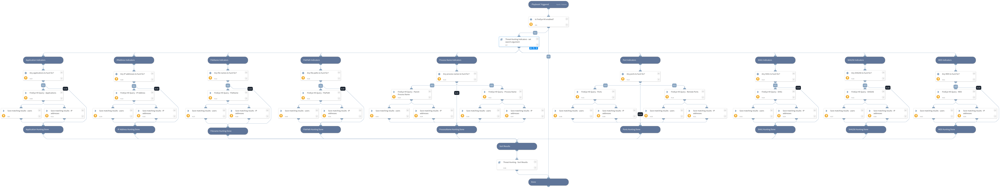

Using FireEye Endpoint Security (HX), the playbook enables automated threat hunting and detection of IOCs within your enterprise endpoints.

This playbook also outputs a list of detected users, internal IP addresses, and external IP addresses corresponding to the specified indicators, along with the threat hunting query results. 

IOCs included in the playbook are:
Application
IP Addresses
File Name
Process Name
File Path
Ports
MD5
SHA1
SHA256

## Dependencies
This playbook uses the following sub-playbooks, integrations, and scripts.

### Sub-playbooks
* Threat Hunting - Set Indicators
* Threat Hunting - Sort Results

### Integrations
* FireEyeHX v2

### Scripts
* IsIntegrationAvailable
* SetAndHandleEmpty

### Commands
* fireeye-hx-search

## Playbook Inputs
---

| **Name** | **Description** | **Default Value** | **Required** |
| --- | --- | --- | --- |
| IPAddress | The source or destination IPv4 address to search. Can be a single address or an array of list of addresses.  |  | Optional |
| Application | Single or multiple application names to search for.  Separate multiple search values by commas only \(without spaces or any special characters\). |  | Optional |
| FileName | Single or multiple file names to search for.  Separate multiple search values by commas only \(without spaces or any special characters\). |  | Optional |
| SHA256 | Single or multiple SHA256 file hashes to search for.  Separate multiple search values by commas only \(without spaces or any special characters\). |  | Optional |
| SHA1 | Single or multiple SHA1 file hashes to search for.  Separate multiple search values by commas only \(without spaces or any special characters\). |  | Optional |
| ProcessName | Single or multiple process names to search for.  Separate multiple search values by commas only \(without spaces or any special characters\). |  | Optional |
| FilePath | Single or multiple file paths to search for.  Separate multiple search values by commas only \(without spaces or any special characters\). |  | Optional |
| PortNumber | Source or destination ports to search for. Multiple values are supported.  Separate multiple search values by commas only \(without spaces or any special characters\). |  | Optional |
| RegistryValue | Single or multiple registry value to search for.  Separate multiple search values by commas only \(without spaces or any special characters\). |  | Optional |
| MD5 | The MD5 file hash or an array of MD5 hashes to hunt.  Separate multiple search values by commas only \(without spaces or any special characters\). |  | Optional |
| exhaustive | Whether a search is exhaustive or quick. Possible values are: yes, no. Default is yes. |  | Optional |
| hostSetName | The name of host set to be searched. |  | Required |
| interval_in_seconds | The interval in seconds between each poll. Default is 60.	 |  | Optional |
| InternalRange | A list of internal IP ranges to check IP addresses against. The list should be provided in CIDR notation, separated by commas. An example of a list of ranges would be: "172.16.0.0/12,10.0.0.0/8,192.168.0.0/16" \(without quotes\). If a list is not provided, will use default list provided in the IsIPInRanges script \(the known IPv4 private address ranges\). |  | Optional |

## Playbook Outputs
---

| **Path** | **Description** | **Type** |
| --- | --- | --- |
| FireEyeHX.Search.host | FireEye HX platform host details. | string |
| FireEyeHX.Search.results | FireEye HX threat hunting query results. | string |
| HuntingResults.DetectedExternalIPs | External IP addresses retrieved from threat hunting queries. | string |
| HuntingResults.DetectedInternalIPs | Internal IP addresses retrieved from threat hunting queries. | string |
| HuntingResults.DetectedUsers | Detected users retrieved from threat hunting queries. | string |

## Playbook Image
---
