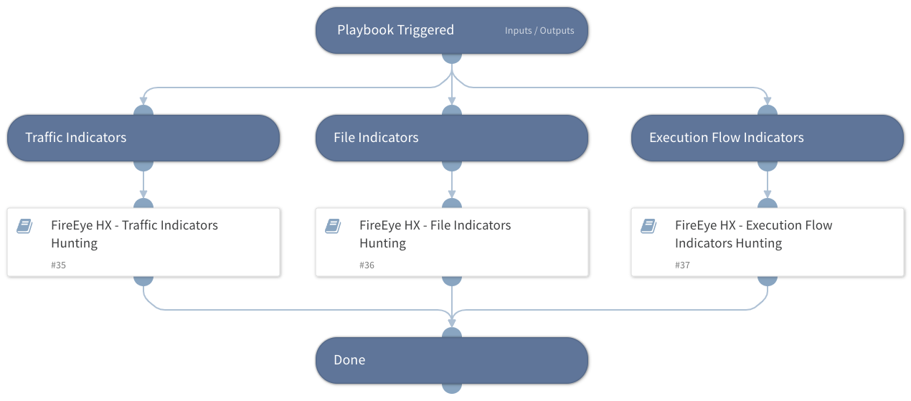

This playbook facilitates threat hunting and detection of IOCs within FireEye Endpoint Security (HX) utilizing three sub-playbooks. The sub-playbooks query FireEye HX for different indicators including files, traffic, and execution flows indicators.

Note that multiple search values should be separated by commas only (without spaces or any special characters).

Supported IOCs for this playbook:
- MD5
- SHA1
- SHA256
- IP Address
- URLDomain
- Registry Value
- Registry Key
- File Name
- Process Name
- Port Number
- File Path
- FileType

## Dependencies
This playbook uses the following sub-playbooks, integrations, and scripts.

### Sub-playbooks
* FireEye HX - File Indicators Hunting
* FireEye HX - Execution Flow Indicators Hunting
* FireEye HX - Traffic Indicators Hunting

### Integrations
This playbook does not use any integrations.

### Scripts
This playbook does not use any scripts.

### Commands
This playbook does not use any commands.

## Playbook Inputs
---

| **Name** | **Description** | **Default Value** | **Required** |
| --- | --- | --- | --- |
| IPAddress | A single or multiple IP address to search for in FireEye HX logs. Used for both source and destination IP addresses.  Separate multiple search values by commas only \(without spaces or any special characters\). |  | Optional |
| PortNumber | A single or multiple port numbers to search for in FireEye HX logs. Used for both remote and local ports.  Separate multiple search values by commas only \(without spaces or any special characters\). |  | Optional |
| URLDomain | Single or multiple URLs and/or domains to search for in FireEye HX logs. By default, the 'contains' clause is used.  Separate multiple search values by commas only \(without spaces or any special characters\). |  | Optional |
| SHA256 | A single or multiple SHA256 file hashes to search for in FireEye HX logs.  Separate multiple search values by commas only \(without spaces or any special characters\). |  | Optional |
| SHA1 | A single or multiple SHA1 file hashes to search for in FireEye HX logs.  Separate multiple search values by commas only \(without spaces or any special characters\). |  | Optional |
| MD5 | A single or multiple MD5 file hashes to search for in FireEye HX logs.  Separate multiple search values by commas only \(without spaces or any special characters\). |  | Optional |
| FilePath | A single or multiple file paths to search for in FireEye HX logs.  Separate multiple search values by commas only \(without spaces or any special characters\). |  | Optional |
| FileName | A single or multiple file names to search for in FireEye HX logs. By default, the 'contains' clause is used.  Separate multiple search values by commas only \(without spaces or any special characters\). |  | Optional |
| FileType | A single or multiple file types to search for in FireEye HX logs.  Separate multiple search values by commas only \(without spaces or any special characters\). |  | Optional |
| ProcessName | A single or multiple process names to search for in FireEye HX logs. By default, the 'contains' clause is used.  Separate multiple search values by commas only \(without spaces or any special characters\). |  | Optional |
| RegistryKey | A single or multiple registry keys to search for in FireEye HX logs.  Separate multiple search values by commas only \(without spaces or any special characters\). |  | Optional |
| RegistryValue | A single or multiple registry values to search for in FireEye HX logs. By default, the 'contains' clause is used. |  | Optional |
| Application | Single or multiple application names or codes to search for in FireEye HX logs. By default, the 'contains' clause is used.  Separate multiple search values by commas only \(without spaces or any special characters\). |  | Optional |
| hostSetName | The name of host set to be searched. |  | Required |
| exhaustive | Whether a search is exhaustive. Possible values are: yes, no. Default is yes. |  | Optional |
| interval_in_seconds | The interval in seconds between each poll. Default is 60.	 |  | Optional |
| limit | Limits the results count. \(When the limit is reached, the search stops\). |  | Optional |

## Playbook Outputs
---

| **Path** | **Description** | **Type** |
| --- | --- | --- |
| FireEyeHX.HuntingResults | Email message objects and fields that were retrieved from FireEye HX. | string |
| FireEyeHX.HuntingResults.Timestamp - Event | The timestamp of the event. | number |
| FireEyeHX.HuntingResults.Timestamp - Accessed | The time when the entry was last accessed. | number |
| FireEyeHX.HuntingResults.Timestamp - Modified | The time when the entry was last modified. | number |
| FireEyeHX.HuntingResults.File Name | The name of the file. | string |
| FireEyeHX.HuntingResults.File Full Path | The full path of the file. | string |
| FireEyeHX.HuntingResults.DNS Hostname | The name of the DNS host. | string |
| FireEyeHX.HuntingResults.URL | The event URL. | string |
| FireEyeHX.HuntingResults.Username | The event username. | string |
| FireEyeHX.HuntingResults.File MD5 Hash | The MD5 hash of the file. | string |
| FireEyeHX.HuntingResults.Port | The port. | number |
| FireEyeHX.HuntingResults.Process ID | The ID of the process. | string |
| FireEyeHX.HuntingResults.Local IP Address | The local IP address. | string |
| FireEyeHX.HuntingResults.Local Port | The local port. | number |
| FireEyeHX.HuntingResults.Remote Port | The remote port. | number |
| FireEyeHX.HuntingResults.IP Address | The IP address. | string |
| FireEyeHX.HuntingResults.Process Name | The process name. | string |
| FireEyeHX.HuntingResults.type | The type of the event. | string |
| FireEyeHX.HuntingResults.id | The ID of the result. | string |

## Playbook Image
---

