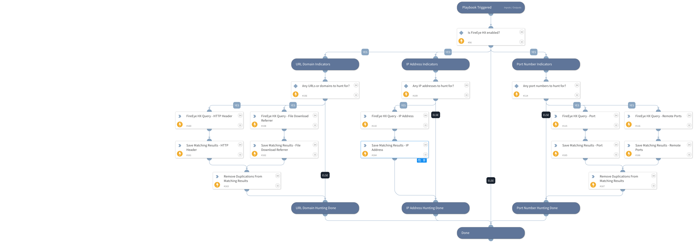

This playbook queries FireEye Endpoint Security (HX) for traffic indicators, including IP addresses, URLs, domains, and ports.

Note that multiple search values should be separated by commas only (without spaces or any special characters).

## Dependencies
This playbook uses the following sub-playbooks, integrations, and scripts.

### Sub-playbooks
This playbook does not use any sub-playbooks.

### Integrations
* FireEyeHX v2

### Scripts
* SetAndHandleEmpty
* IsIntegrationAvailable

### Commands
* fireeye-hx-search

## Playbook Inputs
---

| **Name** | **Description** | **Default Value** | **Required** |
| --- | --- | --- | --- |
| IPAddress | A single or multiple IP address to search for within FireEye HX logs. Used for both source and destination IP addresses.  Separate multiple search values by commas only \(without spaces or any special characters\). |  | Optional |
| PortNumber | A single or multiple port numbers to search for within FireEye HX logs. Used for both remote and local ports.  Separate multiple search values by commas only \(without spaces or any special characters\). |  | Optional |
| URLDomain | Single or multiple URLs and/or domains to search for within FireEye HX logs. By default, the 'contains' clause is used.  Separate multiple search values by commas only \(without spaces or any special characters\). |  | Optional |
| hostSetName | The name of host set to be searched. |  | Required |
| interval_in_seconds | The interval in seconds between each poll. Default is 60.	 |  | Optional |
| limit | Limits the results count \(once the limit is reached, the search is stopped\). |  | Optional |
| exhaustive | Whether a search is exhaustive or quick. Possible values are: yes, no. Default is yes. | no | Optional |

## Playbook Outputs
---

| **Path** | **Description** | **Type** |
| --- | --- | --- |
| FireEyeHX.HuntingResults | Email message objects and fields that were retrieved from FireEye HX. | string |
| FireEyeHX.HuntingResults.Timestamp - Event | The timestamp of the event. | number |
| FireEyeHX.HuntingResults.Timestamp - Accessed | The last accessed time. | number |
| FireEyeHX.HuntingResults.Timestamp - Modified | The time when the entry was last modified. | number |
| FireEyeHX.HuntingResults.File Name | The name of the file. | string |
| FireEyeHX.HuntingResults.File Full Path | The full path of the file. | string |
| FireEyeHX.HuntingResults.DNS Hostname | The name of the DNS host. | string |
| FireEyeHX.HuntingResults.URL | The event URL. | string |
| FireEyeHX.HuntingResults.Username | The event username. | string |
| FireEyeHX.HuntingResults.File MD5 Hash | The MD5 hash of the file. | string |
| FireEyeHX.HuntingResults.Port | The Port. | number |
| FireEyeHX.HuntingResults.Process ID | The ID of the process. | string |
| FireEyeHX.HuntingResults.Local IP Address | The local IP Address. | string |
| FireEyeHX.HuntingResults.Local Port | The local Port. | number |
| FireEyeHX.HuntingResults.Remote Port | The remote port. | number |
| FireEyeHX.HuntingResults.IP Address | The IP address. | string |
| FireEyeHX.HuntingResults.Process Name | The process name. | string |
| FireEyeHX.HuntingResults.type | The type of the event. | string |
| FireEyeHX.HuntingResults.id | The ID of the result. | string |

## Playbook Image
---
