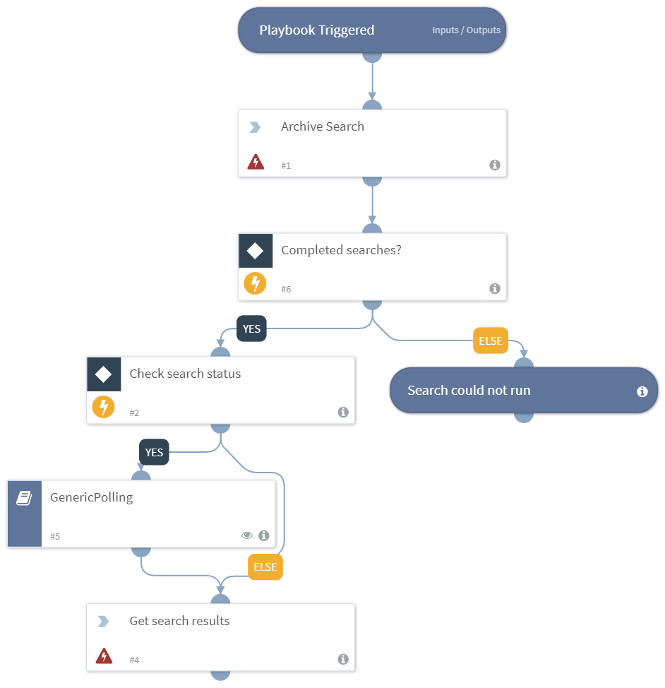

Creates an archive search in FireEye Helix, and fetch the results as events.

## Dependencies
This playbook uses the following sub-playbooks, integrations, and scripts.

### Sub-playbooks
* GenericPolling

### Integrations
This playbook does not use any integrations.

### Scripts
This playbook does not use any scripts.

### Commands
* fireeye-helix-archive-search
* fireeye-helix-archive-search-get-results

## Playbook Inputs
---

| **Name** | **Description** | **Default Value** | **Required** |
| --- | --- | --- | --- | 
| Query | The query to execute. This is the search clause in an MQL. | - | Required |
| Start | The start time of the event in date format yyyy-mm-dd or yyyy-mm. | - |Optional |
| Offset | The offset of the result. | - |Optional |
| Groupby | The unique values for the specified field. This input groups them together based on the specified frequency. For example, `groupby="srcipv4 5 100"` will group the top 5 srcipv4 that have at least 100 occurences. Multiple values can be provided using a comma-separated list. | - |Optional |
| Sort_by | Sorts the results by this field. The default is descending order. To change the default, the following command must be used: `argument sort_order="asc"`. | - | Optional |
| Sort_order | Controls the order of the results sorted by the `sort_by` argument. Can be, "ascending" or "descending". | - | Optional |
| Limit | The number of events for which to search. | - |Optional |
| Timeout | The amount of time for which to poll before declaring a timeout and resuming the playbook (in minutes). | 10 | Required |
| Interval | The frequency with which the polling command runs (in minutes). | 1 | Required |
| End | The end time of the event, in date format yyyy-mm-dd or yyyy-mm. | - | Optional |

## Playbook Outputs
---

| **Path** | **Description** | **Type** |
| --- | --- | --- |
| FireEyeHelixSearch.Result.ID | The event ID. | string |
| FireEyeHelixSearch.Result.Type | The event type. | string |
| FireEyeHelixSearch.Result.Result | The event result. | string |
| FireEyeHelixSearch.Result.MatchedAt | The time at which the the event was matched. | date |
| FireEyeHelixSearch.Result.Confidence | The confidence of the event. Can be, "low", "medium" or "high". | string |
| FireEyeHelixSearch.Result.Status | The status of the event. | string |
| FireEyeHelixSearch.Result.EventTime | The time at which the event took place. | date |
| FireEyeHelixSearch.Result.DetectedRuleID | The ID of the detected rule. | string |
| FireEyeHelixSearch.Result.PID | The process ID. | string |
| FireEyeHelixSearch.Result.Process | The process details. | string |
| FireEyeHelixSearch.Result.ProcessPath | The process path. | string |
| FireEyeHelixSearch.Result.FileName | The name of the file affected by the event. | string |
| FireEyeHelixSearch.Result.FilePath | The path of the file affected by the event. | string |
| FireEyeHelixSearch.Result.DeviceName | The device name. | string |
| FireEyeHelixSearch.Result.Size | The size of the file that created the event in bytes. | string |
| FireEyeHelixSearch.Result.Virus | The virus that was detected in the event. | string |
| FireEyeHelixSearch.Result.MalwareType | The malware type of the virus that was detected. | string |
| FireEyeHelixSearch.Result.CreatedTime | The time at which the event was created. | date |
| FireEyeHelixSearch.Result.Class | The event class. | string |
| FireEyeHelixSearch.Result.MD5 | The MD5 hash of the affected file. | string |
| FireEyeHelixSearch.Result.SHA1 | The SHA1 hash of the affected file. | string |
| FireEyeHelixSearch.Result.Protocol | The protocol used in the event. | string |
| FireEyeHelixSearch.Result.SourceIPv4 | The IPv4 address of the event source. | string |
| FireEyeHelixSearch.Result.SourceIPv6 | The IPv6 address of the event source. | string |
| FireEyeHelixSearch.Result.SourcePort | The port of the event source address. | string |
| FireEyeHelixSearch.Result.SourceLongitude | The longitude of the event source address. | string |
| FireEyeHelixSearch.Result.SourceLatitude | The latitude of the event source address. | string |
| FireEyeHelixSearch.Result.DestinationIPv4 | The IPv4 address of the event destination. | string |
| FireEyeHelixSearch.Result.DestinationIPv6 | The IPv6 address of the event destination. | string |
| FireEyeHelixSearch.Result.DestinationPort | The port of the event destination address. | string |
| FireEyeHelixSearch.Result.ReportTime | The time at which the event was reported. | date |
| FireEyeHelixSearch.Result.FalsePositive | Whether event is a false positive. | string |
| FireEyeHelixSearch.Result.Domain | The domain of the recepient. | string |
| FireEyeHelixSearch.Result.From | The source email address. | string |
| FireEyeHelixSearch.Result.SourceDomain | The domain of the host that created the event. | string |
| FireEyeHelixSearch.Result.SourceISP | The ISP of the source of the event. | string |
| FireEyeHelixSearch.Result.DestinationISP | The ISP of the destination of the event. | string |
| FireEyeHelixSearch.Result.To | The destination email address. | string |
| FireEyeHelixSearch.Result.Attachment | The email attachment. | unknown |
| FireEyeHelixSearch.MQL | The MQL query that created the result. | string |
| FireEyeHelixSearch.GroupBy | The group by values. | unknown |
| FireEyeHelixSearch.GroupBy.DocCount | The number of matches for the group. | number |
| FireEyeHelixSearch.Result.RcpTo | The "Recipient of" email address. | string |
| FireEyeHelixSearch.Result.InReplyTo | The "Reply to" email address. | string |

## Playbook Image
---

