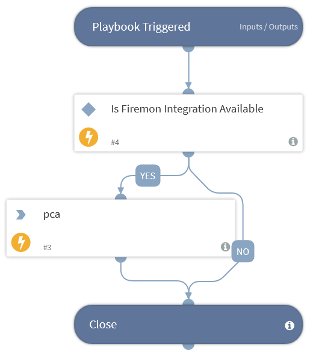

Validates and Return Pre Changes Assessment on Rules added as Requirement.

## Dependencies
This playbook uses the following sub-playbooks, integrations, and scripts.

### Sub-playbooks
This playbook does not use any sub-playbooks.

### Integrations
* FireMonSecurityManager

### Scripts
* IsIntegrationAvailable

### Commands
* firemon-pca

## Playbook Inputs
---

| **Name** | **Description** | **Default Value** | **Required** |
| --- | --- | --- | --- |
| domain_id | Enter Domain Id \(Integer\) | incident.domainid | Required |
| device_group_id | Enter Device Group Id \(Integer\) | incident.devicegroupid | Required |
| destinations | Enter List of Destinations | incident.destination | Required |
| sources | Enter List of Sources | incident.source | Required |
| services | Enter List of Services | incident.service | Required |
| action | Select an Action | incident.action | Required |

## Playbook Outputs
---
There are no outputs for this playbook.

## Playbook Image
---

