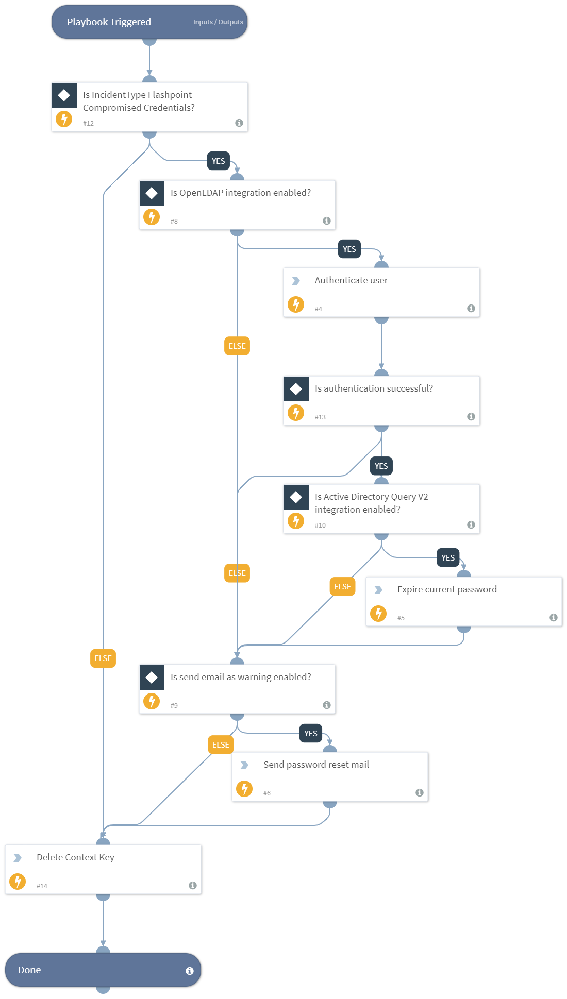

The Compromised Credentials Match playbook uses the details of the compromised credentials ingested from Flashpoint Ignite and authenticates using the Active Directory integration by providing the compromised credentials of the user. It then expires the credentials if it matches, and sends an email alert about the breach.

## Dependencies
This playbook uses the following sub-playbooks, integrations, and scripts.

### Sub-playbooks
This playbook does not use any sub-playbooks.

### Integrations
* Active Directory Query v2
* OpenLDAP

### Commands
* ad-authenticate
* ad-expire-password
* send-mail

## Playbook Inputs
---

| **Name** | **Description** | **Default Value** | **Required** |
| --- | --- | --- | --- |
| username | The username of the compromised credentials account. | incident.flashpointsourceemail | Required |
| password | The password of the compromised credentials account. | incident.flashpointpassword | Required |
| sendEmailAsWarning | Boolean input whether to send email or not. | True | Optional |

## Playbook Outputs
---
There are no outputs for this playbook.

## Playbook Image
---
