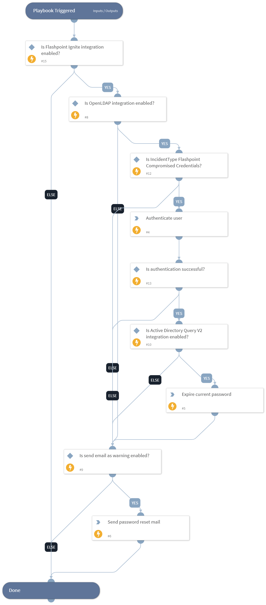

Use the Flashpoint integration to reduce business risk. Flashpoint allows users to ingest alerts and compromised credentials as incident alerts and executes commands such as search intelligence report, ip, url, get events, and more.

## What does this pack do?
The actions in this pack helps you to determine risks and help to remediate tasks using playbook:
- Get alerts, compromised credentials, forum details, event details, report and reputation information.
- Investigate compromised credentials incident.

### Playbook
**Compromised Credentials Match - Flashpoint:** It authenticates and expires the credentials and sends an email alert.

_For more information, visit our [Flashpoint Developer Documentation](https://docs.fp.tools/)_
