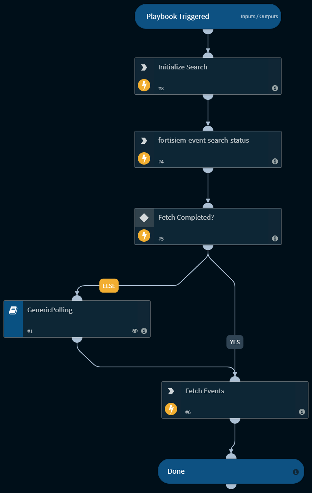

## Dependencies
This playbook uses the following sub-playbooks, integrations, and scripts.

### Sub-playbooks
* GenericPolling

### Integrations
* FortiSIEMV2

### Scripts
This playbook does not use any scripts.

### Commands
* fortisiem-event-search-status
* fortisiem-event-search-results
* fortisiem-event-search

## Playbook Inputs
---

| **Name** | **Description** | **Default Value** | **Required** |
| --- | --- | --- | --- |
| query | The query for filtering the relevant events. For example, "eventId=9071234812319593968 AND eventType='type'". You can retrieve the attributes names  by the naming one of the filtering arguments of the command, or by naming the attributes of the event that returned in the context output. |  | Optional |
| limit | The number of results to retrieve. Minimum value is 1. Default value is 50. |  | Optional |
| page | The page number of the results to retrieve. Minimum value is 1. Default value is 1. |  | Optional |
| Start time | From which event receive time filter the events. For example, "3 days ago", "1 month", "2019-10-10T12:22:00", "2019-10-10". |  | Optional |
| To Time | Until which event receive time  filter the events. For example, "3 days ago", "1 month", "2019-10-10T12:22:00", "2019-10-10". |  | Optional |

## Playbook Outputs
---

| **Path** | **Description** | **Type** |
| --- | --- | --- |
| FortiSIEM.Event | The events that retrieved from the search query. | unknown |

## Playbook Image
---
