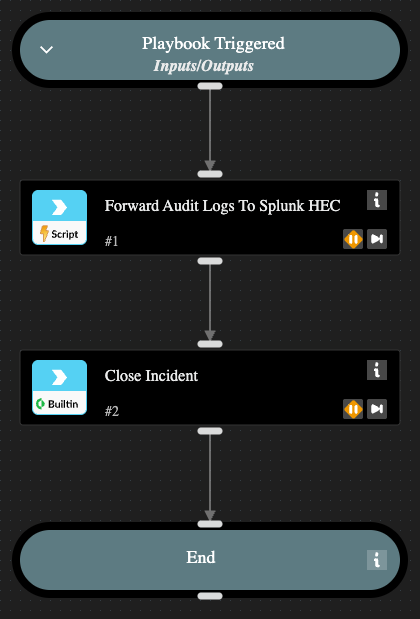

This playbook it to run as a job to forward audit logs to Splunk HEC.

## Dependencies

This playbook uses the following sub-playbooks, integrations, and scripts.

### Sub-playbooks

This playbook does not use any sub-playbooks.

### Integrations

This playbook does not use any integrations.

### Scripts

* Gaiatop_ForwardAuditLogsToSplunkHEC

### Commands

* closeInvestigation

## Playbook Inputs

---

| **Name** | **Description** | **Default Value** | **Required** |
| --- | --- | --- | --- |
| AuditLogCountList | The name of the list that holds the audit log id count. |  | Optional |
| CoreRestInstanceName | The name of the Core REST API instance configured in the tenant. |  | Optional |
| SplunkInstanceName | The name of the Splunk Py instance configured in the tenant. |  | Optional |

## Playbook Outputs

---
There are no outputs for this playbook.

## Playbook Image

---

