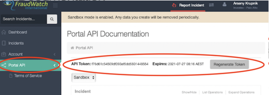

Manage incidents via the Fraudwatch API. FraudWatch International provides a fully managed Enterprise Digital Brand Protection Suite, including online brand management & monitoring as well as providing other brand protection solutions that protect organizations and their customers around the world against online brand-related abuse.
This integration was integrated and tested with version v1 of FraudWatch Phishportal

### Retrieve FraudWatch API token

1. Navigate to the [Phishportal site](https://www.phishportal.com/).
2. Enter your Username and Password.
3. On the left sidebar, click on 'Portal API'.
4. On the top of the page, you should see your API Token.
5. If the API token is out of date, click on the **Regenerate Token** button adjacent to the **API token**, to generate a new token.
6. Set the API token in the **Password** parameter.
**NOTE**: no need to set the **Username** parameter it can be left blank (visible only on 6.0.2 and lower versions).



## Configure FraudWatch on Cortex XSOAR

1. Navigate to **Settings** > **Integrations** > **Servers & Services**.
2. Search for FraudWatch.
3. Click **Add instance** to create and configure a new integration instance.

    | **Parameter** | **Description** | **Required** |
    | --- | --- | --- |
    | Fetch incidents |  | False |
    | API Token (leave empty. Fill in the API token in the password field.) |  | False |
    | Server URL | URL of the server. | True |
    | Brand | Fetch incidents that match the specified brand. An error is encountered if the brand does not exist. A list of the existing brands can be retrieved by the 'fraudwatch-brands-list' command. | False |
    | Status | Fetch incidents that have the specified status. | False |
    | Incident type |  | False |
    | Incidents Fetch Interval |  | False |
    | First fetch timestamp | format: \(`<number>` `<time unit>`, e.g., 12 hours, 1 day\) | False |
    | Maximum Incidents To Fetch |  | False |
    | Trust any certificate (not secure) |  | False |
    | Use system proxy settings |  | False |

4. Click **Test** to validate the URLs, token, and connection.

### Fetch Incidents
Due to limitations in FraudWatch API, first fetch timestamp can be at most 1 day.

## Commands
You can execute these commands from the Cortex XSOAR CLI, as part of an automation, or in a playbook.
After you successfully execute a command, a DBot message appears in the War Room with the command details.
### fraudwatch-incidents-list
***
Get a list of incidents from FraudWatch service.


#### Base Command

`fraudwatch-incidents-list`
#### Input

| **Argument Name** | **Description** | **Required** |
| --- | --- | --- |
| brand | Retrieve incidents that match the specified brand. An error is encountered if the brand does not exist. A list of the existing brands can be retrieved by the 'fraudwatch-brands-list' command. | Optional | 
| status | Retrieve incidents that have the specified status. Possible values are: active, new, monitor, reactive, onhold, closed, closedmonitor, rejected, duplicate. | Optional | 
| limit | Number of incidents to retrieve. | Optional | 
| page_size | The number of incidents in a page. Maximum value is 200. | Optional | 
| page | Retrieve incidents by the given page number. | Optional | 
| from | Retrieve alerts for which 'date opened' is higher or equal to the 'from' value. Supports ISO and time range (&lt;number&gt; &lt;time unit&gt;, e.g., 12 hours, 7 days) formats. If not specified, the default value of 'to' is the current time. | Optional | 
| to | Retrieve alerts for which 'date opened' is lower or equal to the 'to' value. Supports ISO and time range (&lt;number&gt; &lt;time unit&gt;, e.g., 12 hours, 7 days) formats. If not specified, the default value of 'from' is 12 months before 'to'. | Optional | 


#### Context Output

| **Path** | **Type** | **Description** |
| --- | --- | --- |
| FraudWatch.Incident.identifier | String | Incident identifier. | 
| FraudWatch.Incident.reference_id | String | Incident reference ID. | 
| FraudWatch.Incident.url | String | Main URL associated with the incident. | 
| FraudWatch.Incident.status | String | Incident status. | 
| FraudWatch.Incident.type | String | Incident type. | 
| FraudWatch.Incident.brand | String | Incident brand. | 
| FraudWatch.Incident.client | String | Incident client. | 
| FraudWatch.Incident.content_ip | String | Incident content IP. | 
| FraudWatch.Incident.host | String | Incident host. | 
| FraudWatch.Incident.host_country | String | Incident host country. | 
| FraudWatch.Incident.host_timezone | String | Incident host timezone. | 
| FraudWatch.Incident.created_by | String | Who created the incident. | 
| FraudWatch.Incident.discovered_by | String | Who discovered the incident. | 
| FraudWatch.Incident.current_duration | String | Current duration of the incident. | 
| FraudWatch.Incident.active_duration | Unknown | Current active duration of the incident. | 
| FraudWatch.Incident.date_opened | Date | The date in which the incident was opened. | 
| FraudWatch.Incident.date_closed | Date | The date in which the incident was closed. | 
| FraudWatch.Incident.additional_urls | String | Additional URLs associated with the incident. | 
| FraudWatch.Incident.link | String | Link to the incident page in the FraudWatch user interface. | 


#### Command Example
```!fraudwatch-incidents-list brand="Testing Brand 2" from="2020-12-12" limit=3 status=monitor```

#### Context Example
```json
{
    "FraudWatch": {
        "Incident": [
            {
                "active_duration": null,
                "additional_urls": [
                    "http://www.malicious2.com",
                    "http://www.malicious3.com",
                    "http://www.malicious4.com",
                    "http://www.malicious5.com"
                ],
                "brand": "Testing Brand 2",
                "client": "Palo Alto",
                "content_ip": null,
                "created_by": "Client",
                "current_duration": "85882",
                "date_closed": null,
                "date_opened": "2021-02-07T15:37:12.000Z",
                "discovered_by": "client",
                "host": null,
                "host_country": null,
                "host_timezone": null,
                "identifier": "JJJ-595483",
                "link": "https://www.phishportal.com/client/incident/JJJ-595483",
                "reference_id": "abc1234",
                "status": "monitor",
                "type": "Vishing",
                "url": "http://www.malicious.com"
            },
            {
                "active_duration": null,
                "additional_urls": [
                    "http://www.malicious2.com",
                    "http://www.malicious3.com",
                    "http://www.malicious4.com",
                    "http://www.malicious5.com"
                ],
                "brand": "Testing Brand 2",
                "client": "Palo Alto",
                "content_ip": null,
                "created_by": "Client",
                "current_duration": "86649",
                "date_closed": null,
                "date_opened": "2021-02-07T15:24:25.000Z",
                "discovered_by": "client",
                "host": null,
                "host_country": null,
                "host_timezone": null,
                "identifier": "JJJ-992295",
                "link": "https://www.phishportal.com/client/incident/JJJ-992295",
                "reference_id": "abc1234",
                "status": "monitor",
                "type": "Vishing",
                "url": "http://www.malicious.com"
            },
            {
                "active_duration": null,
                "additional_urls": [
                    "abuse.com"
                ],
                "brand": "Testing Brand 2",
                "client": "Palo Alto",
                "content_ip": "192.168.0.1",
                "created_by": "Client",
                "current_duration": "340758",
                "date_closed": null,
                "date_opened": "2021-02-04T16:49:16.000Z",
                "discovered_by": "client",
                "host": null,
                "host_country": null,
                "host_timezone": null,
                "identifier": "JJJ-302171",
                "link": "https://www.phishportal.com/client/incident/JJJ-302171",
                "reference_id": "malicious1",
                "status": "monitor",
                "type": "Brand Abuse",
                "url": "http://malicious.com"
            }
        ]
    }
}
```

#### Human Readable Output

>### FraudWatch Incidents
>|identifier|reference_id|url|status|type|brand|client|content_ip|created_by|discovered_by|current_duration|date_opened|additional_urls|link|
>|---|---|---|---|---|---|---|---|---|---|---|---|---|---|
>| JJJ-595483 | abc1234 | http://www.malicious.com | monitor | Vishing | Testing Brand 2 | Palo Alto |  | Client | client | 85882 | 2021-02-07T15:37:12.000Z | http://www.malicious2.com,<br/>http://www.malicious3.com,<br/>http://www.malicious4.com,<br/>http://www.malicious5.com | https://www.phishportal.com/client/incident/JJJ-595483 |
>| JJJ-992295 | abc1234 | http://www.malicious.com | monitor | Vishing | Testing Brand 2 | Palo Alto |  | Client | client | 86649 | 2021-02-07T15:24:25.000Z | http://www.malicious2.com,<br/>http://www.malicious3.com,<br/>http://www.malicious4.com,<br/>http://www.malicious5.com | https://www.phishportal.com/client/incident/JJJ-992295 |
>| JJJ-302171 | malicious1 | http://malicious.com | monitor | Brand Abuse | Testing Brand 2 | Palo Alto | 192.168.0.1 | Client | client | 340758 | 2021-02-04T16:49:16.000Z | abuse.com | https://www.phishportal.com/client/incident/JJJ-302171 |


### fraudwatch-incident-report
***
Report an incident to FraudWatch service.


#### Base Command

`fraudwatch-incident-report`
#### Input

| **Argument Name** | **Description** | **Required** |
| --- | --- | --- |
| brand | The brand associated with the reported incident. An error is encountered if the brand does not exist. A list of the existing brands can be retrieved by the 'fraudwatch-brands-list' command. | Required | 
| type | The incident type to be associated with the reported incident. Possible values are: phishing, vishing, brand_abuse, malware, social_media_brand_abuse, mobile_app_unauthorized, pac_file, pharming, messaging, dmarc_email_server. | Required | 
| reference_id | Reference ID to be associated with the reported incident. Should be unique. Reference ID can be used later on to retrieve a specific incident by its reference ID. | Optional | 
| primary_url | Primary URL of the reported incident. | Required | 
| urls | A Comma-separated list of additional URLs to be associated with the reported incident. | Optional | 
| evidence | Evidence to be added (such as logs, etc...) to the reported incident. | Optional | 
| instructions | Additional instructions to be added for the FraudWatch security team. | Optional | 


#### Context Output

| **Path** | **Type** | **Description** |
| --- | --- | --- |
| FraudWatch.Incident.identifier | String | Incident identifier. | 
| FraudWatch.Incident.reference_id | String | Incident reference ID. | 
| FraudWatch.Incident.url | String | Main URL associated with the incident. | 
| FraudWatch.Incident.status | String | Incident status. | 
| FraudWatch.Incident.type | String | Incident type. | 
| FraudWatch.Incident.brand | String | Incident brand. | 
| FraudWatch.Incident.client | String | Incident client. | 
| FraudWatch.Incident.content_ip | String | Incident content IP. | 
| FraudWatch.Incident.host | String | Incident host. | 
| FraudWatch.Incident.host_country | String | Incident host contry. | 
| FraudWatch.Incident.host_timezone | String | Incident host timezone. | 
| FraudWatch.Incident.created_by | String | Who created the incident. | 
| FraudWatch.Incident.discovered_by | String | Who discovered the incident. | 
| FraudWatch.Incident.current_duration | String | Current duration of the incident. | 
| FraudWatch.Incident.active_duration | Unknown | Current active duration of the incident. | 
| FraudWatch.Incident.date_opened | Date | The date in which the incident was opened. | 
| FraudWatch.Incident.date_closed | Date | The date in which the incident was closed. This field is expected to be empty because the incident was just created. | 
| FraudWatch.Incident.additional_urls | String | Additional URLs associated with the incident. | 
| FraudWatch.Incident.link | String | Link to the incident page in the FraudWatch user interface. | 


#### Command Example
```!fraudwatch-incident-report brand="Testing Brand 1" primary_url="http://www.maliciousaddress.com" type="vishing" reference_id="abc123" urls="http://abuse.com"```

#### Context Example
```json
{
    "FraudWatch": {
        "Incident": {
            "active_duration": null,
            "additional_urls": [
                "http://abuse.com"
            ],
            "brand": "Testing Brand 1",
            "client": "Palo Alto",
            "content_ip": null,
            "created_by": "FraudWatch",
            "current_duration": "0",
            "date_closed": null,
            "date_opened": "2021-02-08T15:28:37.000Z",
            "discovered_by": "client",
            "host": null,
            "host_country": null,
            "host_timezone": null,
            "identifier": "JJJ-358877",
            "link": "https://www.phishportal.com/client/incident/JJJ-358877",
            "reference_id": "abc123",
            "status": "monitor",
            "type": "Vishing",
            "url": "http://www.maliciousaddress.com"
        }
    }
}
```

#### Human Readable Output

>### Created FraudWatch Incident
>|additional_urls|brand|client|created_by|current_duration|date_opened|discovered_by|identifier|link|reference_id|status|type|url|
>|---|---|---|---|---|---|---|---|---|---|---|---|---|
>| http://abuse.com | Testing Brand 1 | Palo Alto | FraudWatch | 0 | 2021-02-08T15:28:37.000Z | client | JJJ-358877 | https://www.phishportal.com/client/incident/JJJ-358877 | abc123 | monitor | Vishing | http://www.maliciousaddress.com |


### fraudwatch-incident-update
***
Updates the incident associated with the 'incident_id' with the specified argument values.


#### Base Command

`fraudwatch-incident-update`
#### Input

| **Argument Name** | **Description** | **Required** |
| --- | --- | --- |
| incident_id | The ID of the incident to be updated. The incident ID is the 'identifier' field returned by the 'fraudwatch-incidents-list' command. | Required | 
| brand | Updates the incident associated with the 'incident_id' with the brand specified. An error is encountered if the brand does not exist. A list of the existing brands can be retrieved by the 'fraudwatch-brands-list' command. | Optional | 
| reference_id | Updates the incident associated with the 'incident_id' with the reference ID specified. Reference ID should be unique, and can be used by the 'fraudwatch-incident-get-by-identifier' command to retrieve a specific incident by its reference id. | Optional | 
| evidence | Evidence to be added (such as logs, etc...) to the incident. | Optional | 
| instructions | Updates the incident associated with the 'incident_id' with additional instructions for the FraudWatch security team. | Optional | 


#### Context Output

There is no context output for this command.

#### Command Example
```!fraudwatch-incident-update incident_id=JJJ-504830 brand="Testing Brand 2" reference_id="reference123"```

#### Human Readable Output

>### Incident with ID JJJ-504830 was updated successfully

### fraudwatch-incident-get-by-identifier
***
Gets an incident from FraudWatch service by its reference ID or incident ID. Single values of 'reference_id' and 'incident_id' should be specified.


#### Base Command

`fraudwatch-incident-get-by-identifier`
#### Input

| **Argument Name** | **Description** | **Required** |
| --- | --- | --- |
| incident_id | The ID of the incident to retrieve. Incident ID is the 'identifier' field returned by the 'fraudwatch-incidents-list' command. | Optional | 
| reference_id | Reference id of the incident to retrieve. If more than one incident is associated with 'reference_id' specified, returns the details of the incident with the latest 'date opened'. Reference ID is the 'reference_id' field returned by the 'fraudwatch-incidents-list' command. | Optional | 


#### Context Output

| **Path** | **Type** | **Description** |
| --- | --- | --- |
| FraudWatch.Incident.identifier | String | Incident identifier. | 
| FraudWatch.Incident.reference_id | String | Incident reference ID. | 
| FraudWatch.Incident.url | String | Main URL associated with the incident. | 
| FraudWatch.Incident.status | String | Incident status. | 
| FraudWatch.Incident.type | String | Incident type. | 
| FraudWatch.Incident.brand | String | Incident brand. | 
| FraudWatch.Incident.client | String | Incident client. | 
| FraudWatch.Incident.content_ip | String | Incident content IP. | 
| FraudWatch.Incident.host | String | Incident host. | 
| FraudWatch.Incident.host_country | String | Incident host country. | 
| FraudWatch.Incident.host_timezone | String | Incident host timezone. | 
| FraudWatch.Incident.created_by | String | Who created the incident. | 
| FraudWatch.Incident.discovered_by | String | Who discovered the incident. | 
| FraudWatch.Incident.current_duration | String | Current duration of the incident. | 
| FraudWatch.Incident.active_duration | Unknown | Current active duration of the incident. | 
| FraudWatch.Incident.date_opened | Date | The date in which the incident was opened. | 
| FraudWatch.Incident.date_closed | Date | The date in which the incident was closed. | 
| FraudWatch.Incident.additional_urls | String | Additional URLs associated with the incident. | 
| FraudWatch.Incident.link | String | Link to the incident page in the FraudWatch user interface. | 


#### Command Example
```!fraudwatch-incident-get-by-identifier incident_id=JJJ-168840```

#### Context Example
```json
{
    "FraudWatch": {
        "Incident": {
            "active_duration": null,
            "additional_urls": [
                "http://malicious1.com",
                "http://malicious2.com"
            ],
            "brand": "Testing Brand 1",
            "client": "Palo Alto",
            "content_ip": null,
            "created_by": "Client",
            "current_duration": "514313",
            "date_closed": null,
            "date_opened": "2021-02-02T16:36:50.000Z",
            "discovered_by": "client",
            "host": null,
            "host_country": null,
            "host_timezone": null,
            "identifier": "JJJ-168840",
            "link": "https://www.phishportal.com/client/incident/JJJ-168840",
            "reference_id": null,
            "status": "monitor",
            "type": "Vishing",
            "url": "test.com"
        }
    }
}
```

#### Human Readable Output

>### FraudWatch Incident
>|additional_urls|brand|client|created_by|current_duration|date_opened|discovered_by|identifier|link|status|type|url|
>|---|---|---|---|---|---|---|---|---|---|---|---|
>| http://malicious1.com,<br/>http://malicious2.com | Testing Brand 1 | Palo Alto | Client | 514313 | 2021-02-02T16:36:50.000Z | client | JJJ-168840 | https://www.phishportal.com/client/incident/JJJ-168840 | monitor | Vishing | test.com |


### fraudwatch-incident-forensic-get
***
Gets the forensic data of the incident associated with the specified incident ID.


#### Base Command

`fraudwatch-incident-forensic-get`
#### Input

| **Argument Name** | **Description** | **Required** |
| --- | --- | --- |
| incident_id | The ID of the incident for which to retrieve the forensic data. Incident ID is the 'identifier' field returned by the 'fraudwatch-incidents-list' command. | Required | 


#### Context Output

| **Path** | **Type** | **Description** |
| --- | --- | --- |
| FraudWatch.IncidentForensicData.host_provider.name | String | Name of the host provider. | 
| FraudWatch.IncidentForensicData.host_provider.country | String | Country of the host provider. | 
| FraudWatch.IncidentForensicData.host_nameservers | String | Names of the host servers. | 
| FraudWatch.IncidentForensicData.host_domain_registrar.name | String | Host domain registrar name. | 
| FraudWatch.IncidentForensicData.host_domain_registrar.email | String | Host domain registrar email. | 
| FraudWatch.IncidentForensicData.host_domain_registrar.country | String | Host domain registrar country. | 
| FraudWatch.IncidentForensicData.host_site_owner | Unknown | Host site owner. | 
| FraudWatch.IncidentForensicData.host_site_admin | Unknown | Host site admin. | 
| FraudWatch.IncidentForensicData.host_domain_admin | Unknown | Host domain admin. | 
| FraudWatch.IncidentForensicData.host_ip_providier | Unknown | Host IP provider. | 
| FraudWatch.IncidentForensicData.identifier | String | Identifier of the incident. | 


#### Command Example
```!fraudwatch-incident-forensic-get incident_id=JJJ-397266```

#### Context Example
```json
{
    "FraudWatch": {
        "IncidentForensicData": {
            "host_domain_registrar": {
                "country": "abuse@address.com",
                "email": "http://www.abuseaddress.com",
                "name": "Moniker Online Services LLC"
            },
            "host_nameservers": [
                "NS1.IRAN.COM",
                "NS2.IRAN.COM"
            ],
            "identifier": "JJJ-397266"
        }
    }
}
```

#### Human Readable Output

>### FraudWatch Incident Forensic Data
>|host_domain_registrar|host_nameservers|identifier|
>|---|---|---|
>| name: Moniker Online Services LLC<br/>email: http://www.abuseaddress.com<br/>country: abuse@address.com | NS1.IRAN.COM,<br/>NS2.IRAN.COM | JJJ-397266 |


### fraudwatch-incident-contact-emails-list
***
Provides a list of the messages related to the incident associated with the specified incident ID.


#### Base Command

`fraudwatch-incident-contact-emails-list`
#### Input

| **Argument Name** | **Description** | **Required** |
| --- | --- | --- |
| incident_id | The ID of the incident for which to retrieve the related messages. Incident ID is the 'identifier' field returned by the 'fraudwatch-incidents-list' command. | Required | 
| limit | Number of related messages to retrieve. | Optional | 
| page_size | Maximum number of related messages in a page. Maximum value is 200. | Optional | 
| page | Retrieve related messages by the specified page number. | Optional | 


#### Context Output

| **Path** | **Type** | **Description** |
| --- | --- | --- |
| FraudWatch.IncidentContacts.noteId | String | Note ID of the related message. | 
| FraudWatch.IncidentContacts.subject | String | Subject of the related message. | 
| FraudWatch.IncidentContacts.creator | String | The creator of the related message. | 
| FraudWatch.IncidentContacts.content | String | The content of the related message. | 
| FraudWatch.IncidentContacts.date | Date | The date of the related message. | 


#### Command Example
```!fraudwatch-incident-contact-emails-list incident_id=JJJ-898410 limit=2```

#### Context Example
```json
{
    "FraudWatch": {
        "IncidentContacts": [
            {
                "content": "This incident is very malicious, please monitor it\r\n",
                "creator": "Client",
                "date": "2021-02-08T15:26:19.000Z",
                "noteId": "11081853",
                "subject": "Client Reply"
            },
            {
                "content": "This incident is very malicious, please monitor it\r\n",
                "creator": "Client",
                "date": "2021-02-08T15:21:58.000Z",
                "noteId": "11081828",
                "subject": "Client Reply"
            }
        ]
    }
}
```

#### Human Readable Output

>### FraudWatch Incident Contacts Data
>|noteId|subject|creator|content|date|
>|---|---|---|---|---|
>| 11081853 | Client Reply | Client | This incident is very malicious, please monitor it<br/> | 2021-02-08T15:26:19.000Z |
>| 11081828 | Client Reply | Client | This incident is very malicious, please monitor it<br/> | 2021-02-08T15:21:58.000Z |


### fraudwatch-incident-messages-add
***
Add a new related message to the incident associated with the specified incident ID.


#### Base Command

`fraudwatch-incident-messages-add`
#### Input

| **Argument Name** | **Description** | **Required** |
| --- | --- | --- |
| incident_id | Add a related message to the incident with the specified incident ID. Incident ID is the 'identifier' field returned by the 'fraudwatch-incidents-list' command. | Required | 
| message_content | Content of the related message. | Required | 


#### Context Output

There is no context output for this command.

#### Command Example
```!fraudwatch-incident-messages-add incident_id=JJJ-898410 message_content="This incident is very malicious, please monitor it"```

#### Human Readable Output

>### Message for incident id JJJ-898410 was added successfully.

### fraudwatch-incident-urls-add
***
Adds additional URLs to the incident associated with the specified incident ID. Fails if one of the new urls already exists.


#### Base Command

`fraudwatch-incident-urls-add`
#### Input

| **Argument Name** | **Description** | **Required** |
| --- | --- | --- |
| incident_id | The ID of the incident to add additional urls to. Incident ID is the 'identifier' field returned by the 'fraudwatch-incidents-list' command. | Required | 
| urls | A comma-separated list of additional URLs to be added to the incident associated with the 'incident_id'. | Required | 


#### Context Output

| **Path** | **Type** | **Description** |
| --- | --- | --- |
| FraudWatch.IncidentUrls.success | String | Whether the URLs were added successfully. | 
| FraudWatch.IncidentUrls.new_urls | String | The new URLs that were added. | 


#### Command Example
```!fraudwatch-incident-urls-add incident_id=JJJ-162968 urls=http://www.malicious1.com,http://www.malicious2.com```

#### Context Example
```json
{
    "FraudWatch": {
        "IncidentUrls": {
            "new_urls": [
                "http://www.malicious1.com",
                "http://www.malicious2.com"
            ],
            "success": "Add additional urls successfully"
        }
    }
}
```

#### Human Readable Output

>### FraudWatch Incident Urls
>|new_urls|success|
>|---|---|
>| http://www.malicious1.com,<br/>http://www.malicious2.com | Add additional urls successfully |


### fraudwatch-incident-attachment-upload
***
Adds a new file attachment to the incident associated with the specified incident ID.


#### Base Command

`fraudwatch-incident-attachment-upload`
#### Input

| **Argument Name** | **Description** | **Required** |
| --- | --- | --- |
| incident_id | The ID of the incident to add a file attachment to. Incident ID is the 'identifier' field returned by the 'fraudwatch-incidents-list' command. | Required | 
| entry_id | The entry id in Cortex XSOAR of the attachment to be added to the incident. | Required | 


#### Context Output

There is no context output for this command.

#### Command Example
```!fraudwatch-incident-attachment-upload entry_id=fmSNZSY2fSCA2WptU8rddf@d382f488-92db-400c-87ff-fdd71f3b7408 incident_id=JJJ-604206```

#### Human Readable Output

>### File fraud_test.txt was uploaded successfully to incident with an incident id JJJ-604206

### fraudwatch-brands-list
***
Gets a list of brands from FraudWatch service.


#### Base Command

`fraudwatch-brands-list`
#### Input

| **Argument Name** | **Description** | **Required** |
| --- | --- | --- |
| limit | Number of brands to retrieve. | Optional | 
| page_size | Total number of brands in a page. Values range: 20-100. | Optional | 
| page | Retrieve brands by the specified page number. | Optional | 


#### Context Output

| **Path** | **Type** | **Description** |
| --- | --- | --- |
| FraudWatch.Brand.client | String | Brand client. | 
| FraudWatch.Brand.alternate business name | String | Brand alternative business name. | 
| FraudWatch.Brand.name | String | Brand name. | 
| FraudWatch.Brand.active | Boolean | Wether the brand is active or not. | 
| FraudWatch.Brand.services.name | String | Brand service name. | 
| FraudWatch.Brand.services.action | String | Brand service action. | 


#### Command Example
```!fraudwatch-brands-list```

#### Context Example
```json
{
    "FraudWatch": {
        "Brand": [
            {
                "active": true,
                "alternate business name": "",
                "client": "Palo Alto",
                "name": "Testing Brand 1",
                "services": [
                    {
                        "action": "takedown",
                        "name": "Phishing"
                    },
                    {
                        "action": "monitor",
                        "name": "Vishing"
                    },
                    {
                        "action": "monitor",
                        "name": "Brand Abuse"
                    },
                    {
                        "action": "monitor",
                        "name": "Malware"
                    },
                    {
                        "action": "monitor",
                        "name": "Social Media Brand Abuse"
                    },
                    {
                        "action": "monitor",
                        "name": "Mobile App (Unauthorized)"
                    },
                    {
                        "action": "monitor",
                        "name": "PAC File"
                    },
                    {
                        "action": "monitor",
                        "name": "Messaging"
                    },
                    {
                        "action": "monitor",
                        "name": "DMARC Email Server"
                    }
                ]
            },
            {
                "active": true,
                "alternate business name": "",
                "client": "Palo Alto",
                "name": "Testing Brand 2",
                "services": [
                    {
                        "action": "takedown",
                        "name": "Phishing"
                    },
                    {
                        "action": "monitor",
                        "name": "Vishing"
                    },
                    {
                        "action": "monitor",
                        "name": "Brand Abuse"
                    },
                    {
                        "action": "monitor",
                        "name": "Malware"
                    },
                    {
                        "action": "monitor",
                        "name": "Social Media Brand Abuse"
                    },
                    {
                        "action": "monitor",
                        "name": "Mobile App (Unauthorized)"
                    },
                    {
                        "action": "monitor",
                        "name": "PAC File"
                    },
                    {
                        "action": "monitor",
                        "name": "Messaging"
                    },
                    {
                        "action": "monitor",
                        "name": "DMARC Email Server"
                    }
                ]
            }
        ]
    }
}
```

#### Human Readable Output

>### FraudWatch Brands
>|name|active|client|
>|---|---|---|
>| Testing Brand 1 | true | Palo Alto |
>| Testing Brand 2 | true | Palo Alto |

