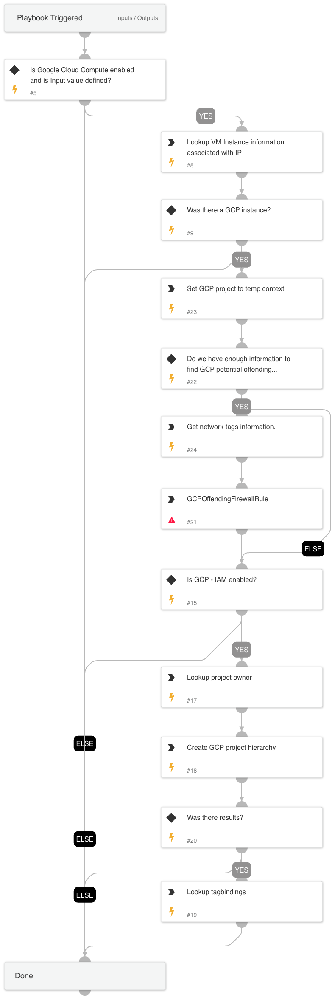

Given the IP address this playbook enriches GCP and Firewall information.

## Dependencies
This playbook uses the following sub-playbooks, integrations, and scripts.

### Sub-playbooks
This playbook does not use any sub-playbooks.

### Integrations
* GCP-IAM
* Google Cloud Compute

### Scripts
This playbook does not use any scripts.

### Commands
* gcp-compute-aggregated-list-instances-by-ip
* gcp-compute-list-firewall
* gcp-iam-project-iam-policy-get

## Playbook Inputs
---

| **Name** | **Description** | **Default Value** | **Required** |
| --- | --- | --- | --- |
| GcpIP | GCP IP in alert | alert.remoteip | Required |

## Playbook Outputs
---

| **Path** | **Description** | **Type** |
| --- | --- | --- |
| GoogleCloudCompute.Instances | GCP VM Instances information. | unknown |
| GoogleCloudCompute.Firewalls | GCP Firewall information | unknown |
| GCPIAM.Policy | GCP IAM information | unknown |

## Playbook Image
---
