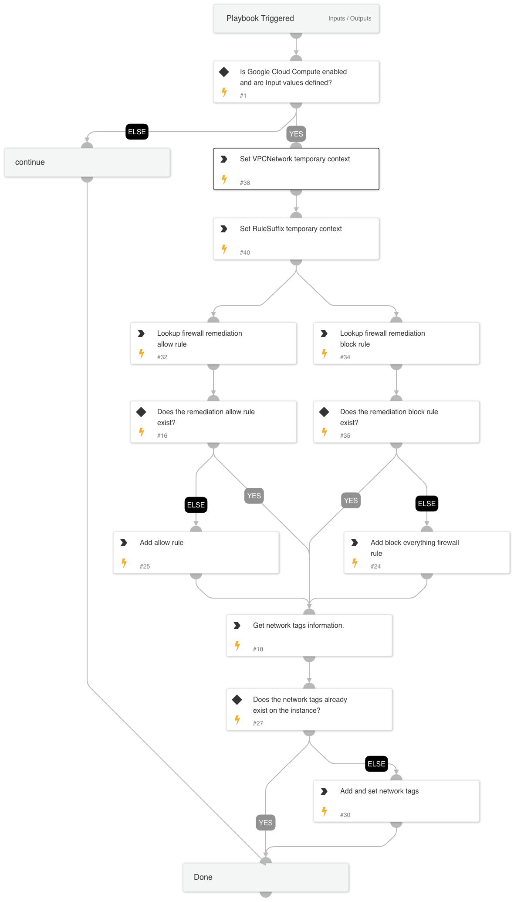

This playbook adds new firewall rules with access only from  private ip address range and blocks traffic that's exposed to public internet. For example, if RDP is exposed to the entire world, this playbook adds new firewall rules that only allows traffic from private ip address and blocks rest of the RDP traffic.

## Dependencies

This playbook uses the following sub-playbooks, integrations, and scripts.

### Sub-playbooks

This playbook does not use any sub-playbooks.

### Integrations

* Google Cloud Compute

### Scripts

This playbook does not use any scripts.

### Commands

* gcp-compute-insert-firewall
* gcp-compute-list-firewall
* gcp-compute-get-instance
* gcp-compute-add-network-tag

## Playbook Inputs

---

| **Name** | **Description** | **Default Value** | **Required** |
| --- | --- | --- | --- |
| GcpInstance | The name of the GCP instance that has the public ip. |  | Required |
| GcpZone | The zone of the GCP instance that is hosted in. |  | Required |
| GcpNetwork | The VPC network of the GCP instance. |  | Required |
| RemotePort | The remote port that is publicly exposed to. | alert.remoteport | Required |
| RemoteProtocol | The remote protocol that is publicly exposed to. |  | Required |
| GcpProject | The name of the GCP project associated with the instance and related objects. | alert.asmcloud.Project | Required |

## Playbook Outputs

---
There are no outputs for this playbook.

## Playbook Image

---

