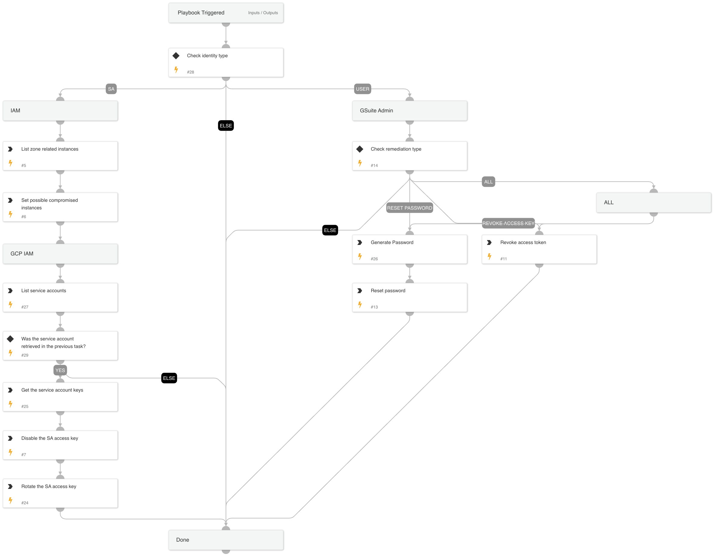

## **GCP Credentials Rotation Playbook**

### **IAM Remediation**
For compromised service accounts:
- **Access Key Disabling**: Immediately disable the compromised service account access key.

- **New Key Generation**: After ensuring the old key is disabled, generate a new access key.

### **GSuite Admin Remediation**
Admin accounts are crucial:
- **Reset Password**: Resets the user password to halt any unauthorized access.

- **Revoke Access Token**: Revoke any suspicious or unauthorized access tokens.

- **Combo Action**: Reset the password and revoke access tokens to ensure complete safety.

## Dependencies

This playbook uses the following sub-playbooks, integrations, and scripts.

### Sub-playbooks

This playbook does not use any sub-playbooks.

### Integrations

* GSuiteAdmin

### Scripts

* GeneratePassword
* Set

### Commands

* gsuite-user-update
* gcp-iam-service-account-key-create
* gcp-compute-list-instances
* gsuite-token-revoke
* gcp-iam-service-accounts-get
* gcp-iam-service-account-keys-get
* gcp-iam-service-account-key-disable

## Playbook Inputs

---

| **Name** | **Description** | **Default Value** | **Required** |
| --- | --- | --- | --- |
| GSuiteRemediationType | The response playbook provides the following remediation actions using GSuite Admin:  Reset: By entering "Reset" in the input, the playbook will execute password reset.  Revoke: By entering "Revoke" in the input, the playbook will execute access key suspension. \(Both the user and client IDs must be provided\)  ALL: By entering "ALL" in the input, the playbook will execute the password reset and revoke access key tasks. |  | Optional |
| userID | Identifies the user in the API request. The value can be the user's primary email address, alias email address, or unique user ID. |  | Optional |
| clientID | The client ID. |  | Optional |
| zone | The name of the zone. |  | Optional |
| serviceAccountEmail | The service account email. |  | Optional |
| identityType | The type of identity involved. Usually mapped to the incident field named 'cloudidentitytype'. e.g. USER,SERVICE_ACCOUNT,APPLICATION |  | Optional |
| cloudProject | The relevant project that the alert relates to. |  | Optional |

## Playbook Outputs

---

| **Path** | **Description** | **Type** |
| --- | --- | --- |
| GoogleCloudCompute.Instances | Google Cloud Compute instance information. | unknown |
| GCPIAM.ServiceAccountKey | The service account keys. | unknown |
| GCPIAM.ServiceAccount | The service account information. | unknown |

## Playbook Image

---

