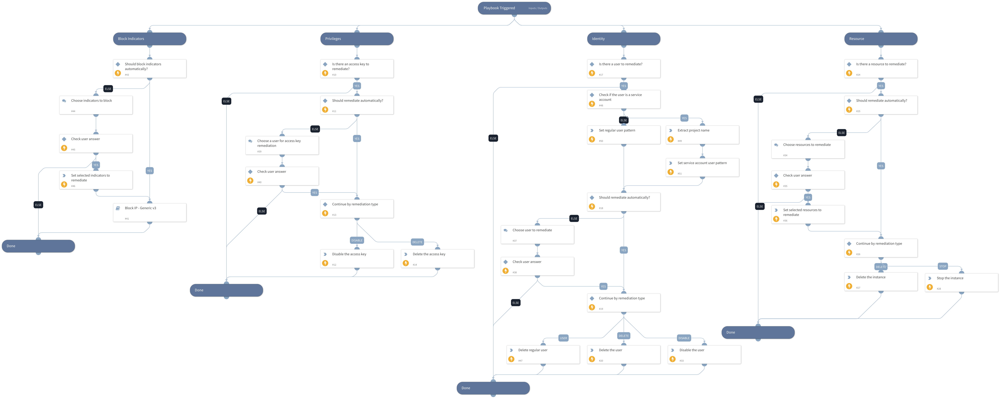

This playbook provides response actions to GCP. The following are available for execution automatically/manually:
- Resource remediation:
   - Delete the instance
   - Stop the instance
- Identity remediation:
   - Disable the user
   - Delete the user
- Access key remediation:
   - Disable the access key
   - Delete the access key
- Block indicators

## Dependencies
This playbook uses the following sub-playbooks, integrations, and scripts.

### Sub-playbooks
* Block IP - Generic v3

### Integrations
This playbook does not use any integrations.

### Scripts
* Set

### Commands
* gcp-iam-service-account-disable
* gcp-iam-service-account-key-disable
* gsuite-user-delete
* gcp-compute-stop-instance
* gcp-iam-service-account-delete
* gcp-iam-service-account-key-delete
* gcp-compute-delete-instance

## Playbook Inputs
---

| **Name** | **Description** | **Default Value** | **Required** |
| --- | --- | --- | --- |
| accessKeyRemediationType | Choose the remediation type for the user's access key. Disable - For disabling the user's access key. Delete - For deleting user's access key. | Disable | Optional |
| userRemediationType | Choose the remediation type for the user involved. Delete - For deleting the user. Disable - For disabling the user. | Disable | Optional |
| resourceRemediationType | Choose the remediation type for the instances created. Stop - For stopping the instances. Delete - For deleting the instances. | Stop | Optional |
| autoResourceRemediation | Whether to execute the resource remediation flow automatically. | False | Optional |
| autoUserRemediation | Whether to execute the user remediation flow automatically. | False | Optional |
| autoAccessKeyRemediation | Whether to execute the access key remediation flow automatically. | False | Optional |
| autoBlockIndicators | Whether to block the indicators automatically. | False | Optional |
| resourceName | The resource name to take action on. |  | Optional |
| resourceZone | The resource's zone. |  | Optional |
| username | The username to take action on. |  | Optional |
| accessKeyName | The access key name in the following format: projects/\{PROJECT_ID\}/serviceAccounts/\{ACCOUNT\}/keys/\{key\} |  | Optional |
| sourceIP | The source IP address of the attacker. |  | Optional |

## Playbook Outputs
---
There are no outputs for this playbook.

## Playbook Image
---
