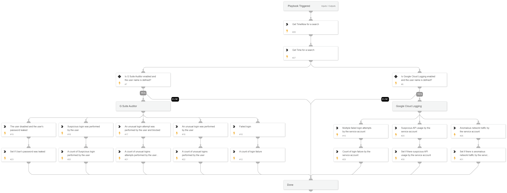

This playbook performs an investigation on a specific user in GCP environments, using queries and logs from G Suite Auditor, and GCP Logging.

## Dependencies

This playbook uses the following sub-playbooks, integrations, and scripts.

### Sub-playbooks

This playbook does not use any sub-playbooks.

### Integrations

This playbook does not use any integrations.

### Scripts

* GetTime
* Set

### Commands

* gsuite-activity-search
* gcp-logging-log-entries-list

## Playbook Inputs

---

| **Name** | **Description** | **Default Value** | **Required** |
| --- | --- | --- | --- |
| Username | The username to investigate. |  | Optional |
| GcpProjectName | The GCP project name. This is a mandatory field for GCP queries. |  | Optional |
| GcpTimeSearchFrom | The Search Time for the \`GetTime\` task used by the GCP Logging search query.  This value represents the number of days to include in the search. Default value: 1.  \(1 Day\) | 1 | Optional |

## Playbook Outputs

---

| **Path** | **Description** | **Type** |
| --- | --- | --- |
| GcpAnomalousNetworkTraffic | Determines whether there are events of anomalous network traffic performed by the user in the GCP environment. | unknown |
| GcpSuspiciousApiUsage | Determines whether there are event of suspicious Api usage by the user in the GCP environment. | unknown |
| GcpFailLogonCount | Count of failed logins by the user in the GCP environment. | unknown |
| GsuiteFailLogonCount | Count of failed logins by the user in the G Suite environment. | unknown |
| GsuiteUnusualLoginAllowedCount | Count of unusual logins performed by the user and allowed in the G Suite environment. | unknown |
| GsuiteUnusualLoginBlockedCount | Count of unusual logins performed by the user and blocked in the G Suite environment. | unknown |
| GsuiteSuspiciousLoginCount | Count of the suspicious logon performed by the user in the G Suite environment. | unknown |
| GsuiteUserPasswordLeaked | Determines whether user's password was leaked in the G Suite environment. | unknown |

## Playbook Image

---

