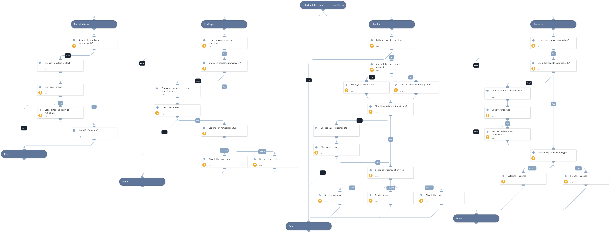
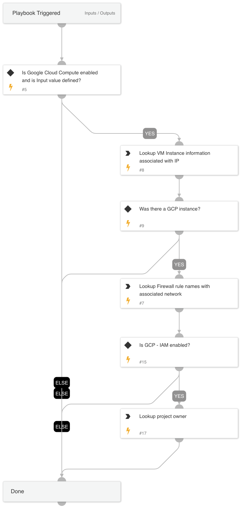
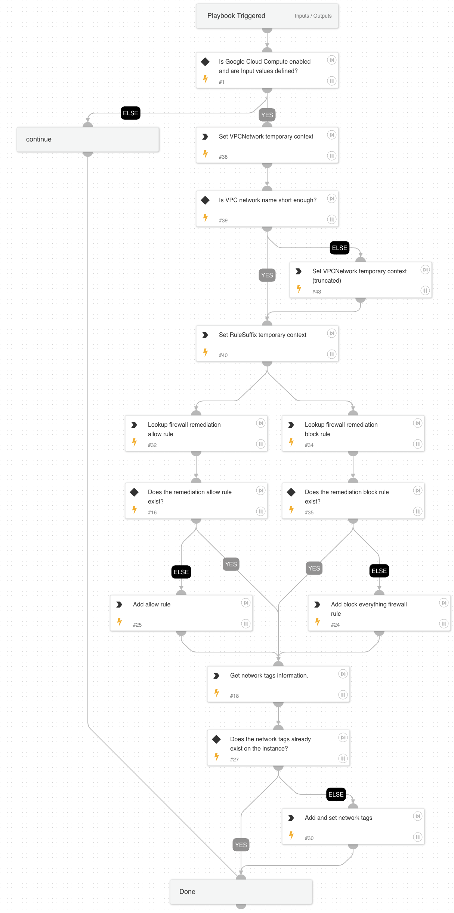
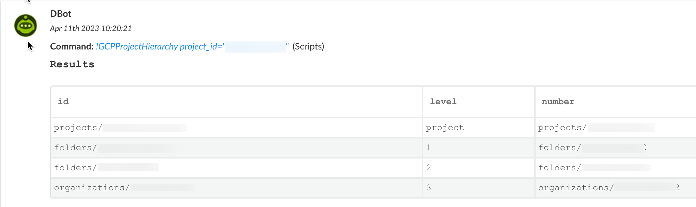

##### What does this pack do?

The pack is intended to contain GCP playbooks that conduct enrichment and/or remediation and can use other multiple GCP 
content packs.

There are multiple GCP content packs for multiple GCP products (GSuiteAdmin, GCP-IAM, Google Cloud Compute, etc).  The intent was that users can install and use only the packs they need.  However, if a GCP playbook uses multiple pack integrations (such
as GSuiteAdmin and GCP-IAM), they can't reside in one of the current packs because they include content from multiple packs.  This 
pack was created as a place to put GCP playbooks that use GCP integrations from multiple packs with a focus on enrichment and 
remediation.

### Playbooks

Users are only able to run the playbook in v6.5.0 or higher as it requires commands to execute the task.
This content pack includes the following playbooks: 

- Cloud Response - GCP

- GCP - Enrichment  

- GCP - Firewall Remediation

### Automation Scripts

#### GCPProjectHierarchy

Automation to determine GCP project hierarchy by looking up parent objects until the organization level is reached.

#### GCPOffendingFirewallRule

Automation to determine potential offending firewall rules in GCP based on port, protocol and possibly target tags (network tags).

