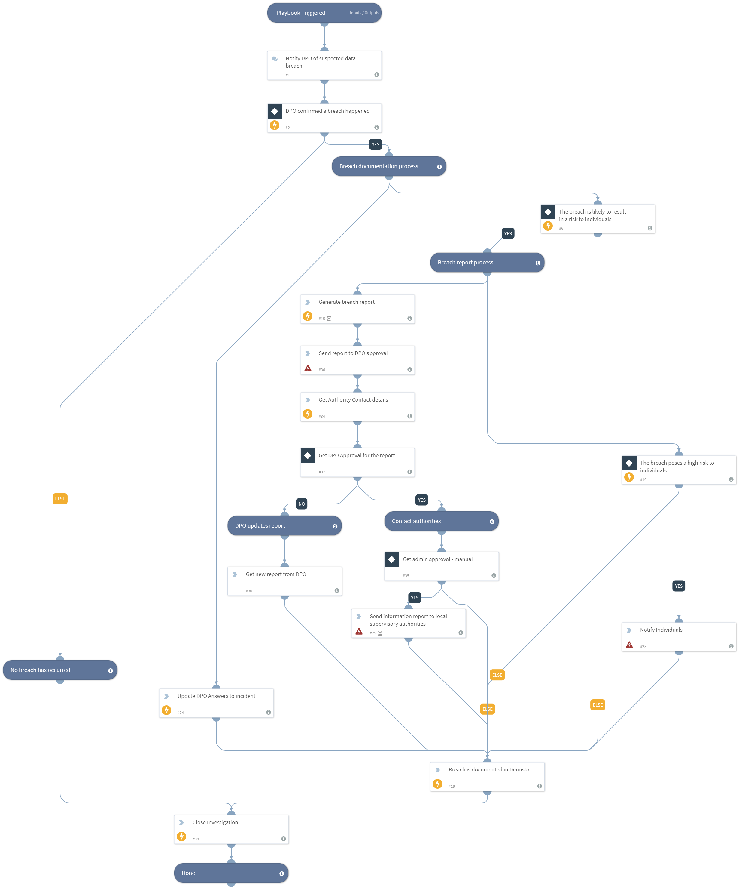

This playbook is triggered by a GDPR breach incident, and then performs the required tasks that are detailed in GDPR Article 33.
The General Data Protection Regulation (the GDPR) is a regulation in EU law on data protection and privacy of individuals. The GDPR introduces the requirement for a personal data breach to be notified to the competent national supervisory authority and in certain cases, to communicate the breach to the individuals whose personal data have been affected by the breach.
***Disclaimer: This playbook does not ensure compliance to the GDPR regulation. Before using this playbook, we advise consulting with the relevant authority, and adjusting it to the organization's needs.

## Dependencies
This playbook uses the following sub-playbooks, integrations, and scripts.

### Sub-playbooks
This playbook does not use any sub-playbooks.

### Integrations
* Builtin

### Scripts
* GenerateInvestigationSummaryReport
* GDPRContactAuthorities
* Print

### Commands
* closeInvestigation
* send-mail
* setIncident

## Playbook Inputs
---
There are no inputs for this playbook.

## Playbook Outputs
---
There are no outputs for this playbook.

## Playbook Image
---

## Playbook Demo Video
<video controls>
    <source src="https://github.com/demisto/content-assets/raw/7982404664dc68c2035b7c701d093ec026628802/Assets/GDPR/GDPR_Data_Breach_Notification.mp4"
            type="video/mp4"/>
    Sorry, your browser doesn't support embedded videos. You can download the video at: https://github.com/demisto/content-assets/blob/7982404664dc68c2035b7c701d093ec026628802/Assets/GDPR/GDPR_Data_Breach_Notification.mp4
</video>