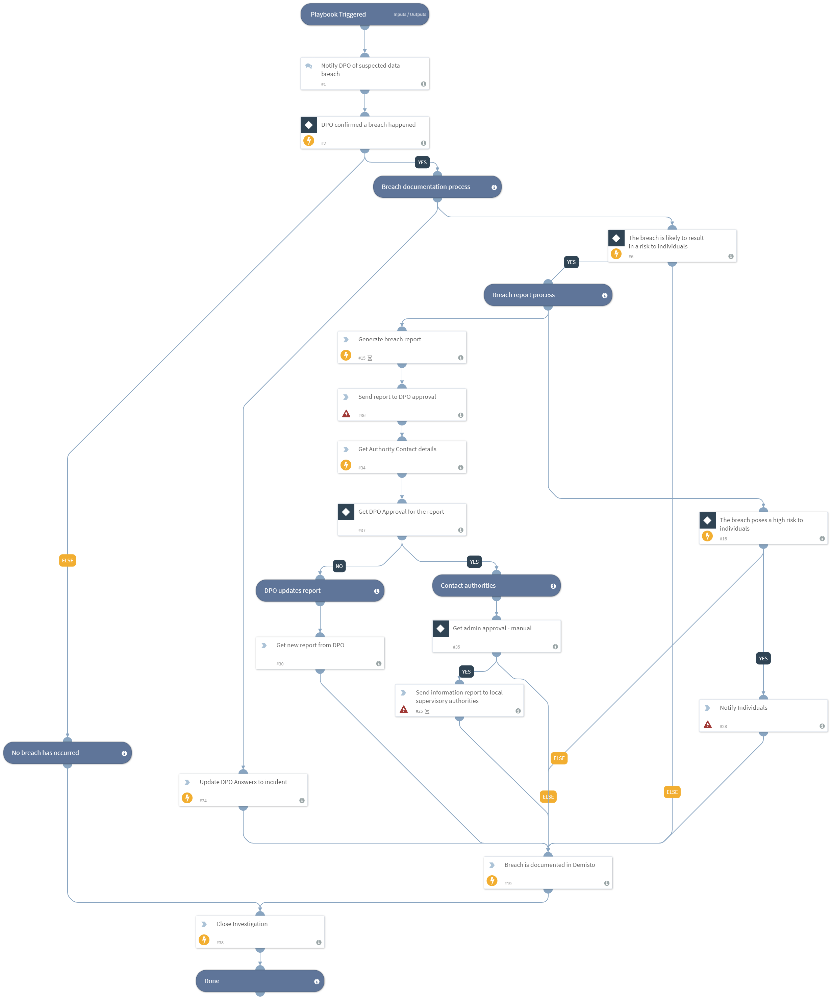

GDPR data breach investigations require security teams to reconcile data from multiple sources, and follow a series of processes to notify the relevant sources, according to the sensitivity of the information breached. Valuable time is lost shuttling between screens and executing repeatable tasks while the sensitive data is out there and the SLA time to handle the incident keeps ticking.
The ‘GDPR’ content pack contains the ‘GDPR Breach Notification’ playbook, that automates response to a data breach incident according to the GDPR requirements. The pack also contains the corresponding GDPR automation scripts, incident fields, views and layouts to facilitate the breach notification process.  
The General Data Protection Regulation (the GDPR) is a regulation in EU law on data protection and privacy of individuals. ***Disclaimer: This pack does not ensure compliance to the GDPR regulation. Before using the pack, we advise consulting with the relevant authorities, and adjusting it to the organization’s needs.***

##### What does this pack do?
The playbook triggers a GDPR breach incident, and then performs the required tasks that are detailed in GDPR Article 33.
The playbook included in this pack helps you save time and automate repetitive tasks associated with GDPR breach notification incidents:
- Gather the relevant data that is a part of the GDPR Data Breach incident and notify the organization’s Data Protection Officer about the breach.
- Choose the required remediation path to follow by the GDPR based on the DPO’s investigation.
- Create a SLA timer of 72 hours for the notification of the relevant supervisory authority, as required by the GDPR Article 33.
- Generate a breach report as required by the GDPR Article 33.
- Notify the relevant authorities based on the affected company’s country.
- If needed, notify the affected individuals about the breach.
 
As part of this pack, you will also get out-of-the-box malware incident type views, with incident classification mapping, fields and a full layout. All of these are easily customizable to suit the needs of your organization.

_For more information, visit our  [Cortex XSOAR Developer Docs](https://xsoar.pan.dev/docs/reference/playbooks/gdpr-breach-notification)_

