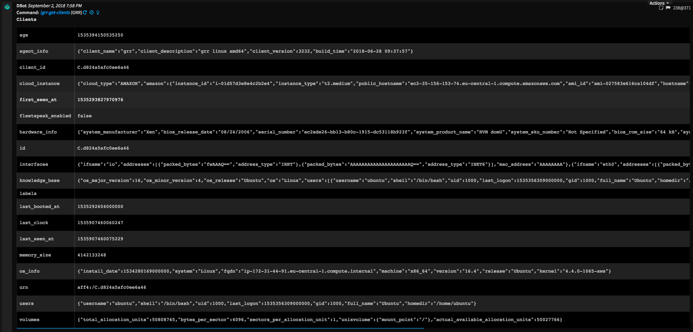

<!-- HTML_DOC -->
<h2>Overview</h2>

Use the GRR integration to manage and communicate with the clients connected to your GRR server.

This integration was integrated and tested with GRR Rapid Response v3.2.3.2.

<h2>Configure GRR on Cortex XSOAR</h2>

<ol>
<li>Navigate to <strong>Settings</strong> &gt; <strong>Integrations</strong> &gt; <strong>Servers &amp; Services</strong>.</li>
<li>Search for GRR.</li>
<li>Click <strong>Add instance</strong> to create and configure a new integration instance. 
<ul>
<li>
<strong>Name</strong>: a textual name for the integration instance.</li>
<li>
<strong>Server URL</strong>: e.g. <a href="https://192.168.0.1/" rel="nofollow">https://192.168.0.1</a>
</li>
<li>
<strong>Port</strong>: e.g. 8000</li>
<li>
<strong>Username</strong>: The username of the GRR server.</li>
<li><strong>Trust any certificate (not secure)</strong></li>
<li><strong>Use system proxy settings</strong></li>
</ul>
</li>
<li>Click <strong>Test</strong> to validate the URLs, token, and connection.</li>
</ol>
<h2>Commands</h2>

You can execute these commands from the Cortex XSOAR CLI, as part of an automation, or in a playbook. After you successfully execute a command, a DBot message appears in the War Room with the command details.

<ol>
<li><a href="#h_760325549601535960963666">Start a flow on a client: grr-set-flows</a></li>
<li><a href="#h_7791868101241535960968842">Get a list of flows: grr-get-flows</a></li>
<li><a href="#h_8647633621871535960975987">Get a list of available hunts: grr-get-hunts</a></li>
<li><a href="#h_8459505302491535960983242">Get hunt summary: grr-get-hunt</a></li>
<li><a href="#h_7579103053101535960989172">Set a hunt: grr-set-hunts</a></li>
<li><a href="#h_3546057193691535960996178">Get a list of clients: grr-get-clients</a></li>
</ol>
<h3 id="h_760325549601535960963666">1. Start a flow on a client</h3>

Starts a flow on a specified client according to optoinal parameters.

<h5>Base Command</h5>

<code>grr-set-flows</code>

<h5>Input</h5>
<table style="width: 748px;" border="2" cellpadding="6">
<thead>
<tr>
<th style="width: 228px;"><strong>Argument Name</strong></th>
<th style="width: 352px;"><strong>Description</strong></th>
<th style="width: 128px;"><strong>Required</strong></th>
</tr>
</thead>
<tbody>
<tr>
<td style="width: 228px;">client_id</td>
<td style="width: 352px;">ID of the client</td>
<td style="width: 128px;">Required</td>
</tr>
<tr>
<td style="width: 228px;">flow</td>
<td style="width: 352px;">JSON string of the flow to set</td>
<td style="width: 128px;">Required</td>
</tr>
<tr>
<td style="width: 228px;">headers</td>
<td style="width: 352px;">The headers to display in output</td>
<td style="width: 128px;">Optional</td>
</tr>
</tbody>
</table>
<h5> </h5>
<h5>Context Output</h5>
<table style="width: 748px;" border="2" cellpadding="6">
<thead>
<tr>
<th style="width: 214px;"><strong>Path</strong></th>
<th style="width: 371px;"><strong>Description</strong></th>
</tr>
</thead>
<tbody>
<tr>
<td style="width: 214px;">Flow</td>
<td style="width: 371px;">A GRR flow</td>
</tr>
<tr>
<td style="width: 214px;">Flow.ID</td>
<td style="width: 371px;">GRR flow ID</td>
</tr>
<tr>
<td style="width: 214px;">Flow.Args</td>
<td style="width: 371px;">GRR flow Args</td>
</tr>
<tr>
<td style="width: 214px;">Flow.Creator</td>
<td style="width: 371px;">GRR flow creator</td>
</tr>
<tr>
<td style="width: 214px;">Flow.LastActiveAt</td>
<td style="width: 371px;">When the flow was last active</td>
</tr>
<tr>
<td style="width: 214px;">Flow.NestedFlow</td>
<td style="width: 371px;">Nested GRR flows</td>
</tr>
<tr>
<td style="width: 214px;">Flow.StartedAt</td>
<td style="width: 371px;">When the flow was started</td>
</tr>
<tr>
<td style="width: 214px;">Flow.State</td>
<td style="width: 371px;">GRR flow state</td>
</tr>
</tbody>
</table>
<h5> </h5>
<h5>Command Example</h5>

<code>!grr-set-flows client_id="C.d824a5afc0ee6a46" flow="{\"name\":\"AnalyzeClientMemory\"}"</code>

<h5>Context Example</h5>
<pre>"Flow": [
        {
            "Expires": null, 
            "IsRobot": null, 
            "Description": null, 
            "Creator": "admin", 
            "NestedFlow": null, 
            "LastActiveAt": 1535900542748033, 
            "Args": {
                "request": {}
            }, 
            "State": "RUNNING", 
            "StartedAt": 1535900542745106, 
            "ID": "F:B51D6EAB", 
            "Created": null, 
            "Name": "AnalyzeClientMemory"
        }
    ]
}
</pre>
<h5>Human Readable Output</h5>

<h3 id="h_7791868101241535960968842">2. Get a list of flows</h3>

Lists flows launched on a specified client.

<h5>Base Command</h5>

<code>grr-get-flows</code>

<h5>Input</h5>
<table style="width: 748px;" border="2" cellpadding="6">
<thead>
<tr>
<th style="width: 227px;"><strong>Argument Name</strong></th>
<th style="width: 352px;"><strong>Description</strong></th>
<th style="width: 129px;"><strong>Required</strong></th>
</tr>
</thead>
<tbody>
<tr>
<td style="width: 227px;">client_id</td>
<td style="width: 352px;">ID of the client</td>
<td style="width: 129px;">Required</td>
</tr>
<tr>
<td style="width: 227px;">offset</td>
<td style="width: 352px;">Starting offset</td>
<td style="width: 129px;">Optional</td>
</tr>
<tr>
<td style="width: 227px;">count</td>
<td style="width: 352px;">Maximum number of flows to fetch</td>
<td style="width: 129px;">Optional</td>
</tr>
<tr>
<td style="width: 227px;">headers</td>
<td style="width: 352px;">The headers to display in output</td>
<td style="width: 129px;">Optional</td>
</tr>
</tbody>
</table>
<h5> </h5>
<h5>Context Output</h5>
<table style="width: 748px;" border="2" cellpadding="6">
<thead>
<tr>
<th style="width: 214px;"><strong>Path</strong></th>
<th style="width: 371px;"><strong>Description</strong></th>
</tr>
</thead>
<tbody>
<tr>
<td style="width: 214px;">Flow</td>
<td style="width: 371px;">A GRR flow</td>
</tr>
<tr>
<td style="width: 214px;">Flow.ID</td>
<td style="width: 371px;">GRR flow ID</td>
</tr>
<tr>
<td style="width: 214px;">Flow.Args</td>
<td style="width: 371px;">GRR flow Args</td>
</tr>
<tr>
<td style="width: 214px;">Flow.Creator</td>
<td style="width: 371px;">GRR flow creator</td>
</tr>
<tr>
<td style="width: 214px;">Flow.LastActiveAt</td>
<td style="width: 371px;">When the flow was last active</td>
</tr>
<tr>
<td style="width: 214px;">Flow.NestedFlow</td>
<td style="width: 371px;">Nested GRR flows</td>
</tr>
<tr>
<td style="width: 214px;">Flow.StartedAt</td>
<td style="width: 371px;">When the flow was started</td>
</tr>
<tr>
<td style="width: 214px;">Flow.State</td>
<td style="width: 371px;">GRR flow state</td>
</tr>
</tbody>
</table>
<h5> </h5>
<h5>Command Example</h5>

<code>!grr-get-flows client_id="C.d824a5afc0ee6a46" count="2"</code>

<h5>Context Example</h5>
<pre>{
    "Flow": [
        {
            "Expires": null, 
            "IsRobot": null, 
            "Description": null, 
            "Creator": "admin", 
            "NestedFlow": [], 
            "LastActiveAt": 1535900632278975, 
            "Args": {
                "request": {}
            }, 
            "State": "TERMINATED", 
            "StartedAt": 1535900542745106, 
            "ID": "F:B51D6EAB", 
            "Created": null, 
            "Name": "AnalyzeClientMemory"
        }, 
        {
            "Expires": null, 
            "IsRobot": null, 
            "Description": null, 
            "Creator": "admin", 
            "NestedFlow": [], 
            "LastActiveAt": 1535854160731193, 
            "Args": {
                "request": {}
            }, 
            "State": "TERMINATED", 
            "StartedAt": 1535853917723700, 
            "ID": "F:88F4F65D", 
            "Created": null, 
            "Name": "AnalyzeClientMemory"
        }
    ]
}
</pre>
<h5>Human Readable Output</h5>

<h3 id="h_8647633621871535960975987">3. Get a list of available hunts</h3>

Renders list of available hunts

<h5>Base Command</h5>

<code>grr-get-hunts</code>

<h5>Input</h5>
<table style="width: 746px;" border="2" cellpadding="6">
<thead>
<tr>
<th style="width: 149px;"><strong>Argument Name</strong></th>
<th style="width: 488px;"><strong>Description</strong></th>
<th style="width: 71px;"><strong>Required</strong></th>
</tr>
</thead>
<tbody>
<tr>
<td style="width: 149px;">offset</td>
<td style="width: 488px;">Starting offset</td>
<td style="width: 71px;">Optional</td>
</tr>
<tr>
<td style="width: 149px;">count</td>
<td style="width: 488px;">Maximumn number of items to fetch</td>
<td style="width: 71px;">Optional</td>
</tr>
<tr>
<td style="width: 149px;">created_by</td>
<td style="width: 488px;">Only return hunts created by a specified user. If the <em>approved_by</em> and/or <em>description_contains</em> arguments are specified, then logical AND is applied to all criteria. This filter can only be used in conjunction with the <em>active_within</em> filter (to prevent queries of death).</td>
<td style="width: 71px;">Optional</td>
</tr>
<tr>
<td style="width: 149px;">description_contains</td>
<td style="width: 488px;">Only return hunts where the description contains given sub-string (matching is case-insensitive). If the <em>created_by</em> and/or <em>approved_by</em> arguments are specified, then logical AND is applied to all criteria. This filter can only be used in conjunction with the <em>active_within</em> filter (to prevent queries of death).</td>
<td style="width: 71px;">Optional</td>
</tr>
<tr>
<td style="width: 149px;">active_within</td>
<td style="width: 488px;">Only return hunts that were active within given time duration</td>
<td style="width: 71px;">Optional</td>
</tr>
<tr>
<td style="width: 149px;">headers</td>
<td style="width: 488px;">The headers to display in output</td>
<td style="width: 71px;">Optional</td>
</tr>
</tbody>
</table>
<h5> </h5>
<h5>Context Output</h5>
<table style="width: 748px;" border="2" cellpadding="6">
<thead>
<tr>
<th style="width: 187px;"><strong>Path</strong></th>
<th style="width: 408px;"><strong>Description</strong></th>
</tr>
</thead>
<tbody>
<tr>
<td style="width: 187px;">Hunt</td>
<td style="width: 408px;">A GRR hunt</td>
</tr>
<tr>
<td style="width: 187px;">Hunt.ID</td>
<td style="width: 408px;">GRR hunt ID</td>
</tr>
<tr>
<td style="width: 187px;">Hunt.Creator</td>
<td style="width: 408px;">GRR hunt creator</td>
</tr>
<tr>
<td style="width: 187px;">Hunt.Description</td>
<td style="width: 408px;">GRR hunt description</td>
</tr>
<tr>
<td style="width: 187px;">Hunt.Created</td>
<td style="width: 408px;">Time the GRR hunt was created</td>
</tr>
<tr>
<td style="width: 187px;">Hunt.Expires</td>
<td style="width: 408px;">Time the GRR hunt expires</td>
</tr>
<tr>
<td style="width: 187px;">Hunt.IsRobot</td>
<td style="width: 408px;">Whether the hunt originated from a robot</td>
</tr>
<tr>
<td style="width: 187px;">Hunt.Name</td>
<td style="width: 408px;">GRR hunt name</td>
</tr>
<tr>
<td style="width: 187px;">Hunt.State</td>
<td style="width: 408px;">GRR hunt state</td>
</tr>
</tbody>
</table>
<h5> </h5>
<h5>Command Example</h5>

<code>!grr-get-hunts count=2</code>

<h5>Context Example</h5>
<pre>{
    "Hunt": [
        {
            "Expires": 1537063517000000, 
            "Description": "", 
            "Creator": "admin", 
            "IsRobot": false, 
            "State": "PAUSED", 
            "ID": "H:7B7F45F", 
            "Created": 1535853917657925, 
            "Name": "GenericHunt"
        }, 
        {
            "Expires": 1537059453000000, 
            "Description": "", 
            "Creator": "admin", 
            "IsRobot": false, 
            "State": "PAUSED", 
            "ID": "H:AED24E68", 
            "Created": 1535849853550599, 
            "Name": "GenericHunt"
        }
    ]
}
</pre>
<h5>Human Readable Output</h5>

<h3 id="h_8459505302491535960983242">4. Get hunt summary</h3>

Returns the summary of a specified hunt.

<h5>Base Command</h5>

<code>grr-get-hunt</code>

<h5>Input</h5>
<table style="width: 748px;" border="2" cellpadding="6">
<thead>
<tr>
<th style="width: 233px;"><strong>Argument Name</strong></th>
<th style="width: 339px;"><strong>Description</strong></th>
<th style="width: 136px;"><strong>Required</strong></th>
</tr>
</thead>
<tbody>
<tr>
<td style="width: 233px;">hunt_id</td>
<td style="width: 339px;">GRR hunt id</td>
<td style="width: 136px;">Required</td>
</tr>
<tr>
<td style="width: 233px;">headers</td>
<td style="width: 339px;">The headers to display in output</td>
<td style="width: 136px;">Optional</td>
</tr>
</tbody>
</table>
<h5> </h5>
<h5>Context Output</h5>
<table style="width: 748px;" border="2" cellpadding="6">
<thead>
<tr>
<th style="width: 187px;"><strong>Path</strong></th>
<th style="width: 408px;"><strong>Description</strong></th>
</tr>
</thead>
<tbody>
<tr>
<td style="width: 187px;">Hunt</td>
<td style="width: 408px;">A GRR hunt</td>
</tr>
<tr>
<td style="width: 187px;">Hunt.ID</td>
<td style="width: 408px;">GRR hunt ID</td>
</tr>
<tr>
<td style="width: 187px;">Hunt.Creator</td>
<td style="width: 408px;">GRR hunt creator</td>
</tr>
<tr>
<td style="width: 187px;">Hunt.Description</td>
<td style="width: 408px;">GRR hunt description</td>
</tr>
<tr>
<td style="width: 187px;">Hunt.Created</td>
<td style="width: 408px;">Time the GRR hunt was created</td>
</tr>
<tr>
<td style="width: 187px;">Hunt.Expires</td>
<td style="width: 408px;">Time the GRR hunt expires</td>
</tr>
<tr>
<td style="width: 187px;">Hunt.IsRobot</td>
<td style="width: 408px;">Whether the hunt originated from a robot</td>
</tr>
<tr>
<td style="width: 187px;">Hunt.Name</td>
<td style="width: 408px;">GRR hunt name</td>
</tr>
<tr>
<td style="width: 187px;">Hunt.State</td>
<td style="width: 408px;">GRR hunt state</td>
</tr>
</tbody>
</table>
<h5> </h5>
<h5>Command Example</h5>

<code>!grr-get-hunt hunt_id=H:7B7F45F</code>

<h5>Context Example</h5>
<pre>{
    "Hunt": [
        {
            "Expires": 1537063517000000, 
            "Description": "", 
            "Creator": "admin", 
            "IsRobot": false, 
            "State": "PAUSED", 
            "ID": "H:7B7F45F", 
            "Created": 1535853917657925, 
            "Name": "GenericHunt"
        }
    ]
}
</pre>
<h5>Human Readable Output</h5>

<h3 id="h_7579103053101535960989172">5. Set a hunt</h3>

Handles hunt creation request.

<h5>Base Command</h5>

<code>grr-set-hunts</code>

<h5>Input</h5>
<table style="width: 748px;" border="2" cellpadding="6">
<thead>
<tr>
<th style="width: 245px;"><strong>Argument Name</strong></th>
<th style="width: 320px;"><strong>Description</strong></th>
<th style="width: 143px;"><strong>Required</strong></th>
</tr>
</thead>
<tbody>
<tr>
<td style="width: 245px;">hunt_runner_args</td>
<td style="width: 320px;">Hunt runner arguments</td>
<td style="width: 143px;">Optional</td>
</tr>
<tr>
<td style="width: 245px;">hunt_args</td>
<td style="width: 320px;">Hunt arguments</td>
<td style="width: 143px;">Optional</td>
</tr>
<tr>
<td style="width: 245px;">headers</td>
<td style="width: 320px;">The headers to display</td>
<td style="width: 143px;">Optional</td>
</tr>
</tbody>
</table>
<h5> </h5>
<h5>Context Output</h5>

There is no context output for this command.

<h5>Command Example</h5>

<code>!grr-set-hunts</code>

<h5>Context Example</h5>
<pre>{
    "Hunt": [
        {
            "Expires": 1537117003000000, 
            "Description": "", 
            "Creator": "admin", 
            "IsRobot": false, 
            "State": "PAUSED", 
            "ID": "H:74EB48EE", 
            "Created": 1535907403638694, 
            "Name": "GenericHunt"
        }
    ]
}
</pre>
<h5>Human Readable Output</h5>

<h3 id="h_3546057193691535960996178">6. Get a list of clients</h3>

Returns results of a client search.

<h5>Base Command</h5>

<code>grr-get-clients</code>

<h5>Input</h5>
<table style="width: 746px;" border="2" cellpadding="6">
<thead>
<tr>
<th style="width: 139px;"><strong>Argument Name</strong></th>
<th style="width: 498px;"><strong>Description</strong></th>
<th style="width: 71px;"><strong>Required</strong></th>
</tr>
</thead>
<tbody>
<tr>
<td style="width: 139px;">query</td>
<td style="width: 498px;">Search query string. See the <a href="https://grr-doc.readthedocs.io/en/latest/" target="_blank" rel="noopener">GRR documentation</a> for more information.</td>
<td style="width: 71px;">Optional</td>
</tr>
<tr>
<td style="width: 139px;">offset</td>
<td style="width: 498px;">Found clients starting offset</td>
<td style="width: 71px;">Optional</td>
</tr>
<tr>
<td style="width: 139px;">count</td>
<td style="width: 498px;">Number of found clients to fetch</td>
<td style="width: 71px;">Optional</td>
</tr>
<tr>
<td style="width: 139px;">headers</td>
<td style="width: 498px;">The headers to display in output</td>
<td style="width: 71px;">Optional</td>
</tr>
</tbody>
</table>
<h5> </h5>
<h5>Context Output</h5>
<table style="width: 748px;" border="2" cellpadding="6">
<thead>
<tr>
<th style="width: 223px;"><strong>Path</strong></th>
<th style="width: 378px;"><strong>Description</strong></th>
</tr>
</thead>
<tbody>
<tr>
<td style="width: 223px;">Client</td>
<td style="width: 378px;">GRR client</td>
</tr>
<tr>
<td style="width: 223px;">Client.ID</td>
<td style="width: 378px;">GRR client ID</td>
</tr>
<tr>
<td style="width: 223px;">Client.LastBootedAt</td>
<td style="width: 378px;">GRR client LastBootedAt time</td>
</tr>
<tr>
<td style="width: 223px;">Client.FirstSeenAt</td>
<td style="width: 378px;">GRR client FirstSeenAt time</td>
</tr>
<tr>
<td style="width: 223px;">Client.LatClock</td>
<td style="width: 378px;">GRR client LastClock</td>
</tr>
<tr>
<td style="width: 223px;">Client.LastCrashAt</td>
<td style="width: 378px;">GRR client LastCrashAt time</td>
</tr>
<tr>
<td style="width: 223px;">Client.AgentInfo</td>
<td style="width: 378px;">GRR client AgentInfo</td>
</tr>
<tr>
<td style="width: 223px;">Client.HardwareInfo</td>
<td style="width: 378px;">GRR client HardwareInfo</td>
</tr>
<tr>
<td style="width: 223px;">Client.Interfaces</td>
<td style="width: 378px;">GRR client interfaces</td>
</tr>
<tr>
<td style="width: 223px;">Client.Labels</td>
<td style="width: 378px;">GRR client labels</td>
</tr>
<tr>
<td style="width: 223px;">Client.OS</td>
<td style="width: 378px;">GRR client OS details</td>
</tr>
<tr>
<td style="width: 223px;">Client.User</td>
<td style="width: 378px;">GRR Client user</td>
</tr>
<tr>
<td style="width: 223px;">Client.Volumes</td>
<td style="width: 378px;">GRR client volumes</td>
</tr>
</tbody>
</table>
<h5> </h5>
<h5>Command Example</h5>

<code>!grr-get-clients</code>

<h5>Context Example</h5>
<pre>{
    "Client": [
        {
            "HardwareInfo": {
                "system_product_name": "HVM domU", 
                "bios_rom_size": "64 kB", 
                "bios_vendor": "Xen", 
                "system_sku_number": "Not Specified", 
                "system_family": "Not Specified", 
                "system_uuid": "EC2EDE26-BB13-B80C-1915-DC53118B923F", 
                "system_manufacturer": "Xen", 
                "bios_release_date": "08/24/2006", 
                "bios_version": "4.2.amazon", 
                "serial_number": "ec2ede26-bb13-b80c-1915-dc53118b923f", 
                "bios_revision": "4.2"
            }, 
            "LastClock": 1535907460060247, 
            "Interfaces": [
                {
                    "ifname": "lo", 
                    "addresses": [
                        {
                            "packed_bytes": "fwAAAQ==", 
                            "address_type": "INET"
                        }, 
                        {
                            "packed_bytes": "AAAAAAAAAAAAAAAAAAAAAQ==", 
                            "address_type": "INET6"
                        }
                    ], 
                    "mac_address": "AAAAAAAA"
                }, 
                {
                    "ifname": "eth0", 
                    "addresses": [
                        {
                            "packed_bytes": "rB8sWw==", 
                            "address_type": "INET"
                        }, 
                        {
                            "packed_bytes": "/oAAAAAAAAAE1kv//h5yfg==", 
                            "address_type": "INET6"
                        }
                    ], 
                    "mac_address": "BtZLHnJ+"
                }
            ], 
            "OS": {
                "kernel": "4.4.0-1065-aws", 
                "install_date": 1534280169000000, 
                "system": "Linux", 
                "fqdn": "ip-172-31-44-91.eu-central-1.compute.internal", 
                "machine": "x86_64", 
                "version": "16.4", 
                "release": "Ubuntu"
            }, 
            "AgentInfo": {
                "client_name": "grr", 
                "client_description": "grr linux amd64", 
                "client_version": 3232, 
                "build_time": "2018-06-28 09:37:57"
            }, 
            "Labels": [], 
            "LastBootedAt": 1535292604000000, 
            "FirstSeenAt": 1535293827970976, 
            "User": [
                {
                    "username": "ubuntu", 
                    "shell": "/bin/bash", 
                    "homedir": "/home/ubuntu", 
                    "last_logon": 1535356309000000, 
                    "gid": 1000, 
                    "full_name": "Ubuntu", 
                    "uid": 1000
                }
            ], 
            "Volumes": [
                {
                    "total_allocation_units": 50808745, 
                    "bytes_per_sector": 4096, 
                    "sectors_per_allocation_unit": 1, 
                    "unixvolume": {
                        "mount_point": "/"
                    }, 
                    "actual_available_allocation_units": 50027766
                }
            ], 
            "LastCrashAt": null, 
            "LastSeenAt": 1535907460075229, 
            "ID": "C.d824a5afc0ee6a46"
        }
    ]
}
</pre>
<h5>Human Readable Output</h5>

