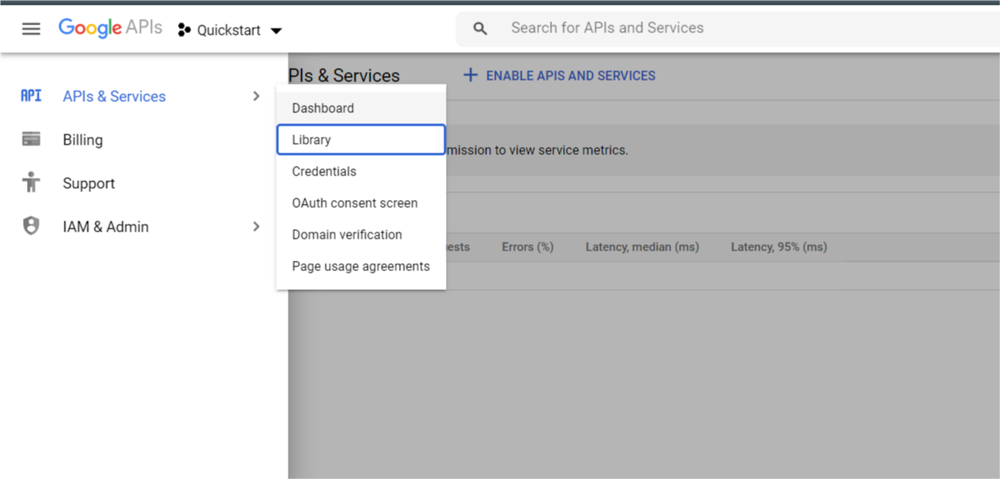
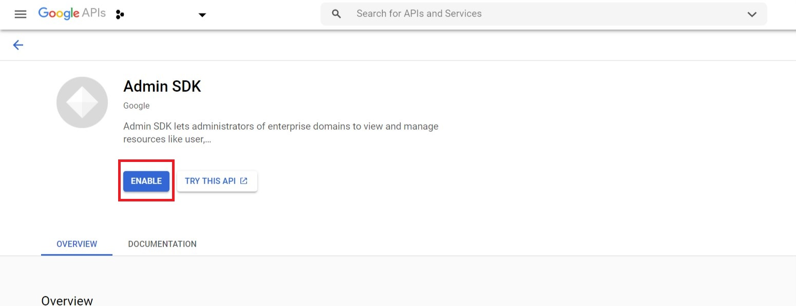
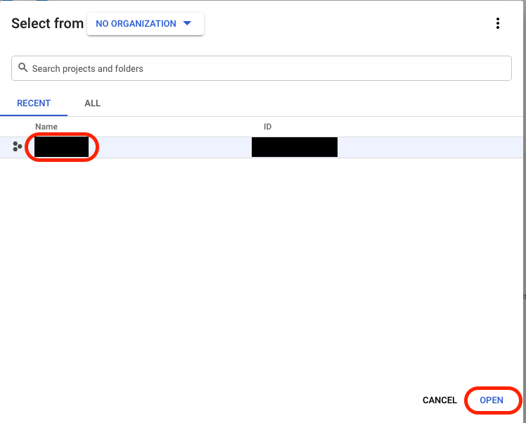
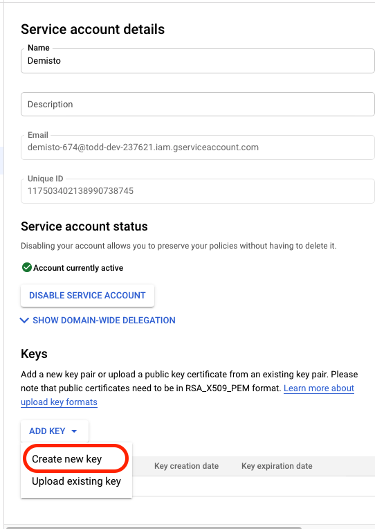
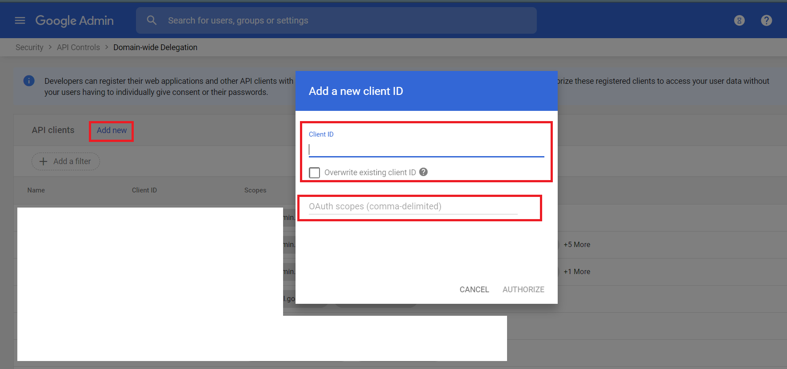

G Suite or Google Workspace Admin is an integration to perform an action on IT infrastructure, create users, update settings, and more administrative tasks.
This integration was integrated and tested majorly with G Suite Basic edition.

## Configure Service Account for G Suite Admin

1. Go to [https://console.developers.google.com](https://console.developers.google.com).

2. Select or create a project:

    


3. Enable the Admin SDK API:
    
    1. Under the main menu, select APIs & Services -> 'Libary':
        
    
    2. Enable ``Admin SDK``:
        
    
    3. Select the project and click 'OPEN':
            

4. Create a service account with correct restricted permissions:

    1. Under the main menu, select IAM & Admin -> Service Accounts:
        
    
    2. In the top bar, select ``CREATE SERVICE ACCOUNT``:
        
    
    3. Under the main menu, select ``IAM & Admin`` -> ``Service Accounts`` and open the account you just created.
    
    4. Generate new credentials:
        1. On the Service account details page, under Keys, click ADD KEY and select Create new key:
            
        
        2. Under Key type, select ``JSON``, and click ``CREATE``. Save the credentials in a secure location. You will need the generated ``credentials.json`` file when you configure the instance in Cortex XSOAR:
               

## Add Scopes in G Suite Admin

1. Go to [https://admin.google.com](https://admin.google.com)

2. Click Menu and select ``Security`` -> ``API Controls``:
    

3. Under ``Domain wide delegation`` tab, Click ``MANAGE DOMAIN WIDE DELEGATION``:
    

4. Click on ``Add new`` and the window will prompt, enter Client ID from your ``credentials.json`` and required scopes from integration tips.
               

5. Click ``AUTHORIZE``.

## Configure G Suite  Admin on Cortex XSOAR

1. Navigate to **Settings** > **Integrations** > **Servers & Services**.
2. Search for G Suite Admin.
3. Click **Add instance** to create and configure a new integration instance.

| **Parameter** | **Description** | **Required** |
| --- | --- | --- |
| user_service_account_json | User's Service Account JSON | True |
| admin_email | An admin email is required for the Test validation to run, if not configured, then each command can receive an admin_email argument as optional | False |
| insecure | Trust any certificate \(not secure\) | False |
| proxy | Use system proxy settings | False |

4. Click **Test** to validate ``credentails.json``, and connection.
## Commands
You can execute these commands from the Cortex XSOAR CLI, as part of an automation, or in a playbook.
After you successfully execute a command, a DBot message appears in the War Room with the command details.


### gsuite-mobile-update
***
Takes an action that affects a mobile device. For example, remotely wiping a device.

##### Required Permissions
`https://www.googleapis.com/auth/admin.directory.device.mobile.action`

#### Base Command

`gsuite-mobile-update`
#### Input

| **Argument Name** | **Description** | **Required** |
| --- | --- | --- |
| customer_id | The unique ID of the customer's G Suite account. | Required | 
| resource_id | The unique ID used to identify the mobile device. | Required | 
| action | The action to be performed on the device.<br/><br/>Available Options:<br/>admin_account_wipe - Remotely wipes only G Suite data from the device.<br/><br/>admin_remote_wipe - Remotely wipes all data on the device.<br/><br/>approve - Approves the device.<br/><br/>block - Blocks access to G Suite data on the device.<br/><br/>cancel_remote_wipe_then_activate - Cancels a remote wipe of the device and then reactivates it.<br/><br/>cancel_remote_wipe_then_block - Cancels a remote wipe of the device and then blocks it. | Required | 
| admin_email | Email ID of the G Suite domain admin acts on behalf of an end-user. | Optional | 


#### Context Output

There is no context output for this command.

#### Command Example
``` 
!gsuite-mobile-update resource_id=RESOURCE_ID  action=admin_account_wipe customer_id=my_customer admin_email=admin@domain.io
```

#### Human Readable Output
> Mobile device with resource id - RESOURCE_ID updated.


### gsuite-mobile-delete
***
Removes a mobile device. Note that this does not break the device's sync, it simply removes it from the list of devices connected to the domain. If the device still has a valid login/authentication, it will be added back on it's next successful sync.

##### Required Permissions
`https://www.googleapis.com/auth/admin.directory.user.readonly`
`https://www.googleapis.com/auth/admin.directory.user `
`https://www.googleapis.com/auth/cloud-platform `

#### Base Command

`gsuite-mobile-delete`
#### Input

| **Argument Name** | **Description** | **Required** |
| --- | --- | --- |
| customer_id | The unique ID of the customer's G Suite account. | Required | 
| resource_id | The unique ID used to identify the mobile device. | Required | 
| admin_email | Email ID of the G Suite domain admin acts on behalf of an end-user. | Optional | 


#### Context Output

There is no context output for this command.

#### Command Example
```!gsuite-mobile-delete customer_id=my_customer resource_id=AFFIQUAU-Adjghah-rezwed admin_email=adminemail@domain.com```


#### Human Readable Output

>Mobile device with resource id - AFFIQUAU-Adjghah-rezwed deleted.


### gsuite-user-alias-add
***
Adds an alias.

##### Required Permissions
`https://www.googleapis.com/auth/admin.directory.user.alias`
`https://www.googleapis.com/auth/admin.directory.user `

#### Base Command

`gsuite-user-alias-add`
#### Input

| **Argument Name** | **Description** | **Required** |
| --- | --- | --- |
| user_key | Identifies the user in the API request. The value can be the user's primary email address, alias email address, or unique user ID. | Required | 
| alias | The alias email address. | Required | 
| admin_email | Email ID of the G Suite domain admin acts on behalf of an end-user. | Optional | 


#### Context Output

| **Path** | **Type** | **Description** |
| --- | --- | --- |
| GSuite.UserAlias.kind | String | The type of the API resource. | 
| GSuite.UserAlias.id | String | The unique ID for the user. | 
| GSuite.UserAlias.etag | String | ETag of the resource. | 
| GSuite.UserAlias.alias | String | The alias email address. | 


#### Command Example
```!gsuite-user-alias-add alias=alias_321@domain.com user_key=demoaccount@domain.com admin_email=user1@domain.com```

#### Context Example
```
{
    "GSuite": {
        "UserAlias": {
            "alias": "alias_321@domain.com",
            "etag": "\"kUnwYYg1BVyzlZxLWewcY0fcrpfz6LbI3xDE6gsvPl4/jJ5Cz1VAIrUEoGZlaiop-HTSKJ4\"",
            "id": "108028652821197762751",
            "kind": "admin#directory#alias"
        }
    }
}
```

#### Human Readable Output

>Added alias "alias_321@domain.com" to user key "demoaccount@domain.com".


### gsuite-user-create
***
Creates a user.

##### Required Permissions
`https://www.googleapis.com/auth/admin.directory.user`

#### Base Command

`gsuite-user-create`
#### Input

| **Argument Name** | **Description** | **Required** |
| --- | --- | --- |
| first_name | The user's first name. | Required | 
| last_name | The user's last name. | Required | 
| password | Stores the password for the user account. A password can contain any combination of ASCII characters. A minimum of 8 characters is required. The maximum length is 100 characters. The password will be sent in MD5 hash format. | Required | 
| primary_email | The user's primary email address. The primary_email must be unique and cannot be an alias of another user. | Required | 
| country | User's Country. | Optional | 
| address_type | The address type. | Optional | 
| postal_code | The ZIP or postal code, if applicable. | Optional | 
| is_address_primary | Set to true, If this is the user's primary address. | Optional | 
| extended_address | For extended addresses, such as an address that includes a sub-region. | Optional | 
| region | The abbreviated province or state. | Optional | 
| street_address | The street address, such as 1600 Amphitheatre Parkway. Whitespace within the string is ignored; however, newlines are significant. | Optional | 
| secondary_email_address | The user's secondary email address. | Optional | 
| secondary_email_type | The type of the secondary email account. | Optional | 
| gender | User's gender. | Optional | 
| is_ip_white_listed | If true, the user's IP address is added to allow list. | Optional | 
| notes_content_type | Content type of note, either plain text or HTML. If not provided, considered as plain text. | Optional | 
| notes_value | Contents of notes. | Optional | 
| phone_number | A human-readable phone number. It may be in any telephone number format. | Optional | 
| phone_number_type | The type of phone number. | Optional | 
| is_phone_number_primary | Indicates if this is the user's primary phone number. A user may only have one primary phone number. | Optional | 
| recovery_email | Recovery email of the user. | Optional | 
| recovery_phone | Recovery phone of the user. The phone number must be in the E.164 format, starting with the plus sign (+). Example: +16506661212. | Optional | 
| suspended | Indicates if the user is suspended. | Optional | 
| admin_email | Email ID of the G Suite domain admin acts on behalf of an end-user. | Optional | 


#### Context Output

| **Path** | **Type** | **Description** |
| --- | --- | --- |
| GSuite.User.id | String | The unique ID for the user. | 
| GSuite.User.primaryEmail | String | The user's primary email address. | 
| GSuite.User.firstName | String | The user's first name. | 
| GSuite.User.lastName | String | The user's last name. | 
| GSuite.User.customerId | String | The unique ID for the customer's G Suite account. | 
| GSuite.User.gender | String | Gender. | 
| GSuite.User.suspended | Boolean | Indicates if the user is suspended. | 
| GSuite.User.notesValue | String | Contents of notes. | 
| GSuite.User.notesContentType | String | Content type of notes. | 
| GSuite.User.isAdmin | Boolean | Indicates a user with super administrator privileges. | 
| GSuite.User.creationTime | Date | The time the user's account was created. | 
| GSuite.User.phones.value | String | A human-readable phone number. It may be in any telephone number format. | 
| GSuite.User.phones.type | String | The type of phone number. | 
| GSuite.User.phones.primary | Boolean | Indicates if this is the user's primary phone number. | 
| GSuite.User.addresses.type | String | The address type. | 
| GSuite.User.addresses.country | String | Country. | 
| GSuite.User.addresses.postalCode | String | The ZIP or postal code. | 
| GSuite.User.addresses.region | String | The abbreviated province or state. | 
| GSuite.User.addresses.streetAddress | String | The street address. | 
| GSuite.User.addresses.extendedAddress | String | For extended addresses, such as an  address that includes a sub-region. | 
| GSuite.User.addresses.primary | Boolean | If this is the user's primary address. | 
| GSuite.User.emails.address | String | The user's secondary email. | 
| GSuite.User.emails.type | String | The secondary email type. | 
| GSuite.User.ipWhitelisted | Boolean | If true, the user's IP address is added to allow list. | 
| GSuite.User.recoveryEmail | String | Recovery email of the user. | 
| GSuite.User.isDelegatedAdmin | Boolean | Indicates if the user is a delegated administrator. | 
| GSuite.User.recoveryPhone | String | Recovery phone of the user. | 
| GSuite.User.orgUnitPath | String | The full path of the parent organization associated with the user. If the parent organization is the top-level, it is represented as a forward slash \(/\). | 
| GSuite.User.isMailboxSetup | Boolean | Indicates if the user's Google mailbox is created. | 
| GSuite.User.kind | Boolean | The type of the API resource. | 
| GSuite.User.etag | Boolean | ETag of the resource. | 
| GSuite.User.hashFunction | String | Stores the hash format of the password property. | 


#### Command Example
```!gsuite-user-create admin_email=adminemail@domain.com first_name="new" last_name="user" primary_email="new.user@domain.com" password="user@123"```

#### Context Example
``` 
{
 "GSuite":{
       "User": {
           "creationTime": "2020-09-22T11:26:26.000Z",
           "customerId": "C03puekhd",
           "etag": "\"kUnwYYg1BVyzlZxLWewcY0fcrpfz6LbI3xDE6gsvPl4/4tvQSgzvpG3jXKVblT3Ey-0_slk\"",
           "firstName": "new",
           "hashFunction": "MD5",
           "id": "111364427621472798290",
           "isAdmin": false,
           "isDelegatedAdmin": false,
           "isMailboxSetup": false,
           "kind": "admin#directory#user",
           "lastName": "user",
           "orgUnitPath": "/",
           "primaryEmail": "new.user@domain.com"
       }
   }
}
```

#### Human Readable Output

>### User Details
>|Id|Customer Id|Primary Email|First Name|Last Name|Is Admin|Creation Time|
>|---|---|---|---|---|---|---|
>| 111364427621472798290 | C03puekhd | new.user@domain.com | new | user | false | 2020-09-22T11:26:26.000Z |


### gsuite-group-create
***
Creates a group with a group name and its description.

##### Required Permissions
`https://www.googleapis.com/auth/admin.directory.group`

#### Base Command

`gsuite-group-create`
#### Input

| **Argument Name** | **Description** | **Required** |
| --- | --- | --- |
| group_email | The group's email address. | Required | 
| group_name | The group's display name. | Optional | 
| group_description | An extended description to help users determine the purpose of a group. | Optional | 
| admin_email | Email ID of the G Suite domain admin acts on behalf of an end-user. | Optional | 


#### Context Output

| **Path** | **Type** | **Description** |
| --- | --- | --- |
| GSuite.Group.kind | String | The type of the API resource. | 
| GSuite.Group.id | String | The unique ID of a group. | 
| GSuite.Group.etag | String | ETag of the resource. | 
| GSuite.Group.email | String | The group's email address. | 
| GSuite.Group.name | String | The group's display name. | 
| GSuite.Group.directMembersCount | String | The number of users that are direct members of the group. | 
| GSuite.Group.description | String | An extended description to help users determine the purpose of a group. | 
| GSuite.Group.adminCreated | Boolean | Value is true if this group was created by an administrator rather than a user. | 
| GSuite.Group.aliases | String | List of a group's alias email addresses. | 
| GSuite.Group.nonEditableAliases | String | List of the group's non-editable alias email addresses that are outside of the account's primary domain or subdomains. | 


#### Command Example
```!gsuite-group-create group_email="testsgroup@domain.com" admin_email=adminemail@domain.com group_description="group description"```

#### Context Example
```
{
    "GSuite": {
        "Group": {
            "adminCreated": true,
            "description": "group description",
            "email": "testsgroup@domain.com",
            "etag": "\"kUnwYYg1BVyzlZxLWewcY0fcrpfz6LbI3xDE6gsvPl4/LI8IDdZB9k7tBdClkZja0jnTX9k\"",
            "id": "017dp8vu2zdcnpe",
            "kind": "admin#directory#group",
            "name": "testsgroup"
        }
    }
}
```

#### Human Readable Output

>### A new group named "testsgroup" created.
>|Id|Email|Description|Admin Created|
>|---|---|---|---|
>| 017dp8vu2zdcnpe | testsgroup@domain.com | group description | true |


### gsuite-role-assignment-list
***
Retrieves a paginated list of all role assignments.

##### Required Permissions
`https://www.googleapis.com/auth/admin.directory.rolemanagement.readonly`
`https://www.googleapis.com/auth/admin.directory.rolemanagement`

#### Base Command

`gsuite-role-assignment-list`
#### Input

| **Argument Name** | **Description** | **Required** |
| --- | --- | --- |
| customer_id | Immutable ID of the G Suite account. | Required | 
| role_id | Immutable ID of a role. If included, it returns only role assignments containing this role ID. | Optional | 
| user_key | The user's primary email address, alias email address, or unique user ID. If included in the request, returns role assignments only for this user. | Optional | 
| page_token | Token to specify the next page in the list. | Optional | 
| max_results | Maximum number of results to return. Acceptable values are 1 to 200, inclusive. | Optional | 
| admin_email | Email ID of the G Suite domain admin acts on behalf of an end-user. | Optional | 


#### Context Output

| **Path** | **Type** | **Description** |
| --- | --- | --- |
| GSuite.RoleAssignment.kind | String | The type of the API resource. | 
| GSuite.RoleAssignment.etag | String | ETag of the resource. | 
| GSuite.RoleAssignment.roleAssignmentId | Number | ID of this role assignment. | 
| GSuite.RoleAssignment.roleId | Number | The ID of the role that is assigned. | 
| GSuite.RoleAssignment.assignedTo | String | The unique ID of the user this role is assigned to. | 
| GSuite.RoleAssignment.scopeType | String | The scope in which this role is assigned. | 
| GSuite.RoleAssignment.orgUnitId | String | If the role is restricted to an organization unit, this contains the ID of the organization unit to which the exercise of this role is restricted to. | 
| GSuite.PageToken.RoleAssignment.nextPageToken | String | Token to specify the next page in the list. | 


#### Command Example
```!gsuite-role-assignment-list customer_id=my_customer admin_email=adminemail@domain.com max_results=2 user_key=112697610```

#### Context Example
```
{
    "GSuite": {
        "PageToken": {
            "RoleAssignment": {
                "nextPageToken": "1380118834"
            }
        },
        "RoleAssignment": [
            {
                "assignedTo": "112697610",
                "etag": "\"kUnwYYg1BVyzlZxLWewcY0fcrpfz6LbI3xDE6gsvPl4/HNRTxaa_Vj5uoXcenlvlCaLm5ZM\"",
                "kind": "admin#directory#roleAssignment",
                "roleAssignmentId": "1380118833",
                "roleId": "1380118839",
                "scopeType": "CUSTOMER"
            },
            {
                "assignedTo": "112697610",
                "etag": "\"kUnwYYg1BVyzlZxLWewcY0fcrpfz6LbI3xDE6gsvPl4/AjrcWjoYFdv8ZnxLMYDX7UhbA3w\"",
                "kind": "admin#directory#roleAssignment",
                "roleAssignmentId": "1380118834",
                "roleId": "1380118838",
                "scopeType": "CUSTOMER"
            }
        ]
    }
}
```

#### Human Readable Output

>### Next Page Token: 1380118834
>### Total Retrieved Role Assignment(s): 2
>|Role Assignment Id|Role Id|Assigned To|Scope Type|
>|---|---|---|---|
>| 1380118833 | 1380118839 | 112697610 | CUSTOMER |
>| 1380118834 | 1380118838 | 112697610 | CUSTOMER |


### gsuite-role-assignment-create
***
Creates a role assignment.

##### Required Permissions
`https://www.googleapis.com/auth/admin.directory.rolemanagement`

#### Base Command

`gsuite-role-assignment-create`
#### Input

| **Argument Name** | **Description** | **Required** |
| --- | --- | --- |
| customer_id | Immutable ID of the G Suite account. | Required | 
| role_id | The ID of the role to be assigned to the user. | Required | 
| assigned_to | The unique ID of the user this role is assigned to. | Required | 
| scope_type | The scope in which this role is assigned. | Required | 
| org_unit_id | If the role is restricted to an organization unit, this contains the ID for the organization unit the exercise of this role is restricted to. | Optional | 
| admin_email | Email ID of the G Suite domain admin acts on behalf of an end-user. | Optional | 


#### Context Output

| **Path** | **Type** | **Description** |
| --- | --- | --- |
| GSuite.RoleAssignment.kind | String | The type of the API resource. | 
| GSuite.RoleAssignment.etag | String | ETag of the resource. | 
| GSuite.RoleAssignment.roleAssignmentId | Number | ID of this role assignment. | 
| GSuite.RoleAssignment.roleId | Number | The ID of the role that is assigned. | 
| GSuite.RoleAssignment.assignedTo | String | The unique ID of the user this role is assigned to. | 
| GSuite.RoleAssignment.scopeType | String | The scope in which this role is assigned. | 
| GSuite.RoleAssignment.orgUnitId | String | If the role is restricted to an organization unit, this contains the ID of the organization unit to which the exercise of this role is restricted to. | 


#### Command Example
```!gsuite-role-assignment-create assigned_to=112697610 customer_id=my_customer role_id=13801188331880450 scope_type=CUSTOMER admin_email=adminemail@domain.com```

#### Context Example
```
{
    "GSuite": {
        "RoleAssignment": {
            "assignedTo": "112697610",
            "etag": "\"kUnwYYg1BVyzlZxLWewcY0fcrpfz6LbI3xDE6gsvPl4/bSzQO50Ycd4Fn6ibBqIioX4qhj0\"",
            "kind": "admin#directory#roleAssignment",
            "roleAssignmentId": "331880504",
            "roleId": "13801188331880450",
            "scopeType": "CUSTOMER"
        }
    }
}
```

#### Human Readable Output

>### Role Assignment Details
>|Role Assignment Id|Role Id|Assigned To|Scope Type|
>|---|---|---|---|
>| 331880504 | 13801188331880450 | 112697610 | CUSTOMER |


### gsuite-role-create
***
Creates a new role.

##### Required Permissions
`https://www.googleapis.com/auth/admin.directory.rolemanagement`

#### Base Command

`gsuite-role-create`
#### Input

| **Argument Name** | **Description** | **Required** |
| --- | --- | --- |
| customer_id | Immutable ID of the G Suite account. | Required | 
| role_name | Name of the role. | Required | 
| role_privileges | The set of privileges that are granted to this role. Comma-separated list of privilege names and service ids of the form "PrivilegeName1:ServiceId1,PrivilegeName2:ServiceId2". | Required | 
| role_description | A short description of the role. | Optional | 
| admin_email | Email ID of the G Suite domain admin acts on behalf of an end-user. | Optional | 


#### Context Output

| **Path** | **Type** | **Description** |
| --- | --- | --- |
| GSuite.Role.kind | String | The type of the API resource. This is always admin\#directory\#role. | 
| GSuite.Role.etag | String | ETag of the resource. | 
| GSuite.Role.roleId | Number | ID of the role. | 
| GSuite.Role.roleName | String | Name of the role. | 
| GSuite.Role.roleDescription | String | A short description of the role. | 
| GSuite.Role.rolePrivileges.privilegeName | String | The name of the privilege. | 
| GSuite.Role.rolePrivileges.serviceId | String | The obfuscated ID of the service this privilege is for. | 
| GSuite.Role.isSystemRole | Boolean | Whether this is a pre-defined system role. | 
| GSuite.Role.isSuperAdminRole | Boolean | Whether the role is a super admin role. | 


#### Command Example
``` 
!gsuite-role-create customer_id=my_customer role_name role_privileges="PRIVILEGE_NAME:service_id" 
admin_email=admin@domain.com
```


#### Context Example
``` 
{
 "GSuite": {
   "Role": {
     "kind": "admin#directory#role",
     "etag": "\"XVqXMfEoKXKeCEJHh6Z_d9s0pNqKA90jMskGKajpbM8/JL5ppEimKvC4Ue7Bfhb0qv7Ahqw\"",
     "roleId": "13801188331880469",
     "roleName": "role_22345",
     "rolePrivileges": [
       {
         "privilegeName": "PRIVILEGE_NAME",
         "serviceId": "service_id"
       }
     ]
   }
 }
}
```


#### Human Readable Output

>### A new role created.
>|Id|Name|Privileges|
>|---|---|---|
>| 13801188331880469 | role_22345 | PRIVILEGE_NAME: service_id |


### gsuite-token-revoke
***
Delete all access tokens issued by a user for an application.

##### Required Permissions
`https://www.googleapis.com/auth/admin.directory.user.security`

#### Base Command

`gsuite-token-revoke`
#### Input

| **Argument Name** | **Description** | **Required** |
| --- | --- | --- |
| client_id | The Client ID of the application the token is issued to. | Required | 
| user_key | Identifies the user in the API request. The value can be the user's primary email address, alias email address, or unique user ID. | Required | 
| admin_email | Email ID of the G Suite domain admin acts on behalf of an end-user. | Optional | 


#### Context Output

There is no context output for this command.

#### Command Example
```!gsuite-token-revoke client_id=297408095146-fug707qsjv4ikron0hugpevbrjhkmsk7.apps.googleusercontent.com user_key=user1@domain.com admin_email=adminemail@domain.com```


#### Human Readable Output

>All access tokens deleted for 297408095146-fug707qsjv4ikron0hugpevbrjhkmsk7.apps.googleusercontent.com.


### gsuite-user-signout
***
 Signs a user out of all web and device sessions and reset their sign-in cookies.

##### Required Permissions
`https://www.googleapis.com/auth/admin.directory.user.security`

#### Base Command

`gsuite-user-signout`
#### Input

| **Argument Name** | **Description** | **Required** |
| --- | --- | --- |
| user_key | Identifies the user in the API request. The value can be the user's primary email address, alias email address, or unique user ID. | Required |

#### Context Output

There is no context output for this command.

### gsuite-datatransfer-list
***
Lists the transfers for a customer by source user, destination user, or status.

##### Required Permissions
`https://www.googleapis.com/auth/admin.datatransfer`
`https://www.googleapis.com/auth/admin.datatransfer.readonly`

#### Base Command

`gsuite-datatransfer-list`

#### Input

| **Argument Name** | **Description** | **Required** |
| --- | --- | --- |
| customer_id | Immutable ID of the G Suite account. | Optional | 
| new_owner_user_id | Destination user's profile ID. | Optional | 
| old_owner_user_id | Source user's profile ID. | Optional | 
| status | Status of the transfer. | Optional | 
| admin_email | Email ID of the G Suite domain admin acts on behalf of an end-user. | Optional | 
| max_results | Maximum number of results to return. Default is 100. Acceptable values are 1 to 500, inclusive. | Optional | 
| page_token | Token to specify the next page in the list. | Optional | 


#### Context Output

| **Path** | **Type** | **Description** |
| --- | --- | --- |
| GSuite.DataTransfer.kind | String | Identifies the resource as a DataTransfer request. | 
| GSuite.DataTransfer.etag | String | ETag of the resource. | 
| GSuite.DataTransfer.id | String | The transfer's ID. | 
| GSuite.DataTransfer.oldOwnerUserId | String | ID of the user whose data is being transferred. | 
| GSuite.DataTransfer.newOwnerUserId | String | ID of the user to whom the data is being transferred. | 
| GSuite.DataTransfer.overallTransferStatusCode | String | Overall transfer status. | 
| GSuite.DataTransfer.requestTime | Date | The time at which the data transfer was requested. | 
| GSuite.DataTransfer.applicationDataTransfers.applicationTransferStatus | String | Current status of transfer for this application. | 
| GSuite.DataTransfer.applicationDataTransfers.applicationId | Number | The application's ID. | 
| GSuite.DataTransfer.applicationDataTransfers.applicationTransferParams.key | String | The type of the transfer parameter. | 
| GSuite.DataTransfer.applicationDataTransfers.applicationTransferParams.value | Unknown | The value of the corresponding transfer parameter. | 
| GSuite.PageToken.DataTransfer.nextPageToken | String | Continuation token which will be used to specify next page in list API. | 


#### Command Example
```!gsuite-datatransfer-list admin_email=adminemail@domain.com customer_id=my_customer max_results=2```

#### Context Example
```
{
    "GSuite": {
        "DataTransfer": [
            {
                "applicationDataTransfers": [
                    {
                        "applicationId": "55656082996",
                        "applicationTransferParams": [
                            {
                                "key": "PRIVACY_LEVEL",
                                "value": [
                                    "PRIVATE",
                                    "SHARED"
                                ]
                            }
                        ],
                        "applicationTransferStatus": "completed"
                    }
                ],
                "etag": "\"kUnwYYg1BVyzlZxLWewcY0fcrpfz6LbI3xDE6gsvPl4/a30QB7XJOzBUhwPRCWCP1g2o7do\"",
                "id": "AKrEtIYG88pek5zyrIzBx7kV5g4JNiUshLFkMbPUYKXsTgRGIJvAyjpzpti9I38WXJ70t6ef0fUIx0EM82KfN_PPP7KKNfHeSQ",
                "kind": "admin#datatransfer#DataTransfer",
                "newOwnerUserId": "103744886667034914950",
                "oldOwnerUserId": "111046242590772774691",
                "overallTransferStatusCode": "completed",
                "requestTime": "2020-09-14T06:30:55.672Z"
            },
            {
                "applicationDataTransfers": [
                    {
                        "applicationId": "55656082996",
                        "applicationTransferParams": [
                            {
                                "key": "PRIVACY_LEVEL",
                                "value": [
                                    "PRIVATE",
                                    "SHARED"
                                ]
                            }
                        ],
                        "applicationTransferStatus": "completed"
                    }
                ],
                "etag": "\"kUnwYYg1BVyzlZxLWewcY0fcrpfz6LbI3xDE6gsvPl4/SAQmSzZJLc6bhvvGfKFwlvsd_Fg\"",
                "id": "AKrEtIYG88pek5zyrIzBx7kV5g4Jha32YbTTHrbqLTPGaiqmLKuA3WFU7zyxmmkwUrGZcf73dt4SAcDmj5_GeCgoCRFJWbyIxg",
                "kind": "admin#datatransfer#DataTransfer",
                "newOwnerUserId": "103744886667034914950",
                "oldOwnerUserId": "111046242590772774691",
                "overallTransferStatusCode": "completed",
                "requestTime": "2020-09-14T06:31:01.051Z"
            }
        ],
        "PageToken": {
            "DataTransfer": {
                "nextPageToken": "AKrEtIYG88pek5zyrIzBx7kV5g4Jha32YbTTHrbqLTPGaiqmLKuA3WFU7zyxmmkwUrGZcf73dt4SAcDmj5_GeCgoCRFJWbyIxg"
            }
        }
    }
}
```

#### Human Readable Output

>### Next Page Token: AKrEtIYG88pek5zyrIzBx7kV5g4Jha32YbTTHrbqLTPGaiqmLKuA3WFU7zyxmmkwUrGZcf73dt4SAcDmj5_GeCgoCRFJWbyIxg
>
>### Total Retrieved Data Transfers: 2
>|Id|Old Owner User Id|New Owner User Id|Overall Transfer Status Code|Request Time|Application Data Transfers|
>|---|---|---|---|---|---|
>| AKrEtIYG88pek5zyrIzBx7kV5g4JNiUshLFkMbPUYKXsTgRGIJvAyjpzpti9I38WXJ70t6ef0fUIx0EM82KfN_PPP7KKNfHeSQ | 111046242590772774691 | 103744886667034914950 | completed | 2020-09-14T06:30:55.672Z | Application Id: 55656082996<br/>Application Transfer Status: completed<br/><br/> |
>| AKrEtIYG88pek5zyrIzBx7kV5g4Jha32YbTTHrbqLTPGaiqmLKuA3WFU7zyxmmkwUrGZcf73dt4SAcDmj5_GeCgoCRFJWbyIxg | 111046242590772774691 | 103744886667034914950 | completed | 2020-09-14T06:31:01.051Z | Application Id: 55656082996<br/>Application Transfer Status: completed<br/><br/> |


### gsuite-custom-user-schema-create
***
Creates a custom user schema to add custom fields to user profiles.
Note: field_raw_json has higher precedence when both field_raw_json and field_json_entry_id are provided.

##### Required Permissions
`https://www.googleapis.com/auth/admin.directory.userschema`

#### Base Command

`gsuite-custom-user-schema-create`
#### Input

| **Argument Name** | **Description** | **Required** |
| --- | --- | --- |
| admin_email | Email ID of the G Suite domain admin acts on behalf of an end-user. | Optional | 
| customer_id | Immutable ID of the G Suite account. | Required | 
| schema_name | The schema's name. | Required | 
| schema_display_name | Display name for the schema. | Required | 
| field_raw_json | Raw JSON containing fields of the schema. Acceptable values for<br/>fieldType are BOOL, DATE, DOUBLE, EMAIL, INT64, PHONE, and STRING. Acceptable<br/>values for readAccessType are ADMINS_AND_SELF- Only administrators and<br/>the associated user can see values, and ALL_DOMAIN_USERS- Any user in<br/>your domain can see values.<br/>E.g.<br/>{<br/>  "fields": [<br/>    {<br/>      "fieldType": string,<br/>      "fieldName": string,<br/>      "displayName": string,<br/>      "multiValued": boolean,<br/>      "readAccessType": string,<br/>      "indexed": boolean,<br/>      "numericIndexingSpec": {<br/>        "minValue": double,<br/>        "maxValue": double<br/>      }<br/>    }<br/>  ]<br/>}<br/> | Optional | 
| field_json_entry_id | JSON file entry ID containing fields of the schema. Acceptable values for<br/>fieldType are BOOL, DATE, DOUBLE, EMAIL, INT64, PHONE, and STRING. Acceptable<br/>values for readAccessType are ADMINS_AND_SELF- Only administrators and<br/>the associated user can see values, and ALL_DOMAIN_USERS- Any user in<br/>your domain can see values.<br/>E.g.<br/>{<br/>  "fields": [<br/>    {<br/>      "fieldType": string,<br/>      "fieldName": string,<br/>      "displayName": string,<br/>      "multiValued": boolean,<br/>      "readAccessType": string,<br/>      "indexed": boolean,<br/>      "numericIndexingSpec": {<br/>        "minValue": double,<br/>        "maxValue": double<br/>      }<br/>    }<br/>  ]<br/>}<br/> | Optional | 


#### Context Output

| **Path** | **Type** | **Description** |
| --- | --- | --- |
| GSuite.UserSchema.kind | String | The type of the API resource. | 
| GSuite.UserSchema.etag | String | The ETag of the resource. | 
| GSuite.UserSchema.schemaId | String | The unique identifier of the schema. | 
| GSuite.UserSchema.schemaName | String | The schema's name. | 
| GSuite.UserSchema.displayName | String | Display Name for the schema. | 
| GSuite.UserSchema.fields.kind | String | The kind of resource this is. | 
| GSuite.UserSchema.fields.fieldId | String | The unique identifier of the field. | 
| GSuite.UserSchema.fields.etag | String | The ETag of the field. | 
| GSuite.UserSchema.fields.fieldType | String | The type of the field. | 
| GSuite.UserSchema.fields.fieldName | String | The name of the field. | 
| GSuite.UserSchema.fields.displayName | String | Display name of the field. | 
| GSuite.UserSchema.fields.multiValued | Boolean | A boolean specifying whether this is a multi-valued field or not. | 
| GSuite.UserSchema.fields.readAccessType | Boolean | Specifies who can view values of this field. | 
| GSuite.UserSchema.fields.indexed | Boolean | Specifies whether the field is indexed or not. | 
| GSuite.UserSchema.fields.numericIndexingSpecMinValue | Number | Minimum value of this field. | 
| GSuite.UserSchema.fields.numericIndexingSpecMaxValue | Number | Maximum value of this field. | 


#### Command Example
```!gsuite-custom-user-schema-create customer_id=my_customer schema_display_name=test44 schema_name=schema_name4 admin_email=adminemail@domain.com  field_raw_json="{\"fields\":[{\"fieldType\":\"BOOL\",\"fieldName\":\"surname4\",\"displayName\":\"Surname4\",\"multiValued\":true}]}"```

#### Context Example
```
{
    "GSuite": {
        "UserSchema": {
            "displayName": "test44",
            "etag": "\"kUnwYYg1BVyzlZxLWewcY0fcrpfz6LbI3xDE6gsvPl4/MjPzd5dwc-Ht2kOBcz-U0AZNWFA\"",
            "fields": [
                {
                    "displayName": "Surname4",
                    "etag": "\"kUnwYYg1BVyzlZxLWewcY0fcrpfz6LbI3xDE6gsvPl4/O3s2wxQMfyD89C1J8b2M021ICl4\"",
                    "fieldId": "ltlnHmK5SJGk8zXvNWYA9g==",
                    "fieldName": "surname4",
                    "fieldType": "BOOL",
                    "kind": "admin#directory#schema#fieldspec",
                    "multiValued": true,
                    "readAccessType": "ALL_DOMAIN_USERS"
                }
            ],
            "kind": "admin#directory#schema",
            "schemaId": "5JijaVh6R7ar7zK0u95XSw==",
            "schemaName": "schema_name4"
        }
    }
}
```

#### Human Readable Output

>### Custom User Schema Details
>Schema Id: 5JijaVh6R7ar7zK0u95XSw== \
>Schema Name: schema_name4 \
>Schema Display Name: test44
>### Field Details
>|Field Id|Field Name|Display Name|Field Type|Read Access Type|Multi Valued|
>|---|---|---|---|---|---|
>| ltlnHmK5SJGk8zXvNWYA9g== | surname4 | Surname4 | BOOL | ALL_DOMAIN_USERS | true |


### gsuite-custom-user-schema-update
***
Updates a custom user schema.
Note: field_raw_json has higher precedence when both field_raw_json and field_json_entry_id are provided.

##### Required Permissions
`https://www.googleapis.com/auth/admin.directory.userschema`

#### Base Command

`gsuite-custom-user-schema-update`
#### Input

| **Argument Name** | **Description** | **Required** |
| --- | --- | --- |
| admin_email | Email ID of the G Suite domain admin acts on behalf of an end-user. | Optional | 
| customer_id | Immutable ID of the G Suite account. | Required | 
| schema_name | The schema's name. | Optional | 
| schema_id | Immutable ID of the schema. | Optional | 
| schema_display_name | Display name for the schema. | Optional | 
| field_raw_json | Raw JSON containing fields of the schema. Acceptable values for<br/>fieldType are BOOL, DATE, DOUBLE, EMAIL, INT64, PHONE, and STRING. Acceptable<br/>values for readAccessType are ADMINS_AND_SELF- Only administrators and<br/>the associated user can see values, and ALL_DOMAIN_USERS- Any user in<br/>your domain can see values.<br/>E.g.<br/>{<br/>  "fields": [<br/>    {<br/>      "fieldType": string,<br/>      "fieldName": string,<br/>      "displayName": string,<br/>      "multiValued": boolean,<br/>      "readAccessType": string,<br/>      "indexed": boolean,<br/>      "numericIndexingSpec": {<br/>        "minValue": double,<br/>        "maxValue": double<br/>      }<br/>    }<br/>  ]<br/>}<br/> | Optional | 
| field_json_entry_id | JSON file entry ID containing fields of the schema. Acceptable values for<br/>fieldType are BOOL, DATE, DOUBLE, EMAIL, INT64, PHONE, and STRING. Acceptable<br/>values for readAccessType are ADMINS_AND_SELF- Only administrators and<br/>the associated user can see values, and ALL_DOMAIN_USERS- Any user in<br/>your domain can see values.<br/>E.g.<br/>{<br/>  "fields": [<br/>    {<br/>      "fieldType": string,<br/>      "fieldName": string,<br/>      "displayName": string,<br/>      "multiValued": boolean,<br/>      "readAccessType": string,<br/>      "indexed": boolean,<br/>      "numericIndexingSpec": {<br/>        "minValue": double,<br/>        "maxValue": double<br/>      }<br/>    }<br/>  ]<br/>}<br/> | Optional | 


#### Context Output

| **Path** | **Type** | **Description** |
| --- | --- | --- |
| GSuite.UserSchema.kind | String | The type of the API resource. | 
| GSuite.UserSchema.etag | String | The ETag of the resource. | 
| GSuite.UserSchema.schemaId | String | The unique identifier of the schema. | 
| GSuite.UserSchema.schemaName | String | The schema's name. | 
| GSuite.UserSchema.displayName | String | Display Name for the schema. | 
| GSuite.UserSchema.fields.kind | String | The kind of resource this is. | 
| GSuite.UserSchema.fields.fieldId | String | The unique identifier of the field. | 
| GSuite.UserSchema.fields.etag | String | The ETag of the field. | 
| GSuite.UserSchema.fields.fieldType | String | The type of the field. | 
| GSuite.UserSchema.fields.fieldName | String | The name of the field. | 
| GSuite.UserSchema.fields.displayName | String | Display name of the field. | 
| GSuite.UserSchema.fields.multiValued | Boolean | A boolean specifying whether this is a multi-valued field or not. | 
| GSuite.UserSchema.fields.readAccessType | Boolean | Specifies who can view values of this field. | 
| GSuite.UserSchema.fields.indexed | Boolean | Specifies whether the field is indexed or not. | 
| GSuite.UserSchema.fields.numericIndexingSpecMinValue | Number | Minimum value of this field. | 
| GSuite.UserSchema.fields.numericIndexingSpecMaxValue | Number | Maximum value of this field. | 


#### Command Example
```!gsuite-custom-user-schema-update customer_id=my_customer admin_email=adminemail@domain.com field_raw_json="{\"fields\":[{\"fieldType\":\"BOOL\",\"fieldName\":\"surname\",\"displayName\":\"Surname\",\"multiValued\":true}]}" schema_id=ZZi9zLU7ROmyBoufhbn9gg== schema_name=test222```

#### Context Example
```
{
    "GSuite": {
        "UserSchema": {
            "displayName": "test222",
            "etag": "\"kUnwYYg1BVyzlZxLWewcY0fcrpfz6LbI3xDE6gsvPl4/T3_i5bZrWyPLStFhy3G4vdhHyws\"",
            "fields": [
                {
                    "displayName": "Surname",
                    "etag": "\"kUnwYYg1BVyzlZxLWewcY0fcrpfz6LbI3xDE6gsvPl4/9vV1znpuuEz23OOT4Vy8K6kMy8A\"",
                    "fieldId": "cMmMeyLxTKyM-7m7bb9Y_Q==",
                    "fieldName": "surname",
                    "fieldType": "BOOL",
                    "kind": "admin#directory#schema#fieldspec",
                    "multiValued": true
                }
            ],
            "kind": "admin#directory#schema",
            "schemaId": "ZZi9zLU7ROmyBoufhbn9gg==",
            "schemaName": "test222"
        }
    }
}
```

#### Human Readable Output

>### Updated Custom User Schema Details
>Schema Id: ZZi9zLU7ROmyBoufhbn9gg== \
>Schema Name: test222 \
>Schema Display Name: test222
>### Field Details
>|Field Id|Field Name|Display Name|Field Type|Multi Valued|
>|---|---|---|---|---|
>| cMmMeyLxTKyM-7m7bb9Y_Q== | surname | Surname | BOOL | true |


### gsuite-datatransfer-request-create
***
Inserts a data transfer request.

Note: If all three applications_raw_json, applications_raw_json_entry_id and application_id are provided
the higher precedence will be in order of applications_raw_json, applications_raw_json_entry_id, 
and application_id respectively.

##### Required Permissions
`https://www.googleapis.com/auth/admin.datatransfer`

#### Base Command

`gsuite-datatransfer-request-create`
#### Input

| **Argument Name** | **Description** | **Required** |
| --- | --- | --- |
| admin_email | Email ID of the G Suite domain admin acts on behalf of an end-user. | Optional | 
| old_owner_id | ID of the user whose data is being transferred. | Required | 
| new_owner_id | ID of the user to whom the data is being transferred. | Required | 
| application_id | The application's ID. | Optional | 
| application_transfer_params | Key and value pair of application data transfer parameters. Key and value must be delimited by (:) colon. Multiple values must be delimited by (,) comma. Multiple key-value pairs must be delimited by (;) semi-colon. E.g. key1:val;key2:val1,val2 | Optional | 
| applications_raw_json | Raw JSON containing the whole body of the application data transfers.<br/>E.g.<br/>{<br/>  "applicationDataTransfers": [<br/>    {<br/>      "applicationId": long,<br/>      "applicationTransferParams": [<br/>        {<br/>          "key": string,<br/>          "value": [<br/>            string<br/>          ]<br/>        }<br/>      ]<br/>    }<br/>  ]<br/>}<br/> | Optional | 
| applications_raw_json_entry_id | JSON file Entry ID containing the whole body of the application data transfers.<br/>E.g.<br/>{<br/>  "applicationDataTransfers": [<br/>    {<br/>      "applicationId": long,<br/>      "applicationTransferParams": [<br/>        {<br/>          "key": string,<br/>          "value": [<br/>            string<br/>          ]<br/>        }<br/>      ]<br/>    }<br/>  ]<br/>}<br/> | Optional | 


#### Context Output

| **Path** | **Type** | **Description** |
| --- | --- | --- |
| GSuite.DataTransfer.kind | String | Identifies the resource as a DataTransfer request. | 
| GSuite.DataTransfer.etag | String | ETag of the resource. | 
| GSuite.DataTransfer.id | String | The transfer's ID. | 
| GSuite.DataTransfer.oldOwnerUserId | String | ID of the user whose data is being transferred. | 
| GSuite.DataTransfer.newOwnerUserId | String | ID of the user to whom the data is being transferred. | 
| GSuite.DataTransfer.applicationDataTransfers.applicationId | Number | The application's ID. | 
| GSuite.DataTransfer.applicationDataTransfers.applicationTransferParams.key | String | The type of the transfer parameter. | 
| GSuite.DataTransfer.applicationDataTransfers.applicationTransferParams.value | Unknown | The value of the corresponding transfer parameter. | 
| GSuite.DataTransfer.applicationDataTransfers.applicationTransferStatus | String | Current status of transfer for this application. | 
| GSuite.DataTransfer.overallTransferStatusCode | String | Overall transfer status. | 
| GSuite.DataTransfer.requestTime | Date | The time at which the data transfer was requested. | 


#### Command Example
```!gsuite-datatransfer-request-create application_id=435070579839 application_transfer_params="RELEASE_RESOURCES:TRUE" new_owner_id=108028652821197762751 old_owner_id=119443780932332```

#### Context Example
```
{
    "GSuite": {
        "DataTransfer": {
            "applicationDataTransfers": [
                {
                    "applicationId": "435070579839",
                    "applicationTransferParams": [
                        {
                            "key": "RELEASE_RESOURCES",
                            "value": [
                                "TRUE"
                            ]
                        }
                    ],
                    "applicationTransferStatus": "pending"
                }
            ],
            "etag": "\"kUnwYYg1BVyzlZxLWewcY0fcrpfz6LbI3xDE6gsvPl4/pNKVLr3d6L1hPB8f4CoG08y4sSw\"",
            "id": "AKrEtIYCgUCoI7j9IqOCJ2q4HkJUVaZJaYpgSPDEP-GIzkHz3pH1CQuBa-P38vqhSOSuKcJOwPT8GSKhTGDqOw8vJt8FQeTL8Q",
            "kind": "admin#datatransfer#DataTransfer",
            "newOwnerUserId": "108028652821197762751",
            "oldOwnerUserId": "119443780932332",
            "overallTransferStatusCode": "inProgress",
            "requestTime": "2020-09-22T07:44:44.473Z"
        }
    }
}
```

#### Human Readable Output

>### Data transfer request inserted successfully.
>|Id|Old Owner User Id|New Owner User Id|Overall Transfer Status Code|Request Time|Application Data Transfers|
>|---|---|---|---|---|---|
>| AKrEtIYCgUCoI7j9IqOCJ2q4HkJUVaZJaYpgSPDEP-GIzkHz3pH1CQuBa-P38vqhSOSuKcJOwPT8GSKhTGDqOw8vJt8FQeTL8Q | 119443780932332 | 108028652821197762751 | inProgress | 2020-09-22T07:44:44.473Z | Application Id: 435070579839,<br/>Application Transfer Status: pending |

### gsuite-user-update
***
Updates a user.

##### Required Permissions
`https://www.googleapis.com/auth/admin.directory.user`

#### Base Command

`gsuite-user-update`
#### Input

| **Argument Name** | **Description** | **Required** |
| --- | --- | --- |
| first_name | The user's first name. | Optional | 
| last_name | The user's last name. | Optional | 
| password | Stores the password for the user account. A password can contain any combination of ASCII characters. A minimum of 8 characters is required. The maximum length is 100 characters. The password will be sent in MD5 hash format. | Optional | 
| primary_email | The user's primary email address. The primary_email must be unique and cannot be an alias of another user. | Optional | 
| country | User's Country. | Optional | 
| address_type | The address type. | Optional | 
| postal_code | The ZIP or postal code, if applicable. | Optional | 
| is_address_primary | Set to true, If this is the user's primary address. | Optional | 
| extended_address | For extended addresses, such as an address that includes a sub-region. | Optional | 
| region | The abbreviated province or state. | Optional | 
| street_address | The street address, such as 1600 Amphitheatre Parkway. Whitespace within the string is ignored; however, newlines are significant. | Optional | 
| secondary_email_address | The user's secondary email address. | Optional | 
| secondary_email_type | The type of the secondary email account. | Optional | 
| gender | User's gender. | Optional | 
| is_ip_white_listed | If true, the user's IP address is added to allow list. | Optional | 
| notes_content_type | Content type of note, either plain text or HTML. If not provided, considered as plain text. | Optional | 
| notes_value | Contents of notes. | Optional | 
| phone_number | A human-readable phone number. It may be in any telephone number format. | Optional | 
| phone_number_type | The type of phone number. | Optional | 
| is_phone_number_primary | Indicates if this is the user's primary phone number. A user may only have one primary phone number. | Optional | 
| recovery_email | Recovery email of the user. | Optional | 
| recovery_phone | Recovery phone of the user. The phone number must be in the E.164 format, starting with the plus sign (+). Example: +16506661212. | Optional | 
| suspended | Indicates if the user is suspended. | Optional | 
| admin_email | Email ID of the G Suite domain admin acts on behalf of an end-user. | Optional | 
| user_key | Identifies the user in the API request. The value can be the user's primary email address, alias email address, or unique user ID. | Required | 
| archived | Indicates if the user is archived. | Optional | 
| org_unit_path | To move the user to OU (Organization Unit). The full path of the parent organization associated with the user. If the parent organization is the top-level, it is represented as a forward slash (/). | Optional | 


#### Context Output

| **Path** | **Type** | **Description** |
| --- | --- | --- |
| GSuite.User.id | String | The unique ID for the user. | 
| GSuite.User.primaryEmail | String | The user's primary email address. | 
| GSuite.User.firstName | String | The user's first name. | 
| GSuite.User.lastName | String | The user's last name. | 
| GSuite.User.customerId | String | The unique ID for the customer's G Suite account. | 
| GSuite.User.gender | String | Gender. | 
| GSuite.User.suspended | Boolean | Indicates if the user is suspended. | 
| GSuite.User.notesValue | String | Contents of notes. | 
| GSuite.User.notesContentType | String | Content type of notes. | 
| GSuite.User.isAdmin | Boolean | Indicates a user with super administrator privileges. | 
| GSuite.User.creationTime | Date | The time the user's account was created. | 
| GSuite.User.phones.value | String | A human-readable phone number. It may be in any telephone number format. | 
| GSuite.User.phones.type | String | The type of phone number. | 
| GSuite.User.phones.primary | Boolean | Indicates if this is the user's primary phone number. | 
| GSuite.User.phones.customType | String | If the value of type is custom, this property contains the custom type. | 
| GSuite.User.addresses.type | String | The address type. | 
| GSuite.User.addresses.customType | String | If the address type is custom, this property contains the custom value. | 
| GSuite.User.addresses.sourceIsStructured | Boolean | Indicates if the user-supplied address was formatted. Formatted addresses are not currently supported. | 
| GSuite.User.addresses.formatted | String | A full and unstructured postal address. This is not synced with the structured address fields. | 
| GSuite.User.addresses.poBox | String | The post office box, if present. | 
| GSuite.User.addresses.locality | String | The town or city of the address. | 
| GSuite.User.addresses.countryCode | String | The country code. Uses the ISO 3166-1 standard. | 
| GSuite.User.addresses.country | String | Country. | 
| GSuite.User.addresses.postalCode | String | The ZIP or postal code. | 
| GSuite.User.addresses.region | String | The abbreviated province or state. | 
| GSuite.User.addresses.streetAddress | String | The street address. | 
| GSuite.User.addresses.extendedAddress | String | For extended addresses, such as an  address that includes a sub-region. | 
| GSuite.User.addresses.primary | Boolean | If this is the user's primary address. | 
| GSuite.User.emails.address | String | The user's secondary email. | 
| GSuite.User.emails.type | String | The secondary email type. | 
| GSuite.User.emails.customType | String | If the value of type is custom, this property contains the custom type string. | 
| GSuite.User.emails.primary | Boolean | Indicates if this is the user's primary email. Only one entry can be marked as primary. | 
| GSuite.User.ipWhitelisted | Boolean | If true, the user's IP address is added. | 
| GSuite.User.recoveryEmail | String | Recovery email of the user. | 
| GSuite.User.isDelegatedAdmin | Boolean | Indicates if the user is a delegated administrator. | 
| GSuite.User.recoveryPhone | String | Recovery phone of the user. | 
| GSuite.User.orgUnitPath | String | The full path of the parent organization associated with the user. If the parent organization is the top-level, it is represented as a forward slash \(/\). | 
| GSuite.User.isMailboxSetup | Boolean | Indicates if the user's Google mailbox is created. | 
| GSuite.User.kind | Boolean | The type of the API resource. | 
| GSuite.User.etag | Boolean | ETag of the resource. | 
| GSuite.User.hashFunction | String | Stores the hash format of the password property. | 
| GSuite.User.archived | Boolean | Indicates if the user is archived. | 
| GSuite.User.fullName | String | The user's full name formed by concatenating the first and last name values. | 
| GSuite.User.lastLoginTime | Date | The last time the user logged into the user's account. The value is in ISO 8601 date and time format. The time is the complete date plus hours, minutes, and seconds in the form YYYY-MM-DDThh:mm:ssTZD. For example, 2010-04-05T17:30:04\+01:00. | 
| GSuite.User.deletionTime | Date | The time the user's account was deleted. The value is in ISO 8601 date and time format. The time is the complete date plus hours, minutes, and seconds in the form YYYY-MM-DDThh:mm:ssTZD. For example 2010-04-05T17:30:04\+01:00. | 
| GSuite.User.agreedToTerms | Boolean | This property is true if the user has completed an initial login and accepted the Terms of Service agreement. | 
| GSuite.User.suspensionReason | String | Has the reason a user account is suspended either by the administrator or by Google at the time of suspension. The property is returned only if the suspended property is true. | 
| GSuite.User.changePasswordAtNextLogin | Boolean | Indicates if the user is forced to change their password at next login. This setting doesn't apply when the user signs in via a third-party identity provider. | 
| GSuite.User.ims.type | Boolean | Type of the user's Instant Messenger \(IM\) account. | 
| GSuite.User.ims.customType | String | If the IM type is custom, this property holds the custom type string. | 
| GSuite.User.ims.protocol | String | An IM protocol identifies the IM network. The value can be a custom network or the standard network. | 
| GSuite.User.ims.customProtocol | String | If the protocol value is custom_protocol, this property holds the custom protocol's string. | 
| GSuite.User.ims.im | String | The user's IM network ID. | 
| GSuite.User.ims.primary | Boolean | If this is the user's primary IM. Only one entry in the IM list can have a value of true. | 
| GSuite.User.externalIds.value | String | The value of the external ID. | 
| GSuite.User.externalIds.type | String | The type of the external ID. | 
| GSuite.User.externalIds.customType | String | If the external ID type is custom, this property holds the custom type. | 
| GSuite.User.relations.value | String | The name of the person the user is related to. | 
| GSuite.User.relations.type | String | The type of relation. | 
| GSuite.User.relations.customType | String | If the value of type is custom, this property contains the custom type. | 
| GSuite.User.organizations.name | String | The name of the organization. | 
| GSuite.User.organizations.title | String | The user's title within the organization, for example 'member' or 'engineer'. | 
| GSuite.User.organizations.primary | Boolean | Indicates if this is the user's primary organization. A user may only have one primary organization. | 
| GSuite.User.organizations.type | String | The type of organization. | 
| GSuite.User.organizations.customType | String | If the value of type is custom, this property contains the custom type. | 
| GSuite.User.organizations.department | String | Specifies the department within the organization, such as 'sales' or 'engineering'. | 
| GSuite.User.organizations.symbol | String | Text string symbol of the organization. For example, the text symbol for Google is GOOG. | 
| GSuite.User.organizations.location | String | The physical location of the organization. This does not need to be a fully qualified address. | 
| GSuite.User.organizations.description | String | The description of the organization. | 
| GSuite.User.organizations.domain | String | The domain the organization belongs to. | 
| GSuite.User.organizations.costCenter | String | The cost center of the user's organization. | 
| GSuite.User.organizations.fullTimeEquivalent | String | The full-time equivalent millipercent within the organization \(100000 = 100%\). | 
| GSuite.User.languages.languageCode | String | Language Code. Should be used for storing Google III LanguageCode string representation for language. Illegal values cause SchemaException. | 
| GSuite.User.languages.customLanguage | String | Other language. A user can provide their own language name if there is no corresponding Google III language code. If this is set, LanguageCode can't be set. | 
| GSuite.User.posixAccounts.username | String | The username of the account. | 
| GSuite.User.posixAccounts.uid | Number | The POSIX compliant user ID. | 
| GSuite.User.posixAccounts.gid | Number | The default group ID. | 
| GSuite.User.posixAccounts.homeDirectory | String | The path to the home directory for this account. | 
| GSuite.User.posixAccounts.shell | String | The path to the login shell for this account. | 
| GSuite.User.posixAccounts.gecos | String | The GECOS \(user information\) for this account. | 
| GSuite.User.posixAccounts.systemId | String | System identifier for which account Username or Uid apply to. | 
| GSuite.User.posixAccounts.primary | Boolean | If this is user's primary account within the SystemId. | 
| GSuite.User.posixAccounts.accountId | String | A POSIX account field identifier. | 
| GSuite.User.posixAccounts.operatingSystemType | String | The operating system type for this account. | 
| GSuite.User.sshPublicKeys.key | String | An SSH public key. | 
| GSuite.User.sshPublicKeys.expirationTimeUsec | String | An expiration time in microseconds since epoch. | 
| GSuite.User.sshPublicKeys.fingerprint | String | A SHA-256 fingerprint of the SSH public key. | 
| GSuite.User.aliases | Unknown | List of the user's alias email addresses. | 
| GSuite.User.nonEditableAliases | Unknown | List of the user's non-editable alias email addresses. These are typically outside the account's primary domain or sub-domain. | 
| GSuite.User.websites.value | String | The URL of the website. | 
| GSuite.User.websites.primary | Boolean | If this is user's primary website or not. | 
| GSuite.User.websites.type | String | The type or purpose of the website. For example, a website could be labeled as home or blog. Alternatively, an entry can have a custom type. | 
| GSuite.User.websites.customType | String | The custom type. Only used if the type is custom. | 
| GSuite.User.locations.type | String | The location type. | 
| GSuite.User.locations.customType | String | If the location type is custom, this property contains the custom value. | 
| GSuite.User.locations.area | String | Textual location. This is most useful for display purposes to concisely describe the location. For example, "Mountain View, CA", "Near Seattle". | 
| GSuite.User.locations.buildingId | String | Building identifier. | 
| GSuite.User.locations.floorName | String | Floor name/number. | 
| GSuite.User.locations.floorSection | String | Floor section. More specific location within the floor. For example, if a floor is divided into sections "A", "B", and "C", this field would identify one of those values. | 
| GSuite.User.locations.deskCode | String | Most specific textual code of individual desk location. | 
| GSuite.User.keywords.type | String | Each entry can have a type which indicates standard type of that entry. For example, keyword could be of type occupation or outlook. In addition to the standard type, an entry can have a custom type and can give it any name. Such types should have the CUSTOM value as type and also have a customType value. | 
| GSuite.User.keywords.customType | String | Custom Type. | 
| GSuite.User.keywords.value | String | Keyword. | 
| GSuite.User.isEnrolledIn2Sv | Boolean | Is enrolled in 2-step verification. | 
| GSuite.User.isEnforcedIn2Sv | Boolean | Is 2-step verification enforced. | 
| GSuite.User.includeInGlobalAddressList | Boolean | Indicates if the user's profile is visible in the G Suite global address list when the contact sharing feature is enabled for the domain. | 
| GSuite.User.thumbnailPhotoUrl | String | Photo Url of the user. | 
| GSuite.User.thumbnailPhotoEtag | String | ETag of the user's photo. | 
| GSuite.User.customSchemas | Unknown | Custom fields of the user. | 


#### Command Example
```!gsuite-user-update first_name="test" last_name="user" user_key="test@domain.io"```

#### Context Example
```json
{
    "GSuite": {
        "User": {
            "agreedToTerms": true,
            "archived": false,
            "changePasswordAtNextLogin": false,
            "creationTime": "2020-09-19T13:43:57.000Z",
            "customerId": "C03puekhd",
            "emails": [
                {
                    "address": "test1@domain.io",
                    "type": "custom"
                },
                {
                    "address": "test@domain.io",
                    "primary": true
                },
                {
                    "address": "fetch.incident@nimbledata.io.test-google-a.com"
                }
            ],
            "etag": "\"9T9vzOl0oqU3TCQ3eSvkwrTkXlbD64F_wxS6Ylj40QU/GKWilUYP3FNjmD4oxz40br3JKWc\"",
            "firstName": "test",
            "id": "113716761692464219843",
            "includeInGlobalAddressList": true,
            "ipWhitelisted": false,
            "isAdmin": false,
            "isDelegatedAdmin": false,
            "isMailboxSetup": true,
            "kind": "admin#directory#user",
            "lastLoginTime": "2020-10-02T04:59:48.000Z",
            "lastName": "user",
            "nonEditableAliases": [
                "test@domain.io.test-google-a.com"
            ],
            "orgUnitPath": "/",
            "primaryEmail": "test@domain.io",
            "suspended": false
        }
    }
}
```

#### Human Readable Output

>### Updated User Details
>|Id|Customer Id|Primary Email|First Name|Last Name|Archived|Suspended|Org Unit Path|Is Admin|Creation Time|Secondary Email Details|Ip Whitelisted|
>|---|---|---|---|---|---|---|---|---|---|---|---|
>| 113716761692464219843 | C03puekhd |test@domain.io | test | user | false | false | / | false | 2020-09-19T13:43:57.000Z | Address: test1@nimbledata.io<br/>Type: custom | false |

### gsuite-user-delete
***
Deletes a user.

##### Required Permissions
`https://www.googleapis.com/auth/admin.directory.user`

#### Base Command

`gsuite-user-delete`
#### Input

| **Argument Name** | **Description** | **Required** |
| --- | --- | --- |
| user_key | Identifies the user in the API request. The value can be the user's primary email address, alias email address, or unique user ID. | Required | 
| admin_email | Email ID of the G Suite domain admin acts on behalf of an end-user. | Optional | 


#### Context Output

There is no context output for this command.

#### Command Example
```!gsuite-user-delete user_key=user.test@domain.io```

#### Human Readable Output

>User with user key user.test@domain.io deleted successfully.

### gsuite-group-get
***
Retreive a group's details given a group key.

##### Required Permissions
`https://www.googleapis.com/auth/admin.directory.group`

#### Base Command

`gsuite-group-get`
#### Input

| **Argument Name** | **Description** | **Required** |
| --- | --- | --- |
| group | One of the following: group email address, group alias, or the unique group ID. | Required | 


#### Context Output

| **Path** | **Type** | **Description** |
| --- | --- | --- |
| GSuite.Group.kind | String | The type of the API resource. | 
| GSuite.Group.id | String | The unique ID of a group. | 
| GSuite.Group.etag | String | ETag of the resource. | 
| GSuite.Group.email | String | The group's email address. | 
| GSuite.Group.name | String | The group's display name. | 
| GSuite.Group.directMembersCount | String | The number of users that are direct members of the group. | 
| GSuite.Group.description | String | An extended description to help users determine the purpose of a group. | 
| GSuite.Group.adminCreated | Boolean | Value is true if this group was created by an administrator rather than a user. | 
| GSuite.Group.aliases | String | List of a group's alias email addresses. | 
| GSuite.Group.nonEditableAliases | String | List of the group's non-editable alias email addresses that are outside of the account's primary domain or subdomains. | 

#### Command example
```!gsuite-group-get group=test-group@demistodev.com```
#### Context Example
```json
{
    "GSuite": {
        "Group": {
            "adminCreated": true,
            "description": "Test Group",
            "directMembersCount": "1",
            "email": "test-group@demistodev.com",
            "etag": "example_etag",
            "id": "example_id",
            "kind": "admin#directory#group",
            "name": "Test Group",
            "nonEditableAliases": [
                "test-group@demistodev.com.test-google-a.com"
            ]
        }
    }
}
```

#### Human Readable Output

>### Found group named "Atlassian Test Group" .
>|Id|Email|Description|Admin Created|
>|---|---|---|---|
>| example_id | test-group@demistodev.com | Test Group | true |


### gsuite-user-get
***
Retrieve a user's details given a user key

##### Required Permissions
`https://www.googleapis.com/auth/admin.directory.user`

#### Base Command

`gsuite-user-get`
#### Input

| **Argument Name** | **Description** | **Required** |
| --- | --- | --- |
| user | One of the following: user email address, alias email address, or the unique user ID. | Required | 


#### Context Output

| **Path** | **Type** | **Description** |
| --- | --- | --- |
| GSuite.User.id | String | The unique ID for the user. | 
| GSuite.User.primaryEmail | String | The user's primary email address. | 
| GSuite.User.firstName | String | The user's first name. | 
| GSuite.User.lastName | String | The user's last name. | 
| GSuite.User.customerId | String | The unique ID for the customer's G Suite account. | 
| GSuite.User.gender | String | Gender. | 
| GSuite.User.suspended | Boolean | Indicates if the user is suspended. | 
| GSuite.User.notesValue | String | Contents of notes. | 
| GSuite.User.notesContentType | String | Content type of notes. | 
| GSuite.User.isAdmin | Boolean | Indicates a user with super administrator privileges. | 
| GSuite.User.creationTime | Date | The time the user's account was created. | 
| GSuite.User.phones.value | String | A human-readable phone number. It may be in any telephone number format. | 
| GSuite.User.phones.type | String | The type of phone number. | 
| GSuite.User.phones.primary | Boolean | Indicates if this is the user's primary phone number. | 
| GSuite.User.phones.customType | String | If the value of type is custom, this property contains the custom type. | 
| GSuite.User.addresses.type | String | The address type. | 
| GSuite.User.addresses.customType | String | If the address type is custom, this property contains the custom value. | 
| GSuite.User.addresses.sourceIsStructured | Boolean | Indicates if the user-supplied address was formatted. Formatted addresses are not currently supported. | 
| GSuite.User.addresses.formatted | String | A full and unstructured postal address. This is not synced with the structured address fields. | 
| GSuite.User.addresses.poBox | String | The post office box, if present. | 
| GSuite.User.addresses.locality | String | The town or city of the address. | 
| GSuite.User.addresses.countryCode | String | The country code. Uses the ISO 3166-1 standard. | 
| GSuite.User.addresses.country | String | Country. | 
| GSuite.User.addresses.postalCode | String | The ZIP or postal code. | 
| GSuite.User.addresses.region | String | The abbreviated province or state. | 
| GSuite.User.addresses.streetAddress | String | The street address. | 
| GSuite.User.addresses.extendedAddress | String | For extended addresses, such as an  address that includes a sub-region. | 
| GSuite.User.addresses.primary | Boolean | If this is the user's primary address. | 
| GSuite.User.emails.address | String | The user's secondary email. | 
| GSuite.User.emails.type | String | The secondary email type. | 
| GSuite.User.emails.customType | String | If the value of type is custom, this property contains the custom type string. | 
| GSuite.User.emails.primary | Boolean | Indicates if this is the user's primary email. Only one entry can be marked as primary. | 
| GSuite.User.ipWhitelisted | Boolean | If true, the user's IP address is added to allow list. | 
| GSuite.User.recoveryEmail | String | Recovery email of the user. | 
| GSuite.User.isDelegatedAdmin | Boolean | Indicates if the user is a delegated administrator. | 
| GSuite.User.recoveryPhone | String | Recovery phone of the user. | 
| GSuite.User.orgUnitPath | String | The full path of the parent organization associated with the user. If the parent organization is the top-level, it is represented as a forward slash \(/\). | 
| GSuite.User.isMailboxSetup | Boolean | Indicates if the user's Google mailbox is created. | 
| GSuite.User.kind | Boolean | The type of the API resource. | 
| GSuite.User.etag | Boolean | ETag of the resource. | 
| GSuite.User.hashFunction | String | Stores the hash format of the password property. | 
| GSuite.User.archived | Boolean | Indicates if the user is archived. | 
| GSuite.User.fullName | String | The user's full name formed by concatenating the first and last name values. | 
| GSuite.User.lastLoginTime | Date | The last time the user logged into the user's account. The value is in ISO 8601 date and time format. The time is the complete date plus hours, minutes, and seconds in the form YYYY-MM-DDThh:mm:ssTZD. For example, 2010-04-05T17:30:04\+01:00. | 
| GSuite.User.deletionTime | Date | The time the user's account was deleted. The value is in ISO 8601 date and time format. The time is the complete date plus hours, minutes, and seconds in the form YYYY-MM-DDThh:mm:ssTZD. For example 2010-04-05T17:30:04\+01:00. | 
| GSuite.User.agreedToTerms | Boolean | This property is true if the user has completed an initial login and accepted the Terms of Service agreement. | 
| GSuite.User.suspensionReason | String | Has the reason a user account is suspended either by the administrator or by Google at the time of suspension. The property is returned only if the suspended property is true. | 
| GSuite.User.changePasswordAtNextLogin | Boolean | Indicates if the user is forced to change their password at next login. This setting doesn't apply when the user signs in via a third-party identity provider. | 
| GSuite.User.ims.type | Boolean | Type of the user's Instant Messenger \(IM\) account. | 
| GSuite.User.ims.customType | String | If the IM type is custom, this property holds the custom type string. | 
| GSuite.User.ims.protocol | String | An IM protocol identifies the IM network. The value can be a custom network or the standard network. | 
| GSuite.User.ims.customProtocol | String | If the protocol value is custom_protocol, this property holds the custom protocol's string. | 
| GSuite.User.ims.im | String | The user's IM network ID. | 
| GSuite.User.ims.primary | Boolean | If this is the user's primary IM. Only one entry in the IM list can have a value of true. | 
| GSuite.User.externalIds.value | String | The value of the external ID. | 
| GSuite.User.externalIds.type | String | The type of the external ID. | 
| GSuite.User.externalIds.customType | String | If the external ID type is custom, this property holds the custom type. | 
| GSuite.User.relations.value | String | The name of the person the user is related to. | 
| GSuite.User.relations.type | String | The type of relation. | 
| GSuite.User.relations.customType | String | If the value of type is custom, this property contains the custom type. | 
| GSuite.User.organizations.name | String | The name of the organization. | 
| GSuite.User.organizations.title | String | The user's title within the organization, for example 'member' or 'engineer'. | 
| GSuite.User.organizations.primary | Boolean | Indicates if this is the user's primary organization. A user may only have one primary organization. | 
| GSuite.User.organizations.type | String | The type of organization. | 
| GSuite.User.organizations.customType | String | If the value of type is custom, this property contains the custom type. | 
| GSuite.User.organizations.department | String | Specifies the department within the organization, such as 'sales' or 'engineering'. | 
| GSuite.User.organizations.symbol | String | Text string symbol of the organization. For example, the text symbol for Google is GOOG. | 
| GSuite.User.organizations.location | String | The physical location of the organization. This does not need to be a fully qualified address. | 
| GSuite.User.organizations.description | String | The description of the organization. | 
| GSuite.User.organizations.domain | String | The domain the organization belongs to. | 
| GSuite.User.organizations.costCenter | String | The cost center of the user's organization. | 
| GSuite.User.organizations.fullTimeEquivalent | String | The full-time equivalent millipercent within the organization \(100000 = 100%\). | 
| GSuite.User.languages.languageCode | String | Language Code. Should be used for storing Google III LanguageCode string representation for language. Illegal values cause SchemaException. | 
| GSuite.User.languages.customLanguage | String | Other language. A user can provide their own language name if there is no corresponding Google III language code. If this is set, LanguageCode can't be set. | 
| GSuite.User.posixAccounts.username | String | The username of the account. | 
| GSuite.User.posixAccounts.uid | Number | The POSIX compliant user ID. | 
| GSuite.User.posixAccounts.gid | Number | The default group ID. | 
| GSuite.User.posixAccounts.homeDirectory | String | The path to the home directory for this account. | 
| GSuite.User.posixAccounts.shell | String | The path to the login shell for this account. | 
| GSuite.User.posixAccounts.gecos | String | The GECOS \(user information\) for this account. | 
| GSuite.User.posixAccounts.systemId | String | System identifier for which account Username or Uid apply to. | 
| GSuite.User.posixAccounts.primary | Boolean | If this is user's primary account within the SystemId. | 
| GSuite.User.posixAccounts.accountId | String | A POSIX account field identifier. | 
| GSuite.User.posixAccounts.operatingSystemType | String | The operating system type for this account. | 
| GSuite.User.sshPublicKeys.key | String | An SSH public key. | 
| GSuite.User.sshPublicKeys.expirationTimeUsec | String | An expiration time in microseconds since epoch. | 
| GSuite.User.sshPublicKeys.fingerprint | String | A SHA-256 fingerprint of the SSH public key. | 
| GSuite.User.aliases | Unknown | List of the user's alias email addresses. | 
| GSuite.User.nonEditableAliases | Unknown | List of the user's non-editable alias email addresses. These are typically outside the account's primary domain or sub-domain. | 
| GSuite.User.websites.value | String | The URL of the website. | 
| GSuite.User.websites.primary | Boolean | If this is user's primary website or not. | 
| GSuite.User.websites.type | String | The type or purpose of the website. For example, a website could be labeled as home or blog. Alternatively, an entry can have a custom type. | 
| GSuite.User.websites.customType | String | The custom type. Only used if the type is custom. | 
| GSuite.User.locations.type | String | The location type. | 
| GSuite.User.locations.customType | String | If the location type is custom, this property contains the custom value. | 
| GSuite.User.locations.area | String | Textual location. This is most useful for display purposes to concisely describe the location. For example, "Mountain View, CA", "Near Seattle". | 
| GSuite.User.locations.buildingId | String | Building identifier. | 
| GSuite.User.locations.floorName | String | Floor name/number. | 
| GSuite.User.locations.floorSection | String | Floor section. More specific location within the floor. For example, if a floor is divided into sections "A", "B", and "C", this field would identify one of those values. | 
| GSuite.User.locations.deskCode | String | Most specific textual code of individual desk location. | 
| GSuite.User.keywords.type | String | Each entry can have a type which indicates standard type of that entry. For example, keyword could be of type occupation or outlook. In addition to the standard type, an entry can have a custom type and can give it any name. Such types should have the CUSTOM value as type and also have a customType value. | 
| GSuite.User.keywords.customType | String | Custom Type. | 
| GSuite.User.keywords.value | String | Keyword. | 
| GSuite.User.isEnrolledIn2Sv | Boolean | Is enrolled in 2-step verification. | 
| GSuite.User.isEnforcedIn2Sv | Boolean | Is 2-step verification enforced. | 
| GSuite.User.includeInGlobalAddressList | Boolean | Indicates if the user's profile is visible in the G Suite global address list when the contact sharing feature is enabled for the domain. | 
| GSuite.User.thumbnailPhotoUrl | String | Photo Url of the user. | 
| GSuite.User.thumbnailPhotoEtag | String | ETag of the user's photo. | 
| GSuite.User.customSchemas | Unknown | Custom fields of the user. | 

#### Command example
```!gsuite-user-get user=adminemail@domain.com```
#### Context Example
```json
{
    "GSuite": {
        "User": {
            "agreedToTerms": true,
            "archived": false,
            "changePasswordAtNextLogin": false,
            "creationTime": "2016-05-18T10:45:01.000Z",
            "customerId": "example_customer_id",
            "emails": [
                {
                    "address": "adminemail@domain.com",
                    "primary": true
                },
                {
                    "address": "adminemail@domain.com.test-google-a.com"
                }
            ],
            "etag": "example_etag",
            "firstName": "Example_Name",
            "fullName": "Example_Full_Name",
            "id": "example_id",
            "includeInGlobalAddressList": true,
            "ipWhitelisted": false,
            "isAdmin": true,
            "isDelegatedAdmin": false,
            "isEnforcedIn2Sv": false,
            "isEnrolledIn2Sv": false,
            "isMailboxSetup": true,
            "kind": "admin#directory#user",
            "languages": [
                {
                    "languageCode": "en",
                    "preference": "preferred"
                }
            ],
            "lastLoginTime": "2022-12-18T09:14:24.000Z",
            "lastName": "Example_LastName",
            "nonEditableAliases": [
                "adminemail@domain.com.test-google-a.com"
            ],
            "orgUnitPath": "/",
            "organizations": [
                {
                    "department": "Developers",
                    "primary": true
                }
            ],
            "phones": [
                {
                    "type": "home",
                    "value": "77777777"
                }
            ],
            "primaryEmail": "adminemail@domain.com",
            "recoveryEmail": "recovery_email@domain.com",
            "recoveryPhone": "+123456789",
            "suspended": false,
            "thumbnailPhotoEtag": "example_etag",
            "thumbnailPhotoUrl": "example_photo_url"
        }
    }
}
```

#### Human Readable Output

>### Retrieved details for user adminemail@domain.com
>|Id|Customer Id|Primary Email|First Name|Last Name|Archived|Suspended|Org Unit Path|Is Admin|Creation Time|Phone Details|Secondary Email Details|Ip Whitelisted|Recovery Email|Recovery Phone|
>|---|---|---|---|---|---|---|---|---|---|---|---|---|---|---|
>| 103020731686044834269 | C02f0zfqw | adminemail@domain.com | Tomer | Malache | false | false | / | true | 2016-05-18T10:45:01.000Z | Value: 77777777<br/>Type: home | Address: adminemail@domain.com<br/>Primary: True | false | tmalache@paloaltonetworks.com | +972545429435 |


### google-mobiledevice-list
***
Retrieves a paginated list that includes company-owned mobile devices.

##### Required Permissions
`https://www.googleapis.com/auth/admin.directory.device.mobile.readonly`

#### Base Command

`gsuite-mobiledevice-list`
#### Input

| **Argument Name** | **Description** | **Required** |
| --- | --- | --- |
| customer_id | The unique ID of the customer's Google Workspace Admin account. | Required | 
| admin_email | Email ID of the G Suite domain admin acts on behalf of an end-user. | Optional | 
| projection | Whether to show all metadata fields, or only the basic metadata fields (e.g., deviceId, model, type, and status). Default is FULL. Possible values are: BASIC, FULL. | Optional | 
| query | Search string using the format given at https://developers.google.com/admin-sdk/directory/v1/search-operators. | Optional | 
| order_by | Device property to use for sorting results. Default is STATUS. Possible values are: DEVICE_ID, EMAIL, LAST_SYNC, MODEL, NAME, OS, STATUS, TYPE. | Optional | 
| sort_order | Whether to return results in ascending or descending order. Must be used with the order_by parameter. Default is ASCENDING. Possible values are: ASCENDING, DESCENDING. | Optional | 
| limit | The maximum number of records to return from the collection. The default value is 50. | Optional | 
| page_token | The token of the page. | Optional | 
| page_size | The number of requested results per page. The default value is 50. Max allowed value is 100. | Optional | 


#### Context Output

| **Path** | **Type** | **Description** |
| --- | --- | --- |
| GSuite.MobileDevices.PageToken.NextPageToken | String | The token of the next page. | 
| GSuite.MobileDevices.MobileListObjects | Object | A list of Mobile Device objects. | 
| GSuite.MobileDevices.MobileListObjects.kind | String | The type of the API resource. | 
| GSuite.MobileDevices.MobileListObjects.etag | String | ETag of the resource. | 
| GSuite.MobileDevices.MobileListObjects.resourceId | String | The unique ID the API service uses to identify the mobile device. | 
| GSuite.MobileDevices.MobileListObjects.deviceId | String | The serial number for a Google Sync mobile device. For Android and iOS devices, this is a software-generated unique identifier. | 
| GSuite.MobileDevices.MobileListObjects.name | Object | A list of the owner's usernames. | 
| GSuite.MobileDevices.MobileListObjects.email | Object | A list of the owner's email addresses. | 
| GSuite.MobileDevices.MobileListObjects.model | String | The mobile device's model name. | 
| GSuite.MobileDevices.MobileListObjects.os | String | The mobile device's operating system. | 
| GSuite.MobileDevices.MobileListObjects.type | String | The type of mobile device. | 
| GSuite.MobileDevices.MobileListObjects.status | String | The device's status. | 
| GSuite.MobileDevices.MobileListObjects.hardwareId | String | The IMEI/MEID unique identifier for Android hardware. | 
| GSuite.MobileDevices.MobileListObjects.firstSync | Date | The date and time the device was initially synchronized with the policy settings in the Admin console. | 
| GSuite.MobileDevices.MobileListObjects.lastSync | Date | The date and time the device was last synchronized with the policy settings in the Admin console. | 
| GSuite.MobileDevices.MobileListObjects.userAgent | String | Gives information about the device such as os version. | 
| GSuite.MobileDevices.MobileListObjects.serialNumber | String | The device's serial number. | 
| GSuite.MobileDevices.MobileListObjects.imei | String | The device's IMEI number. | 
| GSuite.MobileDevices.MobileListObjects.meid | String | The device's MEID number. | 
| GSuite.MobileDevices.MobileListObjects.wifiMacAddress | String | The device's MAC address on Wi-Fi networks. | 
| GSuite.MobileDevices.MobileListObjects.networkOperator | String | Mobile Device mobile or network operator. | 
| GSuite.MobileDevices.MobileListObjects.defaultLanguage | String | The default locale used on the device. | 
| GSuite.MobileDevices.MobileListObjects.managedAccountIsOnOwnerProfile | Boolean | Boolean indicating if this account is on owner/primary profile or not. | 
| GSuite.MobileDevices.MobileListObjects.deviceCompromisedStatus | String | The compromised device status. | 
| GSuite.MobileDevices.MobileListObjects.buildNumber | String | The device's operating system build number. | 
| GSuite.MobileDevices.MobileListObjects.kernelVersion | String | The device's kernel version. | 
| GSuite.MobileDevices.MobileListObjects.basebandVersion | String | The device's baseband version. | 
| GSuite.MobileDevices.MobileListObjects.unknownSourcesStatus | Boolean | Unknown sources enabled or disabled on device | 
| GSuite.MobileDevices.MobileListObjects.adbStatus | Boolean | Adb \(USB debugging\) enabled or disabled on device. | 
| GSuite.MobileDevices.MobileListObjects.developerOptionsStatus | Boolean | Developer options enabled or disabled on device. | 
| GSuite.MobileDevices.MobileListObjects.otherAccountsInfo | Object | A list of accounts added on device. | 
| GSuite.MobileDevices.MobileListObjects.supportsWorkProfile | Boolean | Work profile supported on device. | 
| GSuite.MobileDevices.MobileListObjects.manufacturer | String | Mobile Device manufacturer. | 
| GSuite.MobileDevices.MobileListObjects.releaseVersion | String | Mobile Device release version version. | 
| GSuite.MobileDevices.MobileListObjects.securityPatchLevel | Date | Mobile Device Security patch level. | 
| GSuite.MobileDevices.MobileListObjects.brand | String | Mobile Device Brand. | 
| GSuite.MobileDevices.MobileListObjects.bootloaderVersion | String | Mobile Device Bootloader version. | 
| GSuite.MobileDevices.MobileListObjects.hardware | String | Mobile Device Hardware. | 
| GSuite.MobileDevices.MobileListObjects.encryptionStatus | String | Mobile Device Encryption Status. | 
| GSuite.MobileDevices.MobileListObjects.devicePasswordStatus | String | Device Password Status | 
| GSuite.MobileDevices.MobileListObjects.privilege | String | DM Agent Permission. | 
| GSuite.MobileDevices.MobileListObjects.applications.packageName | String | The application's package name. | 
| GSuite.MobileDevices.MobileListObjects.applications.displayName | String | The application's display name. | 
| GSuite.MobileDevices.MobileListObjects.applications.versionName | String | The application's version name. | 
| GSuite.MobileDevices.MobileListObjects.applications.versionCode | String | The application's version code. | 
| GSuite.MobileDevices.MobileListObjects.applications.permission | Object | The list of permissions of this application. | 

#### Command example
```!gsuite-mobiledevice-list customer_id=my_customer limit=2 admin_email=adminemail@domain.com```
#### Context Example
```json
{
    "GSuite": {
        "MobileDevices": {
            "MobileListObjects": [
                {
                    "adbStatus": false,
                    "basebandVersion": "example_baseband_version",
                    "bootloaderVersion": "G960FXXU2BRJ3",
                    "brand": "samsung",
                    "buildNumber": "example_build_number",
                    "defaultLanguage": "English",
                    "developerOptionsStatus": false,
                    "deviceCompromisedStatus": "No compromise detected",
                    "deviceId": "example_device_id",
                    "devicePasswordStatus": "On",
                    "email": [
                        "example@example.com",
                        "example@example.com"
                    ],
                    "encryptionStatus": "Encrypted",
                    "etag": "example_etag",
                    "firstSync": "2019-06-05T20:39:47.195Z",
                    "hardware": "samsungexynos9810",
                    "hardwareId": "357164099163035",
                    "imei": "357164099163035",
                    "kernelVersion": "4.9.59-14479316-QB20051937",
                    "kind": "admin#directory#mobiledevice",
                    "lastSync": "2019-06-06T04:53:44.556Z",
                    "managedAccountIsOnOwnerProfile": true,
                    "manufacturer": "samsung",
                    "meid": "",
                    "model": "SM-G960F",
                    "name": [
                        "example_name"
                    ],
                    "networkOperator": "",
                    "os": "Android 8.0.0",
                    "privilege": "Device administrator",
                    "releaseVersion": "8.0.0",
                    "resourceId": "example_resource_id",
                    "securityPatchLevel": "1538377200000",
                    "serialNumber": "example_serial_number",
                    "status": "APPROVED",
                    "supportsWorkProfile": true,
                    "type": "ANDROID",
                    "unknownSourcesStatus": true,
                    "userAgent": "Google Apps Device Policy 12.14.01",
                    "wifiMacAddress": ""
                },
                {
                    "adbStatus": false,
                    "basebandVersion": "example_baseband_version",
                    "bootloaderVersion": "",
                    "brand": "",
                    "buildNumber": "",
                    "defaultLanguage": "",
                    "developerOptionsStatus": false,
                    "deviceCompromisedStatus": "Undetected",
                    "deviceId": "example_device_id",
                    "devicePasswordStatus": "On",
                    "email": [
                        "example@example.com",
                        "example@example.com"
                    ],
                    "encryptionStatus": "",
                    "etag": "example_etag",
                    "firstSync": "2018-11-17T16:43:09.118Z",
                    "hardware": "",
                    "hardwareId": "",
                    "imei": "",
                    "kernelVersion": "",
                    "kind": "admin#directory#mobiledevice",
                    "lastSync": "2018-11-18T13:58:09.109Z",
                    "managedAccountIsOnOwnerProfile": false,
                    "manufacturer": "",
                    "meid": "",
                    "model": "iPhone 11 Pro",
                    "name": [
                        "example_name"
                    ],
                    "networkOperator": "",
                    "os": "iOS 15.4.1",
                    "privilege": "Undetected",
                    "releaseVersion": "",
                    "resourceId": "example_resource_id",
                    "securityPatchLevel": "0",
                    "serialNumber": "example_serial_number",
                    "status": "APPROVED",
                    "supportsWorkProfile": false,
                    "type": "IOS_SYNC",
                    "unknownSourcesStatus": false,
                    "userAgent": "",
                    "wifiMacAddress": ""
                }
            ]
        }
    }
}
```

#### Human Readable Output

>### Google Workspace Admin - Mobile Devices List
>2 results found
>|Model Name|OS|Resource Id|Serial Number|Status|Type|User Names|
>|---|---|---|---|---|---|---|
>| SM-G960F | Android 8.0.0" | example_resource_id | example_serial_number | APPROVED | ANDROID | example_name |
>| iPhone10,6 | iOS 15.4.1 | example_resource_id | example_serial_number | APPROVED | IOS_SYNC | example_name |


### gsuite-chromeosdevice-list
***
Retrieves a paginated list of company-owned ChromeOS devices.

##### Required Permissions
`https://www.googleapis.com/auth/admin.directory.device.chromeos.readonly`

#### Base Command

`gsuite-chromeosdevice-list`
#### Input

| **Argument Name** | **Description** | **Required** |
| --- | --- | --- |
| customer_id | The unique ID of the customer's Google Workspace Admin account. | Required | 
| admin_email | Email ID of the G Suite domain admin acts on behalf of an end-user. | Optional | 
| projection | Whether to show all metadata fields, or only the basic metadata fields (e.g., deviceId, serialNumber, status, and user). Possible values are: BASIC, FULL. | Optional | 
| query | Search string in the format given at https://developers.google.com/admin-sdk/directory/v1/list-query-operators. | Optional | 
| order_by | Device property to use for sorting results. Possible values are: ANNOTATED_LOCATION, ANNOTATED_USER, LAST_SYNC, NOTES, SERIAL_NUMBER, STATUS. | Optional | 
| sort_order | Whether to return results in ascending or descending order. Must be used with the order_by parameter. Possible values are: ASCENDING, DESCENDING. | Optional | 
| org_unit_path | The full path of the organizational unit (without the leading /) or its unique ID. | Optional | 
| include_child_org_units | Whether to return devices from all child organizational units. If this is set to true, 'org_unit_path' must be provided. Possible values are: yes, no. | Optional | 
| limit | The maximum number of records to return from the collection. The default value is 50. | Optional | 
| page | The page number. | Optional | 
| page_size | The number of requested results per page. The default value is 50. Max allowed value is 100. | Optional | 


#### Context Output

| **Path** | **Type** | **Description** |
| --- | --- | --- |
| GSuite.ChromeOSDevices.PageToken.NextPageToken | String | The token of the next page. | 
| GSuite.ChromeOSDevices.ChromeOSListObjects | List | A list of Chrome OS Device objects. | 
| GSuite.ChromeOSDevices.ChromeOSListObjects.deviceId | String | The unique ID of the Chrome device. | 
| GSuite.ChromeOSDevices.ChromeOSListObjects.serialNumber | String | The Chrome device serial number entered when the device was enabled. | 
| GSuite.ChromeOSDevices.ChromeOSListObjects.status | String | Status of the device. | 
| GSuite.ChromeOSDevices.ChromeOSListObjects.lastSync | String | The date and time the device was last synchronized with the policy settings in the Admin console. | 
| GSuite.ChromeOSDevices.ChromeOSListObjects.supportEndDate | String | The final date the device will be supported. | 
| GSuite.ChromeOSDevices.ChromeOSListObjects.annotatedUser | String | The user of the device as noted by the administrator. | 
| GSuite.ChromeOSDevices.ChromeOSListObjects.annotatedLocation | String | The address or location of the device as noted by the administrator. | 
| GSuite.ChromeOSDevices.ChromeOSListObjects.notes | String | Notes about this device added by the administrator. | 
| GSuite.ChromeOSDevices.ChromeOSListObjects.model | String | The device's model information. | 
| GSuite.ChromeOSDevices.ChromeOSListObjects.meid | String | The Mobile Equipment Identifier \(MEID\) or the International Mobile Equipment Identity \(IMEI\) for the 3G mobile card in a ChromeOS device. | 
| GSuite.ChromeOSDevices.ChromeOSListObjects.orderNumber | String | The device's order number. | 
| GSuite.ChromeOSDevices.ChromeOSListObjects.willAutoRenew | Boolean | Determines if the device will auto renew its support after the support end date. | 
| GSuite.ChromeOSDevices.ChromeOSListObjects.osVersion | String | The Chrome device's operating system version. | 
| GSuite.ChromeOSDevices.ChromeOSListObjects.platformVersion | String | The Chrome device's platform version. | 
| GSuite.ChromeOSDevices.ChromeOSListObjects.firmwareVersion | String | The Chrome device's firmware version. | 
| GSuite.ChromeOSDevices.ChromeOSListObjects.macAddress | String | The device's wireless MAC address. | 
| GSuite.ChromeOSDevices.ChromeOSListObjects.bootMode | String | The boot mode for the device. | 
| GSuite.ChromeOSDevices.ChromeOSListObjects.lastEnrollmentTime | String | The date and time the device was last enrolled. | 
| GSuite.ChromeOSDevices.ChromeOSListObjects.kind | String | The type of resource. | 
| GSuite.ChromeOSDevices.ChromeOSListObjects.recentUsers | List | A list of recent device users, in descending order, by last login time. | 
| GSuite.ChromeOSDevices.ChromeOSListObjects.recentUsers.type | String | The type of the user. | 
| GSuite.ChromeOSDevices.ChromeOSListObjects.recentUsers.email | String | The user's email address. | 
| GSuite.ChromeOSDevices.ChromeOSListObjects.activeTimeRanges | List | A list of active time ranges. | 
| GSuite.ChromeOSDevices.ChromeOSListObjects.activeTimeRanges.activeTime | Integer | Duration of usage in milliseconds. | 
| GSuite.ChromeOSDevices.ChromeOSListObjects.activeTimeRanges.date | Integer | Date of usage. | 
| GSuite.ChromeOSDevices.ChromeOSListObjects.ethernetMacAddress | String | The device's MAC address on the ethernet network interface. | 
| GSuite.ChromeOSDevices.ChromeOSListObjects.annotatedAssetId | String | The asset identifier as noted by an administrator or specified during enrollment. | 
| GSuite.ChromeOSDevices.ChromeOSListObjects.etag | String | ETag of the resource. | 
| GSuite.ChromeOSDevices.ChromeOSListObjects.diskVolumeReports | List | Reports of disk space and other info about mounted/connected volumes. | 
| GSuite.ChromeOSDevices.ChromeOSListObjects.diskVolumeReports.volumeInfo | List | Disk volumes. | 
| GSuite.ChromeOSDevices.ChromeOSListObjects.diskVolumeReports.volumeInfo.volumeId | String | Volume id. | 
| GSuite.ChromeOSDevices.ChromeOSListObjects.diskVolumeReports.volumeInfo.storageTotal | String | Total disk space \[in bytes\]. | 
| GSuite.ChromeOSDevices.ChromeOSListObjects.diskVolumeReports.volumeInfo.storageFree | String | Free disk space \[in bytes\]. | 
| GSuite.ChromeOSDevices.ChromeOSListObjects.systemRamTotal | String | Total RAM on the device in bytes. | 
| GSuite.ChromeOSDevices.ChromeOSListObjects.cpuStatusReports | List | Reports of CPU utilization and temperature. | 
| GSuite.ChromeOSDevices.ChromeOSListObjects.cpuStatusReports.reportTime | String | Date and time the report was received. | 
| GSuite.ChromeOSDevices.ChromeOSListObjects.cpuStatusReports.cpuUtilizationPercentageInfo | List | The CPU utilization percentage. | 
| GSuite.ChromeOSDevices.ChromeOSListObjects.cpuStatusReports.cpuTemperatureInfo | List | A list of CPU temperature samples. | 
| GSuite.ChromeOSDevices.ChromeOSListObjects.cpuStatusReports.cpuTemperatureInfo.temperature | Integer | Temperature in Celsius degrees. | 
| GSuite.ChromeOSDevices.ChromeOSListObjects.cpuStatusReports.cpuTemperatureInfo.label | String | CPU label. | 
| GSuite.ChromeOSDevices.ChromeOSListObjects.cpuInfo | List | Information regarding CPU specs in the device. | 
| GSuite.ChromeOSDevices.ChromeOSListObjects.cpuInfo.model | String | The CPU model name. | 
| GSuite.ChromeOSDevices.ChromeOSListObjects.cpuInfo.architecture | String | The CPU architecture. | 
| GSuite.ChromeOSDevices.ChromeOSListObjects.cpuInfo.maxClockSpeedKhz | Integer | The max CPU clock speed in kHz. | 
| GSuite.ChromeOSDevices.ChromeOSListObjects.cpuInfo.logicalCpus | List | Information for the Logical CPUs. | 
| GSuite.ChromeOSDevices.ChromeOSListObjects.cpuInfo.logicalCpus.maxScalingFrequencyKhz | Integer | Maximum frequency the CPU is allowed to run at, by policy. | 
| GSuite.ChromeOSDevices.ChromeOSListObjects.cpuInfo.logicalCpus.currentScalingFrequencyKhz | Integer | Current frequency the CPU is running at. | 
| GSuite.ChromeOSDevices.ChromeOSListObjects.cpuInfo.logicalCpus.idleDuration | String | Idle time since last boot. | 
| GSuite.ChromeOSDevices.ChromeOSListObjects.cpuInfo.logicalCpus.cStates | List | C-States indicate the power consumption state of the CPU. For more information look at documentation published by the CPU maker. | 
| GSuite.ChromeOSDevices.ChromeOSListObjects.cpuInfo.logicalCpus.cStates.displayName | String | Name of the state. | 
| GSuite.ChromeOSDevices.ChromeOSListObjects.cpuInfo.logicalCpus.cStates.sessionDuration | String | Time spent in the state since the last reboot. | 
| GSuite.ChromeOSDevices.ChromeOSListObjects.deviceFiles | List | A list of device files to download. | 
| GSuite.ChromeOSDevices.ChromeOSListObjects.deviceFiles.name | String | File name. | 
| GSuite.ChromeOSDevices.ChromeOSListObjects.deviceFiles.type | String | File type. | 
| GSuite.ChromeOSDevices.ChromeOSListObjects.deviceFiles.downloadUrl | String | File download URL. | 
| GSuite.ChromeOSDevices.ChromeOSListObjects.deviceFiles.createTime | String | Date and time the file was created. | 
| GSuite.ChromeOSDevices.ChromeOSListObjects.deviceFiles.createTime | String | Date and time the file was created. | 
| GSuite.ChromeOSDevices.ChromeOSListObjects.systemRamFreeReports | List | Reports of amounts of available RAM memory. | 
| GSuite.ChromeOSDevices.ChromeOSListObjects.systemRamFreeReports.reportTime | String | Date and time the report was received. | 
| GSuite.ChromeOSDevices.ChromeOSListObjects.systemRamFreeReports.systemRamFreeInfo | List | Report of free RAM memory. | 
| GSuite.ChromeOSDevices.ChromeOSListObjects.lastKnownNetwork | List | Contains last known network. | 
| GSuite.ChromeOSDevices.ChromeOSListObjects.lastKnownNetwork.ipAddress | String | The IP address. | 
| GSuite.ChromeOSDevices.ChromeOSListObjects.lastKnownNetwork.wanIpAddress | String | The WAN IP address. | 
| GSuite.ChromeOSDevices.ChromeOSListObjects.autoUpdateExpiration | String | The timestamp after which the device will stop receiving Chrome updates or support. | 
| GSuite.ChromeOSDevices.ChromeOSListObjects.ethernetMacAddress0 | String | MAC address used by the Chromebook's internal ethernet port, and for onboard network \(ethernet\) interface. The format is twelve \(12\) hexadecimal digits without any delimiter \(uppercase letters\). This is only relevant for some devices. | 
| GSuite.ChromeOSDevices.ChromeOSListObjects.dockMacAddress | String | Built-in MAC address for the docking station that the device connected to. Factory sets Media access control address \(MAC address\) assigned for use by a dock. It is reserved specifically for MAC pass through device policy. The format is twelve \(12\) hexadecimal digits without any delimiter \(uppercase letters\). This is only relevant for some devices. | 
| GSuite.ChromeOSDevices.ChromeOSListObjects.manufactureDate | String | The date the device was manufactured in yyyy-mm-dd format. | 
| GSuite.ChromeOSDevices.ChromeOSListObjects.orgUnitPath | String | The full parent path with the organizational unit's name associated with the device. Path names are case insensitive. If the parent organizational unit is the top-level organization, it is represented as a forward slash, /. | 
| GSuite.ChromeOSDevices.ChromeOSListObjects.tpmVersionInfo | Object | Trusted Platform Module \(TPM\). | 
| GSuite.ChromeOSDevices.ChromeOSListObjects.tpmVersionInfo.family | String | TPM family, using the TPM 2.0 style encoding. | 
| GSuite.ChromeOSDevices.ChromeOSListObjects.tpmVersionInfo.specLevel | String | TPM specification level. | 
| GSuite.ChromeOSDevices.ChromeOSListObjects.tpmVersionInfo.manufacturer | String | TPM manufacturer code. | 
| GSuite.ChromeOSDevices.ChromeOSListObjects.tpmVersionInfo.tpmModel | String | TPM model number. | 
| GSuite.ChromeOSDevices.ChromeOSListObjects.tpmVersionInfo.firmwareVersion | String | TPM firmware version. | 
| GSuite.ChromeOSDevices.ChromeOSListObjects.tpmVersionInfo.vendorSpecific | String | Vendor-specific information such as Vendor ID. | 
| GSuite.ChromeOSDevices.ChromeOSListObjects.screenshotFiles | List | A list of screenshot files to download. | 
| GSuite.ChromeOSDevices.ChromeOSListObjects.screenshotFiles.name | String | File name. | 
| GSuite.ChromeOSDevices.ChromeOSListObjects.screenshotFiles.type | String | File type. | 
| GSuite.ChromeOSDevices.ChromeOSListObjects.screenshotFiles.downloadUrl | String | File download URL. | 
| GSuite.ChromeOSDevices.ChromeOSListObjects.screenshotFiles.createTime | String | Date and time the file was created. | 
| GSuite.ChromeOSDevices.ChromeOSListObjects.orgUnitId | String | The unique ID of the organizational unit. orgUnitPath is the human readable version of orgUnitId. While orgUnitPath may change by renaming an organizational unit within the path, orgUnitId is unchangeable for one organizational unit. | 
| GSuite.ChromeOSDevices.ChromeOSListObjects.osUpdateStatus | Object | The status of the OS updates for the device. | 
| GSuite.ChromeOSDevices.ChromeOSListObjects.osUpdateStatus.state | String | The update state of an OS update. | 
| GSuite.ChromeOSDevices.ChromeOSListObjects.osUpdateStatus.targetOsVersion | String | New platform version of the OS image being downloaded and applied. | 
| GSuite.ChromeOSDevices.ChromeOSListObjects.osUpdateStatus.targetKioskAppVersion | String | New required platform version from the pending updated kiosk app. | 
| GSuite.ChromeOSDevices.ChromeOSListObjects.osUpdateStatus.updateTime | String | Date and time of the last successful OS update. | 
| GSuite.ChromeOSDevices.ChromeOSListObjects.osUpdateStatus.updateCheckTime | String | Date and time of the last update check. | 
| GSuite.ChromeOSDevices.ChromeOSListObjects.osUpdateStatus.rebootTime | String | Date and time of the last reboot. | 
| GSuite.ChromeOSDevices.ChromeOSListObjects.firstEnrollmentTime | String | Date and time for the first time the device was enrolled. | 

#### Command example
```!gsuite-chromeosdevice-list customer_id=my_customer limit=2 admin_email=adminemail@domain.com```


### gsuite-chromeosdevice-action
***
Executes an action that affects a ChromeOS Device. This includes de-provisioning, disabling, and re-enabling devices.

##### Required Permissions
`https://www.googleapis.com/auth/admin.directory.device.chromeos`

#### Base Command

`gsuite-chromeosdevice-action`
#### Input

| **Argument Name** | **Description** | **Required** |
| --- | --- | --- |
| customer_id | The unique ID of the customer's Google Workspace Admin account. | Required | 
| admin_email | Email ID of the G Suite domain admin acts on behalf of an end-user. | Optional | 
| resource_id | The unique ID of the device. | Required | 
| action | The action to be performed on the ChromeOS device. Possible values are: deprovision, disable, reenable, pre_provisioned_disable, pre_provisioned_reenable. | Required | 
| deprovision_reason | Reason for deprovision. This field is required only when the action used is deprovision. Possible values are: different_model_replacement, retiring_device, same_model_replacement, upgrade_transfer. | Optional | 

#### Context Output

There is no context output for this command.

#### Command Example
```!gsuite-chromeosdevice-action resource_id=RESOURCE_ID  action=admin_account_wipe customer_id=my_customer admin_email=admin@domain.io```

#### Human Readable Output
> ChromeOS device with resource id - RESOURCE_ID updated.