G Suite Security Alert Center allows users to fetch different alert types such as Suspicious login, Device compromised, Leaked password, and more. Users can delete or recover a single alert or a batch of alerts and retrieve the alert's metadata.
This integration allows users to provide feedback for alerts and fetch existing feedback for a particular alert. 
This integration was integrated and tested with version v1beta1 dated Oct 15, 2018 of Google Workspace Alert Center.
Supported Cortex XSOAR versions: 5.0.0 and later.

## Configure Service Account for G Suite Security Alert Center

1. Go to [https://console.developers.google.com](https://console.developers.google.com).

2. Select or create a project:

    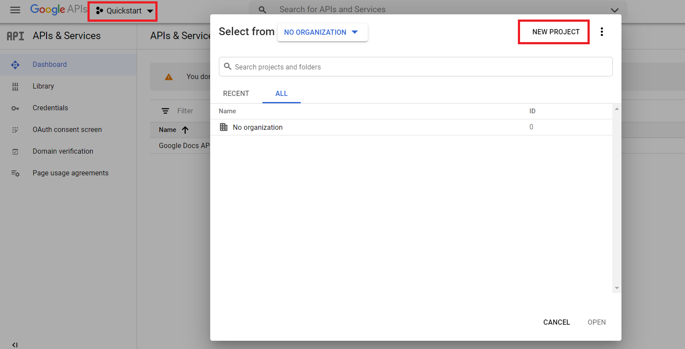


3. Enable the G Suite Alert Center API:
    
    1. Under the main menu, select **APIs & Services** > **Library**:
        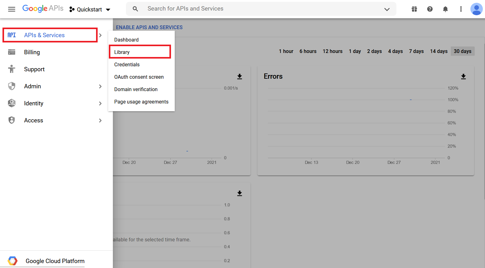

    2. Search for **Google Workspace Alert Center API** in **Search for APIs & Services**:
        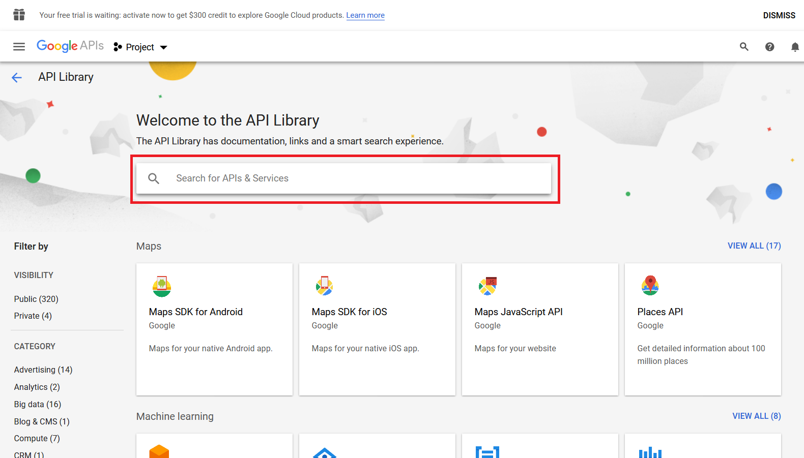
    
    3. Enable **Google Workspace Alert Center API**:
        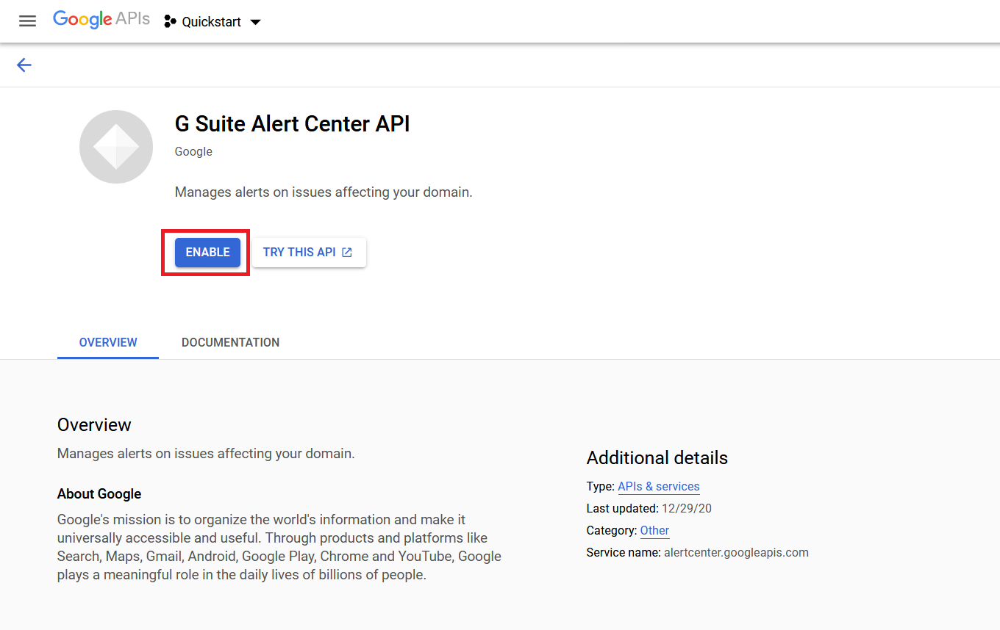
    
    4. Select the project and click **OPEN**:
            

4. Create a service account with the correct restricted permissions:

    1. Under the main menu, select **IAM & Admin** > **Service Accounts**:
        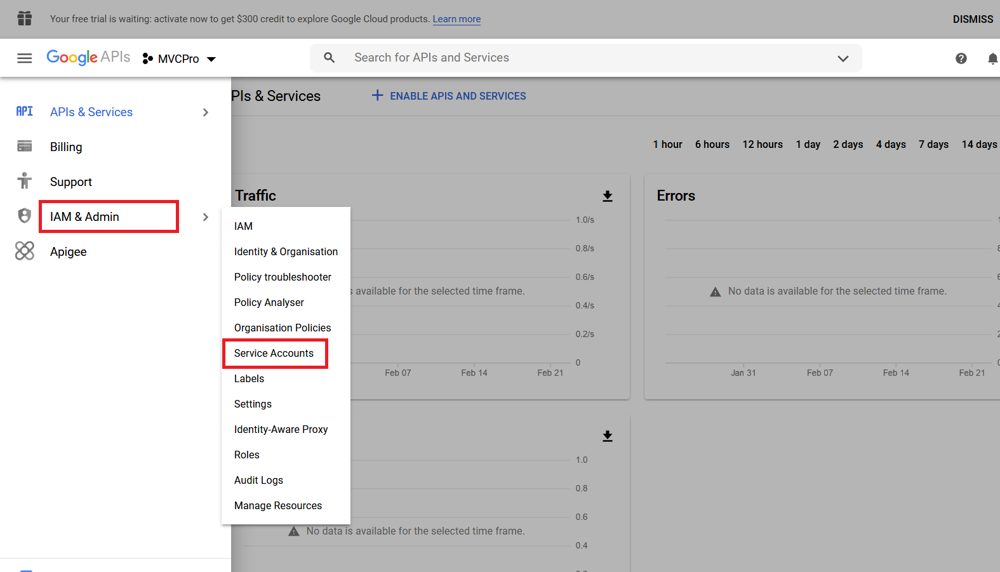
    
    2. In the top bar, select **CREATE SERVICE ACCOUNT**:
        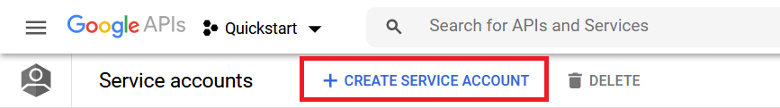
    
    3. Under the main menu, select **IAM & Admin** > **Service Accounts** and open the account you just created.
    
    4. Generate new credentials:
    
        1. On the Service account details page, under Keys, click **ADD KEY** and select **Create new key**:
            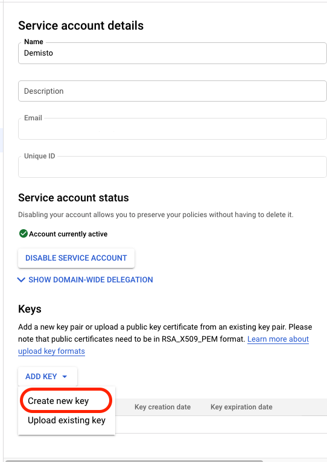
            
        2. Under Key type, select **JSON**, and click **CREATE**. 
           Save the credentials in a secure location. You will need the generated *credentials.json* file when you configure the instance in Cortex XSOAR: 
            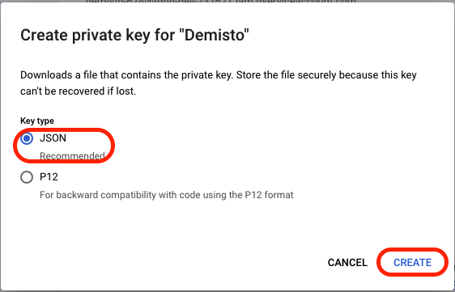   
            
        3. The service account JSON will be automatically downloaded.

## Add Scopes in G Suite Security Alert Center

1. Go to [https://admin.google.com](https://admin.google.com)

2. Click Menu and select **Security** > **API Controls**:
    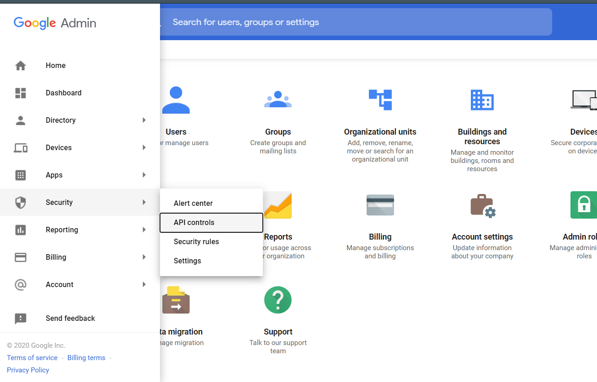

3. Under the Domain wide delegation tab, Click **MANAGE DOMAIN WIDE DELEGATION**:
    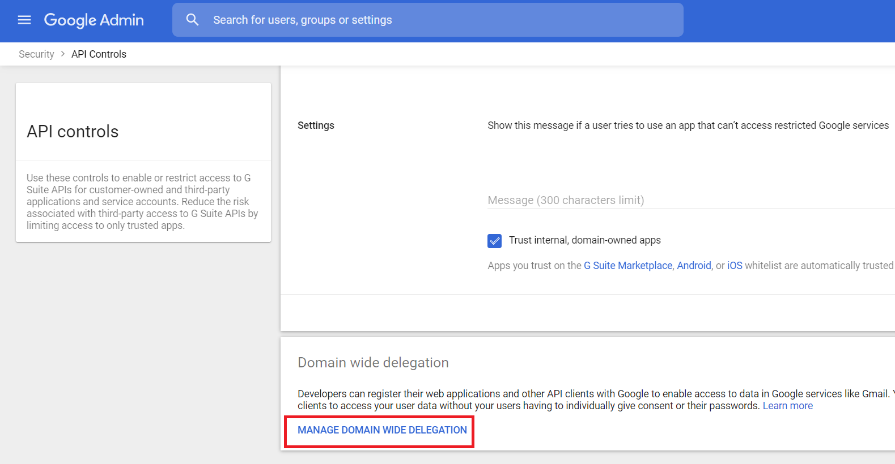

4. Click **Add new**. Enter the Client ID from your *credentials.json* file and the required scopes from the integration tips.
    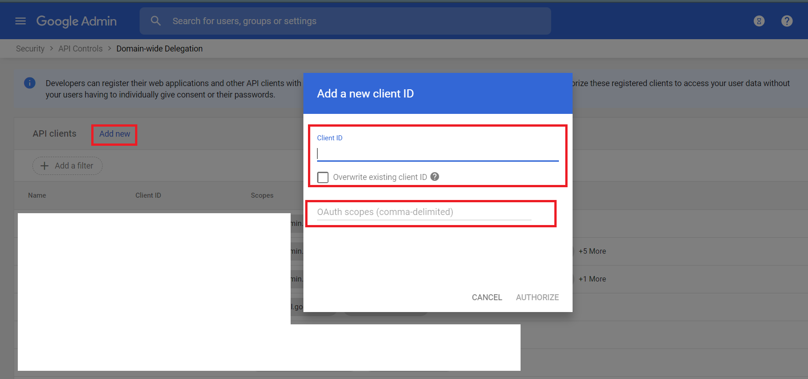           

5. Click **AUTHORIZE**.

   
## Configure G Suite Security Alert Center on Cortex XSOAR

1. Navigate to **Settings** > **Integrations** > **Servers & Services**.
2. Search for G Suite Security Alert Center.
3. Click **Add instance** to create and configure a new integration instance.

    | **Parameter** | **Description** | **Required** |
    | --- | --- | --- |
    | Fetch incidents |  | False |
    | Incident type |  | False |
    | Service Account JSON | User's Service Account JSON key. | True |
    | Admin Email | G Suite domain administrator's email ID that acts on behalf of the end-user | True |
    | Maximum number of incidents per fetch | The maximum allowed value is 1000. | True |
    | First fetch time interval | The time range to consider for the initial data fetch. Formats accepted: YYYY-MM-dd, YYYY-MM-ddTHH:mm:ss, 2 minutes, 2 hours, 2 days, 2 weeks, 2 months, 2 years. Accepted timezone: UTC. | False |
    | Alert Type | Add a new type or choose existing multiple alert types. Fetches all types of alerts if left empty.
    Note: If type is present in the Filter parameter this value will be overwritten. | False |
    | Filter | An advanced filter to fetch the list of alerts. For example: source:"Google" AND type="Suspicious login". Note: This value takes precedence over any filter arguments. To fetch alerts using createTime, use the first fetch time interval parameter.  | False |
    | Fetch feedback | Fetches the latest type of feedback for each alert. | False |
    | Trust any certificate (not secure) |  | False |
    | Use system proxy settings |  | False |

4. Click **Test** to validate the URLs, token, and connection.

## Supported query filters
- To see supported query filters, refer to the link mentioned [here](https://developers.google.com/admin-sdk/alertcenter/reference/filter-fields#alerts.list).
- To see the syntax of the filters, refer to the link mentioned [here](https://developers.google.com/admin-sdk/alertcenter/guides/query-filters).

## Commands
You can execute these commands from the Cortex XSOAR CLI, as part of an automation, or in a playbook.
After you successfully execute a command, a DBot message appears in the War Room with the command details.
### gsac-alert-list
***
Lists the alerts. Use the filter to filter the list by various alert types.
Note: The alerts that have been marked for deletion in the past 30 days will still be visible.


#### Base Command

`gsac-alert-list`
#### Input

| **Argument Name** | **Description** | **Required** |
| --- | --- | --- |
| page_size | The requested page size. | Optional | 
| page_token | A token identifying a page of results the server should return. | Optional | 
| filter | A query string for filtering alert results. For example: createTime >= "2020-10-28T20:43:34.381Z" AND type="Suspicious login". | Optional | 
| order_by | The sort order of the list results. Possible values are: createTime asc, createTime desc, updateTime asc, updateTime desc. | Optional | 


#### Context Output

| **Path** | **Type** | **Description** |
| --- | --- | --- |
| GSuiteSecurityAlert.PageToken.Alert.nextPageToken | String | The token for the next page. | 
| GSuiteSecurityAlert.PageToken.Alert.name | String | Command name. | 
| GSuiteSecurityAlert.Alert.customerId | String | The unique identifier of the Google account of the customer. | 
| GSuiteSecurityAlert.Alert.alertId | String | The unique identifier for the alert. | 
| GSuiteSecurityAlert.Alert.createTime | Date | The time the alert was created. | 
| GSuiteSecurityAlert.Alert.startTime | Date | The time the event that caused the alert was started or detected. | 
| GSuiteSecurityAlert.Alert.endTime | Date | The time the event that caused the alert ceased being active. | 
| GSuiteSecurityAlert.Alert.type | String | The type of the alert. | 
| GSuiteSecurityAlert.Alert.source | String | A unique identifier for the system that reported the alert. | 
| GSuiteSecurityAlert.Alert.deleted | Boolean | True if the alert is marked for deletion. | 
| GSuiteSecurityAlert.Alert.securityInvestigationToolLink | String | An optional Security Investigation Tool query for the alert. | 
| GSuiteSecurityAlert.Alert.updateTime | Date | The time the alert was last updated. | 
| GSuiteSecurityAlert.Alert.etag | String | ETag is used for optimistic concurrency control as a way to help prevent simultaneous updates of an alert from overwriting each other. | 
| GSuiteSecurityAlert.Alert.metadata.customerId | String | The unique identifier of the Google account of the customer. | 
| GSuiteSecurityAlert.Alert.metadata.alertId | String | The unique identifier of the alert. | 
| GSuiteSecurityAlert.Alert.metadata.status | String | The current status of the alert. | 
| GSuiteSecurityAlert.Alert.metadata.assignee | String | The email address of the user assigned to the alert. | 
| GSuiteSecurityAlert.Alert.metadata.updateTime | String | The time the metadata was last updated. | 
| GSuiteSecurityAlert.Alert.metadata.severity | String | The severity value of the alert. | 
| GSuiteSecurityAlert.Alert.metadata.etag | String | ETag is used for optimistic concurrency control as a way to help prevent simultaneous updates of an alert metadata from overwriting each other. | 
| GSuiteSecurityAlert.Alert.data.@type | String | Alert data of the alert types. | 
| GSuiteSecurityAlert.Alert.data.takeoutRequestId | String | The takeout request ID. | 
| GSuiteSecurityAlert.Alert.data.email | String | The email of the associated event. Domain wide takeout initiated applies to the email of the admin who initiated the takeout. Google identity applies to the email of the user who the event belongs to. Mobile device management/State Sponsored Attack applies to the email of the user the alert was created for. | 
| GSuiteSecurityAlert.Alert.data.domainId.customerPrimaryDomain | String | The primary domain for the customer. | 
| GSuiteSecurityAlert.Alert.data.maliciousEntity.entity.emailAddress | String | Email address of the user. | 
| GSuiteSecurityAlert.Alert.data.maliciousEntity.entity.displayName | String | Display name of the user. | 
| GSuiteSecurityAlert.Alert.data.maliciousEntity.fromHeader | String | The sender email address. | 
| GSuiteSecurityAlert.Alert.data.maliciousEntity.displayName | String | The header from the display name. | 
| GSuiteSecurityAlert.Alert.data.messages.messageId | String | The message ID. | 
| GSuiteSecurityAlert.Alert.data.messages.md5HashMessageBody | String | The hash of the message body text. | 
| GSuiteSecurityAlert.Alert.data.messages.messageBodySnippet | String | The snippet of the message body text \(only available for reported emails\). | 
| GSuiteSecurityAlert.Alert.data.messages.md5HashSubject | String | The MD5 hash of the email's subject \(only available for reported emails\). | 
| GSuiteSecurityAlert.Alert.data.messages.subjectText | String | The email subject text \(only available for reported emails\). | 
| GSuiteSecurityAlert.Alert.data.messages.attachmentsSha256Hash | Unknown | The list of SHA256 hashes of the email's attachment and all MIME parts. | 
| GSuiteSecurityAlert.Alert.data.messages.recipient | String | The recipient of the email. | 
| GSuiteSecurityAlert.Alert.data.messages.date | Date | The date the malicious email was sent. | 
| GSuiteSecurityAlert.Alert.data.isInternal | Boolean | If true, the email originated from within the organization. | 
| GSuiteSecurityAlert.Alert.data.systemActionType | String | System actions on the messages. | 
| GSuiteSecurityAlert.Alert.data.sourceIp | String | The source IP address of the malicious email, for example, 127.0.0.1. | 
| GSuiteSecurityAlert.Alert.data.loginDetails.loginTime | Date | The successful login time that is associated with the warning event. This is not present for blocked login attempts. | 
| GSuiteSecurityAlert.Alert.data.loginDetails.ipAddress | String | The human-readable IP address \(for example, 11.22.33.44\) that is associated with the warning event. | 
| GSuiteSecurityAlert.Alert.data.title | String | A one-line incident description. | 
| GSuiteSecurityAlert.Alert.data.description | String | Description of the associated alert type. | 
| GSuiteSecurityAlert.Alert.data.affectedUserEmails | Unknown | The list of emails that correspond to the users directly affected by the incident. | 
| GSuiteSecurityAlert.Alert.data.attachmentData.csv.headers | Unknown | The list of headers for the data columns in a CSV file. | 
| GSuiteSecurityAlert.Alert.data.attachmentData.csv.dataRows.entries | Unknown | The data entries in a CSV file row, as a string array rather than a single comma-separated string. | 
| GSuiteSecurityAlert.Alert.data.events.deviceId | String | The device ID. | 
| GSuiteSecurityAlert.Alert.data.events.serialNumber | String | The serial number of the device. | 
| GSuiteSecurityAlert.Alert.data.events.deviceType | String | The type of the device. | 
| GSuiteSecurityAlert.Alert.data.events.deviceModel | String | The model of the device. | 
| GSuiteSecurityAlert.Alert.data.events.resourceId | String | The device resource ID. | 
| GSuiteSecurityAlert.Alert.data.events.iosVendorId | String | iOS vendor ID. Required for iOS, empty for others. | 
| GSuiteSecurityAlert.Alert.data.events.deviceCompromisedState | String | The device compromised state. Possible values are "Compromised" or "Not Compromised". | 
| GSuiteSecurityAlert.Alert.data.events.deviceProperty | String | The device property that was changed. | 
| GSuiteSecurityAlert.Alert.data.events.oldValue | String | The old value of the device property before the change. | 
| GSuiteSecurityAlert.Alert.data.events.newValue | String | The new value of the device property after the change. | 
| GSuiteSecurityAlert.Alert.data.requestInfo.appKey | String | The application that requires the SQL setup. | 
| GSuiteSecurityAlert.Alert.data.requestInfo.appDeveloperEmail | Unknown | List of app developers who triggered notifications for the application. | 
| GSuiteSecurityAlert.Alert.data.requestInfo.numberOfRequests | String | Number of requests sent for the application to set up default SQL instances. | 
| GSuiteSecurityAlert.Alert.data.ruleViolationInfo.ruleInfo.resourceName | String | Resource name that uniquely identifies the rule. | 
| GSuiteSecurityAlert.Alert.data.ruleViolationInfo.ruleInfo.displayName | String | User provided name of the rule. | 
| GSuiteSecurityAlert.Alert.data.ruleViolationInfo.dataSource | String | Source of the data. | 
| GSuiteSecurityAlert.Alert.data.ruleViolationInfo.trigger | String | Trigger of the rule. | 
| GSuiteSecurityAlert.Alert.data.ruleViolationInfo.triggeringUserEmail | String | Email of the user who caused the violation. | 
| GSuiteSecurityAlert.Alert.data.ruleViolationInfo.recipients | Unknown | Resource recipients. | 
| GSuiteSecurityAlert.Alert.data.ruleViolationInfo.resourceInfo.resourceTitle | String | Title of the resource, for example email subject, or document title. | 
| GSuiteSecurityAlert.Alert.data.ruleViolationInfo.resourceInfo.documentId | String | Drive file ID. | 
| GSuiteSecurityAlert.Alert.data.ruleViolationInfo.matchInfo.userDefinedDetector.resourceName | String | Resource name that uniquely identifies the detector. | 
| GSuiteSecurityAlert.Alert.data.ruleViolationInfo.matchInfo.userDefinedDetector.displayName | String | Display name of the detector. | 
| GSuiteSecurityAlert.Alert.data.ruleViolationInfo.matchInfo.predefinedDetector.detectorName | String | Name that uniquely identifies the detector. | 
| GSuiteSecurityAlert.Alert.data.ruleViolationInfo.triggeredActionTypes | Unknown | Actions applied as a consequence of the rule being triggered. | 
| GSuiteSecurityAlert.Alert.data.ruleViolationInfo.suppressedActionTypes | Unknown | Actions suppressed due to other actions with higher priority. | 
| GSuiteSecurityAlert.Alert.data.name | String | Rule name. | 
| GSuiteSecurityAlert.Alert.data.displayName | String | Alert display name. | 
| GSuiteSecurityAlert.Alert.data.windowSize | String | Rule window size. Possible values are 1 hour or 24 hours. | 
| GSuiteSecurityAlert.Alert.data.threshold | String | Alert threshold, for example "COUNT > 5". | 
| GSuiteSecurityAlert.Alert.data.createTime | Date | The timestamp indicating when the rule was created. | 
| GSuiteSecurityAlert.Alert.data.updateTime | Date | The timestamp indicating when the rule was last updated. | 
| GSuiteSecurityAlert.Alert.data.triggerSource | String | The trigger sources for the rule. | 
| GSuiteSecurityAlert.Alert.data.supersededAlerts | Unknown | List of alert IDs superseded by the alert. | 
| GSuiteSecurityAlert.Alert.data.supersedingAlerts | String | Alert ID superseding the alert. | 
| GSuiteSecurityAlert.Alert.data.actionNames | Unknown | List of action names associated with the rule threshold. | 
| GSuiteSecurityAlert.Alert.data.query | String | Query that is used to get the data from the associated source. | 


#### Command Example
```!gsac-alert-list page_size=2```

#### Context Example
```json
{
    "GSuiteSecurityAlert": {
        "Alert": [
            {
                "alertId": "dummy_alert_id1",
                "createTime": "2021-01-21T13:49:06.315483Z",
                "customerId": "dummy_customer_id",
                "data": {
                    "@type": "type.googleapis.com/google.apps.alertcenter.type.MailPhishing",
                    "domainId": {
                        "customerPrimaryDomain": "abc.io"
                    },
                    "maliciousEntity": {
                        "fromHeader": "dummyemail@xyz.com"
                    },
                    "messages": [
                        {
                            "attachmentsSha256Hash": [
                                "74bb828bcab5aedba8264369f791613cf01f5d42eb76d1bfe620fa4ca1d371c1",
                                "7eb70257593da06f682a3ddda54a9d260d4fc514f645237f5ca74b08f8da61a6",
                                "fcad4ae0f38b600395ab04055b273f14b6cdc504837ed0b69da962268e6fa268"
                            ],
                            "date": "2021-01-21T13:08:58.759929Z",
                            "md5HashSubject": "16258756be9e9c233f60b4dad7e4f4ae",
                            "messageId": "dummy1@mail.gmail.com",
                            "recipient": "dummy@abc.io",
                            "subjectText": "Token file"
                        },
                        {
                            "attachmentsSha256Hash": [
                                "e7df42ca778bc244404bf53c4898d970cc5e79f92d2323b03cd58623b165b73c",
                                "80e3e740713f373fcb66787e960bb47d040b1c3d20ea6dd78522988660bcee89"
                            ],
                            "date": "2021-01-21T13:11:11.615314Z",
                            "md5HashSubject": "6ac92bbad6c6204e0427a71cc5f008a8",
                            "messageBodySnippet": " 8c06b05c 91c2 45d8 8b83 a9cf6b5dad3a",
                            "messageId": "dummy2@mail.gmail.com",
                            "recipient": "dummy@abc.io",
                            "subjectText": "Phishing mail"
                        }
                    ]
                },
                "endTime": "2021-01-21T13:48:44.235359Z",
                "etag": "eVE19krfYNU=",
                "metadata": {
                    "alertId": "dummy_alert_id1",
                    "customerId": "dummy_customer_id",
                    "etag": "eVE19krfYNU=",
                    "severity": "HIGH",
                    "status": "NOT_STARTED",
                    "updateTime": "2021-01-21T13:49:06.315483Z"
                },
                "source": "Gmail phishing",
                "startTime": "2021-01-21T13:08:58.759929Z",
                "type": "User reported phishing",
                "updateTime": "2021-01-21T13:49:06.315483Z"
            },
            {
                "alertId": "dummy_alert_id2",
                "createTime": "2020-12-30T09:50:22.824822Z",
                "customerId": "dummy_customer_id",
                "data": {
                    "@type": "type.googleapis.com/google.apps.alertcenter.type.MailPhishing",
                    "domainId": {
                        "customerPrimaryDomain": "abc.io"
                    },
                    "maliciousEntity": {
                        "fromHeader": "dummyemail2@xyz.com"
                    },
                    "messages": [
                        {
                            "attachmentsSha256Hash": [
                                "32531ceff787967cc8ce01a7a0f4e4726f08d6bd1fb908ab5e3a3ce75eaddcef",
                                "3d1ee332859dae7253fbfa3030c396e8a14aaf08d418b50ee9b0dd07bc4a5f0b",
                                "552e99644f06425564b80bef0113b458d56a8ec2146e611be2333def6b176627"
                            ],
                            "date": "2020-12-30T09:12:03.571179Z",
                            "md5HashSubject": "bfa0c70e989f15ec0da8b52e5430371c",
                            "messageBodySnippet": "dummy message snippet",
                            "messageId": "dummy3@mail.gmail.com",
                            "recipient": "dummy@abc.io",
                            "subjectText": "Fwd: Script"
                        }
                    ]
                },
                "endTime": "2020-12-30T09:47:32.789447Z",
                "etag": "2Bgl3kK2ozA=",
                "metadata": {
                    "alertId": "dummy_alert_id2",
                    "customerId": "dummy_customer_id",
                    "etag": "2Bgl3kK2ozA=",
                    "severity": "HIGH",
                    "status": "NOT_STARTED",
                    "updateTime": "2020-12-30T09:50:22.824822Z"
                },
                "source": "Gmail phishing",
                "startTime": "2020-12-30T09:12:03.571179Z",
                "type": "User reported phishing",
                "updateTime": "2020-12-30T09:50:22.824822Z"
            }
        ],
        "PageToken": {
            "Alert": {
                "name": "gsac-alert-list",
                "nextPageToken": "ChAKDmIMCIKp9IAGEIjg2ABCDxNaWNJbmNpZGVudHMiADoIMDNwdWVraGQ"
            }
        }
    }
}
```

#### Human Readable Output

>### Alerts
>|Alert Id|Alert Type|Source|Severity|Status|Create Time|Update Time|
>|---|---|---|---|---|---|---|
>| dummy_alert_id1 | User reported phishing | Gmail phishing | HIGH | NOT_STARTED | 2021-01-21T13:49:06.315483Z | 2021-01-21T13:49:06.315483Z |
>| dummy_alert_id2 | User reported phishing | Gmail phishing | HIGH | NOT_STARTED | 2020-12-30T09:50:22.824822Z | 2020-12-30T09:50:22.824822Z |
>### Next Page Token:
>ChAKDmIMCIKp9IAGEIjg2ABCDxNaWNJbmNpZGVudHMiADoIMDNwdWVraGQ

### gsac-alert-get
***
Gets the specified alert. 
Note: To get the alert_id, execute the gsac-alert-list command.


#### Base Command

`gsac-alert-get`
#### Input

| **Argument Name** | **Description** | **Required** |
| --- | --- | --- |
| alert_id | The identifier of the alert to retrieve. | Required | 


#### Context Output

| **Path** | **Type** | **Description** |
| --- | --- | --- |
| GSuiteSecurityAlert.Alert.customerId | String | The unique identifier of the Google account of the customer. | 
| GSuiteSecurityAlert.Alert.alertId | String | The unique identifier for the alert. | 
| GSuiteSecurityAlert.Alert.createTime | Date | The time the alert was created. | 
| GSuiteSecurityAlert.Alert.startTime | Date | The time the event that caused the alert was started or detected. | 
| GSuiteSecurityAlert.Alert.endTime | Date | The time the event that caused the alert ceased being active. | 
| GSuiteSecurityAlert.Alert.type | String | The type of the alert. | 
| GSuiteSecurityAlert.Alert.source | String | A unique identifier for the system that reported the alert. | 
| GSuiteSecurityAlert.Alert.deleted | Boolean | True if the alert is marked for deletion. | 
| GSuiteSecurityAlert.Alert.securityInvestigationToolLink | String | An optional Security Investigation Tool query for the alert. | 
| GSuiteSecurityAlert.Alert.updateTime | Date | The time the alert was last updated. | 
| GSuiteSecurityAlert.Alert.etag | String | ETag is used for optimistic concurrency control as a way to help prevent simultaneous updates of an alert from overwriting each other. | 
| GSuiteSecurityAlert.Alert.metadata.customerId | String | The unique identifier of the Google account of the customer. | 
| GSuiteSecurityAlert.Alert.metadata.alertId | String | The unique identifier of the alert. | 
| GSuiteSecurityAlert.Alert.metadata.status | String | The current status of the alert. | 
| GSuiteSecurityAlert.Alert.metadata.assignee | String | The email address of the user assigned to the alert. | 
| GSuiteSecurityAlert.Alert.metadata.updateTime | String | The time the metadata was last updated. | 
| GSuiteSecurityAlert.Alert.metadata.severity | String | The severity value of the alert. | 
| GSuiteSecurityAlert.Alert.metadata.etag | String | ETag is used for optimistic concurrency control as a way to help prevent simultaneous updates of an alert metadata from overwriting each other. | 
| GSuiteSecurityAlert.Alert.data.@type | String | Alert data of the alert types. | 
| GSuiteSecurityAlert.Alert.data.takeoutRequestId | String | The takeout request ID. | 
| GSuiteSecurityAlert.Alert.data.email | String | The email of the associated event. Domain wide takeout initiated applies to the email of the admin who initiated the takeout. Google identity applies to the email of the user who the event belongs to. Mobile device management/State Sponsored Attack applies to the email of the user the alert was created for. | 
| GSuiteSecurityAlert.Alert.data.domainId.customerPrimaryDomain | String | The primary domain for the customer. | 
| GSuiteSecurityAlert.Alert.data.maliciousEntity.entity.emailAddress | String | Email address of the user. | 
| GSuiteSecurityAlert.Alert.data.maliciousEntity.entity.displayName | String | Display name of the user. | 
| GSuiteSecurityAlert.Alert.data.maliciousEntity.fromHeader | String | The sender email address. | 
| GSuiteSecurityAlert.Alert.data.maliciousEntity.displayName | String | The header from the display name. | 
| GSuiteSecurityAlert.Alert.data.messages.messageId | String | The message ID. | 
| GSuiteSecurityAlert.Alert.data.messages.md5HashMessageBody | String | The hash of the message body text. | 
| GSuiteSecurityAlert.Alert.data.messages.messageBodySnippet | String | The snippet of the message body text \(only available for reported emails\). | 
| GSuiteSecurityAlert.Alert.data.messages.md5HashSubject | String | The MD5 hash of the email's subject \(only available for reported emails\). | 
| GSuiteSecurityAlert.Alert.data.messages.subjectText | String | The email subject text \(only available for reported emails\). | 
| GSuiteSecurityAlert.Alert.data.messages.attachmentsSha256Hash | Unknown | The list of SHA256 hashes of the email's attachment and all MIME parts. | 
| GSuiteSecurityAlert.Alert.data.messages.recipient | String | The recipient of the email. | 
| GSuiteSecurityAlert.Alert.data.messages.date | Date | The date the malicious email was sent. | 
| GSuiteSecurityAlert.Alert.data.isInternal | Boolean | If true, the email originated from within the organization. | 
| GSuiteSecurityAlert.Alert.data.systemActionType | String | System actions on the messages. | 
| GSuiteSecurityAlert.Alert.data.sourceIp | String | The source IP address of the malicious email, for example, 127.0.0.1. | 
| GSuiteSecurityAlert.Alert.data.loginDetails.loginTime | Date | The successful login time that is associated with the warning event. This is not present for blocked login attempts. | 
| GSuiteSecurityAlert.Alert.data.loginDetails.ipAddress | String | The human-readable IP address \(for example, 11.22.33.44\) that is associated with the warning event. | 
| GSuiteSecurityAlert.Alert.data.title | String | A one-line incident description. | 
| GSuiteSecurityAlert.Alert.data.description | String | Description of the associated alert type. | 
| GSuiteSecurityAlert.Alert.data.affectedUserEmails | Unknown | The list of emails that correspond to the users directly affected by the incident. | 
| GSuiteSecurityAlert.Alert.data.attachmentData.csv.headers | Unknown | The list of headers for the data columns in a CSV file. | 
| GSuiteSecurityAlert.Alert.data.attachmentData.csv.dataRows.entries | Unknown | The data entries in a CSV file row, as a string array rather than a single comma-separated string. | 
| GSuiteSecurityAlert.Alert.data.events.deviceId | String | The device ID. | 
| GSuiteSecurityAlert.Alert.data.events.serialNumber | String | The serial number of the device. | 
| GSuiteSecurityAlert.Alert.data.events.deviceType | String | The type of the device. | 
| GSuiteSecurityAlert.Alert.data.events.deviceModel | String | The model of the device. | 
| GSuiteSecurityAlert.Alert.data.events.resourceId | String | The device resource ID. | 
| GSuiteSecurityAlert.Alert.data.events.iosVendorId | String | iOS vendor ID. Required for iOS, empty for others. | 
| GSuiteSecurityAlert.Alert.data.events.deviceCompromisedState | String | The device compromised state. Possible values are "Compromised" or "Not Compromised". | 
| GSuiteSecurityAlert.Alert.data.events.deviceProperty | String | The device property that was changed. | 
| GSuiteSecurityAlert.Alert.data.events.oldValue | String | The old value of the device property before the change. | 
| GSuiteSecurityAlert.Alert.data.events.newValue | String | The new value of the device property after the change. | 
| GSuiteSecurityAlert.Alert.data.requestInfo.appKey | String | The application that requires the SQL setup. | 
| GSuiteSecurityAlert.Alert.data.requestInfo.appDeveloperEmail | Unknown | List of app developers who triggered notifications for the application. | 
| GSuiteSecurityAlert.Alert.data.requestInfo.numberOfRequests | String | Number of requests sent for the application to set up default SQL instances. | 
| GSuiteSecurityAlert.Alert.data.ruleViolationInfo.ruleInfo.resourceName | String | Resource name that uniquely identifies the rule. | 
| GSuiteSecurityAlert.Alert.data.ruleViolationInfo.ruleInfo.displayName | String | User provided name of the rule. | 
| GSuiteSecurityAlert.Alert.data.ruleViolationInfo.dataSource | String | Source of the data. | 
| GSuiteSecurityAlert.Alert.data.ruleViolationInfo.trigger | String | Trigger of the rule. | 
| GSuiteSecurityAlert.Alert.data.ruleViolationInfo.triggeringUserEmail | String | Email of the user who caused the violation. | 
| GSuiteSecurityAlert.Alert.data.ruleViolationInfo.recipients | Unknown | Resource recipients. | 
| GSuiteSecurityAlert.Alert.data.ruleViolationInfo.resourceInfo.resourceTitle | String | Title of the resource, for example email subject, or document title. | 
| GSuiteSecurityAlert.Alert.data.ruleViolationInfo.resourceInfo.documentId | String | Drive file ID. | 
| GSuiteSecurityAlert.Alert.data.ruleViolationInfo.matchInfo.userDefinedDetector.resourceName | String | Resource name that uniquely identifies the detector. | 
| GSuiteSecurityAlert.Alert.data.ruleViolationInfo.matchInfo.userDefinedDetector.displayName | String | Display name of the detector. | 
| GSuiteSecurityAlert.Alert.data.ruleViolationInfo.matchInfo.predefinedDetector.detectorName | String | Name that uniquely identifies the detector. | 
| GSuiteSecurityAlert.Alert.data.ruleViolationInfo.triggeredActionTypes | Unknown | Actions applied as a consequence of the rule being triggered. | 
| GSuiteSecurityAlert.Alert.data.ruleViolationInfo.suppressedActionTypes | Unknown | Actions suppressed due to other actions with higher priority. | 
| GSuiteSecurityAlert.Alert.data.name | String | Rule name. | 
| GSuiteSecurityAlert.Alert.data.displayName | String | Alert display name. | 
| GSuiteSecurityAlert.Alert.data.windowSize | String | Rule window size. Possible values are 1 hour or 24 hours. | 
| GSuiteSecurityAlert.Alert.data.threshold | String | Alert threshold, for example "COUNT > 5". | 
| GSuiteSecurityAlert.Alert.data.createTime | Date | The timestamp indicating when the rule was created. | 
| GSuiteSecurityAlert.Alert.data.updateTime | Date | The timestamp indicating when the rule was last updated. | 
| GSuiteSecurityAlert.Alert.data.triggerSource | String | The trigger sources for the rule. | 
| GSuiteSecurityAlert.Alert.data.supersededAlerts | Unknown | List of alert IDs superseded by the alert. | 
| GSuiteSecurityAlert.Alert.data.supersedingAlerts | String | Alert ID superseding the alert. | 
| GSuiteSecurityAlert.Alert.data.actionNames | Unknown | List of action names associated with the rule threshold. | 
| GSuiteSecurityAlert.Alert.data.query | String | Query that is used to get the data from the associated source. | 


#### Command Example
```!gsac-alert-get alert_id=dummy_alert_id4```

#### Context Example
```json
{
    "GSuiteSecurityAlert": {
        "Alert": {
            "alertId": "dummy_alert_id4",
            "createTime": "2020-10-28T20:43:34.381Z",
            "customerId": "dummy_customer_id",
            "data": {
                "@type": "type.googleapis.com/google.apps.alertcenter.type.AccountWarning",
                "email": "dummy@abc.io",
                "loginDetails": {
                    "ipAddress": "2570:ab56:c548:85a0:2567:7025:3963:183"
                }
            },
            "endTime": "2020-10-28T20:13:33Z",
            "etag": "dummyetag=",
            "metadata": {
                "alertId": "dummy_alert_id4",
                "customerId": "dummy_customer_id",
                "etag": "dummyetag=",
                "severity": "LOW",
                "status": "NOT_STARTED",
                "updateTime": "2020-10-28T20:43:34.381Z"
            },
            "source": "Google identity",
            "startTime": "2020-10-28T20:13:33Z",
            "type": "Suspicious login",
            "updateTime": "2020-10-28T20:43:34.381Z"
        }
    }
}
```

#### Human Readable Output

>### Alert
>|Alert Id|Alert Type|Source|Severity|Status|Create Time|Update Time|
>|---|---|---|---|---|---|---|
>| dummy_alert_id4 | Suspicious login | Google identity | LOW | NOT_STARTED | 2020-10-28T20:43:34.381Z | 2020-10-28T20:43:34.381Z |


### gsac-alert-feedback-create
***
Creates new feedback for an alert.


#### Base Command

`gsac-alert-feedback-create`
#### Input

| **Argument Name** | **Description** | **Required** |
| --- | --- | --- |
| alert_id | The identifier of the alert the feedback belongs to. | Required | 
| feedback_type | The type of alert feedback. Possible values are: ALERT_FEEDBACK_TYPE_UNSPECIFIED, NOT_USEFUL, SOMEWHAT_USEFUL, VERY_USEFUL. | Required | 


#### Context Output

| **Path** | **Type** | **Description** |
| --- | --- | --- |
| GSuiteSecurityAlert.Feedback.customerId | String | The unique identifier of the Google account of the customer. | 
| GSuiteSecurityAlert.Feedback.alertId | String | The alert identifier. | 
| GSuiteSecurityAlert.Feedback.feedbackId | String | The unique identifier for the feedback. | 
| GSuiteSecurityAlert.Feedback.createTime | String | The time the feedback was created. | 
| GSuiteSecurityAlert.Feedback.type | String | The type of the feedback. | 
| GSuiteSecurityAlert.Feedback.email | String | The email of the user who provided the feedback. | 


#### Command Example
```!gsac-alert-feedback-create alert_id=dummy_alert_id4 feedback_type=VERY_USEFUL```

#### Context Example
```json
{
    "GSuiteSecurityAlert": {
        "Feedback": {
            "alertId": "dummy_alert_id4",
            "createTime": "2021-02-01T11:56:27.455114Z",
            "customerId": "dummy_customer_id",
            "email": "dummy@abc.io",
            "feedbackId": "dummy_feedback_id",
            "type": "VERY_USEFUL"
        }
    }
}
```

#### Human Readable Output

>### Feedback details
>|Feedback ID|Alert ID|Create Time|Feedback Type|Email|
>|---|---|---|---|---|
>| dummy_feedback_id | dummy_alert_id4 | 2021-02-01T11:56:27.455114Z | VERY_USEFUL | dummy@abc.io |


### gsac-alert-feedback-list
***
Lists all the feedback for an alert.


#### Base Command

`gsac-alert-feedback-list`
#### Input

| **Argument Name** | **Description** | **Required** |
| --- | --- | --- |
| alert_id | The identifier of the alert the feedbacks belong to. The "-" wildcard can be used to represent all alerts. | Required | 
| filter | A query string for filtering alert results. For example: alert_id = alertId01 AND feedback_id = feedbackId01. | Optional | 
| page_size | The requested page size. Default is 50. | Optional |


#### Context Output

| **Path** | **Type** | **Description** |
| --- | --- | --- |
| GSuiteSecurityAlert.Feedback.customerId | String | The unique identifier of the Google account of the customer. | 
| GSuiteSecurityAlert.Feedback.alertId | String | The alert identifier. | 
| GSuiteSecurityAlert.Feedback.feedbackId | String | The unique identifier for the feedback. | 
| GSuiteSecurityAlert.Feedback.createTime | String | The time the feedback was created. | 
| GSuiteSecurityAlert.Feedback.type | String | The type of the feedback. | 
| GSuiteSecurityAlert.Feedback.email | String | The email of the user who provided the feedback. | 


#### Command Example
```!gsac-alert-feedback-list alert_id=dummy_alert_id5```

#### Context Example
```json
{
    "GSuiteSecurityAlert": {
        "Feedback": [
            {
                "alertId": "dummy_alert_id5",
                "createTime": "2021-01-21T12:06:22.350408Z",
                "customerId": "dummy_customer_id",
                "email": "dummy@abc.io",
                "feedbackId": "dummy_feedback_id1",
                "type": "NOT_USEFUL"
            },
            {
                "alertId": "dummy_alert_id5",
                "createTime": "2021-01-21T11:56:53.489471Z",
                "customerId": "dummy_customer_id",
                "email": "dummy@abc.io",
                "feedbackId": "dummy_feedback_id2",
                "type": "NOT_USEFUL"
            },
            {
                "alertId": "dummy_alert_id5",
                "createTime": "2021-01-20T20:11:20.343391Z",
                "customerId": "dummy_customer_id",
                "email": "dummy@abc.io",
                "feedbackId": "dummy_feedback_id3",
                "type": "VERY_USEFUL"
            }
        ]
    }
}
```

#### Human Readable Output

>### Feedback details
>|Feedback ID|Alert ID|Create Time|Feedback Type|Email|
>|---|---|---|---|---|
>| dummy_feedback_id1 | dummy_alert_id5 | 2021-01-21T12:06:22.350408Z | NOT_USEFUL | dummy@abc.io |
>| dummy_feedback_id2 | dummy_alert_id5 | 2021-01-21T11:56:53.489471Z | NOT_USEFUL | dummy@abc.io |
>| dummy_feedback_id3 | dummy_alert_id5 | 2021-01-20T20:11:20.343391Z | VERY_USEFUL | dummy@abc.io |


### gsac-alert-delete
***
Performs delete operation on alerts.
Note: The alerts that are marked for deletion will be removed from the Alert Center after 30 days.


#### Base Command

`gsac-alert-delete`
#### Input

| **Argument Name** | **Description** | **Required** |
| --- | --- | --- |
| alert_id | Comma-separated list of alert IDs to be marked for deletion. | Required | 


#### Context Output

| **Path** | **Type** | **Description** |
| --- | --- | --- |
| GSuiteSecurityAlert.Delete.successAlerts.id | Unknown | The list of alert IDs successfully marked for deletion. | 
| GSuiteSecurityAlert.Delete.failedAlerts.id | Unknown | The list of alert IDs failed to be marked for deletion. | 
| GSuiteSecurityAlert.Delete.failedAlerts.code | Number | The status code of the failed alerts. | 
| GSuiteSecurityAlert.Delete.failedAlerts.message | String | A developer-facing error message. | 
| GSuiteSecurityAlert.Delete.failedAlerts.status | String | Status of the failed alert deletion. | 
| GSuiteSecurityAlert.Delete.successAlerts.status | String | Status of the successful alert deletion. | 

Note: The gsac-alert-delete command returns a custom context that contains the status key that shows the status of the alert ID marked for deletion.

#### Command Example
```!gsac-alert-delete alert_id="dummy_alert_id1,dummy_alert_id2"```

#### Context Example
```json
{
    "GSuiteSecurityAlert": {
        "Delete": {
            "failedAlerts": {
                "code": 5,
                "id": "dummy_alert_id2",
                "message": "NOT_FOUND",
                "status": "Fail"
            },
            "successAlerts": {
                "id": "dummy_alert_id1",
                "status": "Success"
            }
        }
    }
}
```

#### Human Readable Output

>### Delete Alerts
>|Alert ID|Status|
>|---|---|
>| dummy_alert_id1 | Success |
>| dummy_alert_id2 | Fail (NOT_FOUND) |


### gsac-alert-recover
***
Performs a recover operation on alerts.
Note: Recovers the alerts that were marked for deletion within the past 30 days.


#### Base Command

`gsac-alert-recover`
#### Input

| **Argument Name** | **Description** | **Required** |
| --- | --- | --- |
| alert_id | Comma-separated list of alert IDs to be recovered. | Required | 


#### Context Output

| **Path** | **Type** | **Description** |
| --- | --- | --- |
| GSuiteSecurityAlert.Recover.successAlerts.id | Unknown | The list of alert IDs successfully marked for recovery. | 
| GSuiteSecurityAlert.Recover.failedAlerts.id | Unknown | The list of alert IDs failed to be marked for recovery. | 
| GSuiteSecurityAlert.Recover.failedAlerts.code | Number | The status code of the failed alerts to be recovered. | 
| GSuiteSecurityAlert.Recover.failedAlerts.message | String | A developer-facing error message for the failed alerts. | 
| GSuiteSecurityAlert.Recover.successAlerts.status | String | Status of the successful alert recovery. | 
| GSuiteSecurityAlert.Recover.failedAlerts.status | String | Status of the failed alert recovery. | 

Note: The gsac-alert-recover command returns a custom context that contains the status key that shows the status of the alert ID marked for recovery.

#### Command Example
```!gsac-alert-recover alert_id="dummy_alert_id1,dummy_alert_id2"```


#### Context Example
```json
{
    "GSuiteSecurityAlert": {
        "Recover": {
            "failedAlerts": {
                "code": 5,
                "id": "dummy_alert_id2",
                "message": "NOT_FOUND",
                "status": "Fail"
            },
            "successAlerts": {
                "id": "dummy_alert_id1",
                "status": "Success"
            }
        }
    }
}
```

#### Human Readable Output

>### Recover Alerts
>|Alert ID|Status|
>|---|---|
>| dummy_alert_id1 | Success |
>| dummy_alert_id2 | Fail (NOT_FOUND) |

