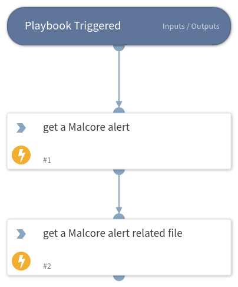

This playbook fetch a malcore alert from a GCenter and retrieves the associated suspicious file.

## Dependencies

This playbook uses the following sub-playbooks, integrations, and scripts.

### Sub-playbooks

This playbook does not use any sub-playbooks.

### Integrations

* GCenter 103

### Scripts

This playbook does not use any scripts.

### Commands

* gcenter103-alerts-list
* gcenter103-raw-alerts-file-get

## Playbook Inputs

---
There are no inputs for this playbook.

## Playbook Outputs

---
There are no outputs for this playbook.

## Playbook Image
---

