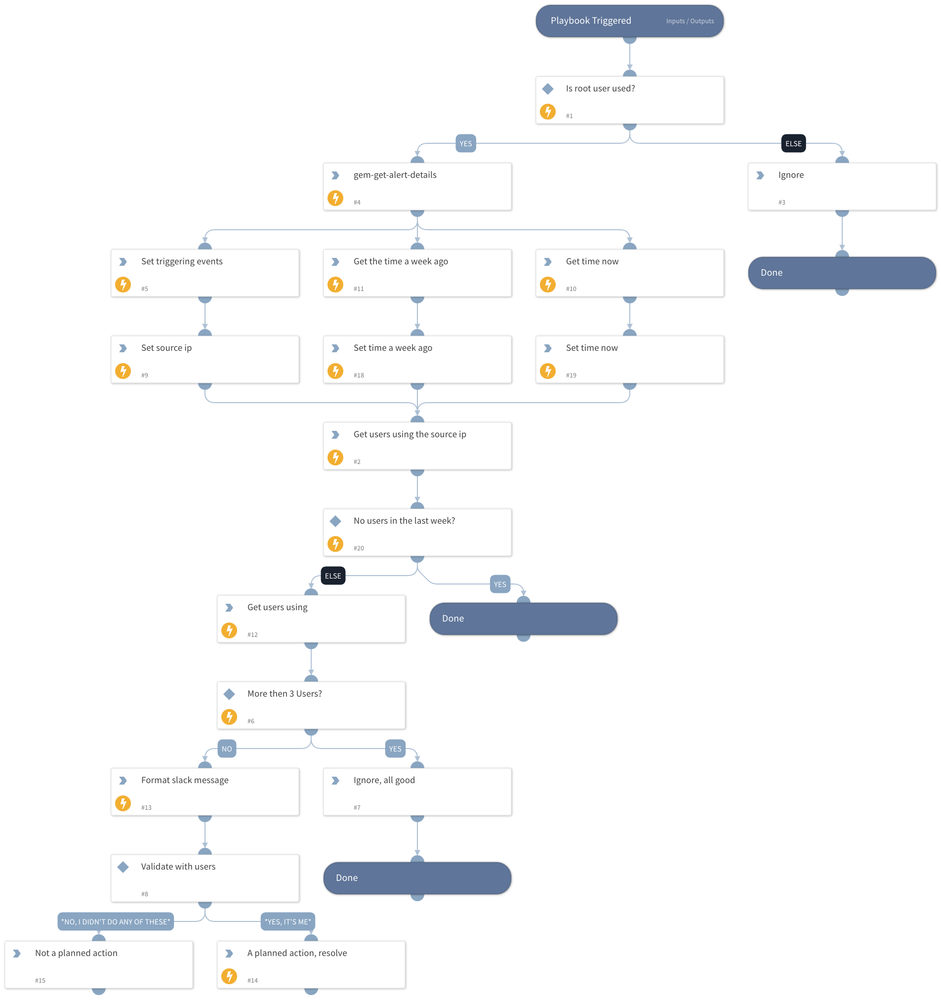

Find all the users who might’ve performed the actions using root (via the source IP), validate it with them using Slack and resolve the alert in case these actions were planned.

## Dependencies

This playbook uses the following sub-playbooks, integrations, and scripts.

### Sub-playbooks

This playbook does not use any sub-playbooks.

### Integrations

* Gem

### Scripts

* Set
* IsGreaterThan
* ZipStrings
* GetTime

### Commands

* gem-list-using-entities
* gem-get-alert-details
* gem-update-threat-status

## Playbook Inputs

---
There are no inputs for this playbook.

## Playbook Outputs

---
There are no outputs for this playbook.

## Playbook Image

---

