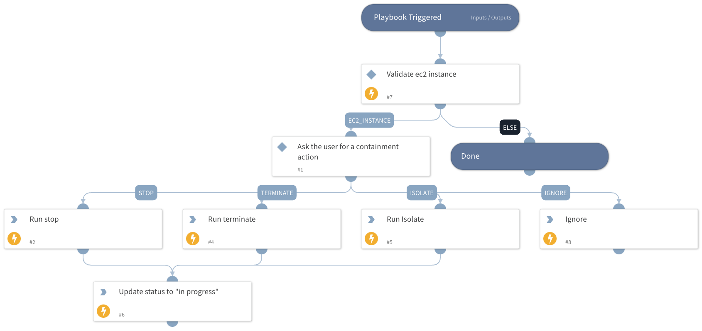

Gem playbook to handle an alert involving an ec2 instance.

## Dependencies

This playbook uses the following sub-playbooks, integrations, and scripts.

### Sub-playbooks

This playbook does not use any sub-playbooks.

### Integrations

* Gem

### Scripts

* PrettyPrint
* checkValue

### Commands

* gem-update-threat-status
* gem-run-action

## Playbook Inputs

---

| **Name** | **Description** | **Default Value** | **Required** |
| --- | --- | --- | --- |
| User | Slack user to send message for |  | Required |

## Playbook Outputs

---
There are no outputs for this playbook.

## Playbook Image

---

