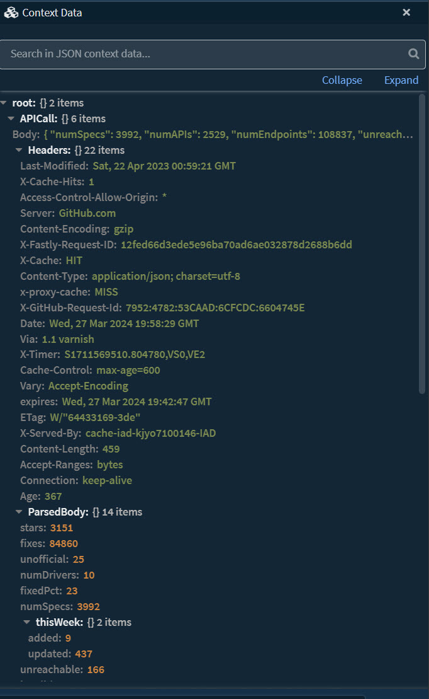
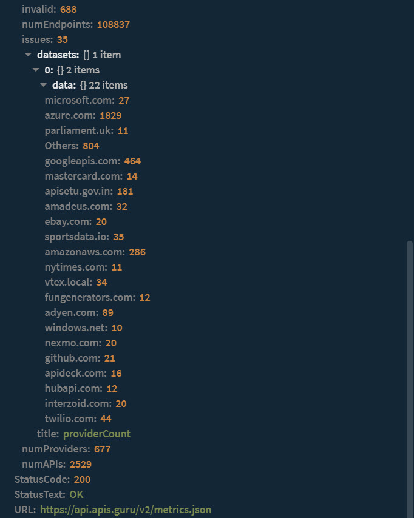
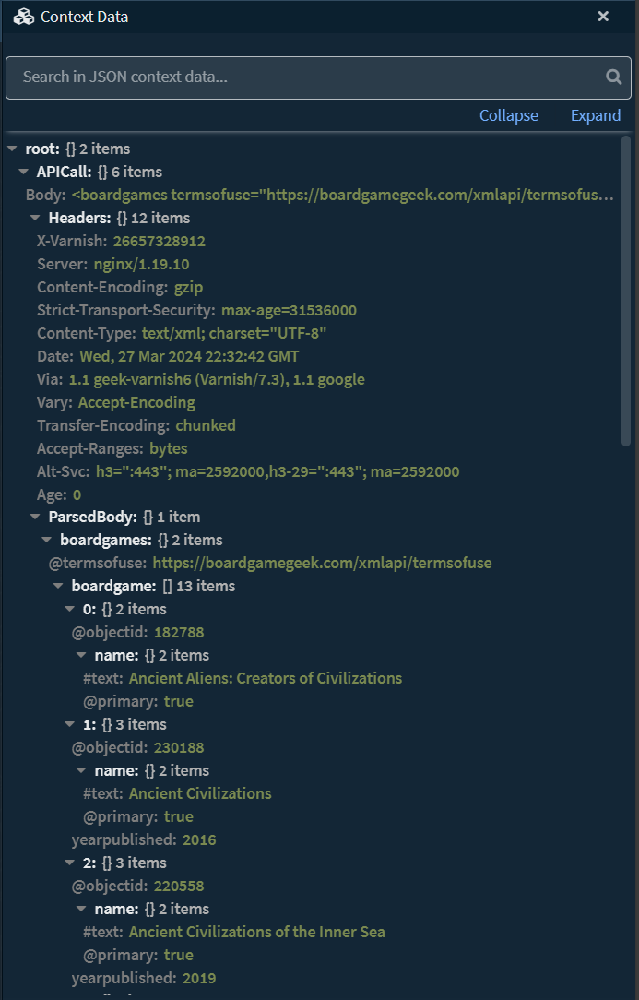
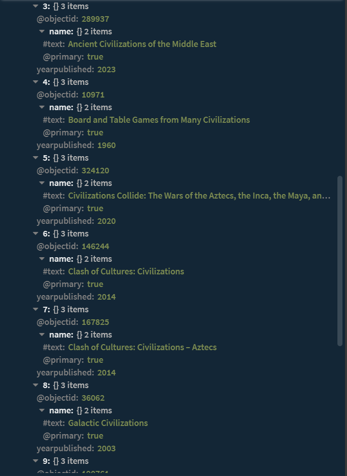
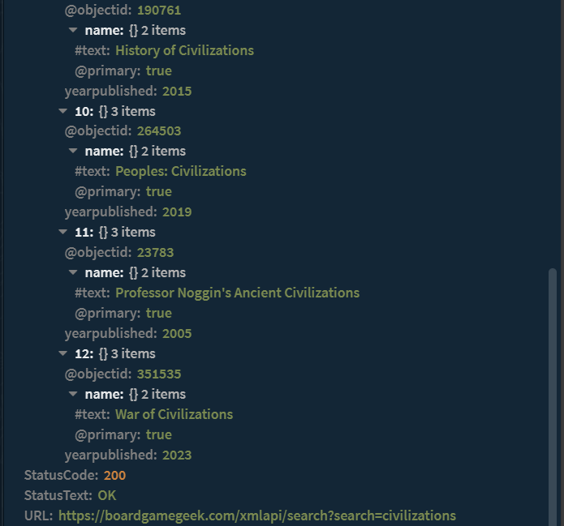
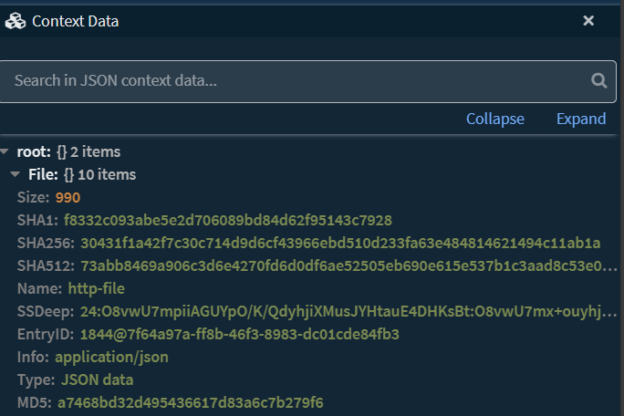
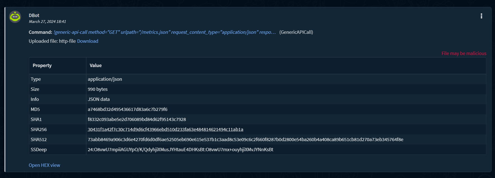
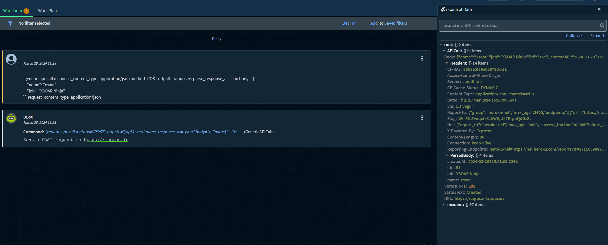
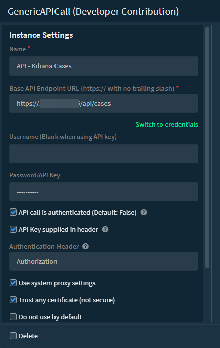
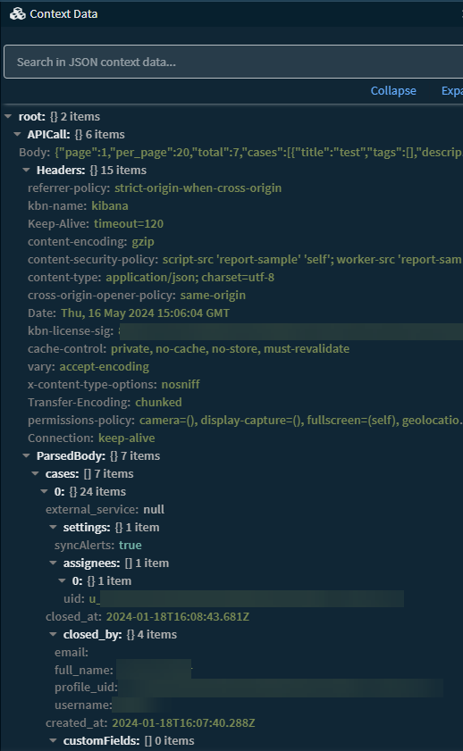

## GenericAPICall Integration

This integration provides a method for executing HTTP API calls to specific API endpoints used in one-off scenarios not covered by other XSOAR integrations. This integration supports unauthenticated and authenticated API calls over HTTPS, using API key and basic HTTP authentication methods.

## Configuration Parameters

 - ***Name*** - Integration instance name
 - ***Base Server URL*** - The base server URL for the API endpoint without the trailing slash (**/**)
 - ***Username*** - Username for HTTP basic authentication.
		 - Leave blank when using an API key
 - ***Password/API Key*** - The password (when using HTTP basic authentication) or API key to use for API calls with this integration instance
 - ***API call is authenticated*** - Check this box if API calls to this endpoint require authentication (**Default**: False)
 - ***API key supplied in header*** - Check this box if API key or authentication credentials are provided as part of the HTTP header (**Default**: False)
		 - Unchecking this box will pass the API key as a parameter in the URL (**&apiKey=KEY_HERE**)
 - ***Authentication Header*** - The value to use to identify the API key field as part of the HTTP header or API Key parameter in the URL
		 - **Header example**: { 'AUTHENICATION_HEADER_HERE': 'API_KEY_HERE' }
		 - **Parameterized example**: &AUTHENTICATION_HEADER=API_KEY_HERE
 - **Use system proxy settings** - Leverage the proxy settings configured on the XSOAR server
 - **Trust any certificate (not secure)** - Bypass SSL certificate verification for these connections

## Commands ##

1. [Execute a HTTP-based API call to the configured API endpoint](#generic-api-call)

## generic-api-call
Performs a HTTP-based API call to the server configured server and url path. 
NOTE: Because of the potentially large amount of data returned per specific API call, no content is output to the war room except a message confirming call execution.

#### Base Command ####
`!generic-api-call`

#### Input ####
------------------
| **Argument Name** | **Description**  | **Required** |
|--|--|--|
|method|The HTTP method to use for the API call. (**Default**: POST) GET, POST, PUT, PATCH, DELETE, HEAD|Required|
|urlpath|The URL path to the API endpoint to be appended to the **base_url** parameter. (**Default**: /)|Required|
|parse_response_as|Specify the type of data expected in the API response  **Defined types:** - json - raw_response - text - xml|Required|
|body|The body to be used for the API call|Optional|
|request_content_type|Specify the ***Content-Type*** header for the request.Shorthands are provided for the following common content types:json (application/json)xml (text/xml)form (application/x-www-form-urlencoded)data (multipart/form-data).  **If you choose to define a different type**, please include the full type name, e.g: ***application/pdf***  **Predefined types**: - application/json - application/pdf - application/x-www-form-urlencoded - application/xml - multipart/form-data - text/csv - text/plain - text/xml|Optional|
|response_content_type|Specify the ***Accept*** header for the request.Shorthands are provided for the following common content types:json (application/json)xml (text/xml)form (application/x-www-form-urlencoded)data (multipart/form-data).  **If you choose to define a different type**, please include the full type name, e.g: ***application/pdf***  **Predefined types**: - application/json - application/pdf - application/x-www-form-urlencoded - application/xml - multipart/form-data - text/csv - text/plain - text/xml|Optional|
|params|User-defined parameters for the API call|Optional|
|save_as_file|Save the API response as a file to context in XSOAR (**Default**: False)|Optional|
|file_name|The filename to save the returned API response as in XSOAR (**Default**: http-file)|Optional|
|timeout|Specify the timeout of the HTTP request in seconds. (**Default**: 10 seconds)|Optional|
|timeout_between_retries|Specify the timeout between each retry in seconds. (**Default**: 5 seconds)|Optional|
|retry_count|Specify the number or retries to be made in case of a call failure. (**Default**: 3 attempts)|Optional|
|retry_on_status|Specify a list of HTTP status codes that a retry should be attempted on. For example: 301-303,400,402."|Optional|
|enable_redirect|The request will be called again with the new URL (**Default**: false)|Optional|

#### Context Output

The response data

|**Path**|**Type**|**Description**|
|--|--|--|
|APICall.StatusCode|String|The HTTP status code returned from the request|
|APICall.StatusText|String|The text corresponding to the returned HTTP status code|
|APICall.URL|String|The URL of the API call|
|APICall.ParsedBody|String|The parsed response, formatted according to `parse_response_as` argument|
|APICall.Headers|String|The headers from the API call response|
|APICall.Body|String|The raw data returned from the API call|

## Command examples ##
All examples in this documentation are based off the following endpoints:

**JSON**: https[:]//api[.]apis[.]guru/v2/metrics.json
**XML**: https[:]//boardgamegeek[.]com/xmlapi/search?search=civilizations
**JSON Request Body**: https[:]//reqres[.]in/

### Command example - JSON ###
#### API call with output to context - JSON Return ####
`!generic-api-call urlpath=/metrics.json request_content_type=application/json response_content_type=application/json method=GET parse_response_as=json`
#### Context Example ####

#### Human Readable Output ####
`Sent a GET request to https://api.apis.guru/v2`

### Command example - XML ###
#### API call with output to context - XML Return ####
`!generic-api-call urlpath=/xmlapi/search?search=civilizations method=GET request_content_type=application/xml response_content_type=application/xml parse_response_as=xml`
#### Context Example ####

#### Human Readable Output ####
`Sent a GET request to https://boardgamegeek.com/xmlapi`

### Command example - Saving output to file in war room/context ###
#### Saving output to file in context/war room ####
`!generic-api-call urlpath=/metrics.json request_content_type=application/json response_content_type=application/json method=GET parse_response_as=json save_as_file=true`
#### Context Example ####

#### Human Readable Output ####

### Command example - API Call with JSON Request Body ###
#### API call with output to context - JSON specified in request body ####
``!generic-api-call response_content_type=application/json method=POST urlpath=/api/users parse_response_as=json body=`{"name": "xsoar", "job": "XSOAR Ninja"}` request_content_type=application/json``
#### Output Example ####

#### Human Readable Output ####
`Sent a POST request to https://reqres.in`

### Command example - ElasticSearch Cases API Call ###
As the current ElasticSearch integration does not support pulling case data, the Generic API Call integration can be used to perform such a data pull. In the below example, a generic API call is issued to pull back a list of cases in ElasticSearch tied to the [Elastic Cases API](https://www.elastic.co/guide/en/kibana/current/cases-api.html). Below are screenshots showing how the integration is configured to authenticate to ElasticSearch. 

Please make note of the way the API key and authorization header are specified. For the API key, [Elastic uses](https://www.elastic.co/guide/en/cloud/current/ec-api-authentication.html) the "Authorization" header with an API key formatted as "ApiKey ENCODED_KEY_HERE". The "ApiKey ENCODED_KEY_HERE" text goes in the **password field** for the integration, while "Authorization" is specified in the "**Authentication Header**" integration instance configuration field. The **USERNAME** field is left blank in the integration configuration for a call to the ElasticSearch API endpoint. 

#### API call with output to context - ElasticSearch Cases API ####
``!generic-api-call method=GET parse_response_as=json enable_redirect=true urlpath=/_find"``
#### Context Example ####

#### Human Readable Output ####
`Sent a GET request to https://X.X.X.X/api/cases`