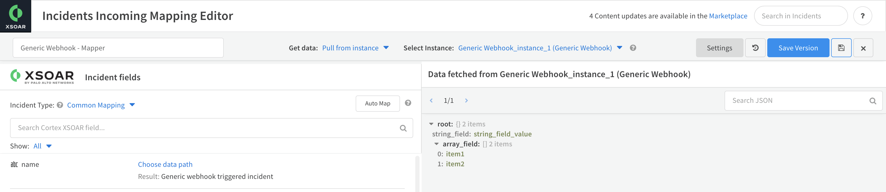

The Generic Webhook integration is used to create incidents on event triggers. The trigger can be any query posted to the integration. 

The Generic Webhook integration is a long-running integration. For more information about long-running integrations, see the [Cortex XSOAR 8 Cloud](https://docs-cortex.paloaltonetworks.com/r/Cortex-XSOAR/8/Cortex-XSOAR-Cloud-Documentation/Forward-Requests-to-Long-Running-Integrations), [Cortex XSOAR 8 On-prem](https://docs-cortex.paloaltonetworks.com/r/Cortex-XSOAR/8.7/Cortex-XSOAR-On-prem-Documentation/Integration-commands-in-the-CLI) or [Cortex XSIAM](https://docs-cortex.paloaltonetworks.com/r/Cortex-XSIAM/Cortex-XSIAM-Administrator-Guide/Forward-Requests-to-Long-Running-Integrations) documentation.

## Configure Generic Webhook on Cortex XSOAR

1. Navigate to **Settings** > **Integrations** > **Servers & Services**.
2. Search for Generic Webhook.
3. Click **Add instance** to create and configure a new integration instance.

| **Parameter** | **Description** | **Required** |
| --- | --- | --- |
| Listen Port | Runs the service on this port from within Cortex XSOAR. Requires a unique port for each long-running integration instance. Do not use the same port for multiple instances.  Note: If you click the test button more than once, a failure may occur mistakenly indicating that the port is already in use.                           | True |
| username | Username (see [Security](#security) for more details) |  (For Cortex XSOAR 6.x) False   (For Cortex XSOAR 8 and Cortex XSIAM)  Optional for engines, otherwise mandatory. Using the `_header:` feature without using an engine will not work.  |
| password | Password (see [Security](#security) for more details) |  (For Cortex XSOAR 6.x) False   (For Cortex XSOAR 8 and Cortex XSIAM)  Optional for engines, otherwise mandatory. Using the `_header:` feature without using an engine will not work.  |
| certificate | For use with HTTPS - the certificate that the service should use.   Supported for Cortex XSOAR On-prem (6.x or 8) or when using an engine. Cortex XSOAR 8 Cloud tenants and Cortex XSIAM tenants do not support custom certificates.  | False |
| Private Key | For use with HTTPS - the private key that the service should use.    Supported for Cortex XSOAR On-prem (6.x or 8) or when using an engine. Cortex XSOAR 8 Cloud tenants and Cortex XSIAM tenants do not support private keys.  | False |
| incidentType | Incident type | False |
| store_samples | Store sample events for mapping (Because this is a push-based integration, it cannot fetch sample events in the mapping wizard). | False |

4. Click **Done**.
5. For Cortex XSOAR 6.x:
     1. Navigate to  **Settings > About > Troubleshooting**.
     2. In the **Server Configuration** section, verify that the value for the ***instance.execute.external.\<INTEGRATION-INSTANCE-NAME\>*** key is set to *true*. If this key does not exist, click **+ Add Server Configuration** and add *instance.execute.external.\<INTEGRATION-INSTANCE-NAME\>* and set the value to *true*. See the following [reference article](https://xsoar.pan.dev/docs/reference/articles/long-running-invoke) for further information.

## Set up Authentication
The Generic Webhook integration running on a Cortex XSOAR 8 Cloud tenant or Cortex XSIAM tenant requires basic authentication. Running on an engine does not require basic authentication, but it is recommended.
For Cortex XSOAR On-prem (6.x or 8) or when running on an engine, you can set up authentication using custom certificates. For more information about setting up custom certificates for Cortex XSOAR 8 On-prem, see [HTTPS with a signed certificate](https://docs-cortex.paloaltonetworks.com/r/Cortex-XSOAR/8.7/Cortex-XSOAR-On-prem-Documentation/HTTPS-with-a-signed-certificate).  

## Trigger the Webhook URL 
**Note:**  
For Cortex XSOAR 8 On-prem, you need to add the `ext-` FQDN DNS record to map the Cortex XSOAR DNS name to the external IP address.  
For example, `ext-xsoar.mycompany.com`.

For Cortex XSOAR 8 On-prem, Cortex XSOAR Cloud, or Cortex XSIAM, trigger the webhook as follows:  
`<ext-<CORTEX-XSOAR-URL>/xsoar/instance/execute/<INTEGRATION-INSTANCE-NAME>`  
For example, `https://ext-mytenant.crtx.us.paloaltonetworks.com/xsoar/instance/execute/my_instance_01`.  
Note that the string `instance` does not refer to the name of your Cortex XSOAR instance, but rather is part of the URL.

For Cortex XSOAR 6.x, trigger the webhook as follows:  
`<CORTEX-XSOAR-URL>/instance/execute/<INTEGRATION-INSTANCE-NAME>`  
For example, `https://my.xsoar.live/instance/execute/webhook`.  
Note that the string `instance` does not refer to the name of your Cortex XSOAR instance, but rather is part of the URL.  

If you're not invoking the integration via the server HTTPS endpoint, trigger the webhook URL as follows:  
`<CORTEX-XSOAR-URL>:<LISTEN_PORT>/`  
For example, `https://my.xsoar.live:8000/`

The following examples assume you invoke the integration via the server HTTPS endpoint. If you don't, replace the URL in the examples as suggested above.

**Note**:  
The ***Listen Port*** needs to be available, which means it has to be unique for each integration instance. It cannot be used by other long-running integrations.

## Usage

The Generic Webhook integration accepts POST HTTP queries, with the following optional fields in the request body:

| **Field** | **Type** | **Description**                                                                                                                                                                   |
|-----------| --- |-----------------------------------------------------------------------------------------------------------------------------------------------------------------------------------|
| name      | string | Name of the incident to be created.                                                                                                                                               |
| type      | string | Type of the incident to be created. If not provided, the value of the integration parameter ***Incident type*** will be used.                                                     |
| occurred  | string | Date the incident occurred in ISO-8601 format. If not provided, the trigger time will be used.                                                                                    |
| rawJson   | object | Details of the incident to be created. Headers can be found in a seperate key. For example, `{"field1":"value1","field2":"value2","headers": {"header_field3": "header_value3"}}` |

For example, the following triggers the webhook using cURL:

`curl -POST https://my.xsoar.live/instance/execute/webhook -H "Authorization: token" -H "Content-Type: application/json" -d '{"name":"incident created via generic webhook","rawJson":{"some_field":"some_value"}}'`

The request payload does not have to contain the fields mentioned above, and may include anything:

`curl -POST https://my.xsoar.live/instance/execute/webhook -H "Authorization: token" -H "Content-Type: application/json" -d '{"string_field":"string_field_value","array_field":["item1","item2"]}'`

Multiple inicidents can be created in one request by sending an array as the request body:

`curl -POST https://my.xsoar.live/instance/execute/webhook -H "Authorization: token" -H "Content-Type: application/json" -d '[{"name":"incident1","rawJson":{"some_field":"some_value"}}, {"name":"incident2","rawJson":{"some_field":"some_value"}}]'`

The payload could then be mapped in the [Mapping wizard (Cortex XSOAR 6.13)](https://docs-cortex.paloaltonetworks.com/r/Cortex-XSOAR/6.13/Cortex-XSOAR-Administrator-Guide/Create-a-Mapper) or [Mapping wizard (Cortex XSOAR 8 Cloud)](https://docs-cortex.paloaltonetworks.com/r/Cortex-XSOAR/8/Cortex-XSOAR-Cloud-Documentation/Create-an-incident-mapper) or [Mapping wizard (Cortex XSOAR 8.7 On-prem)](https://docs-cortex.paloaltonetworks.com/r/Cortex-XSOAR/8.7/Cortex-XSOAR-On-prem-Documentation/Create-an-incident-mapper):

- Note that the *Store sample events for mapping* parameter needs to be set.

    

The response is an array containing an object with the created incident metadata, such as the incident ID.

## Security

- We recommend using the authorization header, as described below, to validate the requests sent from your app. If you do not use this header it might result in incident creation from unexpected requests.
- To validate an incident request creation you can use the *Username/Password* integration parameters for one of the following:
  - Basic authentication
  - Verification token given in a request header, by setting the username to `_header:<HEADER-NAME>` and the password to be the header value. 
     
        For example, if the request included in the `Authorization` header the value `Bearer XXX`, then the username should be set to `_header:Authorization` and the password should be set to `Bearer XXX`.
    
- If you are not using server rerouting as described above, you can configure an HTTPS server by providing a certificate and private key.
