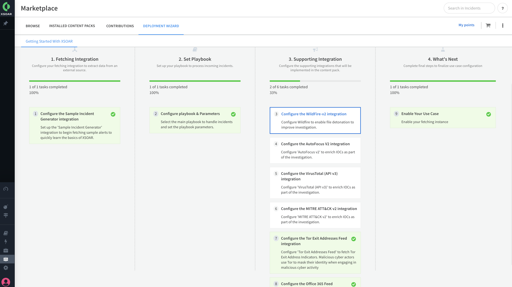

The Getting Started with XSOAR content pack accelerates the onboarding process by providing sample incident data, automations, and workflows. 

## What Does This Pack Contain?
- Sample Indicators of Compromise
- Example Malware and Phishing incidents from a SEIM
- Case workflows
- SLA Timers
- Optional Enrichment and Ticketing Integrations
- Investigation Timelines
- Built-in XSOAR Quick Actions and toolkits

## Getting Started / How to Set up the Pack
For better user experience and easier onboarding, use the [Deployment Wizard (Cortex XSOAR 6.13)](https://docs-cortex.paloaltonetworks.com/r/Cortex-XSOAR/6.13/Cortex-XSOAR-Administrator-Guide/Set-up-Your-Use-Case-with-the-Deployment-Wizard) or [Deployment Wizard (Cortex XSOAR 8 Cloud)](https://docs-cortex.paloaltonetworks.com/r/Cortex-XSOAR/8/Cortex-XSOAR-Cloud-Documentation/Set-up-your-use-case-with-the-Deployment-Wizard) or [Deployment Wizard (Cortex XSOAR 8.7 On-prem)](https://docs-cortex.paloaltonetworks.com/r/Cortex-XSOAR/8.7/Cortex-XSOAR-On-prem-Documentation/Set-up-your-use-case-with-the-Deployment-Wizard) after installing the content pack on the Marketplace page in Cortex XSOAR (Available from version 6.8).

For manual configuration, it is recommended to configure your integration instance to use: 
- Primary Playbook: **Case Management - Generic v2**
- Primary Incident Type: **Case**

For more information, visit our [Cortex XSOAR Developer Docs](https://xsoar.pan.dev/docs/reference/index).

### Dependencies & Recommendations
Supported Integrations (Required): 
- Sample Incident Generator

Supported Sandboxes and Enrichment (Optional):
- Palo Alto WildFire
- CrowdStrike FalconX
- Virus Total
- Autofocus

Supported Case Management (Optional):
- ServiceNow
- Atlassian Jira

Supported Messaging and Email applications (Optional):
- Mail Listener
- Mail Sender
- Microsoft Graph Mail
- Gmail

Supported Threat Feeds (Optional):
- Abuse.ch SSL Blacklist Feed 
- Office 365 Feed
- Tor Exit Addresses Feed

Supported Network Security integrations (Optional):
- PAN-OS by Palo Alto Networks
