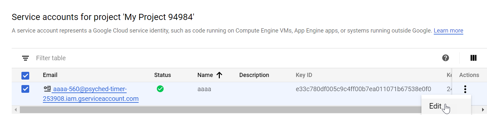

Use the Gmail integration to search and process emails in the organizational Gmail mailboxes.

This integration replaces the Gmail functionality in the GoogleApps API and G Suite integration. 

### Prerequisites

There are several procedures you have to perform in Google before configuring the integration on Demisto.

* [Get a New Private Key](#get-a-new-private-key)
* [Delegate Domain-wide Authority to Your Service Account](#delegate-domain-wide-authority-to-your-service-account)
* [Get an Immutable Google Apps ID](#get-an-immutable-google-apps-id-parameters)

### Get a New Private Key

1.  Access your [Google Service Account](https://console.developers.google.com/projectselector/iam-admin/serviceaccounts%C2%A0).
2.  In the IAM & admin section select **Service accounts**.
3.  If you need to create a new project, click **CREATE** do the following:
    1.  In the **New Project** window, type a project name, select an organization from the drop-down list, and then select a location.
    2.  Click **CREATE**.
4.  In the Service accounts section, click **Create Service Account**.
5.  In the **Create service account** window, type a name for the service account, add a description and then click **CREATE**.
6.  Click **Continue.**
7.  In the **Create key** section, click **CREATE KEY**.
8.  Select Key type **JSON** and click **CREATE**.
9.  Click **DONE**.<br/>A key pair is generated and automatically downloads.
10.  In the **Actions** column, select the service and then click **edit**.
     
11.  Under the show domain wide delegation, select **Enable G Suite Domain-wide Delegation**.
      
    NOTE: Copy the value of the Unique ID for the client name in step 2 in Delegate Domain-wide Authority to Your Service Account. 
12.  Click Save.
13.  In the top search bar, search for _admin sdk_.
14.  Click **Enable**.

### Delegate Domain-wide Authority to Your Service Account

1. Access the [Google Administrator Console](http://admin.google.com/).
2. Enter a client name (the Unique ID) and paste the following into the One or More API Scopes textbox. 
    
``` https://www.googleapis.com/auth/gmail.settings.basic,https://www.googleapis.com/auth/admin.directory.user,https://www.googleapis.com/auth/admin.directory.device.mobile.action,https://www.googleapis.com/auth/admin.directory.device.mobile.readonly,https://www.googleapis.com/auth/gmail.modify,https://www.googleapis.com/auth/gmail.settings.sharing,https://www.googleapis.com/auth/gmail.send,https://www.googleapis.com/auth/gmail.modify,https://www.googleapis.com/auth/admin.directory.device.chromeos,https://www.googleapis.com/auth/admin.directory.user.readonly,https://www.googleapis.com/auth/admin.directory.user.security,https://www.googleapis.com/auth/admin.directory.rolemanagement,https://www.googleapis.com/auth/admin.directory.rolemanagement.readonly,https://www.googleapis.com/auth/gmail.readonly,https://mail.google.com,https://www.googleapis.com/auth/gmail.compose ```
    


### Get an Immutable Google Apps ID Parameters
In order to revoke/fetch a user role, you need an Immutable Google Apps ID param.

1. Open [https://admin.google.com](https://admin.google.com) (as in step 2).
2. Navigate to **Security > Set up single sign-on (SSO)**. 
   The SSO URL is the Immutable Google Apps ID.
3. Record the SSO URL, which is the Immutable Google Apps ID, and copy it for later use.


## Configure Gmail on Cortex XSOAR

1. Navigate to **Settings** > **Integrations** > **Servers & Services**.
2. Search for Gmail.
3. Click **Add instance** to create and configure a new integration instance.

    | **Parameter** | **Description** | **Required** |
    | --- | --- | --- |
    | adminEmail | Email of user with admin privileges \(the Password refers to the Service Account private key\) | True |
    | gappsID | Immutable Google Apps Id -  Only the Cxxxxxxxx, section is needed| False |
    | query | Events query \(e.g. "from:example@demisto.com"\) The query language follows the Gmail query specification example: "from:someuser@example.com rfc822msgid:<somemsgid@example.com> is:unread". For more information, read the [Gmail Query Language documentation](https://support.google.com/mail/answer/7190?hl=en). | False |
    | queryUserKey | Events user key \(e.g. example@demisto.com\) Use this to specify the email account to search for messages. By default, the integration uses the email address specified in the admin instance. | False |
    | isFetch | Fetch incidents | False |
    | insecure | Trust any certificate \(not secure\) | False |
    | proxy | Use system proxy settings | False |
    | incidentType | Incident type | False |
    | fetch_time | First fetch timestamp, in days. | False |

4. Click **Test** to validate the URLs, token, and connection.

### Use Cases

1. Monitors a mailbox by using the integration fetch incident capability to monitor a mailbox and create incidents for new filtered emails.
2. Searches a mailbox for emails with PDF attachments by using the following command.
    `gmail-search user-id=admin@demisto.com filename=”pdf” after=”2018/05/10”.`
3. Deletes emails by using the following command.  
    `!gmail-delete-mail user-id=admin@demisto.com message-id=164d2110e0152660`


### Fetched Incidents Data

1. Incident Name
2. Occurred
3. Owner
4. Type
5. Severity
6. Email From
7. Email Message ID
8. Email Subject
9. Email To
10. Attachment Extension
11. Attachment Name
12. Email Body
13. Email Body Format


## Commands
You can execute these commands from the Demisto CLI, as part of an automation, or in a playbook.
After you successfully execute a command, a DBot message appears in the War Room with the command details.
- Delete a user: **gmail-delete-user**
- Get tokens for a user: **gmail-get-tokens-for-user**
- Get information for a Google user: **gmail-get-user**
- Get all available Google roles: **gmail-get-user-roles**
- Get Gmail message attachments: **gmail-get-attachments**
- Get a Gmail message: **gmail-get-mail**
- Search a user's Gmail records: **gmail-search**
- Search in all Gmail mailboxes: **gmail-search-all-mailboxes**
- List all Google users: **gmail-list-users**
- Revoke a Google user's role: **gmail-revoke-user-role**
- Create a new user: **gmail-create-user**
- Delete mail from a mailbox: **gmail-delete-mail**
- Get message in an email thread: **gmail-get-thread**
- Move mail to a different folder: **gmail-move-mail**
- Move a mail to a different mailbox: **gmail-move-mail-to-mailbox**
- Add a rule to delete an email: **gmail-add-delete-filter**
- Add a new filter: **gmail-add-filter**
- Get a list of filters in a mailbox: **gmail-list-filter**
- Remove a filter from a mail: **gmail-remove-filter**
- Hide a user's information: **gmail-hide-user-in-directory**
- Set a password: **gmail-set-password**
- Get an auto reply message for the user: **gmail-get-autoreply**
- Set an auto-reply for the user: **gmail-set-autoreply**
- Add a delete user to a mailbox: **gmail-delegate-user-mailbox**
- Send an email using Gmail: **send-mail**
- Reply an email using Gmail: **reply-mail**
- Removers a delegate from a mailbox: **gmail-remove-delegated-mailbox**
- Get details of a specific role: **gmail-get-role**
- Creates a forwarding address.: **gmail-forwarding-address-add**
- Create a custom "from" send-as alias: **gmail-send-as-add**


### gmail-delete-user
***
Deletes a Gmail user.


#### Base Command

`gmail-delete-user`
#### Input

| **Argument Name** | **Description** | **Required** |
| --- | --- | --- |
| user-id | The user's email address. The "me" special value can be used to indicate the authenticated user. | Required | 


#### Context Output

There is no context output for this command.

#### Command Example
```!gmail-delete-user user-id=user1@domain.io```


#### Human Readable Output

>User user1@domain.io have been deleted.

### gmail-get-tokens-for-user
***
Lists all tokens associated with a specified user. applications.


#### Base Command

`gmail-get-tokens-for-user`
#### Input

| **Argument Name** | **Description** | **Required** |
| --- | --- | --- |
| user-id | The user's email address. The "me" special value can be used to indicate the authenticated user. | Required | 


#### Command Example
```!gmail-get-tokens-for-user user-id=user@domain.io```

#### Context Example
```
{
    "Tokens": {
        "ClientId": "292824132082.apps.googleusercontent.com",
        "DisplayText": "Google APIs Explorer",
        "Kind": "admin#directory#token",
        "Scopes": [
            "openid",
            "https://www.googleapis.com/auth/calendar"
        ],
        "UserKey": "115824619743385532879"
    }
}
```

#### Human Readable Output

>### Tokens:
>|DisplayText|ClientId|Kind|Scopes|UserKey|
>|---|---|---|---|---|
>| Google APIs Explorer | 292824132082.apps.googleusercontent.com | admin#directory#token | openid,<br/>https://www.googleapis.com/auth/calendar | 115824619743385532879 |
>|Go Phish!|422358954086-4fvv287aojmge1qaqe9m5mmgmbuhg1hj.apps.googleusercontent.com|admin#directory#token|https://www.googleapis.com/auth/gmail.addons.current.message.readonly, <br/> https://www.googleapis.com/auth/script.send_mail, <br/> https://www.googleapis.com/auth/userinfo.email, <br/> openid, <br/> https://www.googleapis.com/auth/script.storage, <br/> https://www.googleapis.com/auth/gmail.addons.execute, <br/> https://www.googleapis.com/auth/admin.directory.user.readonly|103020731686044834269|
>|Demisto KMS DEV|950822307886-oiv25bpm32dtp21eabn2k5lf1ba7koum.apps.googleusercontent.com|admin#directory#token|https://www.googleapis.com/auth/cloud-platform|103020731686044834269|
>|Google Data Studio|371237729773-oj8m98u7esgqep8snt9aold136opo3fi.apps.googleusercontent.com|admin#directory#token|https://www.googleapis.com/auth/bigquery.readonly|103020731686044834269|
>|Postman|805864674475-3abs2rivkn7kreou30b8ru8esnti4oih.apps.googleusercontent.com|admin#directory#token|https://www.googleapis.com/auth/userinfo.profile, <br/> https://www.googleapis.com/auth/userinfo.email|103020731686044834269|

### gmail-get-user
***
Gets information for a specified user.


#### Base Command

`gmail-get-user`
#### Input

| **Argument Name** | **Description** | **Required** |
| --- | --- | --- |
| user-id | The user's email address. The "me" special value can be used to indicate the authenticated user. | Required | 
| projection | The subset of fields to fetch for the user. Can be: "basic": Do not include any custom fields for the user (default), "custom": Includes custom fields from schemas requested in custom-field-mask, "full": Includes all fields associated with the user. | Optional | 
| view-type-public-domain | Whether to fetch the administrator or public view of the user. Can be admin_view (default), which includes both administrator and domain-public fields; or "domain_public", which includes user fields that are publicly visible to other users in the domain. | Optional | 
| custom-field-mask | A comma separated list of schema names. All fields from these schemas are fetched. This should only be set when projection=custom. | Optional | 


#### Context Output

| **Path** | **Type** | **Description** |
| --- | --- | --- |
| Account.Type | String | The account type. For example, "AD", "LocalOS", "Google", "AppleID", and so on. | 
| Account.ID | String | The unique ID for the account \(integration specific\). For AD accounts this is the Distinguished Name \(DN\). | 
| Account.DisplayName | string | The display name. | 
| Account.Gmail.Address | string | Email assigned with the current account. | 
| Account.Email.Address | String | The email address of the account. | 
| Account.Domain | String | The domain of the account. | 
| Account.Username | String | The account username in the relevant system. | 
| Account.OrganizationUnit | String | The Organization Unit \(OU\) of the account. | 
| Account.Group | String | Groups to which the account belongs \(integration specific\). For example, for AD, these are the groups in which the account is a member. | 
| Account.VisibleInDirectory | Boolean | Whether the account is visible in the directory. | 
| Account.CustomerId | String | The customer unique ID. | 


#### Command Example
```!gmail-get-user user-id=user@domain.io```

#### Context Example
```
{
    "Account": {
        "CustomerId": "C03puekhd",
        "DisplayName": "user user",
        "Domain": "domain.io",
        "Email": {
            "Address": "user@domain.io"
        },
        "Gmail": {
            "Address": "user@domain.io"
        },
        "Group": "admin#directory#user",
        "Groups": "admin#directory#user",
        "ID": "115824619743385532879",
        "Type": "Google",
        "UserName": "user",
        "Username": "user",
        "VisibleInDirectory": true
    }
}
```

#### Human Readable Output

>### User user@domain.io:
>|Type|ID|Username|DisplayName|Groups|CustomerId|Domain|Email|VisibleInDirectory|
>|---|---|---|---|---|---|---|---|---|
>| Google | 115824619743385532879 | user | user user | admin#directory#user | C03puekhd | domain.io | Address: user@domain.io | true |


### gmail-get-user-roles
***
Retrieves a list of all Google roles for a specified user.


#### Base Command

`gmail-get-user-roles`
#### Input

| **Argument Name** | **Description** | **Required** |
| --- | --- | --- |
| user-id | The user's email address. The "me" special value can be used to indicate the authenticated user. | Required | 


#### Context Output

| **Path** | **Type** | **Description** |
| --- | --- | --- |
| Gmail.Role.RoleAssignmentId | String | The unique ID of the role assignment. | 
| Gmail.Role.ScopeType | String | The scope type of the role. | 
| Gmail.Role.Kind | String | The kind of the Role. | 
| Gmail.Role.OrgUnitId | String | Organization in which user was assigned. | 
| Gmail.Role.ID | String | The inner role ID. | 
| Gmail.Role.AssignedTo | String | User ID who was assigned to the role. | 


#### Command Example
```!gmail-get-user-roles user-id=user@domain.io```

#### Context Example
```
{
    "Gmail": {
        "Role": [
            {
                "AssignedTo": "118105533760233960163",
                "ID": "13801188331880449",
                "Kind": "admin#directory#roleAssignment",
                "OrgUnitId": "",
                "RoleAssignmentId": "13801188331880456",
                "ScopeType": "CUSTOMER"
            },
            {
                "AssignedTo": "118105533760233960163",
                "ID": "13801188331880463",
                "Kind": "admin#directory#roleAssignment",
                "OrgUnitId": "",
                "RoleAssignmentId": "13801188331880489",
                "ScopeType": "CUSTOMER"
            },
            {
                "AssignedTo": "118105533760233960163",
                "ID": "13801188331880469",
                "Kind": "admin#directory#roleAssignment",
                "OrgUnitId": "03ph8a2z3tho209",
                "RoleAssignmentId": "13801188331880492",
                "ScopeType": "ORG_UNIT"
            }
        ]
    }
}

```

#### Human Readable Output

>### User Roles of user@domain.io:
>|ID|RoleAssignmentId|ScopeType|Kind|OrgUnitId|
>|---|---|---|---|---|
>| 13801188331880449 | 13801188331880456 | CUSTOMER | admin#directory#roleAssignment |  |
>| 13801188331880463 | 13801188331880489 | CUSTOMER | admin#directory#roleAssignment |  |
>| 13801188331880469 | 13801188331880492 | ORG_UNIT | admin#directory#roleAssignment | 03ph8a2z3tho209 |

### gmail-get-attachments
***
Retrieves attachments from a sent Gmail message.


#### Base Command

`gmail-get-attachments`
#### Input

| **Argument Name** | **Description** | **Required** |
| --- | --- | --- |
| message-id | The ID of the message to retrieve. | Required | 
| user-id | The user's email address. The "me" special value can be used to indicate the authenticated user. | Required | 


#### Command Example
```!gmail-get-attachments message-id=16d4316a25a332e4 user-id=admin@demistodev.com```


### gmail-get-mail
***
Retrieves the Gmail message sent to a specified user.


#### Base Command

`gmail-get-mail`
#### Input

| **Argument Name** | **Description** | **Required** |
| --- | --- | --- |
| user-id | The user's email address. The special value me can be used to indicate the authenticated user. | Required | 
| message-id | The ID of the message to retrieve. | Required | 
| format | The format in which to return the message. Can be: "full": Returns the full email message data with body content parsed in the payload field; the raw field is not used. (default) / "metadata": Returns only the email message ID, labels, and email headers / "minimal": Returns only the email message ID and labels; does not return the email headers, body, or payload / "raw": Returns the full email message data with body content in the raw field as a base64url encoded string; the payload field is not used. | Optional | 


#### Context Output

| **Path** | **Type** | **Description** |
| --- | --- | --- |
| Gmail.ID | String | Inner ID of the Gmail message. | 
| Gmail.ThreadId | string | The thread ID. | 
| Gmail.Format | string | MIME type of email. | 
| Gmail.Labels | string | Labels of the specific email. | 
| Gmail.To | String | Email Address of the receiver. | 
| Gmail.From | String | Email Address of the sender. | 
| Gmail.Cc | string | Additional recipient email address \(CC\). | 
| Gmail.Bcc | string | Additional recipient email address \(BCC\). | 
| Gmail.Subject | string | Subject of the email. | 
| Gmail.Body | string | The content of the email. | 
| Gmail.Attachments | unknown | The attachments of the email. Attachments ID's are separated by ','. | 
| Gmail.Headers | unknown | All headers of the specific email \(list\). | 
| Gmail.Mailbox | string | The email mailbox. | 
| Email.To | String | The recipient of the email. | 
| Email.From | String | The sender of the email. | 
| Email.CC | String | Additional recipient email address \(CC\). | 
| Email.BCC | String | Additional recipient email address \(BCC\). | 
| Email.Format | String | The format of the email. | 
| Email.Body/HTML | String | The HTML version of the email. | 
| Email.Body/Text | String | The plain-text version of the email. | 
| Email.Subject | String | The subject of the email. | 
| Email.Headers | String | The headers of the email. | 
| Email.Attachments.entryID | Unknown | Attachments ids separated by ','. | 
| Email.Date | String | The date the email was received. | 


#### Command Example
```!gmail-get-mail user-id=user@domain.io message-id=175276e027a9aab9```

#### Context Example
```
{
    "Email": {
        "Attachment Names": "",
        "Attachments": [],
        "BCC": [],
        "Body/HTML": "",
        "Body/Text": "",
        "CC": [],
        "Date": "Wed, 14 Oct 2020 07:05:21 -0700",
        "Format": "multipart/alternative",
        "From": "The G Suite Team <gsuite-noreply@google.com>",
        "Headers": [
            {
                "Name": "Delivered-To",
                "Value": "user@domain.io"
            },
            {
                "Name": "Received",
                "Value": "by 2002:a1c:7fc5:0:0:0:0:0 with SMTP id a188csp491068wmd;        Wed, 14 Oct 2020 07:05:22 -0700 (PDT)"
            },
            {
                "Name": "X-Received",
                "Value": "by 2002:ab0:658e:: with SMTP id v14mr2984443uam.97.1602684322816;        Wed, 14 Oct 2020 07:05:22 -0700 (PDT)"
            },
            {
                "Name": "ARC-Seal",
                "Value": "i=1; a=rsa-sha256; t=1602684322; cv=none;        d=google.com; s=arc-20160816;        b=ZMhZ46t3LKOsm7Goq4PFtXh+6SAMBjRuuOEPkvAC4qv6M+0fZphp/MrZa1MLM7wi5Q         b2m13JPapwtAdOezOCcHFxCttXuoG4jpfmMGfJGNm5ITaNtNdHxfpsAQ8s6sVHfuKBCT         m3+YRYDVInjmapyihFrMZYIdjeWxKAEaFye8NiedNIpX91tFt+H2JR69TW1hjAqLOurk         cx57CUUFn+vSRM06zFmfGalk1ZgTPpRuPCqLCAK2+aOH4Rki6l8XzVYcoPwkcFVKYg2j         +yXE8NbIReMtqiOL63EomUGuaCeLDcSPgaHsv3o+BdXEcLvuKBzqPqY2gUvpMZNAcG9q         UsXg=="
            },
            {
                "Name": "ARC-Message-Signature",
                "Value": "i=1; a=rsa-sha256; c=relaxed/relaxed; d=google.com; s=arc-20160816;        h=to:from:subject:message-id:feedback-id:reply-to:date:mime-version         :userim-signature;        bh=1iRIOaJixsPLiHwsRGm0Bzd/a5qzzjoDix+zYsrquWQ=;        b=ZniRwt/7awcNv0Mr7RoyiHu0PhsC97+IquSkKX/Er7j2Cm7JEYGhitxnzeg5wfUpBn         SCa66lcZ4qtgi/2PwmeJnlxybIJzzEG0cnVPtQG7A9yw/AjCcFn4iXsPWp9WtUD1ziV1         qnoDefmxorYvo5l2YWwxN/KtGqVEu+Za6YziiW06blKLyTId6rk2GqtbL4ebaMmhv+wa         2hJ6gsxdZLr9BfZ74pK8wyeJCiWPB+ovRd/QE3yWNmGI+fwFKGtoHouedr0ZXQ7Q3AGt         UgSCIB6fkIOl3DiiXBRGqDWakxZV9424/yxIUjAzI/P8rOV4jQX0fJyVqj4NFNjsblzp         fWUQ=="
            },
            {
                "Name": "ARC-Authentication-Results",
                "Value": "i=1; mx.google.com;       userim=pass header.i=@google.com header.s=20161025 header.b=\"B/ouKoWq\";       spf=pass (google.com: domain of 3oqwhxw4kbcow8ay9u-347u51ew44w1u.s42tubq13y2r1utq9q.y4@scoutcamp.bounces.google.com designates 209.85.220.69 as permitted sender) smtp.mailfrom=3oQWHXw4KBcow8Ay9u-347u51Ew44w1u.s42tuBq13y2r1utq9q.y4@scoutcamp.bounces.google.com;       dmarc=pass (p=REJECT sp=REJECT dis=NONE) header.from=google.com"
            },
            {
                "Name": "Return-Path",
                "Value": "<3oQWHXw4KBcow8Ay9u-347u51Ew44w1u.s42tuBq13y2r1utq9q.y4@scoutcamp.bounces.google.com>"
            },
            {
                "Name": "Received",
                "Value": "from mail-sor-f69.google.com (mail-sor-f69.google.com. [209.85.220.69])        by mx.google.com with SMTPS id g25sor733005vsf.19.2020.10.14.07.05.22        for <user@domain.io>        (Google Transport Security);        Wed, 14 Oct 2020 07:05:22 -0700 (PDT)"
            },
            {
                "Name": "Received-SPF",
                "Value": "pass (google.com: domain of 3oqwhxw4kbcow8ay9u-347u51ew44w1u.s42tubq13y2r1utq9q.y4@scoutcamp.bounces.google.com designates 209.85.220.69 as permitted sender) client-ip=209.85.220.69;"
            },
            {
                "Name": "Authentication-Results",
                "Value": "mx.google.com;       userim=pass header.i=@google.com header.s=20161025 header.b=\"B/ouKoWq\";       spf=pass (google.com: domain of 3oqwhxw4kbcow8ay9u-347u51ew44w1u.s42tubq13y2r1utq9q.y4@scoutcamp.bounces.google.com designates 209.85.220.69 as permitted sender) smtp.mailfrom=3oQWHXw4KBcow8Ay9u-347u51Ew44w1u.s42tuBq13y2r1utq9q.y4@scoutcamp.bounces.google.com;       dmarc=pass (p=REJECT sp=REJECT dis=NONE) header.from=google.com"
            },
            {
                "Name": "userIM-Signature",
                "Value": "v=1; a=rsa-sha256; c=relaxed/relaxed;        d=google.com; s=20161025;        h=mime-version:date:reply-to:feedback-id:message-id:subject:from:to;        bh=1iRIOaJixsPLiHwsRGm0Bzd/a5qzzjoDix+zYsrquWQ=;        b=B/ouKoWqw/ZxXjGlTzq1he5tz7yyGdNKzsNK1qI0hD6Kna8M25A909y5QY0p930hP5         frtkcjeUqhx+3xWcifYMCiiserHQp1PzOHcOtKBHLLB81kIIFy2PoXt5QSKQeN1hgrtF         nspEDYBA1+ttmHSfYIy6EwBcjE5vZV6BrVes66s63I1TVOGk3My3mkDxmnHLjsJMimAp         +Hg8GOEBbNjcA8sKk+rkO/3mTc4MQTO7rucOTbR0XxPiQ4ZJE7nxXYZ1FtZIC5btcoJn         Qa6DHZDCpiU6S0kmEZculy5s7Kerrf+WrGsSCtZi9cuyPZ/+V35Okd5h3oamdXR3rUej         VfFg=="
            },
            {
                "Name": "X-Google-userIM-Signature",
                "Value": "v=1; a=rsa-sha256; c=relaxed/relaxed;        d=1e100.net; s=20161025;        h=x-gm-message-state:mime-version:date:reply-to:feedback-id         :message-id:subject:from:to;        bh=1iRIOaJixsPLiHwsRGm0Bzd/a5qzzjoDix+zYsrquWQ=;        b=TmbhOtA3+mJPilYZ0+2u5g2u3ZVMZC0twNvhjaV4e0lSNTlyMRy7jNXXxY0dVF9re0         ScVwdWtvbwSejo6QzaFDuO7U9v83epq7Y+TvYO0tlJGddc1VzbywDcqIQHvVEeZfk/ki         lcFw8X5eoQmNyuzTcojJisQeMs3+A5mlL7BNtiFO/PStXojW455WjrXb958HAdVvyBga         R2O0QvGu0zLu1OmfTamo8sMJczU4gvUyWOC3SuqgUZNlFQ9GRyR4XRikigKL/WWKgVg0         RcILn2ziDM7z47V3yQuaGJTXiuabbgpY2zBMjTYkrVepe5BaWl1Lu7N7NIBnkkyjYZ+8         jjIA=="
            },
            {
                "Name": "X-Gm-Message-State",
                "Value": "AOAM531vyv6NOK1w4HuwIuGXXe5J5gAoRHJLdSnfBFKQZZPaATiWi6HA PxiSKqxH7La9SE8="
            },
            {
                "Name": "X-Google-Smtp-Source",
                "Value": "ABdhPJykPnFU/+bOu1SyNprW/mF8MF98QscgxjFit7dAqEV8CkZD4ahPZSzi9MS+qEzIN8xZdVG2128="
            },
            {
                "Name": "MIME-Version",
                "Value": "1.0"
            },
            {
                "Name": "X-Received",
                "Value": "by 2002:a05:6102:205c:: with SMTP id q28mr3609398vsr.38.1602684321347; Wed, 14 Oct 2020 07:05:21 -0700 (PDT)"
            },
            {
                "Name": "Date",
                "Value": "Wed, 14 Oct 2020 07:05:21 -0700"
            },
            {
                "Name": "Reply-To",
                "Value": "The G Suite Team <gsuite-noreply@google.com>"
            },
            {
                "Name": "X-Google-Id",
                "Value": "253939"
            },
            {
                "Name": "Feedback-ID",
                "Value": "P-10-0:C20060867:M110136315-en:gamma"
            },
            {
                "Name": "X-Notifications",
                "Value": "GAMMA:<be35f268e4fd76dd252437e3bffc032bc68e7d9a-20060867-110354355@google.com>"
            },
            {
                "Name": "Message-ID",
                "Value": "<be35f268e4fd76dd252437e3bffc032bc68e7d9a-20060867-110354355@google.com>"
            },
            {
                "Name": "Subject",
                "Value": "Your G Suite data transfer was successful for test user to newaccount newdemo"
            },
            {
                "Name": "From",
                "Value": "The G Suite Team <gsuite-noreply@google.com>"
            },
            {
                "Name": "To",
                "Value": "user@domain.io"
            },
            {
                "Name": "Content-Type",
                "Value": "multipart/alternative; boundary=\"000000000000a9382a05b1a2058d\""
            }
        ],
        "ID": "175276e027a9aab9",
        "RawData": null,
        "Subject": "Your G Suite data transfer was successful for test user to newaccount newdemo",
        "To": "user@domain.io"
    },
    "Gmail": {
        "Attachment Names": "",
        "Attachments": [],
        "Bcc": [],
        "Body": "From: \"The G Suite Team\" [gsuite-noreply@google.com]\r\nSubject:  Your G Suite data transfer was successful for test user to  \r\nnewaccount newdemo\r\n\r\nHello Admin,\r\n\r\nG\u00a0Suite recently processed a request from test user (user@domain.io)  \r\nto transfer data for test user (user@domain.io) to newaccount  \r\nnewdemo (demo@domain.io).\r\n\r\nThe data transfer was successful.\r\n\r\nSincerely,\r\n\r\nThe G\u00a0Suite Team\r\n\r\n\r\n[Google Cloud]\r\n\r\n(c) 2020 Google LLC 1600 Amphitheatre Parkway, Mountain View, CA 94043 *  \r\nGoogle Ireland Ltd, Gordon House, Barrow Street, Dublin 4, Ireland * Google  \r\nAsia Pacific Pte. Ltd., 8 Marina View, #30-01, Asia Square 1, Singapore  \r\n018960\r\n\r\nYou're receiving this mandatory email service announcement to update you  \r\nabout important changes to your Google Cloud product or account.\r\n",
        "Cc": [],
        "Date": "Wed, 14 Oct 2020 07:05:21 -0700",
        "Format": "multipart/alternative",
        "From": "The G Suite Team <gsuite-noreply@google.com>",
        "Headers": [
            {
                "Name": "Delivered-To",
                "Value": "user@domain.io"
            },
            {
                "Name": "Received",
                "Value": "by 2002:a1c:7fc5:0:0:0:0:0 with SMTP id a188csp491068wmd;        Wed, 14 Oct 2020 07:05:22 -0700 (PDT)"
            },
            {
                "Name": "X-Received",
                "Value": "by 2002:ab0:658e:: with SMTP id v14mr2984443uam.97.1602684322816;        Wed, 14 Oct 2020 07:05:22 -0700 (PDT)"
            },
            {
                "Name": "ARC-Seal",
                "Value": "i=1; a=rsa-sha256; t=1602684322; cv=none;        d=google.com; s=arc-20160816;        b=ZMhZ46t3LKOsm7Goq4PFtXh+6SAMBjRuuOEPkvAC4qv6M+0fZphp/MrZa1MLM7wi5Q         b2m13JPapwtAdOezOCcHFxCttXuoG4jpfmMGfJGNm5ITaNtNdHxfpsAQ8s6sVHfuKBCT         m3+YRYDVInjmapyihFrMZYIdjeWxKAEaFye8NiedNIpX91tFt+H2JR69TW1hjAqLOurk         cx57CUUFn+vSRM06zFmfGalk1ZgTPpRuPCqLCAK2+aOH4Rki6l8XzVYcoPwkcFVKYg2j         +yXE8NbIReMtqiOL63EomUGuaCeLDcSPgaHsv3o+BdXEcLvuKBzqPqY2gUvpMZNAcG9q         UsXg=="
            },
            {
                "Name": "ARC-Message-Signature",
                "Value": "i=1; a=rsa-sha256; c=relaxed/relaxed; d=google.com; s=arc-20160816;        h=to:from:subject:message-id:feedback-id:reply-to:date:mime-version         :userim-signature;        bh=1iRIOaJixsPLiHwsRGm0Bzd/a5qzzjoDix+zYsrquWQ=;        b=ZniRwt/7awcNv0Mr7RoyiHu0PhsC97+IquSkKX/Er7j2Cm7JEYGhitxnzeg5wfUpBn         SCa66lcZ4qtgi/2PwmeJnlxybIJzzEG0cnVPtQG7A9yw/AjCcFn4iXsPWp9WtUD1ziV1         qnoDefmxorYvo5l2YWwxN/KtGqVEu+Za6YziiW06blKLyTId6rk2GqtbL4ebaMmhv+wa         2hJ6gsxdZLr9BfZ74pK8wyeJCiWPB+ovRd/QE3yWNmGI+fwFKGtoHouedr0ZXQ7Q3AGt         UgSCIB6fkIOl3DiiXBRGqDWakxZV9424/yxIUjAzI/P8rOV4jQX0fJyVqj4NFNjsblzp         fWUQ=="
            },
            {
                "Name": "ARC-Authentication-Results",
                "Value": "i=1; mx.google.com;       userim=pass header.i=@google.com header.s=20161025 header.b=\"B/ouKoWq\";       spf=pass (google.com: domain of 3oqwhxw4kbcow8ay9u-347u51ew44w1u.s42tubq13y2r1utq9q.y4@scoutcamp.bounces.google.com designates 209.85.220.69 as permitted sender) smtp.mailfrom=3oQWHXw4KBcow8Ay9u-347u51Ew44w1u.s42tuBq13y2r1utq9q.y4@scoutcamp.bounces.google.com;       dmarc=pass (p=REJECT sp=REJECT dis=NONE) header.from=google.com"
            },
            {
                "Name": "Return-Path",
                "Value": "<3oQWHXw4KBcow8Ay9u-347u51Ew44w1u.s42tuBq13y2r1utq9q.y4@scoutcamp.bounces.google.com>"
            },
            {
                "Name": "Received",
                "Value": "from mail-sor-f69.google.com (mail-sor-f69.google.com. [209.85.220.69])        by mx.google.com with SMTPS id g25sor733005vsf.19.2020.10.14.07.05.22        for <user@domain.io>        (Google Transport Security);        Wed, 14 Oct 2020 07:05:22 -0700 (PDT)"
            },
            {
                "Name": "Received-SPF",
                "Value": "pass (google.com: domain of 3oqwhxw4kbcow8ay9u-347u51ew44w1u.s42tubq13y2r1utq9q.y4@scoutcamp.bounces.google.com designates 209.85.220.69 as permitted sender) client-ip=209.85.220.69;"
            },
            {
                "Name": "Authentication-Results",
                "Value": "mx.google.com;       userim=pass header.i=@google.com header.s=20161025 header.b=\"B/ouKoWq\";       spf=pass (google.com: domain of 3oqwhxw4kbcow8ay9u-347u51ew44w1u.s42tubq13y2r1utq9q.y4@scoutcamp.bounces.google.com designates 209.85.220.69 as permitted sender) smtp.mailfrom=3oQWHXw4KBcow8Ay9u-347u51Ew44w1u.s42tuBq13y2r1utq9q.y4@scoutcamp.bounces.google.com;       dmarc=pass (p=REJECT sp=REJECT dis=NONE) header.from=google.com"
            },
            {
                "Name": "userIM-Signature",
                "Value": "v=1; a=rsa-sha256; c=relaxed/relaxed;        d=google.com; s=20161025;        h=mime-version:date:reply-to:feedback-id:message-id:subject:from:to;        bh=1iRIOaJixsPLiHwsRGm0Bzd/a5qzzjoDix+zYsrquWQ=;        b=B/ouKoWqw/ZxXjGlTzq1he5tz7yyGdNKzsNK1qI0hD6Kna8M25A909y5QY0p930hP5         frtkcjeUqhx+3xWcifYMCiiserHQp1PzOHcOtKBHLLB81kIIFy2PoXt5QSKQeN1hgrtF         nspEDYBA1+ttmHSfYIy6EwBcjE5vZV6BrVes66s63I1TVOGk3My3mkDxmnHLjsJMimAp         +Hg8GOEBbNjcA8sKk+rkO/3mTc4MQTO7rucOTbR0XxPiQ4ZJE7nxXYZ1FtZIC5btcoJn         Qa6DHZDCpiU6S0kmEZculy5s7Kerrf+WrGsSCtZi9cuyPZ/+V35Okd5h3oamdXR3rUej         VfFg=="
            },
            {
                "Name": "X-Google-userIM-Signature",
                "Value": "v=1; a=rsa-sha256; c=relaxed/relaxed;        d=1e100.net; s=20161025;        h=x-gm-message-state:mime-version:date:reply-to:feedback-id         :message-id:subject:from:to;        bh=1iRIOaJixsPLiHwsRGm0Bzd/a5qzzjoDix+zYsrquWQ=;        b=TmbhOtA3+mJPilYZ0+2u5g2u3ZVMZC0twNvhjaV4e0lSNTlyMRy7jNXXxY0dVF9re0         ScVwdWtvbwSejo6QzaFDuO7U9v83epq7Y+TvYO0tlJGddc1VzbywDcqIQHvVEeZfk/ki         lcFw8X5eoQmNyuzTcojJisQeMs3+A5mlL7BNtiFO/PStXojW455WjrXb958HAdVvyBga         R2O0QvGu0zLu1OmfTamo8sMJczU4gvUyWOC3SuqgUZNlFQ9GRyR4XRikigKL/WWKgVg0         RcILn2ziDM7z47V3yQuaGJTXiuabbgpY2zBMjTYkrVepe5BaWl1Lu7N7NIBnkkyjYZ+8         jjIA=="
            },
            {
                "Name": "X-Gm-Message-State",
                "Value": "AOAM531vyv6NOK1w4HuwIuGXXe5J5gAoRHJLdSnfBFKQZZPaATiWi6HA PxiSKqxH7La9SE8="
            },
            {
                "Name": "X-Google-Smtp-Source",
                "Value": "ABdhPJykPnFU/+bOu1SyNprW/mF8MF98QscgxjFit7dAqEV8CkZD4ahPZSzi9MS+qEzIN8xZdVG2128="
            },
            {
                "Name": "MIME-Version",
                "Value": "1.0"
            },
            {
                "Name": "X-Received",
                "Value": "by 2002:a05:6102:205c:: with SMTP id q28mr3609398vsr.38.1602684321347; Wed, 14 Oct 2020 07:05:21 -0700 (PDT)"
            },
            {
                "Name": "Date",
                "Value": "Wed, 14 Oct 2020 07:05:21 -0700"
            },
            {
                "Name": "Reply-To",
                "Value": "The G Suite Team <gsuite-noreply@google.com>"
            },
            {
                "Name": "X-Google-Id",
                "Value": "253939"
            },
            {
                "Name": "Feedback-ID",
                "Value": "P-10-0:C20060867:M110136315-en:gamma"
            },
            {
                "Name": "X-Notifications",
                "Value": "GAMMA:<be35f268e4fd76dd252437e3bffc032bc68e7d9a-20060867-110354355@google.com>"
            },
            {
                "Name": "Message-ID",
                "Value": "<be35f268e4fd76dd252437e3bffc032bc68e7d9a-20060867-110354355@google.com>"
            },
            {
                "Name": "Subject",
                "Value": "Your G Suite data transfer was successful for test user to newaccount newdemo"
            },
            {
                "Name": "From",
                "Value": "The G Suite Team <gsuite-noreply@google.com>"
            },
            {
                "Name": "To",
                "Value": "user@domain.io"
            },
            {
                "Name": "Content-Type",
                "Value": "multipart/alternative; boundary=\"000000000000a9382a05b1a2058d\""
            }
        ],
        "Html": "html",
        "ID": "175276e027a9aab9",
        "Labels": "UNREAD, CATEGORY_UPDATES, INBOX",
        "Mailbox": "user@domain.io",
        "RawData": null,
        "Subject": "Your G Suite data transfer was successful for test user to newaccount newdemo",
        "ThreadId": "1752721e660048f9",
        "To": "user@domain.io",
        "Type": "Gmail"
    }
}
```

#### Human Readable Output

>### Email:
>|Mailbox|ID|Subject|From|To|Labels|Format|Body|
>|---|---|---|---|---|---|---|---|
>| user@domain.io | 175276e027a9aab9 | Your G Suite data transfer was successful for test user to newaccount newdemo | The G Suite Team <gsuite-noreply@google.com> | user@domain.io | UNREAD, CATEGORY_UPDATES, INBOX | multipart/alternative | From: "The G Suite Team" [gsuite-noreply@google.com]<br/>Subject:  Your G Suite data transfer was successful for test user to  <br/>newaccount newdemo<br/><br/>Hello Admin,<br/><br/>G Suite recently processed a request from test user (user@domain.io)  <br/>to transfer data for test user (user@domain.io) to newaccount  <br/>newdemo (demo@domain.io).<br/><br/>The data transfer was successful.<br/><br/>Sincerely,<br/><br/>The G Suite Team<br/><br/><br/>[Google Cloud]<br/><br/>(c) 2020 Google LLC 1600 Amphitheatre Parkway, Mountain View, CA 94043 *  <br/>Google Ireland Ltd, Gordon House, Barrow Street, Dublin 4, Ireland * Google  <br/>Asia Pacific Pte. Ltd., 8 Marina View, #30-01, Asia Square 1, Singapore  <br/>018960<br/><br/>You're receiving this mandatory email service announcement to update you  <br/>about important changes to your Google Cloud product or account.<br/> |


### gmail-search
***
Searches for Gmail records of a specified Google user.


#### Base Command

`gmail-search`
#### Input

| **Argument Name** | **Description** | **Required** |
| --- | --- | --- |
| user-id | The user's email address. The "me" special value can be used to indicate the authenticated user. | Required | 
| query | Returns messages matching the specified query. Supports the same query format as the Gmail search box. For example, "from:someuser@example.com rfc822msgid: is:unread". For more syntax information see "https://support.google.com/mail/answer/7190?hl=en" | Optional | 
| max-results | Maximum number of results to return. Default is 100. Maximum is 500. Can be 1 to 500, inclusive. | Optional | 
| fields | Enables partial responses to be retrieved, separated by commas. For more information, see https://developers.google.com/gdata/docs/2.0/basics#PartialResponse. | Optional | 
| labels-ids | Only returns messages with labels that match all of the specified label IDs in a comma separated list. | Optional | 
| page-token | Page token to retrieve a specific page of results in the list. | Optional | 
| include-spam-trash | Include messages from SPAM and TRASH in the results. (Default: false) | Optional | 
| from | Specify the sender. For example, "john" | Optional | 
| to | Specify the receiver. For example, "john" | Optional | 
| subject | Words in the subject line. For example, "alert" | Optional | 
| filename | Attachments with a certain name or file type. For example, "pdf" or "report.pdf" | Optional | 
| in | Messages in any folder, including Spam and Trash. For example: shopping | Optional | 
| after | Search for messages sent after a certain time period. For example: 2018/05/06 | Optional | 
| before | Search for messages sent before a certain time period. for example: 2018/05/09 | Optional | 
| has-attachments | Whether to search for messages sent with attachments (boolean value). | Optional | 


#### Context Output

| **Path** | **Type** | **Description** |
| --- | --- | --- |
| Gmail.ID | string | Inner ID of the Gmail message. | 
| Gmail.ThreadId | string | The thread ID. | 
| Gmail.Format | string | MIME type of email. | 
| Gmail.Labels | string | Labels of the specific email. | 
| Gmail.To | string | Email Address of the receiver. | 
| Gmail.From | string | Email Address of the sender. | 
| Gmail.Cc | string | Additional recipient email address \(CC\). | 
| Gmail.Bcc | string | Additional recipient email address \(BCC\). | 
| Gmail.Subject | string | Subject of the specific email. | 
| Gmail.Body | string | The content of the email. | 
| Gmail.Attachments | unknown | Attachment details. Attachments IDs are separated by ',' | 
| Gmail.Headers | unknown | All headers of a specific email \(list\). | 
| Gmail.Mailbox | string | The email mailbox. | 
| Email.To | String | The recipient of the email. | 
| Email.From | String | The sender of the email. | 
| Email.CC | String | Additional recipient email address \(CC\). | 
| Email.BCC | String | Additional recipient email address \(BCC\). | 
| Email.Format | String | The format of the email. | 
| Email.Body/HTML | String | The HTML version of the email. | 
| Email.Body/Text | String | The plain-text version of the email. | 
| Email.Subject | String | The subject of the email. | 
| Email.Headers | String | The headers of the email. | 
| Email.Attachments.entryID | Unknown | Email Attachment IDs. Separated by ',' | 
| Email.Date | String | The date the email was received. | 


#### Command Example
```!gmail-search user-id=user@domain.io after=2020/03/20 before=2021/04/01 query=access max-results=2```

#### Context Example
```
{
    "Email": [
        {
            "Attachment Names": "",
            "Attachments": [],
            "BCC": [],
            "Body/HTML": "html",
            "Body/Text": "html",
            "CC": [],
            "Date": "Wed, 07 Oct 2020 09:14:18 -0600",
            "Format": "multipart/alternative",
            "From": "Grammarly <info@send.grammarly.com>",
            "Headers": [
                {
                    "Name": "Delivered-To",
                    "Value": "user@domain.io"
                },
                {
                    "Name": "Received",
                    "Value": "by 2002:a1c:7fc5:0:0:0:0:0 with SMTP id a188csp615180wmd;        Wed, 7 Oct 2020 08:14:23 -0700 (PDT)"
                },
                {
                    "Name": "X-Google-Smtp-Source",
                    "Value": "ABdhPJysZgukxXMVT3hNQSZ7vY1eZ1GXyXITNHrq5pHrea8WlO0evMqX7Y7S0HKmIQBGh41MSvQu"
                },
                {
                    "Name": "X-Received",
                    "Value": "by 2002:a1f:a94c:: with SMTP id s73mr1992787vke.19.1602083663011;        Wed, 07 Oct 2020 08:14:23 -0700 (PDT)"
                },
                {
                    "Name": "ARC-Seal",
                    "Value": "i=1; a=rsa-sha256; t=1602083663; cv=none;        d=google.com; s=arc-20160816;        b=XADz+Kbl147CfVKP0LeksHQo/VotxjPhZdhMTHCh2odXJjQdOYQht55Mzsx2qDpbAm         JuoffdsyLwuM4boUxIHTDU1jRlcpA11eVyukxICWcDUaJ8cDMORgBSxcY6PiJd5xXzyZ         hmjxnn8Nz2vJD8TsiEVAEP1DoXIGl8DMz1HaPLZ2SAxPtPAloUAdcbw5jd88ZeLxRC91         Ztuqz4eGUmDZi/VgvyO+ekWRlmxVGtbD1LiFwCLy4z3WNFrkjIslcF5cZMV0iRKx6FyN         G7EshV80gsvok5Dx4VdaprRWX6YjfTSoUE+jDuserJWouser2FboHCL1Hz7HkHfZV4QDjbV9         O6ow=="
                },
                {
                    "Name": "ARC-Message-Signature",
                    "Value": "i=1; a=rsa-sha256; c=relaxed/relaxed; d=google.com; s=arc-20160816;        h=message-id:list-id:reply-to:mime-version:list-unsubscribe:date         :subject:to:from:userim-signature;        bh=pdsL/LK5XBos7TlVNY0trfJeccJTknVSjDucFlbPwO0=;        b=FMfJczy2kdmT/P+CDmFaQGk1AqzOSV1wyICF8jNkjF79AEpP1OsA+YBLvqoICRgdyB         sMZtdQjUQ1DYOYLe8LMtPOMwAOrP3pQw1iyg6YaPgbaq4DJr1b0CPlOvpacgVSIrcO+n         DtFlmJ4OwYayJilD1PniD7nl3YLQzodxn1rNSO76kbWtKEis/xR2+lulBL9So8+y/r/y         fTdaKQri9EjPYuserOSTcdF0jPAfg/IbH1NOrfLvj51+RIgrHRTC2Xqazo1Qf8WMVMATH6         NnlJZ7/qyR0Dur7gYVVxudJs7EW7+P7hk/p/fMrOgcRNPLgOEBT/K1392n8XrY+xDlMK         uNxg=="
                },
                {
                    "Name": "ARC-Authentication-Results",
                    "Value": "i=1; mx.google.com;       userim=pass header.i=@send.grammarly.com header.s=200608 header.b=mfR0Nrti;       spf=pass (google.com: domain of bounce-45825_html-557366919-2940833-6424583-17450@bounce.send.grammarly.com designates 13.111.27.229 as permitted sender) smtp.mailfrom=bounce-45825_HTML-557366919-2940833-6424583-17450@bounce.send.grammarly.com;       dmarc=pass (p=QUARANTINE sp=QUARANTINE dis=NONE) header.from=send.grammarly.com"
                },
                {
                    "Name": "Return-Path",
                    "Value": "<bounce-45825_HTML-557366919-2940833-6424583-17450@bounce.send.grammarly.com>"
                },
                {
                    "Name": "Received",
                    "Value": "from mta6.send.grammarly.com (mta6.send.grammarly.com. [13.111.27.229])        by mx.google.com with ESMTPS id u16si118009vsg.46.2020.10.07.08.14.20        for <user@domain.io>        (version=TLS1_2 cipher=ECDHE-ECDSA-AES128-GCM-SHA256 bits=128/128);        Wed, 07 Oct 2020 08:14:23 -0700 (PDT)"
                },
                {
                    "Name": "Received-SPF",
                    "Value": "pass (google.com: domain of bounce-45825_html-557366919-2940833-6424583-17450@bounce.send.grammarly.com designates 13.111.27.229 as permitted sender) client-ip=13.111.27.229;"
                },
                {
                    "Name": "Authentication-Results",
                    "Value": "mx.google.com;       userim=pass header.i=@send.grammarly.com header.s=200608 header.b=mfR0Nrti;       spf=pass (google.com: domain of bounce-45825_html-557366919-2940833-6424583-17450@bounce.send.grammarly.com designates 13.111.27.229 as permitted sender) smtp.mailfrom=bounce-45825_HTML-557366919-2940833-6424583-17450@bounce.send.grammarly.com;       dmarc=pass (p=QUARANTINE sp=QUARANTINE dis=NONE) header.from=send.grammarly.com"
                },
                {
                    "Name": "userIM-Signature",
                    "Value": "v=1; a=rsa-sha256; c=relaxed/relaxed; s=200608; d=send.grammarly.com; h=From:To:Subject:Date:List-Unsubscribe:MIME-Version:Reply-To:List-ID: X-CSA-Complaints:Message-ID:Content-Type; i=info@send.grammarly.com; bh=pdsL/LK5XBos7TlVNY0trfJeccJTknVSjDucFlbPwO0=; b=mfR0NrtiSo8ju6kEDrZ8LSOE+VNqD+Gdw+mHUGTsLDpvvQ7yK2gLkv2WV6gwEgPY+N3e9u2Nqfi5   EA0V1wKWBwP5RUbQCu2Ir16VE34+gb+xUCxRpc3kx35tN40N1S9LXL2MUti9FLAvB90bvCaVIYAi   DBvKmJ7ITnn0/sRAuVc="
                },
                {
                    "Name": "Received",
                    "Value": "by mta6.send.grammarly.com id hfnuser22fmd40 for <user@domain.io>; Wed, 7 Oct 2020 15:14:05 +0000 (envelope-from <bounce-45825_HTML-557366919-2940833-6424583-17450@bounce.send.grammarly.com>)"
                },
                {
                    "Name": "From",
                    "Value": "Grammarly <info@send.grammarly.com>"
                },
                {
                    "Name": "To",
                    "Value": "<user@domain.io>"
                },
                {
                    "Name": "Subject",
                    "Value": "A new editing experience from Grammarly"
                },
                {
                    "Name": "Date",
                    "Value": "Wed, 07 Oct 2020 09:14:18 -0600"
                },
                {
                    "Name": "List-Unsubscribe",
                    "Value": "<mailto:leave-fce310757d6601122d502d29-fe1c11757267027b7c1579-fe92167971640c7e76-fe8f12747760017576-fefe1577716104@leave.send.grammarly.com>"
                },
                {
                    "Name": "MIME-Version",
                    "Value": "1.0"
                },
                {
                    "Name": "Reply-To",
                    "Value": "No Reply <reply-fe92167971640c7e76-45825_HTML-557366919-6424583-17450@send.grammarly.com>"
                },
                {
                    "Name": "List-ID",
                    "Value": "<6424583.xt.local>"
                },
                {
                    "Name": "X-CSA-Complaints",
                    "Value": "whitelist-complaints@eco.de"
                },
                {
                    "Name": "X-SFMC-Stack",
                    "Value": "6"
                },
                {
                    "Name": "x-job",
                    "Value": "6424583_2940833"
                },
                {
                    "Name": "Message-ID",
                    "Value": "<73b01d0a-077f-428d-9495-16bfcd0c6839@ind1s06mta1344.xt.local>"
                },
                {
                    "Name": "Content-Type",
                    "Value": "multipart/alternative; boundary=\"p2tabpHjZRJC=_?:\""
                }
            ],
            "ID": "17503a0adab4557e",
            "RawData": null,
            "Subject": "A new editing experience from Grammarly",
            "To": "<user@domain.io>"
        },
        {
            "Attachment Names": "",
            "Attachments": [],
            "BCC": [],
            "CC": [],
            "Date": "Wed, 30 Sep 2020 10:36:01 -0600",
            "Format": "multipart/alternative",
            "From": "Grammarly <info@send.grammarly.com>",
            "Headers": [
                {
                    "Name": "Delivered-To",
                    "Value": "user@domain.io"
                },
                {
                    "Name": "Received",
                    "Value": "by 2002:a1c:7fc5:0:0:0:0:0 with SMTP id a188csp4842038wmd;        Wed, 30 Sep 2020 09:36:02 -0700 (PDT)"
                },
                {
                    "Name": "X-Google-Smtp-Source",
                    "Value": "ABdhPJwojgAt1ZQUAuZgooyBtFUXhP13Te3ZswIrvoLlwDBbdnGOwpwKXuP0WdIhvsqgayud3lIg"
                },
                {
                    "Name": "X-Received",
                    "Value": "by 2002:a67:e3aa:: with SMTP id j10mr2201774vsm.51.1601483761873;        Wed, 30 Sep 2020 09:36:01 -0700 (PDT)"
                },
                {
                    "Name": "ARC-Seal",
                    "Value": "i=1; a=rsa-sha256; t=1601483761; cv=none;        d=google.com; s=arc-20160816;        b=AuJYXtVI9hjosJlJYJ8kq07D4Eui933s9oDoPLnDb3VfBfc5TDlQ5NL9l94xSEXrFz         Rutk8X1gzr2+34HSEQHC2Nn3QWJLI5sF/st2+ilhDXIIeWmxnG2AnRW8w4ZI3hq3tFdg         iajCRHIlh85UifLyMuXKphABcPvxc6DE8OhEa7w53m1XpgwIO7+lOp7hU0ezj6WNirAv         /F3TteoDPp8/QP1RoMjKk4OU+f+l+hcVewLktDXp7WlU+dqze62S224J/+AVtkrie0sm         7HLvgRCtgmCEy7csI0ym3iXCf+AgdlyJWfSpbFKYO+ZabU8c5KtgQU+PYDBwm0y1zNsG         GLLg=="
                },
                {
                    "Name": "ARC-Message-Signature",
                    "Value": "i=1; a=rsa-sha256; c=relaxed/relaxed; d=google.com; s=arc-20160816;        h=message-id:list-id:reply-to:mime-version:list-unsubscribe:date         :subject:to:from:userim-signature;        bh=3tGgTbVsOqIdcWpZmcxV3mpemPm9FK/OHgw1G3FwZFo=;        b=EWoUJBwsNXvAzEHpj2v7lUMc0Wn9HVRkA7tLj5qPOHjt7gJNO4tQn3g9FDCzRGoq0W         Lj54zgjIVU0RZf67LJV+lA18v46oYVQfFxo85hPqNHfUs+GLHcAQTlFTUmpuser+You2df         qT22+L333SLywLWwVmSqK2IZbjVcK14wzDwAdQwMY6GizNToH8ybh0HMn+aZg99U3Ncs         98gdR5z9VY9BCskAguWsNjIcaGqGD8ZqrjJB8KdhSHNVZY7oi5yI1YSCm+7WciAf1P8F         IhZnqjlVdMHikxUsPTy4qu2CWvStNspBr27jvW9OCVUZ5Z+xuAshyXa4BCoRkV2sXNOR         2eWg=="
                },
                {
                    "Name": "ARC-Authentication-Results",
                    "Value": "i=1; mx.google.com;       userim=pass header.i=@send.grammarly.com header.s=200608 header.b=AHhCKJjI;       spf=pass (google.com: domain of bounce-45825_html-557366919-2687540-6424583-52952@bounce.send.grammarly.com designates 13.111.122.9 as permitted sender) smtp.mailfrom=bounce-45825_HTML-557366919-2687540-6424583-52952@bounce.send.grammarly.com;       dmarc=pass (p=QUARANTINE sp=QUARANTINE dis=NONE) header.from=send.grammarly.com"
                },
                {
                    "Name": "Return-Path",
                    "Value": "<bounce-45825_HTML-557366919-2687540-6424583-52952@bounce.send.grammarly.com>"
                },
                {
                    "Name": "Received",
                    "Value": "from mta4.send.grammarly.com (mta4.send.grammarly.com. [13.111.122.9])        by mx.google.com with ESMTPS id x14si334892uap.207.2020.09.30.09.36.01        for <user@domain.io>        (version=TLS1_2 cipher=ECDHE-ECDSA-AES128-GCM-SHA256 bits=128/128);        Wed, 30 Sep 2020 09:36:01 -0700 (PDT)"
                },
                {
                    "Name": "Received-SPF",
                    "Value": "pass (google.com: domain of bounce-45825_html-557366919-2687540-6424583-52952@bounce.send.grammarly.com designates 13.111.122.9 as permitted sender) client-ip=13.111.122.9;"
                },
                {
                    "Name": "Authentication-Results",
                    "Value": "mx.google.com;       userim=pass header.i=@send.grammarly.com header.s=200608 header.b=AHhCKJjI;       spf=pass (google.com: domain of bounce-45825_html-557366919-2687540-6424583-52952@bounce.send.grammarly.com designates 13.111.122.9 as permitted sender) smtp.mailfrom=bounce-45825_HTML-557366919-2687540-6424583-52952@bounce.send.grammarly.com;       dmarc=pass (p=QUARANTINE sp=QUARANTINE dis=NONE) header.from=send.grammarly.com"
                },
                {
                    "Name": "userIM-Signature",
                    "Value": "v=1; a=rsa-sha256; c=relaxed/relaxed; s=200608; d=send.grammarly.com; h=From:To:Subject:Date:List-Unsubscribe:MIME-Version:Reply-To:List-ID: X-CSA-Complaints:Message-ID:Content-Type; i=info@send.grammarly.com; bh=3tGgTbVsOqIdcWpZmcxV3mpemPm9FK/OHgw1G3FwZFo=; b=AHhCKJjI5fnuOJWoiRaMTpTBhDo5BI0tmL/9/4N/pXLEnVjbLkOjJwXpctGiXcDxzwurgjtYkxba   Kllcg/KJpkudn524LHjFBRgEOlQu9764SJEXcwBXkZwQ7HTMZZIVyItoZsSU5wiVM6PoAc7qNCy0   H+je4EzCMdz23sPx4QU="
                },
                {
                    "Name": "Received",
                    "Value": "by mta4.send.grammarly.com id heipv42fmd4t for <user@domain.io>; Wed, 30 Sep 2020 16:36:01 +0000 (envelope-from <bounce-45825_HTML-557366919-2687540-6424583-52952@bounce.send.grammarly.com>)"
                },
                {
                    "Name": "From",
                    "Value": "Grammarly <info@send.grammarly.com>"
                },
                {
                    "Name": "To",
                    "Value": "<user@domain.io>"
                },
                {
                    "Name": "Subject",
                    "Value": "Write like a pro. Here's 20% off Grammarly Premium!"
                },
                {
                    "Name": "Date",
                    "Value": "Wed, 30 Sep 2020 10:36:01 -0600"
                },
                {
                    "Name": "List-Unsubscribe",
                    "Value": "<mailto:leave-fce310757d6601122d502d29-fe1c11757267027b7c1579-fe8f16767d63017975-fe8f12747760017576-fef811727c6106@leave.send.grammarly.com>"
                },
                {
                    "Name": "MIME-Version",
                    "Value": "1.0"
                },
                {
                    "Name": "Reply-To",
                    "Value": "No Reply <reply-fe8f16767d63017975-45825_HTML-557366919-6424583-52952@send.grammarly.com>"
                },
                {
                    "Name": "List-ID",
                    "Value": "<6424583.xt.local>"
                },
                {
                    "Name": "X-CSA-Complaints",
                    "Value": "whitelist-complaints@eco.de"
                },
                {
                    "Name": "X-SFMC-Stack",
                    "Value": "6"
                },
                {
                    "Name": "x-job",
                    "Value": "6424583_2687540"
                },
                {
                    "Name": "Message-ID",
                    "Value": "<5fce86ef-4d77-4f07-9f53-1cddafcf71d8@ind1s06mta1348.xt.local>"
                },
                {
                    "Name": "Content-Type",
                    "Value": "multipart/alternative; boundary=\"OBJySHqLwkIq=_?:\""
                }
            ],
            "ID": "174dfdee81fa8346",
            "RawData": null,
            "Subject": "Write like a pro. Here's 20% off Grammarly Premium!",
            "To": "<user@domain.io>"
        }
    ],
    "Gmail": [
        {
            "Attachment Names": "",
            "Attachments": [],
            "Bcc": [],
            "Body": "Grammarly\r\n \r\nhttps://click.send.grammarly.com/?qs=63b8bce6088947298e58f6b209acbedec627da2c5a9e6db63c25d7a91cc5d033f20b5e98474ae6c26955d5953c80e198718e7c642c683f08 \r\n\r\n\r\nhttps://click.send.grammarly.com/?qs=63b8bce608894729a31f23d448c10aacac177bc32d35281412289bdeaee77e6d71237bba943365135f276dd3a216a98afc38539bcc342bd0 \r\n\r\n\r\nYour Guide to Great Writing\r\nWhen you&rsquo;re polishing an important message, there&rsquo;s a lot to consider. To better guide you through the editing process, we&rsquo;ve given Grammarly's browser extension a sleek new look. With suggestions organized by importance and theme, plus easy access to Grammarly&rsquo;s tone detector, it&rsquo;s never been easier to quickly and thoroughly improve your writing before sending it out into the world.\r\nWant to check it out for yourself?\r\n\r\n Next time you&rsquo;re writing online, open Grammarly by clicking the green G in the lower right corner of your text field.\r\n\r\n\r\n\r\nhttps://click.send.grammarly.com/?qs=63b8bce608894729a31f23d448c10aacac177bc32d35281412289bdeaee77e6d71237bba943365135f276dd3a216a98afc38539bcc342bd0 \r\nLearn More \r\n\r\n\r\nhttps://click.send.grammarly.com/?qs=63b8bce608894729a31f23d448c10aacac177bc32d35281412289bdeaee77e6d71237bba943365135f276dd3a216a98afc38539bcc342bd0 \r\n\r\n\r\nFloating sidebar\r\n\r\nNow you can see all of Grammarly\u2019s feedback\u2014including suggestions about wordiness\u2014in a compact sidebar that you can position anywhere on your screen.\r\n\r\nhttps://click.send.grammarly.com/?qs=63b8bce608894729a31f23d448c10aacac177bc32d35281412289bdeaee77e6d71237bba943365135f276dd3a216a98afc38539bcc342bd0 \r\n\r\nOrganized feedback\r\nInstead of one long list of fixes, Grammarly now groups suggestions by theme, so you can tackle issues in an order that makes sense to you.\r\n\r\n\r\n\r\nhttps://click.send.grammarly.com/?qs=63b8bce60889472968c8fbdddda67d5ffe4e3e9510c3d039f51c5e6384a0dbf7f50df926ac0c45cffcc37d987e90c2db8d5a605ae2bf3c4a \r\n\r\n\r\nWhat's new in Premium?\r\nIf you\u2019re considering an upgrade to Grammarly Premium, now\u2019s a fantastic time. You\u2019ll get full access to Grammarly\u2019s tone suggestions and some all-new suggestions, including full-sentence clarity rewrites. For multilingual speakers, we\u2019ve added tailored suggestions to help you write more fluently with natural phrasing and word choice.\r\n\r\nhttps://click.send.grammarly.com/?qs=63b8bce60889472968c8fbdddda67d5ffe4e3e9510c3d039f51c5e6384a0dbf7f50df926ac0c45cffcc37d987e90c2db8d5a605ae2bf3c4a \r\nUpgrade to Premium \r\n\r\n  \r\n \r\n\r\nhttps://click.send.grammarly.com/?qs=63b8bce6088947298205de4bc6f5baa6942035a27347bed70f376eb641988ce13553a98df548d5334c710496da40d701ea7f0747436cb35e \r\n\r\n \r\nhttps://click.send.grammarly.com/?qs=63b8bce60889472909674b9e1b80086f2f8a55a758ec0ff5422c7e418731df78a536f03419e5467ea3cdc46cfe13a7219c9c76aa43c18353 \r\n\r\n \r\nhttps://click.send.grammarly.com/?qs=63b8bce60889472978abf8c16e483cf9963720144e7eedea2b7fae9baca38d9f366a74bfaa6a9c55bb716d0eb437e2b13b0e0b9aa03f956a \r\n\r\n \r\nhttps://click.send.grammarly.com/?qs=63b8bce608894729cd424fff00db5cfde8a9258b354120767b238dc40dc183b9789fa2f900ff0e57c8d9a6bc77ad2ef68d26c422e5e3e9c0 \r\n\r\n\r\n \r\n\r\n \r\n\r\n \r\n\r\nhttps://view.send.grammarly.com/?qs=09877178720a4d39668e7a44fdd78d68f8393fb23acee0b64eff0a606379ca046d45856dfefd80f8302eadc8f7dec1dae314e6f038bafd98a388c93dc5a7bdddd160a54982f69a8f21b74bd31a5adbcf567ca0583163d53d \r\nView Web Version  . \r\nhttps://click.send.grammarly.com/?qs=63b8bce608894729304de51e86d38d53940d8ee74804fd68ba82bccecdc473489f3ae530efe098cb4fad4d7796657104acd6cd72a37bcb4319ef4ac52472d689 \r\nEmail Preferences .\r\nhttps://click.send.grammarly.com/?qs=63b8bce608894729304de51e86d38d53940d8ee74804fd68ba82bccecdc473489f3ae530efe098cb4fad4d7796657104acd6cd72a37bcb4319ef4ac52472d689 \r\nUnsubscribe \r\n\r\n\r\nYou received this email because you are signed up to receive product update emails. If you would no longer like to receive these, please update your email preferences by visiting the link above.\r\n\r\n\r\n(c) 2020 Grammarly, Inc. 548 Market St. #35410, San Francisco, CA 94104\r\n\r\n\r\n \r\n\r\n\r\n \r\n\r\n\r\n",
            "Cc": [],
            "Date": "Wed, 07 Oct 2020 09:14:18 -0600",
            "Format": "multipart/alternative",
            "From": "Grammarly <info@send.grammarly.com>",
            "Headers": [
                {
                    "Name": "Delivered-To",
                    "Value": "user@domain.io"
                },
                {
                    "Name": "Received",
                    "Value": "by 2002:a1c:7fc5:0:0:0:0:0 with SMTP id a188csp615180wmd;        Wed, 7 Oct 2020 08:14:23 -0700 (PDT)"
                },
                {
                    "Name": "X-Google-Smtp-Source",
                    "Value": "ABdhPJysZgukxXMVT3hNQSZ7vY1eZ1GXyXITNHrq5pHrea8WlO0evMqX7Y7S0HKmIQBGh41MSvQu"
                },
                {
                    "Name": "X-Received",
                    "Value": "by 2002:a1f:a94c:: with SMTP id s73mr1992787vke.19.1602083663011;        Wed, 07 Oct 2020 08:14:23 -0700 (PDT)"
                },
                {
                    "Name": "ARC-Seal",
                    "Value": "i=1; a=rsa-sha256; t=1602083663; cv=none;        d=google.com; s=arc-20160816;        b=XADz+Kbl147CfVKP0LeksHQo/VotxjPhZdhMTHCh2odXJjQdOYQht55Mzsx2qDpbAm         JuoffdsyLwuM4boUxIHTDU1jRlcpA11eVyukxICWcDUaJ8cDMORgBSxcY6PiJd5xXzyZ         hmjxnn8Nz2vJD8TsiEVAEP1DoXIGl8DMz1HaPLZ2SAxPtPAloUAdcbw5jd88ZeLxRC91         Ztuqz4eGUmDZi/VgvyO+ekWRlmxVGtbD1LiFwCLy4z3WNFrkjIslcF5cZMV0iRKx6FyN         G7EshV80gsvok5Dx4VdaprRWX6YjfTSoUE+jDuserJWouser2FboHCL1Hz7HkHfZV4QDjbV9         O6ow=="
                },
                {
                    "Name": "ARC-Message-Signature",
                    "Value": "i=1; a=rsa-sha256; c=relaxed/relaxed; d=google.com; s=arc-20160816;        h=message-id:list-id:reply-to:mime-version:list-unsubscribe:date         :subject:to:from:userim-signature;        bh=pdsL/LK5XBos7TlVNY0trfJeccJTknVSjDucFlbPwO0=;        b=FMfJczy2kdmT/P+CDmFaQGk1AqzOSV1wyICF8jNkjF79AEpP1OsA+YBLvqoICRgdyB         sMZtdQjUQ1DYOYLe8LMtPOMwAOrP3pQw1iyg6YaPgbaq4DJr1b0CPlOvpacgVSIrcO+n         DtFlmJ4OwYayJilD1PniD7nl3YLQzodxn1rNSO76kbWtKEis/xR2+lulBL9So8+y/r/y         fTdaKQri9EjPYuserOSTcdF0jPAfg/IbH1NOrfLvj51+RIgrHRTC2Xqazo1Qf8WMVMATH6         NnlJZ7/qyR0Dur7gYVVxudJs7EW7+P7hk/p/fMrOgcRNPLgOEBT/K1392n8XrY+xDlMK         uNxg=="
                },
                {
                    "Name": "ARC-Authentication-Results",
                    "Value": "i=1; mx.google.com;       userim=pass header.i=@send.grammarly.com header.s=200608 header.b=mfR0Nrti;       spf=pass (google.com: domain of bounce-45825_html-557366919-2940833-6424583-17450@bounce.send.grammarly.com designates 13.111.27.229 as permitted sender) smtp.mailfrom=bounce-45825_HTML-557366919-2940833-6424583-17450@bounce.send.grammarly.com;       dmarc=pass (p=QUARANTINE sp=QUARANTINE dis=NONE) header.from=send.grammarly.com"
                },
                {
                    "Name": "Return-Path",
                    "Value": "<bounce-45825_HTML-557366919-2940833-6424583-17450@bounce.send.grammarly.com>"
                },
                {
                    "Name": "Received",
                    "Value": "from mta6.send.grammarly.com (mta6.send.grammarly.com. [13.111.27.229])        by mx.google.com with ESMTPS id u16si118009vsg.46.2020.10.07.08.14.20        for <user@domain.io>        (version=TLS1_2 cipher=ECDHE-ECDSA-AES128-GCM-SHA256 bits=128/128);        Wed, 07 Oct 2020 08:14:23 -0700 (PDT)"
                },
                {
                    "Name": "Received-SPF",
                    "Value": "pass (google.com: domain of bounce-45825_html-557366919-2940833-6424583-17450@bounce.send.grammarly.com designates 13.111.27.229 as permitted sender) client-ip=13.111.27.229;"
                },
                {
                    "Name": "Authentication-Results",
                    "Value": "mx.google.com;       userim=pass header.i=@send.grammarly.com header.s=200608 header.b=mfR0Nrti;       spf=pass (google.com: domain of bounce-45825_html-557366919-2940833-6424583-17450@bounce.send.grammarly.com designates 13.111.27.229 as permitted sender) smtp.mailfrom=bounce-45825_HTML-557366919-2940833-6424583-17450@bounce.send.grammarly.com;       dmarc=pass (p=QUARANTINE sp=QUARANTINE dis=NONE) header.from=send.grammarly.com"
                },
                {
                    "Name": "userIM-Signature",
                    "Value": "v=1; a=rsa-sha256; c=relaxed/relaxed; s=200608; d=send.grammarly.com; h=From:To:Subject:Date:List-Unsubscribe:MIME-Version:Reply-To:List-ID: X-CSA-Complaints:Message-ID:Content-Type; i=info@send.grammarly.com; bh=pdsL/LK5XBos7TlVNY0trfJeccJTknVSjDucFlbPwO0=; b=mfR0NrtiSo8ju6kEDrZ8LSOE+VNqD+Gdw+mHUGTsLDpvvQ7yK2gLkv2WV6gwEgPY+N3e9u2Nqfi5   EA0V1wKWBwP5RUbQCu2Ir16VE34+gb+xUCxRpc3kx35tN40N1S9LXL2MUti9FLAvB90bvCaVIYAi   DBvKmJ7ITnn0/sRAuVc="
                },
                {
                    "Name": "Received",
                    "Value": "by mta6.send.grammarly.com id hfnuser22fmd40 for <user@domain.io>; Wed, 7 Oct 2020 15:14:05 +0000 (envelope-from <bounce-45825_HTML-557366919-2940833-6424583-17450@bounce.send.grammarly.com>)"
                },
                {
                    "Name": "From",
                    "Value": "Grammarly <info@send.grammarly.com>"
                },
                {
                    "Name": "To",
                    "Value": "<user@domain.io>"
                },
                {
                    "Name": "Subject",
                    "Value": "A new editing experience from Grammarly"
                },
                {
                    "Name": "Date",
                    "Value": "Wed, 07 Oct 2020 09:14:18 -0600"
                },
                {
                    "Name": "List-Unsubscribe",
                    "Value": "<mailto:leave-fce310757d6601122d502d29-fe1c11757267027b7c1579-fe92167971640c7e76-fe8f12747760017576-fefe1577716104@leave.send.grammarly.com>"
                },
                {
                    "Name": "MIME-Version",
                    "Value": "1.0"
                },
                {
                    "Name": "Reply-To",
                    "Value": "No Reply <reply-fe92167971640c7e76-45825_HTML-557366919-6424583-17450@send.grammarly.com>"
                },
                {
                    "Name": "List-ID",
                    "Value": "<6424583.xt.local>"
                },
                {
                    "Name": "X-CSA-Complaints",
                    "Value": "whitelist-complaints@eco.de"
                },
                {
                    "Name": "X-SFMC-Stack",
                    "Value": "6"
                },
                {
                    "Name": "x-job",
                    "Value": "6424583_2940833"
                },
                {
                    "Name": "Message-ID",
                    "Value": "<73b01d0a-077f-428d-9495-16bfcd0c6839@ind1s06mta1344.xt.local>"
                },
                {
                    "Name": "Content-Type",
                    "Value": "multipart/alternative; boundary=\"p2tabpHjZRJC=_?:\""
                }
            ],
            "Html": "html",
            "ID": "17503a0adab4557e",
            "Labels": "CATEGORY_PROMOTIONS, UNREAD, INBOX",
            "Mailbox": "user@domain.io",
            "RawData": null,
            "Subject": "A new editing experience from Grammarly",
            "ThreadId": "17503a0adab4557e",
            "To": "<user@domain.io>",
            "Type": "Gmail"
        },
        {
            "Attachment Names": "",
            "Attachments": [],
            "Bcc": [],
            "Body": "Grammarly Premium August 2019 Promo \r\n\r\nhttps://click.send.grammarly.com/?qs=7d3ab28cc69aa23344f507f25b9d65dc197b1db732e9723c9d03738396344f15d971c8232f3f859821a9ed07612787ae8952a52df6c3e3e7f288747e04e4537f \r\nGet 20% off Premium &rarr;  \r\n \r\n\r\nhttps://click.send.grammarly.com/?qs=7d3ab28cc69aa23344f507f25b9d65dc197b1db732e9723c9d03738396344f15d971c8232f3f859821a9ed07612787ae8952a52df6c3e3e7f288747e04e4537f \r\n\r\n \r\nAre you ready to level up? Grammarly Premium empowers you to put your best foot forward through exclusive access to features like vocabulary enhancement and suggestions for improving style and tone.\r\n\r\nUpgrade in the next 48 hours to receive 20% OFF and start writing compelling, effective content with greater confidence.\r\n \r\n\r\nhttps://click.send.grammarly.com/?qs=7d3ab28cc69aa23344f507f25b9d65dc197b1db732e9723c9d03738396344f15d971c8232f3f859821a9ed07612787ae8952a52df6c3e3e7f288747e04e4537f \r\nGet 20% Off Premium \r\n\r\n \r\n\r\n \r\n \r\n\r\nhttps://click.send.grammarly.com/?qs=7d3ab28cc69aa23344f507f25b9d65dc197b1db732e9723c9d03738396344f15d971c8232f3f859821a9ed07612787ae8952a52df6c3e3e7f288747e04e4537f \r\n\r\n \r\n \r\n \r\n\r\nhttps://click.send.grammarly.com/?qs=2a35c60cf790245dace2796a031670f49219f3c4a00cae25d2dab59f72e6be49671fdecec1ca6d0285eac535168d7d98d0174ae389750a82 \r\n\r\nhttps://click.send.grammarly.com/?qs=a5f2bccb158ea90a0f6327f16256b045f7045b3ad3b9888cb4403400459f0be6bd90d7662bd64b837e1407368baedc62b0a80ca05f11d285 \r\n\r\nhttps://click.send.grammarly.com/?qs=a8de5e2a924b74c72a9cab9ac340987e51210dfea60c966334c7fe8354d11d0ee4824a49abaf38276f8a4f57fe26b84881b2f518ca4e5c44 \r\n\r\nhttps://click.send.grammarly.com/?qs=31d75588096fc8f0ecf301e89b11f8e90f5ea6e5283bd15266a2bbc89e4bec07c0a70213de591dfb18a0d88647f8a091eb0b527f013b4087 \r\n\r\n \r\n \r\n\r\nhttps://view.send.grammarly.com/?qs=04bdbe912f831db4355d68715de8fcc8bc879738444c98c65c7026b05760cc2e72cb475a3fcefe9843d4d8a929dbb99cca13e0eff2ed2b7693c950a77831230ebcc2421322e1194ee01f317d8b9ddb58e33dde99eb0db358 \r\nView Web Version   \u00b7  \r\nhttps://click.send.grammarly.com/?qs=19dd9fb895689c3f0dd49d01ba845db6ad830f8fea7e18f4f49ced631c9a973533f91f93115ca5afaf96b7e3a9d092eaa29d1a417ad1c7975ab94c6b36607509 \r\nEmail Preferences   \u00b7  \r\nhttps://click.send.grammarly.com/?qs=19dd9fb895689c3f0dd49d01ba845db6ad830f8fea7e18f4f49ced631c9a973533f91f93115ca5afaf96b7e3a9d092eaa29d1a417ad1c7975ab94c6b36607509 \r\nUnsubscribe \r\n \r\nYou received this offer for Grammarly Premium because you are currently opted in to receive them via your preference settings. You may adjust your preferences at any time by clicking the link above.\r\n \r\n\u00a9 2020 Grammarly, Inc., 548 Market St. #35410, San Francisco, CA 94104\r\n \r\n\r\n\r\n",
            "Cc": [],
            "Date": "Wed, 30 Sep 2020 10:36:01 -0600",
            "Format": "multipart/alternative",
            "From": "Grammarly <info@send.grammarly.com>",
            "Headers": [
                {
                    "Name": "Delivered-To",
                    "Value": "user@domain.io"
                },
                {
                    "Name": "Received",
                    "Value": "by 2002:a1c:7fc5:0:0:0:0:0 with SMTP id a188csp4842038wmd;        Wed, 30 Sep 2020 09:36:02 -0700 (PDT)"
                },
                {
                    "Name": "X-Google-Smtp-Source",
                    "Value": "ABdhPJwojgAt1ZQUAuZgooyBtFUXhP13Te3ZswIrvoLlwDBbdnGOwpwKXuP0WdIhvsqgayud3lIg"
                },
                {
                    "Name": "X-Received",
                    "Value": "by 2002:a67:e3aa:: with SMTP id j10mr2201774vsm.51.1601483761873;        Wed, 30 Sep 2020 09:36:01 -0700 (PDT)"
                },
                {
                    "Name": "ARC-Seal",
                    "Value": "i=1; a=rsa-sha256; t=1601483761; cv=none;        d=google.com; s=arc-20160816;        b=AuJYXtVI9hjosJlJYJ8kq07D4Eui933s9oDoPLnDb3VfBfc5TDlQ5NL9l94xSEXrFz         Rutk8X1gzr2+34HSEQHC2Nn3QWJLI5sF/st2+ilhDXIIeWmxnG2AnRW8w4ZI3hq3tFdg         iajCRHIlh85UifLyMuXKphABcPvxc6DE8OhEa7w53m1XpgwIO7+lOp7hU0ezj6WNirAv         /F3TteoDPp8/QP1RoMjKk4OU+f+l+hcVewLktDXp7WlU+dqze62S224J/+AVtkrie0sm         7HLvgRCtgmCEy7csI0ym3iXCf+AgdlyJWfSpbFKYO+ZabU8c5KtgQU+PYDBwm0y1zNsG         GLLg=="
                },
                {
                    "Name": "ARC-Message-Signature",
                    "Value": "i=1; a=rsa-sha256; c=relaxed/relaxed; d=google.com; s=arc-20160816;        h=message-id:list-id:reply-to:mime-version:list-unsubscribe:date         :subject:to:from:userim-signature;        bh=3tGgTbVsOqIdcWpZmcxV3mpemPm9FK/OHgw1G3FwZFo=;        b=EWoUJBwsNXvAzEHpj2v7lUMc0Wn9HVRkA7tLj5qPOHjt7gJNO4tQn3g9FDCzRGoq0W         Lj54zgjIVU0RZf67LJV+lA18v46oYVQfFxo85hPqNHfUs+GLHcAQTlFTUmpuser+You2df         qT22+L333SLywLWwVmSqK2IZbjVcK14wzDwAdQwMY6GizNToH8ybh0HMn+aZg99U3Ncs         98gdR5z9VY9BCskAguWsNjIcaGqGD8ZqrjJB8KdhSHNVZY7oi5yI1YSCm+7WciAf1P8F         IhZnqjlVdMHikxUsPTy4qu2CWvStNspBr27jvW9OCVUZ5Z+xuAshyXa4BCoRkV2sXNOR         2eWg=="
                },
                {
                    "Name": "ARC-Authentication-Results",
                    "Value": "i=1; mx.google.com;       userim=pass header.i=@send.grammarly.com header.s=200608 header.b=AHhCKJjI;       spf=pass (google.com: domain of bounce-45825_html-557366919-2687540-6424583-52952@bounce.send.grammarly.com designates 13.111.122.9 as permitted sender) smtp.mailfrom=bounce-45825_HTML-557366919-2687540-6424583-52952@bounce.send.grammarly.com;       dmarc=pass (p=QUARANTINE sp=QUARANTINE dis=NONE) header.from=send.grammarly.com"
                },
                {
                    "Name": "Return-Path",
                    "Value": "<bounce-45825_HTML-557366919-2687540-6424583-52952@bounce.send.grammarly.com>"
                },
                {
                    "Name": "Received",
                    "Value": "from mta4.send.grammarly.com (mta4.send.grammarly.com. [13.111.122.9])        by mx.google.com with ESMTPS id x14si334892uap.207.2020.09.30.09.36.01        for <user@domain.io>        (version=TLS1_2 cipher=ECDHE-ECDSA-AES128-GCM-SHA256 bits=128/128);        Wed, 30 Sep 2020 09:36:01 -0700 (PDT)"
                },
                {
                    "Name": "Received-SPF",
                    "Value": "pass (google.com: domain of bounce-45825_html-557366919-2687540-6424583-52952@bounce.send.grammarly.com designates 13.111.122.9 as permitted sender) client-ip=13.111.122.9;"
                },
                {
                    "Name": "Authentication-Results",
                    "Value": "mx.google.com;       userim=pass header.i=@send.grammarly.com header.s=200608 header.b=AHhCKJjI;       spf=pass (google.com: domain of bounce-45825_html-557366919-2687540-6424583-52952@bounce.send.grammarly.com designates 13.111.122.9 as permitted sender) smtp.mailfrom=bounce-45825_HTML-557366919-2687540-6424583-52952@bounce.send.grammarly.com;       dmarc=pass (p=QUARANTINE sp=QUARANTINE dis=NONE) header.from=send.grammarly.com"
                },
                {
                    "Name": "userIM-Signature",
                    "Value": "v=1; a=rsa-sha256; c=relaxed/relaxed; s=200608; d=send.grammarly.com; h=From:To:Subject:Date:List-Unsubscribe:MIME-Version:Reply-To:List-ID: X-CSA-Complaints:Message-ID:Content-Type; i=info@send.grammarly.com; bh=3tGgTbVsOqIdcWpZmcxV3mpemPm9FK/OHgw1G3FwZFo=; b=AHhCKJjI5fnuOJWoiRaMTpTBhDo5BI0tmL/9/4N/pXLEnVjbLkOjJwXpctGiXcDxzwurgjtYkxba   Kllcg/KJpkudn524LHjFBRgEOlQu9764SJEXcwBXkZwQ7HTMZZIVyItoZsSU5wiVM6PoAc7qNCy0   H+je4EzCMdz23sPx4QU="
                },
                {
                    "Name": "Received",
                    "Value": "by mta4.send.grammarly.com id heipv42fmd4t for <user@domain.io>; Wed, 30 Sep 2020 16:36:01 +0000 (envelope-from <bounce-45825_HTML-557366919-2687540-6424583-52952@bounce.send.grammarly.com>)"
                },
                {
                    "Name": "From",
                    "Value": "Grammarly <info@send.grammarly.com>"
                },
                {
                    "Name": "To",
                    "Value": "<user@domain.io>"
                },
                {
                    "Name": "Subject",
                    "Value": "Write like a pro. Here's 20% off Grammarly Premium!"
                },
                {
                    "Name": "Date",
                    "Value": "Wed, 30 Sep 2020 10:36:01 -0600"
                },
                {
                    "Name": "List-Unsubscribe",
                    "Value": "<mailto:leave-fce310757d6601122d502d29-fe1c11757267027b7c1579-fe8f16767d63017975-fe8f12747760017576-fef811727c6106@leave.send.grammarly.com>"
                },
                {
                    "Name": "MIME-Version",
                    "Value": "1.0"
                },
                {
                    "Name": "Reply-To",
                    "Value": "No Reply <reply-fe8f16767d63017975-45825_HTML-557366919-6424583-52952@send.grammarly.com>"
                },
                {
                    "Name": "List-ID",
                    "Value": "<6424583.xt.local>"
                },
                {
                    "Name": "X-CSA-Complaints",
                    "Value": "whitelist-complaints@eco.de"
                },
                {
                    "Name": "X-SFMC-Stack",
                    "Value": "6"
                },
                {
                    "Name": "x-job",
                    "Value": "6424583_2687540"
                },
                {
                    "Name": "Message-ID",
                    "Value": "<5fce86ef-4d77-4f07-9f53-1cddafcf71d8@ind1s06mta1348.xt.local>"
                },
                {
                    "Name": "Content-Type",
                    "Value": "multipart/alternative; boundary=\"OBJySHqLwkIq=_?:\""
                }
            ],
            "Html": "html",
            "ID": "174dfdee81fa8346",
            "Labels": "CATEGORY_PROMOTIONS, UNREAD, INBOX",
            "Mailbox": "user@domain.io",
            "RawData": null,
            "Subject": "Write like a pro. Here's 20% off Grammarly Premium!",
            "ThreadId": "174dfdee81fa8346",
            "To": "<user@domain.io>",
            "Type": "Gmail"
        }
    ]
}
```

#### Human Readable Output

>### Search in user@domain.io:
>query: "after:2020/03/20  before:2021/04/01  access"
>|Mailbox|ID|Subject|From|To|Labels|Format|Body|
>|---|---|---|---|---|---|---|---|
>| user@domain.io | 17503a0adab4557e | A new editing experience from Grammarly | Grammarly <info@send.grammarly.com> | <user@domain.io> | CATEGORY_PROMOTIONS, UNREAD, INBOX | multipart/alternative | Grammarly<br/> <br/>https://click.send.grammarly.com/?qs=63b8bce6088947298e58f6b209acbedec627da2c5a9e6db63c25d7a91cc5d033f20b5e98474ae6c26955d5953c80e198718e7c642c683f08 <br/><br/><br/>https://click.send.grammarly.com/?qs=63b8bce608894729a31f23d448c10aacac177bc32d35281412289bdeaee77e6d71237bba943365135f276dd3a216a98afc38539bcc342bd0 <br/><br/><br/>Your Guide to Great Writing<br/>When you&rsquo;re polishing an important message, there&rsquo;s a lot to consider. To better guide you through the editing process, we&rsquo;ve given Grammarly's browser extension a sleek new look. With suggestions organized by importance and theme, plus easy access to Grammarly&rsquo;s tone detector, it&rsquo;s never been easier to quickly and thoroughly improve your writing before sending it out into the world.<br/>Want to check it out for yourself?<br/><br/> Next time you&rsquo;re writing online, open Grammarly by clicking the green G in the lower right corner of your text field.<br/><br/><br/><br/>https://click.send.grammarly.com/?qs=63b8bce608894729a31f23d448c10aacac177bc32d35281412289bdeaee77e6d71237bba943365135f276dd3a216a98afc38539bcc342bd0 <br/>Learn More <br/><br/><br/>https://click.send.grammarly.com/?qs=63b8bce608894729a31f23d448c10aacac177bc32d35281412289bdeaee77e6d71237bba943365135f276dd3a216a98afc38539bcc342bd0 <br/><br/><br/>Floating sidebar<br/><br/>Now you can see all of Grammarly’s feedback—including suggestions about wordiness—in a compact sidebar that you can position anywhere on your screen.<br/><br/>https://click.send.grammarly.com/?qs=63b8bce608894729a31f23d448c10aacac177bc32d35281412289bdeaee77e6d71237bba943365135f276dd3a216a98afc38539bcc342bd0 <br/><br/>Organized feedback<br/>Instead of one long list of fixes, Grammarly now groups suggestions by theme, so you can tackle issues in an order that makes sense to you.<br/><br/><br/><br/>https://click.send.grammarly.com/?qs=63b8bce60889472968c8fbdddda67d5ffe4e3e9510c3d039f51c5e6384a0dbf7f50df926ac0c45cffcc37d987e90c2db8d5a605ae2bf3c4a <br/><br/><br/>What's new in Premium?<br/>If you’re considering an upgrade to Grammarly Premium, now’s a fantastic time. You’ll get full access to Grammarly’s tone suggestions and some all-new suggestions, including full-sentence clarity rewrites. For multilingual speakers, we’ve added tailored suggestions to help you write more fluently with natural phrasing and word choice.<br/><br/>https://click.send.grammarly.com/?qs=63b8bce60889472968c8fbdddda67d5ffe4e3e9510c3d039f51c5e6384a0dbf7f50df926ac0c45cffcc37d987e90c2db8d5a605ae2bf3c4a <br/>Upgrade to Premium <br/><br/>  <br/> <br/><br/>https://click.send.grammarly.com/?qs=63b8bce6088947298205de4bc6f5baa6942035a27347bed70f376eb641988ce13553a98df548d5334c710496da40d701ea7f0747436cb35e <br/><br/> <br/>https://click.send.grammarly.com/?qs=63b8bce60889472909674b9e1b80086f2f8a55a758ec0ff5422c7e418731df78a536f03419e5467ea3cdc46cfe13a7219c9c76aa43c18353 <br/><br/> <br/>https://click.send.grammarly.com/?qs=63b8bce60889472978abf8c16e483cf9963720144e7eedea2b7fae9baca38d9f366a74bfaa6a9c55bb716d0eb437e2b13b0e0b9aa03f956a <br/><br/> <br/>https://click.send.grammarly.com/?qs=63b8bce608894729cd424fff00db5cfde8a9258b354120767b238dc40dc183b9789fa2f900ff0e57c8d9a6bc77ad2ef68d26c422e5e3e9c0 <br/><br/><br/> <br/><br/> <br/><br/> <br/><br/>https://view.send.grammarly.com/?qs=09877178720a4d39668e7a44fdd78d68f8393fb23acee0b64eff0a606379ca046d45856dfefd80f8302eadc8f7dec1dae314e6f038bafd98a388c93dc5a7bdddd160a54982f69a8f21b74bd31a5adbcf567ca0583163d53d <br/>View Web Version  . <br/>https://click.send.grammarly.com/?qs=63b8bce608894729304de51e86d38d53940d8ee74804fd68ba82bccecdc473489f3ae530efe098cb4fad4d7796657104acd6cd72a37bcb4319ef4ac52472d689 <br/>Email Preferences .<br/>https://click.send.grammarly.com/?qs=63b8bce608894729304de51e86d38d53940d8ee74804fd68ba82bccecdc473489f3ae530efe098cb4fad4d7796657104acd6cd72a37bcb4319ef4ac52472d689 <br/>Unsubscribe <br/><br/><br/>You received this email because you are signed up to receive product update emails. If you would no longer like to receive these, please update your email preferences by visiting the link above.<br/><br/><br/>(c) 2020 Grammarly, Inc. 548 Market St. #35410, San Francisco, CA 94104<br/><br/><br/> <br/><br/><br/> <br/><br/><br/> |
>| user@domain.io | 174dfdee81fa8346 | Write like a pro. Here's 20% off Grammarly Premium! | Grammarly <info@send.grammarly.com> | <user@domain.io> | CATEGORY_PROMOTIONS, UNREAD, INBOX | multipart/alternative | Grammarly Premium August 2019 Promo <br/><br/>https://click.send.grammarly.com/?qs=7d3ab28cc69aa23344f507f25b9d65dc197b1db732e9723c9d03738396344f15d971c8232f3f859821a9ed07612787ae8952a52df6c3e3e7f288747e04e4537f <br/>Get 20% off Premium &rarr;  <br/> <br/><br/>https://click.send.grammarly.com/?qs=7d3ab28cc69aa23344f507f25b9d65dc197b1db732e9723c9d03738396344f15d971c8232f3f859821a9ed07612787ae8952a52df6c3e3e7f288747e04e4537f <br/><br/> <br/>Are you ready to level up? Grammarly Premium empowers you to put your best foot forward through exclusive access to features like vocabulary enhancement and suggestions for improving style and tone.<br/><br/>Upgrade in the next 48 hours to receive 20% OFF and start writing compelling, effective content with greater confidence.<br/> <br/><br/>https://click.send.grammarly.com/?qs=7d3ab28cc69aa23344f507f25b9d65dc197b1db732e9723c9d03738396344f15d971c8232f3f859821a9ed07612787ae8952a52df6c3e3e7f288747e04e4537f <br/>Get 20% Off Premium <br/><br/> <br/><br/> <br/> <br/><br/>https://click.send.grammarly.com/?qs=7d3ab28cc69aa23344f507f25b9d65dc197b1db732e9723c9d03738396344f15d971c8232f3f859821a9ed07612787ae8952a52df6c3e3e7f288747e04e4537f <br/><br/> <br/> <br/> <br/><br/>https://click.send.grammarly.com/?qs=2a35c60cf790245dace2796a031670f49219f3c4a00cae25d2dab59f72e6be49671fdecec1ca6d0285eac535168d7d98d0174ae389750a82 <br/><br/>https://click.send.grammarly.com/?qs=a5f2bccb158ea90a0f6327f16256b045f7045b3ad3b9888cb4403400459f0be6bd90d7662bd64b837e1407368baedc62b0a80ca05f11d285 <br/><br/>https://click.send.grammarly.com/?qs=a8de5e2a924b74c72a9cab9ac340987e51210dfea60c966334c7fe8354d11d0ee4824a49abaf38276f8a4f57fe26b84881b2f518ca4e5c44 <br/><br/>https://click.send.grammarly.com/?qs=31d75588096fc8f0ecf301e89b11f8e90f5ea6e5283bd15266a2bbc89e4bec07c0a70213de591dfb18a0d88647f8a091eb0b527f013b4087 <br/><br/> <br/> <br/><br/>https://view.send.grammarly.com/?qs=04bdbe912f831db4355d68715de8fcc8bc879738444c98c65c7026b05760cc2e72cb475a3fcefe9843d4d8a929dbb99cca13e0eff2ed2b7693c950a77831230ebcc2421322e1194ee01f317d8b9ddb58e33dde99eb0db358 <br/>View Web Version   ·  <br/>https://click.send.grammarly.com/?qs=19dd9fb895689c3f0dd49d01ba845db6ad830f8fea7e18f4f49ced631c9a973533f91f93115ca5afaf96b7e3a9d092eaa29d1a417ad1c7975ab94c6b36607509 <br/>Email Preferences   ·  <br/>https://click.send.grammarly.com/?qs=19dd9fb895689c3f0dd49d01ba845db6ad830f8fea7e18f4f49ced631c9a973533f91f93115ca5afaf96b7e3a9d092eaa29d1a417ad1c7975ab94c6b36607509 <br/>Unsubscribe <br/> <br/>You received this offer for Grammarly Premium because you are currently opted in to receive them via your preference settings. You may adjust your preferences at any time by clicking the link above.<br/> <br/>© 2020 Grammarly, Inc., 548 Market St. #35410, San Francisco, CA 94104<br/> <br/><br/><br/> |


### gmail-search-all-mailboxes
***
Searches the Gmail records for all Google users.


#### Base Command

`gmail-search-all-mailboxes`
#### Input

| **Argument Name** | **Description** | **Required** |
| --- | --- | --- |
| query | Returns messages matching the specified query. Supports the same query format as the Gmail search box. For example, "from:someuser@example.com rfc822msgid: is:unread". For more syntax information,see "https://support.google.com/mail/answer/7190?hl=en" | Optional | 
| max-results | Maximum number of results to return. Default is 100. Maximum is 500. Acceptable values are 1 to 500, inclusive. | Optional | 
| fields | Enables partial responses to be retrieved in a comma separated list. For more information, see https://developers.google.com/gdata/docs/2.0/basics#PartialResponse. | Optional | 
| labels-ids | Only returns messages with labels that match all of the specified label IDs in a comma separated list. | Optional | 
| page-token | Page token to retrieve a specific page of results in the list. | Optional | 
| include-spam-trash | Includes messages from SPAM and TRASH in the results. (Default: false) | Optional | 
| from | Specifies the sender. For example, "john" | Optional | 
| to | Specifies the receiver. For example, "john" | Optional | 
| subject | Words in the subject line. For example, "alert" | Optional | 
| filename | Attachments with a certain name or file type. For example, "pdf" or "report.pdf" | Optional | 
| in | Messages in any folder, including Spam and Trash. For example, shopping | Optional | 
| after | Search for messages sent after a certain time period. For example, 2018/05/06 | Optional | 
| before | Search for messages sent before a certain time period. For example, 2018/05/09 | Optional | 
| has-attachments | Whether to search for messages sent with attachments. | Optional | 


#### Context Output

| **Path** | **Type** | **Description** |
| --- | --- | --- |
| Gmail.ID | string | Inner ID of the Gmail message. | 
| Gmail.ThreadId | string | The thread ID. | 
| Gmail.Format | string | MIME type of the email. | 
| Gmail.Labels | string | Labels of a specific email. | 
| Gmail.To | string | Email Address of the receiver. | 
| Gmail.From | string | Email Address of the sender. | 
| Gmail.Cc | string | Additional recipient email address \(CC\). | 
| Gmail.Bcc | string | Additional recipient email address \(BCC\). | 
| Gmail.Subject | string | Subject of the specific email. | 
| Gmail.Body | string | The content of the email. | 
| Gmail.Attachments | unknown | The attachments of the email. IDs are separated by ','. | 
| Gmail.Headers | unknown | All headers of specific mail \(list\). | 
| Gmail.Mailbox | string | The Gmail Mailbox. | 
| Email.To | String | The recipient of the email. | 
| Email.From | String | The sender of the email. | 
| Email.CC | String | Additional recipient email address \(CC\). | 
| Email.BCC | String | Additional recipient email address \(BCC\). | 
| Email.Format | String | The format of the email. | 
| Email.Body/HTML | String | The HTML version of the email. | 
| Email.Body/Text | String | The plain-text version of the email. | 
| Email.Subject | String | The subject of the email. | 
| Email.Headers | String | The headers of the email. | 
| Email.Attachments.entryID | Unknown | Email Attachments. IDs are separated by ','. | 
| Email.Date | String | The date the email was received. | 


#### Command Example
```!gmail-search-all-mailboxes after=2019/04/10 max-results=1 before=2021/04/15```

#### Context Example
```
{
    "Email": [
        {
            "Attachment Names": "",
            "Attachments": [],
            "BCC": [],
            "Body/HTML": "<div>\r\n    <meta http-equiv=Content-Type content=\"text/html; charset=utf-8\">\r\n    <meta name=viewport content=width=device-width>\r\n    <style>@media only screen{html{min-height:100%;background:#fafafa}}@media only screen and (max-width:640px){.small-float-center{margin:0 auto!important;float:none!important;text-align:center!important}}@media only screen and (max-width:640px){table.body img{width:auto;height:auto}table.body center{min-width:0!important}table.body .container{width:344px!important}table.body .columns{height:auto!important;-moz-box-sizing:border-box;-webkit-box-sizing:border-box;box-sizing:border-box;padding-left:40px!important;padding-right:40px!important}table.body .columns .columns{padding-left:0!important;padding-right:0!important}table.body .collapse .columns{padding-left:0!important;padding-right:0!important}th.small-1{display:inline-block!important;width:8.33333%!important}th.small-3{display:inline-block!important;width:25%!important}th.small-4{display:inline-block!important;width:33.33333%!important}th.small-6{display:inline-block!important;width:50%!important}th.small-8{display:inline-block!important;width:66.66667%!important}th.small-9{display:inline-block!important;width:75%!important}th.small-12{display:inline-block!important;width:100%!important}.columns th.small-12{display:block!important;width:100%!important}table.menu{width:100%!important}table.menu td,table.menu th{width:auto!important;display:inline-block!important}table.menu.vertical td,table.menu.vertical th{display:block!important}table.menu[align=center]{width:auto!important}}</style>\r\n    <span class=preheader style=color:#fafafa;display:none!important;font-size:1px;line-height:1px;max-height:0;max-width:0;mso-hide:all!important;opacity:0;overflow:hidden;visibility:hidden></span>\r\n    <table class=body style=Margin:0;background:#F8F9FA!important;border-collapse:collapse;border-spacing:0;color:#3C4043;font-family:Roboto,Helvetica,Arial,sans-serif;font-size:14px;font-weight:400;height:100%;line-height:inherit;margin:0;padding:0;vertical-align:top;width:100%;text-align:left>\r\n      <tr style=padding:0;vertical-align:top>\r\n        <td class=center align=center valign=top style=-moz-hyphens:none;-webkit-hyphens:none;Margin:0;border-collapse:collapse!important;color:#3C4043;font-family:Roboto,Helvetica,Arial,sans-serif;font-size:14px;font-weight:400;hyphens:none;line-height:inherit;margin:0;padding:0;vertical-align:top;word-wrap:keep-all>\r\n          <center data-parsed=\"\" style=min-width:600px;width:100%>\r\n\r\n            <table align=center class=\"container float-center\" style=\"Margin:0 auto;background:#fafafa;border-collapse:collapse;border-spacing:0;float:none;margin:0 auto;padding:0;text-align:left;vertical-align:top;width:600px\"><tbody><tr style=padding:0;vertical-align:top><td style=-moz-hyphens:none;-webkit-hyphens:none;Margin:0;border-collapse:collapse!important;color:#3C4043;font-family:Roboto,Helvetica,Arial,sans-serif;font-size:14px;font-weight:400;hyphens:none;line-height:inherit;margin:0;padding:0;vertical-align:top;word-wrap:keep-all>\r\n              <table class=\"row header\" style=background:#F8F9FA;border-collapse:collapse;border-spacing:0;display:table;font-size:12px;padding:0;position:relative;vertical-align:top;width:100%><tbody><tr style=padding:0;vertical-align:top>\r\n                <th class=\"small-12 large-12 columns first last\" style=\"Margin:0 auto;color:#3C4043;font-family:Roboto,Helvetica,Arial,sans-serif;font-size:14px;font-weight:400;line-height:inherit;margin:0 auto;padding:0;padding-bottom:24px;padding-left:40px;padding-right:40px;padding-top:12px;width:560px\"><table style=border-collapse:collapse;border-spacing:0;margin-bottom:0;padding:0;vertical-align:top;width:100%><tr style=padding:0;vertical-align:top><th style=Margin:0;color:#3C4043;font-family:Roboto,Helvetica,Arial,sans-serif;font-size:14px;font-weight:400;line-height:inherit;margin:0;padding:0;text-align:left>\r\n\r\n                  \r\n\r\n                </th>\r\n<th class=expander style=Margin:0;color:#3C4043;font-family:Roboto,Helvetica,Arial,sans-serif;font-size:14px;font-weight:400;line-height:inherit;margin:0;padding:0!important;visibility:hidden;width:0></th></tr></table></th>\r\n              </tr></tbody></table>\r\n\r\n              <table class=\"row info\" style=align-items:center;background:#fff;border-collapse:collapse;border-color:#E8EAED;border-spacing:0;border-style:solid;border-width:1px;display:table;padding:0;position:relative;vertical-align:top;width:100%><tbody><tr style=padding:0;vertical-align:top>\r\n                <th class=\"small-12 large-12 columns first last\" style=\"Margin:0 auto;color:#3C4043;font-family:Roboto,Helvetica,Arial,sans-serif;font-size:14px;font-weight:400;line-height:inherit;margin:0 auto;padding:0;padding-bottom:0;padding-left:40px;padding-right:40px;width:560px\"><table style=border-collapse:collapse;border-spacing:0;padding:0;vertical-align:top;width:100%><tr style=padding:0;vertical-align:top><th style=\"Margin:0;color:#3C4043;font-family:Roboto,Helvetica,Arial,sans-serif;font-size:14px;font-weight:400;line-height:inherit;margin:0;padding:0 0 24px;text-align:left\">\r\n <p style=Margin:0;Margin-bottom:16px;color:#3C4043;font-family:Roboto,Helvetica,Arial,sans-serif;font-size:14px;font-weight:400;line-height:24px;margin:0;margin-bottom:16px;margin-top:24px;padding:0>Hello Admin,</p>\r\n\r\n<p style=Margin:0;Margin-bottom:16px;color:#3C4043;font-family:Roboto,Helvetica,Arial,sans-serif;font-size:14px;font-weight:400;line-height:24px;margin:0;margin-bottom:16px;padding:0>G&nbsp;Suite recently processed a request from test user (user@domain.io) to transfer data for admin admin (admin@domain.io) to newaccount newdemo (demo@domain.io).</p>\r\n\r\n<p style=Margin:0;Margin-bottom:16px;color:#3C4043;font-family:Roboto,Helvetica,Arial,sans-serif;font-size:14px;font-weight:400;line-height:24px;margin:0;margin-bottom:16px;padding:0>The data transfer was successful.</p>\r\n\r\n<p style=\"margin-top:8px;color:#3C4043;font-family:Google Sans,Helvetica,Arial,sans-serif;font-size:14px;font-weight:700;line-height:24px;margin:0;margin-bottom:0px;padding:0\">Sincerely,</p>\r\n\r\n<p style=\"Margin:0;color:#3C4043;font-family:Google Sans,Helvetica,Arial,sans-serif;font-size:14px;font-weight:700;line-height:24px;margin:0;margin-bottom:0;padding:0\">The G&nbsp;Suite Team</p>\r\n             </th></tr></table></th>\r\n            </tr></tbody></table>\r\n\r\n            <table class=\"row footer\" style=background:#F8F9FA;border-collapse:collapse;border-spacing:0;display:table;margin-top:0;padding:0;position:relative;vertical-align:top;width:100%><tbody><tr style=padding:0;vertical-align:top>\r\n              <th class=\"small-12 large-12 columns first last\" style=\"Margin:0 auto;color:#3C4043;font-family:Roboto,Helvetica,Arial,sans-serif;font-size:14px;font-weight:400;line-height:inherit;margin:0 auto;padding:0;padding-bottom:0;padding-left:40px;padding-right:40px;width:560px\"><table style=border-collapse:collapse;border-spacing:0;padding:0;vertical-align:top;width:100%><tr style=padding:0;vertical-align:top><th style=Margin:0;color:#3C4043;font-family:Roboto,Helvetica,Arial,sans-serif;font-size:14px;font-weight:400;line-height:inherit;margin:0;padding:24px;text-align:left>\r\n\r\n                \r\n                <p style=Margin:0;Margin-bottom:16px;color:#6C737F;font-family:Roboto,Helvetica,Arial,sans-serif;font-size:12px;font-weight:400;line-height:16px;margin:0;margin-bottom:14px;padding:0>\r\n            \u00a9 2020  Google LLC&nbsp;1600 Amphitheatre Parkway, Mountain View, CA 94043\r\n                </p>\r\n                <p style=Margin:0;Margin-bottom:16px;color:#6C737F;font-family:Roboto,Helvetica,Arial,sans-serif;font-size:12px;font-weight:400;line-height:16px;margin:0;margin-bottom:14px;padding:0>\r\n            <em>You\u2019re receiving this mandatory email service announcement to update you about important changes to your Google Cloud product or account.</em>\r\n            </p>\r\n            </th>\r\n<th class=expander style=Margin:0;color:#3C4043;font-family:Roboto,Helvetica,Arial,sans-serif;font-size:14px;font-weight:400;line-height:inherit;margin:0;padding:0!important;visibility:hidden;width:0></th></tr></table></th>\r\n            </tr></tbody></table>\r\n            </td></tr></tbody></table>\r\n\r\n          </center>\r\n        </td>\r\n      </tr>\r\n    </table>\r\n    <!-- prevent Gmail on iOS font size manipulation -->\r\n   <div style=\"display:none;white-space:nowrap;font:15px courier;line-height:0\"> &nbsp; &nbsp; &nbsp; &nbsp; &nbsp; &nbsp; &nbsp; &nbsp; &nbsp; &nbsp; &nbsp; &nbsp; &nbsp; &nbsp; &nbsp; &nbsp; &nbsp; &nbsp; &nbsp; &nbsp; &nbsp; &nbsp; &nbsp; &nbsp; &nbsp; &nbsp; &nbsp; &nbsp; &nbsp; &nbsp; </div>\r\n  \r\n</div>\r\n",
            "Body/Text": "From: \"The G Suite Team\" [gsuite-noreply@google.com]\r\nSubject:  Your G Suite data transfer was successful for admin admin to  \r\nnewaccount newdemo\r\n\r\nHello Admin,\r\n\r\nG\u00a0Suite recently processed a request from test user (user@domain.io)  \r\nto transfer data for admin admin (admin@domain.io) to newaccount  \r\nnewdemo (demo@domain.io).\r\n\r\nThe data transfer was successful.\r\n\r\nSincerely,\r\n\r\nThe G\u00a0Suite Team\r\n\r\n\r\n[Google Cloud]\r\n\r\n(c) 2020 Google LLC 1600 Amphitheatre Parkway, Mountain View, CA 94043 *  \r\nGoogle Ireland Ltd, Gordon House, Barrow Street, Dublin 4, Ireland * Google  \r\nAsia Pacific Pte. Ltd., 8 Marina View, #30-01, Asia Square 1, Singapore  \r\n018960\r\n\r\nYou're receiving this mandatory email service announcement to update you  \r\nabout important changes to your Google Cloud product or account.\r\n",
            "CC": [],
            "Date": "Wed, 14 Oct 2020 05:41:24 -0700",
            "Format": "multipart/alternative",
            "From": "The G Suite Team <gsuite-noreply@google.com>",
            "Headers": [
                {
                    "Name": "Delivered-To",
                    "Value": "admin@domain.io"
                },
                {
                    "Name": "Received",
                    "Value": "by 2002:a02:7354:0:0:0:0:0 with SMTP id a20csp545510jae;        Wed, 14 Oct 2020 05:41:28 -0700 (PDT)"
                },
                {
                    "Name": "X-Received",
                    "Value": "by 2002:ac8:5792:: with SMTP id v18mr548458qta.314.1602679284583;        Wed, 14 Oct 2020 05:41:24 -0700 (PDT)"
                },
                {
                    "Name": "ARC-Seal",
                    "Value": "i=1; a=rsa-sha256; t=1602679284; cv=none;        d=google.com; s=arc-20160816;        b=inCsQKzjd3amLNvs3Bp/NvKnfT1kZepYeCarDm20s9rNbAsSQMAG4hs82ay7PdRWyQ         wpF3gkwRhIBYRS+g9vzw0tm9is9DyDCZ6fDb1MD6cypJIv9s1if0yrb89BLfv8dobLkb         /bA/rLqMOjz+aogJtYyXuzmOOzgd5O9t6SndWcDHXU39RxfortydOaRXDMs7v8MjY0ug         QtKrcZMLS01+amO5am5PWz0hxORNpJ3eVvWDt2BdeyBjTfqKpHTeaoz1U9iF1ykiA3LZ         ce9ojCi6ZE+cqha5N38Ymrb5q/4IHJqoRmeED/x0f5qfknCs+HH8EwIJKocklB0Xyyri         rTDQ=="
                },
                {
                    "Name": "ARC-Message-Signature",
                    "Value": "i=1; a=rsa-sha256; c=relaxed/relaxed; d=google.com; s=arc-20160816;        h=to:from:subject:message-id:feedback-id:reply-to:date:mime-version         :userim-signature;        bh=uHezP21QvUyC54yXw9TZPN19UBE4CUwtwmFkjlyW8yc=;        b=SfF5gf8iUPvEjLbUf34ss15ub8BIsEFd9mqb8bLctUMFBeHYhvoI10A0hcef7sBMrR         dGsjnLXCTUVWFG8KCDUq/4LU5Oxt/oynlymOMYXg4S4sgfwnn55YquSa7WkxSd56mCzu         U3u9AiUXYPo3nXHkE2OpE56ZxZMZXybP7wqN5mtMTm1lgVIB0O+m9ZoXAfAHRrN/BlWm         NyV3xYfKy4lxOXg2891Gqjor0cyxmdLnFfAUV1UhKtA6B8vdV8EYll8IgaGyF/ZV2nnv         OcHCJN6P7nCAQjzfuftAfAKok8oH+wfJrK3NYZekkY3GY7yz5ecEQUUdUw+zlV7JEUU+         atsA=="
                },
                {
                    "Name": "ARC-Authentication-Results",
                    "Value": "i=1; mx.google.com;       userim=pass header.i=@google.com header.s=20161025 header.b=i0zVcnln;       spf=pass (google.com: domain of 39pggxw4kbfudprfqb-klobmivdlldib.zljxajfkkfjyibaxqx.fl@scoutcamp.bounces.google.com designates 209.85.220.69 as permitted sender) smtp.mailfrom=39PGGXw4KBfUdprfqb-klobmivdlldib.ZljXajfkkfjYibaXqX.fl@scoutcamp.bounces.google.com;       dmarc=pass (p=REJECT sp=REJECT dis=NONE) header.from=google.com"
                },
                {
                    "Name": "Return-Path",
                    "Value": "<39PGGXw4KBfUdprfqb-klobmivdlldib.ZljXajfkkfjYibaXqX.fl@scoutcamp.bounces.google.com>"
                },
                {
                    "Name": "Received",
                    "Value": "from mail-sor-f69.google.com (mail-sor-f69.google.com. [209.85.220.69])        by mx.google.com with SMTPS id x77sor1124176qkb.139.2020.10.14.05.41.24        for <admin@domain.io>        (Google Transport Security);        Wed, 14 Oct 2020 05:41:24 -0700 (PDT)"
                },
                {
                    "Name": "Received-SPF",
                    "Value": "pass (google.com: domain of 39pggxw4kbfudprfqb-klobmivdlldib.zljxajfkkfjyibaxqx.fl@scoutcamp.bounces.google.com designates 209.85.220.69 as permitted sender) client-ip=209.85.220.69;"
                },
                {
                    "Name": "Authentication-Results",
                    "Value": "mx.google.com;       userim=pass header.i=@google.com header.s=20161025 header.b=i0zVcnln;       spf=pass (google.com: domain of 39pggxw4kbfudprfqb-klobmivdlldib.zljxajfkkfjyibaxqx.fl@scoutcamp.bounces.google.com designates 209.85.220.69 as permitted sender) smtp.mailfrom=39PGGXw4KBfUdprfqb-klobmivdlldib.ZljXajfkkfjYibaXqX.fl@scoutcamp.bounces.google.com;       dmarc=pass (p=REJECT sp=REJECT dis=NONE) header.from=google.com"
                },
                {
                    "Name": "userIM-Signature",
                    "Value": "v=1; a=rsa-sha256; c=relaxed/relaxed;        d=google.com; s=20161025;        h=mime-version:date:reply-to:feedback-id:message-id:subject:from:to;        bh=uHezP21QvUyC54yXw9TZPN19UBE4CUwtwmFkjlyW8yc=;        b=i0zVcnln+GKJw0aTEwMcfE9LbIQpDTWDMUsBzRGyiTdzomU7SQ4wdfje3GlB+dJEJ3         aZyzP/LBE5Dn0ce3fDXlf2kVgip609YIHMbmCLpitcod/Y40Y3BOs54ppXgnTB8uuiaj         K0gbEyk0ytwypf2YlpwSIG+IlkPsR7vh+r/XHtQZFMsFi/+lRwcVdd77RiAB3LSUu1VL         FidSGkmo1/IWQafndOuGRoGESwYDSyKj3KH77Z67G8wLJycCoLwVRsz+1ypVZeXWjepC         /BVtteMhC/wvG9yvqYfDN6O9b0RES3G6VVL8Q8Rct8Z6W+jfA4+Vjj8/0uucFFuhJUp1         VYAg=="
                },
                {
                    "Name": "X-Google-userIM-Signature",
                    "Value": "v=1; a=rsa-sha256; c=relaxed/relaxed;        d=1e100.net; s=20161025;        h=x-gm-message-state:mime-version:date:reply-to:feedback-id         :message-id:subject:from:to;        bh=uHezP21QvUyC54yXw9TZPN19UBE4CUwtwmFkjlyW8yc=;        b=sr5kUqJ8b3DtVKa6txI60W6YnjC4ut7/IS9vgrTFXYejb1kAz3S2T9kmusercByKpUgV         d1dxJgc4IXWjvzXTGeiPhkd14yVU4o9yGVPyqpHWqh01wRzvm4A1XDCNpueqKzu3CCwD         W0Gi5WDuxhyoXTVfbA5khNj3FKIzbsjEq9AuPmot7AGIU/KLqNNxZXTgmaEWjQAIOSNa         ZO1yonkoJJzkiK8Ice77T9Z4sF8gK117uT+XGUJsBIETDC1CoLT0DMG2gIqGoACx7DNS         ZCVEG9qgMvHQZG0n4QTM+X6C/y2eBX5+bo1GUXTzRLq+zipFtQB4Ub0JkiS8n85DQ3UI         Vbog=="
                },
                {
                    "Name": "X-Gm-Message-State",
                    "Value": "AOAM532AtfkPzRtzg/pDi2pgJupb4kWVaPeUCv/m1zWUETSIukg/v3gr HJO17WVR4Xupop0="
                },
                {
                    "Name": "X-Google-Smtp-Source",
                    "Value": "ABdhPJykymec9GUMAf4Zaz8lfI9Oz5NpB0m6BlC1NDD5LoiZdBzpYwtPAXotrZpg2c+2eCjjPcToDgk="
                },
                {
                    "Name": "MIME-Version",
                    "Value": "1.0"
                },
                {
                    "Name": "X-Received",
                    "Value": "by 2002:a05:620a:22d4:: with SMTP id o20mr4626484qki.151.1602679284199; Wed, 14 Oct 2020 05:41:24 -0700 (PDT)"
                },
                {
                    "Name": "Date",
                    "Value": "Wed, 14 Oct 2020 05:41:24 -0700"
                },
                {
                    "Name": "Reply-To",
                    "Value": "The G Suite Team <gsuite-noreply@google.com>"
                },
                {
                    "Name": "X-Google-Id",
                    "Value": "253939"
                },
                {
                    "Name": "Feedback-ID",
                    "Value": "P-10-0:C20060867:M110136315-en:gamma"
                },
                {
                    "Name": "X-Notifications",
                    "Value": "GAMMA:<35c14aeaf7734b2245ba4e59e605c4a43f99137a-20060867-110354355@google.com>"
                },
                {
                    "Name": "Message-ID",
                    "Value": "<35c14aeaf7734b2245ba4e59e605c4a43f99137a-20060867-110354355@google.com>"
                },
                {
                    "Name": "Subject",
                    "Value": "Your G Suite data transfer was successful for admin admin to newaccount newdemo"
                },
                {
                    "Name": "From",
                    "Value": "The G Suite Team <gsuite-noreply@google.com>"
                },
                {
                    "Name": "To",
                    "Value": "admin@domain.io"
                },
                {
                    "Name": "Content-Type",
                    "Value": "multipart/alternative; boundary=\"0000000000006c713905b1a0d95d\""
                }
            ],
            "ID": "175272123add67b3",
            "RawData": null,
            "Subject": "Your G Suite data transfer was successful for admin admin to newaccount newdemo",
            "To": "admin@domain.io"
        },
        {
            "Attachment Names": "",
            "Attachments": [],
            "BCC": [],
            "Body/HTML": "html",
            "Body/Text": "Tips for using your new inbox\r\n[image: Gmail]\r\n\r\nWelcome to your inbox\r\n[image: Search]\r\nFind emails fast\r\nWith the power of Google Search in your inbox, you can archive\r\n<https://support.google.com/mail/answer/6576?hl=en&utm_source=gmailwelcomeemail&utm_medium=email&utm_campaign=gmailwelcome>\r\nall your email and find it\r\n<https://support.google.com/mail/answer/6593?hl=en&utm_source=gmailwelcomeemail&utm_medium=email&utm_campaign=gmailwelcome>\r\nlater in a flash. Your inbox stays tidy, and you never need to worry about\r\nwhat to keep.\r\n[image: Personalize]\r\nPersonalize test Data Technologies Mail\r\nCustomize inbox backgrounds, email signatures, and other options in test\r\nData Technologies Mail settings\r\n<https://support.google.com/mail/answer/6562?hl=en&utm_source=gmailwelcomeemail&utm_medium=email&utm_campaign=gmailwelcome>.\r\nReview and adjust your privacy and security settings at My Account\r\n<https://myaccount.google.com/>.\r\n[image: Organize]\r\nOrganize your email\r\nYou can organize email with labels\r\n<https://support.google.com/mail/answer/118708?hl=en&utm_source=gmailwelcomeemail&utm_medium=email&utm_campaign=gmailwelcome>,\r\nwhich are like folders, but you can add more than one label to a message.\r\nYou can also use filters\r\n<https://support.google.com/mail/answer/6579?hl=en&utm_source=gmailwelcomeemail&utm_medium=email&utm_campaign=gmailwelcome>\r\nto automatically sort and categorize messages as they come in.\r\n[image: Social]\r\nChat and meet from your inbox\r\nChat with contacts and start video meetings with up to 25 people in Google\r\nHangouts\r\n<https://support.google.com/hangouts/answer/3115176?hl=en&utm_source=gmailwelcomeemail&utm_medium=email&utm_campaign=gmailwelcome>\r\n.\r\n\r\nGet training and tips\r\nFind Gmail guides, tips, cheat sheets, help switching from Microsoft\u00ae\r\nOutlook\u00ae, and more at the G Suite Learning Center\r\n<https://support.google.com/a/users/answer/9259748?hl=en&utm_source=gmailwelcomeemail&utm_medium=email&utm_campaign=gmailwelcome>\r\n.\r\nVisit the Learning Center\r\n<https://support.google.com/a/users/answer/9259748?hl=en&utm_source=gmailwelcomeemail&utm_medium=email&utm_campaign=gmailwelcome>\r\n\r\nHappy emailing,\r\nThe Gmail Team\r\n[image: Google Cloud]\r\n\r\n\u00a9 2020 Google LLC 1600 Amphitheatre Parkway, Mountain View, CA 94043\r\n\r\n*You\u2019re receiving this mandatory email service announcement to update you\r\nabout important changes to your Google Cloud product or account.*\r\n",
            "CC": [],
            "Date": "Wed, 28 Oct 2020 09:13:51 -0700",
            "Format": "multipart/alternative",
            "From": "Gmail Team <mail-noreply@google.com>",
            "Headers": [
                {
                    "Name": "MIME-Version",
                    "Value": "1.0"
                },
                {
                    "Name": "x-no-auto-attachment",
                    "Value": "1"
                },
                {
                    "Name": "Received",
                    "Value": "by 2002:a9a:545:0:b029:96:b451:56b4; Wed, 28 Oct 2020 09:13:51 -0700 (PDT)"
                },
                {
                    "Name": "Date",
                    "Value": "Wed, 28 Oct 2020 09:13:51 -0700"
                },
                {
                    "Name": "Message-ID",
                    "Value": "<CAJ0=S95fT_hUQ5MMTB9GmQBaT7AqzGTyjwpdmLu5=REM5-F+_g@mail.gmail.com>"
                },
                {
                    "Name": "Subject",
                    "Value": "Tips for using your new inbox"
                },
                {
                    "Name": "From",
                    "Value": "Gmail Team <mail-noreply@google.com>"
                },
                {
                    "Name": "To",
                    "Value": "abcd12 a <azsa@domain.io>"
                },
                {
                    "Name": "Content-Type",
                    "Value": "multipart/alternative; boundary=\"0000000000000515ee05b2bd73a9\""
                }
            ],
            "ID": "1756ffcad693a98f",
            "RawData": null,
            "Subject": "Tips for using your new inbox",
            "To": "abcd12 a <azsa@domain.io>"
        },
        {
            "Attachment Names": "",
            "Attachments": [],
            "BCC": [],
            "Body/HTML": "<div>\r\n    <meta http-equiv=Content-Type content=\"text/html; charset=utf-8\">\r\n    <meta name=viewport content=width=device-width>\r\n    <style>@media only screen{html{min-height:100%;background:#fafafa}}@media only screen and (max-width:640px){.small-float-center{margin:0 auto!important;float:none!important;text-align:center!important}}@media only screen and (max-width:640px){table.body img{width:auto;height:auto}table.body center{min-width:0!important}table.body .container{width:344px!important}table.body .columns{height:auto!important;-moz-box-sizing:border-box;-webkit-box-sizing:border-box;box-sizing:border-box;padding-left:40px!important;padding-right:40px!important}table.body .columns .columns{padding-left:0!important;padding-right:0!important}table.body .collapse .columns{padding-left:0!important;padding-right:0!important}th.small-1{display:inline-block!important;width:8.33333%!important}th.small-3{display:inline-block!important;width:25%!important}th.small-4{display:inline-block!important;width:33.33333%!important}th.small-6{display:inline-block!important;width:50%!important}th.small-8{display:inline-block!important;width:66.66667%!important}th.small-9{display:inline-block!important;width:75%!important}th.small-12{display:inline-block!important;width:100%!important}.columns th.small-12{display:block!important;width:100%!important}table.menu{width:100%!important}table.menu td,table.menu th{width:auto!important;display:inline-block!important}table.menu.vertical td,table.menu.vertical th{display:block!important}table.menu[align=center]{width:auto!important}}</style>\r\n    <span class=preheader style=color:#fafafa;display:none!important;font-size:1px;line-height:1px;max-height:0;max-width:0;mso-hide:all!important;opacity:0;overflow:hidden;visibility:hidden></span>\r\n    <table class=body style=Margin:0;background:#F8F9FA!important;border-collapse:collapse;border-spacing:0;color:#3C4043;font-family:Roboto,Helvetica,Arial,sans-serif;font-size:14px;font-weight:400;height:100%;line-height:inherit;margin:0;padding:0;vertical-align:top;width:100%;text-align:left>\r\n      <tr style=padding:0;vertical-align:top>\r\n        <td class=center align=center valign=top style=-moz-hyphens:none;-webkit-hyphens:none;Margin:0;border-collapse:collapse!important;color:#3C4043;font-family:Roboto,Helvetica,Arial,sans-serif;font-size:14px;font-weight:400;hyphens:none;line-height:inherit;margin:0;padding:0;vertical-align:top;word-wrap:keep-all>\r\n          <center data-parsed=\"\" style=min-width:600px;width:100%>\r\n\r\n            <table align=center class=\"container float-center\" style=\"Margin:0 auto;background:#fafafa;border-collapse:collapse;border-spacing:0;float:none;margin:0 auto;padding:0;text-align:left;vertical-align:top;width:600px\"><tbody><tr style=padding:0;vertical-align:top><td style=-moz-hyphens:none;-webkit-hyphens:none;Margin:0;border-collapse:collapse!important;color:#3C4043;font-family:Roboto,Helvetica,Arial,sans-serif;font-size:14px;font-weight:400;hyphens:none;line-height:inherit;margin:0;padding:0;vertical-align:top;word-wrap:keep-all>\r\n              <table class=\"row header\" style=background:#F8F9FA;border-collapse:collapse;border-spacing:0;display:table;font-size:12px;padding:0;position:relative;vertical-align:top;width:100%><tbody><tr style=padding:0;vertical-align:top>\r\n                <th class=\"small-12 large-12 columns first last\" style=\"Margin:0 auto;color:#3C4043;font-family:Roboto,Helvetica,Arial,sans-serif;font-size:14px;font-weight:400;line-height:inherit;margin:0 auto;padding:0;padding-bottom:24px;padding-left:40px;padding-right:40px;padding-top:12px;width:560px\"><table style=border-collapse:collapse;border-spacing:0;margin-bottom:0;padding:0;vertical-align:top;width:100%><tr style=padding:0;vertical-align:top><th style=Margin:0;color:#3C4043;font-family:Roboto,Helvetica,Arial,sans-serif;font-size:14px;font-weight:400;line-height:inherit;margin:0;padding:0;text-align:left>\r\n\r\n                  \r\n\r\n                </th>\r\n<th class=expander style=Margin:0;color:#3C4043;font-family:Roboto,Helvetica,Arial,sans-serif;font-size:14px;font-weight:400;line-height:inherit;margin:0;padding:0!important;visibility:hidden;width:0></th></tr></table></th>\r\n              </tr></tbody></table>\r\n\r\n              <table class=\"row info\" style=align-items:center;background:#fff;border-collapse:collapse;border-color:#E8EAED;border-spacing:0;border-style:solid;border-width:1px;display:table;padding:0;position:relative;vertical-align:top;width:100%><tbody><tr style=padding:0;vertical-align:top>\r\n                <th class=\"small-12 large-12 columns first last\" style=\"Margin:0 auto;color:#3C4043;font-family:Roboto,Helvetica,Arial,sans-serif;font-size:14px;font-weight:400;line-height:inherit;margin:0 auto;padding:0;padding-bottom:0;padding-left:40px;padding-right:40px;width:560px\"><table style=border-collapse:collapse;border-spacing:0;padding:0;vertical-align:top;width:100%><tr style=padding:0;vertical-align:top><th style=\"Margin:0;color:#3C4043;font-family:Roboto,Helvetica,Arial,sans-serif;font-size:14px;font-weight:400;line-height:inherit;margin:0;padding:0 0 24px;text-align:left\">\r\n <p style=Margin:0;Margin-bottom:16px;color:#3C4043;font-family:Roboto,Helvetica,Arial,sans-serif;font-size:14px;font-weight:400;line-height:24px;margin:0;margin-bottom:16px;margin-top:24px;padding:0>Hello Admin,</p>\r\n\r\n<p style=Margin:0;Margin-bottom:16px;color:#3C4043;font-family:Roboto,Helvetica,Arial,sans-serif;font-size:14px;font-weight:400;line-height:24px;margin:0;margin-bottom:16px;padding:0>G&nbsp;Suite recently processed a request from user test (user@domain.io) to transfer data for newaccount newdemo (demo@domain.io) to drive activity (driveactivity@domain.io).</p>\r\n\r\n<p style=Margin:0;Margin-bottom:16px;color:#3C4043;font-family:Roboto,Helvetica,Arial,sans-serif;font-size:14px;font-weight:400;line-height:24px;margin:0;margin-bottom:16px;padding:0>The data transfer was successful.</p>\r\n\r\n<p style=\"margin-top:8px;color:#3C4043;font-family:Google Sans,Helvetica,Arial,sans-serif;font-size:14px;font-weight:700;line-height:24px;margin:0;margin-bottom:0px;padding:0\">Sincerely,</p>\r\n\r\n<p style=\"Margin:0;color:#3C4043;font-family:Google Sans,Helvetica,Arial,sans-serif;font-size:14px;font-weight:700;line-height:24px;margin:0;margin-bottom:0;padding:0\">The G&nbsp;Suite Team</p>\r\n             </th></tr></table></th>\r\n            </tr></tbody></table>\r\n\r\n            <table class=\"row footer\" style=background:#F8F9FA;border-collapse:collapse;border-spacing:0;display:table;margin-top:0;padding:0;position:relative;vertical-align:top;width:100%><tbody><tr style=padding:0;vertical-align:top>\r\n              <th class=\"small-12 large-12 columns first last\" style=\"Margin:0 auto;color:#3C4043;font-family:Roboto,Helvetica,Arial,sans-serif;font-size:14px;font-weight:400;line-height:inherit;margin:0 auto;padding:0;padding-bottom:0;padding-left:40px;padding-right:40px;width:560px\"><table style=border-collapse:collapse;border-spacing:0;padding:0;vertical-align:top;width:100%><tr style=padding:0;vertical-align:top><th style=Margin:0;color:#3C4043;font-family:Roboto,Helvetica,Arial,sans-serif;font-size:14px;font-weight:400;line-height:inherit;margin:0;padding:24px;text-align:left>\r\n\r\n                \r\n                <p style=Margin:0;Margin-bottom:16px;color:#6C737F;font-family:Roboto,Helvetica,Arial,sans-serif;font-size:12px;font-weight:400;line-height:16px;margin:0;margin-bottom:14px;padding:0>\r\n            \u00a9 2020  Google LLC&nbsp;1600 Amphitheatre Parkway, Mountain View, CA 94043\r\n                </p>\r\n                <p style=Margin:0;Margin-bottom:16px;color:#6C737F;font-family:Roboto,Helvetica,Arial,sans-serif;font-size:12px;font-weight:400;line-height:16px;margin:0;margin-bottom:14px;padding:0>\r\n            <em>You\u2019re receiving this mandatory email service announcement to update you about important changes to your Google Cloud product or account.</em>\r\n            </p>\r\n            </th>\r\n<th class=expander style=Margin:0;color:#3C4043;font-family:Roboto,Helvetica,Arial,sans-serif;font-size:14px;font-weight:400;line-height:inherit;margin:0;padding:0!important;visibility:hidden;width:0></th></tr></table></th>\r\n            </tr></tbody></table>\r\n            </td></tr></tbody></table>\r\n\r\n          </center>\r\n        </td>\r\n      </tr>\r\n    </table>\r\n    <!-- prevent Gmail on iOS font size manipulation -->\r\n   <div style=\"display:none;white-space:nowrap;font:15px courier;line-height:0\"> &nbsp; &nbsp; &nbsp; &nbsp; &nbsp; &nbsp; &nbsp; &nbsp; &nbsp; &nbsp; &nbsp; &nbsp; &nbsp; &nbsp; &nbsp; &nbsp; &nbsp; &nbsp; &nbsp; &nbsp; &nbsp; &nbsp; &nbsp; &nbsp; &nbsp; &nbsp; &nbsp; &nbsp; &nbsp; &nbsp; </div>\r\n  \r\n</div>\r\n",
            "Body/Text": "From: \"The G Suite Team\" [gsuite-noreply@google.com]\r\nSubject:  Your G Suite data transfer was successful for newaccount newdemo  \r\nto drive activity\r\n\r\nHello Admin,\r\n\r\nG\u00a0Suite recently processed a request from user test  \r\n(user@domain.io) to transfer data for newaccount newdemo  \r\n(demo@domain.io) to drive activity (driveactivity@domain.io).\r\n\r\nThe data transfer was successful.\r\n\r\nSincerely,\r\n\r\nThe G\u00a0Suite Team\r\n\r\n\r\n[Google Cloud]\r\n\r\n(c) 2020 Google LLC 1600 Amphitheatre Parkway, Mountain View, CA 94043 *  \r\nGoogle Ireland Ltd, Gordon House, Barrow Street, Dublin 4, Ireland * Google  \r\nAsia Pacific Pte. Ltd., 8 Marina View, #30-01, Asia Square 1, Singapore  \r\n018960\r\n\r\nYou're receiving this mandatory email service announcement to update you  \r\nabout important changes to your Google Cloud product or account.\r\n",
            "CC": [],
            "Date": "Thu, 15 Oct 2020 01:38:22 -0700",
            "Format": "multipart/alternative",
            "From": "The G Suite Team <gsuite-noreply@google.com>",
            "Headers": [
                {
                    "Name": "Delivered-To",
                    "Value": "demo@domain.io"
                },
                {
                    "Name": "Received",
                    "Value": "by 2002:a50:af21:0:0:0:0:0 with SMTP id g30csp212233edd;        Thu, 15 Oct 2020 01:38:23 -0700 (PDT)"
                },
                {
                    "Name": "X-Received",
                    "Value": "by 2002:a6b:8dca:: with SMTP id p193mr2390539iod.77.1602751103584;        Thu, 15 Oct 2020 01:38:23 -0700 (PDT)"
                },
                {
                    "Name": "ARC-Seal",
                    "Value": "i=1; a=rsa-sha256; t=1602751103; cv=none;        d=google.com; s=arc-20160816;        b=aBcIUB9Cpn0j7zKAvs9iT9OreqI9h4NpnQtb0QOfYPUV2ELm/TzFaITNIpxrCuNmaL         H1Azc1/FIH7jAw93MB0ppnzud+WAYpDHJ/1dfdgkXVxocKsicWD5s658TMqZKZNewkpG         puR4GIt/xQULVvmMgjuRnbVPdXm4Xch8JTZJz7lnni5CRUyIqLXcvlF0uVtwwr4ajgAB         FbjeIwlgsNttMyPyP90EVWG1dbbo4z4MRMjEJ42lve+YZ0cmtRaM7rkLaJ2Z2Mml6Ui3         8yapFa2VME7s9qdtO3lgfdw5/U/1Yw5X8cjdYmtQrRbHfu9MLsRDdM9ugb07gBcu0cVK         /yRQ=="
                },
                {
                    "Name": "ARC-Message-Signature",
                    "Value": "i=1; a=rsa-sha256; c=relaxed/relaxed; d=google.com; s=arc-20160816;        h=to:from:subject:message-id:feedback-id:reply-to:date:mime-version         :userim-signature;        bh=Y3ZqZNVJw6xMlulEe1vZahBH7+HTnDug5V6Hzf3Un8A=;        b=y0QuwIKW9pmokqDGOLWQPsiyq57ek3ZRQlDIRT1/rIS3aBzRHov7LujIYD/PuGRhBL         H3J3PUEAdm2zuBTSHYulAm1rxa06vJO+w/WLP1KmzlYvAU5s0WdhiVedBTbBhUyRTMAM         1C8c+Yqhs6quII/mtLB4u7iFyAatEAsM/4W6SCS7wteJvGN3kvNio/d1auser8RK4Kqd6r         FlZQU6tFn79W7vm++tvLjy+owZWN6akpEUHBqPir17Rgciw7bKDZkfpjD7MgjhcP3t9X         0ISf7wPgvtE6BXkmdWuuCuHNmmrH7IoS7rrPSr0CylXcGp2IrLZbdZ78LVRpNRBarrRz         FW5g=="
                },
                {
                    "Name": "ARC-Authentication-Results",
                    "Value": "i=1; mx.google.com;       userim=pass header.i=@google.com header.s=20161025 header.b=bvX9MVYr;       spf=pass (google.com: domain of 3fgqixw4kblubnpdoz-ijmzkgtbjjbgz.xjhyzhjidhwgzyvov.dj@scoutcamp.bounces.google.com designates 209.85.220.69 as permitted sender) smtp.mailfrom=3fgqIXw4KBLUbnpdoZ-ijmZkgtbjjbgZ.XjhYZhjidhWgZYVoV.dj@scoutcamp.bounces.google.com;       dmarc=pass (p=REJECT sp=REJECT dis=NONE) header.from=google.com"
                },
                {
                    "Name": "Return-Path",
                    "Value": "<3fgqIXw4KBLUbnpdoZ-ijmZkgtbjjbgZ.XjhYZhjidhWgZYVoV.dj@scoutcamp.bounces.google.com>"
                },
                {
                    "Name": "Received",
                    "Value": "from mail-sor-f69.google.com (mail-sor-f69.google.com. [209.85.220.69])        by mx.google.com with SMTPS id t89sor861231ili.126.2020.10.15.01.38.23        for <demo@domain.io>        (Google Transport Security);        Thu, 15 Oct 2020 01:38:23 -0700 (PDT)"
                },
                {
                    "Name": "Received-SPF",
                    "Value": "pass (google.com: domain of 3fgqixw4kblubnpdoz-ijmzkgtbjjbgz.xjhyzhjidhwgzyvov.dj@scoutcamp.bounces.google.com designates 209.85.220.69 as permitted sender) client-ip=209.85.220.69;"
                },
                {
                    "Name": "Authentication-Results",
                    "Value": "mx.google.com;       userim=pass header.i=@google.com header.s=20161025 header.b=bvX9MVYr;       spf=pass (google.com: domain of 3fgqixw4kblubnpdoz-ijmzkgtbjjbgz.xjhyzhjidhwgzyvov.dj@scoutcamp.bounces.google.com designates 209.85.220.69 as permitted sender) smtp.mailfrom=3fgqIXw4KBLUbnpdoZ-ijmZkgtbjjbgZ.XjhYZhjidhWgZYVoV.dj@scoutcamp.bounces.google.com;       dmarc=pass (p=REJECT sp=REJECT dis=NONE) header.from=google.com"
                },
                {
                    "Name": "userIM-Signature",
                    "Value": "v=1; a=rsa-sha256; c=relaxed/relaxed;        d=google.com; s=20161025;        h=mime-version:date:reply-to:feedback-id:message-id:subject:from:to;        bh=Y3ZqZNVJw6xMlulEe1vZahBH7+HTnDug5V6Hzf3Un8A=;        b=bvX9MVYrvwnJk04PzWZj20B+wYkKaUd5Q8mpVmtGr7kEpvOpt3Gs9CQcNB2zGUnGHH         tNQoxgQm94IaphqEDEPV34JJAzGlpjLrqKHvBk7NkezW6f4plhsNZmPWnSnlsUuserar/s         K4P8Vj+iWg49RnvC4KwDFIaI24Va2tChqSWE8Ecuserkf3qO20vkgXJfa9cVXhNZ3O8eim         Ge/sFZ+XIGahtWoLnc/fQOTakLhTXHZB96WR4FBwms3uOTc9qgmJ4a4NdredahChQ8WA         HAhjSxypEHCrDQn6obVvy8TASOwGu20zcQHwgslLr2yazr7aa95TyQIRIblRqWwzliOC         WBAA=="
                },
                {
                    "Name": "X-Google-userIM-Signature",
                    "Value": "v=1; a=rsa-sha256; c=relaxed/relaxed;        d=1e100.net; s=20161025;        h=x-gm-message-state:mime-version:date:reply-to:feedback-id         :message-id:subject:from:to;        bh=Y3ZqZNVJw6xMlulEe1vZahBH7+HTnDug5V6Hzf3Un8A=;        b=Ra2XnSNMfL9rDPuLIK+eVqqIIOC0otWhWkSjxlzcmvx0HVmxEiHBHY+KnGf1Pi8EeT         HR1thqs6cH73pk0EMPAFYb2+ADGJylDIbDjB1BkGvkCv9D+i4M3KkhuY5RI0Zz0cXjNA         BZQF1072viGbMdIyop/hyFEglSd+oETW7fh0yyxP+pEUuserfA8StGZM5hnz2TZvj5kXzG         YnjGKVgmTnHLLUzO0eXQrk5XtHBmUIzN1LCrWJc7zFgcoTjhufGupPwS7iPH37+rU5Id         /m4UzisYx+8urGX4lP7ed40pFqugd/y2yQANH4cRRAY2jiJ/VvlYgdWSP/3JoiZViAk2         7/ZA=="
                },
                {
                    "Name": "X-Gm-Message-State",
                    "Value": "AOAM533jANXzvnHIQ6tH1XkZkXnsZGt9jhleBSRuserliLX6F8AbE79QaQ wnGOaZoHqpRBcrM="
                },
                {
                    "Name": "X-Google-Smtp-Source",
                    "Value": "ABdhPJzUjUWVMRywt1ccaYOMB6c2Kx1SPcFhHgIQeC/uTGpmpCTUKYc51oVIvecDl2EkTnS/cMcxvxU="
                },
                {
                    "Name": "MIME-Version",
                    "Value": "1.0"
                },
                {
                    "Name": "X-Received",
                    "Value": "by 2002:a05:6e02:13e8:: with SMTP id w8mr2392088ilj.139.1602751102957; Thu, 15 Oct 2020 01:38:22 -0700 (PDT)"
                },
                {
                    "Name": "Date",
                    "Value": "Thu, 15 Oct 2020 01:38:22 -0700"
                },
                {
                    "Name": "Reply-To",
                    "Value": "The G Suite Team <gsuite-noreply@google.com>"
                },
                {
                    "Name": "X-Google-Id",
                    "Value": "253939"
                },
                {
                    "Name": "Feedback-ID",
                    "Value": "P-10-0:C20060867:M110136315-en:gamma"
                },
                {
                    "Name": "X-Notifications",
                    "Value": "GAMMA:<8f3624478fcd3ee213c843e47693b42d32d9427c-20060867-110354355@google.com>"
                },
                {
                    "Name": "Message-ID",
                    "Value": "<8f3624478fcd3ee213c843e47693b42d32d9427c-20060867-110354355@google.com>"
                },
                {
                    "Name": "Subject",
                    "Value": "Your G Suite data transfer was successful for newaccount newdemo to drive activity"
                },
                {
                    "Name": "From",
                    "Value": "The G Suite Team <gsuite-noreply@google.com>"
                },
                {
                    "Name": "To",
                    "Value": "demo@domain.io"
                },
                {
                    "Name": "Content-Type",
                    "Value": "multipart/alternative; boundary=\"00000000000027ba2005b1b192f5\""
                }
            ],
            "ID": "1752b6902315fba8",
            "RawData": null,
            "Subject": "Your G Suite data transfer was successful for newaccount newdemo to drive activity",
            "To": "demo@domain.io"
        },
        {
            "Attachments": {
                "entryID": ""
            },
            "BCC": [],
            "Body/HTML": null,
            "Body/Text": "\r\n",
            "CC": [],
            "Date": "Tue, 27 Oct 2020 21:58:33 -0700",
            "Format": "text/plain",
            "From": "user1 test1 <user@domain.io>",
            "Headers": [
                {
                    "Name": "To",
                    "Value": "3d_qYXxAPBdI0CAA2BHG-BCF2D9M1C0G.4CC492.0CA12Jy9B6Az921yHy.6C@docos.bounces.google.com"
                },
                {
                    "Name": "From",
                    "Value": "user1 test1 <user@domain.io>"
                },
                {
                    "Name": "Date",
                    "Value": "Tue, 27 Oct 2020 21:58:33 -0700"
                },
                {
                    "Name": "Message-ID",
                    "Value": "<CAKWG9FmfrWB2fqMySvy-ffjxPBAE81E_zJ2JV1G87ztq4j_Ojg@mail.gmail.com>"
                },
                {
                    "Name": "Subject",
                    "Value": "hello Re: Untitled document - @user@domain.io @user@domain..."
                },
                {
                    "Name": "MIME-Version",
                    "Value": "1.0"
                },
                {
                    "Name": "Content-Type",
                    "Value": "text/plain; charset=UTF-8"
                },
                {
                    "Name": "Content-Transfer-Encoding",
                    "Value": "7bit"
                },
                {
                    "Name": "Content-Disposition",
                    "Value": "inline"
                },
                {
                    "Name": "Precedence",
                    "Value": "bulk"
                },
                {
                    "Name": "X-Autoreply",
                    "Value": "yes"
                },
                {
                    "Name": "Auto-Submitted",
                    "Value": "auto-replied"
                }
            ],
            "ID": "1756d926adcca849",
            "RawData": null,
            "Subject": "hello Re: Untitled document - @user@domain.io @user@domain...",
            "To": "3d_qYXxAPBdI0CAA2BHG-BCF2D9M1C0G.4CC492.0CA12Jy9B6Az921yHy.6C@docos.bounces.google.com"
        },
        {
            "Attachment Names": "",
            "Attachments": [],
            "BCC": [],
            "Body/HTML": "html",
            "Body/Text": "Get the official Gmail app\r\n[image: Gmail]\r\n\r\nGet the official Gmail app\r\nThe best features of test Data Technologies Mail are only available on\r\nyour phone and tablet with the official Gmail app. Download the app or go\r\nto gmail.com on your computer or mobile device to get started.\r\n\r\n[image: Get it on Google Play]\r\n<https://play.google.com/store/apps/details?id=com.google.android.gm&hl=en>\r\n[image:\r\nApple App Store]\r\n<https://apps.apple.com/app/gmail-email-by-google/id422689480?l=en>\r\n\r\nHappy emailing,\r\nThe Gmail Team\r\n[image: Google Cloud]\r\n\r\n\u00a9 2020 Google LLC 1600 Amphitheatre Parkway, Mountain View, CA 94043\r\n\r\n*You\u2019re receiving this mandatory email service announcement to update you\r\nabout important changes to your Google Cloud product or account.*\r\n",
            "CC": [],
            "Date": "Fri, 23 Oct 2020 03:38:26 -0700",
            "Format": "multipart/alternative",
            "From": "Gmail Team <mail-noreply@google.com>",
            "Headers": [
                {
                    "Name": "MIME-Version",
                    "Value": "1.0"
                },
                {
                    "Name": "x-no-auto-attachment",
                    "Value": "1"
                },
                {
                    "Name": "Received",
                    "Value": "by 2002:a5d:9390:0:0:0:0:0; Fri, 23 Oct 2020 03:38:26 -0700 (PDT)"
                },
                {
                    "Name": "Date",
                    "Value": "Fri, 23 Oct 2020 03:38:26 -0700"
                },
                {
                    "Name": "Message-ID",
                    "Value": "<CAP6sO1io-ROJjeUsh-EPQmnJO79-Us6Byd15jwBnOO8uKqZDiA@mail.gmail.com>"
                },
                {
                    "Name": "Subject",
                    "Value": "Get the official Gmail app"
                },
                {
                    "Name": "From",
                    "Value": "Gmail Team <mail-noreply@google.com>"
                },
                {
                    "Name": "To",
                    "Value": "user user <user@domain.io>"
                },
                {
                    "Name": "Content-Type",
                    "Value": "multipart/alternative; boundary=\"000000000000395d8f05b2542e2c\""
                }
            ],
            "ID": "1755509c8f043a8a",
            "RawData": null,
            "Subject": "Get the official Gmail app",
            "To": "user user <user@domain.io>"
        },
        {
            "Attachment Names": "",
            "Attachments": [],
            "BCC": [],
            "Body/HTML": "<div>\r\n    <meta http-equiv=Content-Type content=\"text/html; charset=utf-8\">\r\n    <meta name=viewport content=width=device-width>\r\n    <style>@media only screen{html{min-height:100%;background:#fafafa}}@media only screen and (max-width:640px){.small-float-center{margin:0 auto!important;float:none!important;text-align:center!important}}@media only screen and (max-width:640px){table.body img{width:auto;height:auto}table.body center{min-width:0!important}table.body .container{width:344px!important}table.body .columns{height:auto!important;-moz-box-sizing:border-box;-webkit-box-sizing:border-box;box-sizing:border-box;padding-left:40px!important;padding-right:40px!important}table.body .columns .columns{padding-left:0!important;padding-right:0!important}table.body .collapse .columns{padding-left:0!important;padding-right:0!important}th.small-1{display:inline-block!important;width:8.33333%!important}th.small-3{display:inline-block!important;width:25%!important}th.small-4{display:inline-block!important;width:33.33333%!important}th.small-6{display:inline-block!important;width:50%!important}th.small-8{display:inline-block!important;width:66.66667%!important}th.small-9{display:inline-block!important;width:75%!important}th.small-12{display:inline-block!important;width:100%!important}.columns th.small-12{display:block!important;width:100%!important}table.menu{width:100%!important}table.menu td,table.menu th{width:auto!important;display:inline-block!important}table.menu.vertical td,table.menu.vertical th{display:block!important}table.menu[align=center]{width:auto!important}}</style>\r\n    <span class=preheader style=color:#fafafa;display:none!important;font-size:1px;line-height:1px;max-height:0;max-width:0;mso-hide:all!important;opacity:0;overflow:hidden;visibility:hidden></span>\r\n    <table class=body style=Margin:0;background:#F8F9FA!important;border-collapse:collapse;border-spacing:0;color:#3C4043;font-family:Roboto,Helvetica,Arial,sans-serif;font-size:14px;font-weight:400;height:100%;line-height:inherit;margin:0;padding:0;vertical-align:top;width:100%;text-align:left>\r\n      <tr style=padding:0;vertical-align:top>\r\n        <td class=center align=center valign=top style=-moz-hyphens:none;-webkit-hyphens:none;Margin:0;border-collapse:collapse!important;color:#3C4043;font-family:Roboto,Helvetica,Arial,sans-serif;font-size:14px;font-weight:400;hyphens:none;line-height:inherit;margin:0;padding:0;vertical-align:top;word-wrap:keep-all>\r\n          <center data-parsed=\"\" style=min-width:600px;width:100%>\r\n\r\n            <table align=center class=\"container float-center\" style=\"Margin:0 auto;background:#fafafa;border-collapse:collapse;border-spacing:0;float:none;margin:0 auto;padding:0;text-align:left;vertical-align:top;width:600px\"><tbody><tr style=padding:0;vertical-align:top><td style=-moz-hyphens:none;-webkit-hyphens:none;Margin:0;border-collapse:collapse!important;color:#3C4043;font-family:Roboto,Helvetica,Arial,sans-serif;font-size:14px;font-weight:400;hyphens:none;line-height:inherit;margin:0;padding:0;vertical-align:top;word-wrap:keep-all>\r\n              <table class=\"row header\" style=background:#F8F9FA;border-collapse:collapse;border-spacing:0;display:table;font-size:12px;padding:0;position:relative;vertical-align:top;width:100%><tbody><tr style=padding:0;vertical-align:top>\r\n                <th class=\"small-12 large-12 columns first last\" style=\"Margin:0 auto;color:#3C4043;font-family:Roboto,Helvetica,Arial,sans-serif;font-size:14px;font-weight:400;line-height:inherit;margin:0 auto;padding:0;padding-bottom:24px;padding-left:40px;padding-right:40px;padding-top:12px;width:560px\"><table style=border-collapse:collapse;border-spacing:0;margin-bottom:0;padding:0;vertical-align:top;width:100%><tr style=padding:0;vertical-align:top><th style=Margin:0;color:#3C4043;font-family:Roboto,Helvetica,Arial,sans-serif;font-size:14px;font-weight:400;line-height:inherit;margin:0;padding:0;text-align:left>\r\n\r\n                  \r\n\r\n                </th>\r\n<th class=expander style=Margin:0;color:#3C4043;font-family:Roboto,Helvetica,Arial,sans-serif;font-size:14px;font-weight:400;line-height:inherit;margin:0;padding:0!important;visibility:hidden;width:0></th></tr></table></th>\r\n              </tr></tbody></table>\r\n\r\n              <table class=\"row info\" style=align-items:center;background:#fff;border-collapse:collapse;border-color:#E8EAED;border-spacing:0;border-style:solid;border-width:1px;display:table;padding:0;position:relative;vertical-align:top;width:100%><tbody><tr style=padding:0;vertical-align:top>\r\n                <th class=\"small-12 large-12 columns first last\" style=\"Margin:0 auto;color:#3C4043;font-family:Roboto,Helvetica,Arial,sans-serif;font-size:14px;font-weight:400;line-height:inherit;margin:0 auto;padding:0;padding-bottom:0;padding-left:40px;padding-right:40px;width:560px\"><table style=border-collapse:collapse;border-spacing:0;padding:0;vertical-align:top;width:100%><tr style=padding:0;vertical-align:top><th style=\"Margin:0;color:#3C4043;font-family:Roboto,Helvetica,Arial,sans-serif;font-size:14px;font-weight:400;line-height:inherit;margin:0;padding:0 0 24px;text-align:left\">\r\n <p style=Margin:0;Margin-bottom:16px;color:#3C4043;font-family:Roboto,Helvetica,Arial,sans-serif;font-size:14px;font-weight:400;line-height:24px;margin:0;margin-bottom:16px;margin-top:24px;padding:0>Hello Admin,</p>\r\n\r\n<p style=Margin:0;Margin-bottom:16px;color:#3C4043;font-family:Roboto,Helvetica,Arial,sans-serif;font-size:14px;font-weight:400;line-height:24px;margin:0;margin-bottom:16px;padding:0>G&nbsp;Suite recently processed a request from user test (user@domain.io) to transfer data for newaccount newdemo (demo@domain.io) to drive activity (driveactivity@domain.io).</p>\r\n\r\n<p style=Margin:0;Margin-bottom:16px;color:#3C4043;font-family:Roboto,Helvetica,Arial,sans-serif;font-size:14px;font-weight:400;line-height:24px;margin:0;margin-bottom:16px;padding:0>The data transfer was successful.</p>\r\n\r\n<p style=\"margin-top:8px;color:#3C4043;font-family:Google Sans,Helvetica,Arial,sans-serif;font-size:14px;font-weight:700;line-height:24px;margin:0;margin-bottom:0px;padding:0\">Sincerely,</p>\r\n\r\n<p style=\"Margin:0;color:#3C4043;font-family:Google Sans,Helvetica,Arial,sans-serif;font-size:14px;font-weight:700;line-height:24px;margin:0;margin-bottom:0;padding:0\">The G&nbsp;Suite Team</p>\r\n             </th></tr></table></th>\r\n            </tr></tbody></table>\r\n\r\n            <table class=\"row footer\" style=background:#F8F9FA;border-collapse:collapse;border-spacing:0;display:table;margin-top:0;padding:0;position:relative;vertical-align:top;width:100%><tbody><tr style=padding:0;vertical-align:top>\r\n              <th class=\"small-12 large-12 columns first last\" style=\"Margin:0 auto;color:#3C4043;font-family:Roboto,Helvetica,Arial,sans-serif;font-size:14px;font-weight:400;line-height:inherit;margin:0 auto;padding:0;padding-bottom:0;padding-left:40px;padding-right:40px;width:560px\"><table style=border-collapse:collapse;border-spacing:0;padding:0;vertical-align:top;width:100%><tr style=padding:0;vertical-align:top><th style=Margin:0;color:#3C4043;font-family:Roboto,Helvetica,Arial,sans-serif;font-size:14px;font-weight:400;line-height:inherit;margin:0;padding:24px;text-align:left>\r\n\r\n                \r\n                <p style=Margin:0;Margin-bottom:16px;color:#6C737F;font-family:Roboto,Helvetica,Arial,sans-serif;font-size:12px;font-weight:400;line-height:16px;margin:0;margin-bottom:14px;padding:0>\r\n            \u00a9 2020  Google LLC&nbsp;1600 Amphitheatre Parkway, Mountain View, CA 94043\r\n                </p>\r\n                <p style=Margin:0;Margin-bottom:16px;color:#6C737F;font-family:Roboto,Helvetica,Arial,sans-serif;font-size:12px;font-weight:400;line-height:16px;margin:0;margin-bottom:14px;padding:0>\r\n            <em>You\u2019re receiving this mandatory email service announcement to update you about important changes to your Google Cloud product or account.</em>\r\n            </p>\r\n            </th>\r\n<th class=expander style=Margin:0;color:#3C4043;font-family:Roboto,Helvetica,Arial,sans-serif;font-size:14px;font-weight:400;line-height:inherit;margin:0;padding:0!important;visibility:hidden;width:0></th></tr></table></th>\r\n            </tr></tbody></table>\r\n            </td></tr></tbody></table>\r\n\r\n          </center>\r\n        </td>\r\n      </tr>\r\n    </table>\r\n    <!-- prevent Gmail on iOS font size manipulation -->\r\n   <div style=\"display:none;white-space:nowrap;font:15px courier;line-height:0\"> &nbsp; &nbsp; &nbsp; &nbsp; &nbsp; &nbsp; &nbsp; &nbsp; &nbsp; &nbsp; &nbsp; &nbsp; &nbsp; &nbsp; &nbsp; &nbsp; &nbsp; &nbsp; &nbsp; &nbsp; &nbsp; &nbsp; &nbsp; &nbsp; &nbsp; &nbsp; &nbsp; &nbsp; &nbsp; &nbsp; </div>\r\n  \r\n</div>\r\n",
            "Body/Text": "From: \"The G Suite Team\" [gsuite-noreply@google.com]\r\nSubject:  Your G Suite data transfer was successful for newaccount newdemo  \r\nto drive activity\r\n\r\nHello Admin,\r\n\r\nG\u00a0Suite recently processed a request from user test  \r\n(user@domain.io) to transfer data for newaccount newdemo  \r\n(demo@domain.io) to drive activity (driveactivity@domain.io).\r\n\r\nThe data transfer was successful.\r\n\r\nSincerely,\r\n\r\nThe G\u00a0Suite Team\r\n\r\n\r\n[Google Cloud]\r\n\r\n(c) 2020 Google LLC 1600 Amphitheatre Parkway, Mountain View, CA 94043 *  \r\nGoogle Ireland Ltd, Gordon House, Barrow Street, Dublin 4, Ireland * Google  \r\nAsia Pacific Pte. Ltd., 8 Marina View, #30-01, Asia Square 1, Singapore  \r\n018960\r\n\r\nYou're receiving this mandatory email service announcement to update you  \r\nabout important changes to your Google Cloud product or account.\r\n",
            "CC": [],
            "Date": "Thu, 15 Oct 2020 01:38:21 -0700",
            "Format": "multipart/alternative",
            "From": "The G Suite Team <gsuite-noreply@google.com>",
            "Headers": [
                {
                    "Name": "Delivered-To",
                    "Value": "driveactivity@domain.io"
                },
                {
                    "Name": "Received",
                    "Value": "by 2002:a1c:b38b:0:0:0:0:0 with SMTP id c133csp280423wmf;        Thu, 15 Oct 2020 01:38:22 -0700 (PDT)"
                },
                {
                    "Name": "X-Received",
                    "Value": "by 2002:a6b:920b:: with SMTP id u11mr2323170iod.191.1602751102479;        Thu, 15 Oct 2020 01:38:22 -0700 (PDT)"
                },
                {
                    "Name": "ARC-Seal",
                    "Value": "i=1; a=rsa-sha256; t=1602751102; cv=none;        d=google.com; s=arc-20160816;        b=BdG38MgajamZ8OYbq1Ozx7ZoPFfSiRaUxMC8Tkdixjh1V1HDtTwlU0qzQZBCOYqUNP         DNTMS7ILJR9NxWxHfcTueUgiA15WjCUcXoBUbXJHJ6sN01isQ35juserFB8NneV21Kkffd         u6Jl2FjHQnzPfJHUIQ3uCW+a8M8xk5wXFPN6Ny+wbvvBy1qAo3xdJCJi1NEXfF4aD2Wy         P7sFpcDNAbboRtTGzB7Pf2FeGPXDB9tj+jo3RNDY1HJPxExKG2O7HjeOCkf7ofh/6bqA         wMJzaLWaakjTw61rzUnh+vvI/GO/Di2C4vDt6gzfbqBRrN5NF5zsk17FtG1qEzrtfD9w         TJVw=="
                },
                {
                    "Name": "ARC-Message-Signature",
                    "Value": "i=1; a=rsa-sha256; c=relaxed/relaxed; d=google.com; s=arc-20160816;        h=to:from:subject:message-id:feedback-id:reply-to:date:mime-version         :userim-signature;        bh=hSvG69KscN/bxqwCM0EsKSB8EWCl5yNraTSDzP3sgKg=;        b=FLZntKs7DsOG7pOQIgkeyCDHZCjjGQnzXeX3qoMFZIubDGZYSHyqqF3iXWxSdB1mxD         D8nSSsRhPfG/RVeStdnxmZK/8hMaWo2L2ytI/2UsoV4iMdt/VOzdhmJeSXI0zbKofmBB         kkAqgCDzgeF4egzoLR8APulsn+wInOVRiP/GjpXMq2bEo1hN981thCndyzC6ztNiN8KT         CXJU3faPzrcgS8MrcNSGUcrTx43t1XNyTvAgh+kwWuserHD0nFKXV3Fga/4u7pYoSingmL         Fv5SUZqbod/8at6DNrgp6aCGG7CPKMC8xKTlpe6zC+e6As6gwdg2svV4FJHHorQEn96Z         kHgg=="
                },
                {
                    "Name": "ARC-Authentication-Results",
                    "Value": "i=1; mx.google.com;       userim=pass header.i=@google.com header.s=20161025 header.b=rw78gql3;       spf=pass (google.com: domain of 3fqqixw4kdbqamocny-hilyjfsaiiafy.wigxlcpyuwncpcnshcgvfyxunu.ci@scoutcamp.bounces.google.com designates 209.85.220.69 as permitted sender) smtp.mailfrom=3fQqIXw4KDbQamocnY-hilYjfsaiiafY.WigXlcpYUWncpcnshcgVfYXUnU.ci@scoutcamp.bounces.google.com;       dmarc=pass (p=REJECT sp=REJECT dis=NONE) header.from=google.com"
                },
                {
                    "Name": "Return-Path",
                    "Value": "<3fQqIXw4KDbQamocnY-hilYjfsaiiafY.WigXlcpYUWncpcnshcgVfYXUnU.ci@scoutcamp.bounces.google.com>"
                },
                {
                    "Name": "Received",
                    "Value": "from mail-sor-f69.google.com (mail-sor-f69.google.com. [209.85.220.69])        by mx.google.com with SMTPS id f12sor896603ilq.7.2020.10.15.01.38.22        for <driveactivity@domain.io>        (Google Transport Security);        Thu, 15 Oct 2020 01:38:22 -0700 (PDT)"
                },
                {
                    "Name": "Received-SPF",
                    "Value": "pass (google.com: domain of 3fqqixw4kdbqamocny-hilyjfsaiiafy.wigxlcpyuwncpcnshcgvfyxunu.ci@scoutcamp.bounces.google.com designates 209.85.220.69 as permitted sender) client-ip=209.85.220.69;"
                },
                {
                    "Name": "Authentication-Results",
                    "Value": "mx.google.com;       userim=pass header.i=@google.com header.s=20161025 header.b=rw78gql3;       spf=pass (google.com: domain of 3fqqixw4kdbqamocny-hilyjfsaiiafy.wigxlcpyuwncpcnshcgvfyxunu.ci@scoutcamp.bounces.google.com designates 209.85.220.69 as permitted sender) smtp.mailfrom=3fQqIXw4KDbQamocnY-hilYjfsaiiafY.WigXlcpYUWncpcnshcgVfYXUnU.ci@scoutcamp.bounces.google.com;       dmarc=pass (p=REJECT sp=REJECT dis=NONE) header.from=google.com"
                },
                {
                    "Name": "userIM-Signature",
                    "Value": "v=1; a=rsa-sha256; c=relaxed/relaxed;        d=google.com; s=20161025;        h=mime-version:date:reply-to:feedback-id:message-id:subject:from:to;        bh=hSvG69KscN/bxqwCM0EsKSB8EWCl5yNraTSDzP3sgKg=;        b=rw78gql31QvtrEUrSV7dGSuxdLbOHrG+eOBxBXfRQwXfHWzRxqf1s9qL8cysve2lol         DwS5lNA7gX1ZwQLie5nRSJjmqFmfENDs/yv6Lqp9dh+lYs92N0ZYI3Xs5ZjdVn7JQe23         86S0/5lHS4GKjwCAJghS2B1eUXHdC5ZcQbB63/lpIsCQCbEH8Xuz6Qnen4S5jIxCUrJJ         PQiO21Kwgfh8w8rqugqU4RJ1bdfinLdboubOQ8l1WICkgl/1AlPZSo6Uu6iDMwFuD8gb         FRRNX3b4T+VG+M69pbpkeiJRmV8uzxyUqU03rC8T0yod6fZs/kISgQfw5YVGCcZAsyLG         VWIw=="
                },
                {
                    "Name": "X-Google-userIM-Signature",
                    "Value": "v=1; a=rsa-sha256; c=relaxed/relaxed;        d=1e100.net; s=20161025;        h=x-gm-message-state:mime-version:date:reply-to:feedback-id         :message-id:subject:from:to;        bh=hSvG69KscN/bxqwCM0EsKSB8EWCl5yNraTSDzP3sgKg=;        b=PzDIgL0/tTttvAAiHVb7+3yCjKdj9KJGXMGCmdFkJP6hnKkWrYmyg4WnbPwjyKfscA         UL+83pwGwcUar+9rHVwMTUyKCSudG1DrKX60uJhIo0+n4xASW0znzI7NNC05JDTaHZIZ         Ar6PghlhVmhqfRjJY2MrFVQZXnNDmPDaS8QUT3mtcpaIpLRa/Z3cY0oxJIrOISd7VLDy         KavhsI3CX4s++6/0XV2JiT3fB9nYgW7lG6Lw1g4UI3vCjIlG4CMmI30ByztQI8NXT1So         x+hMHsaiQUmzIytQ25GPD+xCeo0Lp4pZ5etbZ4QydCeBzusergNWm+nxhKCs8crFWFca3v         ztRg=="
                },
                {
                    "Name": "X-Gm-Message-State",
                    "Value": "AOAM5323IhsjRQxG2DjbZd1oQ0+Fx5me5rHz+N0b3IygMusD1p4LK2vo 2wCaSIiiRj3TSPI="
                },
                {
                    "Name": "X-Google-Smtp-Source",
                    "Value": "ABdhPJxt2cjGasXedys/7YIhFDpikc1Oe7q7pymfmO1FnrlAQzcGBOvRCscez5u8vFOhQmscY71F4S4="
                },
                {
                    "Name": "MIME-Version",
                    "Value": "1.0"
                },
                {
                    "Name": "X-Received",
                    "Value": "by 2002:a92:da0e:: with SMTP id z14mr2271398ilm.151.1602751101999; Thu, 15 Oct 2020 01:38:21 -0700 (PDT)"
                },
                {
                    "Name": "Date",
                    "Value": "Thu, 15 Oct 2020 01:38:21 -0700"
                },
                {
                    "Name": "Reply-To",
                    "Value": "The G Suite Team <gsuite-noreply@google.com>"
                },
                {
                    "Name": "X-Google-Id",
                    "Value": "253939"
                },
                {
                    "Name": "Feedback-ID",
                    "Value": "P-10-0:C20060867:M110136315-en:gamma"
                },
                {
                    "Name": "X-Notifications",
                    "Value": "GAMMA:<9e4ee645a2583b0ee9630a0b49b0637eab983a45-20060867-110354355@google.com>"
                },
                {
                    "Name": "Message-ID",
                    "Value": "<9e4ee645a2583b0ee9630a0b49b0637eab983a45-20060867-110354355@google.com>"
                },
                {
                    "Name": "Subject",
                    "Value": "Your G Suite data transfer was successful for newaccount newdemo to drive activity"
                },
                {
                    "Name": "From",
                    "Value": "The G Suite Team <gsuite-noreply@google.com>"
                },
                {
                    "Name": "To",
                    "Value": "driveactivity@domain.io"
                },
                {
                    "Name": "Content-Type",
                    "Value": "multipart/alternative; boundary=\"000000000000191c3505b1b1924e\""
                }
            ],
            "ID": "1752b68ff72484b5",
            "RawData": null,
            "Subject": "Your G Suite data transfer was successful for newaccount newdemo to drive activity",
            "To": "driveactivity@domain.io"
        },
        {
            "Attachment Names": "",
            "Attachments": [],
            "BCC": [],
            "Body/HTML": "html",
            "Body/Text": "html",
            "CC": [],
            "Date": "Thu, 24 Sep 2020 07:12:50 -0700",
            "Format": "multipart/alternative",
            "From": "\"user test (Google Docs)\" <comments-noreply@docs.google.com>",
            "Headers": [
                {
                    "Name": "Delivered-To",
                    "Value": "fetch.incident@domain.io"
                },
                {
                    "Name": "Received",
                    "Value": "by 2002:a05:6838:9584:0:0:0:0 with SMTP id c4csp253820nkl;        Thu, 24 Sep 2020 07:12:51 -0700 (PDT)"
                },
                {
                    "Name": "X-Received",
                    "Value": "by 2002:a92:50c:: with SMTP id q12mr4112900ile.8.1600956771319;        Thu, 24 Sep 2020 07:12:51 -0700 (PDT)"
                },
                {
                    "Name": "ARC-Seal",
                    "Value": "i=1; a=rsa-sha256; t=1600956771; cv=none;        d=google.com; s=arc-20160816;        b=jT+v3caRre/FCSucP/0amYmpvCDb6Dymbyubsmdf2lW4OIUnIW+3uLgQQDqo+xvU2a         qpzB7tqAvnIMloOmNM5/eN6Ti7OKivN8IYcPkjZR2AOqbjQUh11Iu5VMr5Y6LCU5Y0I4         WU6NloBklndcc6ApS+P0sAeQr3lhWFUfg6np4YRDuser69kP+DtbJMSedYNZSh3Ld75tzB         DV/tESJxDplDEmRG3EfmsP+gKa3ljZNsnO+09Q/VjaTDQnnf2j81NV2Myj7N6Zc0FC7C         4DWWfRe54hVO6KL4HwjJHba8gW5FcNfcmRgTrh4GDTNOujkMp2ECrCWkSM1U6mAwqHdA         NEcg=="
                },
                {
                    "Name": "ARC-Message-Signature",
                    "Value": "i=1; a=rsa-sha256; c=relaxed/relaxed; d=google.com; s=arc-20160816;        h=to:from:subject:message-id:reply-to:references:date:mime-version         :userim-signature;        bh=x0pLwDJClo0r0sf+s+oGS8AWH89omey8uCtXKLZYF7A=;        b=UoH7msRXiYvLYq7zXZ9wS85dWmSibZAflIypey423O8jkg3BE9a4wKl0cUuspHng7J         IkyqN1X+1I0oBN2BqbZ3o4ec/rVgF9EevqDC551js7GdvqMV+ISnpNWBVAi6nk534ZqZ         ll1X8nGNcVkINc0NTZRZNcsuEH1EYGn+KQIjxcItWVaVb3dHXzG+az5EtUmytbF7J6B3         GE1IHZ+XM9L4dIskeqRWS3Il8MxkDm4oPj4OIUQRu9WvoCA69BF5fpU3becRpyYugKNI         BHo7ncAql7PKyP+bC40YZxzIWNptC6gAFpt5kX4T7NRtUyJXpfcGS8AsmAHsMCmYZsZ5         QTtQ=="
                },
                {
                    "Name": "ARC-Authentication-Results",
                    "Value": "i=1; mx.google.com;       userim=pass header.i=@docs.google.com header.s=20161025 header.b=TvrL8Xc1;       spf=pass (google.com: domain of 3yqlsxxapagkjvttluaz-uvylwsfkvjz.nvvnsl.jvt@docos.bounces.google.com designates 209.85.220.69 as permitted sender) smtp.mailfrom=3YqlsXxAPAGkJVTTLUaZ-UVYLWSfKVJZ.NVVNSL.JVT@docos.bounces.google.com;       dmarc=pass (p=REJECT sp=REJECT dis=NONE) header.from=docs.google.com"
                },
                {
                    "Name": "Return-Path",
                    "Value": "<3YqlsXxAPAGkJVTTLUaZ-UVYLWSfKVJZ.NVVNSL.JVT@docos.bounces.google.com>"
                },
                {
                    "Name": "Received",
                    "Value": "from mail-sor-f69.google.com (mail-sor-f69.google.com. [209.85.220.69])        by mx.google.com with SMTPS id u4sor1831509iol.95.2020.09.24.07.12.51        for <fetch.incident@domain.io>        (Google Transport Security);        Thu, 24 Sep 2020 07:12:51 -0700 (PDT)"
                },
                {
                    "Name": "Received-SPF",
                    "Value": "pass (google.com: domain of 3yqlsxxapagkjvttluaz-uvylwsfkvjz.nvvnsl.jvt@docos.bounces.google.com designates 209.85.220.69 as permitted sender) client-ip=209.85.220.69;"
                },
                {
                    "Name": "Authentication-Results",
                    "Value": "mx.google.com;       userim=pass header.i=@docs.google.com header.s=20161025 header.b=TvrL8Xc1;       spf=pass (google.com: domain of 3yqlsxxapagkjvttluaz-uvylwsfkvjz.nvvnsl.jvt@docos.bounces.google.com designates 209.85.220.69 as permitted sender) smtp.mailfrom=3YqlsXxAPAGkJVTTLUaZ-UVYLWSfKVJZ.NVVNSL.JVT@docos.bounces.google.com;       dmarc=pass (p=REJECT sp=REJECT dis=NONE) header.from=docs.google.com"
                },
                {
                    "Name": "userIM-Signature",
                    "Value": "v=1; a=rsa-sha256; c=relaxed/relaxed;        d=docs.google.com; s=20161025;        h=mime-version:date:references:reply-to:message-id:subject:from:to;        bh=x0pLwDJClo0r0sf+s+oGS8AWH89omey8uCtXKLZYF7A=;        b=TvrL8Xc1Nnr3juYF8B5WATxy5GUXO7VRjMYhvfQP73/vqUwvu1+dIVsVW/5U7MBEA6         sa6gmrXWb1YlfVDlKH7ibhdjrrZ8xamQSDIWmnx7GRWrGVqA6YG1Iw5h4UMSnQQ4Dpmh         bUigcljeFP7jeJ6aSMAeCzU7e7eAMe5yPjJiaDwl+BQosO5sxnijDmDMcZlOyrgiTbny         sTBMfc6/TwnCYtMrHJtY3JDlDTy+OJr1TBAqteKMU26/3fteRRA1rtfT1bbkQ4dYFOHb         7EimtSewbCR+83qYF7hZXYufuG6yyrwqv6SG4RqrvRczr/l4G1Z6vaMRlB+XSo8c2IpJ         zYQQ=="
                },
                {
                    "Name": "X-Google-userIM-Signature",
                    "Value": "v=1; a=rsa-sha256; c=relaxed/relaxed;        d=1e100.net; s=20161025;        h=x-gm-message-state:mime-version:date:references:reply-to:message-id         :subject:from:to;        bh=x0pLwDJClo0r0sf+s+oGS8AWH89omey8uCtXKLZYF7A=;        b=tlnmXMXisPQ/aFvEkaA8UnaCwT6Xbxsd9F71mWlwYGd42IHPntJsnIJ+DigBaEX7XR         a0IU0jVNFOdcsH7qNh7A/okFiORzWZrbCu17tWQ2ly32MREUZbOkZK/0vbARsOGCvdM5         fS+5Y78ukh8vPtKGgsUDJ9ups5oaD0J+Ifoy3q3BBHj9rdlwYOKzc3wFmWyjGh//9w87         R+Wfo+ScGKTdEkE9InDJ6UTQmH+sMwBKOZ+ISJx4nkPMEwt49+HzoLYZu2tIshzP2LPz         bVMKuALH9VvBQw/DEM0x2VDbapMtVSYhrH9eBhZ7oIuEx4ZGY83tiCai5vYd/Dcl+njx         DbZQ=="
                },
                {
                    "Name": "X-Gm-Message-State",
                    "Value": "AOAM5336PTxhFmQv6Q0A7P5iPi434E4lBZmpgJ5iGt5T1O0woubNNLCU zGuhdc+7ow=="
                },
                {
                    "Name": "X-Google-Smtp-Source",
                    "Value": "ABdhPJw2wbVdvuQ1YBp06PF5N0Qa0xRT4L5lzqUHEV+akfyQaO9UO1MOF5mKgtaSli8kmBAToA=="
                },
                {
                    "Name": "MIME-Version",
                    "Value": "1.0"
                },
                {
                    "Name": "X-Received",
                    "Value": "by 2002:a6b:c9d3:: with SMTP id z202mr3546946iof.156.1600956770697; Thu, 24 Sep 2020 07:12:50 -0700 (PDT)"
                },
                {
                    "Name": "Date",
                    "Value": "Thu, 24 Sep 2020 07:12:50 -0700"
                },
                {
                    "Name": "X-Document-ID",
                    "Value": "swjGHIhOPTvavMP196F2nng"
                },
                {
                    "Name": "References",
                    "Value": "<d+c3dqR0hJaE9QVHZhuser1QMTk2RjJubmc6@docs.google.com>"
                },
                {
                    "Name": "X-No-Auto-Attachment",
                    "Value": "1"
                },
                {
                    "Name": "Reply-to",
                    "Value": "No Reply <d+noreply@docs.google.com>"
                },
                {
                    "Name": "X-Notifications",
                    "Value": "839f5e45fd400000"
                },
                {
                    "Name": "Message-ID",
                    "Value": "<4qBWvAEfST34kWEvZqvMDA.0@notifications.google.com>"
                },
                {
                    "Name": "Subject",
                    "Value": "new"
                },
                {
                    "Name": "From",
                    "Value": "\"user test (Google Docs)\" <comments-noreply@docs.google.com>"
                },
                {
                    "Name": "To",
                    "Value": "fetch.incident@domain.io"
                },
                {
                    "Name": "Content-Type",
                    "Value": "multipart/alternative; boundary=\"0000000000009e41cc05b00fcb99\""
                }
            ],
            "ID": "174c075abaceb067",
            "RawData": null,
            "Subject": "new",
            "To": "fetch.incident@domain.io"
        },
        {
            "Attachment Names": "20-21-10.pdf",
            "Attachments": [
                {
                    "ID": "ANGjdJ-ouHq_KlVLgJoSGV8JCzi7p8yTraIHdEN9U2vAn4ThttcfqKgoTnglqMJ-luf6w55S-m5IzIBdINW35eq4N1uCHQCk_az3jjLucyKgv2u6_jibEcNi_ck47swLacuwrrG2atszDoKwM9KJ0jUovnBDO6hTg1LrT4sb-T677zO_yMxNgWuHwnxRUDN_a2OIRM9c7hoDOkZlU3fXzWAxjFmbIzLroqaHLTnmvrm7pmes-jyQFh1MZZzLvu9yyBkOIKanoJnYW7Mt6G7ysuFruDxcnE7wiX8BtLpIP3qgaSZcA25aNRbuqiVIj5eL05FDwezy3QmwdhjKdOgmmPApMRCLQ9bUrHlHZW09zcExUmPYZFJWbzWktiSYxOWu7aYr1bKZsfWLNkEtE7RK",
                    "Name": "20-21-10.pdf"
                }
            ],
            "BCC": [],
            "Body/HTML": "<div dir=\"ltr\">Hi user,<br><div><br></div><div>Please find\u00a0the attached Invoice for payment.</div></div>\r\n",
            "Body/Text": "Hi user,\r\n\r\nPlease find the attached Invoice for payment.\r\n",
            "CC": [],
            "Date": "Wed, 28 Oct 2020 10:44:36 +0530",
            "Format": "multipart/mixed",
            "From": "user test",
            "Headers": [
                {
                    "Name": "Delivered-To",
                    "Value": "user@domain.io"
                },
                {
                    "Name": "Received",
                    "Value": "by 2002:ac8:5045:0:0:0:0:0 with SMTP id h5csp227879qtm;        Tue, 27 Oct 2020 22:14:48 -0700 (PDT)"
                },
                {
                    "Name": "X-Received",
                    "Value": "by 2002:adf:fc0d:: with SMTP id i13mr6693362wrr.156.1603862088572;        Tue, 27 Oct 2020 22:14:48 -0700 (PDT)"
                },
                {
                    "Name": "ARC-Seal",
                    "Value": "i=1; a=rsa-sha256; t=1603862088; cv=none;        d=google.com; s=arc-20160816;        b=0AxbJ1pD/Rwz4MVZY+ZIxFmKOKhnAmcfEJxsZILtT7FBat7yzLwU5uAvXkF2nrk3m7         Uk5HYWpacr8/QLuZZ5lhFZYgttgZGW+AvgGDPcTGfoVygGgSJhKomlDuQ47kWs7acDxV         dIRR72Qz5DctXsP9RLdrn0QibbyEjyWuHzyN+kczKJ/dDNXBVUBsi8iX9yG4PRkM0PVe         syNBYD7YDvQqKgRZ9VOTtoRdYmrASmiZ+22CmOZ6S1ESV+04iuYwmqhLAp0/LBXC0c2T         4xpwcpH9mQzeRUBHqM6lDz14q7qOrPpERWYS4U0dR3U597mShq43Lwe0UFKCfkHsn942         CNFA=="
                },
                {
                    "Name": "ARC-Message-Signature",
                    "Value": "i=1; a=rsa-sha256; c=relaxed/relaxed; d=google.com; s=arc-20160816;        h=to:subject:message-id:date:from:mime-version:userim-signature;        bh=euBan4jEQqeDOU1gQty+R/vibmOWoysN/1z/y/FRJsk=;        b=I995G/GW0uvXaHGu2e1N73XBtrAXs16vXRrtuE5wFhaan5qW1fE30mTC3wzre2jp1A         46rhac7VBeL+HN/3EpqZ9Ur1B2kIvL3CqSJPBBfsvi6bhfHKdQXflSFlPbezojCHEcx6         jGkHbc+fQx+lCLbdXn/JKAWouFcbxEn7A8NlYRdq9htiAEZzoS5cjs4lNX8VMh77PgeL         8lTbbUtZG0foZCIPXnWucyivI35co8PQ3MUdZJ9xarvUb+eSMoWiQlV6V165+uYVMRdy         9GnMulD+KfPa9whuG+re/zgUAYJD0A6762DVO9NS9wpVSnlEcgo30nF8P9uETzFo3Nzu         MCJw=="
                },
                {
                    "Name": "ARC-Authentication-Results",
                    "Value": "i=1; mx.google.com;       userim=pass header.i=@domain-com.20150623.gappssmtp.com header.s=20150623 header.b=sr3o+AEJ;       spf=pass (google.com: domain of domain@domain.io designates 209.85.220.41 as permitted sender) smtp.mailfrom=domain@domain.io"
                },
                {
                    "Name": "Return-Path",
                    "Value": "<domain@domain.io>"
                },
                {
                    "Name": "Received",
                    "Value": "from mail-sor-f41.google.com (mail-sor-f41.google.com. [209.85.220.41])        by mx.google.com with SMTPS id x16sor2141465wmc.14.2020.10.27.22.14.47        for <user@domain.io>        (Google Transport Security);        Tue, 27 Oct 2020 22:14:48 -0700 (PDT)"
                },
                {
                    "Name": "Received-SPF",
                    "Value": "pass (google.com: domain of domain@domain.io designates 209.85.220.41 as permitted sender) client-ip=209.85.220.41;"
                },
                {
                    "Name": "Authentication-Results",
                    "Value": "mx.google.com;       userim=pass header.i=@domain-com.20150623.gappssmtp.com header.s=20150623 header.b=sr3o+AEJ;       spf=pass (google.com: domain of domain@domain.io designates 209.85.220.41 as permitted sender) smtp.mailfrom=domain@domain.io"
                },
                {
                    "Name": "userIM-Signature",
                    "Value": "v=1; a=rsa-sha256; c=relaxed/relaxed;        d=domain-com.20150623.gappssmtp.com; s=20150623;        h=mime-version:from:date:message-id:subject:to;        bh=euBan4jEQqeDOU1gQty+R/vibmOWoysN/1z/y/FRJsk=;        b=sr3o+AEJT0+acrlhSPeAViSkcAONL35nUE5EMEKG2IA9lnM+toPS2PpzvCCwD3AYz9         c0TENoE7b+r1dqlnuw3ow0YfGT/Ja+2UdX2fOXnhi823Z+nUFT/c3zVS1WLxQ4Q//iN9         b8LJHbF3Opi1NSsOrFvqy5s5ZYM86nk0+t5fJK3kjZulJwZtlmrPtgEBQXX5byp5ONQt         IA+80Y9FOq4Wgr8eNWImq2tCWalGlDCP0Lygw+alGu4J1chK1hzL9MYQZerxMYnX0Wkz         IT5+CkMhw+gXvcb+t4JazUmZ+YpRQmFm9jDjHnTZ9r9Y5NGG8NLeGugvLgISA0sRV4jC         xN/g=="
                },
                {
                    "Name": "X-Google-userIM-Signature",
                    "Value": "v=1; a=rsa-sha256; c=relaxed/relaxed;        d=1e100.net; s=20161025;        h=x-gm-message-state:mime-version:from:date:message-id:subject:to;        bh=euBan4jEQqeDOU1gQty+R/vibmOWoysN/1z/y/FRJsk=;        b=d0paN4GVIPRZ9oMrljP9DGCYUfaYj94QGBNgb4eiEf0BDl+lLHbPBJFxofS5ENcHFU         RyiWJ97YbAMNBrYR0VcG4WAaYlpr4Icc3xIm/fAWDVhF9SORD+V0oI6BZPDFllZJI5td         X2QIN+sTtCzQz8S2zXrzc6vHZvd0jUf6/ygEqhbd895yBck8VG6JnE+4lcYeopPc7mY+         aAW84VijDVxP6ex2YfTBgx1MQ/XPxp/iCIZYiUaLRzCX196wDySW7veFfIePup5msgO5         k21XsFktv3Mjo5HOeoQmDy5rYr0q+NBqiEGWww0cNJgEtir1Ndu/KsC0dLlGOYldUtM/         qHgA=="
                },
                {
                    "Name": "X-Gm-Message-State",
                    "Value": "AOAM532lbsItIIq6+Hi3u+n4f8XH5JSBhVQ27mitCw2HKc5GJom6JKGI TQjHVd6vZ5RcpDvk9ikKQ+O5ZmET7Rjzv7ZND1D/2eezYmo="
                },
                {
                    "Name": "X-Google-Smtp-Source",
                    "Value": "ABdhPJwN+izZRQqz7yZ5r7QiLz9HNZj3K2DfMtBSi50muUYduS/aS/224PRCBYtNhYxoRfJ+AobS5c+VMxxRxb4uteI="
                },
                {
                    "Name": "X-Received",
                    "Value": "by 2002:a1c:9cd8:: with SMTP id f207mr5895584wme.76.1603862087346; Tue, 27 Oct 2020 22:14:47 -0700 (PDT)"
                },
                {
                    "Name": "MIME-Version",
                    "Value": "1.0"
                },
                {
                    "Name": "From",
                    "Value": "user test"
                },
                {
                    "Name": "Date",
                    "Value": "Wed, 28 Oct 2020 10:44:36 +0530"
                },
                {
                    "Name": "Message-ID",
                    "Value": "<CAB4Yy=Y-sd_q46FNU9C8Ed4JeNR=ZR+kioPAEW3BD8xi2JQ0_Q@mail.gmail.com>"
                },
                {
                    "Name": "Subject",
                    "Value": "Invoice for Payment"
                },
                {
                    "Name": "To",
                    "Value": "user test <user@domain.io>"
                },
                {
                    "Name": "Content-Type",
                    "Value": "multipart/mixed; boundary=\"000000000000fc606205b2b43d45\""
                }
            ],
            "ID": "1756da14b84773d0",
            "RawData": null,
            "Subject": "Invoice for Payment",
            "To": "user test <user@domain.io>"
        },
        {
            "Attachments": {
                "entryID": ""
            },
            "BCC": [],
            "Body/HTML": null,
            "Body/Text": "this is the body",
            "CC": [],
            "Date": "Wed, 28 Oct 2020 17:09:30 -0000",
            "Format": "text/plain",
            "From": "Cortex XSOAR <noreply@demisto.com>",
            "Headers": [
                {
                    "Name": "Delivered-To",
                    "Value": "user@domain.io"
                },
                {
                    "Name": "Received",
                    "Value": "by 2002:a19:f11e:0:0:0:0:0 with SMTP id p30csp641301lfh;        Wed, 28 Oct 2020 10:09:33 -0700 (PDT)"
                },
                {
                    "Name": "X-Google-Smtp-Source",
                    "Value": "ABdhPJz8m1jT0ssqjmD2U8ThX6ThyqUzsc3cTpqrAD6LRhlEbM6+/a84n3/aJ1WKmfnd2tkYxLgT"
                },
                {
                    "Name": "X-Received",
                    "Value": "by 2002:aa7:84c6:0:b029:155:d56e:5191 with SMTP id x6-20020aa784c60000b0290155d56e5191mr260750pfn.41.1603904973536;        Wed, 28 Oct 2020 10:09:33 -0700 (PDT)"
                },
                {
                    "Name": "ARC-Seal",
                    "Value": "i=1; a=rsa-sha256; t=1603904973; cv=none;        d=google.com; s=arc-20160816;        b=i1gaeYn9XfzOzmgiQOnRBIecU79tTy3BM8fkGJhaGgBvLni4aqy6cAmj8Y2G4bIgCc         wva5DfOYQGI/kU92oskTaHCAfReknVevAtIQBzSSYJE8iAgQpI1vHNQwatawk1Z2GLOo         ehvTTnzDtLeVctte5MsinzTk8QRBGy6Mm696A/EG3gQtPid//OeEZjsRsGVoS/DnDsBl         PnADQW2iDCipleWV5/VvZcuGr6MfVU7Z/xHnwsA2cVzFNpkuipYFeES5aj9VEpyAcpQJ         D7HydozpsyGRthQTOHNt88fMtNd/AsMNuserFb0OuvvT0yh5mlXUD1HZxWpAZVjoQEy4bi         SN1g=="
                },
                {
                    "Name": "ARC-Message-Signature",
                    "Value": "i=1; a=rsa-sha256; c=relaxed/relaxed; d=google.com; s=arc-20160816;        h=date:message-id:to:from:subject:content-transfer-encoding         :mime-version;        bh=zz9vmrR/QL1JlfZ+XVEukkZVu/dgGaMq/IFz/+BEn+s=;        b=IYEM58RIbU8H5CSFmuserUtv79IPOgvMYXoo9BpJNnXRwHm3N2V0WS3m+dB6oiOQFZhi         26//IoWW779aL91gaRg955bbDLHXXUDnuUMYHEPYGxysNZlomAIs/JHBVEKN5Dynqxon         PFxDwT7wDnL2cIhvZVAlXTM5aoJX+DjriZEETfgmDdFAOfV4cSr+6aH03GlmoyV/Kd8W         Lx0Sk07znWfUZenHGcW+zG4WhKe5wjyFep6lAXCIKsvx1O/RhzGxQRl4ROn/VFFGjC38         fEJTgzhNsilNUVQxtTH6+JNY+bIUhtPH0gFCm8Ymxcaxi7ksaVOq36kJIxxr/MKnVlVk         B6aQ=="
                },
                {
                    "Name": "ARC-Authentication-Results",
                    "Value": "i=1; mx.google.com;       spf=neutral (google.com: 203.88.139.45 is neither permitted nor denied by best guess record for domain of noreply@demisto.com) smtp.mailfrom=noreply@demisto.com"
                },
                {
                    "Name": "Return-Path",
                    "Value": "<noreply@demisto.com>"
                },
                {
                    "Name": "Received",
                    "Value": "from mail.domain.io ([203.88.139.45])        by mx.google.com with ESMTPS id x82si5333777pgx.136.2020.10.28.10.09.33        for <user@domain.io>        (version=TLS1_2 cipher=ECDHE-ECDSA-AES128-GCM-SHA256 bits=128/128);        Wed, 28 Oct 2020 10:09:33 -0700 (PDT)"
                },
                {
                    "Name": "Received-SPF",
                    "Value": "neutral (google.com: 203.88.139.45 is neither permitted nor denied by best guess record for domain of noreply@demisto.com) client-ip=203.88.139.45;"
                },
                {
                    "Name": "Authentication-Results",
                    "Value": "mx.google.com;       spf=neutral (google.com: 203.88.139.45 is neither permitted nor denied by best guess record for domain of noreply@demisto.com) smtp.mailfrom=noreply@demisto.com"
                },
                {
                    "Name": "Received",
                    "Value": "from localhost (localhost [127.0.0.1]) by mail.domain.io (Postfix) with ESMTP id 3FD0F282E7C for <user@domain.io>; Wed, 28 Oct 2020 22:39:31 +0530 (IST)"
                },
                {
                    "Name": "Received",
                    "Value": "from mail.domain.io ([127.0.0.1]) by localhost (mail.domain.io [127.0.0.1]) (amavisd-new, port 10032) with ESMTP id QetnjLjf9OqD for <user@domain.io>; Wed, 28 Oct 2020 22:39:30 +0530 (IST)"
                },
                {
                    "Name": "Received",
                    "Value": "from localhost (localhost [127.0.0.1]) by mail.domain.io (Postfix) with ESMTP id 95F66282E7D for <user@domain.io>; Wed, 28 Oct 2020 22:39:30 +0530 (IST)"
                },
                {
                    "Name": "X-Virus-Scanned",
                    "Value": "amavisd-new at domain.io"
                },
                {
                    "Name": "Received",
                    "Value": "from mail.domain.io ([127.0.0.1]) by localhost (mail.domain.io [127.0.0.1]) (amavisd-new, port 10026) with ESMTP id aHmdVO4nDHTv for <user@domain.io>; Wed, 28 Oct 2020 22:39:30 +0530 (IST)"
                },
                {
                    "Name": "Received",
                    "Value": "from [172.17.0.2] (unknown [203.88.139.34]) by mail.domain.io (Postfix) with ESMTPSA id 69C2C282D7C for <user@domain.io>; Wed, 28 Oct 2020 22:39:30 +0530 (IST)"
                },
                {
                    "Name": "Content-Type",
                    "Value": "text/plain; charset=\"utf-8\""
                },
                {
                    "Name": "MIME-Version",
                    "Value": "1.0"
                },
                {
                    "Name": "Content-Transfer-Encoding",
                    "Value": "base64"
                },
                {
                    "Name": "Subject",
                    "Value": "this is the subject"
                },
                {
                    "Name": "From",
                    "Value": "Cortex XSOAR <noreply@demisto.com>"
                },
                {
                    "Name": "To",
                    "Value": "user@domain.io"
                },
                {
                    "Name": "Message-Id",
                    "Value": "<20201028170930.69C2C282D7C@mail.domain.io>"
                },
                {
                    "Name": "Date",
                    "Value": "Wed, 28 Oct 2020 22:39:30 +0530 (IST)"
                }
            ],
            "ID": "175702fab120ba01",
            "RawData": null,
            "Subject": "this is the subject",
            "To": "user@domain.io"
        },
        {
            "Attachment Names": "",
            "Attachments": [],
            "BCC": [],
            "Body/HTML": "<div>\r\n    <meta http-equiv=Content-Type content=\"text/html; charset=utf-8\">\r\n    <meta name=viewport content=width=device-width>\r\n    <style>@media only screen{html{min-height:100%;background:#fafafa}}@media only screen and (max-width:640px){.small-float-center{margin:0 auto!important;float:none!important;text-align:center!important}}@media only screen and (max-width:640px){table.body img{width:auto;height:auto}table.body center{min-width:0!important}table.body .container{width:344px!important}table.body .columns{height:auto!important;-moz-box-sizing:border-box;-webkit-box-sizing:border-box;box-sizing:border-box;padding-left:40px!important;padding-right:40px!important}table.body .columns .columns{padding-left:0!important;padding-right:0!important}table.body .collapse .columns{padding-left:0!important;padding-right:0!important}th.small-1{display:inline-block!important;width:8.33333%!important}th.small-3{display:inline-block!important;width:25%!important}th.small-4{display:inline-block!important;width:33.33333%!important}th.small-6{display:inline-block!important;width:50%!important}th.small-8{display:inline-block!important;width:66.66667%!important}th.small-9{display:inline-block!important;width:75%!important}th.small-12{display:inline-block!important;width:100%!important}.columns th.small-12{display:block!important;width:100%!important}table.menu{width:100%!important}table.menu td,table.menu th{width:auto!important;display:inline-block!important}table.menu.vertical td,table.menu.vertical th{display:block!important}table.menu[align=center]{width:auto!important}}</style>\r\n    <span class=preheader style=color:#fafafa;display:none!important;font-size:1px;line-height:1px;max-height:0;max-width:0;mso-hide:all!important;opacity:0;overflow:hidden;visibility:hidden></span>\r\n    <table class=body style=Margin:0;background:#F8F9FA!important;border-collapse:collapse;border-spacing:0;color:#3C4043;font-family:Roboto,Helvetica,Arial,sans-serif;font-size:14px;font-weight:400;height:100%;line-height:inherit;margin:0;padding:0;vertical-align:top;width:100%;text-align:left>\r\n      <tr style=padding:0;vertical-align:top>\r\n        <td class=center align=center valign=top style=-moz-hyphens:none;-webkit-hyphens:none;Margin:0;border-collapse:collapse!important;color:#3C4043;font-family:Roboto,Helvetica,Arial,sans-serif;font-size:14px;font-weight:400;hyphens:none;line-height:inherit;margin:0;padding:0;vertical-align:top;word-wrap:keep-all>\r\n          <center data-parsed=\"\" style=min-width:600px;width:100%>\r\n\r\n            <table align=center class=\"container float-center\" style=\"Margin:0 auto;background:#fafafa;border-collapse:collapse;border-spacing:0;float:none;margin:0 auto;padding:0;text-align:left;vertical-align:top;width:600px\"><tbody><tr style=padding:0;vertical-align:top><td style=-moz-hyphens:none;-webkit-hyphens:none;Margin:0;border-collapse:collapse!important;color:#3C4043;font-family:Roboto,Helvetica,Arial,sans-serif;font-size:14px;font-weight:400;hyphens:none;line-height:inherit;margin:0;padding:0;vertical-align:top;word-wrap:keep-all>\r\n              <table class=\"row header\" style=background:#F8F9FA;border-collapse:collapse;border-spacing:0;display:table;font-size:12px;padding:0;position:relative;vertical-align:top;width:100%><tbody><tr style=padding:0;vertical-align:top>\r\n                <th class=\"small-12 large-12 columns first last\" style=\"Margin:0 auto;color:#3C4043;font-family:Roboto,Helvetica,Arial,sans-serif;font-size:14px;font-weight:400;line-height:inherit;margin:0 auto;padding:0;padding-bottom:24px;padding-left:40px;padding-right:40px;padding-top:12px;width:560px\"><table style=border-collapse:collapse;border-spacing:0;margin-bottom:0;padding:0;vertical-align:top;width:100%><tr style=padding:0;vertical-align:top><th style=Margin:0;color:#3C4043;font-family:Roboto,Helvetica,Arial,sans-serif;font-size:14px;font-weight:400;line-height:inherit;margin:0;padding:0;text-align:left>\r\n\r\n                  \r\n\r\n                </th>\r\n<th class=expander style=Margin:0;color:#3C4043;font-family:Roboto,Helvetica,Arial,sans-serif;font-size:14px;font-weight:400;line-height:inherit;margin:0;padding:0!important;visibility:hidden;width:0></th></tr></table></th>\r\n              </tr></tbody></table>\r\n\r\n              <table class=\"row info\" style=align-items:center;background:#fff;border-collapse:collapse;border-color:#E8EAED;border-spacing:0;border-style:solid;border-width:1px;display:table;padding:0;position:relative;vertical-align:top;width:100%><tbody><tr style=padding:0;vertical-align:top>\r\n                <th class=\"small-12 large-12 columns first last\" style=\"Margin:0 auto;color:#3C4043;font-family:Roboto,Helvetica,Arial,sans-serif;font-size:14px;font-weight:400;line-height:inherit;margin:0 auto;padding:0;padding-bottom:0;padding-left:40px;padding-right:40px;width:560px\"><table style=border-collapse:collapse;border-spacing:0;padding:0;vertical-align:top;width:100%><tr style=padding:0;vertical-align:top><th style=\"Margin:0;color:#3C4043;font-family:Roboto,Helvetica,Arial,sans-serif;font-size:14px;font-weight:400;line-height:inherit;margin:0;padding:0 0 24px;text-align:left\">\r\n <p style=Margin:0;Margin-bottom:16px;color:#3C4043;font-family:Roboto,Helvetica,Arial,sans-serif;font-size:14px;font-weight:400;line-height:24px;margin:0;margin-bottom:16px;margin-top:24px;padding:0>Hello Admin,</p>\r\n\r\n<p style=Margin:0;Margin-bottom:16px;color:#3C4043;font-family:Roboto,Helvetica,Arial,sans-serif;font-size:14px;font-weight:400;line-height:24px;margin:0;margin-bottom:16px;padding:0>G&nbsp;Suite recently processed a request from test user (user@domain.io) to transfer data for user test (user@domain.io) to user test (user@domain.io).</p>\r\n\r\n<p style=Margin:0;Margin-bottom:16px;color:#3C4043;font-family:Roboto,Helvetica,Arial,sans-serif;font-size:14px;font-weight:400;line-height:24px;margin:0;margin-bottom:16px;padding:0>The data transfer was successful.</p>\r\n\r\n<p style=\"margin-top:8px;color:#3C4043;font-family:Google Sans,Helvetica,Arial,sans-serif;font-size:14px;font-weight:700;line-height:24px;margin:0;margin-bottom:0px;padding:0\">Sincerely,</p>\r\n\r\n<p style=\"Margin:0;color:#3C4043;font-family:Google Sans,Helvetica,Arial,sans-serif;font-size:14px;font-weight:700;line-height:24px;margin:0;margin-bottom:0;padding:0\">The G&nbsp;Suite Team</p>\r\n             </th></tr></table></th>\r\n            </tr></tbody></table>\r\n\r\n            <table class=\"row footer\" style=background:#F8F9FA;border-collapse:collapse;border-spacing:0;display:table;margin-top:0;padding:0;position:relative;vertical-align:top;width:100%><tbody><tr style=padding:0;vertical-align:top>\r\n              <th class=\"small-12 large-12 columns first last\" style=\"Margin:0 auto;color:#3C4043;font-family:Roboto,Helvetica,Arial,sans-serif;font-size:14px;font-weight:400;line-height:inherit;margin:0 auto;padding:0;padding-bottom:0;padding-left:40px;padding-right:40px;width:560px\"><table style=border-collapse:collapse;border-spacing:0;padding:0;vertical-align:top;width:100%><tr style=padding:0;vertical-align:top><th style=Margin:0;color:#3C4043;font-family:Roboto,Helvetica,Arial,sans-serif;font-size:14px;font-weight:400;line-height:inherit;margin:0;padding:24px;text-align:left>\r\n\r\n                \r\n                <p style=Margin:0;Margin-bottom:16px;color:#6C737F;font-family:Roboto,Helvetica,Arial,sans-serif;font-size:12px;font-weight:400;line-height:16px;margin:0;margin-bottom:14px;padding:0>\r\n            \u00a9 2020  Google LLC&nbsp;1600 Amphitheatre Parkway, Mountain View, CA 94043\r\n                </p>\r\n                <p style=Margin:0;Margin-bottom:16px;color:#6C737F;font-family:Roboto,Helvetica,Arial,sans-serif;font-size:12px;font-weight:400;line-height:16px;margin:0;margin-bottom:14px;padding:0>\r\n            <em>You\u2019re receiving this mandatory email service announcement to update you about important changes to your Google Cloud product or account.</em>\r\n            </p>\r\n            </th>\r\n<th class=expander style=Margin:0;color:#3C4043;font-family:Roboto,Helvetica,Arial,sans-serif;font-size:14px;font-weight:400;line-height:inherit;margin:0;padding:0!important;visibility:hidden;width:0></th></tr></table></th>\r\n            </tr></tbody></table>\r\n            </td></tr></tbody></table>\r\n\r\n          </center>\r\n        </td>\r\n      </tr>\r\n    </table>\r\n    <!-- prevent Gmail on iOS font size manipulation -->\r\n   <div style=\"display:none;white-space:nowrap;font:15px courier;line-height:0\"> &nbsp; &nbsp; &nbsp; &nbsp; &nbsp; &nbsp; &nbsp; &nbsp; &nbsp; &nbsp; &nbsp; &nbsp; &nbsp; &nbsp; &nbsp; &nbsp; &nbsp; &nbsp; &nbsp; &nbsp; &nbsp; &nbsp; &nbsp; &nbsp; &nbsp; &nbsp; &nbsp; &nbsp; &nbsp; &nbsp; </div>\r\n  \r\n</div>\r\n",
            "Body/Text": "From: \"The G Suite Team\" [gsuite-noreply@google.com]\r\nSubject:  Your G Suite data transfer was successful for user test to  \r\nuser test\r\n\r\nHello Admin,\r\n\r\nG\u00a0Suite recently processed a request from test user (user@domain.io)  \r\nto transfer data for user test (user@domain.io) to user  \r\ntest (user@domain.io).\r\n\r\nThe data transfer was successful.\r\n\r\nSincerely,\r\n\r\nThe G\u00a0Suite Team\r\n\r\n\r\n[Google Cloud]\r\n\r\n(c) 2020 Google LLC 1600 Amphitheatre Parkway, Mountain View, CA 94043 *  \r\nGoogle Ireland Ltd, Gordon House, Barrow Street, Dublin 4, Ireland * Google  \r\nAsia Pacific Pte. Ltd., 8 Marina View, #30-01, Asia Square 1, Singapore  \r\n018960\r\n\r\nYou're receiving this mandatory email service announcement to update you  \r\nabout important changes to your Google Cloud product or account.\r\n",
            "CC": [],
            "Date": "Wed, 21 Oct 2020 03:19:45 -0700",
            "Format": "multipart/alternative",
            "From": "The G Suite Team <gsuite-noreply@google.com>",
            "Headers": [
                {
                    "Name": "Delivered-To",
                    "Value": "user@domain.io"
                },
                {
                    "Name": "Received",
                    "Value": "by 2002:ab4:9b4d:0:0:0:0:0 with SMTP id f13csp1113640ecz;        Wed, 21 Oct 2020 03:19:46 -0700 (PDT)"
                },
                {
                    "Name": "X-Received",
                    "Value": "by 2002:a92:3608:: with SMTP id d8mr1854537ila.2.1603275586149;        Wed, 21 Oct 2020 03:19:46 -0700 (PDT)"
                },
                {
                    "Name": "ARC-Seal",
                    "Value": "i=1; a=rsa-sha256; t=1603275586; cv=none;        d=google.com; s=arc-20160816;        b=IScKK1NudjmvdSd/MdeoPxyBETVwz6BqYU7l92NBoESsGvlgpVIIAeM73nRDjA3EY+         q5y0H39HgXxBSsRVRmY0nqsiFEx/oT4a/tzl+EDNR/vXDIknW/+4i7hcF9VVfZfH3hfJ         8lnuqafUFCoglkoYhUpScSRtomM9Caop8439x3snEPhjHMIxV1Yjpy5Ub8AmQLLMN9pZ         UasLotRCbFhMu7i3a+NyJpKEX+5/MTjVyLe0GSTNItppNkgsKU76VjdC/PIxG8OurOKC         VEZahMut7ll0PosBsgZmSCHoMH/9Lh0WuaUHHRQOih+w52qyNTC7Cj+duh7lfCi8tuR1         g/jg=="
                },
                {
                    "Name": "ARC-Message-Signature",
                    "Value": "i=1; a=rsa-sha256; c=relaxed/relaxed; d=google.com; s=arc-20160816;        h=to:from:subject:message-id:feedback-id:reply-to:date:mime-version         :userim-signature;        bh=kfRxf4d6YTlZyBFf4xWJMjZiBq0HVOyRTFyfTXLbe2A=;        b=rQN2CWMbTe1rrR1aK7NR/i6iucznTNo5KF9WoVDZVPsl8SNNtvc2sbu35TMckTEvc7         Fw7V35AU2hKSXiUmMMmpvlJc7/lZZQS+9ufJvOB5ERb3ZQvJ7vDntPLcWSWD+Z+zhA4L         piHDuzNYQ6UTLunyrojovIYR7Kut32+56efMCnP+3STL/8GoDlWhg5Dl8nJaUw8scKVA         tPbby0snklB7BEuppbXOkB+1Y/E6UMZEluMi1pXgNPTBGL0CvtZOmqeWgaTUS1pEaizO         W/kPvQzCpLHHjrtSejS0LAWDQYGNDVap0+wxjpsc7HvCuS/A5DEaiw+17U0xU74MYscF         WHVQ=="
                },
                {
                    "Name": "ARC-Authentication-Results",
                    "Value": "i=1; mx.google.com;       userim=pass header.i=@google.com header.s=20161025 header.b=Vq6Vf70E;       spf=pass (google.com: domain of 3qquqxw4kb5oamocn8-hil8jfsaiiaf8.6igmbcp4hahcg5f874n4.ci@scoutcamp.bounces.google.com designates 209.85.220.69 as permitted sender) smtp.mailfrom=3QQuQXw4KB5oAMOCN8-HIL8JFSAIIAF8.6IGMBCP4HAHCG5F874N4.CI@scoutcamp.bounces.google.com;       dmarc=pass (p=REJECT sp=REJECT dis=NONE) header.from=google.com"
                },
                {
                    "Name": "Return-Path",
                    "Value": "<3QQuQXw4KB5oAMOCN8-HIL8JFSAIIAF8.6IGMBCP4HAHCG5F874N4.CI@scoutcamp.bounces.google.com>"
                },
                {
                    "Name": "Received",
                    "Value": "from mail-sor-f69.google.com (mail-sor-f69.google.com. [209.85.220.69])        by mx.google.com with SMTPS id j84sor874916ili.67.2020.10.21.03.19.45        for <user@domain.io>        (Google Transport Security);        Wed, 21 Oct 2020 03:19:46 -0700 (PDT)"
                },
                {
                    "Name": "Received-SPF",
                    "Value": "pass (google.com: domain of 3qquqxw4kb5oamocn8-hil8jfsaiiaf8.6igmbcp4hahcg5f874n4.ci@scoutcamp.bounces.google.com designates 209.85.220.69 as permitted sender) client-ip=209.85.220.69;"
                },
                {
                    "Name": "Authentication-Results",
                    "Value": "mx.google.com;       userim=pass header.i=@google.com header.s=20161025 header.b=Vq6Vf70E;       spf=pass (google.com: domain of 3qquqxw4kb5oamocn8-hil8jfsaiiaf8.6igmbcp4hahcg5f874n4.ci@scoutcamp.bounces.google.com designates 209.85.220.69 as permitted sender) smtp.mailfrom=3QQuQXw4KB5oAMOCN8-HIL8JFSAIIAF8.6IGMBCP4HAHCG5F874N4.CI@scoutcamp.bounces.google.com;       dmarc=pass (p=REJECT sp=REJECT dis=NONE) header.from=google.com"
                },
                {
                    "Name": "userIM-Signature",
                    "Value": "v=1; a=rsa-sha256; c=relaxed/relaxed;        d=google.com; s=20161025;        h=mime-version:date:reply-to:feedback-id:message-id:subject:from:to;        bh=kfRxf4d6YTlZyBFf4xWJMjZiBq0HVOyRTFyfTXLbe2A=;        b=Vq6Vf70EwOBFHTM2cd3cdfjczrrz/DTgix9/F6vpKdsPG7gnxvdmAS8I8zYZDwCAOB         OXn3wVZOoIbV/ebj4ruO3xAUOKPWDq+QsIg+GELHsz9vcjb1y8+ZsyZu1TR1pqjAxYY4         msupux3YVM0/Qij8oZA/RaX2R2zdurAcRHI8sVSLDVlI+q6S3ljgmSUa+cHJp4H7qjPP         do8NpFGJNb5ZCjf5BgkniEBnCDhNDaT9HzVkWBeVQ1hbWOmswSQk4XDZqsD1VJoqtxFX         YK7VgP59yA6+V3JufQFePt/v0qUWdxGXFjk+Z+uCiTJV+k71hDlcB43uCAszTrhuBgCF         gkLQ=="
                },
                {
                    "Name": "X-Google-userIM-Signature",
                    "Value": "v=1; a=rsa-sha256; c=relaxed/relaxed;        d=1e100.net; s=20161025;        h=x-gm-message-state:mime-version:date:reply-to:feedback-id         :message-id:subject:from:to;        bh=kfRxf4d6YTlZyBFf4xWJMjZiBq0HVOyRTFyfTXLbe2A=;        b=npFEbCyyZrzyxt5KD7XGwoIxMwGPaLIoxCOmthILZQSZwHf4YR90e0PtZJYqexBTxP         TIKGcbK8MX5JnG+SUaMsKvWHtOaFWiMq65c9v6Pa1yedBiPEcc81Fp0OIOkepcW5V7MP         euTm57krNctjiaKjXAS8xZOrw6hIngRMDwNnm1U3HprnjMewQ4xtQLTP7N2IGlu2eeQl         RgOmZFw1R/ptBAs84dVFjj8gz6xvD2Hc75jkErrcGoeICAFQP/qbyTzVpR/sOzRDgUqm         xi0M/W9zbBGn73UEgLbsjlCcvb7KdjiMilq7J38WGhmrBLukUkKqvrlM46Q+VKvh8QOi         6XJQ=="
                },
                {
                    "Name": "X-Gm-Message-State",
                    "Value": "AOAM533kswxJuWLXsarIgxZqLeTqnvbq6Gw8vSiwiWaeP1Qcrgk2Uzz3 Q7mDm4WbaPiD39Y="
                },
                {
                    "Name": "X-Google-Smtp-Source",
                    "Value": "ABdhPJyjp+KhQ5RNoYBDfKXi+q4buqsqi57IVI9KQa19jKonPQNFj6qIdXjDmgopcoZyFkjAZY78YIg="
                },
                {
                    "Name": "MIME-Version",
                    "Value": "1.0"
                },
                {
                    "Name": "X-Received",
                    "Value": "by 2002:a05:6e02:11b4:: with SMTP id 20mr1889339ilj.271.1603275585914; Wed, 21 Oct 2020 03:19:45 -0700 (PDT)"
                },
                {
                    "Name": "Date",
                    "Value": "Wed, 21 Oct 2020 03:19:45 -0700"
                },
                {
                    "Name": "Reply-To",
                    "Value": "The G Suite Team <gsuite-noreply@google.com>"
                },
                {
                    "Name": "X-Google-Id",
                    "Value": "253939"
                },
                {
                    "Name": "Feedback-ID",
                    "Value": "P-10-0:C20060867:M110136315-en:gamma"
                },
                {
                    "Name": "X-Notifications",
                    "Value": "GAMMA:<dce5da70c09c512cd672d87e6a892b6822b64a89-20060867-110354355@google.com>"
                },
                {
                    "Name": "Message-ID",
                    "Value": "<dce5da70c09c512cd672d87e6a892b6822b64a89-20060867-110354355@google.com>"
                },
                {
                    "Name": "Subject",
                    "Value": "Your G Suite data transfer was successful for user test to user test"
                },
                {
                    "Name": "From",
                    "Value": "The G Suite Team <gsuite-noreply@google.com>"
                },
                {
                    "Name": "To",
                    "Value": "user@domain.io"
                },
                {
                    "Name": "Content-Type",
                    "Value": "multipart/alternative; boundary=\"000000000000c6873505b22baf3c\""
                }
            ],
            "ID": "1754aabfa1d53920",
            "RawData": null,
            "Subject": "Your G Suite data transfer was successful for user test to user test",
            "To": "user@domain.io"
        }
    ],
    "Gmail": [
        {
            "Attachment Names": "",
            "Attachments": [],
            "Bcc": [],
            "Body": "From: \"The G Suite Team\" [gsuite-noreply@google.com]\r\nSubject:  Your G Suite data transfer was successful for admin admin to  \r\nnewaccount newdemo\r\n\r\nHello Admin,\r\n\r\nG\u00a0Suite recently processed a request from test user (user@domain.io)  \r\nto transfer data for admin admin (admin@domain.io) to newaccount  \r\nnewdemo (demo@domain.io).\r\n\r\nThe data transfer was successful.\r\n\r\nSincerely,\r\n\r\nThe G\u00a0Suite Team\r\n\r\n\r\n[Google Cloud]\r\n\r\n(c) 2020 Google LLC 1600 Amphitheatre Parkway, Mountain View, CA 94043 *  \r\nGoogle Ireland Ltd, Gordon House, Barrow Street, Dublin 4, Ireland * Google  \r\nAsia Pacific Pte. Ltd., 8 Marina View, #30-01, Asia Square 1, Singapore  \r\n018960\r\n\r\nYou're receiving this mandatory email service announcement to update you  \r\nabout important changes to your Google Cloud product or account.\r\n",
            "Cc": [],
            "Date": "Wed, 14 Oct 2020 05:41:24 -0700",
            "Format": "multipart/alternative",
            "From": "The G Suite Team <gsuite-noreply@google.com>",
            "Headers": [
                {
                    "Name": "Delivered-To",
                    "Value": "admin@domain.io"
                },
                {
                    "Name": "Received",
                    "Value": "by 2002:a02:7354:0:0:0:0:0 with SMTP id a20csp545510jae;        Wed, 14 Oct 2020 05:41:28 -0700 (PDT)"
                },
                {
                    "Name": "X-Received",
                    "Value": "by 2002:ac8:5792:: with SMTP id v18mr548458qta.314.1602679284583;        Wed, 14 Oct 2020 05:41:24 -0700 (PDT)"
                },
                {
                    "Name": "ARC-Seal",
                    "Value": "i=1; a=rsa-sha256; t=1602679284; cv=none;        d=google.com; s=arc-20160816;        b=inCsQKzjd3amLNvs3Bp/NvKnfT1kZepYeCarDm20s9rNbAsSQMAG4hs82ay7PdRWyQ         wpF3gkwRhIBYRS+g9vzw0tm9is9DyDCZ6fDb1MD6cypJIv9s1if0yrb89BLfv8dobLkb         /bA/rLqMOjz+aogJtYyXuzmOOzgd5O9t6SndWcDHXU39RxfortydOaRXDMs7v8MjY0ug         QtKrcZMLS01+amO5am5PWz0hxORNpJ3eVvWDt2BdeyBjTfqKpHTeaoz1U9iF1ykiA3LZ         ce9ojCi6ZE+cqha5N38Ymrb5q/4IHJqoRmeED/x0f5qfknCs+HH8EwIJKocklB0Xyyri         rTDQ=="
                },
                {
                    "Name": "ARC-Message-Signature",
                    "Value": "i=1; a=rsa-sha256; c=relaxed/relaxed; d=google.com; s=arc-20160816;        h=to:from:subject:message-id:feedback-id:reply-to:date:mime-version         :userim-signature;        bh=uHezP21QvUyC54yXw9TZPN19UBE4CUwtwmFkjlyW8yc=;        b=SfF5gf8iUPvEjLbUf34ss15ub8BIsEFd9mqb8bLctUMFBeHYhvoI10A0hcef7sBMrR         dGsjnLXCTUVWFG8KCDUq/4LU5Oxt/oynlymOMYXg4S4sgfwnn55YquSa7WkxSd56mCzu         U3u9AiUXYPo3nXHkE2OpE56ZxZMZXybP7wqN5mtMTm1lgVIB0O+m9ZoXAfAHRrN/BlWm         NyV3xYfKy4lxOXg2891Gqjor0cyxmdLnFfAUV1UhKtA6B8vdV8EYll8IgaGyF/ZV2nnv         OcHCJN6P7nCAQjzfuftAfAKok8oH+wfJrK3NYZekkY3GY7yz5ecEQUUdUw+zlV7JEUU+         atsA=="
                },
                {
                    "Name": "ARC-Authentication-Results",
                    "Value": "i=1; mx.google.com;       userim=pass header.i=@google.com header.s=20161025 header.b=i0zVcnln;       spf=pass (google.com: domain of 39pggxw4kbfudprfqb-klobmivdlldib.zljxajfkkfjyibaxqx.fl@scoutcamp.bounces.google.com designates 209.85.220.69 as permitted sender) smtp.mailfrom=39PGGXw4KBfUdprfqb-klobmivdlldib.ZljXajfkkfjYibaXqX.fl@scoutcamp.bounces.google.com;       dmarc=pass (p=REJECT sp=REJECT dis=NONE) header.from=google.com"
                },
                {
                    "Name": "Return-Path",
                    "Value": "<39PGGXw4KBfUdprfqb-klobmivdlldib.ZljXajfkkfjYibaXqX.fl@scoutcamp.bounces.google.com>"
                },
                {
                    "Name": "Received",
                    "Value": "from mail-sor-f69.google.com (mail-sor-f69.google.com. [209.85.220.69])        by mx.google.com with SMTPS id x77sor1124176qkb.139.2020.10.14.05.41.24        for <admin@domain.io>        (Google Transport Security);        Wed, 14 Oct 2020 05:41:24 -0700 (PDT)"
                },
                {
                    "Name": "Received-SPF",
                    "Value": "pass (google.com: domain of 39pggxw4kbfudprfqb-klobmivdlldib.zljxajfkkfjyibaxqx.fl@scoutcamp.bounces.google.com designates 209.85.220.69 as permitted sender) client-ip=209.85.220.69;"
                },
                {
                    "Name": "Authentication-Results",
                    "Value": "mx.google.com;       userim=pass header.i=@google.com header.s=20161025 header.b=i0zVcnln;       spf=pass (google.com: domain of 39pggxw4kbfudprfqb-klobmivdlldib.zljxajfkkfjyibaxqx.fl@scoutcamp.bounces.google.com designates 209.85.220.69 as permitted sender) smtp.mailfrom=39PGGXw4KBfUdprfqb-klobmivdlldib.ZljXajfkkfjYibaXqX.fl@scoutcamp.bounces.google.com;       dmarc=pass (p=REJECT sp=REJECT dis=NONE) header.from=google.com"
                },
                {
                    "Name": "userIM-Signature",
                    "Value": "v=1; a=rsa-sha256; c=relaxed/relaxed;        d=google.com; s=20161025;        h=mime-version:date:reply-to:feedback-id:message-id:subject:from:to;        bh=uHezP21QvUyC54yXw9TZPN19UBE4CUwtwmFkjlyW8yc=;        b=i0zVcnln+GKJw0aTEwMcfE9LbIQpDTWDMUsBzRGyiTdzomU7SQ4wdfje3GlB+dJEJ3         aZyzP/LBE5Dn0ce3fDXlf2kVgip609YIHMbmCLpitcod/Y40Y3BOs54ppXgnTB8uuiaj         K0gbEyk0ytwypf2YlpwSIG+IlkPsR7vh+r/XHtQZFMsFi/+lRwcVdd77RiAB3LSUu1VL         FidSGkmo1/IWQafndOuGRoGESwYDSyKj3KH77Z67G8wLJycCoLwVRsz+1ypVZeXWjepC         /BVtteMhC/wvG9yvqYfDN6O9b0RES3G6VVL8Q8Rct8Z6W+jfA4+Vjj8/0uucFFuhJUp1         VYAg=="
                },
                {
                    "Name": "X-Google-userIM-Signature",
                    "Value": "v=1; a=rsa-sha256; c=relaxed/relaxed;        d=1e100.net; s=20161025;        h=x-gm-message-state:mime-version:date:reply-to:feedback-id         :message-id:subject:from:to;        bh=uHezP21QvUyC54yXw9TZPN19UBE4CUwtwmFkjlyW8yc=;        b=sr5kUqJ8b3DtVKa6txI60W6YnjC4ut7/IS9vgrTFXYejb1kAz3S2T9kmusercByKpUgV         d1dxJgc4IXWjvzXTGeiPhkd14yVU4o9yGVPyqpHWqh01wRzvm4A1XDCNpueqKzu3CCwD         W0Gi5WDuxhyoXTVfbA5khNj3FKIzbsjEq9AuPmot7AGIU/KLqNNxZXTgmaEWjQAIOSNa         ZO1yonkoJJzkiK8Ice77T9Z4sF8gK117uT+XGUJsBIETDC1CoLT0DMG2gIqGoACx7DNS         ZCVEG9qgMvHQZG0n4QTM+X6C/y2eBX5+bo1GUXTzRLq+zipFtQB4Ub0JkiS8n85DQ3UI         Vbog=="
                },
                {
                    "Name": "X-Gm-Message-State",
                    "Value": "AOAM532AtfkPzRtzg/pDi2pgJupb4kWVaPeUCv/m1zWUETSIukg/v3gr HJO17WVR4Xupop0="
                },
                {
                    "Name": "X-Google-Smtp-Source",
                    "Value": "ABdhPJykymec9GUMAf4Zaz8lfI9Oz5NpB0m6BlC1NDD5LoiZdBzpYwtPAXotrZpg2c+2eCjjPcToDgk="
                },
                {
                    "Name": "MIME-Version",
                    "Value": "1.0"
                },
                {
                    "Name": "X-Received",
                    "Value": "by 2002:a05:620a:22d4:: with SMTP id o20mr4626484qki.151.1602679284199; Wed, 14 Oct 2020 05:41:24 -0700 (PDT)"
                },
                {
                    "Name": "Date",
                    "Value": "Wed, 14 Oct 2020 05:41:24 -0700"
                },
                {
                    "Name": "Reply-To",
                    "Value": "The G Suite Team <gsuite-noreply@google.com>"
                },
                {
                    "Name": "X-Google-Id",
                    "Value": "253939"
                },
                {
                    "Name": "Feedback-ID",
                    "Value": "P-10-0:C20060867:M110136315-en:gamma"
                },
                {
                    "Name": "X-Notifications",
                    "Value": "GAMMA:<35c14aeaf7734b2245ba4e59e605c4a43f99137a-20060867-110354355@google.com>"
                },
                {
                    "Name": "Message-ID",
                    "Value": "<35c14aeaf7734b2245ba4e59e605c4a43f99137a-20060867-110354355@google.com>"
                },
                {
                    "Name": "Subject",
                    "Value": "Your G Suite data transfer was successful for admin admin to newaccount newdemo"
                },
                {
                    "Name": "From",
                    "Value": "The G Suite Team <gsuite-noreply@google.com>"
                },
                {
                    "Name": "To",
                    "Value": "admin@domain.io"
                },
                {
                    "Name": "Content-Type",
                    "Value": "multipart/alternative; boundary=\"0000000000006c713905b1a0d95d\""
                }
            ],
            "Html": "<div>\r\n    <meta http-equiv=Content-Type content=\"text/html; charset=utf-8\">\r\n    <meta name=viewport content=width=device-width>\r\n    <style>@media only screen{html{min-height:100%;background:#fafafa}}@media only screen and (max-width:640px){.small-float-center{margin:0 auto!important;float:none!important;text-align:center!important}}@media only screen and (max-width:640px){table.body img{width:auto;height:auto}table.body center{min-width:0!important}table.body .container{width:344px!important}table.body .columns{height:auto!important;-moz-box-sizing:border-box;-webkit-box-sizing:border-box;box-sizing:border-box;padding-left:40px!important;padding-right:40px!important}table.body .columns .columns{padding-left:0!important;padding-right:0!important}table.body .collapse .columns{padding-left:0!important;padding-right:0!important}th.small-1{display:inline-block!important;width:8.33333%!important}th.small-3{display:inline-block!important;width:25%!important}th.small-4{display:inline-block!important;width:33.33333%!important}th.small-6{display:inline-block!important;width:50%!important}th.small-8{display:inline-block!important;width:66.66667%!important}th.small-9{display:inline-block!important;width:75%!important}th.small-12{display:inline-block!important;width:100%!important}.columns th.small-12{display:block!important;width:100%!important}table.menu{width:100%!important}table.menu td,table.menu th{width:auto!important;display:inline-block!important}table.menu.vertical td,table.menu.vertical th{display:block!important}table.menu[align=center]{width:auto!important}}</style>\r\n    <span class=preheader style=color:#fafafa;display:none!important;font-size:1px;line-height:1px;max-height:0;max-width:0;mso-hide:all!important;opacity:0;overflow:hidden;visibility:hidden></span>\r\n    <table class=body style=Margin:0;background:#F8F9FA!important;border-collapse:collapse;border-spacing:0;color:#3C4043;font-family:Roboto,Helvetica,Arial,sans-serif;font-size:14px;font-weight:400;height:100%;line-height:inherit;margin:0;padding:0;vertical-align:top;width:100%;text-align:left>\r\n      <tr style=padding:0;vertical-align:top>\r\n        <td class=center align=center valign=top style=-moz-hyphens:none;-webkit-hyphens:none;Margin:0;border-collapse:collapse!important;color:#3C4043;font-family:Roboto,Helvetica,Arial,sans-serif;font-size:14px;font-weight:400;hyphens:none;line-height:inherit;margin:0;padding:0;vertical-align:top;word-wrap:keep-all>\r\n          <center data-parsed=\"\" style=min-width:600px;width:100%>\r\n\r\n            <table align=center class=\"container float-center\" style=\"Margin:0 auto;background:#fafafa;border-collapse:collapse;border-spacing:0;float:none;margin:0 auto;padding:0;text-align:left;vertical-align:top;width:600px\"><tbody><tr style=padding:0;vertical-align:top><td style=-moz-hyphens:none;-webkit-hyphens:none;Margin:0;border-collapse:collapse!important;color:#3C4043;font-family:Roboto,Helvetica,Arial,sans-serif;font-size:14px;font-weight:400;hyphens:none;line-height:inherit;margin:0;padding:0;vertical-align:top;word-wrap:keep-all>\r\n              <table class=\"row header\" style=background:#F8F9FA;border-collapse:collapse;border-spacing:0;display:table;font-size:12px;padding:0;position:relative;vertical-align:top;width:100%><tbody><tr style=padding:0;vertical-align:top>\r\n                <th class=\"small-12 large-12 columns first last\" style=\"Margin:0 auto;color:#3C4043;font-family:Roboto,Helvetica,Arial,sans-serif;font-size:14px;font-weight:400;line-height:inherit;margin:0 auto;padding:0;padding-bottom:24px;padding-left:40px;padding-right:40px;padding-top:12px;width:560px\"><table style=border-collapse:collapse;border-spacing:0;margin-bottom:0;padding:0;vertical-align:top;width:100%><tr style=padding:0;vertical-align:top><th style=Margin:0;color:#3C4043;font-family:Roboto,Helvetica,Arial,sans-serif;font-size:14px;font-weight:400;line-height:inherit;margin:0;padding:0;text-align:left>\r\n\r\n                  \r\n\r\n                </th>\r\n<th class=expander style=Margin:0;color:#3C4043;font-family:Roboto,Helvetica,Arial,sans-serif;font-size:14px;font-weight:400;line-height:inherit;margin:0;padding:0!important;visibility:hidden;width:0></th></tr></table></th>\r\n              </tr></tbody></table>\r\n\r\n              <table class=\"row info\" style=align-items:center;background:#fff;border-collapse:collapse;border-color:#E8EAED;border-spacing:0;border-style:solid;border-width:1px;display:table;padding:0;position:relative;vertical-align:top;width:100%><tbody><tr style=padding:0;vertical-align:top>\r\n                <th class=\"small-12 large-12 columns first last\" style=\"Margin:0 auto;color:#3C4043;font-family:Roboto,Helvetica,Arial,sans-serif;font-size:14px;font-weight:400;line-height:inherit;margin:0 auto;padding:0;padding-bottom:0;padding-left:40px;padding-right:40px;width:560px\"><table style=border-collapse:collapse;border-spacing:0;padding:0;vertical-align:top;width:100%><tr style=padding:0;vertical-align:top><th style=\"Margin:0;color:#3C4043;font-family:Roboto,Helvetica,Arial,sans-serif;font-size:14px;font-weight:400;line-height:inherit;margin:0;padding:0 0 24px;text-align:left\">\r\n <p style=Margin:0;Margin-bottom:16px;color:#3C4043;font-family:Roboto,Helvetica,Arial,sans-serif;font-size:14px;font-weight:400;line-height:24px;margin:0;margin-bottom:16px;margin-top:24px;padding:0>Hello Admin,</p>\r\n\r\n<p style=Margin:0;Margin-bottom:16px;color:#3C4043;font-family:Roboto,Helvetica,Arial,sans-serif;font-size:14px;font-weight:400;line-height:24px;margin:0;margin-bottom:16px;padding:0>G&nbsp;Suite recently processed a request from test user (user@domain.io) to transfer data for admin admin (admin@domain.io) to newaccount newdemo (demo@domain.io).</p>\r\n\r\n<p style=Margin:0;Margin-bottom:16px;color:#3C4043;font-family:Roboto,Helvetica,Arial,sans-serif;font-size:14px;font-weight:400;line-height:24px;margin:0;margin-bottom:16px;padding:0>The data transfer was successful.</p>\r\n\r\n<p style=\"margin-top:8px;color:#3C4043;font-family:Google Sans,Helvetica,Arial,sans-serif;font-size:14px;font-weight:700;line-height:24px;margin:0;margin-bottom:0px;padding:0\">Sincerely,</p>\r\n\r\n<p style=\"Margin:0;color:#3C4043;font-family:Google Sans,Helvetica,Arial,sans-serif;font-size:14px;font-weight:700;line-height:24px;margin:0;margin-bottom:0;padding:0\">The G&nbsp;Suite Team</p>\r\n             </th></tr></table></th>\r\n            </tr></tbody></table>\r\n\r\n            <table class=\"row footer\" style=background:#F8F9FA;border-collapse:collapse;border-spacing:0;display:table;margin-top:0;padding:0;position:relative;vertical-align:top;width:100%><tbody><tr style=padding:0;vertical-align:top>\r\n              <th class=\"small-12 large-12 columns first last\" style=\"Margin:0 auto;color:#3C4043;font-family:Roboto,Helvetica,Arial,sans-serif;font-size:14px;font-weight:400;line-height:inherit;margin:0 auto;padding:0;padding-bottom:0;padding-left:40px;padding-right:40px;width:560px\"><table style=border-collapse:collapse;border-spacing:0;padding:0;vertical-align:top;width:100%><tr style=padding:0;vertical-align:top><th style=Margin:0;color:#3C4043;font-family:Roboto,Helvetica,Arial,sans-serif;font-size:14px;font-weight:400;line-height:inherit;margin:0;padding:24px;text-align:left>\r\n\r\n                \r\n                <p style=Margin:0;Margin-bottom:16px;color:#6C737F;font-family:Roboto,Helvetica,Arial,sans-serif;font-size:12px;font-weight:400;line-height:16px;margin:0;margin-bottom:14px;padding:0>\r\n            \u00a9 2020  Google LLC&nbsp;1600 Amphitheatre Parkway, Mountain View, CA 94043\r\n                </p>\r\n                <p style=Margin:0;Margin-bottom:16px;color:#6C737F;font-family:Roboto,Helvetica,Arial,sans-serif;font-size:12px;font-weight:400;line-height:16px;margin:0;margin-bottom:14px;padding:0>\r\n            <em>You\u2019re receiving this mandatory email service announcement to update you about important changes to your Google Cloud product or account.</em>\r\n            </p>\r\n            </th>\r\n<th class=expander style=Margin:0;color:#3C4043;font-family:Roboto,Helvetica,Arial,sans-serif;font-size:14px;font-weight:400;line-height:inherit;margin:0;padding:0!important;visibility:hidden;width:0></th></tr></table></th>\r\n            </tr></tbody></table>\r\n            </td></tr></tbody></table>\r\n\r\n          </center>\r\n        </td>\r\n      </tr>\r\n    </table>\r\n    <!-- prevent Gmail on iOS font size manipulation -->\r\n   <div style=\"display:none;white-space:nowrap;font:15px courier;line-height:0\"> &nbsp; &nbsp; &nbsp; &nbsp; &nbsp; &nbsp; &nbsp; &nbsp; &nbsp; &nbsp; &nbsp; &nbsp; &nbsp; &nbsp; &nbsp; &nbsp; &nbsp; &nbsp; &nbsp; &nbsp; &nbsp; &nbsp; &nbsp; &nbsp; &nbsp; &nbsp; &nbsp; &nbsp; &nbsp; &nbsp; </div>\r\n  \r\n</div>\r\n",
            "ID": "175272123add67b3",
            "Labels": "UNREAD, CATEGORY_UPDATES, INBOX",
            "Mailbox": "admin@domain.io",
            "RawData": null,
            "Subject": "Your G Suite data transfer was successful for admin admin to newaccount newdemo",
            "ThreadId": "175272123add67b3",
            "To": "admin@domain.io",
            "Type": "Gmail"
        },
        {
            "Attachment Names": "",
            "Attachments": [],
            "Bcc": [],
            "Body": "Tips for using your new inbox\r\n[image: Gmail]\r\n\r\nWelcome to your inbox\r\n[image: Search]\r\nFind emails fast\r\nWith the power of Google Search in your inbox, you can archive\r\n<https://support.google.com/mail/answer/6576?hl=en&utm_source=gmailwelcomeemail&utm_medium=email&utm_campaign=gmailwelcome>\r\nall your email and find it\r\n<https://support.google.com/mail/answer/6593?hl=en&utm_source=gmailwelcomeemail&utm_medium=email&utm_campaign=gmailwelcome>\r\nlater in a flash. Your inbox stays tidy, and you never need to worry about\r\nwhat to keep.\r\n[image: Personalize]\r\nPersonalize test Data Technologies Mail\r\nCustomize inbox backgrounds, email signatures, and other options in test\r\nData Technologies Mail settings\r\n<https://support.google.com/mail/answer/6562?hl=en&utm_source=gmailwelcomeemail&utm_medium=email&utm_campaign=gmailwelcome>.\r\nReview and adjust your privacy and security settings at My Account\r\n<https://myaccount.google.com/>.\r\n[image: Organize]\r\nOrganize your email\r\nYou can organize email with labels\r\n<https://support.google.com/mail/answer/118708?hl=en&utm_source=gmailwelcomeemail&utm_medium=email&utm_campaign=gmailwelcome>,\r\nwhich are like folders, but you can add more than one label to a message.\r\nYou can also use filters\r\n<https://support.google.com/mail/answer/6579?hl=en&utm_source=gmailwelcomeemail&utm_medium=email&utm_campaign=gmailwelcome>\r\nto automatically sort and categorize messages as they come in.\r\n[image: Social]\r\nChat and meet from your inbox\r\nChat with contacts and start video meetings with up to 25 people in Google\r\nHangouts\r\n<https://support.google.com/hangouts/answer/3115176?hl=en&utm_source=gmailwelcomeemail&utm_medium=email&utm_campaign=gmailwelcome>\r\n.\r\n\r\nGet training and tips\r\nFind Gmail guides, tips, cheat sheets, help switching from Microsoft\u00ae\r\nOutlook\u00ae, and more at the G Suite Learning Center\r\n<https://support.google.com/a/users/answer/9259748?hl=en&utm_source=gmailwelcomeemail&utm_medium=email&utm_campaign=gmailwelcome>\r\n.\r\nVisit the Learning Center\r\n<https://support.google.com/a/users/answer/9259748?hl=en&utm_source=gmailwelcomeemail&utm_medium=email&utm_campaign=gmailwelcome>\r\n\r\nHappy emailing,\r\nThe Gmail Team\r\n[image: Google Cloud]\r\n\r\n\u00a9 2020 Google LLC 1600 Amphitheatre Parkway, Mountain View, CA 94043\r\n\r\n*You\u2019re receiving this mandatory email service announcement to update you\r\nabout important changes to your Google Cloud product or account.*\r\n",
            "Cc": [],
            "Date": "Wed, 28 Oct 2020 09:13:51 -0700",
            "Format": "multipart/alternative",
            "From": "Gmail Team <mail-noreply@google.com>",
            "Headers": [
                {
                    "Name": "MIME-Version",
                    "Value": "1.0"
                },
                {
                    "Name": "x-no-auto-attachment",
                    "Value": "1"
                },
                {
                    "Name": "Received",
                    "Value": "by 2002:a9a:545:0:b029:96:b451:56b4; Wed, 28 Oct 2020 09:13:51 -0700 (PDT)"
                },
                {
                    "Name": "Date",
                    "Value": "Wed, 28 Oct 2020 09:13:51 -0700"
                },
                {
                    "Name": "Message-ID",
                    "Value": "<CAJ0=S95fT_hUQ5MMTB9GmQBaT7AqzGTyjwpdmLu5=REM5-F+_g@mail.gmail.com>"
                },
                {
                    "Name": "Subject",
                    "Value": "Tips for using your new inbox"
                },
                {
                    "Name": "From",
                    "Value": "Gmail Team <mail-noreply@google.com>"
                },
                {
                    "Name": "To",
                    "Value": "abcd12 a <azsa@domain.io>"
                },
                {
                    "Name": "Content-Type",
                    "Value": "multipart/alternative; boundary=\"0000000000000515ee05b2bd73a9\""
                }
            ],
            "Html": "html",
            "ID": "1756ffcad693a98f",
            "Labels": "UNREAD, INBOX",
            "Mailbox": "azsa@domain.io",
            "RawData": null,
            "Subject": "Tips for using your new inbox",
            "ThreadId": "1756ffcad693a98f",
            "To": "abcd12 a <azsa@domain.io>",
            "Type": "Gmail"
        },
        {
            "Attachment Names": "",
            "Attachments": [],
            "Bcc": [],
            "Body": "From: \"The G Suite Team\" [gsuite-noreply@google.com]\r\nSubject:  Your G Suite data transfer was successful for newaccount newdemo  \r\nto drive activity\r\n\r\nHello Admin,\r\n\r\nG\u00a0Suite recently processed a request from user test  \r\n(user@domain.io) to transfer data for newaccount newdemo  \r\n(demo@domain.io) to drive activity (driveactivity@domain.io).\r\n\r\nThe data transfer was successful.\r\n\r\nSincerely,\r\n\r\nThe G\u00a0Suite Team\r\n\r\n\r\n[Google Cloud]\r\n\r\n(c) 2020 Google LLC 1600 Amphitheatre Parkway, Mountain View, CA 94043 *  \r\nGoogle Ireland Ltd, Gordon House, Barrow Street, Dublin 4, Ireland * Google  \r\nAsia Pacific Pte. Ltd., 8 Marina View, #30-01, Asia Square 1, Singapore  \r\n018960\r\n\r\nYou're receiving this mandatory email service announcement to update you  \r\nabout important changes to your Google Cloud product or account.\r\n",
            "Cc": [],
            "Date": "Thu, 15 Oct 2020 01:38:22 -0700",
            "Format": "multipart/alternative",
            "From": "The G Suite Team <gsuite-noreply@google.com>",
            "Headers": [
                {
                    "Name": "Delivered-To",
                    "Value": "demo@domain.io"
                },
                {
                    "Name": "Received",
                    "Value": "by 2002:a50:af21:0:0:0:0:0 with SMTP id g30csp212233edd;        Thu, 15 Oct 2020 01:38:23 -0700 (PDT)"
                },
                {
                    "Name": "X-Received",
                    "Value": "by 2002:a6b:8dca:: with SMTP id p193mr2390539iod.77.1602751103584;        Thu, 15 Oct 2020 01:38:23 -0700 (PDT)"
                },
                {
                    "Name": "ARC-Seal",
                    "Value": "i=1; a=rsa-sha256; t=1602751103; cv=none;        d=google.com; s=arc-20160816;        b=aBcIUB9Cpn0j7zKAvs9iT9OreqI9h4NpnQtb0QOfYPUV2ELm/TzFaITNIpxrCuNmaL         H1Azc1/FIH7jAw93MB0ppnzud+WAYpDHJ/1dfdgkXVxocKsicWD5s658TMqZKZNewkpG         puR4GIt/xQULVvmMgjuRnbVPdXm4Xch8JTZJz7lnni5CRUyIqLXcvlF0uVtwwr4ajgAB         FbjeIwlgsNttMyPyP90EVWG1dbbo4z4MRMjEJ42lve+YZ0cmtRaM7rkLaJ2Z2Mml6Ui3         8yapFa2VME7s9qdtO3lgfdw5/U/1Yw5X8cjdYmtQrRbHfu9MLsRDdM9ugb07gBcu0cVK         /yRQ=="
                },
                {
                    "Name": "ARC-Message-Signature",
                    "Value": "i=1; a=rsa-sha256; c=relaxed/relaxed; d=google.com; s=arc-20160816;        h=to:from:subject:message-id:feedback-id:reply-to:date:mime-version         :userim-signature;        bh=Y3ZqZNVJw6xMlulEe1vZahBH7+HTnDug5V6Hzf3Un8A=;        b=y0QuwIKW9pmokqDGOLWQPsiyq57ek3ZRQlDIRT1/rIS3aBzRHov7LujIYD/PuGRhBL         H3J3PUEAdm2zuBTSHYulAm1rxa06vJO+w/WLP1KmzlYvAU5s0WdhiVedBTbBhUyRTMAM         1C8c+Yqhs6quII/mtLB4u7iFyAatEAsM/4W6SCS7wteJvGN3kvNio/d1auser8RK4Kqd6r         FlZQU6tFn79W7vm++tvLjy+owZWN6akpEUHBqPir17Rgciw7bKDZkfpjD7MgjhcP3t9X         0ISf7wPgvtE6BXkmdWuuCuHNmmrH7IoS7rrPSr0CylXcGp2IrLZbdZ78LVRpNRBarrRz         FW5g=="
                },
                {
                    "Name": "ARC-Authentication-Results",
                    "Value": "i=1; mx.google.com;       userim=pass header.i=@google.com header.s=20161025 header.b=bvX9MVYr;       spf=pass (google.com: domain of 3fgqixw4kblubnpdoz-ijmzkgtbjjbgz.xjhyzhjidhwgzyvov.dj@scoutcamp.bounces.google.com designates 209.85.220.69 as permitted sender) smtp.mailfrom=3fgqIXw4KBLUbnpdoZ-ijmZkgtbjjbgZ.XjhYZhjidhWgZYVoV.dj@scoutcamp.bounces.google.com;       dmarc=pass (p=REJECT sp=REJECT dis=NONE) header.from=google.com"
                },
                {
                    "Name": "Return-Path",
                    "Value": "<3fgqIXw4KBLUbnpdoZ-ijmZkgtbjjbgZ.XjhYZhjidhWgZYVoV.dj@scoutcamp.bounces.google.com>"
                },
                {
                    "Name": "Received",
                    "Value": "from mail-sor-f69.google.com (mail-sor-f69.google.com. [209.85.220.69])        by mx.google.com with SMTPS id t89sor861231ili.126.2020.10.15.01.38.23        for <demo@domain.io>        (Google Transport Security);        Thu, 15 Oct 2020 01:38:23 -0700 (PDT)"
                },
                {
                    "Name": "Received-SPF",
                    "Value": "pass (google.com: domain of 3fgqixw4kblubnpdoz-ijmzkgtbjjbgz.xjhyzhjidhwgzyvov.dj@scoutcamp.bounces.google.com designates 209.85.220.69 as permitted sender) client-ip=209.85.220.69;"
                },
                {
                    "Name": "Authentication-Results",
                    "Value": "mx.google.com;       userim=pass header.i=@google.com header.s=20161025 header.b=bvX9MVYr;       spf=pass (google.com: domain of 3fgqixw4kblubnpdoz-ijmzkgtbjjbgz.xjhyzhjidhwgzyvov.dj@scoutcamp.bounces.google.com designates 209.85.220.69 as permitted sender) smtp.mailfrom=3fgqIXw4KBLUbnpdoZ-ijmZkgtbjjbgZ.XjhYZhjidhWgZYVoV.dj@scoutcamp.bounces.google.com;       dmarc=pass (p=REJECT sp=REJECT dis=NONE) header.from=google.com"
                },
                {
                    "Name": "userIM-Signature",
                    "Value": "v=1; a=rsa-sha256; c=relaxed/relaxed;        d=google.com; s=20161025;        h=mime-version:date:reply-to:feedback-id:message-id:subject:from:to;        bh=Y3ZqZNVJw6xMlulEe1vZahBH7+HTnDug5V6Hzf3Un8A=;        b=bvX9MVYrvwnJk04PzWZj20B+wYkKaUd5Q8mpVmtGr7kEpvOpt3Gs9CQcNB2zGUnGHH         tNQoxgQm94IaphqEDEPV34JJAzGlpjLrqKHvBk7NkezW6f4plhsNZmPWnSnlsUuserar/s         K4P8Vj+iWg49RnvC4KwDFIaI24Va2tChqSWE8Ecuserkf3qO20vkgXJfa9cVXhNZ3O8eim         Ge/sFZ+XIGahtWoLnc/fQOTakLhTXHZB96WR4FBwms3uOTc9qgmJ4a4NdredahChQ8WA         HAhjSxypEHCrDQn6obVvy8TASOwGu20zcQHwgslLr2yazr7aa95TyQIRIblRqWwzliOC         WBAA=="
                },
                {
                    "Name": "X-Google-userIM-Signature",
                    "Value": "v=1; a=rsa-sha256; c=relaxed/relaxed;        d=1e100.net; s=20161025;        h=x-gm-message-state:mime-version:date:reply-to:feedback-id         :message-id:subject:from:to;        bh=Y3ZqZNVJw6xMlulEe1vZahBH7+HTnDug5V6Hzf3Un8A=;        b=Ra2XnSNMfL9rDPuLIK+eVqqIIOC0otWhWkSjxlzcmvx0HVmxEiHBHY+KnGf1Pi8EeT         HR1thqs6cH73pk0EMPAFYb2+ADGJylDIbDjB1BkGvkCv9D+i4M3KkhuY5RI0Zz0cXjNA         BZQF1072viGbMdIyop/hyFEglSd+oETW7fh0yyxP+pEUuserfA8StGZM5hnz2TZvj5kXzG         YnjGKVgmTnHLLUzO0eXQrk5XtHBmUIzN1LCrWJc7zFgcoTjhufGupPwS7iPH37+rU5Id         /m4UzisYx+8urGX4lP7ed40pFqugd/y2yQANH4cRRAY2jiJ/VvlYgdWSP/3JoiZViAk2         7/ZA=="
                },
                {
                    "Name": "X-Gm-Message-State",
                    "Value": "AOAM533jANXzvnHIQ6tH1XkZkXnsZGt9jhleBSRuserliLX6F8AbE79QaQ wnGOaZoHqpRBcrM="
                },
                {
                    "Name": "X-Google-Smtp-Source",
                    "Value": "ABdhPJzUjUWVMRywt1ccaYOMB6c2Kx1SPcFhHgIQeC/uTGpmpCTUKYc51oVIvecDl2EkTnS/cMcxvxU="
                },
                {
                    "Name": "MIME-Version",
                    "Value": "1.0"
                },
                {
                    "Name": "X-Received",
                    "Value": "by 2002:a05:6e02:13e8:: with SMTP id w8mr2392088ilj.139.1602751102957; Thu, 15 Oct 2020 01:38:22 -0700 (PDT)"
                },
                {
                    "Name": "Date",
                    "Value": "Thu, 15 Oct 2020 01:38:22 -0700"
                },
                {
                    "Name": "Reply-To",
                    "Value": "The G Suite Team <gsuite-noreply@google.com>"
                },
                {
                    "Name": "X-Google-Id",
                    "Value": "253939"
                },
                {
                    "Name": "Feedback-ID",
                    "Value": "P-10-0:C20060867:M110136315-en:gamma"
                },
                {
                    "Name": "X-Notifications",
                    "Value": "GAMMA:<8f3624478fcd3ee213c843e47693b42d32d9427c-20060867-110354355@google.com>"
                },
                {
                    "Name": "Message-ID",
                    "Value": "<8f3624478fcd3ee213c843e47693b42d32d9427c-20060867-110354355@google.com>"
                },
                {
                    "Name": "Subject",
                    "Value": "Your G Suite data transfer was successful for newaccount newdemo to drive activity"
                },
                {
                    "Name": "From",
                    "Value": "The G Suite Team <gsuite-noreply@google.com>"
                },
                {
                    "Name": "To",
                    "Value": "demo@domain.io"
                },
                {
                    "Name": "Content-Type",
                    "Value": "multipart/alternative; boundary=\"00000000000027ba2005b1b192f5\""
                }
            ],
            "Html": "<div>\r\n    <meta http-equiv=Content-Type content=\"text/html; charset=utf-8\">\r\n    <meta name=viewport content=width=device-width>\r\n    <style>@media only screen{html{min-height:100%;background:#fafafa}}@media only screen and (max-width:640px){.small-float-center{margin:0 auto!important;float:none!important;text-align:center!important}}@media only screen and (max-width:640px){table.body img{width:auto;height:auto}table.body center{min-width:0!important}table.body .container{width:344px!important}table.body .columns{height:auto!important;-moz-box-sizing:border-box;-webkit-box-sizing:border-box;box-sizing:border-box;padding-left:40px!important;padding-right:40px!important}table.body .columns .columns{padding-left:0!important;padding-right:0!important}table.body .collapse .columns{padding-left:0!important;padding-right:0!important}th.small-1{display:inline-block!important;width:8.33333%!important}th.small-3{display:inline-block!important;width:25%!important}th.small-4{display:inline-block!important;width:33.33333%!important}th.small-6{display:inline-block!important;width:50%!important}th.small-8{display:inline-block!important;width:66.66667%!important}th.small-9{display:inline-block!important;width:75%!important}th.small-12{display:inline-block!important;width:100%!important}.columns th.small-12{display:block!important;width:100%!important}table.menu{width:100%!important}table.menu td,table.menu th{width:auto!important;display:inline-block!important}table.menu.vertical td,table.menu.vertical th{display:block!important}table.menu[align=center]{width:auto!important}}</style>\r\n    <span class=preheader style=color:#fafafa;display:none!important;font-size:1px;line-height:1px;max-height:0;max-width:0;mso-hide:all!important;opacity:0;overflow:hidden;visibility:hidden></span>\r\n    <table class=body style=Margin:0;background:#F8F9FA!important;border-collapse:collapse;border-spacing:0;color:#3C4043;font-family:Roboto,Helvetica,Arial,sans-serif;font-size:14px;font-weight:400;height:100%;line-height:inherit;margin:0;padding:0;vertical-align:top;width:100%;text-align:left>\r\n      <tr style=padding:0;vertical-align:top>\r\n        <td class=center align=center valign=top style=-moz-hyphens:none;-webkit-hyphens:none;Margin:0;border-collapse:collapse!important;color:#3C4043;font-family:Roboto,Helvetica,Arial,sans-serif;font-size:14px;font-weight:400;hyphens:none;line-height:inherit;margin:0;padding:0;vertical-align:top;word-wrap:keep-all>\r\n          <center data-parsed=\"\" style=min-width:600px;width:100%>\r\n\r\n            <table align=center class=\"container float-center\" style=\"Margin:0 auto;background:#fafafa;border-collapse:collapse;border-spacing:0;float:none;margin:0 auto;padding:0;text-align:left;vertical-align:top;width:600px\"><tbody><tr style=padding:0;vertical-align:top><td style=-moz-hyphens:none;-webkit-hyphens:none;Margin:0;border-collapse:collapse!important;color:#3C4043;font-family:Roboto,Helvetica,Arial,sans-serif;font-size:14px;font-weight:400;hyphens:none;line-height:inherit;margin:0;padding:0;vertical-align:top;word-wrap:keep-all>\r\n              <table class=\"row header\" style=background:#F8F9FA;border-collapse:collapse;border-spacing:0;display:table;font-size:12px;padding:0;position:relative;vertical-align:top;width:100%><tbody><tr style=padding:0;vertical-align:top>\r\n                <th class=\"small-12 large-12 columns first last\" style=\"Margin:0 auto;color:#3C4043;font-family:Roboto,Helvetica,Arial,sans-serif;font-size:14px;font-weight:400;line-height:inherit;margin:0 auto;padding:0;padding-bottom:24px;padding-left:40px;padding-right:40px;padding-top:12px;width:560px\"><table style=border-collapse:collapse;border-spacing:0;margin-bottom:0;padding:0;vertical-align:top;width:100%><tr style=padding:0;vertical-align:top><th style=Margin:0;color:#3C4043;font-family:Roboto,Helvetica,Arial,sans-serif;font-size:14px;font-weight:400;line-height:inherit;margin:0;padding:0;text-align:left>\r\n\r\n                  \r\n\r\n                </th>\r\n<th class=expander style=Margin:0;color:#3C4043;font-family:Roboto,Helvetica,Arial,sans-serif;font-size:14px;font-weight:400;line-height:inherit;margin:0;padding:0!important;visibility:hidden;width:0></th></tr></table></th>\r\n              </tr></tbody></table>\r\n\r\n              <table class=\"row info\" style=align-items:center;background:#fff;border-collapse:collapse;border-color:#E8EAED;border-spacing:0;border-style:solid;border-width:1px;display:table;padding:0;position:relative;vertical-align:top;width:100%><tbody><tr style=padding:0;vertical-align:top>\r\n                <th class=\"small-12 large-12 columns first last\" style=\"Margin:0 auto;color:#3C4043;font-family:Roboto,Helvetica,Arial,sans-serif;font-size:14px;font-weight:400;line-height:inherit;margin:0 auto;padding:0;padding-bottom:0;padding-left:40px;padding-right:40px;width:560px\"><table style=border-collapse:collapse;border-spacing:0;padding:0;vertical-align:top;width:100%><tr style=padding:0;vertical-align:top><th style=\"Margin:0;color:#3C4043;font-family:Roboto,Helvetica,Arial,sans-serif;font-size:14px;font-weight:400;line-height:inherit;margin:0;padding:0 0 24px;text-align:left\">\r\n <p style=Margin:0;Margin-bottom:16px;color:#3C4043;font-family:Roboto,Helvetica,Arial,sans-serif;font-size:14px;font-weight:400;line-height:24px;margin:0;margin-bottom:16px;margin-top:24px;padding:0>Hello Admin,</p>\r\n\r\n<p style=Margin:0;Margin-bottom:16px;color:#3C4043;font-family:Roboto,Helvetica,Arial,sans-serif;font-size:14px;font-weight:400;line-height:24px;margin:0;margin-bottom:16px;padding:0>G&nbsp;Suite recently processed a request from user test (user@domain.io) to transfer data for newaccount newdemo (demo@domain.io) to drive activity (driveactivity@domain.io).</p>\r\n\r\n<p style=Margin:0;Margin-bottom:16px;color:#3C4043;font-family:Roboto,Helvetica,Arial,sans-serif;font-size:14px;font-weight:400;line-height:24px;margin:0;margin-bottom:16px;padding:0>The data transfer was successful.</p>\r\n\r\n<p style=\"margin-top:8px;color:#3C4043;font-family:Google Sans,Helvetica,Arial,sans-serif;font-size:14px;font-weight:700;line-height:24px;margin:0;margin-bottom:0px;padding:0\">Sincerely,</p>\r\n\r\n<p style=\"Margin:0;color:#3C4043;font-family:Google Sans,Helvetica,Arial,sans-serif;font-size:14px;font-weight:700;line-height:24px;margin:0;margin-bottom:0;padding:0\">The G&nbsp;Suite Team</p>\r\n             </th></tr></table></th>\r\n            </tr></tbody></table>\r\n\r\n            <table class=\"row footer\" style=background:#F8F9FA;border-collapse:collapse;border-spacing:0;display:table;margin-top:0;padding:0;position:relative;vertical-align:top;width:100%><tbody><tr style=padding:0;vertical-align:top>\r\n              <th class=\"small-12 large-12 columns first last\" style=\"Margin:0 auto;color:#3C4043;font-family:Roboto,Helvetica,Arial,sans-serif;font-size:14px;font-weight:400;line-height:inherit;margin:0 auto;padding:0;padding-bottom:0;padding-left:40px;padding-right:40px;width:560px\"><table style=border-collapse:collapse;border-spacing:0;padding:0;vertical-align:top;width:100%><tr style=padding:0;vertical-align:top><th style=Margin:0;color:#3C4043;font-family:Roboto,Helvetica,Arial,sans-serif;font-size:14px;font-weight:400;line-height:inherit;margin:0;padding:24px;text-align:left>\r\n\r\n                \r\n                <p style=Margin:0;Margin-bottom:16px;color:#6C737F;font-family:Roboto,Helvetica,Arial,sans-serif;font-size:12px;font-weight:400;line-height:16px;margin:0;margin-bottom:14px;padding:0>\r\n            \u00a9 2020  Google LLC&nbsp;1600 Amphitheatre Parkway, Mountain View, CA 94043\r\n                </p>\r\n                <p style=Margin:0;Margin-bottom:16px;color:#6C737F;font-family:Roboto,Helvetica,Arial,sans-serif;font-size:12px;font-weight:400;line-height:16px;margin:0;margin-bottom:14px;padding:0>\r\n            <em>You\u2019re receiving this mandatory email service announcement to update you about important changes to your Google Cloud product or account.</em>\r\n            </p>\r\n            </th>\r\n<th class=expander style=Margin:0;color:#3C4043;font-family:Roboto,Helvetica,Arial,sans-serif;font-size:14px;font-weight:400;line-height:inherit;margin:0;padding:0!important;visibility:hidden;width:0></th></tr></table></th>\r\n            </tr></tbody></table>\r\n            </td></tr></tbody></table>\r\n\r\n          </center>\r\n        </td>\r\n      </tr>\r\n    </table>\r\n    <!-- prevent Gmail on iOS font size manipulation -->\r\n   <div style=\"display:none;white-space:nowrap;font:15px courier;line-height:0\"> &nbsp; &nbsp; &nbsp; &nbsp; &nbsp; &nbsp; &nbsp; &nbsp; &nbsp; &nbsp; &nbsp; &nbsp; &nbsp; &nbsp; &nbsp; &nbsp; &nbsp; &nbsp; &nbsp; &nbsp; &nbsp; &nbsp; &nbsp; &nbsp; &nbsp; &nbsp; &nbsp; &nbsp; &nbsp; &nbsp; </div>\r\n  \r\n</div>\r\n",
            "ID": "1752b6902315fba8",
            "Labels": "UNREAD, CATEGORY_UPDATES, INBOX",
            "Mailbox": "demo@domain.io",
            "RawData": null,
            "Subject": "Your G Suite data transfer was successful for newaccount newdemo to drive activity",
            "ThreadId": "1752b6902315fba8",
            "To": "demo@domain.io",
            "Type": "Gmail"
        },
        {
            "Attachments": "",
            "Bcc": [],
            "Body": "\r\n",
            "Cc": [],
            "Date": "Tue, 27 Oct 2020 21:58:33 -0700",
            "Format": "text/plain",
            "From": "user1 test1 <user@domain.io>",
            "Headers": [
                {
                    "Name": "To",
                    "Value": "3d_qYXxAPBdI0CAA2BHG-BCF2D9M1C0G.4CC492.0CA12Jy9B6Az921yHy.6C@docos.bounces.google.com"
                },
                {
                    "Name": "From",
                    "Value": "user1 test1 <user@domain.io>"
                },
                {
                    "Name": "Date",
                    "Value": "Tue, 27 Oct 2020 21:58:33 -0700"
                },
                {
                    "Name": "Message-ID",
                    "Value": "<CAKWG9FmfrWB2fqMySvy-ffjxPBAE81E_zJ2JV1G87ztq4j_Ojg@mail.gmail.com>"
                },
                {
                    "Name": "Subject",
                    "Value": "hello Re: Untitled document - @user@domain.io @user@domain..."
                },
                {
                    "Name": "MIME-Version",
                    "Value": "1.0"
                },
                {
                    "Name": "Content-Type",
                    "Value": "text/plain; charset=UTF-8"
                },
                {
                    "Name": "Content-Transfer-Encoding",
                    "Value": "7bit"
                },
                {
                    "Name": "Content-Disposition",
                    "Value": "inline"
                },
                {
                    "Name": "Precedence",
                    "Value": "bulk"
                },
                {
                    "Name": "X-Autoreply",
                    "Value": "yes"
                },
                {
                    "Name": "Auto-Submitted",
                    "Value": "auto-replied"
                }
            ],
            "Html": null,
            "ID": "1756d926adcca849",
            "Labels": "SENT",
            "Mailbox": "user@domain.io",
            "RawData": null,
            "Subject": "hello Re: Untitled document - @user@domain.io @user@domain...",
            "ThreadId": "1756d926adcca849",
            "To": "3d_qYXxAPBdI0CAA2BHG-BCF2D9M1C0G.4CC492.0CA12Jy9B6Az921yHy.6C@docos.bounces.google.com",
            "Type": "Gmail"
        },
        {
            "Attachment Names": "",
            "Attachments": [],
            "Bcc": [],
            "Body": "Get the official Gmail app\r\n[image: Gmail]\r\n\r\nGet the official Gmail app\r\nThe best features of test Data Technologies Mail are only available on\r\nyour phone and tablet with the official Gmail app. Download the app or go\r\nto gmail.com on your computer or mobile device to get started.\r\n\r\n[image: Get it on Google Play]\r\n<https://play.google.com/store/apps/details?id=com.google.android.gm&hl=en>\r\n[image:\r\nApple App Store]\r\n<https://apps.apple.com/app/gmail-email-by-google/id422689480?l=en>\r\n\r\nHappy emailing,\r\nThe Gmail Team\r\n[image: Google Cloud]\r\n\r\n\u00a9 2020 Google LLC 1600 Amphitheatre Parkway, Mountain View, CA 94043\r\n\r\n*You\u2019re receiving this mandatory email service announcement to update you\r\nabout important changes to your Google Cloud product or account.*\r\n",
            "Cc": [],
            "Date": "Fri, 23 Oct 2020 03:38:26 -0700",
            "Format": "multipart/alternative",
            "From": "Gmail Team <mail-noreply@google.com>",
            "Headers": [
                {
                    "Name": "MIME-Version",
                    "Value": "1.0"
                },
                {
                    "Name": "x-no-auto-attachment",
                    "Value": "1"
                },
                {
                    "Name": "Received",
                    "Value": "by 2002:a5d:9390:0:0:0:0:0; Fri, 23 Oct 2020 03:38:26 -0700 (PDT)"
                },
                {
                    "Name": "Date",
                    "Value": "Fri, 23 Oct 2020 03:38:26 -0700"
                },
                {
                    "Name": "Message-ID",
                    "Value": "<CAP6sO1io-ROJjeUsh-EPQmnJO79-Us6Byd15jwBnOO8uKqZDiA@mail.gmail.com>"
                },
                {
                    "Name": "Subject",
                    "Value": "Get the official Gmail app"
                },
                {
                    "Name": "From",
                    "Value": "Gmail Team <mail-noreply@google.com>"
                },
                {
                    "Name": "To",
                    "Value": "user user <user@domain.io>"
                },
                {
                    "Name": "Content-Type",
                    "Value": "multipart/alternative; boundary=\"000000000000395d8f05b2542e2c\""
                }
            ],
            "Html": "html",
            "ID": "1755509c8f043a8a",
            "Labels": "UNREAD, INBOX",
            "Mailbox": "user@domain.io",
            "RawData": null,
            "Subject": "Get the official Gmail app",
            "ThreadId": "1755509c8f043a8a",
            "To": "user user <user@domain.io>",
            "Type": "Gmail"
        },
        {
            "Attachment Names": "",
            "Attachments": [],
            "Bcc": [],
            "Body": "From: \"The G Suite Team\" [gsuite-noreply@google.com]\r\nSubject:  Your G Suite data transfer was successful for newaccount newdemo  \r\nto drive activity\r\n\r\nHello Admin,\r\n\r\nG\u00a0Suite recently processed a request from user test  \r\n(user@domain.io) to transfer data for newaccount newdemo  \r\n(demo@domain.io) to drive activity (driveactivity@domain.io).\r\n\r\nThe data transfer was successful.\r\n\r\nSincerely,\r\n\r\nThe G\u00a0Suite Team\r\n\r\n\r\n[Google Cloud]\r\n\r\n(c) 2020 Google LLC 1600 Amphitheatre Parkway, Mountain View, CA 94043 *  \r\nGoogle Ireland Ltd, Gordon House, Barrow Street, Dublin 4, Ireland * Google  \r\nAsia Pacific Pte. Ltd., 8 Marina View, #30-01, Asia Square 1, Singapore  \r\n018960\r\n\r\nYou're receiving this mandatory email service announcement to update you  \r\nabout important changes to your Google Cloud product or account.\r\n",
            "Cc": [],
            "Date": "Thu, 15 Oct 2020 01:38:21 -0700",
            "Format": "multipart/alternative",
            "From": "The G Suite Team <gsuite-noreply@google.com>",
            "Headers": [
                {
                    "Name": "Delivered-To",
                    "Value": "driveactivity@domain.io"
                },
                {
                    "Name": "Received",
                    "Value": "by 2002:a1c:b38b:0:0:0:0:0 with SMTP id c133csp280423wmf;        Thu, 15 Oct 2020 01:38:22 -0700 (PDT)"
                },
                {
                    "Name": "X-Received",
                    "Value": "by 2002:a6b:920b:: with SMTP id u11mr2323170iod.191.1602751102479;        Thu, 15 Oct 2020 01:38:22 -0700 (PDT)"
                },
                {
                    "Name": "ARC-Seal",
                    "Value": "i=1; a=rsa-sha256; t=1602751102; cv=none;        d=google.com; s=arc-20160816;        b=BdG38MgajamZ8OYbq1Ozx7ZoPFfSiRaUxMC8Tkdixjh1V1HDtTwlU0qzQZBCOYqUNP         DNTMS7ILJR9NxWxHfcTueUgiA15WjCUcXoBUbXJHJ6sN01isQ35juserFB8NneV21Kkffd         u6Jl2FjHQnzPfJHUIQ3uCW+a8M8xk5wXFPN6Ny+wbvvBy1qAo3xdJCJi1NEXfF4aD2Wy         P7sFpcDNAbboRtTGzB7Pf2FeGPXDB9tj+jo3RNDY1HJPxExKG2O7HjeOCkf7ofh/6bqA         wMJzaLWaakjTw61rzUnh+vvI/GO/Di2C4vDt6gzfbqBRrN5NF5zsk17FtG1qEzrtfD9w         TJVw=="
                },
                {
                    "Name": "ARC-Message-Signature",
                    "Value": "i=1; a=rsa-sha256; c=relaxed/relaxed; d=google.com; s=arc-20160816;        h=to:from:subject:message-id:feedback-id:reply-to:date:mime-version         :userim-signature;        bh=hSvG69KscN/bxqwCM0EsKSB8EWCl5yNraTSDzP3sgKg=;        b=FLZntKs7DsOG7pOQIgkeyCDHZCjjGQnzXeX3qoMFZIubDGZYSHyqqF3iXWxSdB1mxD         D8nSSsRhPfG/RVeStdnxmZK/8hMaWo2L2ytI/2UsoV4iMdt/VOzdhmJeSXI0zbKofmBB         kkAqgCDzgeF4egzoLR8APulsn+wInOVRiP/GjpXMq2bEo1hN981thCndyzC6ztNiN8KT         CXJU3faPzrcgS8MrcNSGUcrTx43t1XNyTvAgh+kwWuserHD0nFKXV3Fga/4u7pYoSingmL         Fv5SUZqbod/8at6DNrgp6aCGG7CPKMC8xKTlpe6zC+e6As6gwdg2svV4FJHHorQEn96Z         kHgg=="
                },
                {
                    "Name": "ARC-Authentication-Results",
                    "Value": "i=1; mx.google.com;       userim=pass header.i=@google.com header.s=20161025 header.b=rw78gql3;       spf=pass (google.com: domain of 3fqqixw4kdbqamocny-hilyjfsaiiafy.wigxlcpyuwncpcnshcgvfyxunu.ci@scoutcamp.bounces.google.com designates 209.85.220.69 as permitted sender) smtp.mailfrom=3fQqIXw4KDbQamocnY-hilYjfsaiiafY.WigXlcpYUWncpcnshcgVfYXUnU.ci@scoutcamp.bounces.google.com;       dmarc=pass (p=REJECT sp=REJECT dis=NONE) header.from=google.com"
                },
                {
                    "Name": "Return-Path",
                    "Value": "<3fQqIXw4KDbQamocnY-hilYjfsaiiafY.WigXlcpYUWncpcnshcgVfYXUnU.ci@scoutcamp.bounces.google.com>"
                },
                {
                    "Name": "Received",
                    "Value": "from mail-sor-f69.google.com (mail-sor-f69.google.com. [209.85.220.69])        by mx.google.com with SMTPS id f12sor896603ilq.7.2020.10.15.01.38.22        for <driveactivity@domain.io>        (Google Transport Security);        Thu, 15 Oct 2020 01:38:22 -0700 (PDT)"
                },
                {
                    "Name": "Received-SPF",
                    "Value": "pass (google.com: domain of 3fqqixw4kdbqamocny-hilyjfsaiiafy.wigxlcpyuwncpcnshcgvfyxunu.ci@scoutcamp.bounces.google.com designates 209.85.220.69 as permitted sender) client-ip=209.85.220.69;"
                },
                {
                    "Name": "Authentication-Results",
                    "Value": "mx.google.com;       userim=pass header.i=@google.com header.s=20161025 header.b=rw78gql3;       spf=pass (google.com: domain of 3fqqixw4kdbqamocny-hilyjfsaiiafy.wigxlcpyuwncpcnshcgvfyxunu.ci@scoutcamp.bounces.google.com designates 209.85.220.69 as permitted sender) smtp.mailfrom=3fQqIXw4KDbQamocnY-hilYjfsaiiafY.WigXlcpYUWncpcnshcgVfYXUnU.ci@scoutcamp.bounces.google.com;       dmarc=pass (p=REJECT sp=REJECT dis=NONE) header.from=google.com"
                },
                {
                    "Name": "userIM-Signature",
                    "Value": "v=1; a=rsa-sha256; c=relaxed/relaxed;        d=google.com; s=20161025;        h=mime-version:date:reply-to:feedback-id:message-id:subject:from:to;        bh=hSvG69KscN/bxqwCM0EsKSB8EWCl5yNraTSDzP3sgKg=;        b=rw78gql31QvtrEUrSV7dGSuxdLbOHrG+eOBxBXfRQwXfHWzRxqf1s9qL8cysve2lol         DwS5lNA7gX1ZwQLie5nRSJjmqFmfENDs/yv6Lqp9dh+lYs92N0ZYI3Xs5ZjdVn7JQe23         86S0/5lHS4GKjwCAJghS2B1eUXHdC5ZcQbB63/lpIsCQCbEH8Xuz6Qnen4S5jIxCUrJJ         PQiO21Kwgfh8w8rqugqU4RJ1bdfinLdboubOQ8l1WICkgl/1AlPZSo6Uu6iDMwFuD8gb         FRRNX3b4T+VG+M69pbpkeiJRmV8uzxyUqU03rC8T0yod6fZs/kISgQfw5YVGCcZAsyLG         VWIw=="
                },
                {
                    "Name": "X-Google-userIM-Signature",
                    "Value": "v=1; a=rsa-sha256; c=relaxed/relaxed;        d=1e100.net; s=20161025;        h=x-gm-message-state:mime-version:date:reply-to:feedback-id         :message-id:subject:from:to;        bh=hSvG69KscN/bxqwCM0EsKSB8EWCl5yNraTSDzP3sgKg=;        b=PzDIgL0/tTttvAAiHVb7+3yCjKdj9KJGXMGCmdFkJP6hnKkWrYmyg4WnbPwjyKfscA         UL+83pwGwcUar+9rHVwMTUyKCSudG1DrKX60uJhIo0+n4xASW0znzI7NNC05JDTaHZIZ         Ar6PghlhVmhqfRjJY2MrFVQZXnNDmPDaS8QUT3mtcpaIpLRa/Z3cY0oxJIrOISd7VLDy         KavhsI3CX4s++6/0XV2JiT3fB9nYgW7lG6Lw1g4UI3vCjIlG4CMmI30ByztQI8NXT1So         x+hMHsaiQUmzIytQ25GPD+xCeo0Lp4pZ5etbZ4QydCeBzusergNWm+nxhKCs8crFWFca3v         ztRg=="
                },
                {
                    "Name": "X-Gm-Message-State",
                    "Value": "AOAM5323IhsjRQxG2DjbZd1oQ0+Fx5me5rHz+N0b3IygMusD1p4LK2vo 2wCaSIiiRj3TSPI="
                },
                {
                    "Name": "X-Google-Smtp-Source",
                    "Value": "ABdhPJxt2cjGasXedys/7YIhFDpikc1Oe7q7pymfmO1FnrlAQzcGBOvRCscez5u8vFOhQmscY71F4S4="
                },
                {
                    "Name": "MIME-Version",
                    "Value": "1.0"
                },
                {
                    "Name": "X-Received",
                    "Value": "by 2002:a92:da0e:: with SMTP id z14mr2271398ilm.151.1602751101999; Thu, 15 Oct 2020 01:38:21 -0700 (PDT)"
                },
                {
                    "Name": "Date",
                    "Value": "Thu, 15 Oct 2020 01:38:21 -0700"
                },
                {
                    "Name": "Reply-To",
                    "Value": "The G Suite Team <gsuite-noreply@google.com>"
                },
                {
                    "Name": "X-Google-Id",
                    "Value": "253939"
                },
                {
                    "Name": "Feedback-ID",
                    "Value": "P-10-0:C20060867:M110136315-en:gamma"
                },
                {
                    "Name": "X-Notifications",
                    "Value": "GAMMA:<9e4ee645a2583b0ee9630a0b49b0637eab983a45-20060867-110354355@google.com>"
                },
                {
                    "Name": "Message-ID",
                    "Value": "<9e4ee645a2583b0ee9630a0b49b0637eab983a45-20060867-110354355@google.com>"
                },
                {
                    "Name": "Subject",
                    "Value": "Your G Suite data transfer was successful for newaccount newdemo to drive activity"
                },
                {
                    "Name": "From",
                    "Value": "The G Suite Team <gsuite-noreply@google.com>"
                },
                {
                    "Name": "To",
                    "Value": "driveactivity@domain.io"
                },
                {
                    "Name": "Content-Type",
                    "Value": "multipart/alternative; boundary=\"000000000000191c3505b1b1924e\""
                }
            ],
            "Html": "<div>\r\n    <meta http-equiv=Content-Type content=\"text/html; charset=utf-8\">\r\n    <meta name=viewport content=width=device-width>\r\n    <style>@media only screen{html{min-height:100%;background:#fafafa}}@media only screen and (max-width:640px){.small-float-center{margin:0 auto!important;float:none!important;text-align:center!important}}@media only screen and (max-width:640px){table.body img{width:auto;height:auto}table.body center{min-width:0!important}table.body .container{width:344px!important}table.body .columns{height:auto!important;-moz-box-sizing:border-box;-webkit-box-sizing:border-box;box-sizing:border-box;padding-left:40px!important;padding-right:40px!important}table.body .columns .columns{padding-left:0!important;padding-right:0!important}table.body .collapse .columns{padding-left:0!important;padding-right:0!important}th.small-1{display:inline-block!important;width:8.33333%!important}th.small-3{display:inline-block!important;width:25%!important}th.small-4{display:inline-block!important;width:33.33333%!important}th.small-6{display:inline-block!important;width:50%!important}th.small-8{display:inline-block!important;width:66.66667%!important}th.small-9{display:inline-block!important;width:75%!important}th.small-12{display:inline-block!important;width:100%!important}.columns th.small-12{display:block!important;width:100%!important}table.menu{width:100%!important}table.menu td,table.menu th{width:auto!important;display:inline-block!important}table.menu.vertical td,table.menu.vertical th{display:block!important}table.menu[align=center]{width:auto!important}}</style>\r\n    <span class=preheader style=color:#fafafa;display:none!important;font-size:1px;line-height:1px;max-height:0;max-width:0;mso-hide:all!important;opacity:0;overflow:hidden;visibility:hidden></span>\r\n    <table class=body style=Margin:0;background:#F8F9FA!important;border-collapse:collapse;border-spacing:0;color:#3C4043;font-family:Roboto,Helvetica,Arial,sans-serif;font-size:14px;font-weight:400;height:100%;line-height:inherit;margin:0;padding:0;vertical-align:top;width:100%;text-align:left>\r\n      <tr style=padding:0;vertical-align:top>\r\n        <td class=center align=center valign=top style=-moz-hyphens:none;-webkit-hyphens:none;Margin:0;border-collapse:collapse!important;color:#3C4043;font-family:Roboto,Helvetica,Arial,sans-serif;font-size:14px;font-weight:400;hyphens:none;line-height:inherit;margin:0;padding:0;vertical-align:top;word-wrap:keep-all>\r\n          <center data-parsed=\"\" style=min-width:600px;width:100%>\r\n\r\n            <table align=center class=\"container float-center\" style=\"Margin:0 auto;background:#fafafa;border-collapse:collapse;border-spacing:0;float:none;margin:0 auto;padding:0;text-align:left;vertical-align:top;width:600px\"><tbody><tr style=padding:0;vertical-align:top><td style=-moz-hyphens:none;-webkit-hyphens:none;Margin:0;border-collapse:collapse!important;color:#3C4043;font-family:Roboto,Helvetica,Arial,sans-serif;font-size:14px;font-weight:400;hyphens:none;line-height:inherit;margin:0;padding:0;vertical-align:top;word-wrap:keep-all>\r\n              <table class=\"row header\" style=background:#F8F9FA;border-collapse:collapse;border-spacing:0;display:table;font-size:12px;padding:0;position:relative;vertical-align:top;width:100%><tbody><tr style=padding:0;vertical-align:top>\r\n                <th class=\"small-12 large-12 columns first last\" style=\"Margin:0 auto;color:#3C4043;font-family:Roboto,Helvetica,Arial,sans-serif;font-size:14px;font-weight:400;line-height:inherit;margin:0 auto;padding:0;padding-bottom:24px;padding-left:40px;padding-right:40px;padding-top:12px;width:560px\"><table style=border-collapse:collapse;border-spacing:0;margin-bottom:0;padding:0;vertical-align:top;width:100%><tr style=padding:0;vertical-align:top><th style=Margin:0;color:#3C4043;font-family:Roboto,Helvetica,Arial,sans-serif;font-size:14px;font-weight:400;line-height:inherit;margin:0;padding:0;text-align:left>\r\n\r\n                  \r\n\r\n                </th>\r\n<th class=expander style=Margin:0;color:#3C4043;font-family:Roboto,Helvetica,Arial,sans-serif;font-size:14px;font-weight:400;line-height:inherit;margin:0;padding:0!important;visibility:hidden;width:0></th></tr></table></th>\r\n              </tr></tbody></table>\r\n\r\n              <table class=\"row info\" style=align-items:center;background:#fff;border-collapse:collapse;border-color:#E8EAED;border-spacing:0;border-style:solid;border-width:1px;display:table;padding:0;position:relative;vertical-align:top;width:100%><tbody><tr style=padding:0;vertical-align:top>\r\n                <th class=\"small-12 large-12 columns first last\" style=\"Margin:0 auto;color:#3C4043;font-family:Roboto,Helvetica,Arial,sans-serif;font-size:14px;font-weight:400;line-height:inherit;margin:0 auto;padding:0;padding-bottom:0;padding-left:40px;padding-right:40px;width:560px\"><table style=border-collapse:collapse;border-spacing:0;padding:0;vertical-align:top;width:100%><tr style=padding:0;vertical-align:top><th style=\"Margin:0;color:#3C4043;font-family:Roboto,Helvetica,Arial,sans-serif;font-size:14px;font-weight:400;line-height:inherit;margin:0;padding:0 0 24px;text-align:left\">\r\n <p style=Margin:0;Margin-bottom:16px;color:#3C4043;font-family:Roboto,Helvetica,Arial,sans-serif;font-size:14px;font-weight:400;line-height:24px;margin:0;margin-bottom:16px;margin-top:24px;padding:0>Hello Admin,</p>\r\n\r\n<p style=Margin:0;Margin-bottom:16px;color:#3C4043;font-family:Roboto,Helvetica,Arial,sans-serif;font-size:14px;font-weight:400;line-height:24px;margin:0;margin-bottom:16px;padding:0>G&nbsp;Suite recently processed a request from user test (user@domain.io) to transfer data for newaccount newdemo (demo@domain.io) to drive activity (driveactivity@domain.io).</p>\r\n\r\n<p style=Margin:0;Margin-bottom:16px;color:#3C4043;font-family:Roboto,Helvetica,Arial,sans-serif;font-size:14px;font-weight:400;line-height:24px;margin:0;margin-bottom:16px;padding:0>The data transfer was successful.</p>\r\n\r\n<p style=\"margin-top:8px;color:#3C4043;font-family:Google Sans,Helvetica,Arial,sans-serif;font-size:14px;font-weight:700;line-height:24px;margin:0;margin-bottom:0px;padding:0\">Sincerely,</p>\r\n\r\n<p style=\"Margin:0;color:#3C4043;font-family:Google Sans,Helvetica,Arial,sans-serif;font-size:14px;font-weight:700;line-height:24px;margin:0;margin-bottom:0;padding:0\">The G&nbsp;Suite Team</p>\r\n             </th></tr></table></th>\r\n            </tr></tbody></table>\r\n\r\n            <table class=\"row footer\" style=background:#F8F9FA;border-collapse:collapse;border-spacing:0;display:table;margin-top:0;padding:0;position:relative;vertical-align:top;width:100%><tbody><tr style=padding:0;vertical-align:top>\r\n              <th class=\"small-12 large-12 columns first last\" style=\"Margin:0 auto;color:#3C4043;font-family:Roboto,Helvetica,Arial,sans-serif;font-size:14px;font-weight:400;line-height:inherit;margin:0 auto;padding:0;padding-bottom:0;padding-left:40px;padding-right:40px;width:560px\"><table style=border-collapse:collapse;border-spacing:0;padding:0;vertical-align:top;width:100%><tr style=padding:0;vertical-align:top><th style=Margin:0;color:#3C4043;font-family:Roboto,Helvetica,Arial,sans-serif;font-size:14px;font-weight:400;line-height:inherit;margin:0;padding:24px;text-align:left>\r\n\r\n                \r\n                <p style=Margin:0;Margin-bottom:16px;color:#6C737F;font-family:Roboto,Helvetica,Arial,sans-serif;font-size:12px;font-weight:400;line-height:16px;margin:0;margin-bottom:14px;padding:0>\r\n            \u00a9 2020  Google LLC&nbsp;1600 Amphitheatre Parkway, Mountain View, CA 94043\r\n                </p>\r\n                <p style=Margin:0;Margin-bottom:16px;color:#6C737F;font-family:Roboto,Helvetica,Arial,sans-serif;font-size:12px;font-weight:400;line-height:16px;margin:0;margin-bottom:14px;padding:0>\r\n            <em>You\u2019re receiving this mandatory email service announcement to update you about important changes to your Google Cloud product or account.</em>\r\n            </p>\r\n            </th>\r\n<th class=expander style=Margin:0;color:#3C4043;font-family:Roboto,Helvetica,Arial,sans-serif;font-size:14px;font-weight:400;line-height:inherit;margin:0;padding:0!important;visibility:hidden;width:0></th></tr></table></th>\r\n            </tr></tbody></table>\r\n            </td></tr></tbody></table>\r\n\r\n          </center>\r\n        </td>\r\n      </tr>\r\n    </table>\r\n    <!-- prevent Gmail on iOS font size manipulation -->\r\n   <div style=\"display:none;white-space:nowrap;font:15px courier;line-height:0\"> &nbsp; &nbsp; &nbsp; &nbsp; &nbsp; &nbsp; &nbsp; &nbsp; &nbsp; &nbsp; &nbsp; &nbsp; &nbsp; &nbsp; &nbsp; &nbsp; &nbsp; &nbsp; &nbsp; &nbsp; &nbsp; &nbsp; &nbsp; &nbsp; &nbsp; &nbsp; &nbsp; &nbsp; &nbsp; &nbsp; </div>\r\n  \r\n</div>\r\n",
            "ID": "1752b68ff72484b5",
            "Labels": "UNREAD, CATEGORY_UPDATES, INBOX",
            "Mailbox": "driveactivity@domain.io",
            "RawData": null,
            "Subject": "Your G Suite data transfer was successful for newaccount newdemo to drive activity",
            "ThreadId": "1752b68ff72484b5",
            "To": "driveactivity@domain.io",
            "Type": "Gmail"
        },
        {
            "Attachment Names": "",
            "Attachments": [],
            "Bcc": [],
            "Body": "",
            "Cc": [],
            "Date": "Thu, 24 Sep 2020 07:12:50 -0700",
            "Format": "multipart/alternative",
            "From": "\"user test (Google Docs)\" <comments-noreply@docs.google.com>",
            "Headers": [
                {
                    "Name": "Delivered-To",
                    "Value": "fetch.incident@domain.io"
                },
                {
                    "Name": "Received",
                    "Value": "by 2002:a05:6838:9584:0:0:0:0 with SMTP id c4csp253820nkl;        Thu, 24 Sep 2020 07:12:51 -0700 (PDT)"
                },
                {
                    "Name": "X-Received",
                    "Value": "by 2002:a92:50c:: with SMTP id q12mr4112900ile.8.1600956771319;        Thu, 24 Sep 2020 07:12:51 -0700 (PDT)"
                },
                {
                    "Name": "ARC-Seal",
                    "Value": "i=1; a=rsa-sha256; t=1600956771; cv=none;        d=google.com; s=arc-20160816;        b=jT+v3caRre/FCSucP/0amYmpvCDb6Dymbyubsmdf2lW4OIUnIW+3uLgQQDqo+xvU2a         qpzB7tqAvnIMloOmNM5/eN6Ti7OKivN8IYcPkjZR2AOqbjQUh11Iu5VMr5Y6LCU5Y0I4         WU6NloBklndcc6ApS+P0sAeQr3lhWFUfg6np4YRDuser69kP+DtbJMSedYNZSh3Ld75tzB         DV/tESJxDplDEmRG3EfmsP+gKa3ljZNsnO+09Q/VjaTDQnnf2j81NV2Myj7N6Zc0FC7C         4DWWfRe54hVO6KL4HwjJHba8gW5FcNfcmRgTrh4GDTNOujkMp2ECrCWkSM1U6mAwqHdA         NEcg=="
                },
                {
                    "Name": "ARC-Message-Signature",
                    "Value": "i=1; a=rsa-sha256; c=relaxed/relaxed; d=google.com; s=arc-20160816;        h=to:from:subject:message-id:reply-to:references:date:mime-version         :userim-signature;        bh=x0pLwDJClo0r0sf+s+oGS8AWH89omey8uCtXKLZYF7A=;        b=UoH7msRXiYvLYq7zXZ9wS85dWmSibZAflIypey423O8jkg3BE9a4wKl0cUuspHng7J         IkyqN1X+1I0oBN2BqbZ3o4ec/rVgF9EevqDC551js7GdvqMV+ISnpNWBVAi6nk534ZqZ         ll1X8nGNcVkINc0NTZRZNcsuEH1EYGn+KQIjxcItWVaVb3dHXzG+az5EtUmytbF7J6B3         GE1IHZ+XM9L4dIskeqRWS3Il8MxkDm4oPj4OIUQRu9WvoCA69BF5fpU3becRpyYugKNI         BHo7ncAql7PKyP+bC40YZxzIWNptC6gAFpt5kX4T7NRtUyJXpfcGS8AsmAHsMCmYZsZ5         QTtQ=="
                },
                {
                    "Name": "ARC-Authentication-Results",
                    "Value": "i=1; mx.google.com;       userim=pass header.i=@docs.google.com header.s=20161025 header.b=TvrL8Xc1;       spf=pass (google.com: domain of 3yqlsxxapagkjvttluaz-uvylwsfkvjz.nvvnsl.jvt@docos.bounces.google.com designates 209.85.220.69 as permitted sender) smtp.mailfrom=3YqlsXxAPAGkJVTTLUaZ-UVYLWSfKVJZ.NVVNSL.JVT@docos.bounces.google.com;       dmarc=pass (p=REJECT sp=REJECT dis=NONE) header.from=docs.google.com"
                },
                {
                    "Name": "Return-Path",
                    "Value": "<3YqlsXxAPAGkJVTTLUaZ-UVYLWSfKVJZ.NVVNSL.JVT@docos.bounces.google.com>"
                },
                {
                    "Name": "Received",
                    "Value": "from mail-sor-f69.google.com (mail-sor-f69.google.com. [209.85.220.69])        by mx.google.com with SMTPS id u4sor1831509iol.95.2020.09.24.07.12.51        for <fetch.incident@domain.io>        (Google Transport Security);        Thu, 24 Sep 2020 07:12:51 -0700 (PDT)"
                },
                {
                    "Name": "Received-SPF",
                    "Value": "pass (google.com: domain of 3yqlsxxapagkjvttluaz-uvylwsfkvjz.nvvnsl.jvt@docos.bounces.google.com designates 209.85.220.69 as permitted sender) client-ip=209.85.220.69;"
                },
                {
                    "Name": "Authentication-Results",
                    "Value": "mx.google.com;       userim=pass header.i=@docs.google.com header.s=20161025 header.b=TvrL8Xc1;       spf=pass (google.com: domain of 3yqlsxxapagkjvttluaz-uvylwsfkvjz.nvvnsl.jvt@docos.bounces.google.com designates 209.85.220.69 as permitted sender) smtp.mailfrom=3YqlsXxAPAGkJVTTLUaZ-UVYLWSfKVJZ.NVVNSL.JVT@docos.bounces.google.com;       dmarc=pass (p=REJECT sp=REJECT dis=NONE) header.from=docs.google.com"
                },
                {
                    "Name": "userIM-Signature",
                    "Value": "v=1; a=rsa-sha256; c=relaxed/relaxed;        d=docs.google.com; s=20161025;        h=mime-version:date:references:reply-to:message-id:subject:from:to;        bh=x0pLwDJClo0r0sf+s+oGS8AWH89omey8uCtXKLZYF7A=;        b=TvrL8Xc1Nnr3juYF8B5WATxy5GUXO7VRjMYhvfQP73/vqUwvu1+dIVsVW/5U7MBEA6         sa6gmrXWb1YlfVDlKH7ibhdjrrZ8xamQSDIWmnx7GRWrGVqA6YG1Iw5h4UMSnQQ4Dpmh         bUigcljeFP7jeJ6aSMAeCzU7e7eAMe5yPjJiaDwl+BQosO5sxnijDmDMcZlOyrgiTbny         sTBMfc6/TwnCYtMrHJtY3JDlDTy+OJr1TBAqteKMU26/3fteRRA1rtfT1bbkQ4dYFOHb         7EimtSewbCR+83qYF7hZXYufuG6yyrwqv6SG4RqrvRczr/l4G1Z6vaMRlB+XSo8c2IpJ         zYQQ=="
                },
                {
                    "Name": "X-Google-userIM-Signature",
                    "Value": "v=1; a=rsa-sha256; c=relaxed/relaxed;        d=1e100.net; s=20161025;        h=x-gm-message-state:mime-version:date:references:reply-to:message-id         :subject:from:to;        bh=x0pLwDJClo0r0sf+s+oGS8AWH89omey8uCtXKLZYF7A=;        b=tlnmXMXisPQ/aFvEkaA8UnaCwT6Xbxsd9F71mWlwYGd42IHPntJsnIJ+DigBaEX7XR         a0IU0jVNFOdcsH7qNh7A/okFiORzWZrbCu17tWQ2ly32MREUZbOkZK/0vbARsOGCvdM5         fS+5Y78ukh8vPtKGgsUDJ9ups5oaD0J+Ifoy3q3BBHj9rdlwYOKzc3wFmWyjGh//9w87         R+Wfo+ScGKTdEkE9InDJ6UTQmH+sMwBKOZ+ISJx4nkPMEwt49+HzoLYZu2tIshzP2LPz         bVMKuALH9VvBQw/DEM0x2VDbapMtVSYhrH9eBhZ7oIuEx4ZGY83tiCai5vYd/Dcl+njx         DbZQ=="
                },
                {
                    "Name": "X-Gm-Message-State",
                    "Value": "AOAM5336PTxhFmQv6Q0A7P5iPi434E4lBZmpgJ5iGt5T1O0woubNNLCU zGuhdc+7ow=="
                },
                {
                    "Name": "X-Google-Smtp-Source",
                    "Value": "ABdhPJw2wbVdvuQ1YBp06PF5N0Qa0xRT4L5lzqUHEV+akfyQaO9UO1MOF5mKgtaSli8kmBAToA=="
                },
                {
                    "Name": "MIME-Version",
                    "Value": "1.0"
                },
                {
                    "Name": "X-Received",
                    "Value": "by 2002:a6b:c9d3:: with SMTP id z202mr3546946iof.156.1600956770697; Thu, 24 Sep 2020 07:12:50 -0700 (PDT)"
                },
                {
                    "Name": "Date",
                    "Value": "Thu, 24 Sep 2020 07:12:50 -0700"
                },
                {
                    "Name": "X-Document-ID",
                    "Value": "swjGHIhOPTvavMP196F2nng"
                },
                {
                    "Name": "References",
                    "Value": "<d+c3dqR0hJaE9QVHZhuser1QMTk2RjJubmc6@docs.google.com>"
                },
                {
                    "Name": "X-No-Auto-Attachment",
                    "Value": "1"
                },
                {
                    "Name": "Reply-to",
                    "Value": "No Reply <d+noreply@docs.google.com>"
                },
                {
                    "Name": "X-Notifications",
                    "Value": "839f5e45fd400000"
                },
                {
                    "Name": "Message-ID",
                    "Value": "<4qBWvAEfST34kWEvZqvMDA.0@notifications.google.com>"
                },
                {
                    "Name": "Subject",
                    "Value": "new"
                },
                {
                    "Name": "From",
                    "Value": "\"user test (Google Docs)\" <comments-noreply@docs.google.com>"
                },
                {
                    "Name": "To",
                    "Value": "fetch.incident@domain.io"
                },
                {
                    "Name": "Content-Type",
                    "Value": "multipart/alternative; boundary=\"0000000000009e41cc05b00fcb99\""
                }
            ],
            "Html": "<div itemscope itemtype=\"http://schema.org/EmailMessage\" style=\"font: 14px Roboto, sans-serif;\"><div itemprop=\"about\" itemscope itemtype=\"http://schema.org/CreativeWork\"><meta itemprop=\"name\" content=\"new\"><meta itemprop=\"url\" content=\"https://docs.google.com/document/d/1Ypfuu-n5CiaL4aNFpxei7kADN9m5iTj_VN7KKxg3Yt8/edit?disco=AAAAG_oiO_c&amp;ts=5f6ca962&amp;usp=comment_email_document\"><div style=\"width: 100%; padding: 24px 0 16px 0; background-color: white; text-align: center;\"><div style=\"display: inline-block; width: 90%; max-width: 700px;min-width: 280px; text-align: left; font-family: Roboto,Arial,Helvetica,sans-serif;\"><div style=\"border: 1px solid #dadce0; border-radius: 8px;\"><div style=\"padding: 4.5%;\" dir=\"ltr\"><h1 style=\"display: block; font: 400 18px &quot;Google Sans&quot;, Roboto, sans-serif; color: #3c4043; margin: 0;\">user test added action items to the following document</h1><a href=\"https://docs.google.com/document/d/1Ypfuu-n5CiaL4aNFpxei7kADN9m5iTj_VN7KKxg3Yt8/edit?disco=AAAAG_oiO_c&amp;ts=5f6ca962&amp;usp=comment_email_document&amp;usp_dm=false\" target=\"_blank\" style=\"border: 1px solid #dadce0; border-radius: 16px; color: #3c4043; display: inline-block; max-width: 100%; text-decoration: none; vertical-align: top;margin-top:12px;\"><div style=\"line-height: 18px; overflow: hidden; padding: 6px 12px; text-overflow: ellipsis; white-space: nowrap;\"><div style=\"display: inline-block; vertical-align: top; width: 26px;\"></div><div style=\"display: inline; font: 500 14px/18px &quot;Google Sans&quot;, Roboto, sans-serif; letter-spacing: 0.2px;\">new</div></div></a><div style=\"margin: 18px 0; height: 1px; background-color: #eee;\"></div><table role=\"presentation\" cellpadding=\"0\" cellspacing=\"0\" style=\"display: table; width: 100%;\"><tr><td style=\"display: table-cell; padding-right: 12.5px; vertical-align: middle;\"><table role=\"presentation\" cellpadding=\"0\" cellspacing=\"0\"><tr><td><strong style=\"display: inline-block; font: 500 14px Roboto, sans-serif; margin: 0; line-height: 20px; letter-spacing: .25px; color: #3c4043;\">New</strong></td></tr><tr><td height=\"4\" style=\"height: 4px;\" colspan=\"0\"></td></tr><tr><td><span style=\"font: 400 14px Roboto, sans-serif; line-height: 20px; letter-spacing: .2px;color: #3c4043;\">1 action item</span></td></tr></table></td><td style=\"display: table-cell; width: 50%; padding-left: 12.5px; vertical-align: middle;\"><table role=\"presentation\" cellpadding=\"0\" cellspacing=\"0\"><tr><td><strong style=\"display: inline-block; font: 500 14px Roboto, sans-serif; margin: 0; line-height: 20px; letter-spacing: .25px; color: #3c4043;\">Resolved</strong></td></tr><tr><td height=\"4\" style=\"height: 4px;\" colspan=\"0\"></td></tr><tr><td><span style=\"font: 400 14px Roboto, sans-serif; line-height: 20px; letter-spacing: .2px;color: #3c4043;\">1 action item</span></td></tr></table></td></tr></table></div></div><div style=\"height: 14px;\"></div><div style=\"border: 1px solid #dadce0; border-radius: 8px;\"><div style=\"padding: 4.5%;\" dir=\"ltr\"><h2 style=\"display: block; font: 400 18px &quot;Google Sans&quot;, Roboto, sans-serif; color: #3c4043; margin: 0;\">Action Items</h2><div itemprop=\"action\" itemscope itemtype=\"http://schema.org/ViewAction\"><meta itemprop=\"url\" content=\"https://docs.google.com/document/d/1Ypfuu-n5CiaL4aNFpxei7kADN9m5iTj_VN7KKxg3Yt8/edit?disco=AAAAG_oiO_c&amp;usp=todo_email_discussion&amp;ts=5f6ca962\"><meta itemprop=\"name\" content=\"Open Discussion\"></div><div style=\"margin: 18px 0; height: 1px; background-color: #eee;\"></div><div style=\"overflow: visible; line-height: 20px;\"><div class=\"discussion-post-quote\" style=\"padding: 7px 12px; box-shadow: 0 1px 2px 0 rgba(60,64,67,0.302), 0 2px 6px 2px rgba(60,64,67,0.149); border: 1px solid #d3d3d3; border-radius: 8px; overflow-wrap: break-word; word-break: break-word;\"><span class=\"notranslate\" style=\"font: 400 14px Roboto, sans-serif; line-height: 20px; color: #3c4043;\">hnew</span></div><div style=\"margin-top: 18px; word-break: break-word; word-wrap: break-word;\"><table role=\"presentation\" cellpadding=\"0\" cellspacing=\"0\" style=\"width: 100%;color: #3c4043;\"><tr><td style=\"vertical-align: top; width: 44px;\"></td><td><h3 style=\"display: inline-block; font: 500 14px &quot;Google Sans&quot;, Roboto, sans-serif;; letter-spacing: .25px; line-height: 20px; margin: 6px 0 2px 0;\">user test</h3><h4 style=\"background: #1a73e8; border-radius: 8px; color: #fff; display: inline-block; font: 700 12px/16px Roboto, sans-serif; margin-bottom: 0; margin-top: 0; margin-left: 10px; padding: 0 6px;\">New</h4><div style=\"font: 400 14px Roboto, sans-serif; line-height: 20px; letter-spacing: .2px;\"><div style=\"margin-top: 6px;\" class=\"notranslate\">@<a href=\"mailto:fetch.incident@domain.io\" target=\"_blank\">fetch.incident@domain.io</a></div><div style=\"margin-top: 6px;\"><i>Assigned to you</i></div></div></td></tr></table></div><div style=\"margin: 10px 0 0 42px; overflow: auto; padding: 2px;\"><a href=\"mailTo:Reply%20%3Cd+AORGpRf_-QR4xJegmzFioLY6Vi6pCm2VPeUhGVVZwUXxo6t-YSq8mhF5l27hisc-WQFGG0LoTTTXNqustHfQzQqvgvTP_3GM26OM33NYLUPPtPpCbTj5oGkieqpNCYfWw-NYlyApNPYY@docs.google.com%3E?subject=new\" class=\"material-button material-button-transparent\" target=\"_blank\" tabindex=\"0\" role=\"button\" style=\"padding: 0 8px;border: none; border-radius: 4px; box-sizing: border-box; display: inline-block; font: 500 14px &quot;Google Sans&quot;, Roboto, sans-serif; letter-spacing: .25px; line-height: 36px; min-height: 36px; text-align: center; text-decoration: none;background-color: transparent; color: #1a73e8; cursor: pointer;margin-right: 12px;\">Reply</a><a href=\"https://docs.google.com/document/d/1Ypfuu-n5CiaL4aNFpxei7kADN9m5iTj_VN7KKxg3Yt8/edit?disco=AAAAG_oiO_c&amp;usp=todo_email_discussion&amp;usp_dm=false&amp;ts=5f6ca962\" class=\"material-button material-button-transparent\" target=\"_blank\" tabindex=\"0\" role=\"button\" style=\"padding: 0 8px;border: none; border-radius: 4px; box-sizing: border-box; display: inline-block; font: 500 14px &quot;Google Sans&quot;, Roboto, sans-serif; letter-spacing: .25px; line-height: 36px; min-height: 36px; text-align: center; text-decoration: none;background-color: transparent; color: #1a73e8; cursor: pointer;float: right;\">Open</a></div></div></div></div><div style=\"height: 14px;\"></div><div style=\"border: 1px solid #dadce0; border-radius: 8px;\"><div style=\"padding: 4.5%;\" dir=\"ltr\"><h2 style=\"font: normal 24px &quot;Google Sans&quot;, Roboto, sans-serif; line-height: 32px; color: #3c4043; margin: 0 0 18px 0;\">Resolved</h2><h2 style=\"display: block; font: 400 18px &quot;Google Sans&quot;, Roboto, sans-serif; color: #3c4043; margin: 0;\">Action Items</h2><div itemprop=\"action\" itemscope itemtype=\"http://schema.org/ViewAction\"><meta itemprop=\"url\" content=\"https://docs.google.com/document/d/1Ypfuu-n5CiaL4aNFpxei7kADN9m5iTj_VN7KKxg3Yt8/edit?disco=AAAAG_oiO9Y&amp;usp=todo_email_discussion&amp;ts=5f6ca962\"><meta itemprop=\"name\" content=\"Open Discussion\"></div><div style=\"margin: 18px 0; height: 1px; background-color: #eee;\"></div><div style=\"overflow: visible; line-height: 20px;\"><div class=\"discussion-post-quote\" style=\"padding: 7px 12px; box-shadow: 0 1px 2px 0 rgba(60,64,67,0.302), 0 2px 6px 2px rgba(60,64,67,0.149); border: 1px solid #d3d3d3; border-radius: 8px; overflow-wrap: break-word; word-break: break-word;\"><span class=\"notranslate\" style=\"font: 400 14px Roboto, sans-serif; line-height: 20px; color: #3c4043;\">hnew</span></div><div style=\"margin-top: 18px; word-break: break-word; word-wrap: break-word;\"><table role=\"presentation\" cellpadding=\"0\" cellspacing=\"0\" style=\"width: 100%;color: #777777;\"><tr><td style=\"vertical-align: top; width: 44px;\"></td><td><h3 style=\"display: inline-block; font: 500 14px &quot;Google Sans&quot;, Roboto, sans-serif;; letter-spacing: .25px; line-height: 20px; margin: 6px 0 2px 0;\">user test</h3><div style=\"font: 400 14px Roboto, sans-serif; line-height: 20px; letter-spacing: .2px;\"><div style=\"margin-top: 6px;\" class=\"notranslate\">@<a href=\"mailto:fetch.incident@domain.io\" target=\"_blank\">fetch.incident@domain.io</a><br>@<a href=\"mailto:fetch.incident@domain.io\" target=\"_blank\">fetch.incident@domain.io</a><br>@<a href=\"mailto:user@domain.com\" target=\"_blank\">user@domain.com</a></div><div style=\"margin-top: 6px;\"><i>Assigned to you</i></div></div></td></tr></table></div><div style=\"margin-top: 12px; word-break: break-word; word-wrap: break-word;\"><table role=\"presentation\" cellpadding=\"0\" cellspacing=\"0\" style=\"width: 100%;color: #3c4043;\"><tr><td style=\"vertical-align: top; width: 44px;\"></td><td><h3 style=\"display: inline-block; font: 500 14px &quot;Google Sans&quot;, Roboto, sans-serif;; letter-spacing: .25px; line-height: 20px; margin: 6px 0 2px 0;\">user test</h3><h4 style=\"background: #1a73e8; border-radius: 8px; color: #fff; display: inline-block; font: 700 12px/16px Roboto, sans-serif; margin-bottom: 0; margin-top: 0; margin-left: 10px; padding: 0 6px;\">New</h4><div style=\"font: 400 14px Roboto, sans-serif; line-height: 20px; letter-spacing: .2px;\"><div style=\"margin-top: 6px;\"><i>Marked as done</i></div></div></td></tr></table></div><div style=\"margin: 10px 0 0 42px; overflow: auto; padding: 2px;\"><a href=\"mailTo:Reply%20%3Cd+AORGpRc-nSlkzua0b9Nh7qVGzfOQP_z4ACBToeN83vCrfpYneGYzq6qgR3pKbX0WEaONjmwvB33fVWYxlXgRsd74SC_SzP7CbCzfy6xYvanQ5FHUetSATXkhNig_3W-tWncMELIY_tQ0@docs.google.com%3E?subject=new\" class=\"material-button material-button-transparent\" target=\"_blank\" tabindex=\"0\" role=\"button\" style=\"padding: 0 8px;border: none; border-radius: 4px; box-sizing: border-box; display: inline-block; font: 500 14px &quot;Google Sans&quot;, Roboto, sans-serif; letter-spacing: .25px; line-height: 36px; min-height: 36px; text-align: center; text-decoration: none;background-color: transparent; color: #1a73e8; cursor: pointer;margin-right: 12px;\">Reply</a><a href=\"https://docs.google.com/document/d/1Ypfuu-n5CiaL4aNFpxei7kADN9m5iTj_VN7KKxg3Yt8/edit?disco=AAAAG_oiO9Y&amp;usp=todo_email_discussion&amp;usp_dm=false&amp;ts=5f6ca962\" class=\"material-button material-button-transparent\" target=\"_blank\" tabindex=\"0\" role=\"button\" style=\"padding: 0 8px;border: none; border-radius: 4px; box-sizing: border-box; display: inline-block; font: 500 14px &quot;Google Sans&quot;, Roboto, sans-serif; letter-spacing: .25px; line-height: 36px; min-height: 36px; text-align: center; text-decoration: none;background-color: transparent; color: #1a73e8; cursor: pointer;float: right;\">Open</a></div></div></div></div><table style=\"padding: 14px 10px 0 10px;\" role=\"presentation\" dir=\"ltr\"><tr><td style=\"width: 100%; font: 12px Roboto,Arial,Helvetica,sans-serif; color:#5f6368; line-height: 16px; min-height: 40px; letter-spacing: .3px; vertical-align: middle;\"><p style=\"margin: 0; padding: 0;\"><span style=\"padding-right: 5px;\">Google LLC, 1600 Amphitheatre Parkway, Mountain View, CA 94043, USA</span><br><br><span style=\"padding-right: 5px;\">You have received this email because you are a participant in the updated discussion threads.</span><span style=\"padding-right: 5px;\"><a href=\"https://docs.google.com/document/u/113716761692464219843/docos/notify?id=1Ypfuu-n5CiaL4aNFpxei7kADN9m5iTj_VN7KKxg3Yt8&amp;title=new\" target=\"_blank\" style=\"color: #4285f4; text-decoration: none;\">Change what Google Docs sends you.</a></span><span>You can not reply to this email.</span></p></td><td style=\"padding-left: 20px; vertical-align: middle;\"></td></tr></table></div></div></div></div>",
            "ID": "174c075abaceb067",
            "Labels": "UNREAD, CATEGORY_UPDATES, INBOX",
            "Mailbox": "fetch.incident@domain.io",
            "RawData": null,
            "Subject": "new",
            "ThreadId": "174bf91ce512c701",
            "To": "fetch.incident@domain.io",
            "Type": "Gmail"
        },
        {
            "Attachment Names": "CDS 20-21-10.pdf",
            "Attachments": [
                {
                    "ID": "ANGjdJ-ouHq_KlVLgJoSGV8JCzi7p8yTraIHdEN9U2vAn4ThttcfqKgoTnglqMJ-luf6w55S-m5IzIBdINW35eq4N1uCHQCk_az3jjLucyKgv2u6_jibEcNi_ck47swLacuwrrG2atszDoKwM9KJ0jUovnBDO6hTg1LrT4sb-T677zO_yMxNgWuHwnxRUDN_a2OIRM9c7hoDOkZlU3fXzWAxjFmbIzLroqaHLTnmvrm7pmes-jyQFh1MZZzLvu9yyBkOIKanoJnYW7Mt6G7ysuFruDxcnE7wiX8BtLpIP3qgaSZcA25aNRbuqiVIj5eL05FDwezy3QmwdhjKdOgmmPApMRCLQ9bUrHlHZW09zcExUmPYZFJWbzWktiSYxOWu7aYr1bKZsfWLNkEtE7RK",
                    "Name": "CDS 20-21-10.pdf"
                }
            ],
            "Bcc": [],
            "Body": "Hi user,\r\n\r\nPlease find the attached Invoice for payment.\r\n",
            "Cc": [],
            "Date": "Wed, 28 Oct 2020 10:44:36 +0530",
            "Format": "multipart/mixed",
            "From": "user test",
            "Headers": [
                {
                    "Name": "Delivered-To",
                    "Value": "user@domain.io"
                },
                {
                    "Name": "Received",
                    "Value": "by 2002:ac8:5045:0:0:0:0:0 with SMTP id h5csp227879qtm;        Tue, 27 Oct 2020 22:14:48 -0700 (PDT)"
                },
                {
                    "Name": "X-Received",
                    "Value": "by 2002:adf:fc0d:: with SMTP id i13mr6693362wrr.156.1603862088572;        Tue, 27 Oct 2020 22:14:48 -0700 (PDT)"
                },
                {
                    "Name": "ARC-Seal",
                    "Value": "i=1; a=rsa-sha256; t=1603862088; cv=none;        d=google.com; s=arc-20160816;        b=0AxbJ1pD/Rwz4MVZY+ZIxFmKOKhnAmcfEJxsZILtT7FBat7yzLwU5uAvXkF2nrk3m7         Uk5HYWpacr8/QLuZZ5lhFZYgttgZGW+AvgGDPcTGfoVygGgSJhKomlDuQ47kWs7acDxV         dIRR72Qz5DctXsP9RLdrn0QibbyEjyWuHzyN+kczKJ/dDNXBVUBsi8iX9yG4PRkM0PVe         syNBYD7YDvQqKgRZ9VOTtoRdYmrASmiZ+22CmOZ6S1ESV+04iuYwmqhLAp0/LBXC0c2T         4xpwcpH9mQzeRUBHqM6lDz14q7qOrPpERWYS4U0dR3U597mShq43Lwe0UFKCfkHsn942         CNFA=="
                },
                {
                    "Name": "ARC-Message-Signature",
                    "Value": "i=1; a=rsa-sha256; c=relaxed/relaxed; d=google.com; s=arc-20160816;        h=to:subject:message-id:date:from:mime-version:userim-signature;        bh=euBan4jEQqeDOU1gQty+R/vibmOWoysN/1z/y/FRJsk=;        b=I995G/GW0uvXaHGu2e1N73XBtrAXs16vXRrtuE5wFhaan5qW1fE30mTC3wzre2jp1A         46rhac7VBeL+HN/3EpqZ9Ur1B2kIvL3CqSJPBBfsvi6bhfHKdQXflSFlPbezojCHEcx6         jGkHbc+fQx+lCLbdXn/JKAWouFcbxEn7A8NlYRdq9htiAEZzoS5cjs4lNX8VMh77PgeL         8lTbbUtZG0foZCIPXnWucyivI35co8PQ3MUdZJ9xarvUb+eSMoWiQlV6V165+uYVMRdy         9GnMulD+KfPa9whuG+re/zgUAYJD0A6762DVO9NS9wpVSnlEcgo30nF8P9uETzFo3Nzu         MCJw=="
                },
                {
                    "Name": "ARC-Authentication-Results",
                    "Value": "i=1; mx.google.com;       userim=pass header.i=@domain-com.20150623.gappssmtp.com header.s=20150623 header.b=sr3o+AEJ;       spf=pass (google.com: domain of domain@domain.io designates 209.85.220.41 as permitted sender) smtp.mailfrom=domain@domain.io"
                },
                {
                    "Name": "Return-Path",
                    "Value": "<domain@domain.io>"
                },
                {
                    "Name": "Received",
                    "Value": "from mail-sor-f41.google.com (mail-sor-f41.google.com. [209.85.220.41])        by mx.google.com with SMTPS id x16sor2141465wmc.14.2020.10.27.22.14.47        for <user@domain.io>        (Google Transport Security);        Tue, 27 Oct 2020 22:14:48 -0700 (PDT)"
                },
                {
                    "Name": "Received-SPF",
                    "Value": "pass (google.com: domain of domain@domain.io designates 209.85.220.41 as permitted sender) client-ip=209.85.220.41;"
                },
                {
                    "Name": "Authentication-Results",
                    "Value": "mx.google.com;       userim=pass header.i=@domain-com.20150623.gappssmtp.com header.s=20150623 header.b=sr3o+AEJ;       spf=pass (google.com: domain of domain@domain.io designates 209.85.220.41 as permitted sender) smtp.mailfrom=domain@domain.io"
                },
                {
                    "Name": "userIM-Signature",
                    "Value": "v=1; a=rsa-sha256; c=relaxed/relaxed;        d=domain-com.20150623.gappssmtp.com; s=20150623;        h=mime-version:from:date:message-id:subject:to;        bh=euBan4jEQqeDOU1gQty+R/vibmOWoysN/1z/y/FRJsk=;        b=sr3o+AEJT0+acrlhSPeAViSkcAONL35nUE5EMEKG2IA9lnM+toPS2PpzvCCwD3AYz9         c0TENoE7b+r1dqlnuw3ow0YfGT/Ja+2UdX2fOXnhi823Z+nUFT/c3zVS1WLxQ4Q//iN9         b8LJHbF3Opi1NSsOrFvqy5s5ZYM86nk0+t5fJK3kjZulJwZtlmrPtgEBQXX5byp5ONQt         IA+80Y9FOq4Wgr8eNWImq2tCWalGlDCP0Lygw+alGu4J1chK1hzL9MYQZerxMYnX0Wkz         IT5+CkMhw+gXvcb+t4JazUmZ+YpRQmFm9jDjHnTZ9r9Y5NGG8NLeGugvLgISA0sRV4jC         xN/g=="
                },
                {
                    "Name": "X-Google-userIM-Signature",
                    "Value": "v=1; a=rsa-sha256; c=relaxed/relaxed;        d=1e100.net; s=20161025;        h=x-gm-message-state:mime-version:from:date:message-id:subject:to;        bh=euBan4jEQqeDOU1gQty+R/vibmOWoysN/1z/y/FRJsk=;        b=d0paN4GVIPRZ9oMrljP9DGCYUfaYj94QGBNgb4eiEf0BDl+lLHbPBJFxofS5ENcHFU         RyiWJ97YbAMNBrYR0VcG4WAaYlpr4Icc3xIm/fAWDVhF9SORD+V0oI6BZPDFllZJI5td         X2QIN+sTtCzQz8S2zXrzc6vHZvd0jUf6/ygEqhbd895yBck8VG6JnE+4lcYeopPc7mY+         aAW84VijDVxP6ex2YfTBgx1MQ/XPxp/iCIZYiUaLRzCX196wDySW7veFfIePup5msgO5         k21XsFktv3Mjo5HOeoQmDy5rYr0q+NBqiEGWww0cNJgEtir1Ndu/KsC0dLlGOYldUtM/         qHgA=="
                },
                {
                    "Name": "X-Gm-Message-State",
                    "Value": "AOAM532lbsItIIq6+Hi3u+n4f8XH5JSBhVQ27mitCw2HKc5GJom6JKGI TQjHVd6vZ5RcpDvk9ikKQ+O5ZmET7Rjzv7ZND1D/2eezYmo="
                },
                {
                    "Name": "X-Google-Smtp-Source",
                    "Value": "ABdhPJwN+izZRQqz7yZ5r7QiLz9HNZj3K2DfMtBSi50muUYduS/aS/224PRCBYtNhYxoRfJ+AobS5c+VMxxRxb4uteI="
                },
                {
                    "Name": "X-Received",
                    "Value": "by 2002:a1c:9cd8:: with SMTP id f207mr5895584wme.76.1603862087346; Tue, 27 Oct 2020 22:14:47 -0700 (PDT)"
                },
                {
                    "Name": "MIME-Version",
                    "Value": "1.0"
                },
                {
                    "Name": "From",
                    "Value": "user test"
                },
                {
                    "Name": "Date",
                    "Value": "Wed, 28 Oct 2020 10:44:36 +0530"
                },
                {
                    "Name": "Message-ID",
                    "Value": "<CAB4Yy=Y-sd_q46FNU9C8Ed4JeNR=ZR+kioPAEW3BD8xi2JQ0_Q@mail.gmail.com>"
                },
                {
                    "Name": "Subject",
                    "Value": "Invoice for Payment"
                },
                {
                    "Name": "To",
                    "Value": "user test <user@domain.io>"
                },
                {
                    "Name": "Content-Type",
                    "Value": "multipart/mixed; boundary=\"000000000000fc606205b2b43d45\""
                }
            ],
            "Html": "<div dir=\"ltr\">Hi user,<br><div><br></div><div>Please find\u00a0the attached Invoice for payment.</div></div>\r\n",
            "ID": "1756da14b84773d0",
            "Labels": "UNREAD, IMPORTANT, CATEGORY_PERSONAL, INBOX",
            "Mailbox": "user@domain.io",
            "RawData": null,
            "Subject": "Invoice for Payment",
            "ThreadId": "1756da14b84773d0",
            "To": "user test <user@domain.io>",
            "Type": "Gmail"
        },
        {
            "Attachments": "",
            "Bcc": [],
            "Body": "this is the body",
            "Cc": [],
            "Date": "Wed, 28 Oct 2020 17:09:30 -0000",
            "Format": "text/plain",
            "From": "Cortex XSOAR <noreply@demisto.com>",
            "Headers": [
                {
                    "Name": "Delivered-To",
                    "Value": "user@domain.io"
                },
                {
                    "Name": "Received",
                    "Value": "by 2002:a19:f11e:0:0:0:0:0 with SMTP id p30csp641301lfh;        Wed, 28 Oct 2020 10:09:33 -0700 (PDT)"
                },
                {
                    "Name": "X-Google-Smtp-Source",
                    "Value": "ABdhPJz8m1jT0ssqjmD2U8ThX6ThyqUzsc3cTpqrAD6LRhlEbM6+/a84n3/aJ1WKmfnd2tkYxLgT"
                },
                {
                    "Name": "X-Received",
                    "Value": "by 2002:aa7:84c6:0:b029:155:d56e:5191 with SMTP id x6-20020aa784c60000b0290155d56e5191mr260750pfn.41.1603904973536;        Wed, 28 Oct 2020 10:09:33 -0700 (PDT)"
                },
                {
                    "Name": "ARC-Seal",
                    "Value": "i=1; a=rsa-sha256; t=1603904973; cv=none;        d=google.com; s=arc-20160816;        b=i1gaeYn9XfzOzmgiQOnRBIecU79tTy3BM8fkGJhaGgBvLni4aqy6cAmj8Y2G4bIgCc         wva5DfOYQGI/kU92oskTaHCAfReknVevAtIQBzSSYJE8iAgQpI1vHNQwatawk1Z2GLOo         ehvTTnzDtLeVctte5MsinzTk8QRBGy6Mm696A/EG3gQtPid//OeEZjsRsGVoS/DnDsBl         PnADQW2iDCipleWV5/VvZcuGr6MfVU7Z/xHnwsA2cVzFNpkuipYFeES5aj9VEpyAcpQJ         D7HydozpsyGRthQTOHNt88fMtNd/AsMNuserFb0OuvvT0yh5mlXUD1HZxWpAZVjoQEy4bi         SN1g=="
                },
                {
                    "Name": "ARC-Message-Signature",
                    "Value": "i=1; a=rsa-sha256; c=relaxed/relaxed; d=google.com; s=arc-20160816;        h=date:message-id:to:from:subject:content-transfer-encoding         :mime-version;        bh=zz9vmrR/QL1JlfZ+XVEukkZVu/dgGaMq/IFz/+BEn+s=;        b=IYEM58RIbU8H5CSFmuserUtv79IPOgvMYXoo9BpJNnXRwHm3N2V0WS3m+dB6oiOQFZhi         26//IoWW779aL91gaRg955bbDLHXXUDnuUMYHEPYGxysNZlomAIs/JHBVEKN5Dynqxon         PFxDwT7wDnL2cIhvZVAlXTM5aoJX+DjriZEETfgmDdFAOfV4cSr+6aH03GlmoyV/Kd8W         Lx0Sk07znWfUZenHGcW+zG4WhKe5wjyFep6lAXCIKsvx1O/RhzGxQRl4ROn/VFFGjC38         fEJTgzhNsilNUVQxtTH6+JNY+bIUhtPH0gFCm8Ymxcaxi7ksaVOq36kJIxxr/MKnVlVk         B6aQ=="
                },
                {
                    "Name": "ARC-Authentication-Results",
                    "Value": "i=1; mx.google.com;       spf=neutral (google.com: 203.88.139.45 is neither permitted nor denied by best guess record for domain of noreply@demisto.com) smtp.mailfrom=noreply@demisto.com"
                },
                {
                    "Name": "Return-Path",
                    "Value": "<noreply@demisto.com>"
                },
                {
                    "Name": "Received",
                    "Value": "from mail.domain.io ([203.88.139.45])        by mx.google.com with ESMTPS id x82si5333777pgx.136.2020.10.28.10.09.33        for <user@domain.io>        (version=TLS1_2 cipher=ECDHE-ECDSA-AES128-GCM-SHA256 bits=128/128);        Wed, 28 Oct 2020 10:09:33 -0700 (PDT)"
                },
                {
                    "Name": "Received-SPF",
                    "Value": "neutral (google.com: 203.88.139.45 is neither permitted nor denied by best guess record for domain of noreply@demisto.com) client-ip=203.88.139.45;"
                },
                {
                    "Name": "Authentication-Results",
                    "Value": "mx.google.com;       spf=neutral (google.com: 203.88.139.45 is neither permitted nor denied by best guess record for domain of noreply@demisto.com) smtp.mailfrom=noreply@demisto.com"
                },
                {
                    "Name": "Received",
                    "Value": "from localhost (localhost [127.0.0.1]) by mail.domain.io (Postfix) with ESMTP id 3FD0F282E7C for <user@domain.io>; Wed, 28 Oct 2020 22:39:31 +0530 (IST)"
                },
                {
                    "Name": "Received",
                    "Value": "from mail.domain.io ([127.0.0.1]) by localhost (mail.domain.io [127.0.0.1]) (amavisd-new, port 10032) with ESMTP id QetnjLjf9OqD for <user@domain.io>; Wed, 28 Oct 2020 22:39:30 +0530 (IST)"
                },
                {
                    "Name": "Received",
                    "Value": "from localhost (localhost [127.0.0.1]) by mail.domain.io (Postfix) with ESMTP id 95F66282E7D for <user@domain.io>; Wed, 28 Oct 2020 22:39:30 +0530 (IST)"
                },
                {
                    "Name": "X-Virus-Scanned",
                    "Value": "amavisd-new at domain.io"
                },
                {
                    "Name": "Received",
                    "Value": "from mail.domain.io ([127.0.0.1]) by localhost (mail.domain.io [127.0.0.1]) (amavisd-new, port 10026) with ESMTP id aHmdVO4nDHTv for <user@domain.io>; Wed, 28 Oct 2020 22:39:30 +0530 (IST)"
                },
                {
                    "Name": "Received",
                    "Value": "from [172.17.0.2] (unknown [203.88.139.34]) by mail.domain.io (Postfix) with ESMTPSA id 69C2C282D7C for <user@domain.io>; Wed, 28 Oct 2020 22:39:30 +0530 (IST)"
                },
                {
                    "Name": "Content-Type",
                    "Value": "text/plain; charset=\"utf-8\""
                },
                {
                    "Name": "MIME-Version",
                    "Value": "1.0"
                },
                {
                    "Name": "Content-Transfer-Encoding",
                    "Value": "base64"
                },
                {
                    "Name": "Subject",
                    "Value": "this is the subject"
                },
                {
                    "Name": "From",
                    "Value": "Cortex XSOAR <noreply@demisto.com>"
                },
                {
                    "Name": "To",
                    "Value": "user@domain.io"
                },
                {
                    "Name": "Message-Id",
                    "Value": "<20201028170930.69C2C282D7C@mail.domain.io>"
                },
                {
                    "Name": "Date",
                    "Value": "Wed, 28 Oct 2020 22:39:30 +0530 (IST)"
                }
            ],
            "Html": null,
            "ID": "175702fab120ba01",
            "Labels": "UNREAD, IMPORTANT, CATEGORY_PERSONAL",
            "Mailbox": "user@domain.io",
            "RawData": null,
            "Subject": "this is the subject",
            "ThreadId": "175702a3f7c6c785",
            "To": "user@domain.io",
            "Type": "Gmail"
        },
        {
            "Attachment Names": "",
            "Attachments": [],
            "Bcc": [],
            "Body": "Body",
            "Cc": [],
            "Date": "Wed, 21 Oct 2020 03:19:45 -0700",
            "Format": "multipart/alternative",
            "From": "The G Suite Team <gsuite-noreply@google.com>",
            "Headers": [
                {
                    "Name": "Delivered-To",
                    "Value": "user@domain.io"
                },
                {
                    "Name": "Received",
                    "Value": "by 2002:ab4:9b4d:0:0:0:0:0 with SMTP id f13csp1113640ecz;        Wed, 21 Oct 2020 03:19:46 -0700 (PDT)"
                },
                {
                    "Name": "X-Received",
                    "Value": "by 2002:a92:3608:: with SMTP id d8mr1854537ila.2.1603275586149;        Wed, 21 Oct 2020 03:19:46 -0700 (PDT)"
                },
                {
                    "Name": "ARC-Seal",
                    "Value": "i=1; a=rsa-sha256; t=1603275586; cv=none;        d=google.com; s=arc-20160816;        b=IScKK1NudjmvdSd/MdeoPxyBETVwz6BqYU7l92NBoESsGvlgpVIIAeM73nRDjA3EY+         q5y0H39HgXxBSsRVRmY0nqsiFEx/oT4a/tzl+EDNR/vXDIknW/+4i7hcF9VVfZfH3hfJ         8lnuqafUFCoglkoYhUpScSRtomM9Caop8439x3snEPhjHMIxV1Yjpy5Ub8AmQLLMN9pZ         UasLotRCbFhMu7i3a+NyJpKEX+5/MTjVyLe0GSTNItppNkgsKU76VjdC/PIxG8OurOKC         VEZahMut7ll0PosBsgZmSCHoMH/9Lh0WuaUHHRQOih+w52qyNTC7Cj+duh7lfCi8tuR1         g/jg=="
                },
                {
                    "Name": "ARC-Message-Signature",
                    "Value": "i=1; a=rsa-sha256; c=relaxed/relaxed; d=google.com; s=arc-20160816;        h=to:from:subject:message-id:feedback-id:reply-to:date:mime-version         :userim-signature;        bh=kfRxf4d6YTlZyBFf4xWJMjZiBq0HVOyRTFyfTXLbe2A=;        b=rQN2CWMbTe1rrR1aK7NR/i6iucznTNo5KF9WoVDZVPsl8SNNtvc2sbu35TMckTEvc7         Fw7V35AU2hKSXiUmMMmpvlJc7/lZZQS+9ufJvOB5ERb3ZQvJ7vDntPLcWSWD+Z+zhA4L         piHDuzNYQ6UTLunyrojovIYR7Kut32+56efMCnP+3STL/8GoDlWhg5Dl8nJaUw8scKVA         tPbby0snklB7BEuppbXOkB+1Y/E6UMZEluMi1pXgNPTBGL0CvtZOmqeWgaTUS1pEaizO         W/kPvQzCpLHHjrtSejS0LAWDQYGNDVap0+wxjpsc7HvCuS/A5DEaiw+17U0xU74MYscF         WHVQ=="
                },
                {
                    "Name": "ARC-Authentication-Results",
                    "Value": "i=1; mx.google.com;       userim=pass header.i=@google.com header.s=20161025 header.b=Vq6Vf70E;       spf=pass (google.com: domain of 3qquqxw4kb5oamocn8-hil8jfsaiiaf8.6igmbcp4hahcg5f874n4.ci@scoutcamp.bounces.google.com designates 209.85.220.69 as permitted sender) smtp.mailfrom=3QQuQXw4KB5oAMOCN8-HIL8JFSAIIAF8.6IGMBCP4HAHCG5F874N4.CI@scoutcamp.bounces.google.com;       dmarc=pass (p=REJECT sp=REJECT dis=NONE) header.from=google.com"
                },
                {
                    "Name": "Return-Path",
                    "Value": "<3QQuQXw4KB5oAMOCN8-HIL8JFSAIIAF8.6IGMBCP4HAHCG5F874N4.CI@scoutcamp.bounces.google.com>"
                },
                {
                    "Name": "Received",
                    "Value": "from mail-sor-f69.google.com (mail-sor-f69.google.com. [209.85.220.69])        by mx.google.com with SMTPS id j84sor874916ili.67.2020.10.21.03.19.45        for <user@domain.io>        (Google Transport Security);        Wed, 21 Oct 2020 03:19:46 -0700 (PDT)"
                },
                {
                    "Name": "Received-SPF",
                    "Value": "pass (google.com: domain of 3qquqxw4kb5oamocn8-hil8jfsaiiaf8.6igmbcp4hahcg5f874n4.ci@scoutcamp.bounces.google.com designates 209.85.220.69 as permitted sender) client-ip=209.85.220.69;"
                },
                {
                    "Name": "Authentication-Results",
                    "Value": "mx.google.com;       userim=pass header.i=@google.com header.s=20161025 header.b=Vq6Vf70E;       spf=pass (google.com: domain of 3qquqxw4kb5oamocn8-hil8jfsaiiaf8.6igmbcp4hahcg5f874n4.ci@scoutcamp.bounces.google.com designates 209.85.220.69 as permitted sender) smtp.mailfrom=3QQuQXw4KB5oAMOCN8-HIL8JFSAIIAF8.6IGMBCP4HAHCG5F874N4.CI@scoutcamp.bounces.google.com;       dmarc=pass (p=REJECT sp=REJECT dis=NONE) header.from=google.com"
                },
                {
                    "Name": "userIM-Signature",
                    "Value": "v=1; a=rsa-sha256; c=relaxed/relaxed;        d=google.com; s=20161025;        h=mime-version:date:reply-to:feedback-id:message-id:subject:from:to;        bh=kfRxf4d6YTlZyBFf4xWJMjZiBq0HVOyRTFyfTXLbe2A=;        b=Vq6Vf70EwOBFHTM2cd3cdfjczrrz/DTgix9/F6vpKdsPG7gnxvdmAS8I8zYZDwCAOB         OXn3wVZOoIbV/ebj4ruO3xAUOKPWDq+QsIg+GELHsz9vcjb1y8+ZsyZu1TR1pqjAxYY4         msupux3YVM0/Qij8oZA/RaX2R2zdurAcRHI8sVSLDVlI+q6S3ljgmSUa+cHJp4H7qjPP         do8NpFGJNb5ZCjf5BgkniEBnCDhNDaT9HzVkWBeVQ1hbWOmswSQk4XDZqsD1VJoqtxFX         YK7VgP59yA6+V3JufQFePt/v0qUWdxGXFjk+Z+uCiTJV+k71hDlcB43uCAszTrhuBgCF         gkLQ=="
                },
                {
                    "Name": "X-Google-userIM-Signature",
                    "Value": "v=1; a=rsa-sha256; c=relaxed/relaxed;        d=1e100.net; s=20161025;        h=x-gm-message-state:mime-version:date:reply-to:feedback-id         :message-id:subject:from:to;        bh=kfRxf4d6YTlZyBFf4xWJMjZiBq0HVOyRTFyfTXLbe2A=;        b=npFEbCyyZrzyxt5KD7XGwoIxMwGPaLIoxCOmthILZQSZwHf4YR90e0PtZJYqexBTxP         TIKGcbK8MX5JnG+SUaMsKvWHtOaFWiMq65c9v6Pa1yedBiPEcc81Fp0OIOkepcW5V7MP         euTm57krNctjiaKjXAS8xZOrw6hIngRMDwNnm1U3HprnjMewQ4xtQLTP7N2IGlu2eeQl         RgOmZFw1R/ptBAs84dVFjj8gz6xvD2Hc75jkErrcGoeICAFQP/qbyTzVpR/sOzRDgUqm         xi0M/W9zbBGn73UEgLbsjlCcvb7KdjiMilq7J38WGhmrBLukUkKqvrlM46Q+VKvh8QOi         6XJQ=="
                },
                {
                    "Name": "X-Gm-Message-State",
                    "Value": "AOAM533kswxJuWLXsarIgxZqLeTqnvbq6Gw8vSiwiWaeP1Qcrgk2Uzz3 Q7mDm4WbaPiD39Y="
                },
                {
                    "Name": "X-Google-Smtp-Source",
                    "Value": "ABdhPJyjp+KhQ5RNoYBDfKXi+q4buqsqi57IVI9KQa19jKonPQNFj6qIdXjDmgopcoZyFkjAZY78YIg="
                },
                {
                    "Name": "MIME-Version",
                    "Value": "1.0"
                },
                {
                    "Name": "X-Received",
                    "Value": "by 2002:a05:6e02:11b4:: with SMTP id 20mr1889339ilj.271.1603275585914; Wed, 21 Oct 2020 03:19:45 -0700 (PDT)"
                },
                {
                    "Name": "Date",
                    "Value": "Wed, 21 Oct 2020 03:19:45 -0700"
                },
                {
                    "Name": "Reply-To",
                    "Value": "The G Suite Team <gsuite-noreply@google.com>"
                },
                {
                    "Name": "X-Google-Id",
                    "Value": "253939"
                },
                {
                    "Name": "Feedback-ID",
                    "Value": "P-10-0:C20060867:M110136315-en:gamma"
                },
                {
                    "Name": "X-Notifications",
                    "Value": "GAMMA:<dce5da70c09c512cd672d87e6a892b6822b64a89-20060867-110354355@google.com>"
                },
                {
                    "Name": "Message-ID",
                    "Value": "<dce5da70c09c512cd672d87e6a892b6822b64a89-20060867-110354355@google.com>"
                },
                {
                    "Name": "Subject",
                    "Value": "Your G Suite data transfer was successful for user test to user test"
                },
                {
                    "Name": "From",
                    "Value": "The G Suite Team <gsuite-noreply@google.com>"
                },
                {
                    "Name": "To",
                    "Value": "user@domain.io"
                },
                {
                    "Name": "Content-Type",
                    "Value": "multipart/alternative; boundary=\"000000000000c6873505b22baf3c\""
                }
            ],
            "Html": "<div>\r\n    <meta http-equiv=Content-Type content=\"text/html; charset=utf-8\">\r\n    <meta name=viewport content=width=device-width>\r\n    <style>@media only screen{html{min-height:100%;background:#fafafa}}@media only screen and (max-width:640px){.small-float-center{margin:0 auto!important;float:none!important;text-align:center!important}}@media only screen and (max-width:640px){table.body img{width:auto;height:auto}table.body center{min-width:0!important}table.body .container{width:344px!important}table.body .columns{height:auto!important;-moz-box-sizing:border-box;-webkit-box-sizing:border-box;box-sizing:border-box;padding-left:40px!important;padding-right:40px!important}table.body .columns .columns{padding-left:0!important;padding-right:0!important}table.body .collapse .columns{padding-left:0!important;padding-right:0!important}th.small-1{display:inline-block!important;width:8.33333%!important}th.small-3{display:inline-block!important;width:25%!important}th.small-4{display:inline-block!important;width:33.33333%!important}th.small-6{display:inline-block!important;width:50%!important}th.small-8{display:inline-block!important;width:66.66667%!important}th.small-9{display:inline-block!important;width:75%!important}th.small-12{display:inline-block!important;width:100%!important}.columns th.small-12{display:block!important;width:100%!important}table.menu{width:100%!important}table.menu td,table.menu th{width:auto!important;display:inline-block!important}table.menu.vertical td,table.menu.vertical th{display:block!important}table.menu[align=center]{width:auto!important}}</style>\r\n    <span class=preheader style=color:#fafafa;display:none!important;font-size:1px;line-height:1px;max-height:0;max-width:0;mso-hide:all!important;opacity:0;overflow:hidden;visibility:hidden></span>\r\n    <table class=body style=Margin:0;background:#F8F9FA!important;border-collapse:collapse;border-spacing:0;color:#3C4043;font-family:Roboto,Helvetica,Arial,sans-serif;font-size:14px;font-weight:400;height:100%;line-height:inherit;margin:0;padding:0;vertical-align:top;width:100%;text-align:left>\r\n      <tr style=padding:0;vertical-align:top>\r\n        <td class=center align=center valign=top style=-moz-hyphens:none;-webkit-hyphens:none;Margin:0;border-collapse:collapse!important;color:#3C4043;font-family:Roboto,Helvetica,Arial,sans-serif;font-size:14px;font-weight:400;hyphens:none;line-height:inherit;margin:0;padding:0;vertical-align:top;word-wrap:keep-all>\r\n          <center data-parsed=\"\" style=min-width:600px;width:100%>\r\n\r\n            <table align=center class=\"container float-center\" style=\"Margin:0 auto;background:#fafafa;border-collapse:collapse;border-spacing:0;float:none;margin:0 auto;padding:0;text-align:left;vertical-align:top;width:600px\"><tbody><tr style=padding:0;vertical-align:top><td style=-moz-hyphens:none;-webkit-hyphens:none;Margin:0;border-collapse:collapse!important;color:#3C4043;font-family:Roboto,Helvetica,Arial,sans-serif;font-size:14px;font-weight:400;hyphens:none;line-height:inherit;margin:0;padding:0;vertical-align:top;word-wrap:keep-all>\r\n              <table class=\"row header\" style=background:#F8F9FA;border-collapse:collapse;border-spacing:0;display:table;font-size:12px;padding:0;position:relative;vertical-align:top;width:100%><tbody><tr style=padding:0;vertical-align:top>\r\n                <th class=\"small-12 large-12 columns first last\" style=\"Margin:0 auto;color:#3C4043;font-family:Roboto,Helvetica,Arial,sans-serif;font-size:14px;font-weight:400;line-height:inherit;margin:0 auto;padding:0;padding-bottom:24px;padding-left:40px;padding-right:40px;padding-top:12px;width:560px\"><table style=border-collapse:collapse;border-spacing:0;margin-bottom:0;padding:0;vertical-align:top;width:100%><tr style=padding:0;vertical-align:top><th style=Margin:0;color:#3C4043;font-family:Roboto,Helvetica,Arial,sans-serif;font-size:14px;font-weight:400;line-height:inherit;margin:0;padding:0;text-align:left>\r\n\r\n                  \r\n\r\n                </th>\r\n<th class=expander style=Margin:0;color:#3C4043;font-family:Roboto,Helvetica,Arial,sans-serif;font-size:14px;font-weight:400;line-height:inherit;margin:0;padding:0!important;visibility:hidden;width:0></th></tr></table></th>\r\n              </tr></tbody></table>\r\n\r\n              <table class=\"row info\" style=align-items:center;background:#fff;border-collapse:collapse;border-color:#E8EAED;border-spacing:0;border-style:solid;border-width:1px;display:table;padding:0;position:relative;vertical-align:top;width:100%><tbody><tr style=padding:0;vertical-align:top>\r\n                <th class=\"small-12 large-12 columns first last\" style=\"Margin:0 auto;color:#3C4043;font-family:Roboto,Helvetica,Arial,sans-serif;font-size:14px;font-weight:400;line-height:inherit;margin:0 auto;padding:0;padding-bottom:0;padding-left:40px;padding-right:40px;width:560px\"><table style=border-collapse:collapse;border-spacing:0;padding:0;vertical-align:top;width:100%><tr style=padding:0;vertical-align:top><th style=\"Margin:0;color:#3C4043;font-family:Roboto,Helvetica,Arial,sans-serif;font-size:14px;font-weight:400;line-height:inherit;margin:0;padding:0 0 24px;text-align:left\">\r\n <p style=Margin:0;Margin-bottom:16px;color:#3C4043;font-family:Roboto,Helvetica,Arial,sans-serif;font-size:14px;font-weight:400;line-height:24px;margin:0;margin-bottom:16px;margin-top:24px;padding:0>Hello Admin,</p>\r\n\r\n<p style=Margin:0;Margin-bottom:16px;color:#3C4043;font-family:Roboto,Helvetica,Arial,sans-serif;font-size:14px;font-weight:400;line-height:24px;margin:0;margin-bottom:16px;padding:0>G&nbsp;Suite recently processed a request from test user (user@domain.io) to transfer data for user test (user@domain.io) to user test (user@domain.io).</p>\r\n\r\n<p style=Margin:0;Margin-bottom:16px;color:#3C4043;font-family:Roboto,Helvetica,Arial,sans-serif;font-size:14px;font-weight:400;line-height:24px;margin:0;margin-bottom:16px;padding:0>The data transfer was successful.</p>\r\n\r\n<p style=\"margin-top:8px;color:#3C4043;font-family:Google Sans,Helvetica,Arial,sans-serif;font-size:14px;font-weight:700;line-height:24px;margin:0;margin-bottom:0px;padding:0\">Sincerely,</p>\r\n\r\n<p style=\"Margin:0;color:#3C4043;font-family:Google Sans,Helvetica,Arial,sans-serif;font-size:14px;font-weight:700;line-height:24px;margin:0;margin-bottom:0;padding:0\">The G&nbsp;Suite Team</p>\r\n             </th></tr></table></th>\r\n            </tr></tbody></table>\r\n\r\n            <table class=\"row footer\" style=background:#F8F9FA;border-collapse:collapse;border-spacing:0;display:table;margin-top:0;padding:0;position:relative;vertical-align:top;width:100%><tbody><tr style=padding:0;vertical-align:top>\r\n              <th class=\"small-12 large-12 columns first last\" style=\"Margin:0 auto;color:#3C4043;font-family:Roboto,Helvetica,Arial,sans-serif;font-size:14px;font-weight:400;line-height:inherit;margin:0 auto;padding:0;padding-bottom:0;padding-left:40px;padding-right:40px;width:560px\"><table style=border-collapse:collapse;border-spacing:0;padding:0;vertical-align:top;width:100%><tr style=padding:0;vertical-align:top><th style=Margin:0;color:#3C4043;font-family:Roboto,Helvetica,Arial,sans-serif;font-size:14px;font-weight:400;line-height:inherit;margin:0;padding:24px;text-align:left>\r\n\r\n                \r\n                <p style=Margin:0;Margin-bottom:16px;color:#6C737F;font-family:Roboto,Helvetica,Arial,sans-serif;font-size:12px;font-weight:400;line-height:16px;margin:0;margin-bottom:14px;padding:0>\r\n            \u00a9 2020  Google LLC&nbsp;1600 Amphitheatre Parkway, Mountain View, CA 94043\r\n                </p>\r\n                <p style=Margin:0;Margin-bottom:16px;color:#6C737F;font-family:Roboto,Helvetica,Arial,sans-serif;font-size:12px;font-weight:400;line-height:16px;margin:0;margin-bottom:14px;padding:0>\r\n            <em>You\u2019re receiving this mandatory email service announcement to update you about important changes to your Google Cloud product or account.</em>\r\n            </p>\r\n            </th>\r\n<th class=expander style=Margin:0;color:#3C4043;font-family:Roboto,Helvetica,Arial,sans-serif;font-size:14px;font-weight:400;line-height:inherit;margin:0;padding:0!important;visibility:hidden;width:0></th></tr></table></th>\r\n            </tr></tbody></table>\r\n            </td></tr></tbody></table>\r\n\r\n          </center>\r\n        </td>\r\n      </tr>\r\n    </table>\r\n    <!-- prevent Gmail on iOS font size manipulation -->\r\n   <div style=\"display:none;white-space:nowrap;font:15px courier;line-height:0\"> &nbsp; &nbsp; &nbsp; &nbsp; &nbsp; &nbsp; &nbsp; &nbsp; &nbsp; &nbsp; &nbsp; &nbsp; &nbsp; &nbsp; &nbsp; &nbsp; &nbsp; &nbsp; &nbsp; &nbsp; &nbsp; &nbsp; &nbsp; &nbsp; &nbsp; &nbsp; &nbsp; &nbsp; &nbsp; &nbsp; </div>\r\n  \r\n</div>\r\n",
            "ID": "1754aabfa1d53920",
            "Labels": "UNREAD, CATEGORY_UPDATES, INBOX",
            "Mailbox": "user@domain.io",
            "RawData": null,
            "Subject": "Your G Suite data transfer was successful for user test to user test",
            "ThreadId": "1754a5bed4eef193",
            "To": "user@domain.io",
            "Type": "Gmail"
        }
    ]
}
```

#### Human Readable Output

>Search completed

### gmail-list-users
***
Lists all Google users in a domain.


#### Base Command

`gmail-list-users`
#### Input

| **Argument Name** | **Description** | **Required** |
| --- | --- | --- |
| projection | The subset of fields to fetch for the user. Can be "basic": Do not include any custom fields for the user. (default), "custom": Include custom fields from schemas requested in customFieldMask, "full": Include all fields associated with this user. | Optional | 
| domain | The domain name. Use this field to get fields from only one domain. To return all domains for a customer account, use the customer query parameter. | Optional | 
| customer | The unique ID for the customers Google account. Default is the value specified in the integration configuration. For a multi-domain account, to fetch all groups for a customer, use this field instead of domain. | Optional | 
| max-results | Maximum number of results to return. Default is 100. Maximum is 500. Can be 1 to 500, inclusive. | Optional | 
| custom-field-mask | A comma-separated list of schema names. All fields from these schemas are fetched. Must be set when projection=custom. | Optional | 
| query | Query string search. Should be of the form "". Complete documentation is at https://developers.google.com/admin-suser/directory/v1/guides/search-users | Optional | 
| show-deleted | If true, retrieves the list of deleted users. Default is false. | Optional | 
| sort-order | How to sort out results. Can be ASCENDING/DESCENDING | Optional | 
| token | Token to authorize and authenticate the action. | Optional | 
| view-type-public-domain | Whether to fetch either the administrator or public view of the user. Can be admin_view (default), which includes both administrator and domain-public fields or "domain_public"(includes fields for the user that are publicly visible to other users in the domain). | Optional | 
| page-token | Token to specify next page in the list | Optional | 


#### Context Output

| **Path** | **Type** | **Description** |
| --- | --- | --- |
| Account.Type | String | The account type. For example, "AD", "LocalOS", "Google", "AppleID", and so on. | 
| Account.ID | String | The unique ID for the account \(integration specific\). For AD accounts this is the Distinguished Name \(DN\). | 
| Account.DisplayName | String | The display name. | 
| Account.Gmail.Address | string | Email assigned with the current account. | 
| Account.Email.Adderss | String | The email address of the account. | 
| Account.Groups | String | Groups to which the account belongs \(integration specific\). For example, for AD these are the groups in which the account is member. | 
| Account.Domain | String | The domain of the account. | 
| Account.Username | String | The username of the account. | 
| Account.OrganizationUnit | String | The Organization Unit \(OU\) of the account. | 


#### Command Example
```!gmail-list-users query=user show-deleted=False```

#### Context Example
```
{
    "Account": {
        "CustomerId": "C03puekhd",
        "DisplayName": "user test",
        "Domain": "domain.io",
        "Email": {
            "Address": "user@domain.io"
        },
        "Gmail": {
            "Address": "user@domain.io"
        },
        "Group": "admin#directory#user",
        "Groups": "admin#directory#user",
        "ID": "113493660192005193453",
        "Type": "Google",
        "UserName": "user",
        "Username": "user",
        "VisibleInDirectory": true
    }
}
```

#### Human Readable Output

>### Users:
>|Type|ID|Username|DisplayName|Groups|CustomerId|Domain|Email|VisibleInDirectory|
>|---|---|---|---|---|---|---|---|---|
>| Google | 113493660192005193453 | user | user test | admin#directory#user | C03puekhd | domain.io | Address: user@domain.io | true |


### gmail-revoke-user-role
***
Revokes a role for a specified Google user.


#### Base Command

`gmail-revoke-user-role`
#### Input

| **Argument Name** | **Description** | **Required** |
| --- | --- | --- |
| user-id | The user's email address. The special value me can be used to indicate the authenticated user. | Optional | 
| role-assignment-id | The immutable ID of the role assignment. | Required | 


#### Command Example
```!gmail-revoke-user-role role-assignment-id=role1```

#### Human Readable Output
>Role has been deleted.


### gmail-create-user
***
Creates a new Gmail user.


#### Base Command

`gmail-create-user`
#### Input

| **Argument Name** | **Description** | **Required** |
| --- | --- | --- |
| email | The user's primary email address. The primary email address must be unique and cannot be an alias of another user. | Required | 
| first-name | The user's first name. | Required | 
| family-name | The user's last name. | Required | 
| password | Stores the password for the user account. A password can contain any combination of ASCII characters. A minimum of 8 characters is required. The maximum length is 100 characters. | Required | 


#### Context Output

| **Path** | **Type** | **Description** |
| --- | --- | --- |
| Account.Type | String | The account type. For example, "AD", "LocalOS", "Google", "AppleID", and so on. | 
| Account.ID | String | The unique ID for the account \(integration specific\). For AD accounts this is the Distinguished Name \(DN\). | 
| Account.DisplayName | string | The display name. | 
| Account.Gmail.Address | string | Email assigned with the current account. | 
| Account.Email.Address | String | The email address of the account. | 
| Account.Username | String | The username of the account. | 
| Account.Groups | String | Groups to which the account belongs \(integration specific\). For example, for AD these are groups in which the account is a member. | 
| Account.Domain | String | The domain of the account. | 
| Account.OrganizationUnit | String | The Organization Unit \(OU\) of the account. | 


#### Command Example
```!gmail-create-user email=user1@domain.io first-name=John family-name=Snow password=WinterIsComing```

#### Context Example
```
{
    "Account": {
        "CustomerId": "C03puekhd",
        "DisplayName": "John Snow",
        "Domain": "domain.io",
        "Email": {
            "Address": "user1@domain.io"
        },
        "Gmail": {
            "Address": "user1@domain.io"
        },
        "Group": "admin#directory#user",
        "Groups": "admin#directory#user",
        "ID": "103470368646956060577",
        "Type": "Google",
        "UserName": "John",
        "Username": "John",
        "VisibleInDirectory": null
    }
}
```

#### Human Readable Output

>### New User:
>|Type|ID|Username|DisplayName|Groups|CustomerId|Domain|Email|
>|---|---|---|---|---|---|---|---|
>| Google | 103470368646956060577 | John | John Snow | admin#directory#user | C03puekhd | domain.io | Address: user1@domain.io |


### gmail-delete-mail
***
Deletes an email in the user's mailbox.


#### Base Command

`gmail-delete-mail`
#### Input

| **Argument Name** | **Description** | **Required** |
| --- | --- | --- |
| user-id | The user's email address. The special value me can be used to indicate the authenticated user. | Required | 
| message-id | The ID of the message to delete. | Required | 
| permanent | Whether to delete the email permanently or move it to trash (default). | Optional | 


#### Command Example
```!gmail-delete-mail user-id=admin@demistodev.com message-id=16d4316a25a332e4```

#### Human Readable Output
>Email has been successfully moved to trash.


### gmail-get-thread
***
Returns all messages in a thread.


#### Base Command

`gmail-get-thread`
#### Input

| **Argument Name** | **Description** | **Required** |
| --- | --- | --- |
| user-id | The user's email address. The special value me can be used to indicate the authenticated user. | Required | 
| thread-id | The ID of the thread to retrieve. | Required | 
| format | The format in which to return the message. Can be: "full": Returns the full email message data with body content parsed in the payload field; the raw field is not used. (default) / "metadata": Returns only email message ID, labels, and email headers / "minimal": Returns only email message ID and labels; does not return the email headers, body, or payload / "raw": Returns the full email message data with body content in the raw field as a base64url encoded string; the payload field is not used | Optional | 


#### Context Output

| **Path** | **Type** | **Description** |
| --- | --- | --- |
| Gmail.ID | string | Inner ID of the Gmail message. | 
| Gmail.ThreadId | string | The thread ID. | 
| Gmail.Format | string | MIME type of email. | 
| Gmail.Labels | string | Labels of the specific email. | 
| Gmail.To | string | Email Address of the receiver. | 
| Gmail.From | string | Email Address of the sender. | 
| Gmail.Cc | string | Additional recipient email address \(CC\). | 
| Gmail.Bcc | string | Additional recipient email address \(BCC\). | 
| Gmail.Subject | string | Subject of a specific email. | 
| Gmail.Body | string | The content of the email. | 
| Gmail.Attachments | unknown | The attachments of the email. IDs are separated by ','. | 
| Gmail.Headers | unknown | All headers of the specific email \(list\). | 
| Gmail.Mailbox | string | The Gmail Mailbox. | 
| Email.To | String | The recipient of the email. | 
| Email.From | String | The sender of the email. | 
| Email.CC | String | Additional recipient email address \(CC\). | 
| Email.BCC | String | Additional recipient email address \(BCC\). | 
| Email.Format | String | The format of the email. | 
| Email.Body/HTML | String | The HTML version of the email. | 
| Email.Body/Text | String | The plain-text version of the email. | 
| Email.Subject | String | The subject of the email. | 
| Email.Headers | String | The headers of the email. | 
| Email.Attachments.entryID | Unknown | Email Attachments. IDs are separated by ','. | 
| Email.Date | String | The date the email was received. | 


#### Command Example
```!gmail-get-thread user-id=user@domain.io thread-id=1756d926adcca849```

#### Context Example
```
{
    "Email": {
        "Attachments": {
            "entryID": ""
        },
        "BCC": [],
        "Body/HTML": null,
        "Body/Text": "\r\n",
        "CC": [],
        "Date": "Tue, 27 Oct 2020 21:58:33 -0700",
        "Format": "text/plain",
        "From": "user1 test1 <user@domain.io>",
        "Headers": [
            {
                "Name": "To",
                "Value": "3d_qYXxAPBdI0CAA2BHG-BCF2D9M1C0G.4CC492.0CA12Jy9B6Az921yHy.6C@docos.bounces.google.com"
            },
            {
                "Name": "From",
                "Value": "user1 test1 <user@domain.io>"
            },
            {
                "Name": "Date",
                "Value": "Tue, 27 Oct 2020 21:58:33 -0700"
            },
            {
                "Name": "Message-ID",
                "Value": "<CAKWG9FmfrWB2fqMySvy-ffjxPBAE81E_zJ2JV1G87ztq4j_Ojg@mail.gmail.com>"
            },
            {
                "Name": "Subject",
                "Value": "hello Re: Untitled document - @user@domain.io @user@domain..."
            },
            {
                "Name": "MIME-Version",
                "Value": "1.0"
            },
            {
                "Name": "Content-Type",
                "Value": "text/plain; charset=UTF-8"
            },
            {
                "Name": "Content-Transfer-Encoding",
                "Value": "7bit"
            },
            {
                "Name": "Content-Disposition",
                "Value": "inline"
            },
            {
                "Name": "Precedence",
                "Value": "bulk"
            },
            {
                "Name": "X-Autoreply",
                "Value": "yes"
            },
            {
                "Name": "Auto-Submitted",
                "Value": "auto-replied"
            }
        ],
        "ID": "1756d926adcca849",
        "RawData": null,
        "Subject": "hello Re: Untitled document - @user@domain.io @user@domain...",
        "To": "3d_qYXxAPBdI0CAA2BHG-BCF2D9M1C0G.4CC492.0CA12Jy9B6Az921yHy.6C@docos.bounces.google.com"
    },
    "Gmail": {
        "Attachments": "",
        "Bcc": [],
        "Body": "\r\n",
        "Cc": [],
        "Date": "Tue, 27 Oct 2020 21:58:33 -0700",
        "Format": "text/plain",
        "From": "user1 test1 <user@domain.io>",
        "Headers": [
            {
                "Name": "To",
                "Value": "3d_qYXxAPBdI0CAA2BHG-BCF2D9M1C0G.4CC492.0CA12Jy9B6Az921yHy.6C@docos.bounces.google.com"
            },
            {
                "Name": "From",
                "Value": "user1 test1 <user@domain.io>"
            },
            {
                "Name": "Date",
                "Value": "Tue, 27 Oct 2020 21:58:33 -0700"
            },
            {
                "Name": "Message-ID",
                "Value": "<CAKWG9FmfrWB2fqMySvy-ffjxPBAE81E_zJ2JV1G87ztq4j_Ojg@mail.gmail.com>"
            },
            {
                "Name": "Subject",
                "Value": "hello Re: Untitled document - @user@domain.io @user@domain..."
            },
            {
                "Name": "MIME-Version",
                "Value": "1.0"
            },
            {
                "Name": "Content-Type",
                "Value": "text/plain; charset=UTF-8"
            },
            {
                "Name": "Content-Transfer-Encoding",
                "Value": "7bit"
            },
            {
                "Name": "Content-Disposition",
                "Value": "inline"
            },
            {
                "Name": "Precedence",
                "Value": "bulk"
            },
            {
                "Name": "X-Autoreply",
                "Value": "yes"
            },
            {
                "Name": "Auto-Submitted",
                "Value": "auto-replied"
            }
        ],
        "Html": null,
        "ID": "1756d926adcca849",
        "Labels": "SENT",
        "Mailbox": "user@domain.io",
        "RawData": null,
        "Subject": "hello Re: Untitled document - @user@domain.io @user@domain...",
        "ThreadId": "1756d926adcca849",
        "To": "3d_qYXxAPBdI0CAA2BHG-BCF2D9M1C0G.4CC492.0CA12Jy9B6Az921yHy.6C@docos.bounces.google.com",
        "Type": "Gmail"
    }
}
```

#### Human Readable Output

>### Emails of Thread:
>|Mailbox|ID|Subject|From|To|Labels|Format|Body|
>|---|---|---|---|---|---|---|---|
>| user@domain.io | 1756d926adcca849 | hello Re: Untitled document - @user@domain.io @user@domain... | user1 test1 <user@domain.io> | 3d_qYXxAPBdI0CAA2BHG-BCF2D9M1C0G.4CC492.0CA12Jy9B6Az921yHy.6C@docos.bounces.google.com | SENT | text/plain | <br/> |


### gmail-move-mail
***
Moves an email to a different folder.


#### Base Command

`gmail-move-mail`
#### Input

| **Argument Name** | **Description** | **Required** |
| --- | --- | --- |
| user-id | The user's email address. The special value me can be used to indicate the authenticated user. | Required | 
| message-id | The ID of the message to retrieve. | Required | 
| add-labels | Comma-separated list of labels to add to the email. | Optional | 
| remove-labels | Comma separated list of labels to remove from the email. | Optional | 


#### Context Output

| **Path** | **Type** | **Description** |
| --- | --- | --- |
| Gmail.ID | string | Inner ID of the Gmail message. | 
| Gmail.ThreadId | string | The thread ID. | 
| Gmail.Format | string | MIME type of email. | 
| Gmail.Labels | string | Labels of the specific email. | 
| Gmail.To | string | Gmail address of the receiver. | 
| Gmail.From | string | Gmail address of the sender. | 
| Gmail.Cc | string | Additional recipient email address \(CC\). | 
| Gmail.Bcc | string | Additional recipient email address \(BCC\). | 
| Gmail.Subject | string | Subject of the specific email. | 
| Gmail.Body | string | The content of the email. | 
| Gmail.Attachments | unknown | The attachments of the email. IDs are separated by ','. | 
| Gmail.Headers | unknown | All headers of the specific email \(list\). | 
| Gmail.Mailbox | string | The Gmail mailbox. | 
| Email.To | String | The recipient of the email. | 
| Email.From | String | The sender of the email. | 
| Email.CC | Unknown | Additional recipient email address \(CC\). | 
| Email.BCC | Unknown | Additional recipient email address \(BCC\). | 
| Email.Format | String | The format of the email. | 
| Email.Body/HTML | String | The HTML version of the email. | 
| Email.Body/Text | String | The plain-text version of the email. | 
| Email.Subject | String | The subject of the email. | 
| Email.Headers | String | The headers of the email. | 
| Email.Attachments.entryID | Unknown | Email attachments. IDs are separated by ','. | 
| Email.Date | String | The date the email was received. | 


#### Command Example
```!gmail-move-mail user-id=user@domain.io message-id=1756ad6c1dc2956a add-labels=INBOX remove-labels=TRASH```

#### Context Example
```
{
    "Email": {
        "Attachments": {
            "entryID": ""
        },
        "BCC": [],
        "Body/HTML": null,
        "Body/Text": "",
        "CC": [],
        "Date": "Tue, 27 Oct 2020 16:14:20 -0000",
        "Format": "",
        "From": null,
        "Headers": [],
        "ID": "1756ad6c1dc2956a",
        "RawData": null,
        "Subject": null,
        "To": null
    },
    "Gmail": {
        "Attachments": "",
        "Bcc": [],
        "Body": "",
        "Cc": [],
        "Date": "Tue, 27 Oct 2020 16:14:20 -0000",
        "Format": "",
        "From": null,
        "Headers": [],
        "Html": null,
        "ID": "1756ad6c1dc2956a",
        "Labels": "SENT, INBOX",
        "Mailbox": "user@domain.io",
        "RawData": null,
        "Subject": null,
        "ThreadId": "1756acc01dcdedd4",
        "To": null,
        "Type": "Gmail"
    }
}
```

#### Human Readable Output

>### Email:
>|Mailbox|ID|Labels|
>|---|---|---|
>| user@domain.io | 1756ad6c1dc2956a | SENT, INBOX |


### gmail-move-mail-to-mailbox
***
Moves an email to a different mailbox.


#### Base Command

`gmail-move-mail-to-mailbox`
#### Input

| **Argument Name** | **Description** | **Required** |
| --- | --- | --- |
| src-user-id | The source user's email address. The special value me can be used to indicate the authenticated user. | Required | 
| message-id | The ID of the message to retrieve. | Required | 
| dst-user-id | The destination user's email address. The me special value can be used to indicate the authenticated user. | Required | 


#### Context Output

| **Path** | **Type** | **Description** |
| --- | --- | --- |
| Gmail.ID | string | Inner ID of the Gmail message. | 
| Gmail.ThreadId | string | The thread ID. | 
| Gmail.Format | string | MIME type of email. | 
| Gmail.Labels | string | Labels of the specific email. | 
| Gmail.To | string | Gmail address of the receiver. | 
| Gmail.From | string | Gmail address of the sender. | 
| Gmail.Cc | string | Additional recipient email address \(CC\). | 
| Gmail.Bcc | string | Additional recipient email address \(BCC\). | 
| Gmail.Subject | string | Subject of the specific email. | 
| Gmail.Body | string | The content of the email. | 
| Gmail.Attachments | unknown | The attachments of the email. IDs are separated by ','. | 
| Gmail.Headers | unknown | All headers of specific the email \(list\). | 
| Gmail.Mailbox | string | The Gmail mailbox. | 
| Email.To | String | The recipient of the email. | 
| Email.From | String | The sender of the email. | 
| Email.CC | String | Additional recipient email address \(CC\). | 
| Email.BCC | String | Additional recipient email address \(BCC\). | 
| Email.Format | String | The format of the email. | 
| Email.Body/HTML | String | The HTML version of the email. | 
| Email.Body/Text | String | The plain-text version of the email. | 
| Email.Subject | String | The subject of the email. | 
| Email.Headers | String | The headers of the email. | 
| Email.Attachments.entryID | Unknown | Emails attachments. IDs are separated by ','. | 
| Email.Date | String | The date the email was received. | 


#### Command Example
```!gmail-move-mail-to-mailbox src-user-id="test.user@domain.com" message-id="1756acd6df2a9793" dst-user-id="user1@domain.io"```

#### Context Example
```
 "Gmail": [
      {
        "To": "test.user@domain.com", 
        "Body": "Body", 
        "From": "user1 <user1@domain.io>", 
        "Attachments": "", 
        "Format": "text/plain", 
        "Cc": [], 
        "Labels": "", 
        "Mailbox": "user1@nimbledata.io", 
        "Headers": [
          {
            "Name": "X-Google-Smtp-Source", 
            "Value": "ABdhPJwPkMfR0oKwg+r4tGV8KBwYLK1XLNJU0b11TTJYsFjyJePPxNr4VdwJXZc0jdgC9V3uDmzLwxAAizp3dSY+fA=="
          }, 
          {
            "Name": "X-Received", 
            "Value": "by 2002:a17:907:b19:: with SMTP id h25mr5192094ejl.368.1603990680643;        Thu, 29 Oct 2020 09:58:00 -0700 (PDT)"
          }
        ], 
        "Html": null, 
        "RawData": null, 
        "ThreadId": "1756acd3dcc64223", 
        "Date": "Tue, 27 Oct 2020 09:02:37 -0700", 
        "Bcc": [], 
        "Type": "Gmail", 
        "ID": "1756acc058c19cdb", 
        "Subject": "Re:"
      }
    ], 
    "Email(val.ID && val.ID == obj.ID)": [
      {
        "From": "user1 <user1@domain.io>", 
        "CC": [], 
        "BCC": [], 
        "To": "test.user@domain.com", 
        "ID": "1756acc058c19cdb", 
        "Attachments": {
          "entryID": ""
        }, 
        "Headers": [
          {
            "Name": "X-Google-Smtp-Source", 
            "Value": "ABdhPJwPkMfR0oKwg+r4tGV8KBwYLK1XLNJU0b11TTJYsFjyJePPxNr4VdwJXZc0jdgC9V3uDmzLwxAAizp3dSY+fA=="
          }, 
          {
            "Name": "X-Received", 
            "Value": "by 2002:a17:907:b19:: with SMTP id h25mr5192094ejl.368.1603990680643;        Thu, 29 Oct 2020 09:58:00 -0700 (PDT)"
          }
        ], 
        "Format": "text/plain", 
        "Body/HTML": null, 
        "RawData": null, 
        "Body/Text": "Body", 
        "Date": "Tue, 27 Oct 2020 09:02:37 -0700", 
        "Subject": "Re:"
      }
    ]
  }

```


#### Human Readable Output

>### Email:
>|Mailbox|ID|Subject|From|To|Format|Body|
>|---|---|---|---|---|---|---|
>| user1@domain.io | 1756acc058c19cdb | Re: | user1 <user1@domain.io> | test.user@domain.com | text/plain | Body |


### gmail-add-delete-filter
***
Adds a rule for email deletion by address.

#### Base Command

`gmail-add-delete-filter`
#### Input

| **Argument Name** | **Description** | **Required** |
| --- | --- | --- |
| user-id | The user's email address. The me special value can be used to indicate the authenticated user. | Required | 
| email-address | Email address in which to block messages. | Required | 


#### Command Example
```!gmail-add-delete-filter user-id="user@domain.io" email-address="user1@domain.io"```

#### Context Example
```
{
    "Gmail": {
        "Filter": {
            "Action": {
                "addLabelIds": [
                    "TRASH"
                ]
            },
            "Criteria": {
                "from": "user1@domain.io"
            },
            "ID": "ANe1BmjeWtVj1i4t6dCiDJ8F54cAlqebm2k3rQ",
            "Mailbox": "user@domain.io"
        }
    },
    "GmailFilter": {
        "Action": {
            "addLabelIds": [
                "TRASH"
            ]
        },
        "Criteria": {
            "from": "user1@domain.io"
        },
        "ID": "ANe1BmjeWtVj1i4t6dCiDJ8F54cAlqebm2k3rQ",
        "Mailbox": "user@domain.io"
    }
}
```


#### Human Readable Output

>### New filter:
>|ID|Criteria|Action|
>|---|---|---|
>| ANe1BmjeWtVj1i4t6dCiDJ8F54cAlqebm2k3rQ | from: user1@domain.io | addLabelIds: TRASH |


### gmail-add-filter
***
Add a new filter.


#### Base Command

`gmail-add-filter`
#### Input

| **Argument Name** | **Description** | **Required** |
| --- | --- | --- |
| user-id | The user's email address. The me special value can be used to indicate the authenticated user. | Required | 
| from | The sender's display name or email address. | Optional | 
| to | The recipient's display name or email address. Includes recipients in the "to", "cc", and "bcc" header fields. You can use the local part of the email address. For example, "example" and "example@" both match "example@gmail.com". This field is case-insensitive. | Optional | 
| subject | The email subject. | Optional | 
| query | Returns messages matching the specified query. Supports the same query format as the Gmail search box. For example, "from:someuser@example.com is:unread". | Optional | 
| has-attachments | Whether the message has any attachments. | Optional | 
| size | The size of the entire RFC822 message in bytes, including all headers and attachments. | Optional | 
| add-labels | Comma-separated list of labels to add to the message. | Optional | 
| remove-labels | Comma-separated list of labels to remove from the message. | Optional | 
| forward | Email address that the message is to be forwarded. The email needs to be configured as a forwarding address, see https://support.google.com/mail/answer/10957?hl=en#null. | Optional | 
| size-comparison | The message size in bytes compared to the size field. | Optional | 


#### Context Output

| **Path** | **Type** | **Description** |
| --- | --- | --- |
| Gmail.Filter.ID | String | Filter ID. | 
| Gmail.Filter.Mailbox | String | Mailbox containing the filter. | 
| Gmail.Filter.Criteria | Unknown | Filter Criteria. | 
| Gmail.Filter.Action | Unknown | Filter Action. | 


#### Command Example
```!gmail-add-filter user-id=admin@demistodev.com has-attachments=true forward=test@demistodev.com subject=phishing```

#### Context Example
```
{
    "Gmail": {
        "Filter": {
            "Action": {
                "forward": "test@demistodev.com"
            },
            "Criteria": {
                "hasAttachment": true,
                "subject": "Scam"
            },
            "ID": "ANe1BmjTS0eUGRX96ncj1FZmbPKrXrJvVG05Pg",
            "Mailbox": "admin@demistodev.com"
        }
    },
    "GmailFilter": {
        "Action": {
            "forward": "test@demistodev.com"
        },
        "Criteria": {
            "hasAttachment": true,
            "subject": "Scam"
        },
        "ID": "ANe1BmjTS0eUGRX96ncj1FZmbPKrXrJvVG05Pg",
        "Mailbox": "admin@demistodev.com"
    }
}
```

#### Human Readable Output

>### New filter:
>|ID|Criteria|Action|
>|---|---|---|
>| ANe1BmjTS0eUGRX96ncj1FZmbPKrXrJvVG05Pg | hasAttachment: true<br/>subject: Scam | forward: test@demistodev.com |


### gmail-list-filters
***
List all filters in a user's mailbox.


#### Base Command

`gmail-list-filters`
#### Input

| **Argument Name** | **Description** | **Required** |
| --- | --- | --- |
| user-id | User's email address. The "me" special value can be used to indicate the authenticated user. | Required | 
| limit | Limit of the results list. Default is 100. | Optional | 
| address | List filters associated with the email address. | Optional | 


#### Context Output

| **Path** | **Type** | **Description** |
| --- | --- | --- |
| Gmail.Filter.ID | String | Filter ID. | 
| Gmail.Filter.Mailbox | String | Mailbox containing the filter. | 
| Gmail.Filter.Criteria | Unknown | Filter Criteria. | 
| Gmail.Filter.Action | Unknown | Filter Action. | 


#### Command Example
```!gmail-list-filters user-id=user@domain.io```

#### Context Example
```
{
    "Gmail": {
        "Filter": {
            "Action": {
                "addLabelIds": [
                    "TRASH"
                ]
            },
            "Criteria": {
                "from": "user@domain.io"
            },
            "ID": "ANe1BmiEVq9vNXrutJQzaEKFaK2odmTyfG29RA",
            "Mailbox": "user@domain.io"
        }
    },
    "GmailFilter": {
        "Action": {
            "addLabelIds": [
                "TRASH"
            ]
        },
        "Criteria": {
            "from": "user@domain.io"
        },
        "ID": "ANe1BmiEVq9vNXrutJQzaEKFaK2odmTyfG29RA",
        "Mailbox": "user@domain.io"
    }
}
```

#### Human Readable Output

>### filters:
>|ID|Criteria|Action|
>|---|---|---|
>| ANe1BmiEVq9vNXrutJQzaEKFaK2odmTyfG29RA | from: user@domain.io | addLabelIds: TRASH |


### gmail-remove-filter
***
Removes a Filter.


#### Base Command

`gmail-remove-filter`
#### Input

| **Argument Name** | **Description** | **Required** |
| --- | --- | --- |
| user-id | User's email address. The "me" special value can be used to indicate the authenticated user. | Required | 
| filter_ids | Comma separated list of filter IDs (can be retrieve using `gmail-list-filters` command) | Required | 


#### Command Example
```!gmail-remove-filter user-id=admin@demistodev.com filter_ids=id1```

#### Human Readable Output
>filters were removed successfully.


### gmail-hide-user-in-directory
***
Hide a user's contact information, such as email address, profile information in the Global Directory.


#### Base Command

`gmail-hide-user-in-directory`
#### Input

| **Argument Name** | **Description** | **Required** |
| --- | --- | --- |
| user-id | The user's email address. The "me" special value can be used to indicate the authenticated user. | Required | 
| visible-globally | Whether to hide the user's visibility in the Global Directory. Can be False to hide the user, True to show the user in the directory (default). | Optional | 


#### Context Output

| **Path** | **Type** | **Description** |
| --- | --- | --- |
| Account.Type | String | The account type. For example, "AD", "LocalOS", "Google", "AppleID", and so on. | 
| Account.ID | String | The unique ID for the account \(integration specific\). For AD accounts this is the Distinguished Name \(DN\). | 
| Account.DisplayName | String | The display name. | 
| Account.Email.Address | String | The email address of the account. | 
| Account.Gmail.Address | Unknown | Email assigned with current account. | 
| Account.Domain | String | The domain of the account. | 
| Account.Username | String | The username of the account. | 
| Account.OrganizationUnit | String | The Organization Unit \(OU\) of the account. | 
| Account.VisibleInDirectory | Boolean | Is the Account visible in the Global Directory. | 
| Account.Groups | String | Groups in which the account belongs \(integration specific\). For example, for AD these are groups of which the account is memberOf. | 


#### Command Example
```!gmail-hide-user-in-directory user-id=user@domain.io visible-globally=false```

#### Context Example
```
{
    "Account": {
        "CustomerId": "C03puekhd",
        "DisplayName": "user1 test1",
        "Domain": "domain.io",
        "Email": {
            "Address": "user@domain.io"
        },
        "Gmail": {
            "Address": "user@domain.io"
        },
        "Group": "admin#directory#user",
        "Groups": "admin#directory#user",
        "ID": "118105533760233960163",
        "Type": "Google",
        "UserName": "user1",
        "Username": "user1",
        "VisibleInDirectory": false
    }
}
```

#### Human Readable Output

>### User user@domain.io:
>|Type|ID|Username|DisplayName|Groups|CustomerId|Domain|Email|VisibleInDirectory|
>|---|---|---|---|---|---|---|---|---|
>| Google | 118105533760233960163 | user1 | user1 test1 | admin#directory#user | C03puekhd | domain.io | Address: user@domain.io | false |


### gmail-set-password
***
Sets the password for the user.


#### Base Command

`gmail-set-password`
#### Input

| **Argument Name** | **Description** | **Required** |
| --- | --- | --- |
| user-id | The user's email address. The special value me can be used to indicate the authenticated user. | Required | 
| password | String formatted password for the user. Depends on the Password Policy of the Organization | Required | 


#### Command Example
```!gmail-set-password user-id=user@domain.io password=user@1234```


#### Human Readable Output

>User user@domain.io password has been set.

### gmail-get-autoreply
***
Returns the auto-reply message set for the user-account.


#### Base Command

`gmail-get-autoreply`
#### Input

| **Argument Name** | **Description** | **Required** |
| --- | --- | --- |
| user-id | The user's email address. The special value me can be used to indicate the authenticated user. | Required | 


#### Context Output

| **Path** | **Type** | **Description** |
| --- | --- | --- |
| Account.Gmail.AutoReply.EnableAutoReply | Boolean | Flag that controls whether Gmail automatically replies to messages. | 
| Account.Gmail.AutoReply.ResponseBody | String | Response body in plain text format. | 
| Account.Gmail.AutoReply.ResponseSubject | String | Optional text to add to the subject line in vacation responses. To enable auto-replies, the response subject or the response body must not be empty. | 
| Account.Gmail.AutoReply.RestrictToContact | String | Flag that determines whether responses are sent to recipients who are not in the user's list of contacts. | 
| Account.Gmail.AutoReply.RestrictToDomain | String | Flag that determines whether responses are sent to recipients who are outside of the user's domain. This feature is only available for G Suite users. | 
| Account.Gmail.Address | String | Email assigned with the current account. | 


#### Command Example
```!gmail-get-autoreply user-id=user@domain.io```

#### Context Example
```
{
    "Account": {
        "Gmail": {
            "Address": "user@domain.io",
            "AutoReply": [
                {
                    "EnableAutoReply": false,
                    "EndTime": null,
                    "ResponseBody": "body_test",
                    "ResponseBodyHtml": null,
                    "ResponseSubject": "subject_test",
                    "RestrictToContact": false,
                    "RestrictToDomain": false,
                    "StartTime": null
                }
            ]
        }
    }
}
```

#### Human Readable Output

>### User user@domain.io:
>|EnableAutoReply|ResponseBody|ResponseSubject|RestrictToContact|RestrictToDomain|EnableAutoReply|
>|---|---|---|---|---|---|
>| false | body_test | subject_test | false | false | false |


### gmail-set-autoreply
***
Sets auto-reply for the user. Note: If the body is not set, the current body will be deleted


#### Base Command

`gmail-set-autoreply`
#### Input

| **Argument Name** | **Description** | **Required** |
| --- | --- | --- |
| user-id | The user's email address. The "me" special value me can be used to indicate the authenticated user. | Required | 
| enable-autoReply | Whether Gmail automatically replies to messages. Boolean. Set to true to automatically reply (default). | Optional | 
| response-subject | Optional text to add to the subject line in vacation responses. To enable auto-replies, either the response subject or the response body must not be empty. | Optional | 
| response-body | Response body in plain text format. | Optional | 
| response-body-entry-id | Set the away/vacation message by passing a War Room entryID of the file for the given user. | Optional | 
| start-time | Set a start date for the vacation message to be enabled for the given user. The valid format is YYYY-MM-DD or Epoch time in milliseconds. | Optional | 
| end-time | Sets an end date for the vacation message to be enabled for the given user. The valid format is YYYY-MM-DD or Epoch time in milliseconds. | Optional | 
| contacts-only | Whether to send away/vacation messages to users in the contact list when set to true. Default is "false". | Optional | 
| domain-only | Whether to prevent sending away/vacation messages to recipients who are outside of the user's domain when set to true. Default is "false". | Optional | 
| response-body-type | Whether message response body type is text or HTML. Default is "Text". | Optional | 


#### Context Output

| **Path** | **Type** | **Description** |
| --- | --- | --- |
| Account.Gmail.AutoReply.EnableAutoReply | Boolean | Flag that controls whether Gmail automatically replies to messages. | 
| Account.Gmail.AutoReply.ResponseBody | String | Response body in plain text format. | 
| Account.Gmail.AutoReply.ResponseSubject | String | Optional text to add to the subject line in vacation responses. To enable auto-replies, either the response subject or the response body must not be empty. | 
| Account.Gmail.AutoReply.RestrictToContact | String | Determines whether responses are sent to recipients who are not in the user's list of contacts. | 
| Account.Gmail.AutoReply.RestrictToDomain | String | Determines whether responses are sent to recipients who are outside of the user's domain. This feature is only available for G Suite users. | 
| Account.Gmail.Address | String | Email assigned with the current account. | 
| Account.Gmail.AutoReply.ResponseBodyHtml | String | Response body in HTML format. | 
| Account.Gmail.AutoReply.StartTime | Number | Start time for sending auto-replies. | 
| Account.Gmail.AutoReply.EndTime | Number | End time for sending auto-replies. | 


#### Command Example
```!gmail-set-autoreply user-id=user@domain.io enable-autoReply=false response-body=body_test response-subject=subject_test```

#### Context Example
```
{
    "Account": {
        "Gmail": {
            "Address": "user@domain.io",
            "AutoReply": [
                {
                    "EnableAutoReply": false,
                    "EndTime": null,
                    "ResponseBody": "body_test",
                    "ResponseBodyHtml": null,
                    "ResponseSubject": "subject_test",
                    "RestrictToContact": false,
                    "RestrictToDomain": false,
                    "StartTime": null
                }
            ]
        }
    }
}
```

#### Human Readable Output

>### User user@domain.io:
>|EnableAutoReply|ResponseBody|ResponseSubject|RestrictToContact|RestrictToDomain|EnableAutoReply|
>|---|---|---|---|---|---|
>| false | body_test | subject_test | false | false | false |


### gmail-delegate-user-mailbox
***
Adds a delegate to the mailbox, without sending any verification email. The delegate user must be a member of the same G Suite organization as the delegator user and must be added using their primary email address, and not an email alias.


#### Base Command

`gmail-delegate-user-mailbox`
#### Input

| **Argument Name** | **Description** | **Required** |
| --- | --- | --- |
| user-id | The user's email address. The "me" special value can be used to indicate the authenticated user. | Required | 
| delegate-email | The email address of the delegate. | Required | 


#### Command Example
``` !gmail-delegate-user-mailbox delegate-email=shai@demistodev.com user-id=admin@demistodev.com```

#### Human Readable Output
>Email shai@demistodev.com has been delegated


### send-mail
***
Sends mail using Gmail.


#### Base Command

`send-mail`
#### Input

| **Argument Name** | **Description** | **Required** |
| --- | --- | --- |
| to | Email addresses of the receiver. | Required | 
| from | Email address of the sender. | Optional | 
| body | The contents (body) of the email to be sent in plain text. | Optional | 
| subject | Subject for the email to be sent. | Required | 
| attachIDs | A comma-separated list of IDs of War Room entries that contain the files that need be attached to the email. | Optional | 
| cc | Additional recipient email address (CC). | Optional | 
| bcc | Additional recipient email address (BCC). | Optional | 
| htmlBody | The contents (body) of the email to be sent in HTML format. | Optional | 
| replyTo | Address that needs to be used to reply to the message. | Optional | 
| attachNames | A comma-separated list of new names to rename attachments corresponding to the order that they were attached to the email.<br/>        Examples - To rename first and third file attachNames=new_fileName1,,new_fileName3<br/>        To rename second and fifth files attachNames=,new_fileName2,,,new_fileName5 | Optional | 
| attachCIDs | A comma-separated list of CID images to embed attachments inside the email. | Optional | 
| transientFile | Textual name for an attached file. Multiple files are supported as a<br/>        comma-separated list. For example, transientFile="t1.txt,temp.txt,t3.txt" transientFileContent="test<br/>        2,temporary file content,third file content" transientFileCID="t1.txt@xxx.yyy,t2.txt@xxx.zzz") | Optional | 
| transientFileContent | Content for the attached file. Multiple files are supported as a comma-separated<br/>        list. For example, transientFile="t1.txt,temp.txt,t3.txt" transientFileContent="test<br/>        2,temporary file content,third file content" transientFileCID="t1.txt@xxx.yyy,t2.txt@xxx.zzz") | Optional | 
| transientFileCID | CID image for an attached file to include within the email body. Multiple files are<br/>        supported as comma-separated list. (e.g. transientFile="t1.txt,temp.txt,t3.txt"<br/>        transientFileContent="test 2,temporary file content,third file content" transientFileCID="t1.txt@xxx.yyy,t2.txt@xxx.zzz") | Optional | 
| additionalHeader | A CSV list of additional headers in the format: headerName=headerValue. For example: "headerName1=headerValue1,headerName2=headerValue2". | Optional | 
| templateParams | 'Replaces {varname} variables with values from this parameter. Expected<br/>       values are in the form of a JSON document. For example, {"varname" :{"value" "some<br/>       value", "key": "context key"}}. Each var name can either be provided with<br/>       the value or a context key to retrieve the value.' | Optional | 


#### Context Output

| **Path** | **Type** | **Description** |
| --- | --- | --- |
| Gmail.SentMail.ID | String | The immutable ID of the message. | 
| Gmail.SentMail.Labels | String | List of IDs of labels applied to this message. | 
| Gmail.SentMail.ThreadId | String | The ID of the thread in which the message belongs. | 
| Gmail.SentMail.To | String | The recipient of the email. | 
| Gmail.SentMail.From | Unknown | The sender of the email. | 
| Gmail.SentMail.Cc | String | Additional recipient email address \(CC\). | 
| Gmail.SentMail.Bcc | String | Additional recipient email address \(BCC\). | 
| Gmail.SentMail.Subject | String | The subject of the email. | 
| Gmail.SentMail.Body | Unknown | The plain-text version of the email. | 
| Gmail.SentMail.MailBox | String | The mailbox from which the mail was sent. | 


#### Command Example
```!send-mail subject="this is the subject" to=test@demistodev.com body="this is the body"```

#### Context Example
```
{
    "Gmail.SentMail": [
        {
            "Bcc": null,
            "Body": "this is the body",
            "Cc": null,
            "From": "admin@demistodev.com",
            "ID": "16d43287fc29b71a",
            "Labels": [
                "SENT"
            ],
            "Mailbox": "test@demistodev.com",
            "Subject": "this is the subject",
            "ThreadId": "16d43287fc29b71a",
            "To": "test@demistodev.com",
            "Type": "Gmail"
        }
    ]
}
```

#### Human Readable Output
>### Email sent:
>|Type|ID|To|From|Subject|Body|Labels|ThreadId|
>|---|---|---|---|---|---|---|---|
>| Gmail | 16d43287fc29b71a | test@demistodev.com | admin@demistodev.com | this is the subject |this is the body | SENT | 16d43287fc29b71a |

### reply-mail
***
Replies to a mail using Gmail.

#### Limitations:

The *subject* argument should be the same as the subject of the email you are replying to in order for the reply to be a part of the same conversation.

#### Base Command

`reply-mail`
#### Input

| **Argument Name** | **Description** | **Required** |
| --- | --- | --- |
| to | Email addresses of the recipients. | Required | 
| from | Email address of the sender. | Optional | 
| body | The contents (body) of the email to be sent in plain text. | Optional | 
| subject | Subject of the email to be sent. <br/> Should be the same as the subject of the email you are replying to in order for the reply to be a part of the same conversation. | Required | 
| inReplyTo | A comma-separated list of message IDs to reply to. | Required | 
| references | A comma-separated list of message IDs to refer to. | Optional | 
| attachIDs | A comma-separated list of IDs of War Room entries that contain the files that need be attached to the email. | Optional | 
| cc | Additional recipient email addresses (CC). | Optional | 
| bcc | Additional recipient email addresses (BCC). | Optional | 
| htmlBody | The contents (body) of the email to be sent in HTML format. | Optional | 
| replyTo | Address that needs to be used to reply to the message. | Optional | 
| attachNames | A comma-separated list of new names to rename attachments corresponding to the order in which they were attached to the email.<br/>        Examples - To rename first and third file attachNames=new_fileName1,,new_fileName3<br/>        To rename second and fifth files attachNames=,new_fileName2,,,new_fileName5 | Optional | 
| attachCIDs | A comma-separated list of CID images to embed attachments inside the email. | Optional | 
| transientFile | Textual name for an attached file. Multiple files are supported as a<br/>        comma-separated list. For example, transientFile="t1.txt,temp.txt,t3.txt" transientFileContent="test<br/>        2,temporary file content,third file content" transientFileCID="t1.txt@xxx.yyy,t2.txt@xxx.zzz") | Optional | 
| transientFileContent | Content for the attached file. Multiple files are supported as a comma-separated<br/>        list. For example, transientFile="t1.txt,temp.txt,t3.txt" transientFileContent="test<br/>        2,temporary file content,third file content" transientFileCID="t1.txt@xxx.yyy,t2.txt@xxx.zzz") | Optional | 
| transientFileCID | CID image for an attached file to include within the email body. Multiple files are<br/>        supported as comma-separated list. (e.g. transientFile="t1.txt,temp.txt,t3.txt"<br/>        transientFileContent="test 2,temporary file content,third file content" transientFileCID="t1.txt@xxx.yyy,t2.txt@xxx.zzz") | Optional | 
| additionalHeader | A comma-separated list of additional headers in the format: headerName=headerValue. For example: "headerName1=headerValue1,headerName2=headerValue2". | Optional | 
| templateParams | 'Replaces {varname} variables with values from this parameter. Expected<br/>       values are in the form of a JSON document. For example, {"varname" :{"value" "some<br/>       value", "key": "context key"}}. Each var name can either be provided with<br/>       the value or a context key to retrieve the value.' | Optional | 


#### Context Output

| **Path** | **Type** | **Description** |
| --- | --- | --- |
| Gmail.SentMail.ID | String | The immutable ID of the message. | 
| Gmail.SentMail.Labels | String | List of IDs of the labels applied to this message. | 
| Gmail.SentMail.ThreadId | String | The ID of the thread in which the message belongs. | 
| Gmail.SentMail.To | String | The recipients of the email. | 
| Gmail.SentMail.From | Unknown | The sender of the email. | 
| Gmail.SentMail.Cc | String | Additional recipient email addresses \(CC\). | 
| Gmail.SentMail.Bcc | String | Additional recipient email addresses \(BCC\). | 
| Gmail.SentMail.Subject | String | The subject of the email. | 
| Gmail.SentMail.Body | Unknown | The plain-text version of the email. | 
| Gmail.SentMail.MailBox | String | The mailbox from which the mail was sent. | 


#### Command Example
``` !reply-mail subject="this is the subject" to=test@demistodev.com replyTo=test@demistodev.com body="this is the body" inReplyTo=<CAEvnzx+zEeFJ1U5g4FOfHKeWe-H3hU7kGiKaK7q0F0A@mail.gmail.com> references=<CAEvnzx+zEeFJ1U5g4FOfHKeWe-H3hU7kGiKaK7q0F0A@mail.gmail.com>```

#### Context Example
```
{
    "Gmail.SentMail": [
        {
            "Bcc": null,
            "Body": "this is the body",
            "Cc": null,
            "From": "admin@demistodev.com",
            "ID": "16d43287fc29b71a",
            "Labels": [
                "SENT"
            ],
            "Mailbox": "test@demistodev.com",
            "Subject": "this is the subject",
            "ThreadId": "16d43287fc29b71a",
            "To": "test@demistodev.com",
            "Type": "Gmail"
        }
    ]
}
```

#### Human Readable Output
>### Email sent:
>|Type|ID|To|From|Subject|Body|Labels|ThreadId|
>|---|---|---|---|---|---|---|---|
>| Gmail | 16d43287fc29b71a | test@demistodev.com | admin@demistodev.com | this is the subject |this is the body | SENT | 16d43287fc29b71a |


### gmail-remove-delegated-mailbox
***
Removes a delegate from the mailbox, without sending any verification email. The delegate user must be a member of the same G Suite organization as the delegator user using their primary email address, and not an email alias.


#### Base Command

`gmail-remove-delegated-mailbox`
#### Input

| **Argument Name** | **Description** | **Required** |
| --- | --- | --- |
| user-id | The user's email address. The "me" special value can be used to indicate the authenticated user. | Required | 
| removed-mail | The email address to remove from delegation. | Required | 


#### Command Example
```!gmail-remove-delegated-mailbox removed-mail=shai@demistodev.com user-id=admin@demistodev.com```

#### Human Readable Output
>Email shai@demistodev.com has been removed from delegation


### gmail-get-role
***
Get details of a specific role.


#### Base Command

`gmail-get-role`
#### Input

| **Argument Name** | **Description** | **Required** |
| --- | --- | --- |
| role-id | The ID of the role. Can be retrived using the get-user-roles command. | Required | 
| customer-id | Immutable Google Apps ID. | Optional | 


#### Context Output

| **Path** | **Type** | **Description** |
| --- | --- | --- |
| Gmail.Role.ETag | String | The ETag of the resource. | 
| Gmail.Role.IsSuperAdminRole | Boolean | Indicates whether the role is a super admin role or not. | 
| Gmail.Role.IsSystemRole | Boolean | Indicates whether the role is a pre-defined system role or not. | 
| Gmail.Role.Kind | String | The kind of the Role. | 
| Gmail.Role.Description | String | The description of the role. | 
| Gmail.Role.ID | String | The ID of the role. | 
| Gmail.Role.Name | String | The name of the role. | 
| Gmail.Role.Privilege.ServiceID | String | The ID of the service this privilege is for. | 
| Gmail.Role.Privilege.Name | String | The name of the privilege. | 


#### Command Example
```!gmail-get-role role-id=13801188331880449 customer-id=C03puekhd```

#### Context Example
```
{
    "Gmail": {
        "Role": {
            "Description": "Google Apps Administrator Seed Role",
            "ETag": "HKDSgTnCxrWl3RtRnlZSCPY3NjdWJxz53nrhwSz7ob4/Y2lKFcwh-5YCBqMXBNWR3Ezo8ik",
            "ID": "13801188331880449",
            "IsSuperAdminRole": true,
            "IsSystemRole": true,
            "Kind": "admin#directory#role",
            "Name": "_SEED_ADMIN_ROLE",
            "Privilege": [
                {
                    "Name": "SUPER_ADMIN",
                    "ServiceID": "01ci93xb3tmzyin"
                },
                {
                    "Name": "ROOT_APP_ADMIN",
                    "ServiceID": "01664s550kmxmin"
                },
                {
                    "Name": "ROOT_APP_ADMIN",
                    "ServiceID": "03j2qqm31d4j55e"
                },
                {
                    "Name": "ROOT_APP_ADMIN",
                    "ServiceID": "0319y80a15kueje"
                },
                {
                    "Name": "ROOT_APP_ADMIN",
                    "ServiceID": "03znysh70xi7xn7"
                },
                {
                    "Name": "ROOT_APP_ADMIN",
                    "ServiceID": "03fwokq01e2ht7x"
                },
                {
                    "Name": "ROOT_APP_ADMIN",
                    "ServiceID": "00haapch16h1ysv"
                },
                {
                    "Name": "ROOT_APP_ADMIN",
                    "ServiceID": "037m2jsg3ckz96v"
                },
                {
                    "Name": "ROOT_APP_ADMIN",
                    "ServiceID": "03cqmetx3hnlpuf"
                },
                {
                    "Name": "ROOT_APP_ADMIN",
                    "ServiceID": "03hv69ve4bjwe54"
                },
                {
                    "Name": "ROOT_APP_ADMIN",
                    "ServiceID": "01tuee744837sjz"
                },
                {
                    "Name": "ROOT_APP_ADMIN",
                    "ServiceID": "02afmg282jiquyg"
                },
                {
                    "Name": "ROOT_APP_ADMIN",
                    "ServiceID": "02w5ecyt3pkeyqi"
                },
                {
                    "Name": "ROOT_APP_ADMIN",
                    "ServiceID": "00vx122734tbite"
                },
                {
                    "Name": "ROOT_APP_ADMIN",
                    "ServiceID": "03dy6vkm2sk0pzo"
                },
                {
                    "Name": "ROOT_APP_ADMIN",
                    "ServiceID": "02pta16n3efhw69"
                },
                {
                    "Name": "ROOT_APP_ADMIN",
                    "ServiceID": "01ksv4uv2d2noaq"
                },
                {
                    "Name": "ROOT_APP_ADMIN",
                    "ServiceID": "0279ka651l5iy5q"
                },
                {
                    "Name": "ROOT_APP_ADMIN",
                    "ServiceID": "01yyy98l4k9lq4l"
                },
                {
                    "Name": "ROOT_APP_ADMIN",
                    "ServiceID": "02zbgiuw2wdxo5p"
                },
                {
                    "Name": "ROOT_APP_ADMIN",
                    "ServiceID": "03whwml44f3n4vd"
                },
                {
                    "Name": "ROOT_APP_ADMIN",
                    "ServiceID": "039kk8xu49mji9t"
                },
                {
                    "Name": "ROOT_APP_ADMIN",
                    "ServiceID": "02afmg283v5nmx6"
                },
                {
                    "Name": "ROOT_APP_ADMIN",
                    "ServiceID": "02bn6wsx379ol8g"
                },
                {
                    "Name": "ROOT_APP_ADMIN",
                    "ServiceID": "00tyjcwt49hs5nq"
                },
                {
                    "Name": "ROOT_APP_ADMIN",
                    "ServiceID": "00meukdy0whjvor"
                }
            ]
        }
    }
}
```

#### Human Readable Output

>### Role 13801188331880449 details:
>|ETag|IsSuperAdminRole|IsSystemRole|Kind|Description|ID|Name|
>|---|---|---|---|---|---|---|
>| HKDSgTnCxrWl3RtRnlZSCPY3NjdWJxz53nrhwSz7ob4/Y2lKFcwh-5YCBqMXBNWR3Ezo8ik | true | true | admin#directory#role | Google Apps Administrator Seed Role | 13801188331880449 | _SEED_ADMIN_ROLE |
>### Role 13801188331880449 privileges:
>|ServiceID|Name|
>|---|---|
>| 01ci93xb3tmzyin | SUPER_ADMIN |
>| 01664s550kmxmin | ROOT_APP_ADMIN |
>| 03j2qqm31d4j55e | ROOT_APP_ADMIN |
>| 0319y80a15kueje | ROOT_APP_ADMIN |
>| 03znysh70xi7xn7 | ROOT_APP_ADMIN |
>| 03fwokq01e2ht7x | ROOT_APP_ADMIN |
>| 00haapch16h1ysv | ROOT_APP_ADMIN |
>| 037m2jsg3ckz96v | ROOT_APP_ADMIN |
>| 03cqmetx3hnlpuf | ROOT_APP_ADMIN |
>| 03hv69ve4bjwe54 | ROOT_APP_ADMIN |
>| 01tuee744837sjz | ROOT_APP_ADMIN |
>| 02afmg282jiquyg | ROOT_APP_ADMIN |
>| 02w5ecyt3pkeyqi | ROOT_APP_ADMIN |
>| 00vx122734tbite | ROOT_APP_ADMIN |
>| 03dy6vkm2sk0pzo | ROOT_APP_ADMIN |
>| 02pta16n3efhw69 | ROOT_APP_ADMIN |
>| 01ksv4uv2d2noaq | ROOT_APP_ADMIN |
>| 0279ka651l5iy5q | ROOT_APP_ADMIN |
>| 01yyy98l4k9lq4l | ROOT_APP_ADMIN |
>| 02zbgiuw2wdxo5p | ROOT_APP_ADMIN |
>| 03whwml44f3n4vd | ROOT_APP_ADMIN |
>| 039kk8xu49mji9t | ROOT_APP_ADMIN |
>| 02afmg283v5nmx6 | ROOT_APP_ADMIN |
>| 02bn6wsx379ol8g | ROOT_APP_ADMIN |
>| 00tyjcwt49hs5nq | ROOT_APP_ADMIN |
>| 00meukdy0whjvor | ROOT_APP_ADMIN |


### gmail-forwarding-address-add
***
Creates a forwarding address. If ownership verification is required, a message will be sent to the recipient and the resource's verification status will be set to pending; otherwise, the resource will be created with verification status set to accepted. This method is only available to service account clients that have been delegated domain-wide authority.


#### Base Command

`gmail-forwarding-address-add`
#### Input

| **Argument Name** | **Description** | **Required** |
| --- | --- | --- |
| forwarding_email | An email address to which messages can be forwarded. | Required | 
| user_id | The user's email address. | Required | 


#### Context Output

| **Path** | **Type** | **Description** |
| --- | --- | --- |
| Gmail.ForwardingAddress.forwardingEmail | String | An email address to which messages can be forwarded. | 
| Gmail.ForwardingAddress.userId | String | The user's email address. | 
| Gmail.ForwardingAddress.verificationStatus | String | Indicates whether this address has been verified and is usable for forwarding. | 


#### Command Example
```!gmail-forwarding-address-add forwarding_email="user2@domain.io" user_id="user1@domain.io"```

#### Context Example
```
{
    "Gmail.ForwardingAddress": {
        "forwardingEmail": "user2@domain.io",
        "userId": "user1@domain.io",
        "verificationStatus": "accepted"
    }
}
```

#### Human Readable Output
>Added forwarding address user2@domain.io for user1@domain.io with status accepted.


### gmail-send-as-add
***
Creates a custom "from" send-as alias. If an SMTP MSA is specified, Gmail will attempt to connect to the SMTP service to validate the configuration before creating the alias. If ownership verification is required for the alias, a message will be sent to the email address and the resource's verification status will be set to pending; otherwise, the resource will be created with verification status set to accepted. If a signature is provided, Gmail will sanitize the HTML before saving it with the alias.

This command is only available to service account clients who have been delegated domain-wide authority.


#### Base Command

`gmail-send-as-add`
#### Input

| **Argument Name** | **Description** | **Required** |
| --- | --- | --- |
| user_id | The user's email address. | Required | 
| send_as_email | The email address that appears in the "From:" header for mail sent using this alias. | Required | 
| display_name | A name that appears in the "From:" header for mail sent using this alias. For custom "from" addresses, when this is empty, Gmail will populate the "From:" header with the name that is used for the primary address associated with the account. If the admin has disabled the ability for users to update their name format, requests to update this field for the primary login will silently fail. | Optional | 
| signature | An optional HTML signature that is included in messages composed with this alias in the Gmail web UI. | Optional | 
| reply_to_address | An optional email address that is included in a "Reply-To:" header for mail sent using this alias. If this is empty, Gmail will not generate a "Reply-To:" header. | Optional | 
| is_default | Whether this address is selected as the default "From:" address in situations such as composing a new message or sending a vacation auto-reply. Every Gmail account has exactly one default send-as address, so the only legal value that clients may write to this field is true. Changing this from false to true for an address will result in this field becoming false for the other previous default address. | Optional | 
| treat_as_alias | Whether Gmail should treat this address as an alias for the user's primary email address. This setting only applies to custom "from" aliases. | Optional | 
| smtp_host | The hostname of the SMTP service. Required for SMTP configuration. | Optional | 
| smtp_port | The port of the SMTP service. Required for SMTP configuration. | Optional | 
| smtp_username | The username that will be used for authentication with the SMTP service. This is a write-only field that can be specified in requests to create or update SendAs settings. | Optional | 
| smtp_password | The password that will be used for authentication with the SMTP service. This is a write-only field that can be specified in requests to create or update SendAs settings. | Optional | 
| smtp_securitymode | The protocol that will be used to secure communication with the SMTP service. Required for SMTP configuration.<br/><br/>Available Options:<br/>SECURITY_MODE_UNSPECIFIED - Unspecified security mode.<br/><br/>NONE - Communication with the remote SMTP service is unsecured. Requires port 25.<br/><br/>SSL - Communication with the remote SMTP service is secured using SSL.<br/><br/>STARTTLS - Communication with the remote SMTP service is secured using STARTTLS. | Optional | 


#### Context Output

| **Path** | **Type** | **Description** |
| --- | --- | --- |
| Gmail.SendAs.userId | String | The user's email address. | 
| Gmail.SendAs.sendAsEmail | String | The updated send-as alias. | 
| Gmail.SendAs.signature | String | An optional HTML signature that is included in messages composed with this alias in the Gmail web UI. | 
| Gmail.SendAs.isPrimary | Boolean | Whether this address is the primary address used to login to the account. | 
| Gmail.SendAs.isDefault | Boolean | Whether this address is selected as the default "From:" address in situations. | 
| Gmail.SendAs.treatAsAlias | Boolean | Whether Gmail should treat this address as an alias for the user's primary email address. | 
| Gmail.SendAs.smtpMsaHost | String | The hostname of the SMTP service. | 
| Gmail.SendAs.smtpMsaPort | String | The port of the SMTP service. | 
| Gmail.SendAs.smtpMsaSecurityMode | String | The protocol that will be used to secure communication with the SMTP service. | 
| Gmail.SendAs.verificationStatus | String | Indicates whether this address has been verified for use as a send-as alias. | 
| Gmail.SendAs.replyToAddress | String | A name that appears in the "From:" header for email sent using this alias. | 


#### Command Example
```!gmail-send-as-add send_as_email=user2@domain.io user_id=user1@domain.io```

#### context Example
```
{
    "Gmail.SendAs": {
        "displayName": "",
        "isDefault": false,
        "replyToAddress": "",
        "sendAsEmail": "user2@domain.io",
        "signature": "",
        "treatAsAlias": false,
        "userId": "user1@domain.io",
        "verificationStatus": "accepted"
    }
}
```

#### Human Readable Output
>### A custom "user2@domain.io" send-as alias created for "user1@domain.io".
>|Send As Email|Treat As Alias|
>|---|---|
>| user2@domain.io | false |

