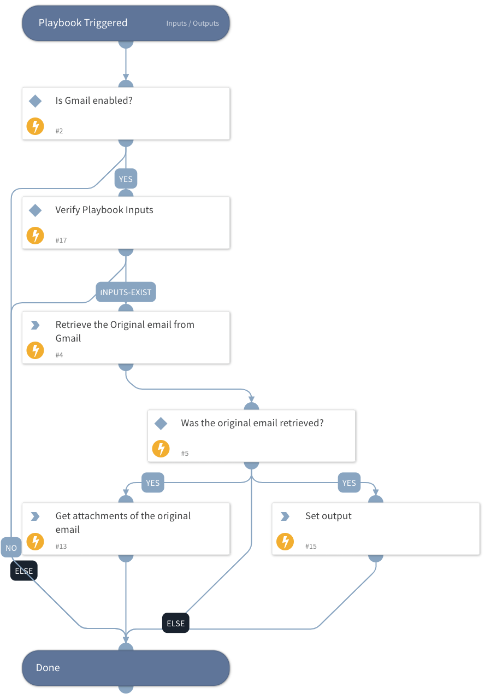

This v2 playbook uses the reporter email headers to retrieve the original email. This decreases the amount of the tasks needed to retrieve the original email.

Use this playbook to retrieve the original email using Gmail integration, including headers and attachments.

You must have the necessary permissions in your Gmail service to execute global search: Google Apps Domain-Wide Delegation of Authority.

## Dependencies
This playbook uses the following sub-playbooks, integrations, and scripts.

### Sub-playbooks
This playbook does not use any sub-playbooks.

### Integrations
* Gmail

### Scripts
* Set
* IsIntegrationAvailable

### Commands
* gmail-search
* gmail-get-attachments

## Playbook Inputs
---

| **Name** | **Description** | **Default Value** | **Required** |
| --- | --- | --- | --- |
| MessageID | The original email message id to retrieve. Holds the value of the "Message-ID" header of the original email and not Gmail's internal ID of the message. |  | Optional |
| UserID | The email address of the user for which to fetch the original email. |  | Optional |

## Playbook Outputs
---

| **Path** | **Description** | **Type** |
| --- | --- | --- |
| Email | The email object. | string |
| Email.To | The recipient of the email. | string |
| Email.From | The sender of the email. | string |
| Email.CC | The CC address of the email. | string |
| Email.BCC | The BCC address of the email. | string |
| Email.HTML | The HTML of the email. | string |
| Email.Body | The text body of the email. | string |
| Email.Headers | The headers of the email. | string |
| Email.Subject | The subject of the email. | string |
| File | The original attachments. | string |

## Playbook Image
---

