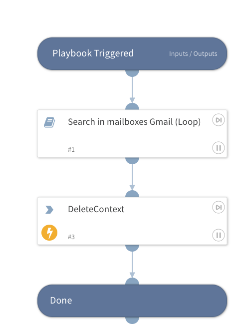

This playbook searches Gmail records for all Google users, designed for large companies with over 500 Google users.

## Dependencies
This playbook uses the following sub-playbooks, integrations, and scripts.

### Sub-playbooks
* Search in mailboxes Gmail (Loop)

### Integrations
* Gmail

### Scripts
* DeleteContext

### Commands
This playbook does not use any commands.

## Playbook Inputs
---
There are no inputs for this playbook.

## Playbook Outputs
---
There are no outputs for this playbook.

## Playbook Image
---
