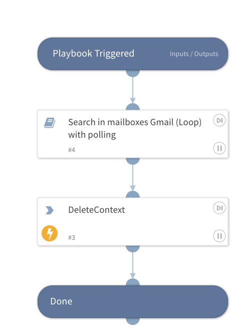

This playbook searches Gmail records for all Google users, designed for large companies with over 2500 Google users.

## Dependencies
This playbook uses the following sub-playbooks, integrations, and scripts.

### Sub-playbooks
* Search in mailboxes Gmail (Loop) with polling

### Integrations
Gmail.

### Scripts
* DeleteContext

### Commands
This playbook does not use any commands.

## Playbook Inputs
---

| **Name** | **Description** | **Default Value** | **Required** |
| --- | --- | --- | --- |
| after | Search for messages sent after a certain time period. For example, 2018/05/06 |  | Optional |
| before | Search for messages sent before a certain time period. For example, 2018/05/09 |  | Optional |
| fields | Enables partial responses to be retrieved in a comma separated list. For more information, see https://developers.google.com/gdata/docs/2.0/basics\#PartialResponse. |  | Optional |
| filename | Attachments with a certain name or file type. For example, "pdf" or "report.pdf" |  | Optional |
| from | Specifies the sender. For example, "john" |  | Optional |
| to | Specifies the receiver. For example, "john" |  | Optional |
| has-attachments | Whether to search for messages sent with attachments. |  | Optional |
| in | Messages in any folder, including Spam and Trash. For example, shopping |  | Optional |
| include-spam-trash | Includes messages from SPAM and TRASH in the results. \(Default: false\) |  | Optional |
| labels-ids | Only returns messages with labels that match all of the specified label IDs in a comma separated list. |  | Optional |
| subject | Words in the subject line. For example, "alert" |  | Optional |
| query | Returns messages matching the specified query. Supports the same query format as the Gmail search box. For example, "from:someuser@example.com rfc822msgid: is:unread". For more syntax information,see "https://support.google.com/mail/answer/7190?hl=en" |  | Optional |

## Playbook Outputs
---

| **Path** | **Description** | **Type** |
| --- | --- | --- |
| Gmail.Mailboxes | The Gmail Mailbox. | unknown |
| Gmail.ID | Inner ID of the Gmail message. | unknown |
| Gmail.ThreadId | The thread ID. | unknown |
| Gmail.Format | MIME type of the email. | unknown |
| Gmail.Labels | Labels of a specific email. | unknown |
| Gmail.To | Email Address of the receiver. | unknown |
| Gmail.From | Email Address of the sender. | unknown |
| Gmail.Cc | Additional recipient email address \(CC\). | unknown |
| Gmail.Bcc | Additional recipient email address \(BCC\). | unknown |
| Gmail.Subject | Subject of the specific email. | unknown |
| Gmail.Body | The content of the email. | unknown |
| Gmail.Attachments | The attachments of the email. IDs are separated by ','. | unknown |
| Gmail.Headers | All headers of specific mail \(list\). | unknown |

## Playbook Image
---
