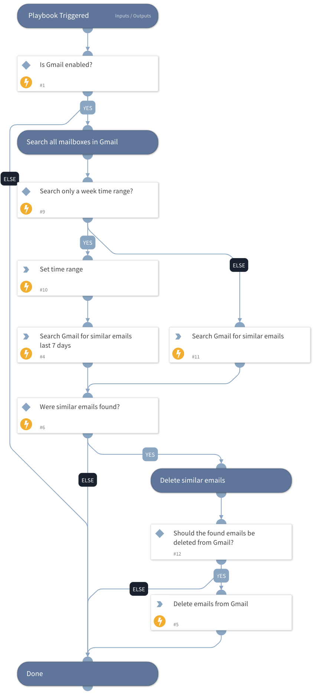

This playbook searches Gmail to identify and delete emails with similar attributes to the malicious email.\
`Note`: Searching through large amount of mailboxes might trigger a 429 error code. You can find more details here: https://developers.google.com/gmail/api/guides/handle-errors#:~:text=A%20429%20%22Too%20many%20requests,per%2Duser%20concurrent%20request%20limit. 

## Dependencies
This playbook uses the following sub-playbooks, integrations, and scripts.

### Sub-playbooks
This playbook does not use any sub-playbooks.

### Integrations
* Gmail

### Scripts
* GetTime
* Set

### Commands
* extractIndicators
* gmail-delete-mail
* gmail-search-all-mailboxes

## Playbook Inputs
---

| **Name** | **Description** | **Default Value** | **Required** |
| --- | --- | --- | --- |
| From | The value of the malicious email's "From" attribute. |  | Optional |
| Subject | The value of the malicious email's "Subject" attribute. |  | Optional |
| AttachmentName | The value of the malicious email's "AttachmentName" attribute. |  | Optional |
| Limit | The maximum number of search results. | 50 | Optional |
| DeleteType | The deletion type \(trash or permanent\). For permanent choose 'True'. | False | Optional |
| SearchThisWeek | Limit the search to the current week \(true/false\). | true | Optional |

## Playbook Outputs
---
There are no outputs for this playbook.

## Playbook Image
---
