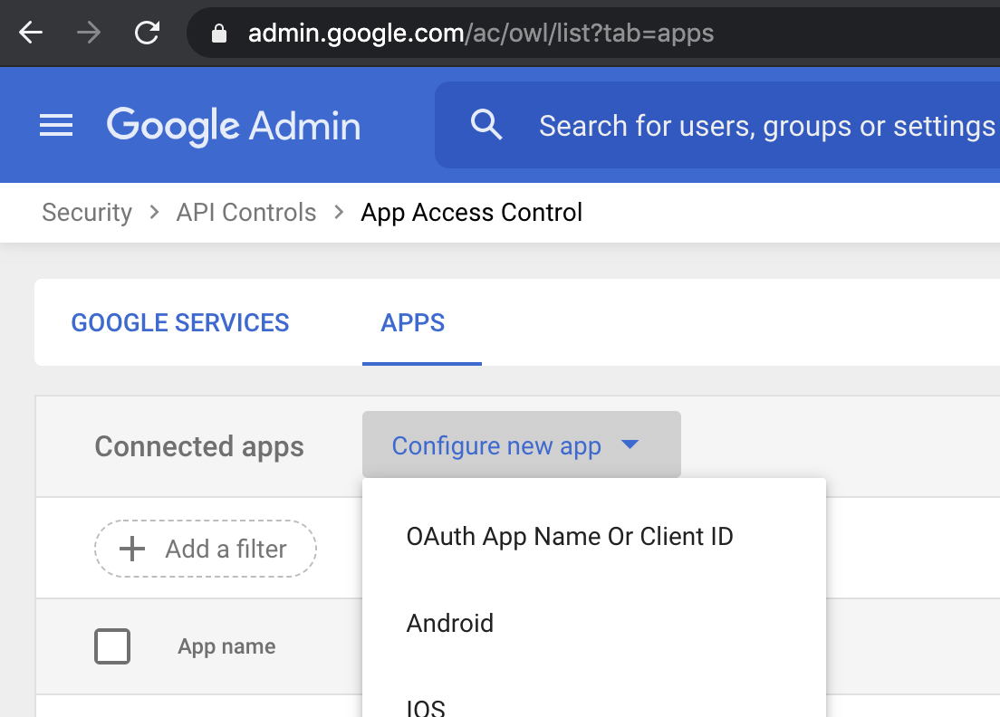
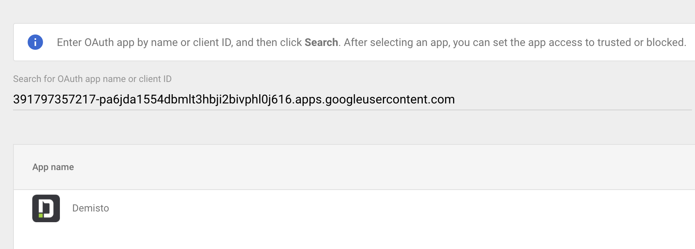
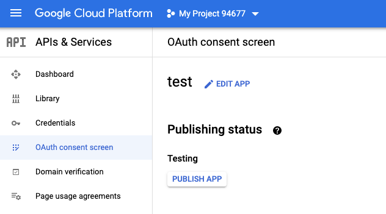
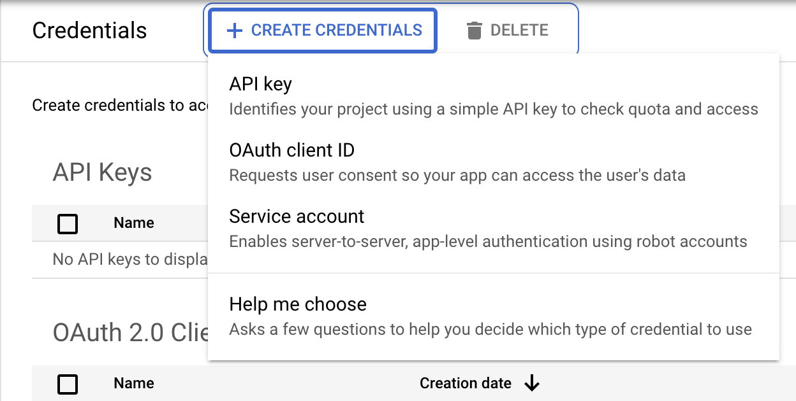
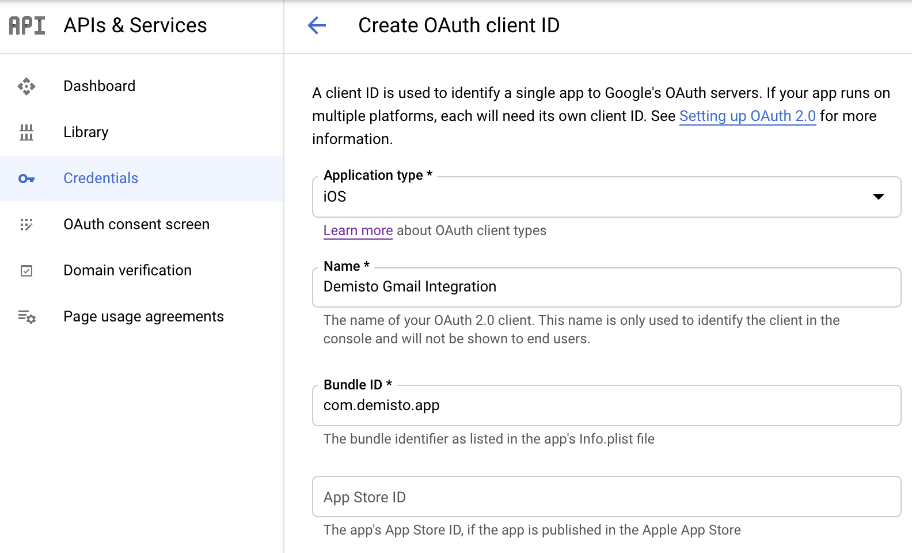

Use the Gmail Single User integration to send emails and fetch emails as incidents to Cortex XSOAR. 

**Note:** Use this integration if you only want to fetch and send emails from a single user's mailbox. If you need to access multiple user mailboxes, use the [GMail Integration](https://xsoar.pan.dev/docs/reference/integrations/gmail).

## Configure Gmail Single User on Cortex XSOAR

1. Navigate to **Settings** > **Integrations** > **Servers & Services**.
2. Search for Gmail Single User.
3. Click **Add instance** to create and configure a new integration instance.
    | **Parameter Name** | **Description** |**Required** |
    | --- | --- | --- |
    | email | Gmail of the user | True |
    | code | Auth Code (run the !gmail-auth-link command to start the auth flow - see the Application Authorization Flow section) | False |
    | client_id | Client ID (Optional: use your own app - see Application Authorization Flow section) | False |
    | incidentType | Incident type | False |
    | isFetch | Fetch incidents | False |
    | fetch_time | First fetch timestamp, in days | False |
    | query | Events query (e.g., "from:example@demisto.com") | False |
    | fetch_limit | Maximum number of emails to pull per fetch. Default is 50.<br/>The maximum number is 200 emails per fetch (even if a higher number is configured). | False | 
    | insecure | Trust any certificate (not secure) | False |
    | proxy | Use system proxy settings | False |

## Application Authorization Flow

* To allow Cortex XSOAR to access Gmail, you need to approve the Demisto App (for GSuite Admins) or create your own app (for all other account types).
* To approve the Demisto app, follow the steps in 'GSuite Admins'.
* To create your own app, follow the steps in 'All Account Types'.
* Once you have the app, follow the steps in 'Authorization Flow In Cortex XSOAR' to configure OAuth 2.0 authorization in Cortex XSOAR.

### GSuite Admins:

**Note**: The Demisto App goes through the Google verification process and is not fully verified. You may receive from Google an "unverified app" warning in the authorization flow.
See [google support](https://support.google.com/a/answer/7281227) for more information.

You can choose to trust the Demisto App so users can configure the app:
1. Go to [App Access Control](https://admin.google.com/ac/owl/list?tab=apps).
2. Choose: `Configure new app` -> `OAuth App Name Or Client ID`. 
  
3. Enter the following Client ID: `391797357217-pa6jda1554dbmlt3hbji2bivphl0j616.apps.googleusercontent.com`
   You see the `Demisto App` in the results page. 
  
4. Select the app and grant the app access as `Trusted`.
5. Add the Demisto app client ID `391797357217-pa6jda1554dbmlt3hbji2bivphl0j616.apps.googleusercontent.com` to the integration configuration.
6. Proceed to 'Authorization Flow In Cortex XSOAR' to configure OAuth 2.0 authorization in Cortex XSOAR.


### All Account Types:

If you are not a GSuite Admin, you must use your own Google app instead of the default Demisto app.
1. Go to the [developers credentials page](https://console.developers.google.com/apis/credentials) (you may need to set up a [new project](https://cloud.google.com/resource-manager/docs/creating-managing-projects) if you haven't already).
2. If needed, configure the [Consent Screen](https://developers.google.com/workspace/guides/configure-oauth-consent). Fill in the Consent Screen information you want to display to your users.
3. Make sure in the consent screen that you publish the app by clicking `Publish App` and confirming.
  
4. In the credentials page choose: `Create Credentials` -> `OAuth client ID`.
  
5. When creating the OAuth client ID, select **iOS** as the type (this type allows apps to work only with a client ID). **iOS** is the type used for all apps which are not Android (including desktop types).
6. Name the app and bundle. You can choose a dummy bundle ID such as `com.demisto.app`.
  
7. Make sure to [enable the Gmail API](https://console.developers.google.com/apis/api/gmail.googleapis.com/overview) if you haven't already.
8. After you create the app, copy the *client id* of the app that you created to the integration configuration.
9. Proceed to 'Authorization Flow In Cortex XSOAR' to configure OAuth 2.0 authorization in Cortex XSOAR.

### Authorization Flow In Cortex XSOAR
1. Create and save an integration instance of the Gmail Single User integration. Do not fill in the *Auth Code* field, this is obtained in the next steps.
2. To obtain the **Auth Code**, run the following command in the playground: ***!gmail-auth-link***. Access the link you receive to authenticate your Gmail account.
3. If you get a message from Google saying that it cannot verify the application, click **proceed** and click enter for the app name to give the app you created permissions to your Google account. Then click **proceed**.
4. Complete the authentication process and copy the received code to the **Auth Code** configuration parameter of the integration instance. 
5. Save the instance.
6. To verify that authentication was configured correctly, run the ***!gmail-auth-test***.

### Fetched Incidents Data
* Incident Name
* Occurred
* Owner
* Type
* Severity
* Email From
* Email Message ID
* Email Subject
* Email To
* Attachment Extension
* Attachment Name
* Email Body
* Email Body Format

## Commands
You can execute these commands from the Cortex XSOAR CLI, as part of an automation, or in a playbook.
After you successfully execute a command, a DBot message appears in the War Room with the command details.

### send-mail
Sends an email using Gmail.

##### Base Command
`send-mail`

##### Input
| **Argument Name** | **Description** | **Required** |
| --- | --- | --- |
| to | The email addresses of the receiver. | Required | 
| body | The content (body) of the email to be sent in plain text. | Optional | 
| subject | The subject of the email to be sent. | Required | 
| attachIDs | A comma-separated list of IDs of War Room entries that contain files, which need be attached to the email. | Optional | 
| cc | The CC additional recipient email address. | Optional | 
| bcc | The BCC additional recipient email address. | Optional | 
| htmlBody | The content (body) of the email to be sent in HTML format. | Optional | 
| replyTo | The email address used to reply to the message. | Optional | 
| attachNames | A comma-separated list of new names for attachments, according to the order they were attached to the email.<br/> For example, to rename the first and third file: attachNames=new_fileName1,,new_fileName3<br/>To rename the second and fifth files: attachNames=,new_fileName2,,,new_fileNam | Optional | 
| attachCIDs | A comma-separated list of CID images to embed attachments in the email. | Optional | 
| transientFile | The text name for an attached file. Multiple files are supported as a comma-separated list. For example, transientFile="t1.txt,temp.txt,t3.txt" transientFileContent="test 2,temporary file content,third file content" transientFileCID="t1.txt@xxx.yyy,t2.txt@xxx.zzz". | Optional | 
| transientFileContent | The content for the attached file. Multiple files are supported as a comma-separated list. For example, transientFile="t1.txt,temp.txt,t3.txt" transientFileContent="test 2,temporary file content,third file content" transientFileCID="t1.txt@xxx.yyy,t2.txt@xxx.zzz". | Optional | 
| transientFileCID | The CID image for an attached file to include within the email body. Multiple files are supported as comma-separated list. For example, transientFile="t1.txt,temp.txt,t3.txt" transientFileContent="test 2,temporary file content,third file content" transientFileCID="t1.txt@xxx.yyy,t2.txt@xxx.zzz". | Optional | 
| additionalHeader | A comma-separated list of additional headers in the format headerName=headerValue. For example, "headerName1=headerValue1,headerName2=headerValue2". | Optional | 
| templateParams | 'Replaces {varname} variables with values from this parameter. Expected values are in the form of a JSON document. For example, {"varname" :{"value" "some  value", "key": "context key"}}. Each var name can either be provided with  the value or a context key to retrieve the value. Note that only context data is accessible for this argument, while incident fields are not.' | Optional | 


##### Context Output

| **Path** | **Type** | **Description** |
| --- | --- | --- |
| Gmail.SentMail.ID | String | The immutable ID of the message. | 
| Gmail.SentMail.Labels | String | A list of label IDs applied to this message. | 
| Gmail.SentMail.ThreadId | String | The ID of the thread in which the message belongs. | 
| Gmail.SentMail.To | String | The email recipient. | 
| Gmail.SentMail.From | String | The email sender. | 
| Gmail.SentMail.Cc | String | The additional CC recipient email address. | 
| Gmail.SentMail.Bcc | String | The additional BCC recipient email address. | 
| Gmail.SentMail.Subject | String | The email subject. | 
| Gmail.SentMail.Body | String | The plain-text version of the email. | 
| Gmail.SentMail.MailBox | String | The mailbox from which the mail was sent. | 
| Gmail.SentMail.BodyHTML | String | The HTML version of the email. |


##### Command Example
```!send-mail subject="this is the subject" to=test@demistodev.com body="this is the body"```
##### Context Example
```
{
    "Gmail.SentMail": [
 {
     "Body": "this is the body", 
     "From": "example@demisto.com", 
     "Cc": null, 
     "Labels": [
  "SENT"
     ], 
     "Bcc": null, 
     "To": "test@demistodev.com", 
     "ThreadId": "16f662789d3a2972", 
     "Mailbox": "test@demistodev.com", 
     "Type": "Gmail", 
     "ID": "16f662789d3a2972", 
     "Subject": "this is the subject"
 }
    ]
}
```
##### Human Readable Output
> ### Email sent:
> |Type|ID|To|From|Subject|Body|Labels|ThreadId|
> |---|---|---|---|---|---|---|---|
> | Gmail | 16f662789d3a2972 | test@demistodev.com | example@demisto.com | this is the subject | this is the body | SENT |  16f662789d3a2972 |

### gmail-auth-link
***
Starts the OAuth2 process. Gets a link to use to authenticate to Gmail.


#### Base Command
`gmail-auth-link`

#### Input
There is no input for this command.

#### Context Output
There is no context output for this command.

#### Command Example
```!gmail-auth-link```

#### Human Readable Output
## Gmail Auth Link
Please follow the following **link**.
After Completing the authentication process, copy the received code
to the **Auth Code** configuration parameter of the integration instance.
Save the integration instance and then run *!gmail-auth-test* to test that
the authentication is properly set.
    

### gmail-auth-test
***
Tests that Gmail auth is configured properly. Use this command after completing the OAuth2 authentication process.


#### Base Command
`gmail-auth-test`

#### Input
There is no input for this command.

#### Context Output
There is no context output for this command.

#### Command Example
```!gmail-auth-test```

#### Human Readable Output
Authentication test completed successfully.
