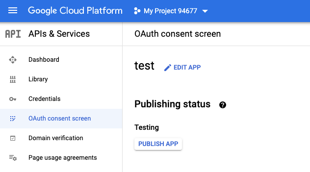
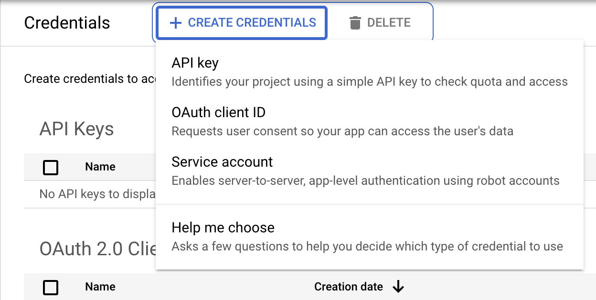
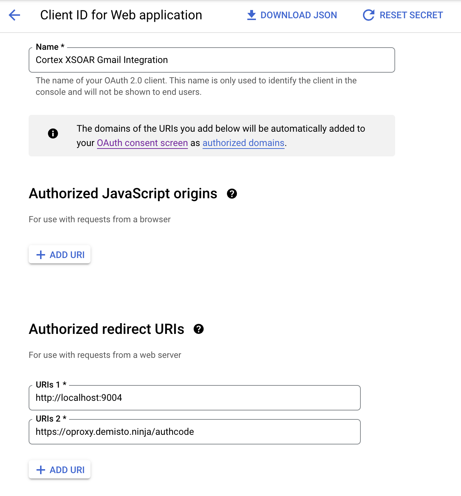
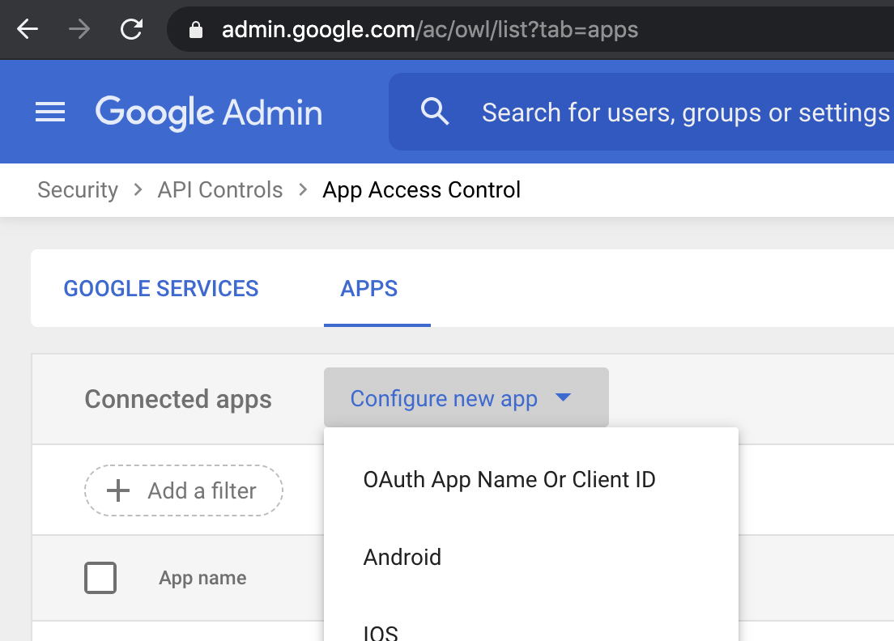
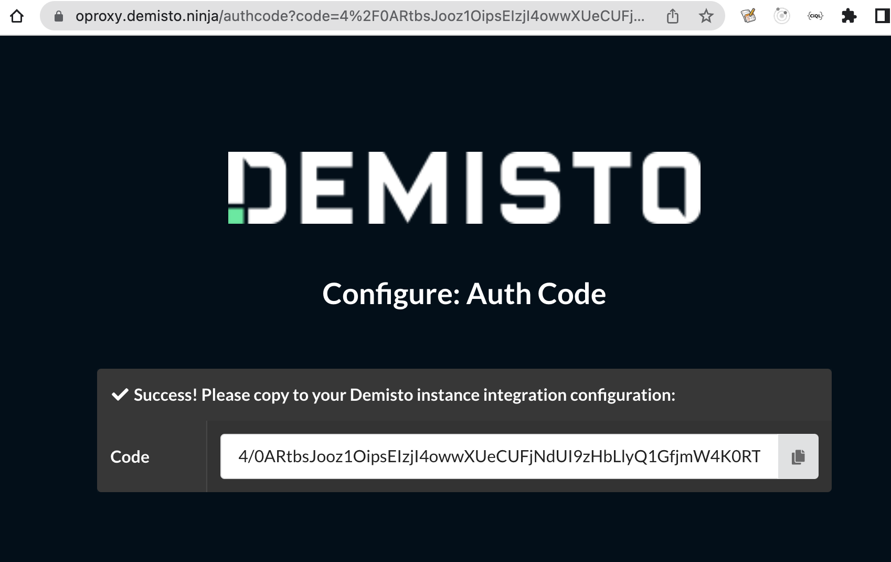
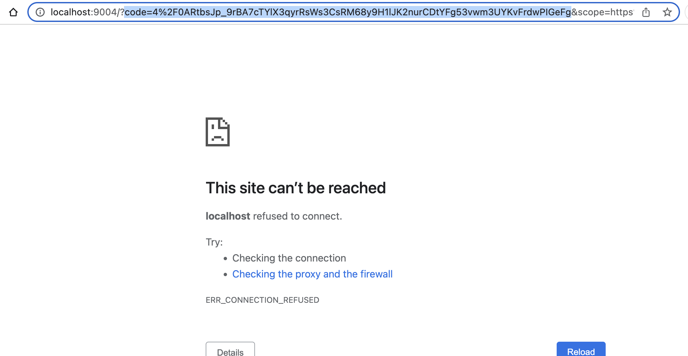

Use the Gmail Single User integration to send emails and fetch emails as incidents to Cortex XSOAR. 

**Note:** Use this integration if you only want to fetch and send emails from a single user's mailbox. If you need to access multiple user mailboxes, use the [GMail Integration](https://xsoar.pan.dev/docs/reference/integrations/gmail).

## Configure Gmail Single User on Cortex XSOAR

1. Navigate to **Settings** > **Integrations** > **Servers & Services**.
2. Search for Gmail Single User.
3. Click **Add instance** to create and configure a new integration instance.

| **Parameter Name** | **Description**                                                                                                                                    | **Required** |
|--------------------|----------------------------------------------------------------------------------------------------------------------------------------------------|--------------|
| email              | Gmail of the user                                                                                                                                  | True         |
| send_as              | Allows you to specify the e-mail address from which to send e-mails from                                                                                                                                  | False         |
| code               | Auth Code (run the !gmail-auth-link command to start the auth flow - see the Application Authorization Flow section)                               | False        |
| client_id          | Client ID (see Application Authorization Flow section)                                                                | True        |
| client_secret          | Client Secret (see Application Authorization Flow section)                                                                | True        |
| redirect_uri          | Auth Redirect URI (see Application Authorization Flow section)                                                                | True        |
| isFetch            | Fetch incidents                                                                                                                                    | False        |
| fetch_time         | First fetch timestamp, in days                                                                                                                     | False        |
| query              | Events query (e.g., "from:example@demisto.com")                                                                                                    | False        |
| fetch_limit        | Maximum number of emails to pull per fetch. Default is 50.<br/>The maximum number is 200 emails per fetch (even if a higher number is configured). | False        | 
| insecure           | Trust any certificate (not secure)                                                                                                                 | False        |
| proxy              | Use system proxy settings                                                                                                                          | False        |

## Application Authorization Flow

* To allow Cortex XSOAR to access Gmail, you will need create your own OAuth2 app.
* Once you have the app, follow the steps in [Authorization Flow In Cortex XSOAR](#authorization-flow-in-cortex-xsoar) to configure the OAuth 2.0 authorization.

### Create Your OAuth2 App

To use the GMail Single User integration, you will need to create your own OAuth2 Google app.
1. Go to the [developers credentials page](https://console.developers.google.com/apis/credentials) (you may need to set up a [new project](https://cloud.google.com/resource-manager/docs/creating-managing-projects) if you haven't already).
2. If needed, configure the [Consent Screen](https://developers.google.com/workspace/guides/configure-oauth-consent). Fill in the Consent Screen information you want to display to your users.
3. Make sure in the consent screen that you publish the app by clicking `Publish App` and confirming.
  
4. In the credentials page choose: `Create Credentials` -> `OAuth client ID`.
  
5. When creating the OAuth client ID, select **Web application** as the application type.
6. Name the credential. For example: `Cortex XSOAR GMail Integration`.
7. Add an **Authorized redirect URIs**: `https://oproxy.demisto.ninja/authcode`. The `oproxy` url is a client side only web page which provides an easy interface to copy the obtained auth code from the authorization respone to the integration configuration in the authorization flow steps. Optionally: if you don't want to use the `oproxy` url, you may use a `localhost` url on a port which is not used locally on your machine. For example: `http://localhost:9004`. You will then need to copy the code from the url address bar in the response (see [Authorization Flow In Cortex XSOAR](#authorization-flow-in-cortex-xsoar)).  
   
7. Make sure to [enable the Gmail API](https://console.developers.google.com/apis/api/gmail.googleapis.com/overview) if you haven't already.
8. After you create the app, copy the *client id* and *client secret* of the app that you created to the integration configuration. If you want to use a `localhost` redirect URI, copy the chosen auth redirect URI to the integration configuration.
9. Proceed to [Authorization Flow In Cortex XSOAR](#authorization-flow-in-cortex-xsoar) to configure OAuth 2.0 authorization in Cortex XSOAR.
### *Deprecated*: Use the Demisto App for GSuite Admins (OOB Authorization) 

**Note**: This is an old method of authentication which was provided for GSuite Admins via the use of the Demisto App. This method uses the OOB authentication flow which has been deprecated by Google. This method of authentication will stop working on Jan 31, 2023. Instructions are provided here for backwards compatibility until the official end of life of OOB authentication. All customers must migrate to the web app authorization flow using their own Google App as documented at [Create Your OAuth2 App](#create-your-oauth2-app). For further details See:

* https://developers.google.com/identity/protocols/oauth2/resources/oob-migration
* https://developers.googleblog.com/2022/02/making-oauth-flows-safer.html

To configure the use of the Demisto App for GSuite Admins there is no need to create your own app (you will be using the predefined Demisto App). Thus, there is no need to fill in the Client ID and Client Secret configuration fields.

GSuite Admins can choose to trust the Demisto App so users can configure the app:
1. Go to [App Access Control](https://admin.google.com/ac/owl/list?tab=apps).
2. Choose: `Configure new app` -> `OAuth App Name Or Client ID`. 
  
3. Enter the following Client ID: `391797357217-pa6jda1554dbmlt3hbji2bivphl0j616.apps.googleusercontent.com`
   You see the `Demisto App` in the results page. 
  
4. Select the app and grant the app access as `Trusted`.
5. Add the Demisto app client ID `391797357217-pa6jda1554dbmlt3hbji2bivphl0j616.apps.googleusercontent.com` to the integration configuration.
6. Proceed to 'Authorization Flow In Cortex XSOAR' to configure OAuth 2.0 authorization in Cortex XSOAR.


### Authorization Flow In Cortex XSOAR
1. Create and save an integration instance of the Gmail Single User integration. Do not fill in the *Auth Code* field, this is obtained in the next steps.
2. To obtain the **Auth Code**, run the following command in the playground: ***!gmail-auth-link***. Access the link you receive to authenticate your Gmail account.
3. If you get a message from Google saying that it cannot verify the application, click **proceed** and click enter for the app name to give the app you created permissions to your Google account. Then click **proceed**.
4. Complete the authentication process. 
5. If using the `oproxy` redirect URI, you will be redirected to a page which will provide an option to copy the auth code. Note that this page processes the code fully in the browser (client side) and displays it to be copied. The code is not transmitted to the oproxy web server. Example screenshot:
    
    If you are using the `localhost` redirect URI, you will be redirected to an unavailable page. Copy the code, including the `code=` prefix up to the first `&` from the URL address bar. Example screenshot:
     
6. Copy the received code to the **Auth Code** configuration parameter of the integration instance. 
7. Save the instance.
8. To verify that authentication was configured correctly, run the ***!gmail-auth-test***.

## Fetched Incidents Data
* Incident Name
* Occurred
* Owner
* Type
* Severity
* Email From
* Email Message ID
* Email Subject
* Email To
* Attachment Extension
* Attachment Name
* Email Body
* Email Body Format

## Commands
You can execute these commands from the Cortex XSOAR CLI, as part of an automation, or in a playbook.
After you successfully execute a command, a DBot message appears in the War Room with the command details.

### send-mail
Sends an email using Gmail.

##### Base Command
`send-mail`

##### Input
| **Argument Name** | **Description** | **Required** |
| --- | --- | --- |
| to | The email addresses of the receiver. | Required | 
| body | The content (body) of the email to be sent in plain text. | Optional | 
| subject | The subject of the email to be sent. | Required | 
| attachIDs | A comma-separated list of IDs of War Room entries that contain files, which need be attached to the email. | Optional | 
| cc | The CC additional recipient email address. | Optional | 
| bcc | The BCC additional recipient email address. | Optional | 
| htmlBody | The content (body) of the email to be sent in HTML format. | Optional | 
| replyTo | The email address used to reply to the message. | Optional | 
| attachNames | A comma-separated list of new names for attachments, according to the order they were attached to the email.<br/> For example, to rename the first and third file: attachNames=new_fileName1,,new_fileName3<br/>To rename the second and fifth files: attachNames=,new_fileName2,,,new_fileNam | Optional | 
| attachCIDs | A comma-separated list of CID images to embed attachments in the email. | Optional | 
| transientFile | The text name for an attached file. Multiple files are supported as a comma-separated list. For example, transientFile="t1.txt,temp.txt,t3.txt" transientFileContent="test 2,temporary file content,third file content" transientFileCID="t1.txt@xxx.yyy,t2.txt@xxx.zzz". | Optional | 
| transientFileContent | The content for the attached file. Multiple files are supported as a comma-separated list. For example, transientFile="t1.txt,temp.txt,t3.txt" transientFileContent="test 2,temporary file content,third file content" transientFileCID="t1.txt@xxx.yyy,t2.txt@xxx.zzz". | Optional | 
| transientFileCID | The CID image for an attached file to include within the email body. Multiple files are supported as comma-separated list. For example, transientFile="t1.txt,temp.txt,t3.txt" transientFileContent="test 2,temporary file content,third file content" transientFileCID="t1.txt@xxx.yyy,t2.txt@xxx.zzz". | Optional | 
| additionalHeader | A comma-separated list of additional headers in the format headerName=headerValue. For example, "headerName1=headerValue1,headerName2=headerValue2". | Optional | 
| templateParams | 'Replaces {varname} variables with values from this parameter. Expected values are in the form of a JSON document. For example, {"varname" :{"value" "some  value", "key": "context key"}}. Each var name can either be provided with  the value or a context key to retrieve the value. Note that only context data is accessible for this argument, while incident fields are not.' | Optional | 


##### Context Output

| **Path** | **Type** | **Description** |
| --- | --- | --- |
| Gmail.SentMail.ID | String | The immutable ID of the message. | 
| Gmail.SentMail.Labels | String | A list of label IDs applied to this message. | 
| Gmail.SentMail.ThreadId | String | The ID of the thread in which the message belongs. | 
| Gmail.SentMail.To | String | The email recipient. | 
| Gmail.SentMail.From | String | The email sender. | 
| Gmail.SentMail.Cc | String | The additional CC recipient email address. | 
| Gmail.SentMail.Bcc | String | The additional BCC recipient email address. | 
| Gmail.SentMail.Subject | String | The email subject. | 
| Gmail.SentMail.Body | String | The plain-text version of the email. | 
| Gmail.SentMail.MailBox | String | The mailbox from which the mail was sent. | 
| Gmail.SentMail.BodyHTML | String | The HTML version of the email. |


##### Command Example
```!send-mail subject="this is the subject" to=test@demistodev.com body="this is the body"```
##### Context Example
```
{
    "Gmail.SentMail": [
 {
     "Body": "this is the body", 
     "From": "example@demisto.com", 
     "Cc": null, 
     "Labels": [
  "SENT"
     ], 
     "Bcc": null, 
     "To": "test@demistodev.com", 
     "ThreadId": "16f662789d3a2972", 
     "Mailbox": "test@demistodev.com", 
     "Type": "Gmail", 
     "ID": "16f662789d3a2972", 
     "Subject": "this is the subject"
 }
    ]
}
```
##### Human Readable Output
> ### Email sent:
> |Type|ID|To|From|Subject|Body|Labels|ThreadId|
> |---|---|---|---|---|---|---|---|
> | Gmail | 16f662789d3a2972 | test@demistodev.com | example@demisto.com | this is the subject | this is the body | SENT |  16f662789d3a2972 |

### gmail-auth-link
***
Starts the OAuth2 process. Gets a link to use to authenticate to Gmail.


#### Base Command
`gmail-auth-link`

#### Input
There is no input for this command.

#### Context Output
There is no context output for this command.

#### Command Example
```!gmail-auth-link```

#### Human Readable Output
## Gmail Auth Link
Please follow the following **link**.
After Completing the authentication process, copy the received code
to the **Auth Code** configuration parameter of the integration instance.
Save the integration instance and then run *!gmail-auth-test* to test that
the authentication is properly set.
    

### gmail-auth-test
***
Tests that Gmail auth is configured properly. Use this command after completing the OAuth2 authentication process.


#### Base Command
`gmail-auth-test`

#### Input
There is no input for this command.

#### Context Output
There is no context output for this command.

#### Command Example
```!gmail-auth-test```

#### Human Readable Output
Authentication test completed successfully.

### reply-mail
***
Replies to a mail using Gmail.

#### Limitations:

The *subject* argument should be the same as the subject of the email you are replying to in order for the reply to be a part of the same conversation.

#### Base Command

`reply-mail`
#### Input

| **Argument Name** | **Description** | **Required** |
| --- | --- | --- |
| to | Email addresses of the recipients. | Required | 
| from | Email address of the sender. | Optional | 
| body | The contents (body) of the email to be sent in plain text. | Optional | 
| subject | Subject of the email to be sent. <br/> Should be the same as the subject of the email you are replying to in order for the reply to be a part of the same conversation. | Required | 
| inReplyTo | A comma-separated list of message IDs to reply to. | Required | 
| references | A comma-separated list of message IDs to refer to. | Optional | 
| attachIDs | A comma-separated list of IDs of War Room entries that contain the files that need be attached to the email. | Optional | 
| cc | Additional recipient email addresses (CC). | Optional | 
| bcc | Additional recipient email addresses (BCC). | Optional | 
| htmlBody | The contents (body) of the email to be sent in HTML format. | Optional | 
| replyTo | Address that needs to be used to reply to the message. | Optional | 
| attachNames | A comma-separated list of new names to rename attachments corresponding to the order in which they were attached to the email.<br/>        Examples - To rename first and third file attachNames=new_fileName1,,new_fileName3<br/>        To rename second and fifth files attachNames=,new_fileName2,,,new_fileName5 | Optional | 
| attachCIDs | A comma-separated list of CID images to embed attachments inside the email. | Optional | 
| transientFile | Textual name for an attached file. Multiple files are supported as a<br/>        comma-separated list. For example, transientFile="t1.txt,temp.txt,t3.txt" transientFileContent="test<br/>        2,temporary file content,third file content" transientFileCID="t1.txt@xxx.yyy,t2.txt@xxx.zzz" | Optional | 
| transientFileContent | Content for the attached file. Multiple files are supported as a comma-separated<br/>        list. For example, transientFile="t1.txt,temp.txt,t3.txt" transientFileContent="test<br/>        2,temporary file content,third file content" transientFileCID="t1.txt@xxx.yyy,t2.txt@xxx.zzz" | Optional | 
| transientFileCID | CID image for an attached file to include within the email body. Multiple files are<br/>        supported as comma-separated list. For example, transientFile="t1.txt,temp.txt,t3.txt"<br/>        transientFileContent="test 2,temporary file content,third file content" transientFileCID="t1.txt@xxx.yyy,t2.txt@xxx.zzz" | Optional | 
| additionalHeader | A comma-separated list of additional headers in the format: headerName=headerValue. For example: "headerName1=headerValue1,headerName2=headerValue2". | Optional | 
| templateParams | 'Replaces {varname} variables with values from this parameter. Expected<br/>       values are in the form of a JSON document. For example, {"varname" :{"value" "some<br/>       value", "key": "context key"}}. Each var name can either be provided with<br/>       the value or a context key to retrieve the value.<br/> Note that only context data is accessible for this argument, while incident fields are not.' | Optional | 


#### Context Output

| **Path** | **Type** | **Description** |
| --- | --- | --- |
| Gmail.SentMail.ID | String | The immutable ID of the message. | 
| Gmail.SentMail.Labels | String | List of IDs of the labels applied to this message. | 
| Gmail.SentMail.ThreadId | String | The ID of the thread in which the message belongs. | 
| Gmail.SentMail.To | String | The recipients of the email. | 
| Gmail.SentMail.From | Unknown | The sender of the email. | 
| Gmail.SentMail.Cc | String | Additional recipient email addresses \(CC\). | 
| Gmail.SentMail.Bcc | String | Additional recipient email addresses \(BCC\). | 
| Gmail.SentMail.Subject | String | The subject of the email. | 
| Gmail.SentMail.Body | Unknown | The plain-text version of the email. | 
| Gmail.SentMail.MailBox | String | The mailbox from which the mail was sent. | 


#### Command Example
``` !reply-mail subject="this is the subject" to=test@demistodev.com replyTo=test@demistodev.com body="this is the body" inReplyTo=<CAEvnzx+zEeFJ1U5g4FOfHKeWe-H3hU7kGiKaK7q0F0A@mail.gmail.com> references=<CAEvnzx+zEeFJ1U5g4FOfHKeWe-H3hU7kGiKaK7q0F0A@mail.gmail.com>```

#### Context Example
```
{
    "Gmail.SentMail": [
        {
            "Bcc": null,
            "Body": "this is the body",
            "Cc": null,
            "From": "admin@demistodev.com",
            "ID": "16d43287fc29b71a",
            "Labels": [
                "SENT"
            ],
            "Mailbox": "test@demistodev.com",
            "Subject": "this is the subject",
            "ThreadId": "16d43287fc29b71a",
            "To": "test@demistodev.com",
            "Type": "Gmail"
        }
    ]
}
```

#### Human Readable Output
>### Email sent:
>|Type|ID|To|From|Subject|Body|Labels|ThreadId|
>|---|---|---|---|---|---|---|---|
>| Gmail | 16d43287fc29b71a | test@demistodev.com | admin@demistodev.com | this is the subject |this is the body | SENT | 16d43287fc29b71a |

### gmail-get-attachments
***
Retrieves attachments from a sent Gmail message.


#### Base Command

`gmail-get-attachments`
#### Input

| **Argument Name** | **Description** | **Required** |
| --- | --- | --- |
| message-id | The ID of the message to retrieve. | Required | 
| user-id | The user's email address. The "me" special value can be used to indicate the authenticated user. | Required | 


#### Command Example
```!gmail-get-attachments message-id=16d4316a25a332e4 user-id=admin@demistodev.com```


