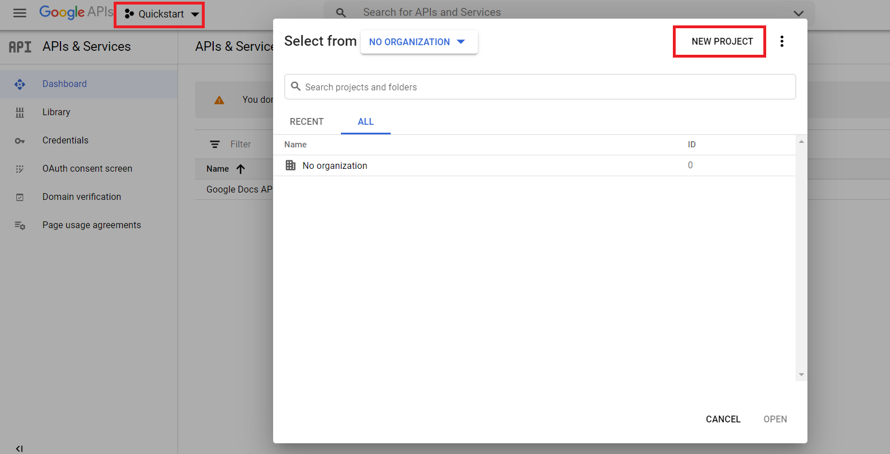
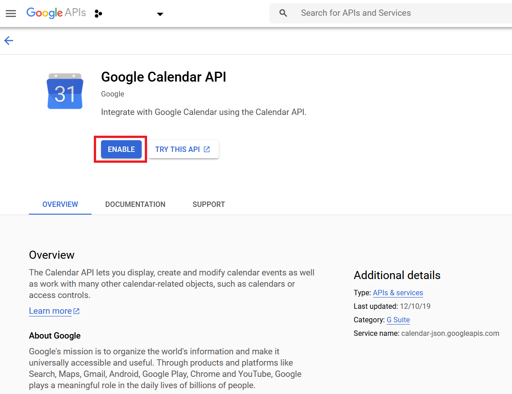
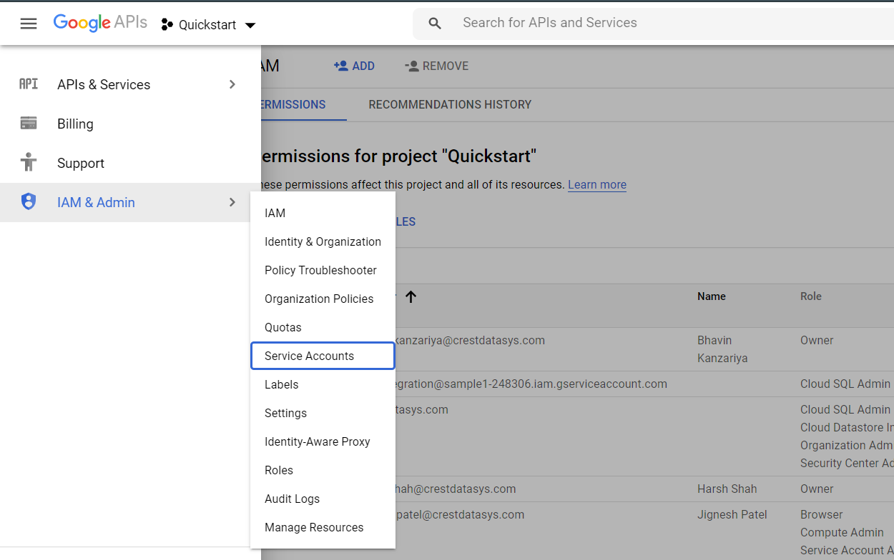
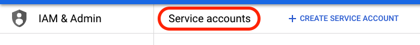
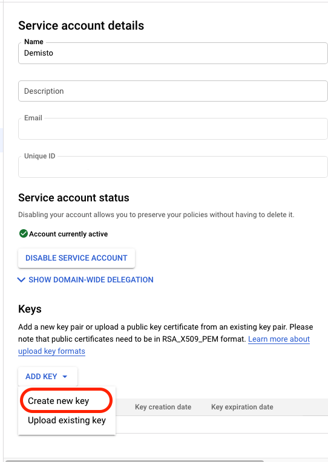

Google Calendar is a time-management and scheduling calendar service developed by Google. This integration helps you to perform various tasks on the access control list (ACL). This integration was integrated and tested with G Suite Basic edition.

## Configure Service Account for Google Calendar

1. Go to [https://console.developers.google.com](https://console.developers.google.com).

2. Select or create a project:

    


3. Enable the Google Calendar API:
    
    1. Under the main menu, select **APIs & Services > Libary**:
        
    
    2. Enable *Google Calendar API*:
        
    
    3. Select the project and click **OPEN**:
            

4. Create a service account with the correct restricted permissions:

    1. Under the main menu, select **IAM & Admin > Service Accounts**:
        
    
    2. In the top bar, select **CREATE SERVICE ACCOUNT**:
        
    
    3. Under the main menu, select **IAM & Admin > Service Accounts** and open the account you just created.
    
    4. Generate new credentials:
        1. On the Service account details page, under Keys, click **ADD KEY** and select **Create new key**:
            
        
        2. Under Key type, select **JSON**, and click **CREATE**. Save the credentials in a secure location. You will need the generated ``credentials.json`` file when you configure the instance in Cortex XSOAR:
               


## Add Scopes in G Suite Admin

1. Go to [https://admin.google.com](https://admin.google.com)

2. Click **Menu** and select **Security > API Controls**:
    

3. Under the **Domain wide delegation** tab, click **MANAGE DOMAIN WIDE DELEGATION**:
    

4. Click  **Add new** and enter the Client ID from your *credentials.json* file and required scopes from the integration tips.
               

5. Click **AUTHORIZE**.


## Configure Google Calendar in Cortex


| **Parameter** | **Description** | **Required** |
| --- | --- | --- |
| user_service_account_json | User's Service Account JSON | True |
| insecure | Trust any certificate \(not secure\) | False |
| proxy | Use system proxy settings | False |


### google-calendar-acl-add
***
Creates an access control rule.


#### Base Command

`google-calendar-acl-add`
#### Input

| **Argument Name** | **Description** | **Required** |
| --- | --- | --- |
| calendar_id | Identifier of the calendar. If you want to access the primary calendar of the currently logged in user, use the "primary" keyword. | Required | 
| user_id | The user's primary email address. | Optional | 
| role | The role assigned to the scope.<br/><br/>Available Options:<br/>"none" - Provides no access.<br/><br/>"freeBusyReader" - Provides read access to free/busy information.<br/><br/>"reader" - Provides read access to the calendar. Private events will appear to users with reader access, but event details will be hidden.<br/><br/>"writer" - Provides read and write access to the calendar. Private events will appear to users with writer access, and event details will be visible.<br/><br/>"owner" - Provides ownership of the calendar. This role has all of the permissions of the writer role with the additional ability to see and manipulate ACLs. | Required | 
| scope_type | The type of the scope.<br/><br/>Available Options:<br/>"default" - The public scope. This is the default value.<br/><br/>"user" - Limits the scope to a single user.<br/><br/>"group" - Limits the scope to a group.<br/><br/>"domain" - Limits the scope to a domain.<br/><br/>Note: The permissions granted to the "default", or public scope, apply to any user, authenticated or not. | Required | 
| scope_value | The email address of a user or group, or the name of a domain, depending on the scope type. Omitted for type "default". | Optional | 
| send_notifications | Whether to send notifications about the calendar sharing change. Default is "true". | Optional | 


#### Context Output

| **Path** | **Type** | **Description** |
| --- | --- | --- |
| GoogleCalendar.Acl.calendarId | String | Calendar identifier. | 
| GoogleCalendar.Acl.userId | String | User's email address. |
| GoogleCalendar.Acl.id | String | Identifier of the ACL rule. | 
| GoogleCalendar.Acl.kind | String | Type of the resource. | 
| GoogleCalendar.Acl.etag | String | ETag of the resource. | 
| GoogleCalendar.Acl.scopeType | String | The type of the scope. | 
| GoogleCalendar.Acl.scopeValue | String | The email address of a user or group, or the name of a domain, depending on the scope type. | 
| GoogleCalendar.Acl.role | String | The role assigned to the scope. | 


#### Command Example
```!google-calendar-acl-add calendar_id=calenderId role=freeBusyReader scope_type=user scope_value=useracl@domain.com user_id=user1@domain.com```


#### Context Example
```
{
    "GoogleCalendar": {
        "Acl": {
            "calendarId": "calenderId",
            "userId": "user1@domain.com"
            "etag": "\"00001600760672577000\"",
            "id": "user:useracl@domain.com",
            "kind": "calendar#aclRule",
            "role": "freeBusyReader",
            "scopeType": "user",
            "scopeValue": "useracl@domain.com"
        }
    }
}
```

#### Human Readable Output

>### Giving an access control rule for calendar id "calenderId".
>|Id|Role|Scope Type|Scope Value|
>|---|---|---|---|
>| user:useracl@domain.com | freeBusyReader | user | useracl@domain.com |


### google-calendar-acl-list
***
Returns the rules in the access control list for the calendar.


#### Base Command

`google-calendar-acl-list`
#### Input

| **Argument Name** | **Description** | **Required** |
| --- | --- | --- |
| calendar_id | Calendar identifier. If you want to access the primary calendar of the currently logged in user, use the "primary" keyword. | Required | 
| user_id | The user's primary email address. | Optional | 
| max_results | Maximum number of entries returned on a result page. Default is 100. The page size cannot be greater than 250 entries. | Optional | 
| page_token | Token specifying which result page to return. | Optional | 
| show_deleted | Whether to include deleted ACLs in the result. Deleted ACLs are represented by role "none". Deleted ACLs will always be included if syncToken is provided. Default is "false". | Optional | 
| sync_token | Token obtained from the nextSyncToken field returned on the last page of results from the previous list request. The result of this list request contains only entries that have changed since then. All entries deleted since the previous list request will always be in the result set and it is not allowed to set showDeleted to false.<br/>If the syncToken expires, the server will respond with a 410 GONE response code and the client should clear its storage and perform a full synchronization without any syncToken.<br/> | Optional | 


#### Context Output

| **Path** | **Type** | **Description** |
| --- | --- | --- |
| GoogleCalendar.Acl.calendarId | String | Calendar identifier. | 
| GoogleCalendar.Acl.userId | String | User's email address. |
| GoogleCalendar.Acl.id | String | Identifier of the ACL rule. | 
| GoogleCalendar.Acl.kind | String | Type of the resource. | 
| GoogleCalendar.Acl.etag | String | ETag of the resource. | 
| GoogleCalendar.Acl.scopeType | String | The type of the scope. | 
| GoogleCalendar.Acl.scopeValue | String | The email address of a user or group, or the name of a domain, depending on the scope type. | 
| GoogleCalendar.Acl.role | String | The role assigned to the scope. | 
| GoogleCalendar.PageToken.Acl.calendarId | String | Calendar identifier. | 
| GoogleCalendar.PageToken.Acl.userId | String | User's email address. |
| GoogleCalendar.PageToken.Acl.nextPageToken | String | Token used to access the next page of this result. | 
| GoogleCalendar.PageToken.Acl.nextSyncToken | String | Token used at a later point in time to retrieve only the entries that have changed since this result was returned. | 


#### Command Example
```!google-calendar-acl-list calendar_id=calenderID user_id=user1@domain.com max_results=2```

#### Context Example
```
{
    "GoogleCalendar": {
        "Acl": [
            {
                "calendarId": "calenderID",
                "userId": "user1@domain.com",
                "etag": "\"00000000000000000000\"",
                "id": "user:user1@domain.com",
                "kind": "calendar#aclRule",
                "role": "owner",
                "scopeType": "user",
                "scopeValue": "user1@domain.com"
            },
            {
                "calendarId": "calenderID",
                "userId": "user1@domain.com",
                "etag": "\"00001598621012848000\"",
                "id": "user:user2@domain.com",
                "kind": "calendar#aclRule",
                "role": "reader",
                "scopeType": "user",
                "scopeValue": "user2@domain.com"
            }
        ],
        "PageToken": {
            "Acl": {
                "calendarId": "calenderID",
                "userId": "user1@domain.com"
                "nextPageToken": "EKiDnZGM_OsCGAAgADIkCgwI1Iqk-gUQgOitlAMSFCoSeHh4eEBuaW1ibGVkYXRhLmlv"
            }
        }
    }
}
```

#### Human Readable Output

>### Next Page Token: EKiDnZGM_OsCGAAgADIkCgwI1Iqk-gUQgOitlAMSFCoSeHh4eEBuaW1ibGVkYXRhLmlv
>### Total Retrieved ACL: 2
>|Id|Role|Scope Type|Scope Value|
>|---|---|---|---|
>| user:user1@domain.com | owner | user | user1@domain.com |
>| user:user2@domain.com | reader | user | user2@domain.com |

