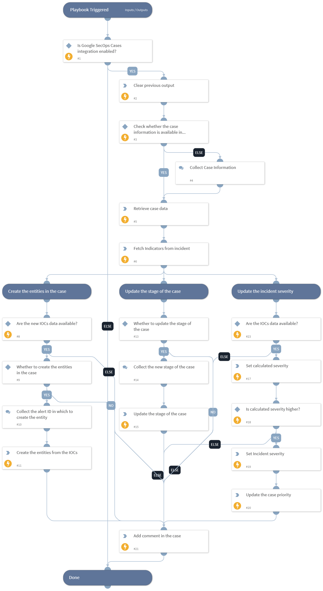

This playbook investigates a Google SecOps case by retrieving the latest case information, related alerts, and their entities, and updating the case stage. It also calculates severity from IOC scores, updates the incident and case priority accordingly, creates entities in the case from the identified IOCs, and posts a summary comment on the case.

## Dependencies

This playbook uses the following sub-playbooks, integrations, and scripts.

### Sub-playbooks

This playbook does not use any sub-playbooks.

### Integrations

This playbook does not use any integrations.

### Scripts

* DeleteContext
* GoogleSecOpsSyncCaseInformation
* Set

### Commands

* findIndicators
* gcb-case-alert-entity-create
* gcb-case-comment-create
* gcb-case-priority-change
* gcb-case-stage-change
* setIncident

## Playbook Inputs

---

| **Name** | **Description** | **Default Value** | **Required** |
| --- | --- | --- | --- |
| case_id | The ID of the case.  Note: Use gcb-case-list command to retrieve case ID. | incident.googlesecopscaseid | Optional |
| alert_limit | Number of alerts to retrieve in the response. The maximum allowed size is 1000. | 1000 | Optional |
| entity_limit | Number of entities to retrieve in the response. The maximum allowed size is 1000. | 1000 | Optional |

## Playbook Outputs

---
There are no outputs for this playbook.

## Playbook Image

---

