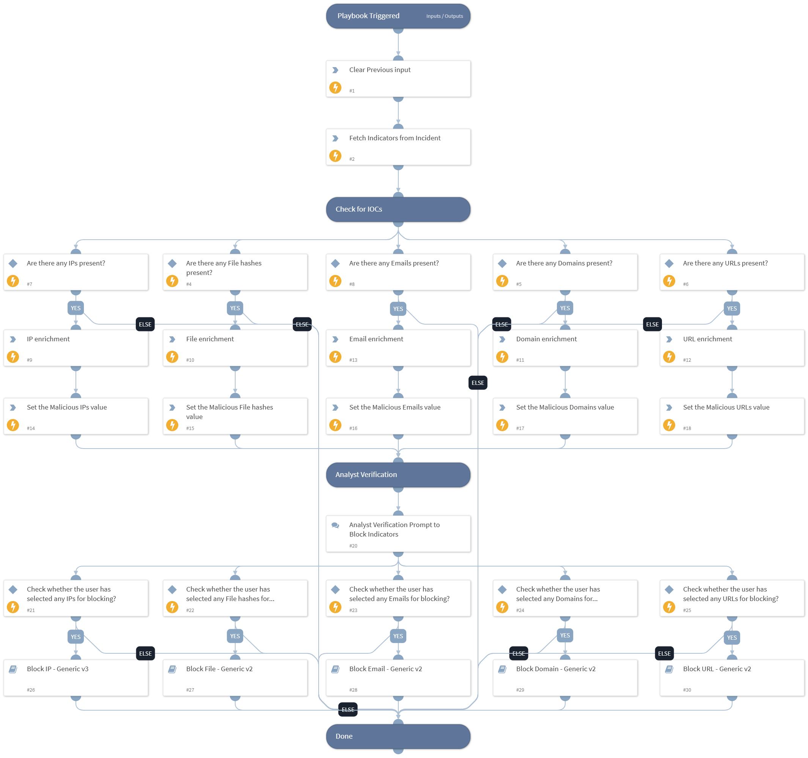

This playbook enriches IOCs using the enrichment commands (IP, Email, Domain, URL, and File) and blocks the malicious IOCs based on DBot Score.

## Dependencies

This playbook uses the following sub-playbooks, integrations, and scripts.

### Sub-playbooks

* Block Domain - Generic v2
* Block Email - Generic v2
* Block File - Generic v2
* Block IP - Generic v3
* Block URL - Generic v2

### Integrations

This playbook does not use any integrations.

### Scripts

* DeleteContext
* SetAndHandleEmpty

### Commands

* domain
* email
* file
* findIndicators
* ip
* url

## Playbook Inputs

---
There are no inputs for this playbook.

## Playbook Outputs

---
There are no outputs for this playbook.

## Playbook Image

---

