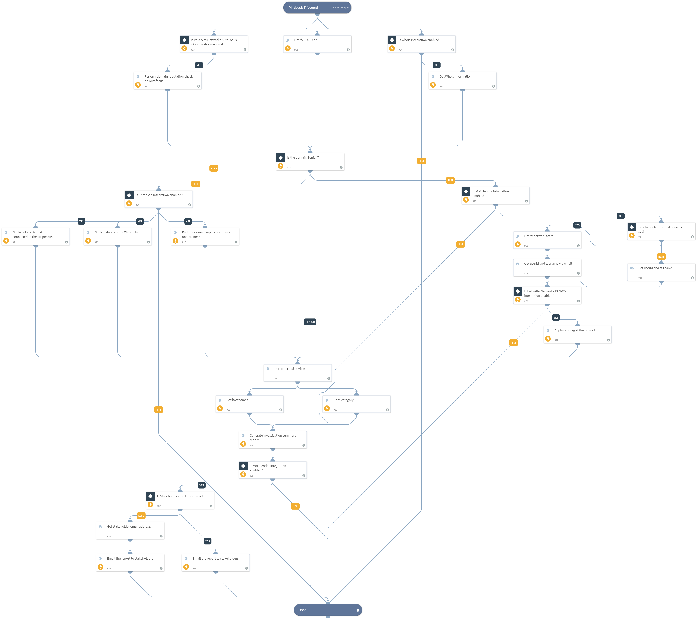

Use this playbook to investigate and remediate Bad IOC domain matches with recent activity found in the enterprise. With this playbook, you can notify the SOC lead and network team about the same.
Supported Integrations:
- Chronicle
- Whois
- Mail Sender (New)
- Palo Alto Networks PAN-OS
- Palo Alto Networks AutoFocus v2

## Dependencies
This playbook uses the following sub-playbooks, integrations, and scripts.

### Sub-playbooks
This playbook does not use any sub-playbooks.

### Integrations
* Chronicle
* Whois
* Mail Sender (New)
* Palo Alto Networks PAN-OS
* Palo Alto Networks AutoFocus v2

### Scripts
* AssignAnalystToIncident
* Print
* GenerateInvestigationSummaryReport

### Commands
* domain
* gcb-ioc-details
* send-mail
* whois
* panorama-register-user-tag
* gcb-assets

## Playbook Inputs
---

| **Name** | **Description** | **Default Value** | **Required** |
| --- | --- | --- | --- |
| networkteam_email | Enter the network team email address who needs to be notified.  |  | Optional |
| stakeholder_email | Enter the stakeholder email to send an investigation summary report. |  | Optional |

## Playbook Outputs
---
There are no outputs for this playbook.

## Playbook Image
---
