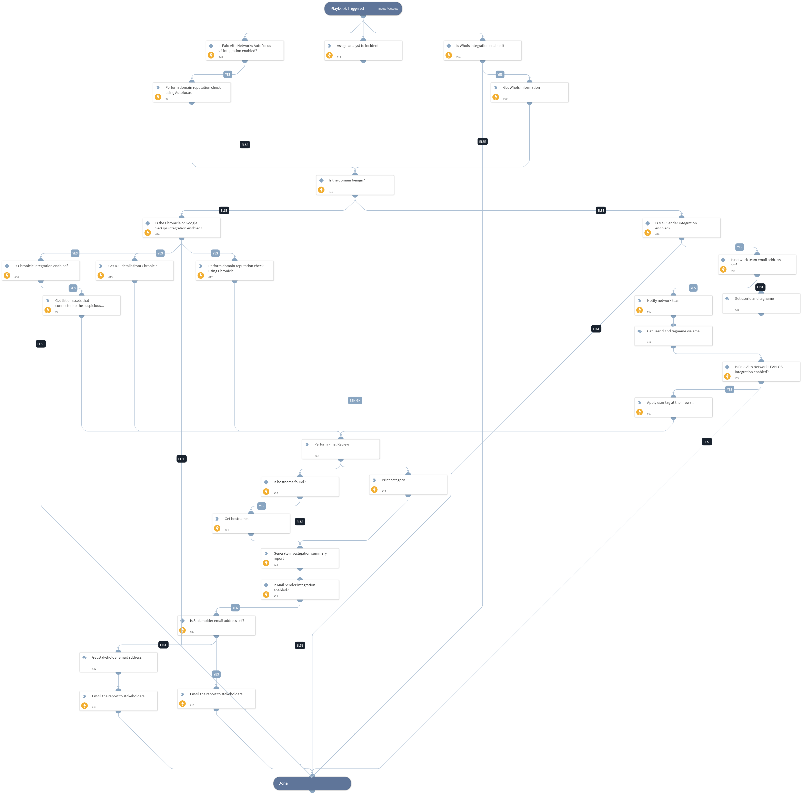

Use this playbook to investigate and remediate Bad IOC domain matches with recent activity found in the enterprise, as well as notify the SOC lead and network team about the matches.
Supported Integrations:
- Chronicle
- Whois
- Mail Sender (New)
- Palo Alto Networks PAN-OS
- Palo Alto Networks AutoFocus v2

## Dependencies
This playbook uses the following sub-playbooks, integrations, and scripts.

### Sub-playbooks
This playbook does not use any sub-playbooks.

### Integrations
* Chronicle
* Whois
* Mail Sender (New)
* Palo Alto Networks PAN-OS
* Palo Alto Networks AutoFocus v2

### Scripts
* AssignAnalystToIncident
* Print
* GenerateInvestigationSummaryReport

### Commands
* domain
* gcb-ioc-details
* send-mail
* whois
* panorama-register-user-tag
* gcb-assets

## Playbook Inputs
---

| **Name** | **Description** | **Default Value** | **Required** |
| --- | --- | --- | --- |
| networkteam_email | Enter the email address of the network team that needs to be notified.  |  | Optional |
| stakeholder_email | Enter the email of the stakeholder to whom you want to send the investigation summary report. |  | Optional |

## Playbook Outputs
---
There are no outputs for this playbook.

## Playbook Image
---
