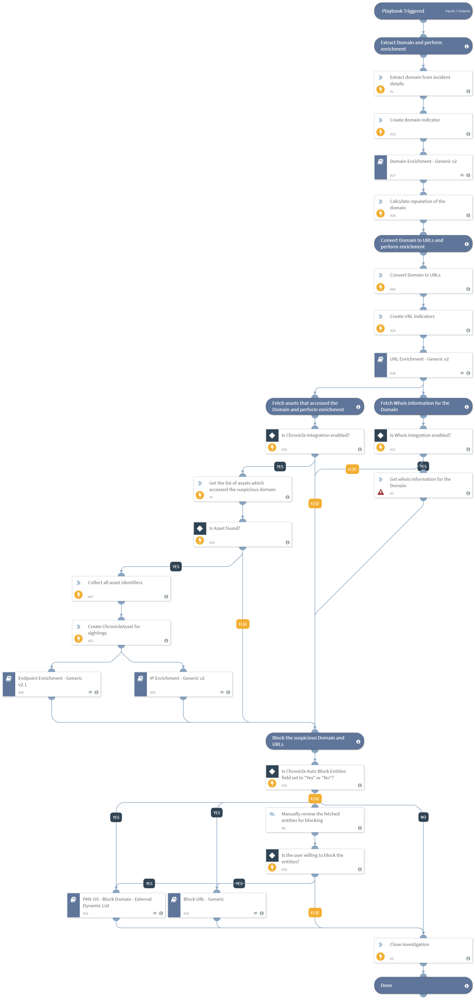

Use this playbook to investigate and remediate suspicious IOC domain matches with recent activity found in the enterprise. This playbook also creates indicators for the entities fetched, as well as investigating and enriching them.
Supported Integrations:
- Chronicle
- Whois

## Dependencies
This playbook uses the following sub-playbooks, integrations, and scripts.

### Sub-playbooks
* Domain Enrichment - Generic v2
* Endpoint Enrichment - Generic v2.1
* Block URL - Generic
* URL Enrichment - Generic v2
* IP Enrichment - Generic v2
* PAN-OS - Block Domain - External Dynamic List

### Integrations
* Chronicle
* Whois

### Scripts
* ExtractDomainFromIOCDomainMatchRes
* Print
* ConvertDomainToURLs
* ChronicleAssetIdentifierScript

### Commands
* domain
* whois
* gcb-assets
* createNewIndicator
* closeInvestigation

## Playbook Inputs
---

| **Name** | **Description** | **Default Value** | **Required** |
| --- | --- | --- | --- |
| auto_block_entities | Autoblock the detected suspicious Domain\(s\) and URL\(s\). You can set this as 'Yes' or 'No' manually here or you can set it into a custom incident field 'Chronicle Auto Block Entities' using mapping classification from integration configuration. | incident.chronicleautoblockentities | Optional |

## Playbook Outputs
---
There are no outputs for this playbook.

## Playbook Image
---
