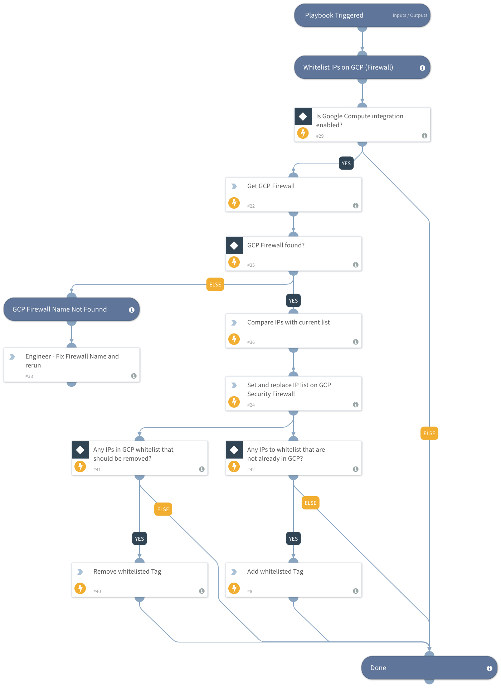

Set a list of IP addresses in GCP firewall.

## Dependencies
This playbook uses the following sub-playbooks, integrations, and scripts.

### Sub-playbooks
This playbook does not use any sub-playbooks.

### Integrations
* GoogleCloudCompute

### Scripts
* CompareLists

### Commands
* setIndicator
* gcp-compute-get-firewall
* gcp-compute-patch-firewall
* removeIndicatorField

## Playbook Inputs
---

| **Name** | **Description** | **Default Value** | **Required** |
| --- | --- | --- | --- |
| Indicator Query | Indicators to trigger the playbook |  | Optional |
| IP | IP addresses to allow in GCP Firewall |  | Required |
| GCPFirewallName | Name of the GCP Firewall where the playbook should set the IPs |  | Required |
| IndicatorTagName | Name of the Indicator Tag to apply to any IPs allowed by this playbook. | GCP_IP_Whitelist | Required |

## Playbook Outputs
---
There are no outputs for this playbook.

## Playbook Image
---
