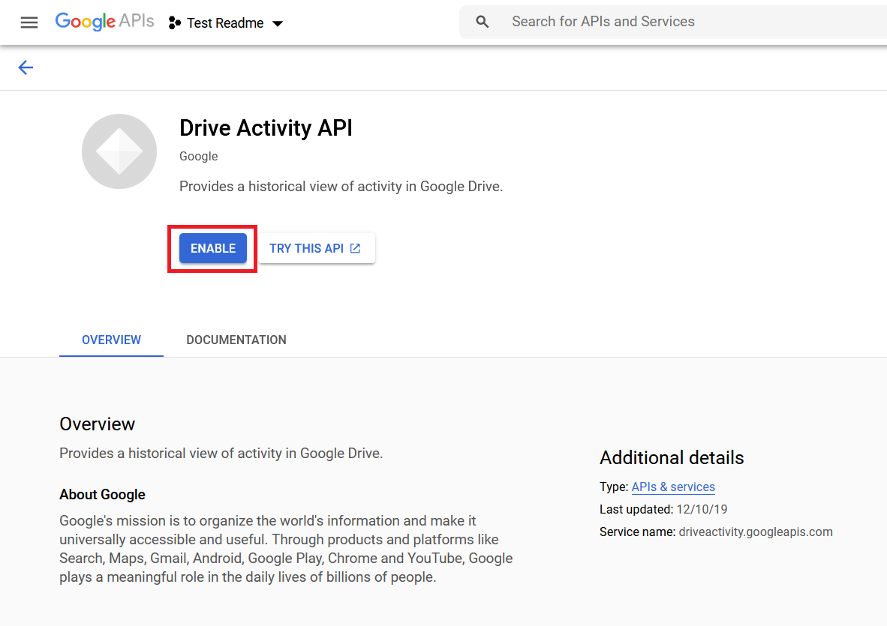
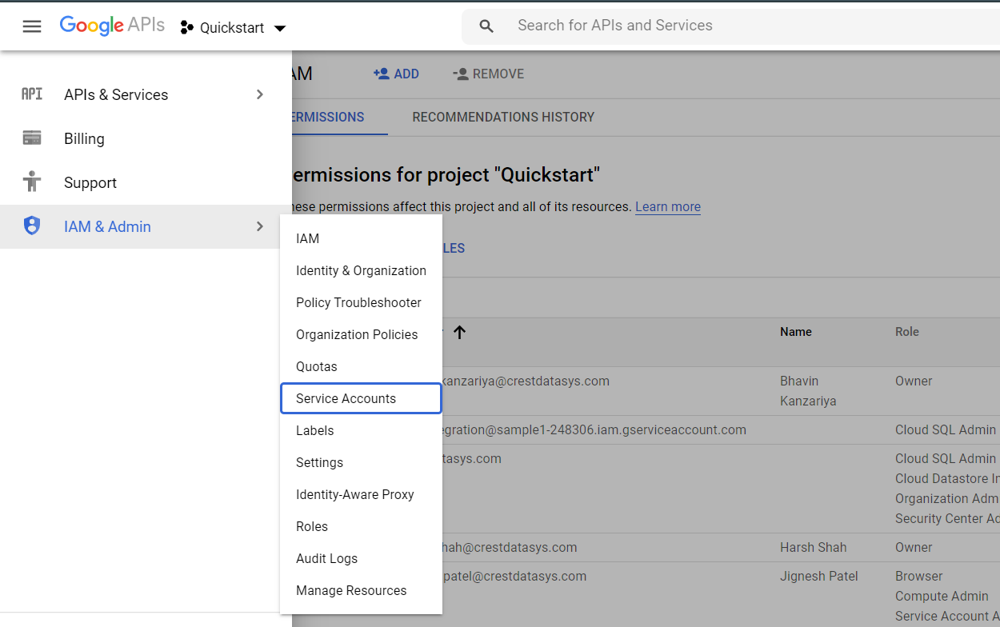
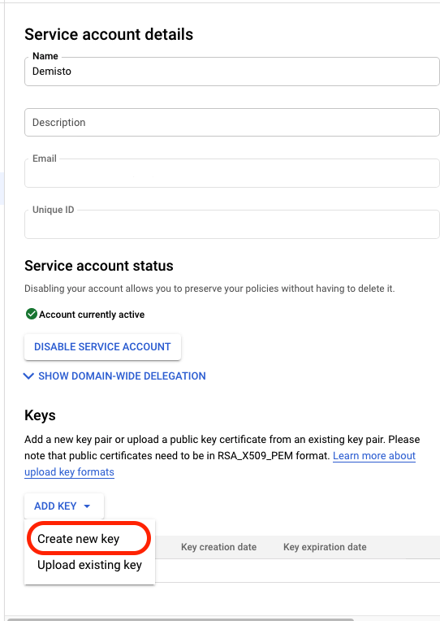
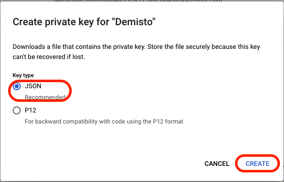
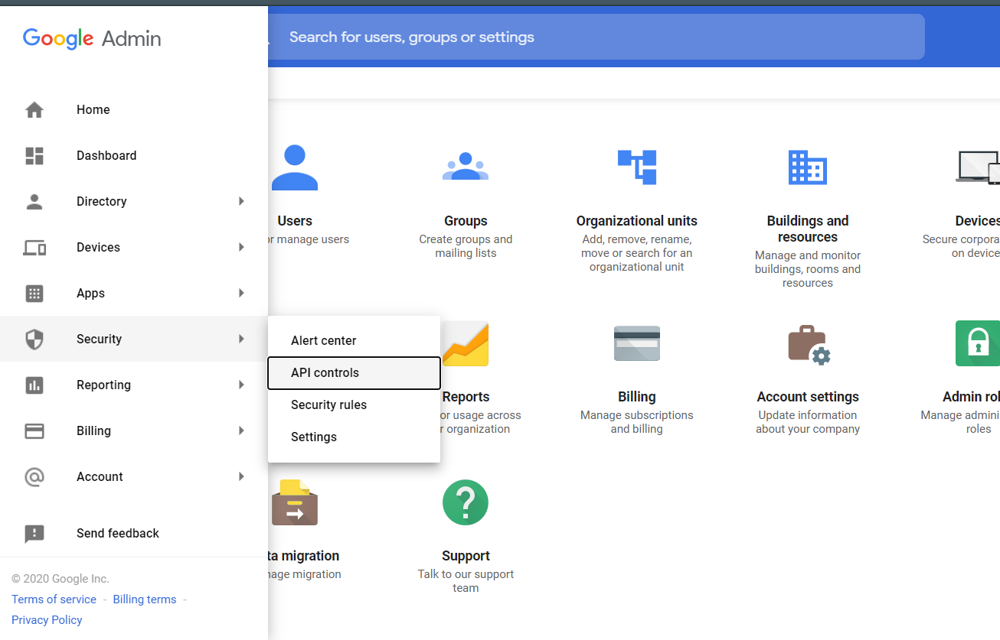
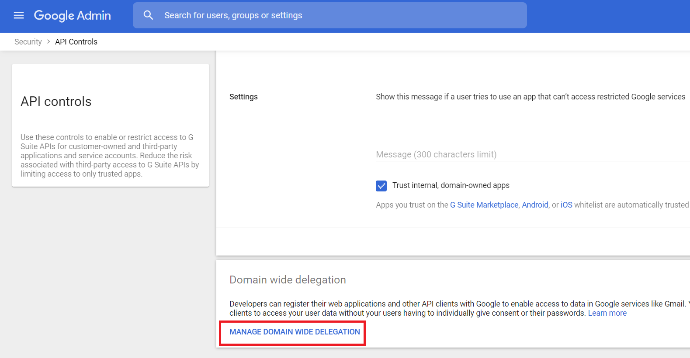

Google Drive allows users to store files on their servers, synchronize files across devices, and share files. This integration helps you to create a new drive, query past activity and view change logs performed by the users. 
This integration was integrated and tested majorly with G Suite Basic and Enterprise edition.

## Configure Service Account for Google Drive

1. Go to [https://console.developers.google.com](https://console.developers.google.com).

2. Select or create a project:

    


3. Enable the Google Drive and Drive Activity API:
    
    1. Under the main menu, select APIs & Services -> 'Libary':
        
    
    2. Enable ``Google Drive API``:
        
    
    3. Enable ``Drive Activity API``:
        
            
    4. Select the project and click 'OPEN':
            

4. Create a service account with correct restricted permissions:

    1. Under the main menu, select IAM & Admin -> Service Accounts:
        
    
    2. In the top bar, select ``CREATE SERVICE ACCOUNT``:
        
    
    3. Under the main menu, select ``IAM & Admin`` -> ``Service Accounts`` and open the account you just created.
    
    4. Generate new credentials:
        1. On the Service account details page, under Keys, click **ADD KEY** and select **Create new key**:
            
        
        2. Under Key type, select **JSON**, and click **CREATE**. Save the credentials in a secure location. You will need the generated **credentials.json** file when you configure the instance in Cortex XSOAR:
               

## Add Scopes in G Suite Admin

1. Go to [https://admin.google.com](https://admin.google.com)

2. Click Menu and select ``Security`` -> ``API Controls``:
    

3. Under ``Domain wide delegation`` tab, Click ``MANAGE DOMAIN WIDE DELEGATION``:
    

4. Click on ``Add new`` and the window will prompt, enter Client ID from your ``credentials.json`` and required scopes from integration tips.
               

5. Click ``AUTHORIZE``.

## Configure Google Drive on Cortex XSOAR

1. Navigate to **Settings** > **Integrations** > **Servers & Services**.
2. Search for Google Drive.
3. Click **Add instance** to create and configure a new integration instance.

    | **Parameter** | **Description** | **Required** |
    | --- | --- | --- |
    | isFetch | Fetch incidents. | False |
    | user_service_account_json | User's Service Account JSON. | True |
    | user_id | User ID. | False |
    | action_detail_case_include | Action Detail Case Include. | False |
    | drive_item_search_field | Drive Item Search Field. | False |
    | drive_item_search_value | Drive Item Search Value. | False |
    | max_fetch | Max Incidents. | False |
    | first_fetch | First fetch time interval. | False |
    | incidentType | Incident type. | False |
    | insecure | Trust any certificate \(not secure\). | False |
    | proxy | Use system proxy settings. | False |

4. Click **Test** to validate the URLs, token, and connection.

## Commands
You can execute these commands from the Cortex XSOAR CLI, as part of an automation, or in a playbook.
After you successfully execute a command, a DBot message appears in the War Room with the command details.


### google-drive-create
***
Creates a new Team Drive. The name argument specifies the name of the Team Drive. The specified user will be the first organizer.
This shared drive/team drive feature is available only with G Suite Enterprise, Enterprise for Education, G Suite Essentials, Business, Education, and Nonprofits edition.


#### Base Command

`google-drive-create`
#### Input

| **Argument Name** | **Description** | **Required** |
| --- | --- | --- |
| user_id | The user's primary email address. | Optional |
| name | The name of this shared drive. | Required | 
| hidden | Whether the shared drive is hidden from default view. | Optional | 


#### Context Output

| **Path** | **Type** | **Description** |
| --- | --- | --- |
| GoogleDrive.Drive.kind | String | Identifies what kind of resource this is. | 
| GoogleDrive.Drive.id | String | The ID of this shared drive which is also the ID of the top level folder of this shared drive. | 
| GoogleDrive.Drive.name | String | The name of this shared drive. |
| GoogleDrive.Drive.hidden | Boolean | Whether the shared drive is hidden from default view. |


#### Command Example
``` 
!google-drive-create name=drive1
```

#### Context Example
```
{
 "GoogleDrive": {
   "Drive": {
     "kind": "drive#drive",
     "id": "YYg1BVyzlZx",
     "name": "drive1",
     "hidden": true
   }
 }
} 
```

#### Human Readable Output
>### A new shared drive created.
>|Id|Name|Hidden|
>|---|---|---|
>| YYg1BVyzlZx | drive1 | true |


### google-drive-changes-list
***
Lists the changes for a user or shared drive.


#### Base Command

`google-drive-changes-list`
#### Input

| **Argument Name** | **Description** | **Required** |
| --- | --- | --- |
| page_token | The token for continuing a previous list request on the next page. | Required | 
| user_id | The user's primary email address. | Optional | 
| drive_id | The shared drive from which changes are returned. | Optional | 
| include_corpus_removals | Whether changes should include the file resource if the file is still accessible by the user at the time of the request, even when a file was removed from the list of changes and there will be no further change entries for this file. Default is "false". | Optional | 
| include_items_from_all_drives | Whether both My Drive and shared drive items should be included in results. Default is "false". | Optional | 
| include_permissions_for_view | Specifies which additional view's permissions to include in the response. Only 'published' is supported. | Optional | 
| include_removed | Whether to include changes indicating that items have been removed from the list of changes, for example by deletion or loss of access. Default is "true". | Optional | 
| page_size | The maximum number of changes to return per page. Acceptable values are 1 to 1000, inclusive. Default is "100". | Optional | 
| restrict_to_my_drive | Whether to restrict the results to changes inside the My Drive hierarchy. This omits changes to files such as those in the Application Data folder or shared files which have not been added to My Drive. Default is "false". | Optional | 
| spaces | A comma-separated list of spaces to query within the user corpus. Supported values are 'drive', 'appDataFolder' and 'photos'. | Optional | 
| supports_all_drives | Whether the requesting application supports both My Drives and shared drives. Default is "false". | Optional | 
| fields | The paths of the fields you want to be included in the response. Possible values are: ""basic" (the response will include a default set of fields specific to this method) and "advance" (you can use the value * to return all the fields). Default is "basic". | Optional | 


#### Context Output

| **Path** | **Type** | **Description** |
| --- | --- | --- |
| GoogleDrive.PageToken.DriveChange.nextPageToken | String | The page token for the next page of changes. | 
| GoogleDrive.PageToken.DriveChange.newStartPageToken | String | The starting page token for future changes. | 
| GoogleDrive.PageToken.DriveChange.driveId | String | The ID of the shared drive associated with this change. | 
| GoogleDrive.PageToken.DriveChange.userId | String | The user's primary email address. | 
| GoogleDrive.DriveChange.userId | String | The user's primary email address. | 
| GoogleDrive.DriveChange.kind | String | Identifies what kind of resource this is. | 
| GoogleDrive.DriveChange.changeType | String | The type of the change. Possible values are file and drive. | 
| GoogleDrive.DriveChange.time | Date | The time of this change \(RFC 3339 date-time\). | 
| GoogleDrive.DriveChange.removed | Boolean | Whether the file or shared drive has been removed from this list of changes, for example by deletion or loss of access. | 
| GoogleDrive.DriveChange.fileId | String | The ID of the file which has changed. | 
| GoogleDrive.DriveChange.driveId | String | The ID of the shared drive associated with this change. | 
| GoogleDrive.DriveChange.file.kind | String | Identifies what kind of resource this is. | 
| GoogleDrive.DriveChange.file.id | String | The ID of the file. | 
| GoogleDrive.DriveChange.file.name | String | The name of the file. | 
| GoogleDrive.DriveChange.file.mimeType | String | The MIME type of the file. | 
| GoogleDrive.DriveChange.file.description | String | A short description of the file. | 
| GoogleDrive.DriveChange.file.starred | Boolean | Whether the user has starred the file. | 
| GoogleDrive.DriveChange.file.trashed | Boolean | Whether the file has been trashed, either explicitly or from a trashed parent folder. Only the owner may trash a file. | 
| GoogleDrive.DriveChange.file.explicitlyTrashed | Boolean | Whether the file has been explicitly trashed, as opposed to recursively trashed from a parent folder. | 
| GoogleDrive.DriveChange.file.trashingUser.kind | String | Identifies what kind of resource this is. | 
| GoogleDrive.DriveChange.file.trashingUser.displayName | String | A plain text displayable name for this user. | 
| GoogleDrive.DriveChange.file.trashingUser.photoLink | String | A link to the user's profile photo, if available. | 
| GoogleDrive.DriveChange.file.trashingUser.me | Boolean | Whether this user is the requesting user. | 
| GoogleDrive.DriveChange.file.trashingUser.permissionId | String | The user's ID as visible in Permission resources. | 
| GoogleDrive.DriveChange.file.trashingUser.emailAddress | String | The email address of the user. This may not be present in certain contexts if the user has not made their email address visible to the requester. | 
| GoogleDrive.DriveChange.file.trashedTime | Date | The time that the item was trashed \(RFC 3339 date-time\). Only populated for items in shared drives. | 
| GoogleDrive.DriveChange.file.parents | Unknown | The IDs of the parent folders which contain the file. | 
| GoogleDrive.DriveChange.file.properties | Unknown | A collection of arbitrary key-value pairs which are visible to all apps. | 
| GoogleDrive.DriveChange.file.appProperties | Unknown | A collection of arbitrary key-value pairs which are private to the requesting app. | 
| GoogleDrive.DriveChange.file.spaces | Unknows | The list of spaces which contain the file. The currently supported values are 'drive', 'appDataFolder' and 'photos'. | 
| GoogleDrive.DriveChange.file.version | Number | A monotonically increasing version number for the file. This reflects every change made to the file on the server, even those not visible to the user. | 
| GoogleDrive.DriveChange.file.webContentLink | String | A link for downloading the content of the file in a browser. This is only available for files with binary content in Google Drive. | 
| GoogleDrive.DriveChange.file.webViewLink | String | A link for opening the file in a relevant Google editor or viewer in a browser. | 
| GoogleDrive.DriveChange.file.iconLink | String | A static, unauthenticated link to the file's icon. | 
| GoogleDrive.DriveChange.file.hasThumbnail | Boolean | Whether this file has a thumbnail. | 
| GoogleDrive.DriveChange.file.thumbnailLink | String | A short-lived link to the file's thumbnail, if available. | 
| GoogleDrive.DriveChange.file.thumbnailVersion | Number | The thumbnail version for use in thumbnail cache invalidation. | 
| GoogleDrive.DriveChange.file.viewedByMe | Boolean | Whether the file has been viewed by this user. | 
| GoogleDrive.DriveChange.file.viewedByMeTime | Date | The last time the file was viewed by the user \(RFC 3339 date-time\). | 
| GoogleDrive.DriveChange.file.createdTime | Date | The time at which the file was created \(RFC 3339 date-time\). | 
| GoogleDrive.DriveChange.file.modifiedTime | Date | The last time the file was modified by anyone \(RFC 3339 date-time\). | 
| GoogleDrive.DriveChange.file.modifiedByMeTime | Date | The last time the file was modified by the user \(RFC 3339 date-time\). | 
| GoogleDrive.DriveChange.file.modifiedByMe | Boolean | Whether the file has been modified by this user. | 
| GoogleDrive.DriveChange.file.sharedWithMeTime | Date | The time at which the file was shared with the user, if applicable \(RFC 3339 date-time\). | 
| GoogleDrive.DriveChange.file.sharingUser.kind | String | Identifies what kind of resource this is. | 
| GoogleDrive.DriveChange.file.sharingUser.displayName | String | A plain text displayable name for this user. | 
| GoogleDrive.DriveChange.file.sharingUser.photoLink | Date | A link to the user's profile photo, if available. | 
| GoogleDrive.DriveChange.file.sharingUser.me | Boolean | Whether this user is the requesting user. | 
| GoogleDrive.DriveChange.file.sharingUser.permissionId | String | The user's ID as visible in Permission resources. | 
| GoogleDrive.DriveChange.file.sharingUser.emailAddress | String | The email address of the user. This may not be present in certain contexts if the user has not made their email address visible to the requester. | 
| GoogleDrive.DriveChange.file.owners.kind | String | Identifies what kind of resource this is. | 
| GoogleDrive.DriveChange.file.owners.displayName | String | A plain text displayable name for this user. | 
| GoogleDrive.DriveChange.file.owners.photoLink | String | A link to the user's profile photo, if available. | 
| GoogleDrive.DriveChange.file.owners.me | Boolean | Whether this user is the requesting user. | 
| GoogleDrive.DriveChange.file.owners.permissionId | String | The user's ID as visible in Permission resources. | 
| GoogleDrive.DriveChange.file.owners.emailAddress | String | The email address of the user. This may not be present in certain contexts if the user has not made their email address visible to the requester. | 
| GoogleDrive.DriveChange.file.driveId | String | ID of the shared drive the file resides in. Only populated for items in shared drives. | 
| GoogleDrive.DriveChange.file.lastModifyingUser.kind | String | Identifies what kind of resource this is. | 
| GoogleDrive.DriveChange.file.lastModifyingUser.displayName | String | A plain text displayable name for this user. | 
| GoogleDrive.DriveChange.file.lastModifyingUser.photoLink | String | A link to the user's profile photo, if available. | 
| GoogleDrive.DriveChange.file.lastModifyingUser.me | Boolean | Whether this user is the requesting user. | 
| GoogleDrive.DriveChange.file.lastModifyingUser.permissionId | String | The user's ID as visible in Permission resources. | 
| GoogleDrive.DriveChange.file.lastModifyingUser.emailAddress | String | The email address of the user. This may not be present in certain contexts if the user has not made their email address visible to the requester. | 
| GoogleDrive.DriveChange.file.shared | Boolean | Whether the file has been shared. Not populated for items in shared drives. | 
| GoogleDrive.DriveChange.file.ownedByMe | Boolean | Whether the user owns the file. Not populated for items in shared drives. | 
| GoogleDrive.DriveChange.file.capabilities.canAddChildren | Boolean | Whether the current user can add children to this folder. This is always false when the item is not a folder. | 
| GoogleDrive.DriveChange.file.capabilities.canAddFolderFromAnotherDrive | Boolean | Whether the current user can add a folder from another drive \(different shared drive or My Drive\) to this folder. | 
| GoogleDrive.DriveChange.file.capabilities.canAddMyDriveParent | Boolean | Whether the current user can add a parent for the item without removing an existing parent in the same request. Not populated for shared drive files. | 
| GoogleDrive.DriveChange.file.capabilities.canChangeCopyRequiresWriterPermission | Boolean | Whether the current user can change the copyRequiresWriterPermission restriction of this file. | 
| GoogleDrive.DriveChange.file.capabilities.canComment | Boolean | Whether the current user can comment on this file. | 
| GoogleDrive.DriveChange.file.capabilities.canCopy | Boolean | Whether the current user can copy this file. | 
| GoogleDrive.DriveChange.file.capabilities.canDelete | Boolean | Whether the current user can delete this file. | 
| GoogleDrive.DriveChange.file.capabilities.canDeleteChildren | Boolean | Whether the current user can delete children of this folder. This is false when the item is not a folder. Only populated for items in shared drives. | 
| GoogleDrive.DriveChange.file.capabilities.canDownload | Boolean | Whether the current user can download this file. | 
| GoogleDrive.DriveChange.file.capabilities.canEdit | Boolean | Whether the current user can edit this file. | 
| GoogleDrive.DriveChange.file.capabilities.canListChildren | Boolean | Whether the current user can list the children of this folder. This is always false when the item is not a folder. | 
| GoogleDrive.DriveChange.file.capabilities.canModifyContent | Boolean | Whether the current user can modify the content of this file. | 
| GoogleDrive.DriveChange.file.capabilities.canModifyContentRestriction | Boolean | Whether the current user can modify restrictions on content of this file. | 
| GoogleDrive.DriveChange.file.capabilities.canMoveChildrenOutOfDrive | Boolean | Whether the current user can move children of this folder outside of the shared drive. | 
| GoogleDrive.DriveChange.file.capabilities.canMoveChildrenWithinDrive | Boolean | Whether the current user can move children of this folder within this drive. | 
| GoogleDrive.DriveChange.file.capabilities.canMoveItemOutOfDrive | Boolean | Whether the current user can move this item outside of this drive by changing its parent. | 
| GoogleDrive.DriveChange.file.capabilities.canMoveItemWithinDrive | Boolean | Whether the current user can move this item within this drive. | 
| GoogleDrive.DriveChange.file.capabilities.canReadRevisions | Boolean | Whether the current user can read the revisions resource of this file. | 
| GoogleDrive.DriveChange.file.capabilities.canReadDrive | Boolean | Whether the current user can read the shared drive to which this file belongs. Only populated for items in shared drives. | 
| GoogleDrive.DriveChange.file.capabilities.canRemoveChildren | Boolean | Whether the current user can remove children from this folder. | 
| GoogleDrive.DriveChange.file.capabilities.canRemoveMyDriveParent | Boolean | Whether the current user can remove a parent from the item without adding another parent in the same request. Not populated for shared drive files. | 
| GoogleDrive.DriveChange.file.capabilities.canRename | Boolean | Whether the current user can rename this file. | 
| GoogleDrive.DriveChange.file.capabilities.canShare | Boolean | Whether the current user can modify the sharing settings for this file. | 
| GoogleDrive.DriveChange.file.capabilities.canTrash | Boolean | Whether the current user can move this file to trash. | 
| GoogleDrive.DriveChange.file.capabilities.canTrashChildren | Boolean | Whether the current user can trash children of this folder. This is false when the item is not a folder. Only populated for items in shared drives. | 
| GoogleDrive.DriveChange.file.capabilities.canUntrash | Boolean | Whether the current user can restore this file from trash. | 
| GoogleDrive.DriveChange.file.copyRequiresWriterPermission | Boolean | Whether the options to copy, print, or download this file, should be disabled for readers and commenters. | 
| GoogleDrive.DriveChange.file.writersCanShare | Boolean | Whether users with only writer permission can modify the file's permissions. Not populated for items in shared drives. | 
| GoogleDrive.DriveChange.file.permissions.kind | String | Identifies what kind of resource this is. | 
| GoogleDrive.DriveChange.file.permissions.id | String | The ID of this permission. | 
| GoogleDrive.DriveChange.file.permissions.type | String | The type of the grantee. | 
| GoogleDrive.DriveChange.file.permissions.emailAddress | String | The email address of the user or group to which this permission refers. | 
| GoogleDrive.DriveChange.file.permissions.domain | String | The domain to which this permission refers. | 
| GoogleDrive.DriveChange.file.permissions.role | String | The role granted by this permission. | 
| GoogleDrive.DriveChange.file.permissions.view | String | Indicates the view for this permission. | 
| GoogleDrive.DriveChange.file.permissions.allowFileDiscovery | Boolean | Whether the permission allows the file to be discovered through search. | 
| GoogleDrive.DriveChange.file.permissions.displayName | String | The "pretty" name of the value of the permission. | 
| GoogleDrive.DriveChange.file.permissions.photoLink | String | A link to the user's profile photo, if available. | 
| GoogleDrive.DriveChange.file.permissions.expirationTime | Date | The time at which this permission will expire \(RFC 3339 date-time\). | 
| GoogleDrive.DriveChange.file.permissions.permissionDetails.permissionType | String | The permission type for this user. | 
| GoogleDrive.DriveChange.file.permissions.permissionDetails.role | String | The primary role for this user. | 
| GoogleDrive.DriveChange.file.permissions.permissionDetails.inheritedFrom | String | The ID of the item from which this permission is inherited. | 
| GoogleDrive.DriveChange.file.permissions.permissionDetails.inherited | Boolean | Whether this permission is inherited. | 
| GoogleDrive.DriveChange.file.permissions.deleted | Boolean | Whether the account associated with this permission has been deleted. | 
| GoogleDrive.DriveChange.file.permissionIds | Unknown | List of permission IDs for users with access to this file. | 
| GoogleDrive.DriveChange.file.hasAugmentedPermissions | Boolean | Whether there are permissions directly on this file. This field is only populated for items in shared drives. | 
| GoogleDrive.DriveChange.file.folderColorRgb | String | The color for a folder as an RGB hex string. | 
| GoogleDrive.DriveChange.file.originalFilename | String | The original filename of the uploaded content if available, or else the original value of the name field. This is only available for files with binary content in Google Drive. | 
| GoogleDrive.DriveChange.file.fullFileExtension | String | The full file extension extracted from the name field. | 
| GoogleDrive.DriveChange.file.fileExtension | String | The final component of fullFileExtension. This is only available for files with binary content in Google Drive. | 
| GoogleDrive.DriveChange.file.md5Checksum | String | The MD5 checksum for the content of the file. This is only applicable to files with binary content in Google Drive. | 
| GoogleDrive.DriveChange.file.size | Number | The size of the file's content in bytes. This is only applicable to files with binary content in Google Drive. | 
| GoogleDrive.DriveChange.file.quotaBytesUsed | Number | The number of storage quota bytes used by the file. This includes the head revision as well as previous revisions with keepForever enabled. | 
| GoogleDrive.DriveChange.file.headRevisionId | String | The ID of the file's head revision. This is currently only available for files with binary content in Google Drive. | 
| GoogleDrive.DriveChange.file.contentHints.thumbnail.image | Unknown | The thumbnail data encoded with URL-safe Base64 \(RFC 4648 section 5\). | 
| GoogleDrive.DriveChange.file.contentHints.thumbnail.mimeType | String | The MIME type of the thumbnail. | 
| GoogleDrive.DriveChange.file.contentHints.indexableText | String | Text to be indexed for the file to improve fullText queries. This is limited to 128KB in length and may contain HTML elements. | 
| GoogleDrive.DriveChange.file.imageMediaMetadata.width | Number | The width of the image in pixels. | 
| GoogleDrive.DriveChange.file.imageMediaMetadata.height | Number | The height of the image in pixels. | 
| GoogleDrive.DriveChange.file.imageMediaMetadata.rotation | Number | The number of clockwise 90 degree rotations applied from the image's original orientation. | 
| GoogleDrive.DriveChange.file.imageMediaMetadata.location.latitude | Number | The latitude stored in the image. | 
| GoogleDrive.DriveChange.file.imageMediaMetadata.location.longitude | Number | The longitude stored in the image. | 
| GoogleDrive.DriveChange.file.imageMediaMetadata.location.altitude | Number | The altitude stored in the image. | 
| GoogleDrive.DriveChange.file.imageMediaMetadata.time | String | The date and time the photo was taken \(EXIF DateTime\). | 
| GoogleDrive.DriveChange.file.imageMediaMetadata.cameraMake | String | The make of the camera used to create the photo. | 
| GoogleDrive.DriveChange.file.imageMediaMetadata.cameraModel | String | The model of the camera used to create the photo. | 
| GoogleDrive.DriveChange.file.imageMediaMetadata.exposureTime | Number | The length of the exposure, in seconds. | 
| GoogleDrive.DriveChange.file.imageMediaMetadata.aperture | Number | The aperture used to create the photo \(f-number\). | 
| GoogleDrive.DriveChange.file.imageMediaMetadata.flashUsed | Boolean | Whether a flash was used to create the photo. | 
| GoogleDrive.DriveChange.file.imageMediaMetadata.focalLength | Number | The focal length used to create the photo, in millimeters. | 
| GoogleDrive.DriveChange.file.imageMediaMetadata.isoSpeed | Number | The ISO speed used to create the photo. | 
| GoogleDrive.DriveChange.file.imageMediaMetadata.meteringMode | String | The metering mode used to create the photo. | 
| GoogleDrive.DriveChange.file.imageMediaMetadata.sensor | String | The type of sensor used to create the photo. | 
| GoogleDrive.DriveChange.file.imageMediaMetadata.exposureMode | String | The exposure mode used to create the photo. | 
| GoogleDrive.DriveChange.file.imageMediaMetadata.colorSpace | String | The color space of the photo. | 
| GoogleDrive.DriveChange.file.imageMediaMetadata.whiteBalance | String | The white balance mode used to create the photo. | 
| GoogleDrive.DriveChange.file.imageMediaMetadata.exposureBias | Number | The exposure bias of the photo \(APEX value\). | 
| GoogleDrive.DriveChange.file.imageMediaMetadata.maxApertureValue | Number | The smallest f-number of the lens at the focal length used to create the photo \(APEX value\). | 
| GoogleDrive.DriveChange.file.imageMediaMetadata.subjectDistance | Number | The distance to the subject of the photo, in meters. | 
| GoogleDrive.DriveChange.file.imageMediaMetadata.lens | String | The lens used to create the photo. | 
| GoogleDrive.DriveChange.file.videoMediaMetadata.width | Number | The width of the video in pixels. | 
| GoogleDrive.DriveChange.file.videoMediaMetadata.height | Number | The height of the video in pixels. | 
| GoogleDrive.DriveChange.file.videoMediaMetadata.durationMillis | Number | The duration of the video in milliseconds. | 
| GoogleDrive.DriveChange.file.isAppAuthorized | Boolean | Whether the file was created or opened by the requesting app. | 
| GoogleDrive.DriveChange.file.exportLinks | Unknown | Links for exporting Google Docs to specific formats. | 
| GoogleDrive.DriveChange.file.shortcutDetails.targetId | String | The ID of the file that this shortcut points to. | 
| GoogleDrive.DriveChange.file.shortcutDetails.targetMimeType | String | The MIME type of the file that this shortcut points to. The value of this field is a snapshot of the target's MIME type, captured when the shortcut is created. | 
| GoogleDrive.DriveChange.file.contentRestrictions.readOnly | Boolean | Whether the content of the file is read-only. | 
| GoogleDrive.DriveChange.file.contentRestrictions.reason | String | Reason for why the content of the file is restricted. This is only mutable on requests that also set readOnly=true. | 
| GoogleDrive.DriveChange.file.contentRestrictions.restrictingUser.kind | String | Identifies what kind of resource this is. | 
| GoogleDrive.DriveChange.file.contentRestrictions.restrictingUser.displayName | String | A plain text displayable name for this user. | 
| GoogleDrive.DriveChange.file.contentRestrictions.restrictingUser.photoLink | String | A link to the user's profile photo, if available. | 
| GoogleDrive.DriveChange.file.contentRestrictions.restrictingUser.me | Boolean | Whether this user is the requesting user. | 
| GoogleDrive.DriveChange.file.contentRestrictions.restrictingUser.permissionId | String | The user's ID as visible in Permission resources. | 
| GoogleDrive.DriveChange.file.contentRestrictions.restrictingUser.emailAddress | String | The email address of the user. This may not be present in certain contexts if the user has not made their email address visible to the requester. | 
| GoogleDrive.DriveChange.file.contentRestrictions.restrictionTime | Date | The time at which the content restriction was set \(formatted RFC 3339 timestamp\). Only populated if readOnly is true. | 
| GoogleDrive.DriveChange.file.contentRestrictions.type | String | The type of the content restriction. Currently the only possible value is globalContentRestriction. | 
| GoogleDrive.DriveChange.drive.kind | String | Identifies what kind of resource this is. | 
| GoogleDrive.DriveChange.drive.id | String | The ID of this shared drive which is also the ID of the top level folder of this shared drive. | 
| GoogleDrive.DriveChange.drive.name | String | The name of this shared drive. | 
| GoogleDrive.DriveChange.drive.themeId | String | The ID of the theme from which the background image and color will be set. | 
| GoogleDrive.DriveChange.drive.colorRgb | String | The color of this shared drive as an RGB hex string. It can only be set on a drive.drives.update request that does not set themeId. | 
| GoogleDrive.DriveChange.drive.backgroundImageFile.id | String | The ID of an image file in Google Drive to use for the background image. | 
| GoogleDrive.DriveChange.drive.backgroundImageFile.xCoordinate | Number | The X coordinate of the upper left corner of the cropping area in the background image. | 
| GoogleDrive.DriveChange.drive.backgroundImageFile.yCoordinate | Number | The Y coordinate of the upper left corner of the cropping area in the background image. | 
| GoogleDrive.DriveChange.drive.backgroundImageFile.width | Number | The width of the cropped image in the closed range of 0 to 1. | 
| GoogleDrive.DriveChange.drive.backgroundImageLink | String | A short-lived link to this shared drive's background image. | 
| GoogleDrive.DriveChange.drive.capabilities.canAddChildren | Boolean | Whether the current user can add children to folders in this shared drive. | 
| GoogleDrive.DriveChange.drive.capabilities.canChangeCopyRequiresWriterPermissionRestriction | Boolean | Whether the current user can change the copyRequiresWriterPermission restriction of this shared drive. | 
| GoogleDrive.DriveChange.drive.capabilities.canChangeDomainUsersOnlyRestriction | Boolean | Whether the current user can change the domainUsersOnly restriction of this shared drive. | 
| GoogleDrive.DriveChange.drive.capabilities.canChangeDriveBackground | Boolean | Whether the current user can change the background of this shared drive. | 
| GoogleDrive.DriveChange.drive.capabilities.canChangeDriveMembersOnlyRestriction | Boolean | Whether the current user can change the driveMembersOnly restriction of this shared drive. | 
| GoogleDrive.DriveChange.drive.capabilities.canComment | Boolean | Whether the current user can comment on files in this shared drive. | 
| GoogleDrive.DriveChange.drive.capabilities.canCopy | Boolean | Whether the current user can copy files in this shared drive. | 
| GoogleDrive.DriveChange.drive.capabilities.canDeleteChildren | Boolean | Whether the current user can delete children from folders in this shared drive. | 
| GoogleDrive.DriveChange.drive.capabilities.canDeleteDrive | Boolean | Whether the current user can delete this shared drive. | 
| GoogleDrive.DriveChange.drive.capabilities.canDownload | Boolean | Whether the current user can download files in this shared drive. | 
| GoogleDrive.DriveChange.drive.capabilities.canEdit | Boolean | Whether the current user can edit files in this shared drive | 
| GoogleDrive.DriveChange.drive.capabilities.canListChildren | Boolean | Whether the current user can list the children of folders in this shared drive. | 
| GoogleDrive.DriveChange.drive.capabilities.canManageMembers | Boolean | Whether the current user can add members to this shared drive or remove them or change their role. | 
| GoogleDrive.DriveChange.drive.capabilities.canReadRevisions | Boolean | Whether the current user can read the revisions resource of files in this shared drive. | 
| GoogleDrive.DriveChange.drive.capabilities.canRename | Boolean | Whether the current user can rename files or folders in this shared drive. | 
| GoogleDrive.DriveChange.drive.capabilities.canRenameDrive | Boolean | Whether the current user can rename this shared drive. | 
| GoogleDrive.DriveChange.drive.capabilities.canShare | Boolean | Whether the current user can share files or folders in this shared drive. | 
| GoogleDrive.DriveChange.drive.capabilities.canTrashChildren | Boolean | Whether the current user can trash children from folders in this shared drive. | 
| GoogleDrive.DriveChange.drive.createdTime | Date | The time at which the shared drive was created \(RFC 3339 date-time\). | 
| GoogleDrive.DriveChange.drive.hidden | Boolean | Whether the shared drive is hidden from default view. | 
| GoogleDrive.DriveChange.drive.restrictions.adminManagedRestrictions | Boolean | Whether administrative privileges on this shared drive are required to modify restrictions. | 
| GoogleDrive.DriveChange.drive.restrictions.copyRequiresWriterPermission | Boolean | Whether the options to copy, print, or download files inside this shared drive, should be disabled for readers and commenters. | 
| GoogleDrive.DriveChange.drive.restrictions.domainUsersOnly | Boolean | Whether access to this shared drive and items inside this shared drive is restricted to users of the domain to which this shared drive belongs. | 
| GoogleDrive.DriveChange.drive.restrictions.driveMembersOnly | Boolean | Whether access to items inside this shared drive is restricted to its members. | 


#### Command Example
```!google-drive-changes-list page_token=485 user_id=user@domain.com fields=advance page_size=2```

#### Context Example
```
{
    "GoogleDrive": {
        "DriveChange": [
            {
                "changeType": "file",
                "file": {
                    "capabilities": {
                        "canAddChildren": false,
                        "canAddMyDriveParent": false,
                        "canChangeCopyRequiresWriterPermission": true,
                        "canChangeViewersCanCopyContent": true,
                        "canComment": true,
                        "canCopy": true,
                        "canDelete": true,
                        "canDownload": true,
                        "canEdit": true,
                        "canListChildren": false,
                        "canModifyContent": true,
                        "canMoveChildrenWithinDrive": false,
                        "canMoveItemIntoTeamDrive": true,
                        "canMoveItemOutOfDrive": true,
                        "canMoveItemWithinDrive": true,
                        "canReadRevisions": true,
                        "canRemoveChildren": false,
                        "canRemoveMyDriveParent": true,
                        "canRename": true,
                        "canShare": true,
                        "canTrash": true,
                        "canUntrash": true
                    },
                    "copyRequiresWriterPermission": false,
                    "createdTime": "2020-09-18T16:44:58.481Z",
                    "explicitlyTrashed": false,
                    "fileExtension": "PNG",
                    "fullFileExtension": "PNG",
                    "hasThumbnail": true,
                    "headRevisionId": "0B4EoMKFUOWuTV1VRSU1xN3ZXSU5kRHZrcWVUZ0Nha0xVQ3FVPQ",
                    "iconLink": "https://drive-thirdparty.googleusercontent.com/16/type/image/png",
                    "id": "1i_rViDYPnCJERqClTVXxgT2BlbBozvsl",
                    "imageMediaMetadata": {
                        "height": 629,
                        "rotation": 0,
                        "width": 1745
                    },
                    "isAppAuthorized": false,
                    "kind": "drive#file",
                    "lastModifyingUser": {
                        "displayName": "drive activity",
                        "emailAddress": "user@domain.com",
                        "kind": "drive#user",
                        "me": true,
                        "permissionId": "13917841530253496391"
                    },
                    "md5Checksum": "28364a0552ccfb6638d929fb31b15e18",
                    "mimeType": "image/png",
                    "modifiedByMe": true,
                    "modifiedByMeTime": "2020-08-29T05:18:45.000Z",
                    "modifiedTime": "2020-08-29T05:18:45.000Z",
                    "name": "ACL_list.PNG",
                    "originalFilename": "ACL_list.PNG",
                    "ownedByMe": true,
                    "owners": [
                        {
                            "displayName": "drive activity",
                            "emailAddress": "user@domain.com",
                            "kind": "drive#user",
                            "me": true,
                            "permissionId": "13917841530253496391"
                        }
                    ],
                    "parents": [
                        "1qczzfFtukqOKTDDNRxhJrfUxlP99DKBp"
                    ],
                    "permissionIds": [
                        "06693729183418228120",
                        "12910357923353950258k",
                        "13917841530253496391"
                    ],
                    "permissions": [
                        {
                            "deleted": false,
                            "displayName": "Deval Mehta",
                            "emailAddress": "user1@domain.com",
                            "id": "06693729183418228120",
                            "kind": "drive#permission",
                            "role": "writer",
                            "type": "user"
                        },
                        {
                            "allowFileDiscovery": false,
                            "displayName": "Data Technologies",
                            "domain": "domain.com",
                            "id": "12910357923353950258k",
                            "kind": "drive#permission",
                            "role": "reader",
                            "type": "domain"
                        },
                        {
                            "deleted": false,
                            "displayName": "drive activity",
                            "emailAddress": "user@domain.com",
                            "id": "13917841530253496391",
                            "kind": "drive#permission",
                            "role": "owner",
                            "type": "user"
                        }
                    ],
                    "quotaBytesUsed": "68787",
                    "shared": true,
                    "size": "68787",
                    "spaces": [
                        "drive"
                    ],
                    "starred": false,
                    "thumbnailLink": "https://lh3.googleusercontent.com/DTeAOSDpqZsvunN1AnZh00Rko90=s220",
                    "thumbnailVersion": "1",
                    "trashed": false,
                    "version": "2",
                    "viewedByMe": true,
                    "viewedByMeTime": "2020-09-18T16:44:58.481Z",
                    "viewersCanCopyContent": true,
                    "webContentLink": "https://drive.google.com/uc?id=123&export=download",
                    "webViewLink": "https://drive.google.com/file/d/123/view?usp=drivesdk",
                    "writersCanShare": true
                },
                "fileId": "1i_rViDYPnCJERqClTVXxgT2BlbBozvsl",
                "kind": "drive#change",
                "removed": false,
                "time": "2020-09-21T14:14:21.131Z",
                "type": "file"
            },
            {
                "changeType": "file",
                "file": {
                    "capabilities": {
                        "canAddChildren": true,
                        "canAddMyDriveParent": false,
                        "canChangeCopyRequiresWriterPermission": false,
                        "canChangeViewersCanCopyContent": false,
                        "canComment": true,
                        "canCopy": false,
                        "canDelete": true,
                        "canDownload": true,
                        "canEdit": true,
                        "canListChildren": true,
                        "canModifyContent": true,
                        "canMoveChildrenWithinDrive": true,
                        "canMoveItemIntoTeamDrive": true,
                        "canMoveItemOutOfDrive": true,
                        "canMoveItemWithinDrive": true,
                        "canReadRevisions": false,
                        "canRemoveChildren": true,
                        "canRemoveMyDriveParent": true,
                        "canRename": true,
                        "canShare": true,
                        "canTrash": true,
                        "canUntrash": true
                    },
                    "copyRequiresWriterPermission": false,
                    "createdTime": "2020-09-21T14:16:35.836Z",
                    "explicitlyTrashed": false,
                    "folderColorRgb": "#8f8f8f",
                    "hasThumbnail": false,
                    "iconLink": "https://drive-thirdparty.googleusercontent.com/16/type/application/vnd123",
                    "id": "1i8dC0MGowqwg2IjGWs1CJekqZOn5X1mb",
                    "isAppAuthorized": false,
                    "kind": "drive#file",
                    "lastModifyingUser": {
                        "displayName": "drive activity",
                        "emailAddress": "user@domain.com",
                        "kind": "drive#user",
                        "me": true,
                        "permissionId": "13917841530253496391"
                    },
                    "mimeType": "application/vnd.google-apps.folder",
                    "modifiedByMe": true,
                    "modifiedByMeTime": "2020-09-21T14:16:35.836Z",
                    "modifiedTime": "2020-09-21T14:16:35.836Z",
                    "name": "Folder_2_move",
                    "ownedByMe": true,
                    "owners": [
                        {
                            "displayName": "drive activity",
                            "emailAddress": "user@domain.com",
                            "kind": "drive#user",
                            "me": true,
                            "permissionId": "13917841530253496391"
                        }
                    ],
                    "parents": [
                        "0AIEoMKFUOWuTUk9PVA"
                    ],
                    "permissionIds": [
                        "12910357923353950258k",
                        "13917841530253496391"
                    ],
                    "permissions": [
                        {
                            "allowFileDiscovery": false,
                            "displayName": "Data Technologies",
                            "domain": "domain.com",
                            "id": "12910357923353950258k",
                            "kind": "drive#permission",
                            "role": "reader",
                            "type": "domain"
                        },
                        {
                            "deleted": false,
                            "displayName": "drive activity",
                            "emailAddress": "user@domain.com",
                            "id": "13917841530253496391",
                            "kind": "drive#permission",
                            "role": "owner",
                            "type": "user"
                        }
                    ],
                    "quotaBytesUsed": "0",
                    "shared": true,
                    "spaces": [
                        "drive"
                    ],
                    "starred": false,
                    "thumbnailVersion": "0",
                    "trashed": false,
                    "version": "2",
                    "viewedByMe": true,
                    "viewedByMeTime": "2020-09-21T14:16:35.836Z",
                    "viewersCanCopyContent": true,
                    "webViewLink": "https://drive.google.com/drive/folders/123",
                    "writersCanShare": true
                },
                "fileId": "1i8dC0MGowqwg2IjGWs1CJekqZOn5X1mb",
                "kind": "drive#change",
                "removed": false,
                "time": "2020-09-21T14:16:36.333Z",
                "type": "file"
            }
        ],
        "PageToken": {
            "DriveChange": {
                "nextPageToken": "489",
                "userId": "user@domain.com"
            }
        }
    }
}
```

#### Human Readable Output

>### Next Page Token: 489
>### Files(s)
>|Id|Name|Size ( Bytes )|Modified Time|Last Modifying User|
>|---|---|---|---|---|
>| 1i_rViDYPnCJERqClTVXxgT2BlbBozvsl | ACL_list.PNG | 68787 | 2020-08-29T05:18:45.000Z | drive activity |
>| 1i8dC0MGowqwg2IjGWs1CJekqZOn5X1mb | Folder_2_move |  | 2020-09-21T14:16:35.836Z | drive activity |
>### Drive(s)
>**No entries.**


### google-drive-activity-list
***
Query past activity in Google Drive.


#### Base Command

`google-drive-activity-list`
#### Input

| **Argument Name** | **Description** | **Required** |
| --- | --- | --- |
| user_id | The user's primary email address. | Optional | 
| folder_name | Return activities for this Drive folder and all children and descendants. The format is "items/ITEM_ID". | Optional | 
| item_name | Return activities for this Drive item. The format is "items/ITEM_ID". | Optional | 
| filter | The filtering for items returned from this query request. The format of the filter string is a sequence of expressions, joined by an optional "AND", where each expression is of the form "field operator value".<br/><br/>Supported fields:<br/>time - Uses numerical operators on date values either in terms of milliseconds since Jan 1, 1970 or in RFC 3339 format.<br/>Examples:<br/>time &gt; 1452409200000 AND time &lt;= 1492812924310<br/>time &gt;= "2016-01-10T01:02:03-05:00"<br/><br/>detail.action_detail_case - Uses the "has" operator (:) and either a singular value or a list of allowed action types enclosed in parentheses.<br/>Examples:<br/>detail.action_detail_case: RENAME<br/>detail.action_detail_case:(CREATE EDIT)<br/>-detail.action_detail_case:MOVE" | Optional | 
| time_range | The time range to consider for getting drive activity. Use the format "&lt;number&gt; &lt;time unit&gt;". <br/>Example: 12 hours, 7 days, 3 months, 1 year. This argument will override if the filter argument is given. | Optional | 
| action_detail_case_include | A singular value or a list of allowed action types enclosed in parentheses. Which filters based on given actions. Examples: <br/>RENAME <br/>(CREATE EDIT)<br/>This argument will override if the filter argument is given. | Optional | 
| action_detail_case_remove | A singular value or a list of allowed action types enclosed in parentheses. Which filters based on given actions Examples:<br/>RENAME <br/>(CREATE EDIT)<br/>This argument will override if the filter argument is given. | Optional | 
| page_token | The token identifying which page of results to return. Set this to the nextPageToken value returned from a previous query to obtain the following page of results. If not set, the first page of results will be returned. | Optional | 


#### Context Output

| **Path** | **Type** | **Description** |
| --- | --- | --- |
| GoogleDrive.PageToken.DriveActivity.nextPageToken | String | Token to retrieve the next page of results, or empty if there are no more results in the list. | 
| GoogleDrive.DriveActivity.primaryActionDetail.create.new | Boolean | If true, the object was newly created. | 
| GoogleDrive.DriveActivity.primaryActionDetail.create.upload | Boolean | If true, the object originated externally and was uploaded to Drive. | 
| GoogleDrive.DriveActivity.primaryActionDetail.create.copy.originalObject.driveItem.name | String | The target Drive item. The format is "items/ITEM_ID". | 
| GoogleDrive.DriveActivity.primaryActionDetail.create.copy.originalObject.driveItem.title | String | The title of the Drive item. | 
| GoogleDrive.DriveActivity.primaryActionDetail.create.copy.originalObject.driveItem.driveFile | Boolean | If true, the Drive item is a file. | 
| GoogleDrive.DriveActivity.primaryActionDetail.create.copy.originalObject.driveItem.driveFolder.type | String | The type of Drive folder. | 
| GoogleDrive.DriveActivity.primaryActionDetail.create.copy.originalObject.drive.name | String | The resource name of the shared drive. The format is "COLLECTION_ID/DRIVE_ID". | 
| GoogleDrive.DriveActivity.primaryActionDetail.create.copy.originalObject.drive.title | String | The title of the shared drive. | 
| GoogleDrive.DriveActivity.primaryActionDetail.edit | Boolean | If true, the object was edited. | 
| GoogleDrive.DriveActivity.primaryActionDetail.move.addedParents.driveItem.name | String | The target Drive item. The format is "items/ITEM_ID". | 
| GoogleDrive.DriveActivity.primaryActionDetail.move.addedParents.driveItem.title | String | The title of the Drive item. | 
| GoogleDrive.DriveActivity.primaryActionDetail.move.addedParents.driveItem.driveFile | Boolean | If true, the Drive item is a file. | 
| GoogleDrive.DriveActivity.primaryActionDetail.move.addedParents.driveItem.driveFolder.type | String | The type of a Drive folder. | 
| GoogleDrive.DriveActivity.primaryActionDetail.move.addedParents.drive.name | String | The resource name of the shared drive. The format is "COLLECTION_ID/DRIVE_ID". | 
| GoogleDrive.DriveActivity.primaryActionDetail.move.addedParents.drive.title | String | The title of the shared drive. | 
| GoogleDrive.DriveActivity.primaryActionDetail.move.removedParents.driveItem.name | String | The target Drive item. The format is "items/ITEM_ID". | 
| GoogleDrive.DriveActivity.primaryActionDetail.move.removedParents.driveItem.title | String | The title of the Drive item. | 
| GoogleDrive.DriveActivity.primaryActionDetail.move.removedParents.driveItem.driveFile | Boolean | If true, the Drive item is a file. | 
| GoogleDrive.DriveActivity.primaryActionDetail.move.removedParents.driveItem.driveFolder.type | String | The type of Drive folder. | 
| GoogleDrive.DriveActivity.primaryActionDetail.move.removedParents.drive.name | String | The resource name of the shared drive. The format is "COLLECTION_ID/DRIVE_ID". | 
| GoogleDrive.DriveActivity.primaryActionDetail.move.removedParents.drive.title | String | The title of the shared drive. | 
| GoogleDrive.DriveActivity.primaryActionDetail.rename.oldTitle | String | The previous title of the drive object. | 
| GoogleDrive.DriveActivity.primaryActionDetail.rename.newTitle | String | The new title of the drive object. | 
| GoogleDrive.DriveActivity.primaryActionDetail.delete.type | String | The type of delete action taken. | 
| GoogleDrive.DriveActivity.primaryActionDetail.restore.type | String | The type of restore action taken. | 
| GoogleDrive.DriveActivity.primaryActionDetail.permissionChange.addedPermissions.role | String | Indicates the Google Drive permissions role. | 
| GoogleDrive.DriveActivity.primaryActionDetail.permissionChange.addedPermissions.allowDiscovery | Boolean | If true, the item can be discovered \(e.g. in the user's "Shared with me" collection\) without needing a link to the item. | 
| GoogleDrive.DriveActivity.primaryActionDetail.permissionChange.addedPermissions.user.knownUser.personName | String | The identifier for this user that can be used with the People API to get more information. The format is "people/ACCOUNT_ID". | 
| GoogleDrive.DriveActivity.primaryActionDetail.permissionChange.addedPermissions.user.knownUser.isCurrentUser | Boolean | True if this is the user making the request. | 
| GoogleDrive.DriveActivity.primaryActionDetail.permissionChange.addedPermissions.user.deletedUser | Boolean | If true, a user whose account has since been deleted. | 
| GoogleDrive.DriveActivity.primaryActionDetail.permissionChange.addedPermissions.user.unknownUser | Boolean | If true, a user about whom nothing is currently known. | 
| GoogleDrive.DriveActivity.primaryActionDetail.permissionChange.addedPermissions.group.email | String | The email address of the group. | 
| GoogleDrive.DriveActivity.primaryActionDetail.permissionChange.addedPermissions.group.title | String | The title of the group. | 
| GoogleDrive.DriveActivity.primaryActionDetail.permissionChange.addedPermissions.domain.name | String | The name of the domain, e.g. "google.com". | 
| GoogleDrive.DriveActivity.primaryActionDetail.permissionChange.addedPermissions.domain.legacyId | String | An opaque string used to identify this domain. | 
| GoogleDrive.DriveActivity.primaryActionDetail.permissionChange.addedPermissions.anyone | Boolean | If true, represents any user \(including a logged out user\). | 
| GoogleDrive.DriveActivity.primaryActionDetail.permissionChange.removedPermissions.role | String | Indicates the Google Drive permissions role. | 
| GoogleDrive.DriveActivity.primaryActionDetail.permissionChange.removedPermissions.allowDiscovery | Boolean | If true, the item can be discovered \(e.g. in the user's "Shared with me" collection\) without needing a link to the item. | 
| GoogleDrive.DriveActivity.primaryActionDetail.permissionChange.removedPermissions.user.knownUser.personName | String | The identifier for this user that can be used with the People API to get more information. The format is "people/ACCOUNT_ID". | 
| GoogleDrive.DriveActivity.primaryActionDetail.permissionChange.removedPermissions.user.knownUser.isCurrentUser | Boolean | True if this is the user making the request. | 
| GoogleDrive.DriveActivity.primaryActionDetail.permissionChange.removedPermissions.user.deletedUser | Boolean | If true, a user whose account has since been deleted. | 
| GoogleDrive.DriveActivity.primaryActionDetail.permissionChange.removedPermissions.user.unknownUser | Boolean | If true, a user about whom nothing is currently known. | 
| GoogleDrive.DriveActivity.primaryActionDetail.permissionChange.removedPermissions.group.email | String | The email address of the group. | 
| GoogleDrive.DriveActivity.primaryActionDetail.permissionChange.removedPermissions.group.title | String | The title of the group. | 
| GoogleDrive.DriveActivity.primaryActionDetail.permissionChange.removedPermissions.domain.name | String | The name of the domain, e.g. "google.com". | 
| GoogleDrive.DriveActivity.primaryActionDetail.permissionChange.removedPermissions.domain.legacyId | String | An opaque string used to identify this domain. | 
| GoogleDrive.DriveActivity.primaryActionDetail.permissionChange.removedPermissions.anyone | Boolean | If true, represents any user \(including a logged out user\). | 
| GoogleDrive.DriveActivity.primaryActionDetail.comment.mentionedUsers.knownUser.personName | String | The identifier for this user that can be used with the People API to get more information. The format is "people/ACCOUNT_ID". | 
| GoogleDrive.DriveActivity.primaryActionDetail.comment.mentionedUsers.knownUser.isCurrentUser | Boolean | True if this is the user making the request. | 
| GoogleDrive.DriveActivity.primaryActionDetail.comment.mentionedUsers.deletedUser | Boolean | If true, a user whose account has since been deleted. | 
| GoogleDrive.DriveActivity.primaryActionDetail.comment.mentionedUsers.unknownUser | Boolean | If true, a user about whom nothing is currently known. | 
| GoogleDrive.DriveActivity.primaryActionDetail.comment.post.subtype | String | The sub-type of post event. | 
| GoogleDrive.DriveActivity.primaryActionDetail.comment.assignment.subtype | String | The sub-type of assignment event. | 
| GoogleDrive.DriveActivity.primaryActionDetail.comment.assignment.assignedUser.knownUser.personName | String | The identifier for this user that can be used with the People API to get more information. The format is "people/ACCOUNT_ID". | 
| GoogleDrive.DriveActivity.primaryActionDetail.comment.assignment.assignedUser.knownUser.isCurrentUser | Boolean | True if this is the user making the request. | 
| GoogleDrive.DriveActivity.primaryActionDetail.comment.assignment.assignedUser.deletedUser | Boolean | If true, a user whose account has since been deleted. | 
| GoogleDrive.DriveActivity.primaryActionDetail.comment.assignment.assignedUser.unknownUser | Boolean | If true, a user about whom nothing is currently known. | 
| GoogleDrive.DriveActivity.primaryActionDetail.comment.suggestion.subtype | String | The sub-type of suggestion event. | 
| GoogleDrive.DriveActivity.primaryActionDetail.dlpChange.type | String | The type of Data Leak Prevention \(DLP\) change. | 
| GoogleDrive.DriveActivity.primaryActionDetail.reference.type | String | The reference type corresponding to this event. | 
| GoogleDrive.DriveActivity.primaryActionDetail.settingsChange.restrictionChanges.feature | String | The feature which had a change in restriction policy. | 
| GoogleDrive.DriveActivity.primaryActionDetail.settingsChange.restrictionChanges.newRestriction | String | The restriction in place after the change. | 
| GoogleDrive.DriveActivity.actors.user.knownUser.personName | String | The identifier for this user that can be used with the People API to get more information. The format is "people/ACCOUNT_ID". | 
| GoogleDrive.DriveActivity.actors.user.knownUser.isCurrentUser | Boolean | True if this is the user making the request. | 
| GoogleDrive.DriveActivity.actors.user.deletedUser | Boolean | If true, a user whose account has since been deleted. | 
| GoogleDrive.DriveActivity.actors.user.unknownUser | Boolean | If true, a user about whom nothing is currently known. | 
| GoogleDrive.DriveActivity.actors.anonymous | Boolean | If true, the user is an anonymous user. | 
| GoogleDrive.DriveActivity.actors.impersonation.impersonatedUser.knownUser.personName | String | The identifier for this user that can be used with the People API to get more information. The format is "people/ACCOUNT_ID". | 
| GoogleDrive.DriveActivity.actors.impersonation.impersonatedUser.knownUser.isCurrentUser | Boolean | True if this is the user making the request. | 
| GoogleDrive.DriveActivity.actors.impersonation.impersonatedUser.deletedUser | Boolean | If true, A user whose account has since been deleted. | 
| GoogleDrive.DriveActivity.actors.impersonation.impersonatedUser.unknownUser | Boolean | If true, A user about whom nothing is currently known. | 
| GoogleDrive.DriveActivity.actors.system.type | String | The type of the system event that may triggered activity. | 
| GoogleDrive.DriveActivity.actors.administrator | Boolean | If true, the user is an administrator. | 
| GoogleDrive.DriveActivity.actions.detail.create.new | Boolean | If true, the object was newly created. | 
| GoogleDrive.DriveActivity.actions.detail.create.upload | Boolean | If true, the object originated externally and was uploaded to Drive. | 
| GoogleDrive.DriveActivity.actions.detail.create.copy.originalObject.driveItem.name | String | The target Drive item. The format is "items/ITEM_ID". | 
| GoogleDrive.DriveActivity.actions.detail.create.copy.originalObject.driveItem.title | String | The title of the Drive item. | 
| GoogleDrive.DriveActivity.actions.detail.create.copy.originalObject.driveItem.driveFile | Boolean | If true, the Drive item is a file. | 
| GoogleDrive.DriveActivity.actions.detail.create.copy.originalObject.driveItem.driveFolder.type | String | The type of Drive folder. | 
| GoogleDrive.DriveActivity.actions.detail.create.copy.originalObject.drive.name | String | The resource name of the shared drive. The format is "COLLECTION_ID/DRIVE_ID". | 
| GoogleDrive.DriveActivity.actions.detail.create.copy.originalObject.drive.title | String | The title of the shared drive. | 
| GoogleDrive.DriveActivity.actions.detail.edit | Boolean | If true, the object was edited. | 
| GoogleDrive.DriveActivity.actions.detail.move.addedParents.driveItem.name | String | The target Drive item. The format is "items/ITEM_ID". | 
| GoogleDrive.DriveActivity.actions.detail.move.addedParents.driveItem.title | String | The title of the Drive item. | 
| GoogleDrive.DriveActivity.actions.detail.move.addedParents.driveItem.driveFile | Boolean | If true, the Drive item is a file. | 
| GoogleDrive.DriveActivity.actions.detail.move.addedParents.driveItem.driveFolder.type | String | The type of a Drive folder. | 
| GoogleDrive.DriveActivity.actions.detail.move.addedParents.drive.name | String | The resource name of the shared drive. The format is "COLLECTION_ID/DRIVE_ID". | 
| GoogleDrive.DriveActivity.actions.detail.move.addedParents.drive.title | String | The title of the shared drive. | 
| GoogleDrive.DriveActivity.actions.detail.move.removedParents.driveItem.name | String | The target Drive item. The format is "items/ITEM_ID". | 
| GoogleDrive.DriveActivity.actions.detail.move.removedParents.driveItem.title | String | The title of the Drive item. | 
| GoogleDrive.DriveActivity.actions.detail.move.removedParents.driveItem.driveFile | Boolean | If true, the Drive item is a file. | 
| GoogleDrive.DriveActivity.actions.detail.move.removedParents.driveItem.driveFolder.type | String | The type of Drive folder. | 
| GoogleDrive.DriveActivity.actions.detail.move.removedParents.drive.name | String | The resource name of the shared drive. The format is "COLLECTION_ID/DRIVE_ID". | 
| GoogleDrive.DriveActivity.actions.detail.move.removedParents.drive.title | String | The title of the shared drive. | 
| GoogleDrive.DriveActivity.actions.detail.rename.oldTitle | String | The previous title of the drive object. | 
| GoogleDrive.DriveActivity.actions.detail.rename.newTitle | String | The new title of the drive object. | 
| GoogleDrive.DriveActivity.actions.detail.delete.type | String | The type of delete action taken. | 
| GoogleDrive.DriveActivity.actions.detail.restore.type | String | The type of restore action taken. | 
| GoogleDrive.DriveActivity.actions.detail.permissionChange.addedPermissions.role | String | Indicates the Google Drive permissions role. | 
| GoogleDrive.DriveActivity.actions.detail.permissionChange.addedPermissions.allowDiscovery | Boolean | If true, the item can be discovered \(e.g. in the user's "Shared with me" collection\) without needing a link to the item. | 
| GoogleDrive.DriveActivity.actions.detail.permissionChange.addedPermissions.user.knownUser.personName | String | The identifier for this user that can be used with the People API to get more information. The format is "people/ACCOUNT_ID". | 
| GoogleDrive.DriveActivity.actions.detail.permissionChange.addedPermissions.user.knownUser.isCurrentUser | Boolean | True if this is the user making the request. | 
| GoogleDrive.DriveActivity.actions.detail.permissionChange.addedPermissions.user.deletedUser | Boolean | If true, a user whose account has since been deleted. | 
| GoogleDrive.DriveActivity.actions.detail.permissionChange.addedPermissions.user.unknownUser | Boolean | If true, a user about whom nothing is currently known. | 
| GoogleDrive.DriveActivity.actions.detail.permissionChange.addedPermissions.group.email | String | The email address of the group. | 
| GoogleDrive.DriveActivity.actions.detail.permissionChange.addedPermissions.group.title | String | The title of the group. | 
| GoogleDrive.DriveActivity.actions.detail.permissionChange.addedPermissions.domain.name | String | The name of the domain, e.g., "google.com". | 
| GoogleDrive.DriveActivity.actions.detail.permissionChange.addedPermissions.domain.legacyId | String | An opaque string used to identify this domain. | 
| GoogleDrive.DriveActivity.actions.detail.permissionChange.addedPermissions.anyone | Boolean | If true, represents any user \(including a logged out user\). | 
| GoogleDrive.DriveActivity.actions.detail.permissionChange.removedPermissions.role | String | Indicates the Google Drive permissions role. | 
| GoogleDrive.DriveActivity.actions.detail.permissionChange.removedPermissions.allowDiscovery | Boolean | If true, the item can be discovered \(e.g., in the user's "Shared with me" collection\) without needing a link to the item. | 
| GoogleDrive.DriveActivity.actions.detail.permissionChange.removedPermissions.user.knownUser.personName | String | The identifier for this user that can be used with the People API to get more information. The format is "people/ACCOUNT_ID". | 
| GoogleDrive.DriveActivity.actions.detail.permissionChange.removedPermissions.user.knownUser.isCurrentUser | Boolean | True if this is the user making the request. | 
| GoogleDrive.DriveActivity.actions.detail.permissionChange.removedPermissions.user.deletedUser | Boolean | If true, a user whose account has since been deleted. | 
| GoogleDrive.DriveActivity.actions.detail.permissionChange.removedPermissions.user.unknownUser | Boolean | If true, a user about whom nothing is currently known. | 
| GoogleDrive.DriveActivity.actions.detail.permissionChange.removedPermissions.group.email | String | The email address of the group. | 
| GoogleDrive.DriveActivity.actions.detail.permissionChange.removedPermissions.group.title | String | The title of the group. | 
| GoogleDrive.DriveActivity.actions.detail.permissionChange.removedPermissions.domain.name | String | The name of the domain, e.g. "google.com". | 
| GoogleDrive.DriveActivity.actions.detail.permissionChange.removedPermissions.domain.legacyId | String | An opaque string used to identify this domain. | 
| GoogleDrive.DriveActivity.actions.detail.permissionChange.removedPermissions.anyone | Boolean | If true, represents any user \(including a logged out user\). | 
| GoogleDrive.DriveActivity.actions.detail.comment.mentionedUsers.knownUser.personName | String | The identifier for this user that can be used with the People API to get more information. The format is "people/ACCOUNT_ID". | 
| GoogleDrive.DriveActivity.actions.detail.comment.mentionedUsers.knownUser.isCurrentUser | Boolean | True if this is the user making the request. | 
| GoogleDrive.DriveActivity.actions.detail.comment.mentionedUsers.deletedUser | Boolean | If true, a user whose account has since been deleted. | 
| GoogleDrive.DriveActivity.actions.detail.comment.mentionedUsers.unknownUser | Boolean | If true, a user about whom nothing is currently known. | 
| GoogleDrive.DriveActivity.actions.detail.comment.post.subtype | String | The sub-type of post event. | 
| GoogleDrive.DriveActivity.actions.detail.comment.assignment.subtype | String | The sub-type of assignment event. | 
| GoogleDrive.DriveActivity.actions.detail.comment.assignment.assignedUser.knownUser.personName | String | The identifier for this user that can be used with the People API to get more information. The format is "people/ACCOUNT_ID". | 
| GoogleDrive.DriveActivity.actions.detail.comment.assignment.assignedUser.knownUser.isCurrentUser | Boolean | True if this is the user making the request. | 
| GoogleDrive.DriveActivity.actions.detail.comment.assignment.assignedUser.deletedUser | Boolean | If true, a user whose account has since been deleted. | 
| GoogleDrive.DriveActivity.actions.detail.comment.assignment.assignedUser.unknownUser | Boolean | If true, a user about whom nothing is currently known. | 
| GoogleDrive.DriveActivity.actions.detail.comment.suggestion.subtype | String | The sub-type of suggestion event. | 
| GoogleDrive.DriveActivity.actions.detail.dlpChange.type | String | The type of Data Leak Prevention \(DLP\) change. | 
| GoogleDrive.DriveActivity.actions.detail.reference.type | String | The reference type corresponding to this event. | 
| GoogleDrive.DriveActivity.actions.detail.settingsChange.restrictionChanges.feature | String | The feature which had a change in restriction policy. | 
| GoogleDrive.DriveActivity.actions.detail.settingsChange.restrictionChanges.newRestriction | String | The restriction in place after the change. | 
| GoogleDrive.DriveActivity.actions.actor.user.knownUser.personName | String | The identifier for this user that can be used with the People API to get more information. The format is "people/ACCOUNT_ID". | 
| GoogleDrive.DriveActivity.actions.actor.user.knownUser.isCurrentUser | Boolean | True if this is the user making the request. | 
| GoogleDrive.DriveActivity.actions.actor.user.deletedUser | Boolean | If true, a user whose account has since been deleted. | 
| GoogleDrive.DriveActivity.actions.actor.user.unknownUser | Boolean | If true, a user about whom nothing is currently known. | 
| GoogleDrive.DriveActivity.actions.actor.anonymous | Boolean | If true, the user is an anonymous user. | 
| GoogleDrive.DriveActivity.actions.actor.impersonation.impersonatedUser.knownUser.personName | String | The identifier for this user that can be used with the People API to get more information. The format is "people/ACCOUNT_ID". | 
| GoogleDrive.DriveActivity.actions.actor.impersonation.impersonatedUser.knownUser.isCurrentUser | Boolean | True if this is the user making the request. | 
| GoogleDrive.DriveActivity.actions.actor.impersonation.impersonatedUser.deletedUser | Boolean | If true, a user whose account has since been deleted. | 
| GoogleDrive.DriveActivity.actions.actor.impersonation.impersonatedUser.unknownUser | String | If true, a user about whom nothing is currently known. | 
| GoogleDrive.DriveActivity.actions.actor.system.type | String | The type of the system event that may triggered activity. | 
| GoogleDrive.DriveActivity.actions.actor.administrator | Boolean | If true, the user is an administrator. | 
| GoogleDrive.DriveActivity.actions.target.driveItem.name | String | The target Drive item. The format is "items/ITEM_ID". | 
| GoogleDrive.DriveActivity.actions.target.driveItem.title | String | The title of the Drive item. | 
| GoogleDrive.DriveActivity.actions.target.driveItem.mimeType | String | The MIME type of the Drive item. | 
| GoogleDrive.DriveActivity.actions.target.driveItem.owner.domain.name | String | The name of the domain, e.g. "google.com". | 
| GoogleDrive.DriveActivity.actions.target.driveItem.owner.domain.legacyId | String | An opaque string used to identify this domain. | 
| GoogleDrive.DriveActivity.actions.target.driveItem.owner.user.knownUser.personName | String | The identifier for this user that can be used with the People API to get more information. The format is "people/ACCOUNT_ID". | 
| GoogleDrive.DriveActivity.actions.target.driveItem.owner.user.knownUser.isCurrentUser | Boolean | True if this is the user making the request. | 
| GoogleDrive.DriveActivity.actions.target.driveItem.owner.user.deletedUser | Boolean | If true, a user whose account has since been deleted. | 
| GoogleDrive.DriveActivity.actions.target.driveItem.owner.user.unknownUser | Boolean | If true, a user about whom nothing is currently known. | 
| GoogleDrive.DriveActivity.actions.target.driveItem.owner.drive.name | String | The resource name of the shared drive. The format is "COLLECTION_ID/DRIVE_ID". | 
| GoogleDrive.DriveActivity.actions.target.driveItem.owner.drive.title | String | The title of the shared drive. | 
| GoogleDrive.DriveActivity.actions.target.driveItem.driveFile | Boolean | If true, the Drive item is a file. | 
| GoogleDrive.DriveActivity.actions.target.driveItem.driveFolder.type | String | The type of Drive folder. | 
| GoogleDrive.DriveActivity.actions.target.drive.name | String | The resource name of the shared drive. The format is "COLLECTION_ID/DRIVE_ID". | 
| GoogleDrive.DriveActivity.actions.target.drive.title | String | The title of the shared drive. | 
| GoogleDrive.DriveActivity.actions.target.drive.root.name | String | The target Drive item. The format is "items/ITEM_ID". | 
| GoogleDrive.DriveActivity.actions.target.drive.root.title | String | The title of the Drive item. | 
| GoogleDrive.DriveActivity.actions.target.drive.root.mimeType | String | The MIME type of the Drive item. | 
| GoogleDrive.DriveActivity.actions.target.drive.root.owner.domain.name | String | The name of the domain, e.g., "google.com". | 
| GoogleDrive.DriveActivity.actions.target.drive.root.owner.domain.legacyId | String | An opaque string used to identify this domain. | 
| GoogleDrive.DriveActivity.actions.target.drive.root.owner.user.knownUser.personName | String | The identifier for this user that can be used with the People API to get more information. The format is "people/ACCOUNT_ID". | 
| GoogleDrive.DriveActivity.actions.target.drive.root.owner.user.knownUser.isCurrentUser | Boolean | True if this is the user making the request. | 
| GoogleDrive.DriveActivity.actions.target.drive.root.owner.user.deletedUser | Boolean | If true, a user whose account has since been deleted. | 
| GoogleDrive.DriveActivity.actions.target.drive.root.owner.user.unknownUser | Boolean | If true, a user about whom nothing is currently known. | 
| GoogleDrive.DriveActivity.actions.target.drive.root.owner.drive.name | String | The resource name of the shared drive. The format is "COLLECTION_ID/DRIVE_ID". | 
| GoogleDrive.DriveActivity.actions.target.drive.root.owner.drive.title | String | The title of the shared drive. | 
| GoogleDrive.DriveActivity.actions.target.drive.root.driveFile | Boolean | If true, the Drive item is a file. | 
| GoogleDrive.DriveActivity.actions.target.drive.root.driveFolder.type | String | The type of Drive folder. | 
| GoogleDrive.DriveActivity.actions.target.fileComment.legacyCommentId | String | The comment in the discussion thread. | 
| GoogleDrive.DriveActivity.actions.target.fileComment.legacyDiscussionId | String | The discussion thread to which the comment was added. | 
| GoogleDrive.DriveActivity.actions.target.fileComment.linkToDiscussion | String | The link to the discussion thread containing this comment, for example, "https://docs.google.com/DOCUMENT_ID/edit?disco=THREAD_ID". | 
| GoogleDrive.DriveActivity.actions.target.fileComment.parent.name | String | The target Drive item. The format is "items/ITEM_ID". | 
| GoogleDrive.DriveActivity.actions.target.fileComment.parent.title | String | The title of the Drive item. | 
| GoogleDrive.DriveActivity.actions.target.fileComment.parent.mimeType | String | The MIME type of the Drive item. | 
| GoogleDrive.DriveActivity.actions.target.fileComment.parent.owner.domain.name | String | The name of the domain, e.g., "google.com". | 
| GoogleDrive.DriveActivity.actions.target.fileComment.parent.owner.domain.legacyId | String | An opaque string used to identify this domain. | 
| GoogleDrive.DriveActivity.actions.target.fileComment.parent.owner.user.knownUser.personName | String | The identifier for this user that can be used with the People API to get more information. The format is "people/ACCOUNT_ID". | 
| GoogleDrive.DriveActivity.actions.target.fileComment.parent.owner.user.knownUser.isCurrentUser | Boolean | True if this is the user making the request. | 
| GoogleDrive.DriveActivity.actions.target.fileComment.parent.owner.user.deletedUser | Boolean | If true, a user whose account has since been deleted. | 
| GoogleDrive.DriveActivity.actions.target.fileComment.parent.owner.user.unknownUser | Boolean | If true, a user about whom nothing is currently known. | 
| GoogleDrive.DriveActivity.actions.target.fileComment.parent.owner.drive.name | String | The resource name of the shared drive. The format is "COLLECTION_ID/DRIVE_ID". | 
| GoogleDrive.DriveActivity.actions.target.fileComment.parent.owner.drive.title | String | The title of the shared drive. | 
| GoogleDrive.DriveActivity.actions.target.fileComment.parent.driveFile | Boolean | If true, the Drive item is a file. | 
| GoogleDrive.DriveActivity.actions.target.fileComment.parent.driveFolder.type | String | The type of Drive folder. | 
| GoogleDrive.DriveActivity.actions.timestamp | String | The activity occurred at this specific time. | 
| GoogleDrive.DriveActivity.actions.timeRange.startTime | String | The start of the time range. | 
| GoogleDrive.DriveActivity.actions.timeRange.endTime | String | The end of the time range. | 
| GoogleDrive.DriveActivity.targets.driveItem.name | String | The target Drive item. The format is "items/ITEM_ID". | 
| GoogleDrive.DriveActivity.targets.driveItem.title | String | The title of the Drive item. | 
| GoogleDrive.DriveActivity.targets.driveItem.mimeType | String | The MIME type of the Drive item. | 
| GoogleDrive.DriveActivity.targets.driveItem.owner.domain.name | String | The name of the domain, e.g., "google.com". | 
| GoogleDrive.DriveActivity.targets.driveItem.owner.domain.legacyId | String | An opaque string used to identify this domain. | 
| GoogleDrive.DriveActivity.targets.driveItem.owner.user.knownUser.personName | String | The identifier for this user that can be used with the People API to get more information. The format is "people/ACCOUNT_ID". | 
| GoogleDrive.DriveActivity.targets.driveItem.owner.user.knownUser.isCurrentUser | Boolean | True if this is the user making the request. | 
| GoogleDrive.DriveActivity.targets.driveItem.owner.user.deletedUser | Boolean | If true, a user whose account has since been deleted. | 
| GoogleDrive.DriveActivity.targets.driveItem.owner.user.unknownUser | Boolean | If true, a user about whom nothing is currently known. | 
| GoogleDrive.DriveActivity.targets.driveItem.owner.drive.name | String | The resource name of the shared drive. The format is "COLLECTION_ID/DRIVE_ID". | 
| GoogleDrive.DriveActivity.targets.driveItem.owner.drive.title | String | The title of the shared drive. | 
| GoogleDrive.DriveActivity.targets.driveItem.driveFile | Boolean | If true, the Drive item is a file. | 
| GoogleDrive.DriveActivity.targets.driveItem.driveFolder.type | String | The type of Drive folder. | 
| GoogleDrive.DriveActivity.targets.drive.name | String | The resource name of the shared drive. The format is "COLLECTION_ID/DRIVE_ID". | 
| GoogleDrive.DriveActivity.targets.drive.title | String | The title of the shared drive. | 
| GoogleDrive.DriveActivity.targets.drive.root.name | String | The target Drive item. The format is "items/ITEM_ID". | 
| GoogleDrive.DriveActivity.targets.drive.root.title | String | The title of the Drive item. | 
| GoogleDrive.DriveActivity.targets.drive.root.mimeType | String | The MIME type of the Drive item. | 
| GoogleDrive.DriveActivity.targets.drive.root.owner.domain.name | String | The name of the domain, e.g., "google.com". | 
| GoogleDrive.DriveActivity.targets.drive.root.owner.domain.legacyId | String | An opaque string used to identify this domain. | 
| GoogleDrive.DriveActivity.targets.drive.root.owner.user.knownUser.personName | String | The identifier for this user that can be used with the People API to get more information. The format is "people/ACCOUNT_ID". | 
| GoogleDrive.DriveActivity.targets.drive.root.owner.user.knownUser.isCurrentUser | Boolean | True if this is the user making the request. | 
| GoogleDrive.DriveActivity.targets.drive.root.owner.user.deletedUser | Boolean | If true, a user whose account has since been deleted. | 
| GoogleDrive.DriveActivity.targets.drive.root.owner.user.unknownUser | Boolean | If true, a user about whom nothing is currently known. | 
| GoogleDrive.DriveActivity.targets.drive.root.owner.drive.name | String | The resource name of the shared drive. The format is "COLLECTION_ID/DRIVE_ID". | 
| GoogleDrive.DriveActivity.targets.drive.root.owner.drive.title | String | The title of the shared drive. | 
| GoogleDrive.DriveActivity.targets.drive.root.driveFile | Boolean | If true, the Drive item is a file. | 
| GoogleDrive.DriveActivity.targets.drive.root.driveFolder.type | String | The type of Drive folder. | 
| GoogleDrive.DriveActivity.targets.fileComment.legacyCommentId | String | The comment in the discussion thread. | 
| GoogleDrive.DriveActivity.targets.fileComment.legacyDiscussionId | String | The discussion thread to which the comment was added. | 
| GoogleDrive.DriveActivity.targets.fileComment.linkToDiscussion | String | The link to the discussion thread containing this comment, for example, "https://docs.google.com/DOCUMENT_ID/edit?disco=THREAD_ID". | 
| GoogleDrive.DriveActivity.targets.fileComment.parent.name | String | The target Drive item. The format is "items/ITEM_ID". | 
| GoogleDrive.DriveActivity.targets.fileComment.parent.title | String | The title of the Drive item. | 
| GoogleDrive.DriveActivity.targets.fileComment.parent.mimeType | String | The MIME type of the Drive item. | 
| GoogleDrive.DriveActivity.targets.fileComment.parent.owner.domain.name | String | The name of the domain, e.g., "google.com". | 
| GoogleDrive.DriveActivity.targets.fileComment.parent.owner.domain.legacyId | String | An opaque string used to identify this domain. | 
| GoogleDrive.DriveActivity.targets.fileComment.parent.owner.user.knownUser.personName | String | The identifier for this user that can be used with the People API to get more information. The format is "people/ACCOUNT_ID". | 
| GoogleDrive.DriveActivity.targets.fileComment.parent.owner.user.knownUser.isCurrentUser | Boolean | True if this is the user making the request. | 
| GoogleDrive.DriveActivity.targets.fileComment.parent.owner.user.deletedUser | Boolean | If true, a user whose account has since been deleted. | 
| GoogleDrive.DriveActivity.targets.fileComment.parent.owner.user.unknownUser | Boolean | If true, a user about whom nothing is currently known. | 
| GoogleDrive.DriveActivity.targets.fileComment.parent.owner.drive.name | String | The resource name of the shared drive. The format is "COLLECTION_ID/DRIVE_ID". | 
| GoogleDrive.DriveActivity.targets.fileComment.parent.owner.drive.title | String | The title of the shared drive. | 
| GoogleDrive.DriveActivity.targets.fileComment.parent.driveFile | Boolean | If true, the Drive item is a file. | 
| GoogleDrive.DriveActivity.targets.fileComment.parent.driveFolder.type | String | The type of Drive folder. | 
| GoogleDrive.DriveActivity.timestamp | String | The activity occurred at this specific time. | 
| GoogleDrive.DriveActivity.timeRange.startTime | String | The start of the time range. | 
| GoogleDrive.DriveActivity.timeRange.endTime | String | The end of the time range. | 


#### Command Example
```!google-drive-activity-list user_id=driveactivity@domain.com time_range="1 day"```

#### Context Example
```
{
    "GoogleDrive": {
        "DriveActivity": [
            {
                "actions": [
                    {
                        "detail": {
                            "delete": {
                                "type": "TRASH"
                            }
                        }
                    }
                ],
                "actors": [
                    {
                        "user": {
                            "knownUser": {
                                "isCurrentUser": true,
                                "personName": "people/110760345443780932332"
                            }
                        }
                    }
                ],
                "primaryActionDetail": {
                    "delete": {
                        "type": "TRASH"
                    }
                },
                "targets": [
                    {
                        "driveItem": {
                            "driveFolder": {
                                "type": "STANDARD_FOLDER"
                            },
                            "folder": {
                                "type": "STANDARD_FOLDER"
                            },
                            "mimeType": "application/vnd.google-apps.folder",
                            "name": "items/12wYl0wQWfm05lmw9v2HMj8rOePuDlk4S",
                            "owner": {
                                "domain": {
                                    "legacyId": "103399509076533013301",
                                    "name": "domain.com"
                                },
                                "user": {
                                    "knownUser": {
                                        "isCurrentUser": true,
                                        "personName": "people/110760345443780932332"
                                    }
                                }
                            },
                            "title": "Folder 2"
                        }
                    }
                ],
                "timestamp": "2020-09-30T20:23:58.336Z"
            },
            {
                "actions": [
                    {
                        "detail": {
                            "permissionChange": {
                                "addedPermissions": [
                                    {
                                        "role": "EDITOR",
                                        "user": {
                                            "knownUser": {
                                                "personName": "people/118105533760233960163"
                                            }
                                        }
                                    }
                                ]
                            }
                        }
                    }
                ],
                "actors": [
                    {
                        "user": {
                            "knownUser": {
                                "isCurrentUser": true,
                                "personName": "people/110760345443780932332"
                            }
                        }
                    }
                ],
                "primaryActionDetail": {
                    "permissionChange": {
                        "addedPermissions": [
                            {
                                "role": "EDITOR",
                                "user": {
                                    "knownUser": {
                                        "personName": "people/118105533760233960163"
                                    }
                                }
                            }
                        ]
                    }
                },
                "targets": [
                    {
                        "driveItem": {
                            "driveFolder": {
                                "type": "STANDARD_FOLDER"
                            },
                            "folder": {
                                "type": "STANDARD_FOLDER"
                            },
                            "mimeType": "application/vnd.google-apps.folder",
                            "name": "items/12wYl0wQWfm05lmw9v2HMj8rOePuDlk4S",
                            "owner": {
                                "domain": {
                                    "legacyId": "103399509076533013301",
                                    "name": "domain.com"
                                },
                                "user": {
                                    "knownUser": {
                                        "isCurrentUser": true,
                                        "personName": "people/110760345443780932332"
                                    }
                                }
                            },
                            "title": "Folder 2"
                        }
                    }
                ],
                "timestamp": "2020-09-30T20:23:51.910Z"
            },
            {
                "actions": [
                    {
                        "detail": {
                            "create": {
                                "new": true
                            }
                        }
                    },
                    {
                        "detail": {
                            "permissionChange": {
                                "addedPermissions": [
                                    {
                                        "domain": {
                                            "legacyId": "103399509076533013301",
                                            "name": "domain.com"
                                        },
                                        "role": "VIEWER"
                                    }
                                ]
                            }
                        }
                    },
                    {
                        "detail": {
                            "move": {
                                "addedParents": [
                                    {
                                        "driveItem": {
                                            "driveFolder": {
                                                "type": "MY_DRIVE_ROOT"
                                            },
                                            "folder": {
                                                "type": "MY_DRIVE_ROOT"
                                            },
                                            "name": "items/0AIEoMKFUOWuTUk9PVA"
                                        }
                                    }
                                ]
                            }
                        }
                    }
                ],
                "actors": [
                    {
                        "user": {
                            "knownUser": {
                                "isCurrentUser": true,
                                "personName": "people/110760345443780932332"
                            }
                        }
                    }
                ],
                "primaryActionDetail": {
                    "create": {
                        "new": true
                    }
                },
                "targets": [
                    {
                        "driveItem": {
                            "driveFolder": {
                                "type": "STANDARD_FOLDER"
                            },
                            "folder": {
                                "type": "STANDARD_FOLDER"
                            },
                            "mimeType": "application/vnd.google-apps.folder",
                            "name": "items/12wYl0wQWfm05lmw9v2HMj8rOePuDlk4S",
                            "owner": {
                                "domain": {
                                    "legacyId": "103399509076533013301",
                                    "name": "domain.com"
                                },
                                "user": {
                                    "knownUser": {
                                        "isCurrentUser": true,
                                        "personName": "people/110760345443780932332"
                                    }
                                }
                            },
                            "title": "Folder 2"
                        }
                    }
                ],
                "timestamp": "2020-09-30T20:23:36.217Z"
            },
            {
                "actions": [
                    {
                        "detail": {
                            "move": {
                                "addedParents": [
                                    {
                                        "driveItem": {
                                            "driveFolder": {
                                                "type": "STANDARD_FOLDER"
                                            },
                                            "folder": {
                                                "type": "STANDARD_FOLDER"
                                            },
                                            "name": "items/1qczzfFtukqOKTDDNRxhJrfUxlP99DKBp",
                                            "title": "teste move"
                                        }
                                    }
                                ],
                                "removedParents": [
                                    {
                                        "driveItem": {
                                            "driveFolder": {
                                                "type": "MY_DRIVE_ROOT"
                                            },
                                            "folder": {
                                                "type": "MY_DRIVE_ROOT"
                                            },
                                            "name": "items/0AIEoMKFUOWuTUk9PVA"
                                        }
                                    }
                                ]
                            }
                        }
                    },
                    {
                        "detail": {
                            "permissionChange": {
                                "addedPermissions": [
                                    {
                                        "role": "EDITOR",
                                        "user": {
                                            "knownUser": {
                                                "personName": "people/101124359955557659537"
                                            }
                                        }
                                    },
                                    {
                                        "role": "EDITOR",
                                        "user": {
                                            "knownUser": {
                                                "personName": "people/113493660192005193453"
                                            }
                                        }
                                    },
                                    {
                                        "role": "EDITOR",
                                        "user": {
                                            "knownUser": {
                                                "personName": "people/107198004112596790873"
                                            }
                                        }
                                    }
                                ]
                            }
                        }
                    }
                ],
                "actors": [
                    {
                        "user": {
                            "knownUser": {
                                "isCurrentUser": true,
                                "personName": "people/110760345443780932332"
                            }
                        }
                    }
                ],
                "primaryActionDetail": {
                    "move": {
                        "addedParents": [
                            {
                                "driveItem": {
                                    "driveFolder": {
                                        "type": "STANDARD_FOLDER"
                                    },
                                    "folder": {
                                        "type": "STANDARD_FOLDER"
                                    },
                                    "name": "items/1qczzfFtukqOKTDDNRxhJrfUxlP99DKBp",
                                    "title": "teste move"
                                }
                            }
                        ],
                        "removedParents": [
                            {
                                "driveItem": {
                                    "driveFolder": {
                                        "type": "MY_DRIVE_ROOT"
                                    },
                                    "folder": {
                                        "type": "MY_DRIVE_ROOT"
                                    },
                                    "name": "items/0AIEoMKFUOWuTUk9PVA"
                                }
                            }
                        ]
                    }
                },
                "targets": [
                    {
                        "driveItem": {
                            "driveFolder": {
                                "type": "STANDARD_FOLDER"
                            },
                            "folder": {
                                "type": "STANDARD_FOLDER"
                            },
                            "mimeType": "application/vnd.google-apps.folder",
                            "name": "items/1xH9LSUYrbU1Uy-YoBLafQstE-ncuKW_4",
                            "owner": {
                                "domain": {
                                    "legacyId": "103399509076533013301",
                                    "name": "domain.com"
                                },
                                "user": {
                                    "knownUser": {
                                        "isCurrentUser": true,
                                        "personName": "people/110760345443780932332"
                                    }
                                }
                            },
                            "title": "test"
                        }
                    }
                ],
                "timestamp": "2020-09-30T20:22:47.127Z"
            },
            {
                "actions": [
                    {
                        "detail": {
                            "edit": true
                        }
                    }
                ],
                "actors": [
                    {
                        "user": {
                            "knownUser": {
                                "isCurrentUser": true,
                                "personName": "people/110760345443780932332"
                            }
                        }
                    }
                ],
                "primaryActionDetail": {
                    "edit": true
                },
                "targets": [
                    {
                        "driveItem": {
                            "driveFile": true,
                            "file": true,
                            "mimeType": "application/vnd.google-apps.document",
                            "name": "items/18w7gVMVew1JBArDLijAx0tXBrfFoOWzu26YTw6ZpVts",
                            "owner": {
                                "domain": {
                                    "legacyId": "103399509076533013301",
                                    "name": "domain.com"
                                },
                                "user": {
                                    "knownUser": {
                                        "isCurrentUser": true,
                                        "personName": "people/110760345443780932332"
                                    }
                                }
                            },
                            "title": "Copy of Digital Citizenship"
                        }
                    }
                ],
                "timestamp": "2020-09-30T20:22:36.911Z"
            },
            {
                "actions": [
                    {
                        "detail": {
                            "edit": true
                        }
                    }
                ],
                "actors": [
                    {
                        "user": {
                            "knownUser": {
                                "isCurrentUser": true,
                                "personName": "people/110760345443780932332"
                            }
                        }
                    }
                ],
                "primaryActionDetail": {
                    "edit": true
                },
                "targets": [
                    {
                        "driveItem": {
                            "driveFile": true,
                            "file": true,
                            "mimeType": "application/vnd.google-apps.document",
                            "name": "items/18w7gVMVew1JBArDLijAx0tXBrfFoOWzu26YTw6ZpVts",
                            "owner": {
                                "domain": {
                                    "legacyId": "103399509076533013301",
                                    "name": "domain.com"
                                },
                                "user": {
                                    "knownUser": {
                                        "isCurrentUser": true,
                                        "personName": "people/110760345443780932332"
                                    }
                                }
                            },
                            "title": "Copy of Digital Citizenship"
                        }
                    }
                ],
                "timestamp": "2020-09-30T20:22:34.522Z"
            },
            {
                "actions": [
                    {
                        "detail": {
                            "create": {
                                "copy": {
                                    "originalObject": {
                                        "driveItem": {
                                            "name": "items/1L4Kie_45D0RVvifsvWxFYwXprXJBZUdXZuAHrzEue2c",
                                            "title": "Digital Citizenship"
                                        }
                                    }
                                }
                            }
                        }
                    }
                ],
                "actors": [
                    {
                        "user": {
                            "knownUser": {
                                "isCurrentUser": true,
                                "personName": "people/110760345443780932332"
                            }
                        }
                    }
                ],
                "primaryActionDetail": {
                    "create": {
                        "copy": {
                            "originalObject": {
                                "driveItem": {
                                    "name": "items/1L4Kie_45D0RVvifsvWxFYwXprXJBZUdXZuAHrzEue2c",
                                    "title": "Digital Citizenship"
                                }
                            }
                        }
                    }
                },
                "targets": [
                    {
                        "driveItem": {
                            "driveFile": true,
                            "file": true,
                            "mimeType": "application/vnd.google-apps.document",
                            "name": "items/18w7gVMVew1JBArDLijAx0tXBrfFoOWzu26YTw6ZpVts",
                            "owner": {
                                "domain": {
                                    "legacyId": "103399509076533013301",
                                    "name": "domain.com"
                                },
                                "user": {
                                    "knownUser": {
                                        "isCurrentUser": true,
                                        "personName": "people/110760345443780932332"
                                    }
                                }
                            },
                            "title": "Copy of Digital Citizenship"
                        }
                    }
                ],
                "timestamp": "2020-09-30T20:22:34.175Z"
            }
        ]
    }
}
```

#### Human Readable Output

>### Total Retrieved Drive Activity(s): 7
>|Activity Time|Primary Action|Object|
>|---|---|---|
>| 2020-09-30T20:23:58.336Z | Delete | Delete Type: TRASH<br/>Target: 'Folder 2'<br/> |
>| 2020-09-30T20:23:51.910Z | PermissionChange | Target: 'Folder 2'<br/> |
>| 2020-09-30T20:23:36.217Z | Create New | Target: 'Folder 2'<br/> |
>| 2020-09-30T20:22:47.127Z | Move | Target: 'test'<br/> |
>| 2020-09-30T20:22:36.911Z | Edit | Target: 'Copy of Digital Citizenship'<br/> |
>| 2020-09-30T20:22:34.522Z | Edit | Target: 'Copy of Digital Citizenship'<br/> |
>| 2020-09-30T20:22:34.175Z | Create Copy | Target: 'Copy of Digital Citizenship'<br/> |


