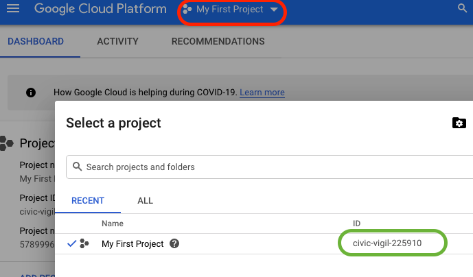
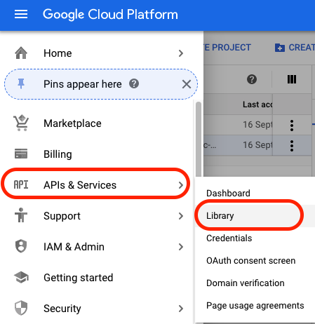
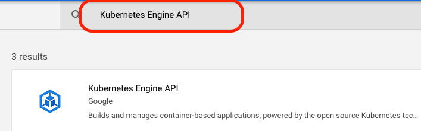
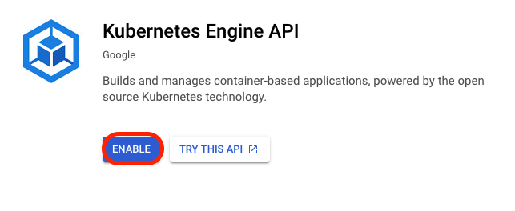
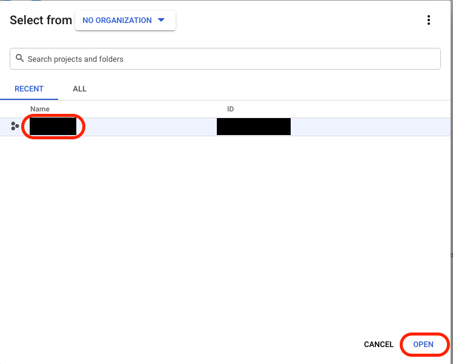
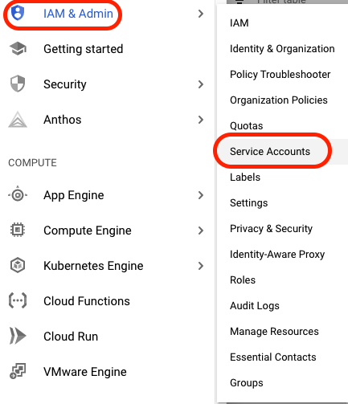
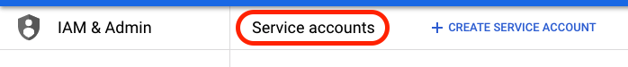
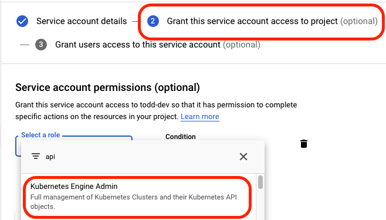
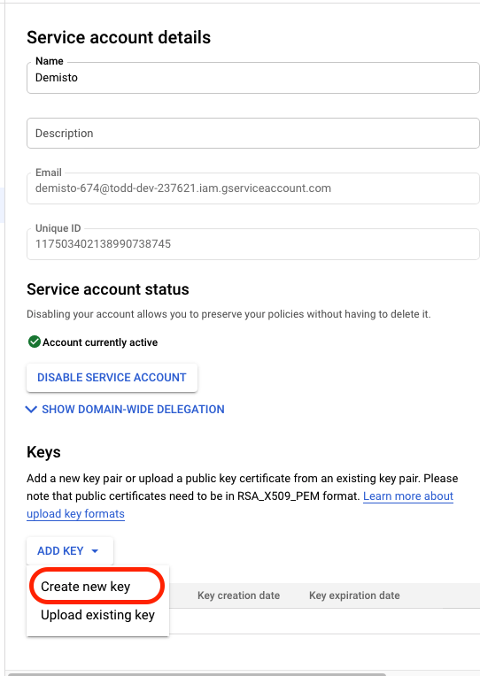

The Google Kubernetes Engine integration is used for building and managing container based
applications in Google Cloud Platform (GCP), powered by the open source Kubernetes technology.

Command, argument, and output desctiptions were taken from the Google documentation.

## Use Cases

* Mange existing GKE clusters.

* Mange existing GKE node-pools.

## Playbooks

* Google Kubernetes Engine Operations Generic Polling.


## Configure Google Kubernetes Engine setup

1. Select or create a Cloud Platform project:

   

   > The value in the `ID` column (marked in green) will be used from this point on as the `project id`.

2. Enable the Google Container Engine API:

   1. Under the main menu, select `APIs & Services` -> 'Libary':

      

   2. Search for `Kubernetes Engine API`:

      

   3. Click `Enable`:

      

   4. Select the project and click 'OPEN':

      

3. Create a service account with correct restricted permissions:

   1. Under the main menu, select `IAM & Admin` -> `Service Accounts`:

      

   2. In the top bar, select `CREATE SERVICE ACCOUNT`:

      

   3. In step number 2, under role, select `Kubernetes Engine Admin`:

      

   4. Under the main menu, select `IAM & Admin` -> `Service Accounts` and open the account you just created.

   5. Generate new credentials:

      1. On the Service account details page, under Keys, click ADD KEY and select Create new key:

         

      

      2. Under Key type, select `JSON` and click `CREATE`. Save the credentials in a secure location. You will need the generated `credentials.json` file when you configure the instance in Cortex XSOAR:

         

## Configure GoogleKubernetesEngine on Cortex XSOAR

1. Navigate to **Settings** > **Integrations** > **Servers & Services**.
2. Search for GoogleKubernetesEngine.
3. Generate `credentials.json` file by instruction in  [Google documentation](https://developers.google.com/identity/protocols/oauth2/web-server#creatingcred).
4. Click **Add instance** to create and configure a new integration instance.

| **Parameter** | **Description** | **Required** |
| --- | --- | --- |
| credentials_json | JSON credentials - The content of the generated `credentials.json` file. | True |
| default_project | Default project id - Can be overwriten in commands execution. | True |
| default_zone | Default zone - Can be overwriten in commands execution. | True |

4. Click **Test** to validate the URLs, `credentials.json`, and connection.

## Commands

You can execute these commands from the Cortex XSOAR CLI, as part of an automation, or in a playbook.
After you successfully execute a command, a DBot message appears in the War Room with the command details.

### gcloud-clusters-list

***
Lists all clusters owned by a project in either the specified zone or all zones.


#### Base Command

`gcloud-clusters-list`

#### Input

| **Argument Name** | **Description** | **Required** |
| --- | --- | --- |
| project | The Google Developers Console project ID or project number. | Optional |
| zone | The name of the Google Compute Engine zone in which the cluster resides, leave empty for all zones. | Optional |


#### Context Output

| **Path** | **Type** | **Description** |
| --- | --- | --- |
| GKE.Cluster.Name | String | Cluster name. |
| GKE.Cluster.MasterAuth.ClusterCaCertificate | String | Base64\-encoded public certificate that is the root of trust for the cluster. |
| GKE.Cluster.LoggingService | String | The logging service the cluster should use to write metrics. |
| GKE.Cluster.MonitoringService | String | The monitoring service the cluster should use to write metrics. |
| GKE.Cluster.Network | String | The name of the Google Compute Engine network to which the cluster is connected. If left unspecified, the default network will be used. |
| GKE.Cluster.ClusterIpv4Cidr | String | The IP address range of the container pods in this cluster, in CIDR notation \(e.g. 10.0.0.24\). |
| GKE.Cluster.AddonsConfig.HttpLoadBalancing.Disabled | Boolean | Configuration for the http load balancing addon. |
| GKE.Cluster.AddonsConfig.HorizontalPodAutoscaling.Disabled | Boolean | Configuration for the horizontal pod autoscaling addon. |
| GKE.Cluster.AddonsConfig.KubernetesDashboard.Disabled | Boolean | Configuration for the kubernetes dashboard addon. |
| GKE.Cluster.AddonsConfig.NetworkPolicyConfig.Disabled | Boolean | Configuration for the network policy config addon. |
| GKE.Cluster.LegacyAbac.Enabled | Boolean | Configuration for the Legacy ABAC. |
| GKE.Cluster.SubNetwork | String | The name of the Google Compute Engine subnetwork to which the cluster is connected. |
| GKE.Cluster.NodePool.Name | String | Node pool name. |
| GKE.Cluster.NodePool.Config.MachineType | String | Node pool machine type. |
| GKE.Cluster.NodePool.Config.DiskSizeGb | Number | Size of the disk attached to each node, specified in GB. |
| GKE.Cluster.NodePool.Config.OauthScopes | String | The set of Google API scopes to be made available on all of the node VMs under the “default” service account. |
| GKE.Cluster.NodePool.Config.Metadata.disable-legacy-endpoints | String | legacy abac Status. |
| GKE.Cluster.NodePool.Config.ImageType | String | The desired image type for the node pool. |
| GKE.Cluster.NodePool.Config.ServiceAccount | String | The Google Cloud Platform Service Account to be used by the node VMs. If no Service Account is specified, the “default” service account is used. |
| GKE.Cluster.NodePool.Config.DiskType | String | Type of the disk attached to each node \(e.g. ‘pd\-standard’ or ‘pd\-ssd’\) If unspecified, the default disk type is ‘pd\- standard’. |
| GKE.Cluster.NodePool.Config.ShieldedInstanceConfig.EnableIntegrityMonitoring | Number | Defines whether the instance has integrity monitoring enabled. |
| GKE.Cluster.NodePool.InitialNodeCount | Number | The initial node count for the pool. |
| GKE.Cluster.NodePool.Autoscaling.Enabled | Number | Status of autoscaling. |
| GKE.Cluster.NodePool.Autoscaling.MinNodeCount | Number | Minimum number of nodes in the NodePool. Must be &gt;= 1 and &lt;= max\_node\_count. |
| GKE.Cluster.NodePool.Autoscaling.MaxNodeCount | Number | Maximum number of nodes in the NodePool. Must be &gt;= min\_node\_count. There has to enough quota to scale up the cluster. |
| GKE.Cluster.NodePool.Management.AutoRepair | Number | A flag that specifies whether the node auto\-repair is enabled for the node pool. |
| GKE.Cluster.NodePool.MaxPodsConstraint.MaxPodsPerNode | String | The constraint on the maximum number of pods that can be run simultaneously on a node in the node pool. |
| GKE.Cluster.NodePool.PodIpv4CidrSize | Number | The pod CIDR block size per node in this node pool. |
| GKE.Cluster.NodePool.SelfLink | String | Server\-defined URL for the resource. |
| GKE.Cluster.NodePool.Version | String | The version of the Kubernetes of this node. |
| GKE.Cluster.NodePool.InstanceGroupUrls | String | The resource URLs of the managed instance groups associated with this node pool. |
| GKE.Cluster.NodePool.Status | String | The status of the nodes in this pool instance. |
| GKE.Cluster.Locations | String | The desired list of Google Compute Engine zones in which the cluster’s nodes should be located. |
| GKE.Cluster.LabelFingerprint | String | The fingerprint of the set of labels for this cluster. |
| GKE.Cluster.IpAllocationPolicy.UseIpAliases | Number | Whether alias IPs will be used for pod IPs in the cluster. |
| GKE.Cluster.IpAllocationPolicy.ClusterIpv4Cidr | String | The IP address range of the container pods in this cluster, in CIDR notation \(e.g. 10.0.0.0/24\). |
| GKE.Cluster.IpAllocationPolicy.ServicesIpv4Cidr | String | The IP address range of the Kubernetes services in this cluster, in CIDR notation \(e.g. 10.0.0.0/24\). |
| GKE.Cluster.IpAllocationPolicy.ClusterSecondaryRangeName | String | The name of the secondary range to be used for the cluster CIDR block. The secondary range will be used for pod IP addresses. |
| GKE.Cluster.IpAllocationPolicy.ServicesSecondaryRangeName | String | The name of the secondary range to be used as for the services CIDR block. The secondary range will be used for service ClusterIPs. |
| GKE.Cluster.IpAllocationPolicy.ClusterIpv4CidrBlock | String | The IP address range for the cluster pod IPs. |
| GKE.Cluster.IpAllocationPolicy.ServicesIpv4CidrBlock | String | The IP address range of the services IPs in this cluster. |
| GKE.Cluster.MasterAuthorizedNetworksConfig.CIDR | String | CIDR which allowed to access master when enabled. |
| GKE.Cluster.MasterAuthorizedNetworksConfig.Enabled | String | CIDR which allowed to access master when enabled. |
| GKE.Cluster.MaintenancePolicy.ResourceVersion | String | A hash identifying the version of this policy. |
| GKE.Cluster.NetworkConfig.Network | String | The relative name of the Google Compute Engine. |
| GKE.Cluster.NetworkConfig.Subnetwork | String | The relative name of the Google Compute Engine subnetwork to which the cluster is connected. |
| GKE.Cluster.DefaultMaxPodsConstraint.MaxPodsPerNode | String | Constraint enforced on the max num of pods per node. |
| GKE.Cluster.DatabaseEncryption.State | String | Configuration of etcd encryption. |
| GKE.Cluster.SelfLink | String | erver\-defined URL for the resource. |
| GKE.Cluster.Endpoint | String | The IP address of this cluster’s master endpoint. |
| GKE.Cluster.InitialClusterVersion | String | The initial Kubernetes version for this cluster. |
| GKE.Cluster.CurrentMasterVersion | String | The current software version of the master endpoint. |
| GKE.Cluster.CreateTime | Date | The time the cluster was created, in RFC3339 text format. |
| GKE.Cluster.Status | String | The current status of this cluster. |
| GKE.Cluster.ServicesIpv4Cidr | String | The IP address range of the Kubernetes services in this cluster, in CIDR notation \(e.g. 10.0.0.0/24\).' |
| GKE.Cluster.Location | String | The name of the Google Compute Engine zone or region in which the cluster resides. |


#### Command Example

```!gcloud-clusters-list project=gcp-integrations zone=us-central1-c```

#### Context Example

```
{
    "GKE": {
        "Cluster": {
            "AddonsConfig": {
                "HorizontalPodAutoscaling": {
                    "Disabled": {}
                },
                "HttpLoadBalancing": {
                    "Disbaled": {}
                },
                "KubernetesDashboard": {
                    "Disabled": true
                },
                "NetworkPolicyConfig": {
                    "Disabled": null
                }
            },
            "AuthenticatorGroupsConfig": {},
            "ClusterIpv4Cidr": "xxxx",
            "CreateTime": "xxxx",
            "CurrentMasterVersion": "xxxx",
            "DatabaseEncryption": {
                "State": "DECRYPTED"
            },
            "DefaultMaxPodsConstraint": {
                "MaxPodsPerNode": "110"
            },
            "Endpoint": "xxxx",
            "InitialClusterVersion": "xxxx",
            "IpAllocationPolicy": {
                "ClusterIpv4Cidr": "xxxx",
                "ClusterIpv4CidrBlock": "xxxx",
                "ClusterSecondaryRangeName": "xxxx",
                "ServicesIpv4Cidr": "xxxx",
                "ServicesIpv4CidrBlock": "xxxx",
                "ServicesSecondaryRangeName": "xxxx",
                "UseIpAliases": true
            },
            "LabelFingerprint": "xxxx",
            "LegacyAbac": {
                "Enabled": null
            },
            "Location": "xxxx",
            "Locations": [
                "xxxx"
            ],
            "LoggingService": "google.com",
            "MaintenancePolicy": {
                "ResourceVersion": "xxxx"
            },
            "MasterAuth": {
                "ClusterCaCertificate": "xxxx"
            },
            "MasterAuthorizedNetworksConfig": {
                "CIDR": [],
                "Enabled": null
            },
            "MonitoringService": "google.com",
            "Name": "xxxx",
            "Network": "default",
            "NetworkConfig": {
                "Network": "xxxx",
                "Subnetwork": "xxxx"
            },
            "NetworkPolicy": {},
            "NodePools": [
                {
                    "Autoscaling": {
                        "Enabled": null,
                        "MaxNodeCount": null,
                        "MinNodeCount": null
                    },
                    "Config": {
                        "DiskSizeGb": 100,
                        "DiskType": "xxxx",
                        "ImageType": "xxxx",
                        "MachineType": "xxxx",
                        "Metadata": {
                            "DisableLegacyEndpoints": "true"
                        },
                        "OauthScopes": [
                            "https://www.google.com/auth/devstorage.read_only",
                            "https://www.google.com/auth/logging.write",
                            "https://www.google.com/auth/monitoring",
                            "https://www.google.com/auth/servicecontrol",
                            "https://www.google.com/auth/service.management.readonly",
                            "https://www.google.com/auth/trace.append"
                        ],
                        "ServiceAccount": "xxxx",
                        "ShieldedInstanceConfig": {
                            "EnableIntegrityMonitoring": true
                        }
                    },
                    "InitialNodeCount": 3,
                    "InstanceGroupUrls": [
                        "https://www.google.com/compute/v1/projects/"
                    ],
                    "Management": {
                        "AutoRepair": true
                    },
                    "MaxPodsConstraint": {
                        "MaxPodsPerNode": "110"
                    },
                    "Name": "default-pool",
                    "PodIpv4CidrSize": 24,
                    "SelfLink": "https://.googleapis.com/v1/projects/",
                    "Status": "RUNNING",
                    "Version": "xxxx"
                }
            ],
            "SelfLink": "https://.googleapis.com/v1/projects/",
            "ServicesIpv4Cidr": "xxxx",
            "Status": "RECONCILING",
            "SubNetwork": "default"
        }
    }
}
```

#### Human Readable Output

>### Clusters (Project=gcp-integrations, Zone=us-central1-c)

>|Location|Master IP|Master version|Name|Status|
>|---|---|---|---|---|
>| us-central1-c | xxxx | xxxx | xxxx | RECONCILING |

### gcloud-clusters-describe

***
Gets the details of a specific cluster.


#### Base Command

`gcloud-clusters-describe`

#### Input

| **Argument Name** | **Description** | **Required** |
| --- | --- | --- |
| project | The Google Developers Console project ID or project number. | Optional |
| cluster | The name of the cluster to retrieve. The name of the cluster to retrieve. | Required |
| zone | The name of the Google Compute Engine zone in which the cluster resides. | Optional |


#### Context Output

| **Path** | **Type** | **Description** |
| --- | --- | --- |
| GKE.Cluster.Name | String | Cluster name. |
| GKE.Cluster.MasterAuth.ClusterCaCertificate | String | Base64\-encoded public certificate that is the root of trust for the cluster. |
| GKE.Cluster.LoggingService | String | The logging service the cluster should use to write metrics. |
| GKE.Cluster.MonitoringService | String | The monitoring service the cluster should use to write metrics. |
| GKE.Cluster.Network | String | The name of the Google Compute Engine network to which the cluster is connected. If left unspecified, the default network will be used. |
| GKE.Cluster.ClusterIpv4Cidr | String | The IP address range of the container pods in this cluster, in CIDR notation \(e.g. 10.0.0.0/24\). |
| GKE.Cluster.AddonsConfig.HttpLoadBalancing.Disabled | Boolean | Configuration for the http load balancing addon. |
| GKE.Cluster.AddonsConfig.HorizontalPodAutoscaling.Disabled | Boolean | Configuration for the horizontal pod autoscaling addon. |
| GKE.Cluster.AddonsConfig.KubernetesDashboard.Disabled | Boolean | Configuration for the kubernetes dashboard addon. |
| GKE.Cluster.AddonsConfig.NetworkPolicyConfig.Disabled | Boolean | Configuration for the network policy config addon. |
| GKE.Cluster.LegacyAbac.Enabled | Boolean | Configuration for the Legacy ABAC. |
| GKE.Cluster.SubNetwork | String | The name of the Google Compute Engine subnetwork to which the cluster is connected. |
| GKE.Cluster.NodePool.Name | String | Node pool name. |
| GKE.Cluster.NodePool.Config.MachineType | String | Node pool machine type. |
| GKE.Cluster.NodePool.Config.DiskSizeGb | Number | Size of the disk attached to each node, specified in GB. |
| GKE.Cluster.NodePool.Config.OauthScopes | String | The set of Google API scopes to be made available on all of the node VMs under the “default” service account. |
| GKE.Cluster.NodePool.Config.Metadata.disable-legacy-endpoints | String | legacy abac Status. |
| GKE.Cluster.NodePool.Config.ImageType | String | The desired image type for the node pool. |
| GKE.Cluster.NodePool.Config.ServiceAccount | String | The Google Cloud Platform Service Account to be used by the node VMs. If no Service Account is specified, the “default” service account is used. |
| GKE.Cluster.NodePool.Config.DiskType | String | Type of the disk attached to each node \(e.g. ‘pd\-standard’ or ‘pd\-ssd’\) If unspecified, the default disk type is ‘pd\- standard’. |
| GKE.Cluster.NodePool.Config.ShieldedInstanceConfig.EnableIntegrityMonitoring | Number | Defines whether the instance has integrity monitoring enabled. |
| GKE.Cluster.NodePool.InitialNodeCount | Number | The initial node count for the pool. |
| GKE.Cluster.NodePool.Autoscaling.Enabled | Number | Status of autoscaling. |
| GKE.Cluster.NodePool.Autoscaling.MinNodeCount | Number | Minimum number of nodes in the NodePool. Must be &gt;= 1 and &lt;= max\_node\_count. |
| GKE.Cluster.NodePool.Autoscaling.MaxNodeCount | Number | Maximum number of nodes in the NodePool. Must be &gt;= min\_node\_count. There has to enough quota to scale up the cluster. |
| GKE.Cluster.NodePool.Management.AutoRepair | Number | A flag that specifies whether the node auto\-repair is enabled for the node pool. |
| GKE.Cluster.NodePool.MaxPodsConstraint.MaxPodsPerNode | String | The constraint on the maximum number of pods that can be run simultaneously on a node in the node pool. |
| GKE.Cluster.NodePool.PodIpv4CidrSize | Number | The pod CIDR block size per node in this node pool. |
| GKE.Cluster.NodePool.SelfLink | String | Server\-defined URL for the resource. |
| GKE.Cluster.NodePool.Version | String | The version of the Kubernetes of this node. |
| GKE.Cluster.NodePool.InstanceGroupUrls | String | The resource URLs of the managed instance groups associated with this node pool. |
| GKE.Cluster.NodePool.Status | String | The status of the nodes in this pool instance. |
| GKE.Cluster.Locations | String | The desired list of Google Compute Engine zones in which the cluster’s nodes should be located. |
| GKE.Cluster.LabelFingerprint | String | The fingerprint of the set of labels for this cluster. |
| GKE.Cluster.IpAllocationPolicy.UseIpAliases | Number | Whether alias IPs will be used for pod IPs in the cluster. |
| GKE.Cluster.IpAllocationPolicy.ClusterIpv4Cidr | String | The IP address range of the container pods in this cluster, in CIDR notation \(e.g. 10.0.0.0/24\). |
| GKE.Cluster.IpAllocationPolicy.ServicesIpv4Cidr | String | The IP address range of the Kubernetes services in this cluster, in CIDR notation \(e.g. 10.0.0.0/24\). |
| GKE.Cluster.IpAllocationPolicy.ClusterSecondaryRangeName | String | The name of the secondary range to be used for the cluster CIDR block. The secondary range will be used for pod IP addresses. |
| GKE.Cluster.IpAllocationPolicy.ServicesSecondaryRangeName | String | The name of the secondary range to be used as for the services CIDR block. The secondary range will be used for service ClusterIPs. |
| GKE.Cluster.IpAllocationPolicy.ClusterIpv4CidrBlock | String | The IP address range for the cluster pod IPs. |
| GKE.Cluster.IpAllocationPolicy.ServicesIpv4CidrBlock | String | The IP address range of the services IPs in this cluster. |
| GKE.Cluster.MasterAuthorizedNetworksConfig.CIDR | String | CIDR which allowed to access master when enabled. |
| GKE.Cluster.MasterAuthorizedNetworksConfig.Enabled | String | CIDR which allowed to access master when enabled. |
| GKE.Cluster.MaintenancePolicy.ResourceVersion | String | A hash identifying the version of this policy. |
| GKE.Cluster.NetworkConfig.Network | String | The relative name of the Google Compute Engine. |
| GKE.Cluster.NetworkConfig.Subnetwork | String | The relative name of the Google Compute Engine subnetwork to which the cluster is connected. |
| GKE.Cluster.DefaultMaxPodsConstraint.MaxPodsPerNode | String | Constraint enforced on the max num of pods per node. |
| GKE.Cluster.DatabaseEncryption.State | String | Configuration of etcd encryption. |
| GKE.Cluster.SelfLink | String | erver\-defined URL for the resource. |
| GKE.Cluster.Endpoint | String | The IP address of this cluster’s master endpoint. |
| GKE.Cluster.InitialClusterVersion | String | The initial Kubernetes version for this cluster. |
| GKE.Cluster.CurrentMasterVersion | String | The current software version of the master endpoint. |
| GKE.Cluster.CreateTime | Date | The time the cluster was created, in RFC3339 text format. |
| GKE.Cluster.Status | String | The current status of this cluster. |
| GKE.Cluster.ServicesIpv4Cidr | String | The IP address range of the Kubernetes services in this cluster, in CIDR notation \(e.g. 10.0.0.0/24\).' |
| GKE.Cluster.Location | String | The name of the Google Compute Engine zone or region in which the cluster resides. |


#### Command Example

```!gcloud-clusters-describe project=gcp-integrations zone=us-central1-c cluster=xsoar-integration```

#### Context Example

```
{
    "GKE": {
        "Cluster": {
            "AddonsConfig": {
                "HorizontalPodAutoscaling": {
                    "Disabled": {}
                },
                "HttpLoadBalancing": {
                    "Disbaled": {}
                },
                "KubernetesDashboard": {
                    "Disabled": true
                },
                "NetworkPolicyConfig": {
                    "Disabled": null
                }
            },
            "AuthenticatorGroupsConfig": {},
            "ClusterIpv4Cidr": "xxxx",
            "CreateTime": "xxxx",
            "CurrentMasterVersion": "xxxx",
            "DatabaseEncryption": {
                "State": "DECRYPTED"
            },
            "DefaultMaxPodsConstraint": {
                "MaxPodsPerNode": "110"
            },
            "Endpoint": "xxxx",
            "InitialClusterVersion": "xxxx",
            "IpAllocationPolicy": {
                "ClusterIpv4Cidr": "xxxx",
                "ClusterIpv4CidrBlock": "xxxx",
                "ClusterSecondaryRangeName": "xxxx",
                "ServicesIpv4Cidr": "xxxx",
                "ServicesIpv4CidrBlock": "xxxx",
                "ServicesSecondaryRangeName": "xxxx",
                "UseIpAliases": true
            },
            "LabelFingerprint": "xxxx",
            "LegacyAbac": {
                "Enabled": null
            },
            "Location": "xxxx",
            "Locations": [
                "xxxx"
            ],
            "LoggingService": "google.com",
            "MaintenancePolicy": {
                "ResourceVersion": "xxxx"
            },
            "MasterAuth": {
                "ClusterCaCertificate": "xxxx"
            },
            "MasterAuthorizedNetworksConfig": {
                "CIDR": [],
                "Enabled": null
            },
            "MonitoringService": "google.com",
            "Name": "xxxx",
            "Network": "default",
            "NetworkConfig": {
                "Network": "xxxx",
                "Subnetwork": "xxxx"
            },
            "NetworkPolicy": {},
            "NodePools": [
                {
                    "Autoscaling": {
                        "Enabled": null,
                        "MaxNodeCount": null,
                        "MinNodeCount": null
                    },
                    "Config": {
                        "DiskSizeGb": 100,
                        "DiskType": "xxxx",
                        "ImageType": "xxxx",
                        "MachineType": "xxxx",
                        "Metadata": {
                            "DisableLegacyEndpoints": "true"
                        },
                        "OauthScopes": [
                            "https://www.google.com/auth/devstorage.read_only",
                            "https://www.google.com/auth/logging.write",
                            "https://www.google.com/auth/monitoring",
                            "https://www.google.com/auth/servicecontrol",
                            "https://www.google.com/auth/service.management.readonly",
                            "https://www.google.com/auth/trace.append"
                        ],
                        "ServiceAccount": "xxxx",
                        "ShieldedInstanceConfig": {
                            "EnableIntegrityMonitoring": true
                        }
                    },
                    "InitialNodeCount": 3,
                    "InstanceGroupUrls": [
                        "https://www.google.com/compute/v1/projects/"
                    ],
                    "Management": {
                        "AutoRepair": true
                    },
                    "MaxPodsConstraint": {
                        "MaxPodsPerNode": "110"
                    },
                    "Name": "default-pool",
                    "PodIpv4CidrSize": 24,
                    "SelfLink": "https://.googleapis.com/v1/projects/",
                    "Status": "RUNNING",
                    "Version": "xxxx"
                }
            ],
            "SelfLink": "https://.googleapis.com/v1/projects/",
            "ServicesIpv4Cidr": "xxxx",
            "Status": "RECONCILING",
            "SubNetwork": "default"
        }
    }
}
```

#### Human Readable Output

>### Clusters (Project=gcp-integrations, Zone=us-central1-c, Cluster=xsoar-integration)

>|Location|Master IP|Master version|Name|Status|
>|---|---|---|---|---|
>| us-central1-c | xxxx | xxxx | xxxx | RECONCILING |


### gcloud-clusters-set-muster-auth

***
Enable basic (username/password) auth for the cluster. Enable will create user admin with generated password.


#### Base Command

`gcloud-clusters-set-muster-auth`

#### Input

| **Argument Name** | **Description** | **Required** |
| --- | --- | --- |
| project | The Google Developers Console project ID or project number. | Optional |
| cluster | The name of the cluster to retrieve. | Required |
| zone | The name of the Google Compute Engine zone in which the cluster resides. | Optional |
| basic_auth | Sets master enabled or disabled. | Required |


#### Context Output

| **Path** | **Type** | **Description** |
| --- | --- | --- |
| GKE.Operation.Name | String | The server\-assigned ID for the operation |
| GKE.Operation.Zone | String | The name of the Google Compute Engine zone in which the operation is taking place. This field is deprecated, use location instead. |
| GKE.Operation.OperationType | String | Operaion type. \(update, etc.\) |
| GKE.Operation.Status | String | Operation status \(Running, Finished\). |
| GKE.Operation.SelfLink | Unknown | Server\-defined URL for the resource. |
| GKE.Operation.TargetLink | String | Server\-defined URL for the target of the operation. |
| GKE.Operation.StartTime | Date | The time the operation started, in RFC3339 text format. |


#### Command Example

``` !gcloud-clusters-set-muster-auth project=gcp-integrations zone=us-central1-c cluster=xsoar-integration basic_auth=enable```

#### Context Example

```
{
    "GKE": {
        "Operation": {
            "Name": "operation-xxxx",
            "OperationType": "UPDATE_CLUSTER",
            "SelfLink": "https://container.google.com/v1/projects/",
            "StartTime": "xxxx",
            "Status": "DONE",
            "TargetLink": "https://container.google.com/v1/projects/",
            "Zone": "xxxx"
        }
    }
}
```

#### Human Readable Output

>### Project gcp-integrations - Zone us-central1-c - Operation operation-xxxx
>
>| Name           | Zone | Status | StartTime |
>| -------------- | ---- | ------ | --------- |
>| operation-xxxx | xxxx | DONE   | xxxx      |


### gcloud-clusters-set-addons

***
Sets the addons for a specific cluster.


#### Base Command

`gcloud-clusters-set-addons`

#### Input

| **Argument Name** | **Description** | **Required** |
| --- | --- | --- |
| project | The Google Developers Console project ID or project number. | Optional |
| cluster | The name of the cluster to retrieve. The name of the cluster to retrieve. | Required |
| zone | The name of the Google Compute Engine zone in which the cluster resides. | Optional |
| http_load_balancing | Configuration for the HTTP (L7) load balancing controller addon, which makes it easy to set up HTTP load balancers for services in a cluster. | Optional |
| kubernetes_dashboard | Configuration for the Kubernetes Dashboard.  | Optional |
| network_policy | Configuration for NetworkPolicy.<br/>This only tracks whether the addon is enabled or not on the Master, it does not track whether network policy is enabled for the nodes. | Optional |


#### Context Output

| **Path** | **Type** | **Description** |
| --- | --- | --- |
| GKE.Operation.Name | String | The server\-assigned ID for the operation |
| GKE.Operation.Zone | String | The name of the Google Compute Engine zone in which the operation is taking place. This field is deprecated, use location instead. |
| GKE.Operation.OperationType | String | Operaion type. \(update, etc.\) |
| GKE.Operation.Status | String | Operation status \(Running, Finished\). |
| GKE.Operation.SelfLink | Unknown | Server\-defined URL for the resource. |
| GKE.Operation.TargetLink | String | Server\-defined URL for the target of the operation. |
| GKE.Operation.StartTime | Date | The time the operation started, in RFC3339 text format. |


#### Command Example

```!gcloud-clusters-set-addons project=gcp-integrations zone=us-central1-c cluster=xsoar-integration http_load_balancing=enable kubernetes_dashboard=disable network_policy=enable```

#### Context Example

```
{
    "GKE": {
        "Operation": {
            "Name": "operation-xxxx",
            "OperationType": "UPDATE_CLUSTER",
            "SelfLink": "https://container.google.com/v1/projects/",
            "StartTime": "xxxx",
            "Status": "DONE",
            "TargetLink": "https://container.google.com/v1/projects/",
            "Zone": "xxxx"
        }
    }
}
```

#### Human Readable Output

>### Project gcp-integrations - Zone us-central1-c - Operation operation-xxxx
>
>| Name           | Zone | Status | StartTime |
>| -------------- | ---- | ------ | --------- |
>| operation-xxxx | xxxx | DONE   | xxxx      |

### gcloud-clusters-set-legacy-auth

***
Configuration for the legacy Attribute Based Access Control authorization mode.


#### Base Command

`gcloud-clusters-set-legacy-auth`

#### Input

| **Argument Name** | **Description** | **Required** |
| --- | --- | --- |
| project | The Google Developers Console project ID or project number. | Optional |
| cluster | The name of the cluster to retrieve. The name of the cluster to retrieve. | Required |
| zone | The name of the Google Compute Engine zone in which the cluster resides. | Optional |
| enable | Whether the ABAC authorizer is enabled for this cluster. When enabled, identities in the system, including service accounts, nodes, and controllers, will have statically granted permissions beyond those provided by the RBAC configuration or IAM. | Required |


#### Context Output

| **Path** | **Type** | **Description** |
| --- | --- | --- |
| GKE.Operation.Name | String | The server\-assigned ID for the operation |
| GKE.Operation.Zone | String | The name of the Google Compute Engine zone in which the operation is taking place. This field is deprecated, use location instead. |
| GKE.Operation.OperationType | String | Operaion type. \(update, etc.\) |
| GKE.Operation.Status | String | Operation status \(Running, Finished\). |
| GKE.Operation.SelfLink | Unknown | Server\-defined URL for the resource. |
| GKE.Operation.TargetLink | String | Server\-defined URL for the target of the operation. |
| GKE.Operation.StartTime | Date | The time the operation started, in RFC3339 text format. |


#### Command Example

``` !gcloud-clusters-set-legacy-auth project=gcp-integrations zone=us-central1-c cluster=xsoar-integration enable=true```

#### Context Example

```
{
    "GKE": {
        "Operation": {
            "Name": "operation-xxxx",
            "OperationType": "UPDATE_CLUSTER",
            "SelfLink": "https://container.google.com/v1/projects/",
            "StartTime": "xxxx",
            "Status": "DONE",
            "TargetLink": "https://container.google.com/v1/projects/",
            "Zone": "xxxx"
        }
    }
}
```

#### Human Readable Output

>### Project gcp-integrations - Zone us-central1-c - Operation operation-xxxx
>
>| Name           | Zone | Status | StartTime |
>| -------------- | ---- | ------ | --------- |
>| operation-xxxx | xxxx | DONE   | xxxx      |


### gcloud-clusters-set-master-authorized-network

***
Configuration options for the master authorized networks feature.
Enabled master authorized networks will disallow all external traffic to access Kubernetes master through HTTPS except traffic from the given CIDR blocks, Google Compute Engine Public IPs and Google Prod IPs.


#### Base Command

`gcloud-clusters-set-master-authorized-network`

#### Input

| **Argument Name** | **Description** | **Required** |
| --- | --- | --- |
| project | The Google Developers Console project ID or project number. | Optional |
| cluster | The name of the cluster to retrieve. The name of the cluster to retrieve. | Required |
| zone | The name of the Google Compute Engine zone in which the cluster resides. | Optional |
| enable | Whether or not master authorized networks is enabled. | Required |
| cidrs | Cidrs define up to 50 external networks that could access Kubernetes master through HTTPS. Comma-seprated e.g. "192.168.0.0/24,10.0.0.0/32" | Optional |


#### Context Output

| **Path** | **Type** | **Description** |
| --- | --- | --- |
| GKE.Operation.Name | String | The server\-assigned ID for the operation |
| GKE.Operation.Zone | String | The name of the Google Compute Engine zone in which the operation is taking place. This field is deprecated, use location instead. |
| GKE.Operation.OperationType | String | Operaion type. \(update, etc.\) |
| GKE.Operation.Status | String | Operation status \(Running, Finished\). |
| GKE.Operation.SelfLink | Unknown | Server\-defined URL for the resource. |
| GKE.Operation.TargetLink | String | Server\-defined URL for the target of the operation. |
| GKE.Operation.StartTime | Date | The time the operation started, in RFC3339 text format. |

#### Command Example

``` !gcloud-clusters-set-master-authorized-network project=gcp-integrations zone=us-central1-c cluster=xsoar-integration enable=true cidrs=192.168.0.0/24```

#### Context Example

```
{
    "GKE": {
        "Operation": {
            "Name": "operation-xxxx",
            "OperationType": "UPDATE_CLUSTER",
            "SelfLink": "https://container.google.com/v1/projects/",
            "StartTime": "xxxx",
            "Status": "DONE",
            "TargetLink": "https://container.google.com/v1/projects/",
            "Zone": "xxxx"
        }
    }
}
```

#### Human Readable Output

>### Project gcp-integrations - Zone us-central1-c - Operation operation-xxxx
>
>| Name           | Zone | Status | StartTime |
>| -------------- | ---- | ------ | --------- |
>| operation-xxxx | xxxx | DONE   | xxxx      |

### gcloud-clusters-set-k8s-stackdriver

***
Enable or Disable k8s stackdriver. Important - To use this functinality the user should enable manually logging to "monitoring.googleapis.com/kubernetes" manulally via the GCP console.


#### Base Command

`gcloud-clusters-set-k8s-stackdriver`

#### Input

| **Argument Name** | **Description** | **Required** |
| --- | --- | --- |
| project | The Google Developers Console project ID or project number. | Optional |
| cluster | The name of the cluster to retrieve. The name of the cluster to retrieve. | Required |
| zone | The name of the Google Compute Engine zone in which the cluster resides. | Required |
| enable | Whether or not k8s stackdriver is enabled. | Required |


#### Context Output

| **Path** | **Type** | **Description** |
| --- | --- | --- |
| GKE.Operation.Name | String | The server\-assigned ID for the operation |
| GKE.Operation.Zone | String | The name of the Google Compute Engine zone in which the operation is taking place. This field is deprecated, use location instead. |
| GKE.Operation.OperationType | String | Operaion type. \(update, etc.\) |
| GKE.Operation.Status | String | Operation status \(Running, Finished\). |
| GKE.Operation.SelfLink | Unknown | Server\-defined URL for the resource. |
| GKE.Operation.TargetLink | String | Server\-defined URL for the target of the operation. |
| GKE.Operation.StartTime | Date | The time the operation started, in RFC3339 text format. |

#### Command Example

``` !gcloud-clusters-set-master-authorized-network project=gcp-integrations zone=us-central1-c cluster=xsoar-integration enable=true cidrs=192.168.0.0.24```

#### Context Example

```
{
    "GKE": {
        "Operation": {
            "Name": "operation-xxxx",
            "OperationType": "UPDATE_CLUSTER",
            "SelfLink": "https://container.google.com/v1/projects/",
            "StartTime": "xxxx",
            "Status": "DONE",
            "TargetLink": "https://container.google.com/v1/projects/",
            "Zone": "xxxx"
        }
    }
}
```

#### Human Readable Output

>### Project gcp-integrations - Zone us-central1-c - Operation operation-xxxx
>
>| Name           | Zone | Status | StartTime |
>| -------------- | ---- | ------ | --------- |
>| operation-xxxx | xxxx | DONE   | xxxx      |

### gcloud-clusters-set-binary-auth

***
Enable or Disable binary auth.


#### Base Command

`gcloud-clusters-set-binary-auth`

#### Input

| **Argument Name** | **Description** | **Required** |
| --- | --- | --- |
| project | The Google Developers Console project ID or project number. | Optional |
| cluster | The name of the cluster to retrieve. The name of the cluster to retrieve. | Required |
| zone | The name of the Google Compute Engine zone in which the cluster resides. | Optional |
| enable | Whether or not master binary auth is enabled. | Required |


#### Context Output

| **Path** | **Type** | **Description** |
| --- | --- | --- |
| GKE.Operation.Name | String | The server\-assigned ID for the operation |
| GKE.Operation.Zone | String | The name of the Google Compute Engine zone in which the operation is taking place. This field is deprecated, use location instead. |
| GKE.Operation.OperationType | String | Operaion type. \(update, etc.\) |
| GKE.Operation.Status | String | Operation status \(Running, Finished\). |
| GKE.Operation.SelfLink | Unknown | Server\-defined URL for the resource. |
| GKE.Operation.TargetLink | String | Server\-defined URL for the target of the operation. |
| GKE.Operation.StartTime | Date | The time the operation started, in RFC3339 text format. |


#### Command Example

```!gcloud-clusters-set-binary-auth project=gcp-integrations zone=us-central1-c cluster=xsoar-integration enable=true```

#### Context Example

```
{
    "GKE": {
        "Operation": {
            "Name": "operation-xxxx",
            "OperationType": "UPDATE_CLUSTER",
            "SelfLink": "https://container.google.com/v1/projects/",
            "StartTime": "xxxx",
            "Status": "DONE",
            "TargetLink": "https://container.google.com/v1/projects/",
            "Zone": "xxxx"
        }
    }
}
```

#### Human Readable Output

>### Project gcp-integrations - Zone us-central1-c - Operation operation-xxxx
>
>| Name           | Zone | Status | StartTime |
>| -------------- | ---- | ------ | --------- |
>| operation-xxxx | xxxx | DONE   | xxxx      |

### gcloud-clusters-set-intra-node-visibility

***
Enable or Disable for intra node visibility in cluster.


#### Base Command

`gcloud-clusters-set-intra-node-visibility`

#### Input

| **Argument Name** | **Description** | **Required** |
| --- | --- | --- |
| project | The Google Developers Console project ID or project number. | Optional |
| cluster | The name of the cluster to retrieve. The name of the cluster to retrieve. | Required |
| zone | The name of the Google Compute Engine zone in which the cluster resides. | Optional |
| enable | Whether or not intra node visibility is enabled. | Required |


#### Context Output

| **Path** | **Type** | **Description** |
| --- | --- | --- |
| GKE.Operation.Name | String | The server\-assigned ID for the operation |
| GKE.Operation.Zone | String | The name of the Google Compute Engine zone in which the operation is taking place. This field is deprecated, use location instead. |
| GKE.Operation.OperationType | String | Operaion type. \(update, etc.\) |
| GKE.Operation.Status | String | Operation status \(Running, Finished\). |
| GKE.Operation.SelfLink | Unknown | Server\-defined URL for the resource. |
| GKE.Operation.TargetLink | String | Server\-defined URL for the target of the operation. |
| GKE.Operation.StartTime | Date | The time the operation started, in RFC3339 text format. |

#### Command Example

```!gcloud-clusters-set-intra-node-visibility project=gcp-integrations zone=us-central1-c cluster=xsoar-integration enable=true```

#### Context Example

```
{
    "GKE": {
        "Operation": {
            "Name": "operation-xxxx",
            "OperationType": "UPDATE_CLUSTER",
            "SelfLink": "https://container.google.com/v1/projects/",
            "StartTime": "xxxx",
            "Status": "DONE",
            "TargetLink": "https://container.google.com/v1/projects/",
            "Zone": "xxxx"
        }
    }
}
```

#### Human Readable Output

>### Project gcp-integrations - Zone us-central1-c - Operation operation-xxxx
>
>| Name           | Zone | Status | StartTime |
>| -------------- | ---- | ------ | --------- |
>| operation-xxxx | xxxx | DONE   | xxxx      |

### gcloud-node-pool-list

***
Lists the node pools for a cluster.


#### Base Command

`gcloud-node-pool-list`

#### Input

| **Argument Name** | **Description** | **Required** |
| --- | --- | --- |
| project | The Google Developers Console project ID or project number. | Optional |
| cluster | The name of the cluster to retrieve. The name of the cluster to retrieve. | Required |
| zone | The name of the Google Compute Engine zone in which the cluster resides. | Optional |


#### Context Output

| **Path** | **Type** | **Description** |
| --- | --- | --- |
| GKE.NodePool.Name | String | Node pool name. |
| GKE.NodePool.Config.MachineType | String | Node pool machine type. |
| GKE.NodePool.Config.DiskSizeGb | Number | Size of the disk attached to each node, specified in GB. |
| GKE.NodePool.Config.OauthScopes | String | The set of Google API scopes to be made available on all of the node VMs under the “default” service account. |
| GKE.NodePool.Config.Metadata.disable-legacy-endpoints | String | legacy abac Status. |
| GKE.NodePool.Config.ImageType | String | The desired image type for the node pool. |
| GKE.NodePool.Config.ServiceAccount | String | The Google Cloud Platform Service Account to be used by the node VMs. If no Service Account is specified, the “default” service account is used. |
| GKE.NodePool.Config.DiskType | String | Type of the disk attached to each node \(e.g. ‘pd\-standard’ or ‘pd\-ssd’\) If unspecified, the default disk type is ‘pd\- standard’. |
| GKE.NodePool.Config.ShieldedInstanceConfig.EnableIntegrityMonitoring | Number | Defines whether the instance has integrity monitoring enabled. |
| GKE.NodePool.InitialNodeCount | Number | The initial node count for the pool. |
| GKE.NodePool.Autoscaling.Enabled | Number | Status of autoscaling. |
| GKE.NodePool.Autoscaling.MinNodeCount | Number | Minimum number of nodes in the NodePool. Must be &gt;= 1 and &lt;= max\_node\_count. |
| GKE.NodePool.Autoscaling.MaxNodeCount | Number | Maximum number of nodes in the NodePool. Must be &gt;= min\_node\_count. There has to enough quota to scale up the cluster. |
| GKE.NodePool.Management.AutoRepair | Number | A flag that specifies whether the node auto\-repair is enabled for the node pool. |
| GKE.NodePool.MaxPodsConstraint.MaxPodsPerNode | String | The constraint on the maximum number of pods that can be run simultaneously on a node in the node pool. |
| GKE.NodePool.PodIpv4CidrSize | Number | The pod CIDR block size per node in this node pool. |
| GKE.NodePool.SelfLink | String | Server\-defined URL for the resource. |
| GKE.NodePool.Version | String | The version of the Kubernetes of this node. |
| GKE.NodePool.InstanceGroupUrls | String | The resource URLs of the managed instance groups associated with this node pool. |
| GKE.NodePool.Status | String | The status of the nodes in this pool instance. |


#### Command Example

```!gcloud-node-pool-list project=gcp-integrations zone=us-central1-c cluster=xsoar-integration```

#### Context Example

```
{
    "GKE": {
        "NodePool": {
            "Autoscaling": {
                "Enabled": null,
                "MaxNodeCount": null,
                "MinNodeCount": null
            },
            "Config": {
                "DiskSizeGb": 100,
                "DiskType": "xxxx",
                "ImageType": "xxxx",
                "MachineType": "xxxx",
                "Metadata": {
                    "DisableLegacyEndpoints": "true"
                },
                "OauthScopes": [
                    "https://www.google.com/auth/devstorage.read_only",
                    "https://www.google.com/auth/logging.write",
                    "https://www.google.com/auth/monitoring",
                    "https://www.google.com/auth/servicecontrol",
                    "https://www.google.com/auth/service.management.readonly",
                    "https://www.google.com/auth/trace.append"
                ],
                "ServiceAccount": "default",
                "ShieldedInstanceConfig": {
                    "EnableIntegrityMonitoring": true
                }
            },
            "InitialNodeCount": 3,
            "InstanceGroupUrls": [
                "https://www.google.com/compute/v1/projects/"
            ],
            "Management": {
                "AutoRepair": true
            },
            "MaxPodsConstraint": {
                "MaxPodsPerNode": "110"
            },
            "Name": "xxxx",
            "PodIpv4CidrSize": 24,
            "SelfLink": "https://container.google.com/v1/projects/",
            "Status": "RUNNING",
            "Version": "xxxx"
        }
    }
}
```

#### Human Readable Output

>### Node-pools (Project=gcp-integrations, Zone=us-central1-c, Cluster=xsoar-integration)

>|Disk size|Machine Type|Name|Node version|
>|---|---|---|---|
>| 100 | n1-standard-1 | default-pool | 1.16.9-gke.2 |


### gcloud-node-pool-describe

***
Retrieves the requested node pool.


#### Base Command

`gcloud-node-pool-describe`

#### Input

| **Argument Name** | **Description** | **Required** |
| --- | --- | --- |
| project | The Google Developers Console project ID or project number. | Optional |
| cluster | The name of the cluster to retrieve. The name of the cluster to retrieve. | Required |
| zone | The name of the Google Compute Engine zone in which the cluster resides. | Optional |
| node_pool | The name of the Google Compute Engine node pool. | Required |


#### Context Output

| **Path** | **Type** | **Description** |
| --- | --- | --- |
| GKE.NodePool.Name | String | Node pool name. |
| GKE.NodePool.Config.MachineType | String | Node pool machine type. |
| GKE.NodePool.Config.DiskSizeGb | Number | Size of the disk attached to each node, specified in GB. |
| GKE.NodePool.Config.OauthScopes | String | The set of Google API scopes to be made available on all of the node VMs under the “default” service account. |
| GKE.NodePool.Config.Metadata.disable-legacy-endpoints | String | legacy abac Status. |
| GKE.NodePool.Config.ImageType | String | The desired image type for the node pool. |
| GKE.NodePool.Config.ServiceAccount | String | The Google Cloud Platform Service Account to be used by the node VMs. If no Service Account is specified, the “default” service account is used. |
| GKE.NodePool.Config.DiskType | String | Type of the disk attached to each node \(e.g. ‘pd\-standard’ or ‘pd\-ssd’\) If unspecified, the default disk type is ‘pd\- standard’. |
| GKE.NodePool.Config.ShieldedInstanceConfig.EnableIntegrityMonitoring | Number | Defines whether the instance has integrity monitoring enabled. |
| GKE.NodePool.InitialNodeCount | Number | The initial node count for the pool. |
| GKE.NodePool.Autoscaling.Enabled | Number | Status of autoscaling. |
| GKE.NodePool.Autoscaling.MinNodeCount | Number | Minimum number of nodes in the NodePool. Must be &gt;= 1 and &lt;= max\_node\_count. |
| GKE.NodePool.Autoscaling.MaxNodeCount | Number | Maximum number of nodes in the NodePool. Must be &gt;= min\_node\_count. There has to enough quota to scale up the cluster. |
| GKE.NodePool.Management.AutoRepair | Number | A flag that specifies whether the node auto\-repair is enabled for the node pool. |
| GKE.NodePool.MaxPodsConstraint.MaxPodsPerNode | String | The constraint on the maximum number of pods that can be run simultaneously on a node in the node pool. |
| GKE.NodePool.PodIpv4CidrSize | Number | The pod CIDR block size per node in this node pool. |
| GKE.NodePool.SelfLink | String | Server\-defined URL for the resource. |
| GKE.NodePool.Version | String | The version of the Kubernetes of this node. |
| GKE.NodePool.InstanceGroupUrls | String | The resource URLs of the managed instance groups associated with this node pool. |
| GKE.NodePool.Status | String | The status of the nodes in this pool instance. |


#### Command Example

```!gcloud-node-pool-describe project=gcp-integrations zone=us-central1-c cluster=xsoar-integration node_pool=default-pool```

#### Context Example

```
{
    "GKE": {
        "NodePool": {
            "Autoscaling": {
                "Enabled": null,
                "MaxNodeCount": null,
                "MinNodeCount": null
            },
            "Config": {
                "DiskSizeGb": 100,
                "DiskType": "xxxx",
                "ImageType": "xxxx",
                "MachineType": "xxxx",
                "Metadata": {
                    "DisableLegacyEndpoints": "true"
                },
                "OauthScopes": [
                    "https://www.google.com/auth/devstorage.read_only",
                    "https://www.google.com/auth/logging.write",
                    "https://www.google.com/auth/monitoring",
                    "https://www.google.com/auth/servicecontrol",
                    "https://www.google.com/auth/service.management.readonly",
                    "https://www.google.com/auth/trace.append"
                ],
                "ServiceAccount": "default",
                "ShieldedInstanceConfig": {
                    "EnableIntegrityMonitoring": true
                }
            },
            "InitialNodeCount": 3,
            "InstanceGroupUrls": [
                "https://www.google.com/compute/v1/projects/"
            ],
            "Management": {
                "AutoRepair": true
            },
            "MaxPodsConstraint": {
                "MaxPodsPerNode": "110"
            },
            "Name": "xxxx",
            "PodIpv4CidrSize": 24,
            "SelfLink": "https://container.google.com/v1/projects/",
            "Status": "RUNNING",
            "Version": "xxxx"
        }
    }
}
```

#### Human Readable Output

>### Node-pools (Project=gcp-integrations, Zone=us-central1-c, Cluster=xsoar-integration, Node pool=default-pool)

>|Disk size|Machine Type|Name|Node version|
>|---|---|---|---|
>| 100 | xxxx | xxxx | xxxx |


### gcloud-node-pool-set-management

***
Sets the NodeManagement options for a node pool.


#### Base Command

`gcloud-node-pool-set-management`

#### Input

| **Argument Name** | **Description** | **Required** |
| --- | --- | --- |
| project | The Google Developers Console project ID or project number. | Optional |
| cluster | The name of the cluster to retrieve. The name of the cluster to retrieve. | Required |
| zone | The name of the Google Compute Engine zone in which the cluster resides. | Optional |
| node_pool | The name of the Google Compute Engine node pool. | Required |
| auto_repair | A flag that specifies whether the node auto-repair is enabled for the node pool. If enabled, the nodes in this node pool will be monitored and, if they fail health checks too many times, an automatic repair action will be triggered. | Required |
| auto_upgrade | A flag that specifies whether node auto-upgrade is enabled for the node pool. If enabled, node auto-upgrade helps keep the nodes in your node pool up to date with the latest release version of Kubernetes. | Required |


#### Context Output

| **Path** | **Type** | **Description** |
| --- | --- | --- |
| GKE.Operation.Name | String | The server\-assigned ID for the operation |
| GKE.Operation.Zone | String | The name of the Google Compute Engine zone in which the operation is taking place. This field is deprecated, use location instead. |
| GKE.Operation.OperationType | String | Operaion type. \(update, etc.\) |
| GKE.Operation.Status | String | Operation status \(Running, Finished\). |
| GKE.Operation.SelfLink | Unknown | Server\-defined URL for the resource. |
| GKE.Operation.TargetLink | String | Server\-defined URL for the target of the operation. |
| GKE.Operation.StartTime | Date | The time the operation started, in RFC3339 text format. |

#### Command Example

```!gcloud-node-pool-set-management project=gcp-integrations zone=us-central1-c node_pool= auto_repair=false auto_upgrade=true```

#### Context Example

```
{
    "GKE": {
        "Operation": {
            "Name": "operation-xxxx",
            "OperationType": "UPDATE_CLUSTER",
            "SelfLink": "https://container.google.com/v1/projects/",
            "StartTime": "xxxx",
            "Status": "DONE",
            "TargetLink": "https://container.google.com/v1/projects/",
            "Zone": "xxxx"
        }
    }
}
```

#### Human Readable Output

>### Project gcp-integrations - Zone us-central1-c - Operation operation-xxxx
>
>| Name           | Zone | Status | StartTime |
>| -------------- | ---- | ------ | --------- |
>| operation-xxxx | xxxx | DONE   | xxxx      |

### gcloud-operations-list

***
List operations in project-zone.


#### Base Command

`gcloud-operations-list`

#### Input

| **Argument Name** | **Description** | **Required** |
| --- | --- | --- |
| project | The Google Developers Console project ID or project number. | Optional |
| zone | The name of the Google Compute Engine zone in which the cluster resides. | Optional |


#### Context Output

| **Path** | **Type** | **Description** |
| --- | --- | --- |
| GKE.Operation.Name | String | The server\-assigned ID for the operation |
| GKE.Operation.Zone | String | The name of the Google Compute Engine zone in which the operation is taking place. This field is deprecated, use location instead. |
| GKE.Operation.OperationType | String | Operaion type. \(update, etc.\) |
| GKE.Operation.Status | String | Operation status \(Running, Finished\). |
| GKE.Operation.SelfLink | Unknown | Server\-defined URL for the resource. |
| GKE.Operation.TargetLink | String | Server\-defined URL for the target of the operation. |
| GKE.Operation.StartTime | Date | The time the operation started, in RFC3339 text format. |


#### Command Example

```!gcloud-operations-list project=gcp-integrations zone=us-central1-c```

#### Context Example

```
{
    "GKE": {
        "Operation": [
             {
              "Name": "operation-xxxx",
              "OperationType": "UPDATE_CLUSTER",
              "SelfLink": "https://container.google.com/v1/projects/",
              "StartTime": "xxxx",
              "Status": "DONE",
              "TargetLink": "https://container.google.com/v1/projects/",
              "Zone": "xxxx"
        		},
        		{
              "Name": "operation-xxxx",
              "OperationType": "UPDATE_CLUSTER",
              "SelfLink": "https://container.google.com/v1/projects/",
              "StartTime": "xxxx",
              "Status": "DONE",
              "TargetLink": "https://container.google.com/v1/projects/",
              "Zone": "xxxx"
        		}
        ]
    }
}
```

#### Human Readable Output

>### Project gcp-integrations - Zone us-central1-c - Operations

>|Name|Zone|Status|StartTime|
>|---|---|---|---|
>| operation-xxxx | xxxx | DONE | xxxx |
>| operation-xxxx | xxxx | DONE   | xxxx      |


### gcloud-operations-describe

***
Retrieve operation information by name.


#### Base Command

`gcloud-operations-describe`

#### Input

| **Argument Name** | **Description** | **Required** |
| --- | --- | --- |
| project | The Google Developers Console project ID or project number. | Optional |
| zone | The name of the Google Compute Engine zone in which the cluster resides. | Optional |
| operation | The name of the Google Compute Engine operation name. | Required |


#### Context Output

| **Path** | **Type** | **Description** |
| --- | --- | --- |
| GKE.Operation.Name | String | The server\-assigned ID for the operation |
| GKE.Operation.Zone | String | The name of the Google Compute Engine zone in which the operation is taking place. This field is deprecated, use location instead. |
| GKE.Operation.OperationType | String | Operaion type. \(update, etc.\) |
| GKE.Operation.Status | String | Operation status \(Running, Finished\). |
| GKE.Operation.SelfLink | Unknown | Server\-defined URL for the resource. |
| GKE.Operation.TargetLink | String | Server\-defined URL for the target of the operation. |
| GKE.Operation.StartTime | Date | The time the operation started, in RFC3339 text format. |


#### Command Example

```!gcloud-operations-describe project=gcp-integrations zone=us-central1-c operation=operation-1591773015046-cc1b6943```

#### Context Example

```
{
    "GKE": {
        "Operation": {
            "Name": "operation-xxxx",
            "OperationType": "UPDATE_CLUSTER",
            "SelfLink": "https://container.google.com/v1/projects/",
            "StartTime": "xxxx",
            "Status": "DONE",
            "TargetLink": "https://container.google.com/v1/projects/",
            "Zone": "xxxx"
        }
    }
}
```

#### Human Readable Output

>### Project gcp-integrations - Zone us-central1-c - Operation operation-xxxx

>|Name|Zone|Status|StartTime|
>|---|---|---|---|
>| operation-xxxx | xxxx | DONE | xxxx |


### gcloud-operations-cancel

***
Cancel operation by operation name.


#### Base Command

`gcloud-operations-cancel`

#### Input

| **Argument Name** | **Description** | **Required** |
| --- | --- | --- |
| project | The Google Developers Console project ID or project number. | Optional |
| cluster | The name of the cluster to retrieve. The name of the cluster to retrieve. | Required |
| zone | The name of the Google Compute Engine zone in which the cluster resides. | Optional |
| operation | The name of the Google Compute Engine operation name. | Required |


#### Context Output

There is no context output for this command.

#### Command Example

``` !gcloud-operations-cancel project=gcp-integrations zone=xxxx operation=operation-xxxx```

#### Human Readable Output

> ### Project gcp-integrations - Zone xxxx - Operation operation-xxxx canceled


## Known limitations

* After apply new configuration an operation in Google cloud will start, In order to apply another operation the operation must finish running, In order to handle this limitation you can use `Google Kubernetes Engine Operations Generic Polling` playbook.

